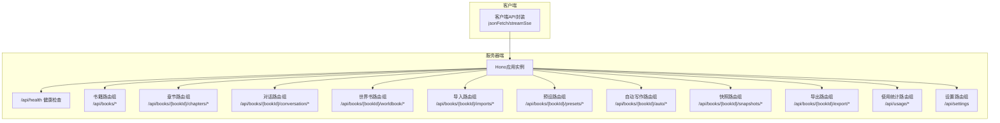
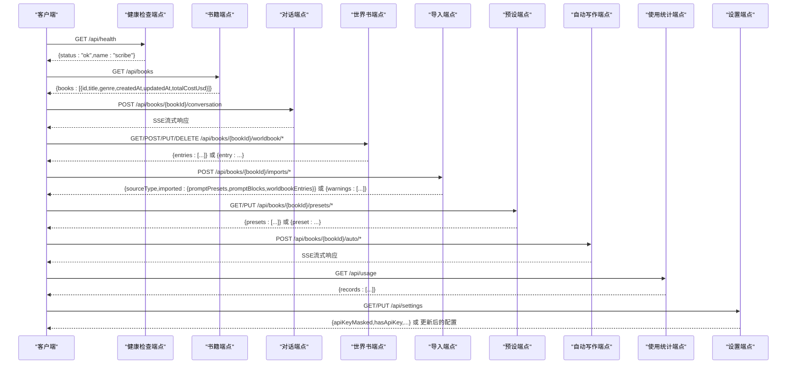
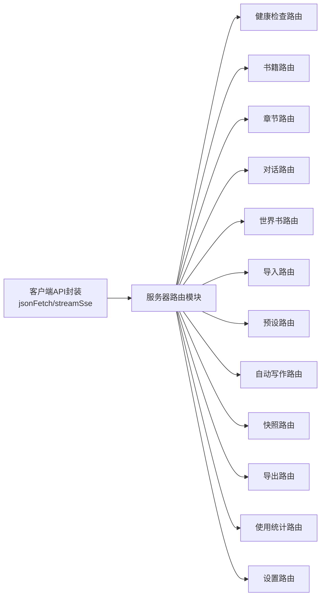

# API参考文档

<cite>
**本文档引用的文件**
- [packages/server/src/http/server.ts](file://packages/server/src/http/server.ts)
- [packages/server/src/http/routes/usage.ts](file://packages/server/src/http/routes/usage.ts)
- [packages/client/src/api/client.ts](file://packages/client/src/api/client.ts)
- [packages/server/tests/unit/http/server.test.ts](file://packages/server/tests/unit/http/server.test.ts)
</cite>

## 目录
1. [简介](#简介)
2. [项目结构](#项目结构)
3. [核心组件](#核心组件)
4. [架构概览](#架构概览)
5. [详细组件分析](#详细组件分析)
6. [依赖关系分析](#依赖关系分析)
7. [性能考虑](#性能考虑)
8. [故障排除指南](#故障排除指南)
9. [结论](#结论)
10. [附录](#附录)

## 简介
本文件为Scribe项目的完整API参考文档，基于实际代码实现生成。Scribe是一个支持书籍管理、对话交互、世界书（Worldbook）管理、导入导出等能力的写作辅助系统。本文档详细描述了所有RESTful API端点，包括HTTP方法、URL模式、请求/响应格式、认证方式、参数说明、返回值格式、错误处理策略，并提供了cURL示例和客户端实现指南。

## 项目结构
Scribe采用前后端分离架构：
- 服务器端基于Hono框架，通过路由模块化组织功能模块（书籍、章节、对话、世界书、导入导出、使用统计等）
- 客户端封装了统一的fetch调用、JSON序列化、SSE流式消费以及错误分类处理
- 单元测试验证了基础健康检查端点的行为



**图表来源**
- [packages/server/src/http/server.ts:39-88](file://packages/server/src/http/server.ts#L39-L88)

**章节来源**
- [packages/server/src/http/server.ts:1-89](file://packages/server/src/http/server.ts#L1-L89)

## 核心组件
- Hono应用实例：集中注册所有路由，提供健康检查、书籍管理、章节操作、对话接口、世界书管理、导入导出、设置管理、使用统计等功能
- 客户端API封装：统一处理JSON请求/响应、错误分类、SSE流式消费，提供类型安全的接口定义
- 路由模块：按功能域划分，如书籍、章节、对话、世界书、导入导出、自动写作、快照、导出、使用统计、设置等

**章节来源**
- [packages/server/src/http/server.ts:39-88](file://packages/server/src/http/server.ts#L39-L88)
- [packages/client/src/api/client.ts:165-275](file://packages/client/src/api/client.ts#L165-L275)

## 架构概览
Scribe的API采用RESTful设计，遵循以下原则：
- 使用标准HTTP方法（GET/POST/PUT/DELETE）
- URL采用层级结构，以书籍ID作为路径参数
- 请求体和响应体均为JSON格式
- 错误响应包含错误信息和错误类别，便于前端统一处理
- 对话和自动写作支持SSE流式输出



**图表来源**
- [packages/server/src/http/server.ts:48-88](file://packages/server/src/http/server.ts#L48-L88)
- [packages/client/src/api/client.ts:165-275](file://packages/client/src/api/client.ts#L165-L275)

## 详细组件分析

### 健康检查
- 端点：GET /api/health
- 功能：返回服务健康状态
- 认证：无需认证
- 请求：无
- 响应：包含状态和名称的对象
- 错误：无特定错误码
- cURL示例：
  ```bash
  curl -X GET http://localhost:8080/api/health
  ```

**章节来源**
- [packages/server/src/http/server.ts:48](file://packages/server/src/http/server.ts#L48)
- [packages/server/tests/unit/http/server.test.ts:5-10](file://packages/server/tests/unit/http/server.test.ts#L5-L10)

### 书籍管理
- 端点：GET /api/books
- 功能：列出所有书籍摘要
- 认证：无需认证
- 请求：无
- 响应：书籍数组，包含ID、标题、类型、创建时间、更新时间、总费用
- 错误：无特定错误码
- cURL示例：
  ```bash
  curl -X GET http://localhost:8080/api/books
  ```

- 端点：POST /api/books
- 功能：创建新书籍
- 认证：无需认证
- 请求体：包含标题和类型的对象
- 响应：创建的书籍摘要
- 错误：无特定错误码
- cURL示例：
  ```bash
  curl -X POST http://localhost:8080/api/books \
    -H "Content-Type: application/json" \
    -d '{"title":"示例","genre":"小说"}'
  ```

- 端点：GET /api/books/{bookId}/onboard-status
- 功能：获取书籍引导状态
- 认证：无需认证
- 请求：无
- 响应：包含引导状态的对象
- 错误：无特定错误码
- cURL示例：
  ```bash
  curl -X GET http://localhost:8080/api/books/{bookId}/onboard-status
  ```

- 端点：POST /api/books/{bookId}/onboard/skip
- 功能：跳过书籍引导
- 认证：无需认证
- 请求：无
- 响应：无
- 错误：无特定错误码
- cURL示例：
  ```bash
  curl -X POST http://localhost:8080/api/books/{bookId}/onboard/skip
  ```

- 端点：DELETE /api/books/{bookId}
- 功能：删除书籍（预留接口）
- 认证：无需认证
- 请求：无
- 响应：无
- 错误：无特定错误码
- cURL示例：
  ```bash
  curl -X DELETE http://localhost:8080/api/books/{bookId}
  ```

**章节来源**
- [packages/client/src/api/client.ts:166-185](file://packages/client/src/api/client.ts#L166-L185)

### 对话接口
- 端点：POST /api/books/{bookId}/conversation
- 功能：发起对话，支持流式响应
- 认证：无需认证
- 请求体：对话消息及相关参数
- 响应：SSE流式响应，事件类型包含生成内容
- 错误：HTTP 4xx/5xx时返回错误信息
- cURL示例：
  ```bash
  curl -N -X POST http://localhost:8080/api/books/{bookId}/conversation \
    -H "Content-Type: application/json" \
    -d '{"messages":[{"role":"user","content":"你好"}]}'
  ```

**章节来源**
- [packages/server/src/http/server.ts:49-56](file://packages/server/src/http/server.ts#L49-L56)
- [packages/client/src/api/client.ts:285-330](file://packages/client/src/api/client.ts#L285-L330)

### 世界书管理
- 端点：GET /api/books/{bookId}/worldbook
- 功能：列出世界书条目
- 认证：无需认证
- 请求：无
- 响应：世界书条目数组
- 错误：无特定错误码
- cURL示例：
  ```bash
  curl -X GET http://localhost:8080/api/books/{bookId}/worldbook
  ```

- 端点：POST /api/books/{bookId}/worldbook
- 功能：创建世界书条目
- 认证：无需认证
- 请求体：标题和内容必填，其他字段可选
- 响应：创建的世界书条目
- 错误：无特定错误码
- cURL示例：
  ```bash
  curl -X POST http://localhost:8080/api/books/{bookId}/worldbook \
    -H "Content-Type: application/json" \
    -d '{"title":"示例条目","content":"条目内容"}'
  ```

- 端点：PUT /api/books/{bookId}/worldbook/{entryId}
- 功能：更新世界书条目
- 认证：无需认证
- 请求体：部分字段更新
- 响应：更新后的世界书条目
- 错误：无特定错误码
- cURL示例：
  ```bash
  curl -X PUT http://localhost:8080/api/books/{bookId}/worldbook/{entryId} \
    -H "Content-Type: application/json" \
    -d '{"enabled":true}'
  ```

- 端点：DELETE /api/books/{bookId}/worldbook/{entryId}
- 功能：删除世界书条目
- 认证：无需认证
- 请求：无
- 响应：无
- 错误：无特定错误码
- cURL示例：
  ```bash
  curl -X DELETE http://localhost:8080/api/books/{bookId}/worldbook/{entryId}
  ```

- 端点：POST /api/books/{bookId}/worldbook/preview
- 功能：预览世界书匹配结果
- 认证：无需认证
- 请求体：查询文本、额外文本、令牌预算等
- 响应：包含选择/丢弃条目、诊断信息和渲染结果
- 错误：无特定错误码
- cURL示例：
  ```bash
  curl -X POST http://localhost:8080/api/books/{bookId}/worldbook/preview \
    -H "Content-Type: application/json" \
    -d '{"query":"示例查询","extraText":[],"tokenBudget":null}'
  ```

**章节来源**
- [packages/client/src/api/client.ts:186-218](file://packages/client/src/api/client.ts#L186-L218)
- [packages/client/src/api/client.ts:266-274](file://packages/client/src/api/client.ts#L266-L274)

### 导入导出
- 端点：POST /api/books/{bookId}/imports/preview
- 功能：导入预览
- 认证：无需认证
- 请求体：文件名和JSON数据
- 响应：导入预览结果，包含源类型、源名称、统计数据和警告
- 错误：无特定错误码
- cURL示例：
  ```bash
  curl -X POST http://localhost:8080/api/books/{bookId}/imports/preview \
    -H "Content-Type: application/json" \
    -d '{"filename":"example.json","json":{}}'
  ```

- 端点：POST /api/books/{bookId}/imports
- 功能：执行导入
- 认证：无需认证
- 请求体：文件名和JSON数据
- 响应：导入结果，包含各类实体的导入数量
- 错误：无特定错误码
- cURL示例：
  ```bash
  curl -X POST http://localhost:8080/api/books/{bookId}/imports \
    -H "Content-Type: application/json" \
    -d '{"filename":"example.json","json":{}}'
  ```

- 端点：GET /api/books/{bookId}/export
- 功能：导出书籍数据
- 认证：无需认证
- 请求：无
- 响应：导出的数据
- 错误：无特定错误码
- cURL示例：
  ```bash
  curl -X GET http://localhost:8080/api/books/{bookId}/export
  ```

**章节来源**
- [packages/client/src/api/client.ts:219-236](file://packages/client/src/api/client.ts#L219-L236)
- [packages/server/src/http/server.ts:82-84](file://packages/server/src/http/server.ts#L82-L84)

### 设置管理
- 端点：GET /api/settings
- 功能：获取全局设置
- 认证：无需认证
- 请求：无
- 响应：包含配置信息和API密钥掩码状态
- 错误：服务未就绪时返回503
- cURL示例：
  ```bash
  curl -X GET http://localhost:8080/api/settings
  ```

- 端点：PUT /api/settings
- 功能：更新全局设置
- 认证：无需认证
- 请求体：可选的预算上限、提供商、写入模型ID等
- 响应：更新后的配置
- 错误：服务未就绪时返回503
- cURL示例：
  ```bash
  curl -X PUT http://localhost:8080/api/settings \
    -H "Content-Type: application/json" \
    -d '{"singleBudgetUsd":10,"provider":"mimo","writeModelId":"model-id"}'
  ```

**章节来源**
- [packages/server/src/http/routes/usage.ts:41-66](file://packages/server/src/http/routes/usage.ts#L41-L66)

### 使用统计
- 端点：GET /api/usage
- 功能：获取最近的令牌使用记录
- 认证：无需认证
- 查询参数：limit（默认50，最大200）
- 响应：使用记录数组
- 错误：无特定错误码
- cURL示例：
  ```bash
  curl -X GET "http://localhost:8080/api/usage?limit=50"
  ```

**章节来源**
- [packages/server/src/http/routes/usage.ts:35-38](file://packages/server/src/http/routes/usage.ts#L35-L38)

### 预设管理
- 端点：GET /api/books/{bookId}/presets
- 功能：列出预设
- 认证：无需认证
- 请求：无
- 响应：预设数组
- 错误：无特定错误码
- cURL示例：
  ```bash
  curl -X GET http://localhost:8080/api/books/{bookId}/presets
  ```

- 端点：PUT /api/books/{bookId}/presets/{presetId}
- 功能：更新预设
- 认证：无需认证
- 请求体：部分字段更新
- 响应：更新后的预设
- 错误：无特定错误码
- cURL示例：
  ```bash
  curl -X PUT http://localhost:8080/api/books/{bookId}/presets/{presetId} \
    -H "Content-Type: application/json" \
    -d '{"enabled":true}'
  ```

- 端点：PUT /api/books/{bookId}/presets/{presetId}/blocks/{blockId}
- 功能：更新预设块
- 认证：无需认证
- 请求体：部分字段更新
- 响应：更新后的块
- 错误：无特定错误码
- cURL示例：
  ```bash
  curl -X PUT http://localhost:8080/api/books/{bookId}/presets/{presetId}/blocks/{blockId} \
    -H "Content-Type: application/json" \
    -d '{"content":"更新内容"}'
  ```

**章节来源**
- [packages/client/src/api/client.ts:237-265](file://packages/client/src/api/client.ts#L237-L265)

### 自动写作
- 端点：POST /api/books/{bookId}/auto/generate
- 功能：自动生成内容，支持流式响应
- 认证：无需认证
- 请求体：生成参数
- 响应：SSE流式响应
- 错误：HTTP 4xx/5xx时返回错误信息
- cURL示例：
  ```bash
  curl -N -X POST http://localhost:8080/api/books/{bookId}/auto/generate \
    -H "Content-Type: application/json" \
    -d '{}'
  ```

**章节来源**
- [packages/server/src/http/server.ts:65-74](file://packages/server/src/http/server.ts#L65-L74)
- [packages/client/src/api/client.ts:285-330](file://packages/client/src/api/client.ts#L285-L330)

### 快照管理
- 端点：GET /api/books/{bookId}/snapshots
- 功能：列出快照
- 认证：无需认证
- 请求：无
- 响应：快照列表
- 错误：无特定错误码
- cURL示例：
  ```bash
  curl -X GET http://localhost:8080/api/books/{bookId}/snapshots
  ```

**章节来源**
- [packages/server/src/http/server.ts:82-83](file://packages/server/src/http/server.ts#L82-L83)

## 依赖关系分析
- 客户端API封装依赖浏览器fetch和SSE流式传输
- 服务器端基于Hono框架，路由模块间松耦合
- 错误处理在客户端统一进行，支持网络错误、认证错误、限流错误、服务不可用、资源不存在、预算超限等场景



**图表来源**
- [packages/client/src/api/client.ts:165-275](file://packages/client/src/api/client.ts#L165-L275)
- [packages/server/src/http/server.ts:39-88](file://packages/server/src/http/server.ts#L39-L88)

**章节来源**
- [packages/client/src/api/client.ts:136-163](file://packages/client/src/api/client.ts#L136-L163)
- [packages/server/src/http/server.ts:39-88](file://packages/server/src/http/server.ts#L39-L88)

## 性能考虑
- 令牌使用统计的limit参数限制了单次查询的数据量，默认50，最大200，避免一次性返回过多数据
- SSE流式响应适用于长耗时任务，减少内存占用和等待时间
- 建议客户端对高频请求进行本地缓存，减少不必要的网络往返

**章节来源**
- [packages/server/src/http/routes/usage.ts:35-38](file://packages/server/src/http/routes/usage.ts#L35-L38)

## 故障排除指南
- 网络错误：检查网络连接，确认服务可达性
- 认证错误：确认API密钥有效且未过期
- 限流错误：降低请求频率，遵守服务端限速策略
- 服务不可用：检查服务是否已正确初始化并配置模型
- 资源不存在：确认路径参数（如书籍ID）正确
- 预算超限：调整单次预算上限或分批处理

常见错误映射：
- auth：API密钥无效或过期
- rate_limit：请求过于频繁
- not_found：资源不存在
- service_unavailable：服务未就绪
- network：网络不可用
- budget_exceeded：超过单次预算上限

**章节来源**
- [packages/client/src/api/client.ts:4-16](file://packages/client/src/api/client.ts#L4-L16)
- [packages/client/src/api/client.ts:136-163](file://packages/client/src/api/client.ts#L136-L163)

## 结论
本文档基于Scribe的实际代码实现了完整的API参考，涵盖了健康检查、书籍管理、对话接口、世界书管理、导入导出、设置管理、使用统计、预设管理、自动写作和快照管理等核心功能。建议在生产环境中结合具体的认证机制和限速策略进行部署，并根据业务需求扩展和优化API行为。

## 附录

### API版本控制
- 当前实现未显示明确的版本号或版本头
- 建议在请求头中添加版本信息以便未来演进

### 速率限制
- 代码中存在速率限制错误类别的定义，但具体限速策略未在当前实现中体现
- 建议在网关或中间件层实现统一的限速策略

### 安全考虑
- 当前示例未展示认证机制
- 建议在生产环境启用API密钥认证、CORS配置和输入验证

### 客户端实现指南
- 使用jsonFetch进行统一的HTTP请求封装
- 使用streamSse消费SSE流式响应
- 在UI中根据错误类别显示友好的提示信息
- 对高频请求进行本地缓存

### SDK使用示例
- 列出书籍：调用listBooks()
- 创建书籍：调用createBook()
- 获取世界书：调用listWorldbook()
- 创建世界书条目：调用createWorldbookEntry()
- 更新世界书条目：调用updateWorldbookEntry()
- 删除世界书条目：调用deleteWorldbookEntry()
- 预览世界书：调用previewWorldbook()
- 导入预览：调用previewImport()
- 执行导入：调用importJson()
- 获取预设：调用listPresets()
- 更新预设：调用updatePreset()
- 更新预设块：调用updatePromptBlock()

### API测试方法
- 使用单元测试验证健康检查端点
- 使用Playwright进行端到端测试
- 使用cURL手动验证各端点行为

**章节来源**
- [packages/server/tests/unit/http/server.test.ts:5-10](file://packages/server/tests/unit/http/server.test.ts#L5-L10)
- [packages/client/src/api/client.ts:165-275](file://packages/client/src/api/client.ts#L165-L275)