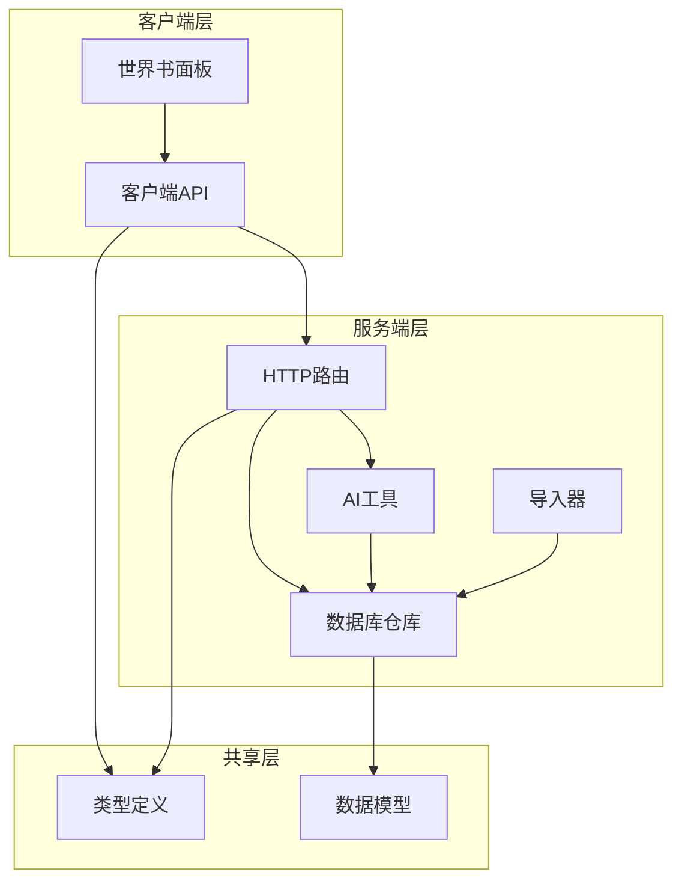
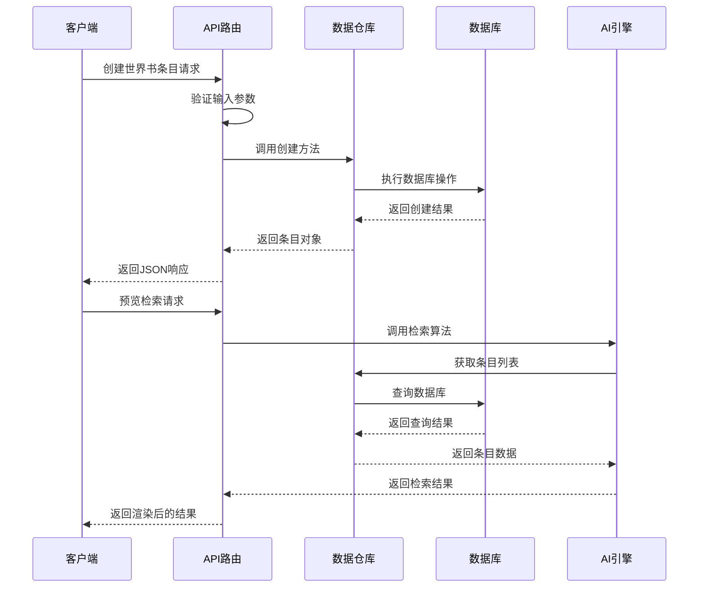
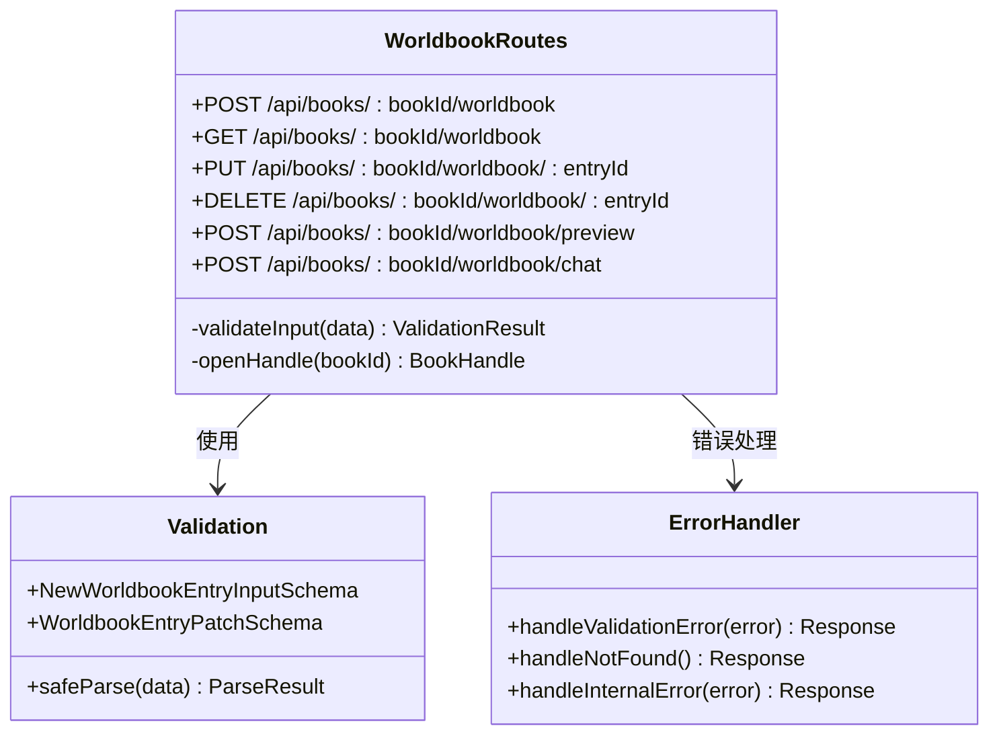
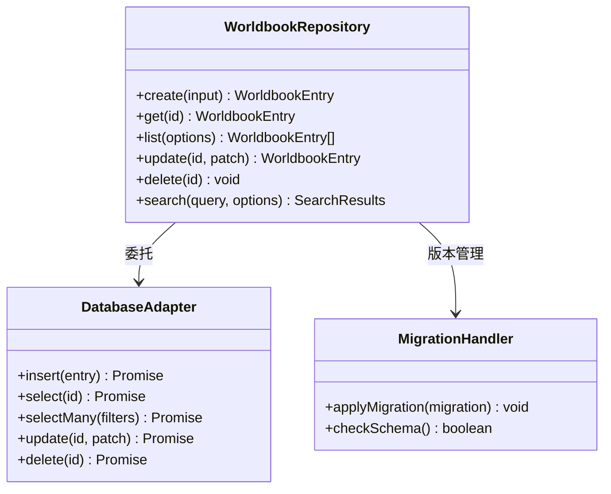
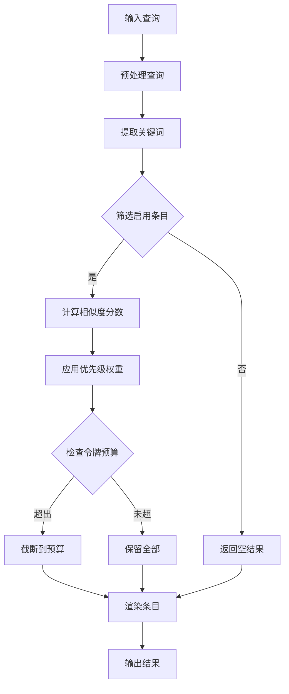
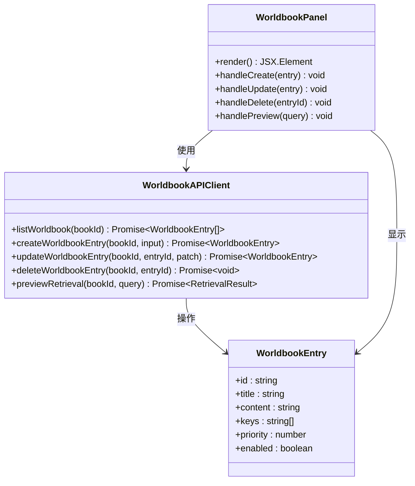
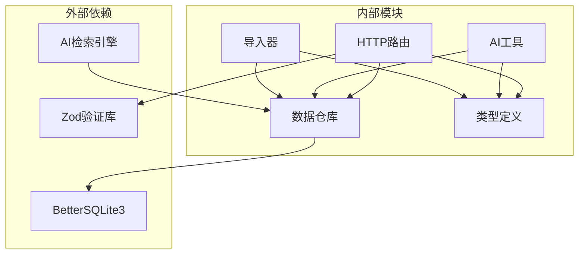

# 世界书管理端点

<cite>
**本文档引用的文件**
- [packages/server/src/http/routes/worldbook.ts](file://packages/server/src/http/routes/worldbook.ts)
- [packages/client/src/api/client.ts](file://packages/client/src/api/client.ts)
- [packages/shared/src/types/worldbook.ts](file://packages/shared/src/types/worldbook.ts)
- [packages/server/src/db/migrations/workspace/0008_worldbook.sql](file://packages/server/src/db/migrations/workspace/0008_worldbook.sql)
- [packages/server/src/db/repositories/worldbook.ts](file://packages/server/src/db/repositories/worldbook.ts)
- [packages/server/src/ai/worldbook/retrieval.ts](file://packages/server/src/ai/worldbook/retrieval.ts)
- [packages/server/src/ai/tools/worldbook-tools.ts](file://packages/server/src/ai/tools/worldbook-tools.ts)
- [packages/server/tests/integration/worldbook-routes.test.ts](file://packages/server/tests/integration/worldbook-routes.test.ts)
- [packages/server/src/ai/import/sillytavern-worldbook.ts](file://packages/server/src/ai/import/sillytavern-worldbook.ts)
- [packages/client/src/components/worldbook/worldbook-panel.tsx](file://packages/client/src/components/worldbook/worldbook-panel.tsx)
</cite>

## 目录
1. [简介](#简介)
2. [项目结构](#项目结构)
3. [核心组件](#核心组件)
4. [架构概览](#架构概览)
5. [详细组件分析](#详细组件分析)
6. [依赖分析](#依赖分析)
7. [性能考虑](#性能考虑)
8. [故障排除指南](#故障排除指南)
9. [结论](#结论)

## 简介

Scribe项目的世界书管理API端点提供了完整的虚拟世界构建和管理功能。该系统允许用户创建、组织、检索和管理虚拟世界中的各种条目，包括场景描述、角色信息、地点设定等。世界书功能支持AI驱动的内容生成和检索，为用户提供智能化的创作辅助。

## 项目结构

世界书管理功能分布在多个包中，采用分层架构设计：

**图表来源**
- [packages/server/src/http/routes/worldbook.ts:1-150](file://packages/server/src/http/routes/worldbook.ts#L1-L150)
- [packages/client/src/api/client.ts:180-250](file://packages/client/src/api/client.ts#L180-L250)
- [packages/shared/src/types/worldbook.ts:1-200](file://packages/shared/src/types/worldbook.ts#L1-L200)

**章节来源**
- [packages/server/src/http/routes/worldbook.ts:1-150](file://packages/server/src/http/routes/worldbook.ts#L1-L150)
- [packages/client/src/api/client.ts:180-250](file://packages/client/src/api/client.ts#L180-L250)
- [packages/shared/src/types/worldbook.ts:1-200](file://packages/shared/src/types/worldbook.ts#L1-L200)

## 核心组件

### 数据模型定义

世界书条目采用灵活的数据模型设计，支持多种字段组合：

| 字段名称 | 类型 | 必填 | 描述 | 默认值 |
|---------|------|------|------|--------|
| id | string | 是 | 条目唯一标识符 | 自动生成 |
| title | string | 是 | 条目标题 | - |
| content | string | 是 | 条目内容文本 | - |
| keys | string[] | 否 | 关键词数组，用于检索 | [] |
| priority | number | 否 | 检索优先级 | 0 |
| enabled | boolean | 否 | 是否启用 | true |
| recursive | boolean | 否 | 是否递归检索 | false |
| recursionLimit | number | 否 | 递归限制层级 | 0 |
| createdAt | Date | 否 | 创建时间 | 当前时间 |
| updatedAt | Date | 否 | 更新时间 | 当前时间 |

### API端点概览

系统提供以下主要API端点：

1. **创建世界书条目**: `POST /api/books/{bookId}/worldbook`
2. **列出所有条目**: `GET /api/books/{bookId}/worldbook`
3. **更新条目**: `PUT /api/books/{bookId}/worldbook/{entryId}`
4. **删除条目**: `DELETE /api/books/{bookId}/worldbook/{entryId}`
5. **预览检索**: `POST /api/books/{bookId}/worldbook/preview`
6. **聊天集成**: `POST /api/books/{bookId}/worldbook/chat`

**章节来源**
- [packages/shared/src/types/worldbook.ts:1-200](file://packages/shared/src/types/worldbook.ts#L1-L200)
- [packages/server/src/http/routes/worldbook.ts:38-98](file://packages/server/src/http/routes/worldbook.ts#L38-L98)

## 架构概览

世界书系统的整体架构采用模块化设计，各组件职责清晰分离：

**图表来源**
- [packages/server/src/http/routes/worldbook.ts:38-98](file://packages/server/src/http/routes/worldbook.ts#L38-L98)
- [packages/server/src/db/repositories/worldbook.ts:1-200](file://packages/server/src/db/repositories/worldbook.ts#L1-L200)
- [packages/server/src/ai/worldbook/retrieval.ts:1-200](file://packages/server/src/ai/worldbook/retrieval.ts#L1-L200)

## 详细组件分析

### HTTP路由层

路由层负责处理HTTP请求和响应，提供RESTful API接口：

**图表来源**
- [packages/server/src/http/routes/worldbook.ts:38-98](file://packages/server/src/http/routes/worldbook.ts#L38-L98)

### 数据仓库层

数据仓库层提供持久化存储和数据访问功能：

**图表来源**
- [packages/server/src/db/repositories/worldbook.ts:1-200](file://packages/server/src/db/repositories/worldbook.ts#L1-L200)
- [packages/server/src/db/migrations/workspace/0008_worldbook.sql:1-200](file://packages/server/src/db/migrations/workspace/0008_worldbook.sql#L1-L200)

### AI检索引擎

AI检索引擎提供智能的条目匹配和排序功能：

**图表来源**
- [packages/server/src/ai/worldbook/retrieval.ts:1-200](file://packages/server/src/ai/worldbook/retrieval.ts#L1-L200)

### 客户端集成

客户端提供完整的API封装和UI组件：

**图表来源**
- [packages/client/src/api/client.ts:180-250](file://packages/client/src/api/client.ts#L180-L250)
- [packages/client/src/components/worldbook/worldbook-panel.tsx:1-200](file://packages/client/src/components/worldbook/worldbook-panel.tsx#L1-L200)

**章节来源**
- [packages/server/src/http/routes/worldbook.ts:38-98](file://packages/server/src/http/routes/worldbook.ts#L38-L98)
- [packages/server/src/db/repositories/worldbook.ts:1-200](file://packages/server/src/db/repositories/worldbook.ts#L1-L200)
- [packages/server/src/ai/worldbook/retrieval.ts:1-200](file://packages/server/src/ai/worldbook/retrieval.ts#L1-L200)
- [packages/client/src/api/client.ts:180-250](file://packages/client/src/api/client.ts#L180-L250)

## 依赖分析

系统各组件之间的依赖关系如下：

**图表来源**
- [packages/server/src/http/routes/worldbook.ts:1-50](file://packages/server/src/http/routes/worldbook.ts#L1-L50)
- [packages/server/src/db/repositories/worldbook.ts:1-50](file://packages/server/src/db/repositories/worldbook.ts#L1-L50)

**章节来源**
- [packages/server/src/http/routes/worldbook.ts:1-50](file://packages/server/src/http/routes/worldbook.ts#L1-L50)
- [packages/server/src/db/repositories/worldbook.ts:1-50](file://packages/server/src/db/repositories/worldbook.ts#L1-L50)

## 性能考虑

### 检索性能优化

1. **索引策略**: 为关键词字段建立全文索引
2. **缓存机制**: 缓存常用查询结果
3. **分页处理**: 大量数据时使用分页
4. **异步处理**: 大型操作使用异步执行

### 存储优化

1. **数据压缩**: 对大文本内容进行压缩存储
2. **增量更新**: 只更新变更的字段
3. **清理策略**: 定期清理无用的历史版本

## 故障排除指南

### 常见错误及解决方案

| 错误类型 | 错误码 | 可能原因 | 解决方案 |
|---------|--------|----------|----------|
| 输入验证失败 | 400 | 参数格式不正确 | 检查请求体格式 |
| 书籍不存在 | 404 | 书籍ID无效 | 确认书籍存在性 |
| 条目不存在 | 404 | 条目ID无效 | 检查条目ID |
| 内部错误 | 500 | 服务器异常 | 查看服务器日志 |

### 调试建议

1. **启用详细日志**: 在开发环境中启用详细日志记录
2. **单元测试**: 运行完整的测试套件
3. **集成测试**: 验证端到端流程
4. **性能监控**: 监控API响应时间和资源使用

**章节来源**
- [packages/server/tests/integration/worldbook-routes.test.ts:29-103](file://packages/server/tests/integration/worldbook-routes.test.ts#L29-L103)

## 结论

Scribe项目的世界书管理API端点提供了一个功能完整、架构清晰的虚拟世界构建平台。系统通过模块化的组件设计、严格的类型安全和完善的错误处理机制，为用户提供了可靠的创作工具。未来可以进一步扩展的功能包括批量操作、高级搜索、权限管理和多语言支持等。