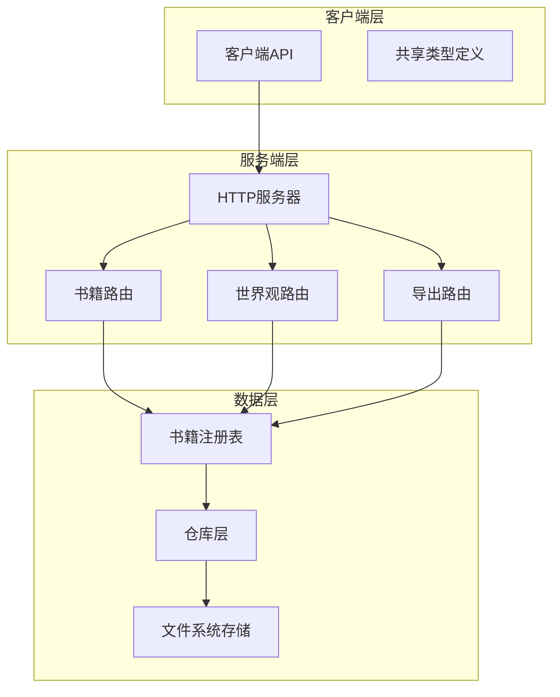
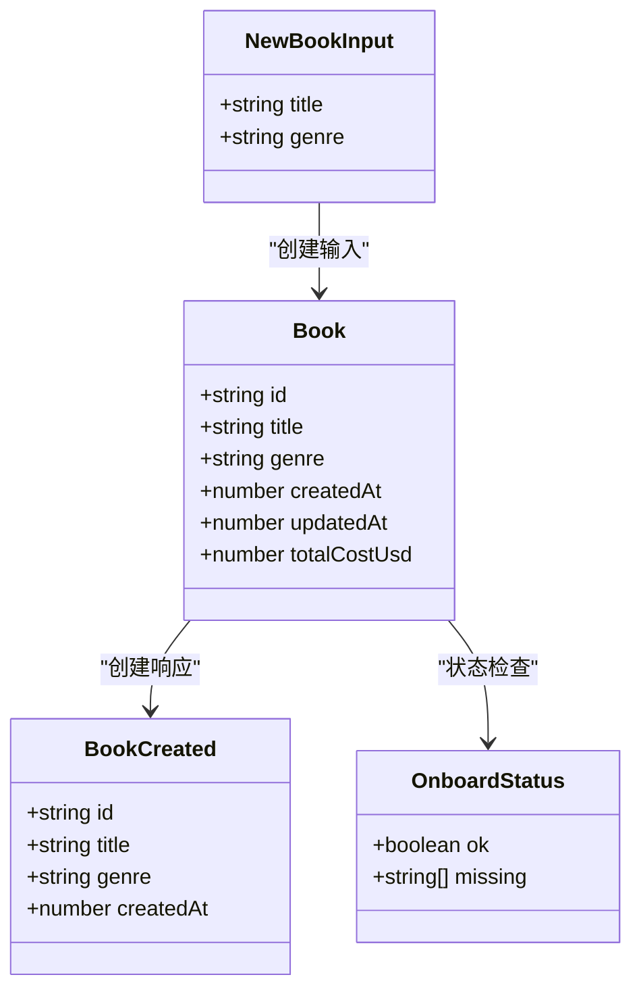
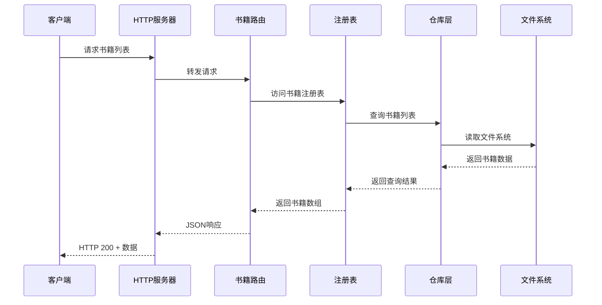
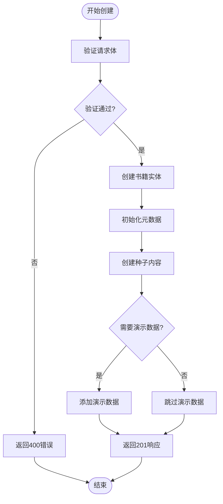
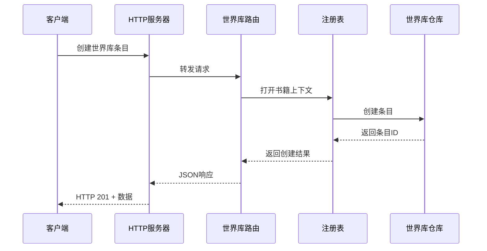
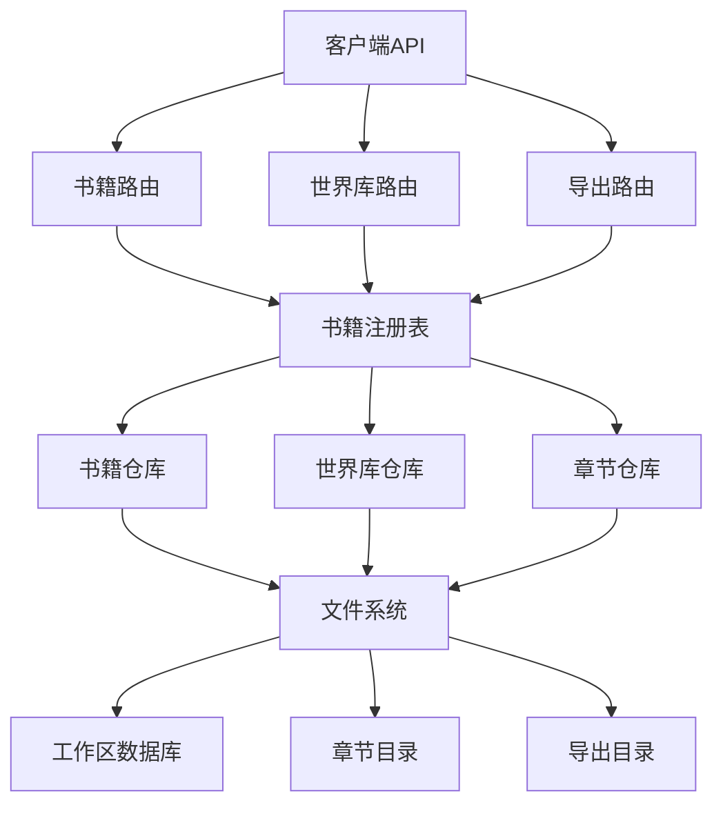
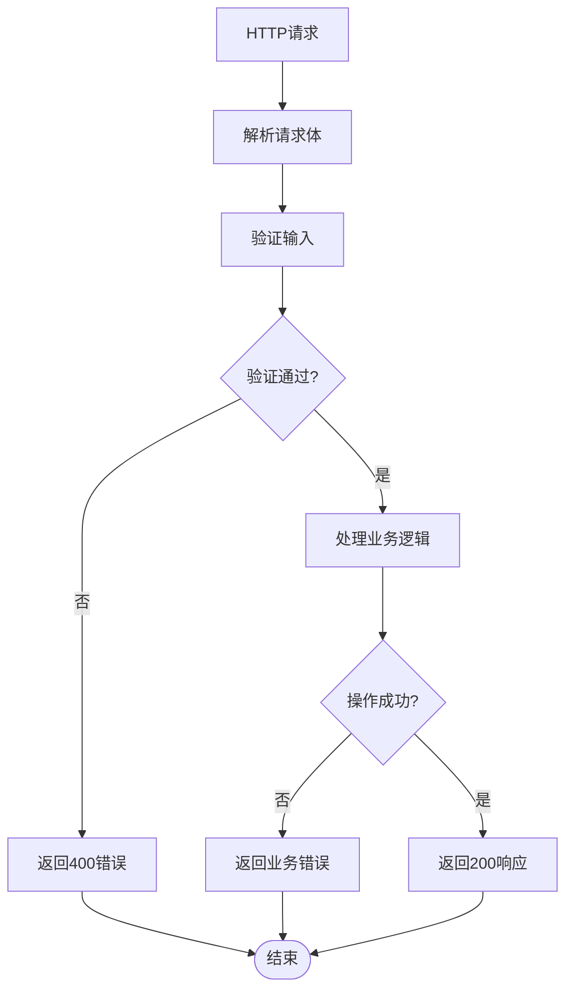
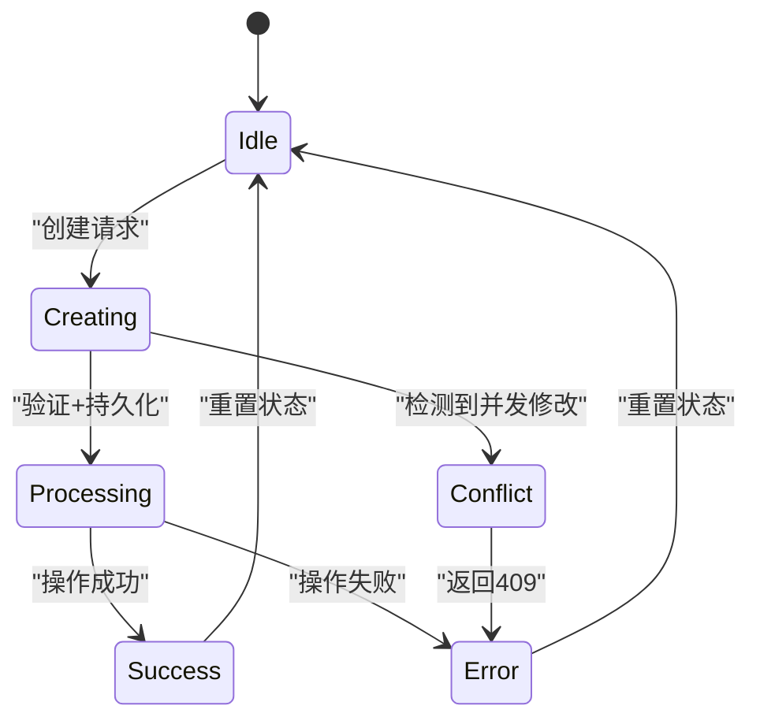

# 书籍管理端点

<cite>
**本文档引用的文件**
- [packages/client/src/api/client.ts](file://packages/client/src/api/client.ts)
- [packages/shared/src/types/book.ts](file://packages/shared/src/types/book.ts)
- [packages/server/src/http/routes/books.ts](file://packages/server/src/http/routes/books.ts)
- [packages/server/tests/integration/books-routes.test.ts](file://packages/server/tests/integration/books-routes.test.ts)
- [packages/server/src/http/server.ts](file://packages/server/src/http/server.ts)
- [packages/server/src/http/routes/worldbook.ts](file://packages/server/src/http/routes/worldbook.ts)
- [packages/server/src/http/routes/export.ts](file://packages/server/src/http/routes/export.ts)
</cite>

## 目录
1. [简介](#简介)
2. [项目结构](#项目结构)
3. [核心组件](#核心组件)
4. [架构概览](#架构概览)
5. [详细组件分析](#详细组件分析)
6. [依赖关系分析](#依赖关系分析)
7. [性能考虑](#性能考虑)
8. [故障排除指南](#故障排除指南)
9. [结论](#结论)

## 简介

本文档为Scribe项目的书籍管理API端点提供完整的技术文档。Scribe是一个AI驱动的小说写作助手，书籍管理功能是其核心模块之一。该文档详细记录了书籍的CRUD操作端点，包括创建、读取、更新和删除功能，涵盖书籍元数据管理、章节关联、状态控制和权限验证。

## 项目结构

Scribe项目采用多包架构，书籍管理功能主要分布在以下模块中：



**图表来源**
- [packages/server/src/http/server.ts:52-88](file://packages/server/src/http/server.ts#L52-L88)
- [packages/server/src/http/routes/books.ts:33-72](file://packages/server/src/http/routes/books.ts#L33-L72)

**章节来源**
- [packages/server/src/http/server.ts:52-88](file://packages/server/src/http/server.ts#L52-L88)
- [packages/client/src/api/client.ts:165-181](file://packages/client/src/api/client.ts#L165-L181)

## 核心组件

### 书籍数据模型

书籍系统基于以下核心数据结构：



**图表来源**
- [packages/shared/src/types/book.ts:1-17](file://packages/shared/src/types/book.ts#L1-L17)

### API端点概览

| HTTP方法 | URL模式 | 功能描述 | 权限要求 |
|---------|---------|----------|----------|
| GET | `/api/books` | 获取书籍列表 | 需要认证 |
| POST | `/api/books` | 创建新书籍 | 需要认证 |
| GET | `/api/books/:bookId/onboard-status` | 检查引导状态 | 需要认证 |
| POST | `/api/books/:bookId/onboard` | 开始引导流程 | 需要认证 |
| POST | `/api/books/:bookId/onboard/skip` | 跳过引导流程 | 需要认证 |
| DELETE | `/api/books/:bookId` | 删除书籍 | 需要认证 |

**章节来源**
- [packages/server/src/http/routes/books.ts:33-72](file://packages/server/src/http/routes/books.ts#L33-L72)
- [packages/client/src/api/client.ts:182-184](file://packages/client/src/api/client.ts#L182-L184)

## 架构概览

Scribe的书籍管理系统采用分层架构设计，实现了清晰的关注点分离：



**图表来源**
- [packages/server/src/http/server.ts:58-59](file://packages/server/src/http/server.ts#L58-L59)
- [packages/server/src/http/routes/books.ts:60-63](file://packages/server/src/http/routes/books.ts#L60-L63)

## 详细组件分析

### 书籍创建端点

#### POST /api/books

**功能描述**: 创建新的书籍实例，初始化必要的元数据和工作空间。

**请求格式**:
```json
{
  "title": "字符串，必填，书籍标题",
  "genre": "字符串，可选，书籍题材"
}
```

**响应格式**:
```json
{
  "id": "字符串，书籍唯一标识符",
  "title": "字符串，书籍标题",
  "genre": "字符串，书籍题材或null",
  "createdAt": "数字，创建时间戳"
}
```

**处理流程**:
1. 验证请求体格式
2. 创建书籍实体
3. 初始化书籍元数据（title、genre）
4. 创建种子内容到世界库
5. 可能的演示数据种子
6. 返回创建结果



**图表来源**
- [packages/server/src/http/routes/books.ts:33-57](file://packages/server/src/http/routes/books.ts#L33-L57)

**章节来源**
- [packages/server/src/http/routes/books.ts:33-57](file://packages/server/src/http/routes/books.ts#L33-L57)
- [packages/server/tests/integration/books-routes.test.ts:48-93](file://packages/server/tests/integration/books-routes.test.ts#L48-L93)

### 书籍列表端点

#### GET /api/books

**功能描述**: 获取用户拥有的所有书籍列表。

**响应格式**:
```json
{
  "books": [
    {
      "id": "字符串，书籍ID",
      "title": "字符串，书籍标题",
      "genre": "字符串，书籍题材",
      "createdAt": "数字，创建时间戳",
      "updatedAt": "数字，更新时间戳",
      "totalCostUsd": "数字，总费用美元"
    }
  ]
}
```

**处理流程**:
1. 从注册表获取书籍仓库
2. 列出所有书籍
3. 返回JSON响应

**章节来源**
- [packages/server/src/http/routes/books.ts:60-63](file://packages/server/src/http/routes/books.ts#L60-L63)
- [packages/server/tests/integration/books-routes.test.ts:155-165](file://packages/server/tests/integration/books-routes.test.ts#L155-L165)

### 引导状态检查端点

#### GET /api/books/:bookId/onboard-status

**功能描述**: 检查指定书籍的引导完成状态，返回缺失的必需字段。

**响应格式**:
```json
{
  "ok": "布尔值，是否已完成引导",
  "missing": ["字符串数组，缺失的必需字段"]
}
```

**典型响应场景**:
- 新书：返回`ok: false`和缺失的4个项目
- 完成引导：返回`ok: true`和空数组

**章节来源**
- [packages/server/src/http/routes/books.ts:65-72](file://packages/server/src/http/routes/books.ts#L65-L72)
- [packages/server/tests/integration/books-routes.test.ts:168-189](file://packages/server/tests/integration/books-routes.test.ts#L168-L189)

### 引导流程端点

#### POST /api/books/:bookId/onboard

**功能描述**: 开始书籍引导流程，验证必需信息并标记完成。

**请求格式**:
```json
{
  "message": "字符串，引导确认消息"
}
```

**处理逻辑**:
1. 验证书籍存在性
2. 检查message参数
3. 执行引导流程
4. 返回处理结果

**章节来源**
- [packages/server/src/http/routes/books.ts:65-72](file://packages/server/src/http/routes/books.ts#L65-L72)

### 引导跳过端点

#### POST /api/books/:bookId/onboard/skip

**功能描述**: 跳过引导流程，直接初始化工作空间。

**处理逻辑**:
1. 验证书籍存在性
2. 跳过引导检查
3. 初始化工作空间
4. 返回成功响应

**章节来源**
- [packages/server/src/http/routes/books.ts:65-72](file://packages/server/src/http/routes/books.ts#L65-L72)
- [packages/server/tests/integration/books-routes.test.ts:191-193](file://packages/server/tests/integration/books-routes.test.ts#L191-L193)

### 世界库集成

虽然主要的书籍CRUD端点在`/api/books`下，但世界库功能与书籍管理紧密相关：



**图表来源**
- [packages/server/src/http/routes/worldbook.ts:38-44](file://packages/server/src/http/routes/worldbook.ts#L38-L44)

**章节来源**
- [packages/server/src/http/routes/worldbook.ts:38-44](file://packages/server/src/http/routes/worldbook.ts#L38-L44)

## 依赖关系分析

### 组件依赖图



**图表来源**
- [packages/server/src/http/server.ts:58-85](file://packages/server/src/http/server.ts#L58-L85)

### 错误处理机制

系统实现了统一的错误处理策略：



**错误分类**:
- 400 Bad Request: 输入验证失败
- 401/403 Unauthorized: 认证失败
- 404 Not Found: 资源不存在
- 409 Conflict: 资源冲突
- 429 Too Many Requests: 请求频率过高
- 500 Internal Server Error: 服务器内部错误

**章节来源**
- [packages/client/src/api/client.ts:147-162](file://packages/client/src/api/client.ts#L147-L162)

## 性能考虑

### 缓存策略

- **书籍列表缓存**: 建议在客户端实现短期缓存（5-10秒）
- **元数据缓存**: 书籍元数据变更频率较低，适合长期缓存
- **响应头优化**: 合理设置Cache-Control和ETag头

### 并发控制



### 性能优化建议

1. **批量操作**: 支持批量获取书籍信息
2. **分页支持**: 为书籍列表添加分页参数
3. **条件查询**: 实现基于标题、题材的筛选
4. **排序选项**: 支持按创建时间、更新时间排序

## 故障排除指南

### 常见问题诊断

**问题1: 创建书籍返回400错误**
- 检查请求体格式是否正确
- 确认title字段是否为空
- 验证请求头Content-Type设置

**问题2: 获取书籍列表为空**
- 确认用户认证状态
- 检查书籍是否正确创建
- 验证文件系统权限

**问题3: 引导状态检查异常**
- 确认bookId参数正确
- 检查书籍是否存在
- 验证引导流程状态

### 调试工具


**章节来源**
- [packages/server/tests/integration/books-routes.test.ts:48-193](file://packages/server/tests/integration/books-routes.test.ts#L48-L193)

## 结论

Scribe的书籍管理API提供了完整的CRUD操作能力，具有清晰的架构设计和完善的错误处理机制。系统支持书籍的生命周期管理，从创建到删除的全流程覆盖，并集成了引导流程和世界库功能。

主要优势：
- **模块化设计**: 清晰的分层架构便于维护和扩展
- **强类型支持**: TypeScript提供编译时类型安全
- **完整测试**: 全面的集成测试确保功能可靠性
- **错误处理**: 统一的错误处理策略提升用户体验

未来改进建议：
- 添加书籍搜索和过滤功能
- 实现版本控制和并发修改检测
- 增加批量操作支持
- 优化性能和缓存策略