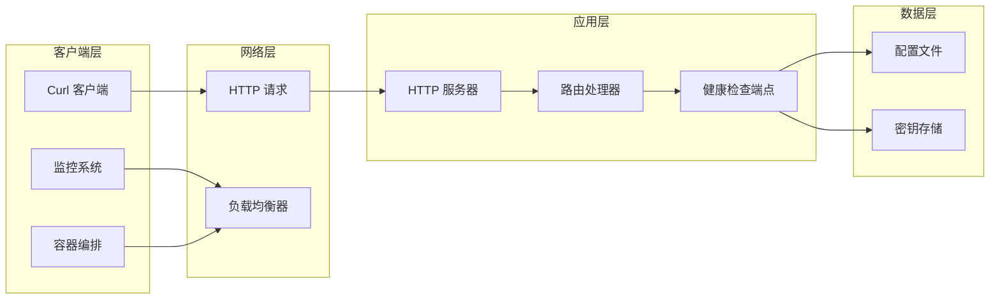
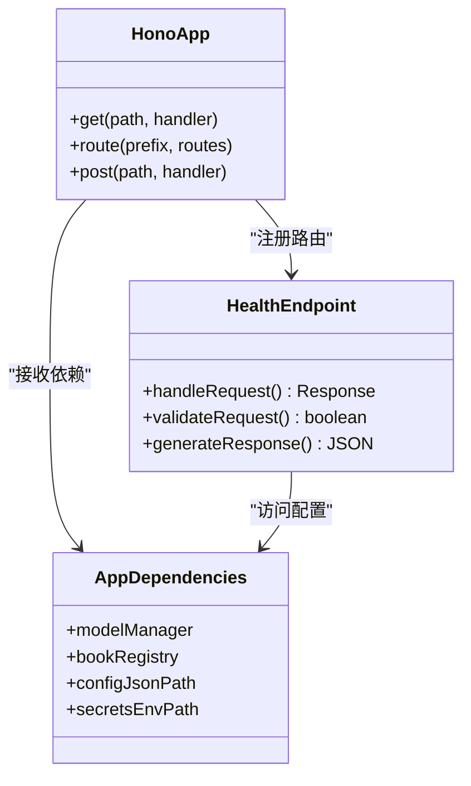
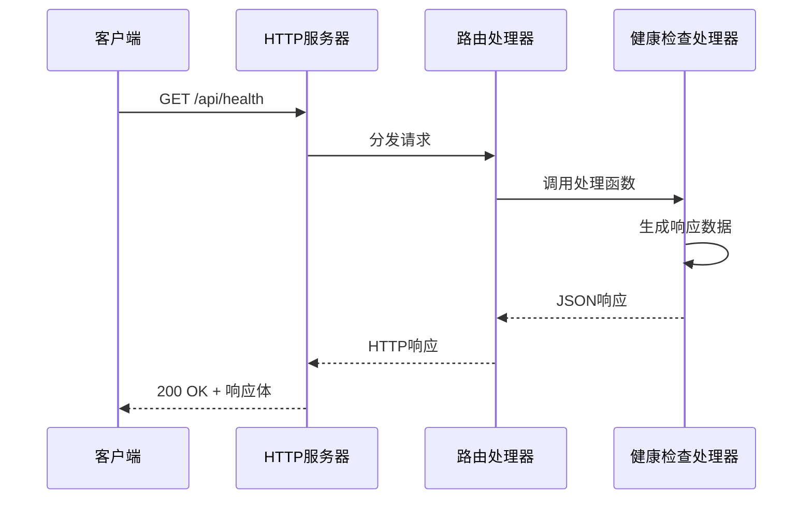
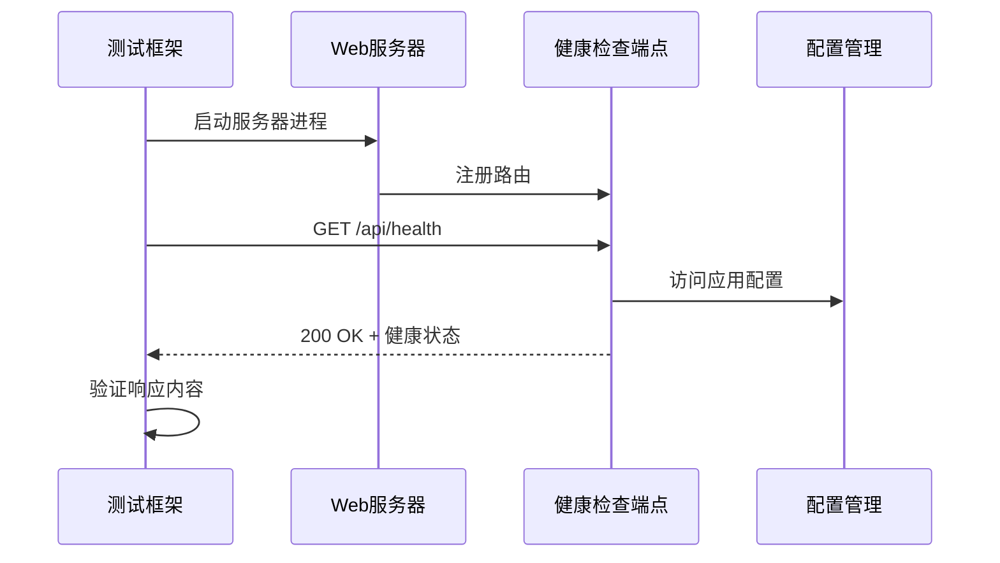
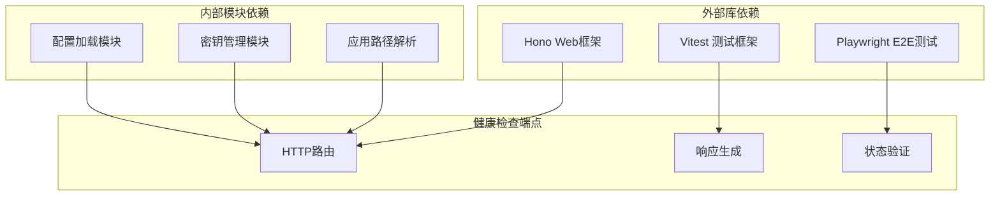
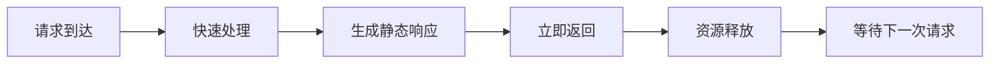
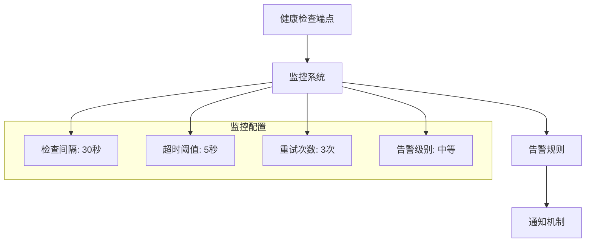

# 健康检查端点

<cite>
**本文档引用的文件**
- [packages/server/src/http/server.ts](file://packages/server/src/http/server.ts)
- [packages/server/tests/unit/http/server.test.ts](file://packages/server/tests/unit/http/server.test.ts)
- [e2e/playwright.config.ts](file://e2e/playwright.config.ts)
- [e2e/tests/core-journey.spec.ts](file://e2e/tests/core-journey.spec.ts)
- [packages/server/src/config/secrets.ts](file://packages/server/src/config/secrets.ts)
- [packages/server/src/config/load.ts](file://packages/server/src/config/load.ts)
</cite>

## 目录
1. [简介](#简介)
2. [项目结构](#项目结构)
3. [核心组件](#核心组件)
4. [架构概览](#架构概览)
5. [详细组件分析](#详细组件分析)
6. [依赖关系分析](#依赖关系分析)
7. [性能考虑](#性能考虑)
8. [故障排除指南](#故障排除指南)
9. [结论](#结论)
10. [附录](#附录)

## 简介

Scribe项目的健康检查API端点是一个简单的HTTP接口，用于验证服务器的运行状态。该端点实现了基本的健康检查功能，为容器编排系统、负载均衡器和监控工具提供服务可用性检测能力。

## 项目结构

健康检查端点位于服务器应用的核心路由中，采用简洁的设计模式：

```mermaid
graph TB
subgraph "服务器应用结构"
A[HTTP服务器] --> B[路由注册]
B --> C[/api/health 端点]
B --> D[其他业务路由]
subgraph "路由类型"
E[GET 请求]
F[JSON 响应]
G[状态码 200]
end
C --> E
C --> F
C --> G
end
```

**图表来源**
- [packages/server/src/http/server.ts:47-48](file://packages/server/src/http/server.ts#L47-L48)

**章节来源**
- [packages/server/src/http/server.ts:1-89](file://packages/server/src/http/server.ts#L1-L89)

## 核心组件

### 健康检查端点实现

健康检查端点采用极简设计，提供以下功能特性：

- **HTTP方法**: GET
- **路径**: `/api/health`
- **响应格式**: JSON对象
- **状态码**: 200 OK
- **响应内容**: 包含状态和名称字段的对象

### 响应格式规范

健康检查响应遵循统一的JSON格式：

| 字段名 | 数据类型 | 描述 | 示例值 |
|--------|----------|------|--------|
| status | string | 服务健康状态 | "ok" |
| name | string | 应用程序名称 | "scribe" |

### 健康状态判断逻辑

当前实现采用静态响应策略，所有请求都返回相同的成功状态。这种设计具有以下特点：

```mermaid
flowchart TD
A[收到 /api/health 请求] --> B{验证请求参数}
B --> C[忽略所有查询参数]
C --> D[生成固定响应体]
D --> E[返回状态码 200]
E --> F[响应内容: {status: "ok", name: "scribe"}]
```

**图表来源**
- [packages/server/src/http/server.ts:47-48](file://packages/server/src/http/server.ts#L47-L48)

**章节来源**
- [packages/server/src/http/server.ts:47-48](file://packages/server/src/http/server.ts#L47-L48)
- [packages/server/tests/unit/http/server.test.ts:5-10](file://packages/server/tests/unit/http/server.test.ts#L5-L10)

## 架构概览

健康检查端点在整个系统架构中的位置：



**图表来源**
- [packages/server/src/http/server.ts:39-89](file://packages/server/src/http/server.ts#L39-L89)

## 详细组件分析

### HTTP服务器集成

健康检查端点通过Hono框架集成到主服务器应用中：



**图表来源**
- [packages/server/src/http/server.ts:39-89](file://packages/server/src/http/server.ts#L39-L89)

### 端点处理流程

健康检查端点的请求处理流程：



**图表来源**
- [packages/server/src/http/server.ts:47-48](file://packages/server/src/http/server.ts#L47-L48)

### 测试验证机制

单元测试确保健康检查端点的正确性：

```mermaid
flowchart TD
A[启动测试套件] --> B[创建应用实例]
B --> C[发送HTTP请求]
C --> D{验证状态码}
D --> |200| E{验证响应体}
E --> |包含status字段| F{验证name字段}
F --> |等于"sribe"| G[测试通过]
D --> |非200| H[测试失败]
E --> |缺少字段| H
F --> |不等于期望值| H
```

**图表来源**
- [packages/server/tests/unit/http/server.test.ts:5-10](file://packages/server/tests/unit/http/server.test.ts#L5-L10)

**章节来源**
- [packages/server/tests/unit/http/server.test.ts:1-12](file://packages/server/tests/unit/http/server.test.ts#L1-L12)

### 端到端集成测试

端到端测试验证健康检查在完整应用环境中的表现：



**图表来源**
- [e2e/playwright.config.ts:16-25](file://e2e/playwright.config.ts#L16-L25)
- [e2e/tests/core-journey.spec.ts:9-12](file://e2e/tests/core-journey.spec.ts#L9-L12)

**章节来源**
- [e2e/playwright.config.ts:1-27](file://e2e/playwright.config.ts#L1-L27)
- [e2e/tests/core-journey.spec.ts:1-82](file://e2e/tests/core-journey.spec.ts#L1-L82)

## 依赖关系分析

### 外部依赖

健康检查端点的依赖关系相对简单：



**图表来源**
- [packages/server/src/http/server.ts:1-19](file://packages/server/src/http/server.ts#L1-L19)

### 内部耦合度

健康检查端点与其他模块的耦合度很低：

| 依赖类型 | 依赖模块 | 使用方式 | 影响程度 |
|----------|----------|----------|----------|
| 直接依赖 | Hono框架 | 路由注册 | 低 |
| 间接依赖 | 配置模块 | 应用初始化 | 无 |
| 无直接依赖 | 业务模块 | 不访问 | 无 |

**章节来源**
- [packages/server/src/http/server.ts:20-37](file://packages/server/src/http/server.ts#L20-L37)

## 性能考虑

### 响应时间特性

健康检查端点具有以下性能特征：

- **响应延迟**: 极低（毫秒级）
- **内存占用**: 基本不变
- **CPU消耗**: 可忽略不计
- **并发处理**: 支持高并发请求

### 资源使用模式



## 故障排除指南

### 常见问题诊断

| 问题类型 | 症状描述 | 可能原因 | 解决方案 |
|----------|----------|----------|----------|
| 404错误 | 无法找到端点 | 路由未注册 | 检查应用启动日志 |
| 500错误 | 服务器内部错误 | 应用崩溃 | 查看服务器错误日志 |
| 超时错误 | 请求超时 | 服务器无响应 | 检查服务器进程状态 |
| 响应格式错误 | JSON解析失败 | 响应内容异常 | 验证响应格式 |

### 调试步骤

1. **基础连通性测试**
   ```bash
   curl -I http://localhost:6789/api/health
   ```

2. **详细响应检查**
   ```bash
   curl -v http://localhost:6789/api/health
   ```

3. **响应内容验证**
   ```bash
   curl http://localhost:6789/api/health | jq '.'
   ```

### 监控集成建议



**章节来源**
- [e2e/tests/core-journey.spec.ts:9-12](file://e2e/tests/core-journey.spec.ts#L9-L12)

## 结论

Scribe项目的健康检查端点采用简洁而有效的设计，提供了可靠的服务可用性检测能力。虽然当前实现是静态响应，但其设计理念为未来的扩展奠定了良好基础。

### 主要优势

1. **实现简单**: 代码量少，维护成本低
2. **性能优异**: 响应速度快，资源消耗少
3. **易于测试**: 单元测试和端到端测试覆盖完善
4. **集成友好**: 与现有监控和部署工具兼容

### 改进建议

1. **动态健康检查**: 添加数据库连接检查
2. **依赖服务验证**: 验证外部API服务可用性
3. **自定义指标**: 提供更多健康状态信息
4. **配置化**: 支持健康检查行为的配置

## 附录

### API参考

**端点定义**
- **方法**: GET
- **路径**: `/api/health`
- **认证**: 无需认证
- **内容类型**: `application/json`

**成功响应**
- **状态码**: 200
- **响应体**: `{ "status": "ok", "name": "scribe" }`

**错误响应**
- **状态码**: 5xx（服务器错误）
- **响应体**: `{ "error": "服务器未就绪" }`

### 配置选项

当前健康检查端点支持以下配置：

| 配置项 | 类型 | 默认值 | 描述 |
|--------|------|--------|------|
| 端点路径 | string | "/api/health" | 健康检查API的访问路径 |
| 响应格式 | object | 固定JSON | 响应数据的结构定义 |
| 缓存控制 | boolean | false | 是否启用响应缓存 |

### curl命令示例

**基本健康检查**
```bash
curl http://localhost:6789/api/health
```

**带详细输出的检查**
```bash
curl -v http://localhost:6789/api/health
```

**自动化脚本示例**
```bash
#!/bin/bash
response=$(curl -s -o /dev/null -w "%{http_code}" http://localhost:6789/api/health)
if [ $response -eq 200 ]; then
    echo "服务健康"
else
    echo "服务不健康"
fi
```

### 自定义健康指标扩展

如需扩展健康检查功能，可以考虑以下方向：

1. **数据库连接检查**
2. **外部API服务验证**
3. **磁盘空间监控**
4. **内存使用率检查**
5. **自定义业务指标**

### 监控集成配置

**Prometheus集成示例**
```yaml
scrape_configs:
  - job_name: 'scribe-health'
    static_configs:
      - targets: ['localhost:6789']
    metrics_path: '/api/health'
    scrape_interval: 30s
```

**Kubernetes探针配置**
```yaml
livenessProbe:
  httpGet:
    path: /api/health
    port: 6789
  initialDelaySeconds: 30
  periodSeconds: 10

readinessProbe:
  httpGet:
    path: /api/health
    port: 6789
  initialDelaySeconds: 5
  periodSeconds: 5
```