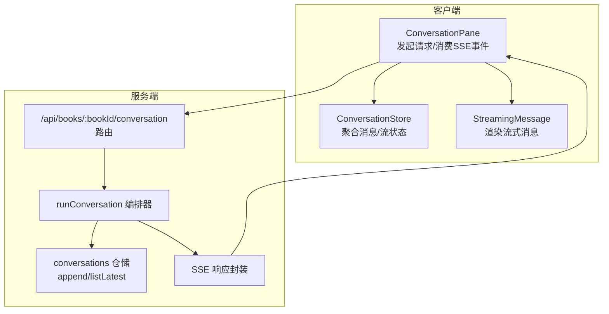
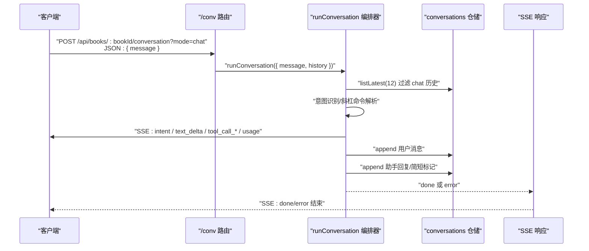
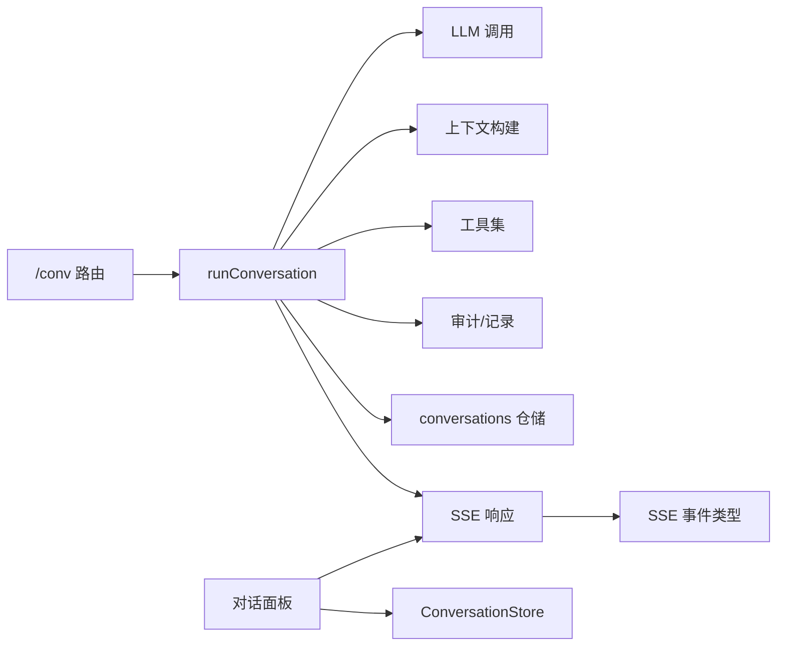

# 对话接口端点

<cite>
**本文引用的文件**
- [packages/server/src/http/routes/conversation.ts](file://packages/server/src/http/routes/conversation.ts)
- [packages/server/src/ai/orchestrator/conversation-orchestrator.ts](file://packages/server/src/ai/orchestrator/conversation-orchestrator.ts)
- [packages/server/src/db/repositories/conversations.ts](file://packages/server/src/db/repositories/conversations.ts)
- [packages/server/src/http/sse.ts](file://packages/server/src/http/sse.ts)
- [packages/shared/src/types/sse-events.ts](file://packages/shared/src/types/sse-events.ts)
- [packages/shared/src/types/conversation.ts](file://packages/shared/src/types/conversation.ts)
- [packages/client/src/components/conversation/conversation-pane.tsx](file://packages/client/src/components/conversation/conversation-pane.tsx)
- [packages/client/src/stores/conversation.ts](file://packages/client/src/stores/conversation.ts)
- [packages/client/src/components/conversation/streaming-message.tsx](file://packages/client/src/components/conversation/streaming-message.tsx)
</cite>

## 目录
1. [简介](#简介)
2. [项目结构](#项目结构)
3. [核心组件](#核心组件)
4. [架构总览](#架构总览)
5. [详细组件分析](#详细组件分析)
6. [依赖分析](#依赖分析)
7. [性能考虑](#性能考虑)
8. [故障排查指南](#故障排查指南)
9. [结论](#结论)
10. [附录](#附录)

## 简介
本文件面向 Scribe 项目的“对话接口”API 端点，聚焦于 /api/books/:bookId/conversation（统称为 /conv）端点的实现与使用。内容涵盖：
- 请求与响应：消息发送、历史获取、流式 SSE 响应
- 对话上下文管理：多轮历史回放、深层提示词前置、书本设定注入
- 消息持久化与会话状态：用户/助手消息写入、章节提交后的简化记录
- WebSocket/SSE 连接与事件处理：SSE 事件类型、错误与完成信号
- 流式响应细节、错误重连与超时处理建议
- 客户端集成示例与最佳实践
- 对话记忆存储策略与性能优化

## 项目结构
围绕 /conv 的服务端与客户端关键文件如下：
- 服务端路由与编排
  - 路由定义与入口：[packages/server/src/http/routes/conversation.ts](file://packages/server/src/http/routes/conversation.ts)
  - 对话编排器：[packages/server/src/ai/orchestrator/conversation-orchestrator.ts](file://packages/server/src/ai/orchestrator/conversation-orchestrator.ts)
  - SSE 响应封装：[packages/server/src/http/sse.ts](file://packages/server/src/http/sse.ts)
  - 对话事件类型：[packages/shared/src/types/sse-events.ts](file://packages/shared/src/types/sse-events.ts)
  - 对话消息类型：[packages/shared/src/types/conversation.ts](file://packages/shared/src/types/conversation.ts)
  - 对话历史仓储：[packages/server/src/db/repositories/conversations.ts](file://packages/server/src/db/repositories/conversations.ts)
- 客户端交互与状态
  - 对话面板与流式处理：[packages/client/src/components/conversation/conversation-pane.tsx](file://packages/client/src/components/conversation/conversation-pane.tsx)
  - 流式消息渲染：[packages/client/src/components/conversation/streaming-message.tsx](file://packages/client/src/components/conversation/streaming-message.tsx)
  - 全局状态与事件聚合：[packages/client/src/stores/conversation.ts](file://packages/client/src/stores/conversation.ts)

图表来源
- [packages/server/src/http/routes/conversation.ts:19-81](file://packages/server/src/http/routes/conversation.ts#L19-L81)
- [packages/server/src/ai/orchestrator/conversation-orchestrator.ts:244-319](file://packages/server/src/ai/orchestrator/conversation-orchestrator.ts#L244-L319)
- [packages/server/src/db/repositories/conversations.ts:25-62](file://packages/server/src/db/repositories/conversations.ts#L25-L62)
- [packages/server/src/http/sse.ts:3-32](file://packages/server/src/http/sse.ts#L3-L32)
- [packages/client/src/components/conversation/conversation-pane.tsx:22-115](file://packages/client/src/components/conversation/conversation-pane.tsx#L22-L115)

章节来源
- [packages/server/src/http/routes/conversation.ts:1-82](file://packages/server/src/http/routes/conversation.ts#L1-L82)
- [packages/client/src/components/conversation/conversation-pane.tsx:1-249](file://packages/client/src/components/conversation/conversation-pane.tsx#L1-L249)

## 核心组件
- /conv 路由与模式
  - 支持两种模式：echo（回声）与 chat（真实对话）
  - chat 模式下：从书籍句柄加载最近对话历史（仅 chat 类型，不含当前条目），将用户消息与历史拼接为多轮上下文，调用编排器执行意图识别与命令路由
- 对话编排器
  - 解析斜杠命令（如 /write、/rewrite、/audit、/recall、/note、/help 等）
  - 自然语言输入通过审计模型进行意图分类，分流至写作、查询、题材资料操作等路径
  - 写作流程包含生成正文、审查与章节状态记录；查询与题材操作则注入书本设定上下文
- SSE 流式响应
  - 将异步事件序列编码为 Server-Sent Events，支持 text_delta、tool_call_start/end、usage、intent、done、error 等事件类型
  - 客户端以事件驱动方式增量渲染
- 对话历史与持久化
  - 用户消息与助手回复均写入 conversations 表，metadata 中区分 kind（chat/note）
  - 写作完成后若产生整章正文，仅写入简短标记，避免将大体量正文回放到历史中影响后续上下文

章节来源
- [packages/server/src/http/routes/conversation.ts:21-79](file://packages/server/src/http/routes/conversation.ts#L21-L79)
- [packages/server/src/ai/orchestrator/conversation-orchestrator.ts:244-319](file://packages/server/src/ai/orchestrator/conversation-orchestrator.ts#L244-L319)
- [packages/server/src/http/sse.ts:3-32](file://packages/server/src/http/sse.ts#L3-L32)
- [packages/server/src/db/repositories/conversations.ts:25-62](file://packages/server/src/db/repositories/conversations.ts#L25-L62)
- [packages/shared/src/types/sse-events.ts:9-40](file://packages/shared/src/types/sse-events.ts#L9-L40)

## 架构总览
下面的时序图展示了从客户端发送消息到服务端编排、持久化与流式返回的完整过程。

图表来源
- [packages/server/src/http/routes/conversation.ts:21-79](file://packages/server/src/http/routes/conversation.ts#L21-L79)
- [packages/server/src/ai/orchestrator/conversation-orchestrator.ts:244-319](file://packages/server/src/ai/orchestrator/conversation-orchestrator.ts#L244-L319)
- [packages/server/src/db/repositories/conversations.ts:25-62](file://packages/server/src/db/repositories/conversations.ts#L25-L62)
- [packages/server/src/http/sse.ts:3-32](file://packages/server/src/http/sse.ts#L3-L32)

## 详细组件分析

### /conv 路由与请求处理
- 路径与方法
  - POST /api/books/:bookId/conversation
- 查询参数
  - mode：echo 或 chat（默认 echo）
- 请求体
  - message：字符串，必填
- 响应
  - 成功：SSE 流，事件类型包括 text_delta、tool_call_start/end、usage、intent、done、error
  - 错误：返回 JSON 错误对象与对应状态码
- 历史回放
  - 仅回放 kind=chat 的最近 12 条，且不包含当前条目；过滤角色为 user/assistant
- 持久化策略
  - 用户消息：立即写入
  - 助手回复：若发生章节提交（record_chapter_state），写入简短标记；否则写入累积的文本片段

章节来源
- [packages/server/src/http/routes/conversation.ts:21-79](file://packages/server/src/http/routes/conversation.ts#L21-L79)

### 对话编排器 runConversation
- 输入
  - message：用户输入
  - history：来自历史回放的 CoreMessage 数组
- 关键流程
  - 解析斜杠命令：精确路由到相应功能（写下一章、重写、审查、回忆、记笔记、帮助）
  - 自然语言意图识别：优先匹配写作意图关键词，其次使用审计模型分类
  - 写作流程：构建书本上下文与章节消息，调用写入与审查流水线，并记录章节状态
  - 查询与题材操作：注入书本设定与近期章节摘要，必要时启用工具集
- 事件产出
  - intent：向客户端提示已识别的意图类别
  - text_delta：增量文本
  - tool_call_start/end：工具调用开始与结束
  - usage：token 使用统计
  - done/error：结束或错误

章节来源
- [packages/server/src/ai/orchestrator/conversation-orchestrator.ts:244-319](file://packages/server/src/ai/orchestrator/conversation-orchestrator.ts#L244-L319)

### SSE 事件与客户端消费
- 事件类型
  - text_delta：增量文本
  - reasoning_delta：推理文本（如有）
  - tool_call_start/tool_call_end：工具调用生命周期
  - usage：token 统计
  - intent：意图识别结果
  - done/error：结束/错误
- 客户端行为
  - 开始流：beginStream
  - 增量渲染：appendDelta/appendReasoning
  - 工具事件：pushToolEvent(start/end)
  - 结束：finishStream，固化消息
  - 错误：setError，显示重试按钮
- 自动模式
  - /auto 命令走独立端点，/conv 仅用于普通对话；自动模式通过 auto_status 推送进度

章节来源
- [packages/shared/src/types/sse-events.ts:9-40](file://packages/shared/src/types/sse-events.ts#L9-L40)
- [packages/client/src/components/conversation/conversation-pane.tsx:61-114](file://packages/client/src/components/conversation/conversation-pane.tsx#L61-L114)
- [packages/client/src/stores/conversation.ts:67-120](file://packages/client/src/stores/conversation.ts#L67-L120)

### 对话历史与持久化
- 数据模型
  - ConversationMessage：包含 id、role、content、metadata、createdAt
  - metadata.kind：chat 或 note
- 写入策略
  - 用户消息：kind=chat，role=user
  - 助手回复：kind=chat，role=assistant
  - 章节提交后：仅写入简短标记，避免历史膨胀
- 读取策略
  - listLatest(12)：回放最近对话，过滤 chat 且角色为 user/assistant
  - listSince(timestamp)：增量拉取（可用于长连接场景）

章节来源
- [packages/shared/src/types/conversation.ts:3-11](file://packages/shared/src/types/conversation.ts#L3-L11)
- [packages/server/src/db/repositories/conversations.ts:25-62](file://packages/server/src/db/repositories/conversations.ts#L25-L62)
- [packages/server/src/http/routes/conversation.ts:33-38](file://packages/server/src/http/routes/conversation.ts#L33-L38)

### 客户端集成与最佳实践
- 发送消息
  - URL：/api/books/:bookId/conversation?mode=chat
  - 方法：POST
  - Body：{ message }
- 流式消费
  - 使用 SSE 流处理器，按事件类型更新状态与界面
  - 文本增量拼接，工具事件去重与显示
- 取消与重试
  - 支持取消当前流（前端调用取消，服务端 AbortSignal 生效）
  - 错误时提供重试按钮，重发上次消息
- 自动模式
  - /auto 命令走独立端点；/conv 仅用于普通对话
- 最佳实践
  - 前端在收到 intent 时展示意图提示，提升透明度
  - 对大文本采用 text_delta 聚合渲染，避免频繁重绘
  - 工具调用期间显示占位提示，结束后合并结果

章节来源
- [packages/client/src/components/conversation/conversation-pane.tsx:22-115](file://packages/client/src/components/conversation/conversation-pane.tsx#L22-L115)
- [packages/client/src/stores/conversation.ts:53-129](file://packages/client/src/stores/conversation.ts#L53-L129)
- [packages/client/src/components/conversation/streaming-message.tsx:34-45](file://packages/client/src/components/conversation/streaming-message.tsx#L34-L45)

## 依赖分析
- 服务端耦合
  - 路由依赖编排器与书籍注册表，编排器依赖 LLM 调用、上下文构建、工具集与审计模块
  - SSE 封装与事件类型定义解耦于具体业务逻辑
- 客户端耦合
  - 对话面板依赖 SSE 流处理器与全局状态存储
  - 渲染组件依赖状态聚合与工具事件收集

图表来源
- [packages/server/src/http/routes/conversation.ts:19-81](file://packages/server/src/http/routes/conversation.ts#L19-L81)
- [packages/server/src/ai/orchestrator/conversation-orchestrator.ts:12-17](file://packages/server/src/ai/orchestrator/conversation-orchestrator.ts#L12-L17)
- [packages/server/src/http/sse.ts:1-32](file://packages/server/src/http/sse.ts#L1-L32)
- [packages/shared/src/types/sse-events.ts:9-40](file://packages/shared/src/types/sse-events.ts#L9-L40)
- [packages/client/src/components/conversation/conversation-pane.tsx:5-29](file://packages/client/src/components/conversation/conversation-pane.tsx#L5-L29)

## 性能考虑
- 历史回放限制
  - 回放最近 12 条 chat 历史，避免将大体量正文喂给模型
- 写作后简化记录
  - 章节提交后仅写入简短标记，降低历史体积与回放成本
- SSE 增量传输
  - 以 text_delta 逐步推送，减少一次性大包
- 上下文压缩
  - 通过深层提示词前置与书本设定摘要注入，控制上下文长度
- 并发与取消
  - 使用 AbortSignal 在客户端取消时中断服务端生成，释放资源

章节来源
- [packages/server/src/http/routes/conversation.ts:33-38](file://packages/server/src/http/routes/conversation.ts#L33-L38)
- [packages/server/src/ai/orchestrator/conversation-orchestrator.ts:147-174](file://packages/server/src/ai/orchestrator/conversation-orchestrator.ts#L147-L174)

## 故障排查指南
- 常见错误与处理
  - message 为空：返回 400，提示 message 不能为空
  - 审查失败：抛出 error 事件，包含 errorClass 与 message
  - 章节不存在：审查流程提示“尚未有正文”
  - 客户端错误：setError，显示重试按钮；重试时重新发送上次消息
- 超时与重连
  - SSE 默认 keep-alive，若网络中断，建议在客户端实现指数退避重连
  - 若服务端提前终止流，会发送 error 事件，客户端据此恢复 UI 并提示重试
- 日志与可观测性
  - 记录 intent 事件，便于追踪意图识别准确性
  - 记录 usage 事件，评估 token 消耗与成本

章节来源
- [packages/server/src/http/routes/conversation.ts:24-25](file://packages/server/src/http/routes/conversation.ts#L24-L25)
- [packages/server/src/ai/orchestrator/conversation-orchestrator.ts:233-235](file://packages/server/src/ai/orchestrator/conversation-orchestrator.ts#L233-L235)
- [packages/client/src/components/conversation/conversation-pane.tsx:105-109](file://packages/client/src/components/conversation/conversation-pane.tsx#L105-L109)

## 结论
/conv 端点通过清晰的模式切换、意图识别与斜杠命令路由，实现了从闲聊到写作的多模态对话体验。其基于 SSE 的流式响应与严格的对话历史管理，既保证了实时交互体验，又兼顾了性能与可维护性。配合客户端的状态聚合与工具事件渲染，为复杂创作工作流提供了稳定的基础。

## 附录
- API 定义概要
  - 路径：POST /api/books/:bookId/conversation
  - 查询参数：mode（echo 或 chat，默认 echo）
  - 请求体：{ message: string }
  - 响应：SSE 事件流，事件类型参考 SSE 事件类型定义
- 事件类型速览
  - text_delta、reasoning_delta、tool_call_start、tool_call_end、usage、intent、done、error

章节来源
- [packages/server/src/http/routes/conversation.ts:21-26](file://packages/server/src/http/routes/conversation.ts#L21-L26)
- [packages/shared/src/types/sse-events.ts:9-40](file://packages/shared/src/types/sse-events.ts#L9-L40)