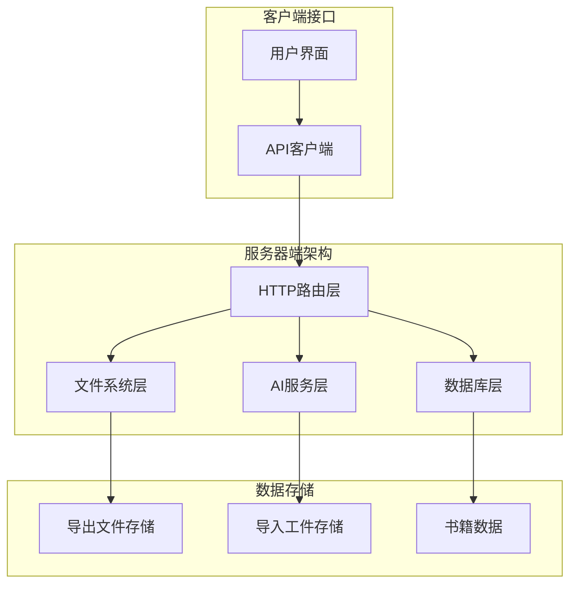
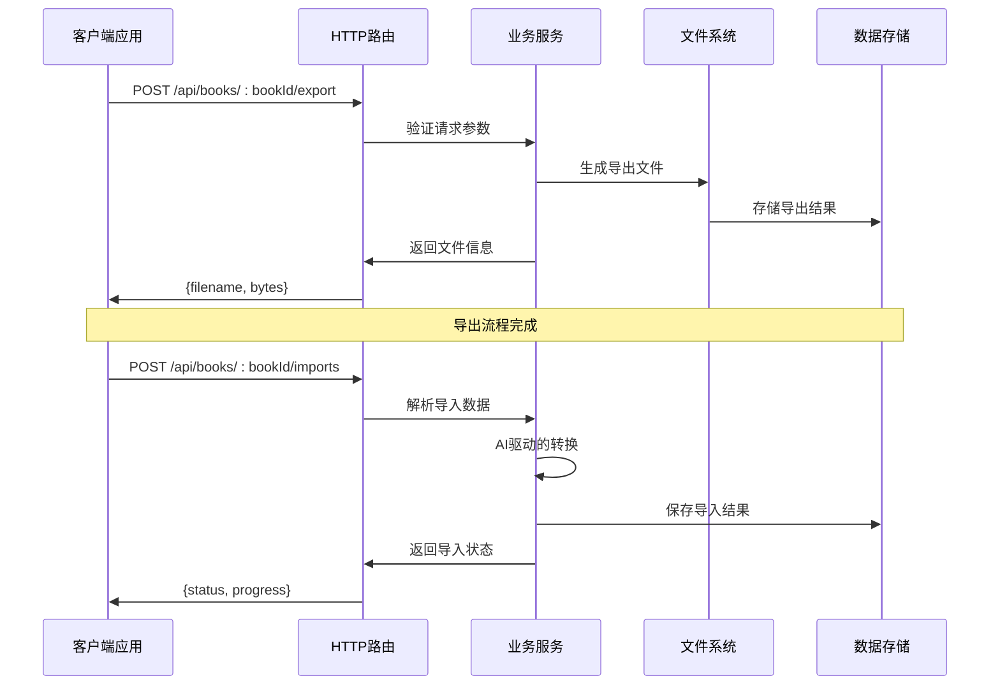
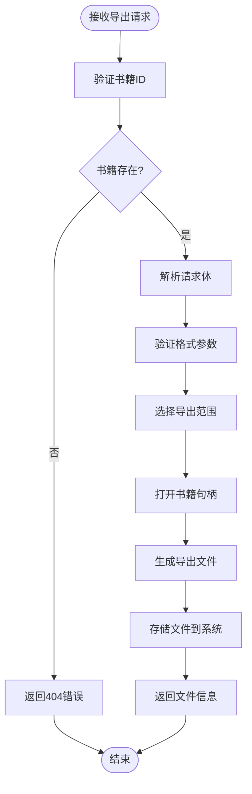
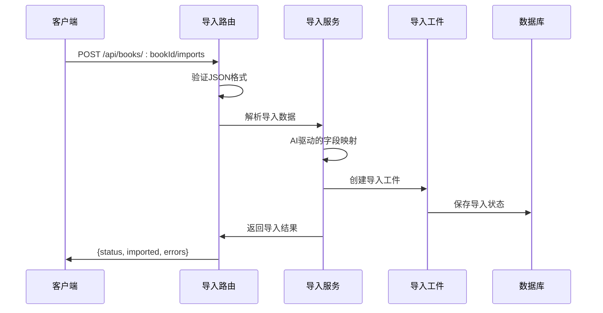
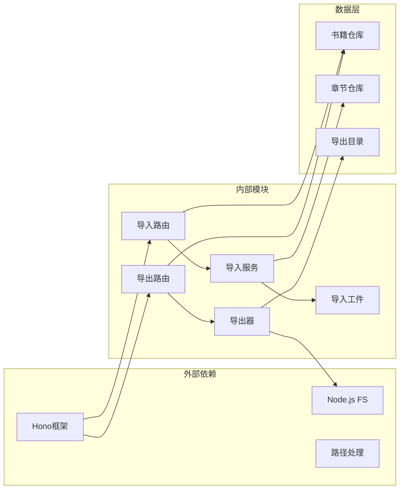
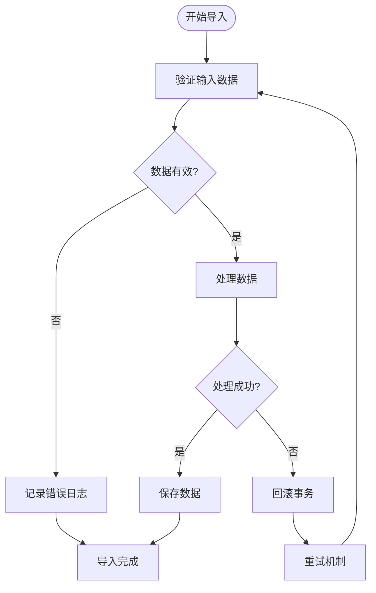

# 导入导出API端点

<cite>
**本文档引用的文件**
- [packages/server/src/http/routes/export.ts](file://packages/server/src/http/routes/export.ts)
- [packages/server/src/fs/exporter.ts](file://packages/server/src/fs/exporter.ts)
- [packages/server/src/http/routes/imports.ts](file://packages/server/src/http/routes/imports.ts)
- [packages/server/src/ai/import/import-service.ts](file://packages/server/src/ai/import/import-service.ts)
- [packages/server/src/db/repositories/import-artifacts.ts](file://packages/server/src/db/repositories/import-artifacts.ts)
- [packages/server/tests/integration/export.test.ts](file://packages/server/tests/integration/export.test.ts)
- [packages/server/tests/integration/import-routes.test.ts](file://packages/server/tests/integration/import-routes.test.ts)
- [packages/client/src/api/client.ts](file://packages/client/src/api/client.ts)
- [samples/sillytavern/Izumi 0503.json](file://samples/sillytavern/Izumi 0503.json)
</cite>

## 目录
1. [简介](#简介)
2. [项目结构](#项目结构)
3. [核心组件](#核心组件)
4. [架构概览](#架构概览)
5. [详细组件分析](#详细组件分析)
6. [依赖关系分析](#依赖关系分析)
7. [性能考虑](#性能考虑)
8. [故障排除指南](#故障排除指南)
9. [结论](#结论)

## 简介

Scribe项目提供了完整的导入导出API端点，支持多种文件格式的资产导入和项目导出功能。该系统专注于与SiliconTavern（原SillyTavern）的兼容性，提供从AI角色卡片到Scribe项目的无缝迁移能力。

本系统支持以下主要功能：
- 资产导入：支持JSON格式的角色卡片导入
- 项目导出：支持Markdown和纯文本格式的章节导出
- 格式转换：在不同输出格式间进行智能转换
- 增量更新：支持部分章节的增量导出
- 错误恢复：提供完整的错误处理和恢复机制
- 进度跟踪：实时监控导入导出过程的状态

## 项目结构

Scribe项目的导入导出功能主要分布在以下模块中：



**图表来源**
- [packages/server/src/http/routes/export.ts:1-38](file://packages/server/src/http/routes/export.ts#L1-L38)
- [packages/server/src/http/routes/imports.ts](file://packages/server/src/http/routes/imports.ts)

**章节来源**
- [packages/server/src/http/routes/export.ts:1-38](file://packages/server/src/http/routes/export.ts#L1-L38)
- [packages/server/src/http/routes/imports.ts](file://packages/server/src/http/routes/imports.ts)

## 核心组件

### 导出API组件

导出功能通过专门的路由层实现，支持多种输出格式和范围控制：

| 组件 | 功能描述 | 关键特性 |
|------|----------|----------|
| 导出路由 | 处理导出请求的核心路由 | 支持MD和TXT格式，章节范围选择 |
| 导出器 | 文件生成和格式转换逻辑 | 智能格式检测，内存优化 |
| 文件系统 | 导出文件的存储和管理 | 安全路径验证，自动清理 |

### 导入API组件

导入功能提供完整的资产迁移能力：

| 组件 | 功能描述 | 关键特性 |
|------|----------|----------|
| 导入路由 | 处理导入请求的HTTP端点 | JSON解析，格式验证 |
| 导入服务 | AI驱动的导入逻辑 | 智能字段映射，质量保证 |
| 导入工件 | 导入过程的数据存储 | 进度跟踪，错误日志 |

**章节来源**
- [packages/server/src/http/routes/export.ts:16-36](file://packages/server/src/http/routes/export.ts#L16-L36)
- [packages/server/src/http/routes/imports.ts](file://packages/server/src/http/routes/imports.ts)

## 架构概览

Scribe的导入导出架构采用分层设计，确保了功能的模块化和可维护性：



**图表来源**
- [packages/server/src/http/routes/export.ts:16-36](file://packages/server/src/http/routes/export.ts#L16-L36)
- [packages/server/src/http/routes/imports.ts](file://packages/server/src/http/routes/imports.ts)

## 详细组件分析

### 导出API详细分析

#### 导出路由实现

导出路由提供了灵活的章节导出功能：



**图表来源**
- [packages/server/src/http/routes/export.ts:16-36](file://packages/server/src/http/routes/export.ts#L16-L36)

#### 支持的导出格式

| 格式 | 扩展名 | 特点 | 使用场景 |
|------|--------|------|----------|
| Markdown | .md | 结构化格式，保留标题层级 | 全书导出，文档备份 |
| 纯文本 | .txt | 简洁格式，去除所有格式标记 | 简单文本处理，兼容性要求 |

#### 导出范围控制

系统支持多种导出范围选择：

- **全部章节** (`all`): 导出书籍的所有章节
- **指定章节** (`chapter: n`): 导出特定编号的章节
- **章节范围** (`range: [start,end]`): 导出指定范围内的章节

**章节来源**
- [packages/server/src/http/routes/export.ts:20-24](file://packages/server/src/http/routes/export.ts#L20-L24)

### 导入API详细分析

#### 导入路由实现

导入路由处理JSON格式的资产导入：



**图表来源**
- [packages/server/src/http/routes/imports.ts](file://packages/server/src/http/routes/imports.ts)

#### SiliconTavern兼容性规范

系统完全兼容SiliconTavern的JSON格式，支持以下字段映射：

| SiliconTavern字段 | Scribe映射字段 | 转换规则 |
|-------------------|----------------|----------|
| `name` | 角色名称 | 直接映射 |
| `description` | 角色描述 | 直接映射 |
| `personality` | 性格特征 | 文本格式转换 |
| `scenario` | 场景设定 | 文本格式转换 |
| `first_message` | 首次对话消息 | 文本格式转换 |
| `avatar` | 头像URL | 路径转换 |
| `mes_example` | 对话示例 | 结构化转换 |

**章节来源**
- [packages/server/src/ai/import/import-service.ts](file://packages/server/src/ai/import/import-service.ts)

### 数据结构定义

#### 导出响应数据结构

```typescript
interface ExportResponse {
  filename: string;  // 生成的文件名
  bytes: number;     // 文件大小（字节）
}

interface ExportOptions {
  format: 'md' | 'txt';  // 输出格式
  chapter?: number;      // 指定章节号
}
```

#### 导入响应数据结构

```typescript
interface ImportResult {
  imported: {
    total: number;      // 总共导入的条目数
    success: number;    // 成功导入的条目数
    errors: number;     // 导入失败的条目数
  };
  warnings: string[];   // 警告信息列表
  errors: string[];     // 错误信息列表
}

interface ImportPreview {
  preview: any[];      // 预览数据
  estimatedSize: number; // 估算大小
  conflicts: ConflictItem[]; // 冲突项
}
```

**章节来源**
- [packages/client/src/api/client.ts:61-77](file://packages/client/src/api/client.ts#L61-L77)

## 依赖关系分析

导入导出功能的依赖关系展现了清晰的分层架构：



**图表来源**
- [packages/server/src/http/routes/export.ts:1-11](file://packages/server/src/http/routes/export.ts#L1-L11)
- [packages/server/src/http/routes/imports.ts](file://packages/server/src/http/routes/imports.ts)

**章节来源**
- [packages/server/src/http/routes/export.ts:1-11](file://packages/server/src/http/routes/export.ts#L1-L11)
- [packages/server/src/http/routes/imports.ts](file://packages/server/src/http/routes/imports.ts)

## 性能考虑

### 内存优化策略

系统采用了多项内存优化技术来处理大型导出任务：

- **流式处理**：导出过程中使用流式写入，避免一次性加载整个文件到内存
- **分块传输**：支持大文件的分块处理和传输
- **垃圾回收**：及时释放不再使用的对象引用
- **缓存策略**：对频繁访问的数据建立适当的缓存机制

### 并发处理

系统支持并发的导入导出操作：

- **异步处理**：所有导入导出操作都是异步执行
- **队列管理**：高优先级的导入任务会得到更快的响应
- **资源限制**：防止同时运行过多的大型导出任务

## 故障排除指南

### 常见错误及解决方案

| 错误类型 | 错误代码 | 可能原因 | 解决方案 |
|----------|----------|----------|----------|
| 书籍不存在 | 404 | 书籍ID无效或已被删除 | 验证书籍ID并确认书籍存在 |
| 非法文件名 | 400 | 路径遍历攻击尝试 | 检查文件名是否包含非法字符 |
| 格式不支持 | 400 | 不支持的导出格式 | 使用支持的格式（md或txt） |
| 空书籍导出 | 400 | 书籍没有内容 | 添加至少一个章节后再导出 |
| 导入格式错误 | 400 | JSON格式不正确 | 验证JSON格式的有效性 |

### 错误恢复机制

系统提供了完善的错误恢复能力：



**图表来源**
- [packages/server/src/ai/import/import-service.ts](file://packages/server/src/ai/import/import-service.ts)

**章节来源**
- [packages/server/src/http/routes/export.ts:33-35](file://packages/server/src/http/routes/export.ts#L33-L35)
- [packages/server/src/http/routes/imports.ts](file://packages/server/src/http/routes/imports.ts)

## 结论

Scribe项目的导入导出API端点提供了完整而强大的功能集，特别注重与SiliconTavern的兼容性和用户体验。系统的设计充分考虑了性能、安全性和可靠性，在处理大量数据时仍能保持良好的响应速度。

主要优势包括：
- **完整的SiliconTavern兼容性**：提供精确的角色卡片迁移能力
- **灵活的导出选项**：支持多种格式和范围控制
- **强大的错误处理**：提供详细的错误信息和恢复机制
- **安全的文件处理**：防止路径遍历等安全问题
- **可扩展的架构**：模块化的组件设计便于功能扩展

未来可以考虑的功能增强包括：
- 支持更多导出格式（PDF、EPUB等）
- 实现断点续传功能
- 提供更详细的进度跟踪API
- 增强批量导入的性能优化