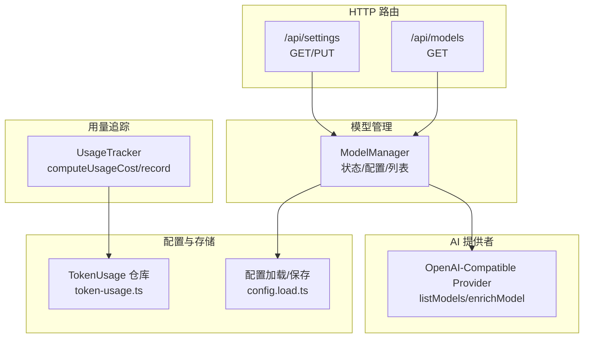
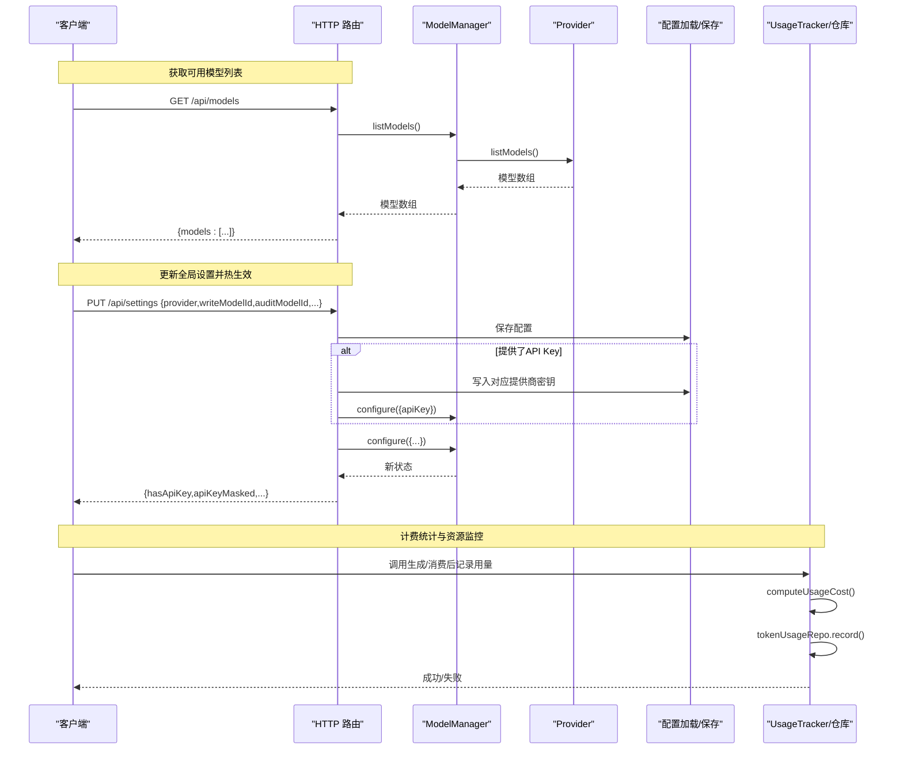
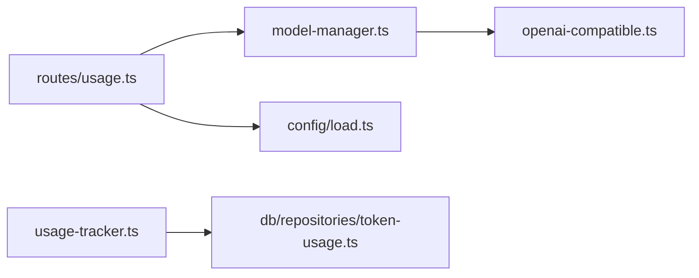

# 模型管理端点

<cite>
**本文引用的文件**
- [packages/server/src/http/routes/usage.ts](file://packages/server/src/http/routes/usage.ts)
- [packages/server/src/ai/model-manager.ts](file://packages/server/src/ai/model-manager.ts)
- [packages/server/src/ai/providers/openai-compatible.ts](file://packages/server/src/ai/providers/openai-compatible.ts)
- [packages/server/src/config/load.ts](file://packages/server/src/config/load.ts)
- [packages/server/src/ai/usage-tracker.ts](file://packages/server/src/ai/usage-tracker.ts)
- [packages/server/src/db/repositories/token-usage.ts](file://packages/server/src/db/repositories/token-usage.ts)
- [packages/server/tests/integration/settings-routes.test.ts](file://packages/server/tests/integration/settings-routes.test.ts)
- [packages/server/tests/unit/ai/providers/openai-compatible.test.ts](file://packages/server/tests/unit/ai/providers/openai-compatible.test.ts)
- [packages/server/tests/unit/ai/usage-tracker.test.ts](file://packages/server/tests/unit/ai/usage-tracker.test.ts)
- [packages/server/tests/integration/auto-mode.test.ts](file://packages/server/tests/integration/auto-mode.test.ts)
</cite>

## 目录
1. [简介](#简介)
2. [项目结构](#项目结构)
3. [核心组件](#核心组件)
4. [架构总览](#架构总览)
5. [详细组件分析](#详细组件分析)
6. [依赖关系分析](#依赖关系分析)
7. [性能考量](#性能考量)
8. [故障排查指南](#故障排查指南)
9. [结论](#结论)
10. [附录](#附录)

## 简介
本文件面向Scribe项目的“模型管理API端点”，系统性梳理以下能力与接口：
- 获取可用模型列表
- 模型配置与切换（全局设置）
- 支持的AI模型提供商与模型参数
- 性能指标与计费统计
- 模型能力查询、负载均衡与故障转移机制
- 最佳实践与性能调优建议
- 请求示例与响应格式说明
- 使用计费统计与资源监控

## 项目结构
围绕模型管理API，后端关键模块分布如下：
- HTTP路由层：提供 /api/settings 与 /api/models 等端点
- 模型管理器：负责状态维护、配置变更与模型列表拉取
- AI提供者：封装不同提供商的统一接口（如兼容OpenAI协议的提供商）
- 配置加载与保存：持久化全局设置（含预算上限、模型ID、主提示词等）
- 用量追踪与数据库仓库：记录Token用量、成本与聚合统计

图表来源
- [packages/server/src/http/routes/usage.ts:40-109](file://packages/server/src/http/routes/usage.ts#L40-L109)
- [packages/server/src/ai/model-manager.ts:70-82](file://packages/server/src/ai/model-manager.ts#L70-L82)
- [packages/server/src/ai/providers/openai-compatible.ts:41-83](file://packages/server/src/ai/providers/openai-compatible.ts#L41-L83)
- [packages/server/src/config/load.ts:39-59](file://packages/server/src/config/load.ts#L39-L59)
- [packages/server/src/db/repositories/token-usage.ts:42-77](file://packages/server/src/db/repositories/token-usage.ts#L42-L77)
- [packages/server/src/ai/usage-tracker.ts:41-84](file://packages/server/src/ai/usage-tracker.ts#L41-L84)

章节来源
- [packages/server/src/http/routes/usage.ts:40-109](file://packages/server/src/http/routes/usage.ts#L40-L109)
- [packages/server/src/ai/model-manager.ts:70-82](file://packages/server/src/ai/model-manager.ts#L70-L82)
- [packages/server/src/config/load.ts:39-59](file://packages/server/src/config/load.ts#L39-L59)

## 核心组件
- HTTP路由
  - GET /api/settings：返回当前全局配置与API Key掩码状态
  - PUT /api/settings：更新全局配置（包括预算上限、提供商、写入/审核模型ID、主提示词），并热生效
  - GET /api/models：从模型管理器拉取可用模型列表
- 模型管理器
  - 维护当前提供商、API Key、写入/审核模型ID、主提示词等状态
  - 提供 listModels()，内部委托给当前提供商
- AI提供者（兼容OpenAI协议）
  - listModels()：调用提供商 /v1/models 接口
  - enrichModel()：多源合并模型信息（提供商 → OpenRouter → 本地表）
- 配置加载/保存
  - 限定允许的提供商值（mimo 或 deepseek）
  - 仅在有效数值范围内更新单次预算上限
- 用量追踪与统计
  - 记录任务类型、模型、Prompt/Completion/Cached/Reasoning Token用量与成本
  - 数据库存储并提供按任务类型、模型、章节的聚合统计

章节来源
- [packages/server/src/http/routes/usage.ts:40-109](file://packages/server/src/http/routes/usage.ts#L40-L109)
- [packages/server/src/ai/model-manager.ts:70-82](file://packages/server/src/ai/model-manager.ts#L70-L82)
- [packages/server/src/ai/providers/openai-compatible.ts:41-83](file://packages/server/src/ai/providers/openai-compatible.ts#L41-L83)
- [packages/server/src/config/load.ts:39-59](file://packages/server/src/config/load.ts#L39-L59)
- [packages/server/src/ai/usage-tracker.ts:41-84](file://packages/server/src/ai/usage-tracker.ts#L41-L84)
- [packages/server/src/db/repositories/token-usage.ts:42-77](file://packages/server/src/db/repositories/token-usage.ts#L42-L77)

## 架构总览
下图展示模型管理端点的请求处理流程与组件交互。

图表来源
- [packages/server/src/http/routes/usage.ts:40-109](file://packages/server/src/http/routes/usage.ts#L40-L109)
- [packages/server/src/ai/model-manager.ts:70-82](file://packages/server/src/ai/model-manager.ts#L70-L82)
- [packages/server/src/ai/providers/openai-compatible.ts:41-83](file://packages/server/src/ai/providers/openai-compatible.ts#L41-L83)
- [packages/server/src/ai/usage-tracker.ts:41-84](file://packages/server/src/ai/usage-tracker.ts#L41-L84)

## 详细组件分析

### HTTP 路由：/api/settings 与 /api/models
- GET /api/settings
  - 返回当前配置与API Key掩码状态；若服务未就绪返回503
  - 关键字段：provider、writeModelId、auditModelId、masterPrompt、singleBudgetUsd、hasApiKey、apiKeyMasked
- PUT /api/settings
  - 支持更新：provider、writeModelId、auditModelId、masterPrompt、singleBudgetUsd
  - 当提供apiKey时，按当前提供商写入对应密钥，并热生效
  - 仅当值为有效范围内的正数时才更新单次预算上限
  - 返回更新后的配置与掩码后的API Key
- GET /api/models
  - 调用模型管理器的listModels，内部委托当前提供商
  - 未配置API Key时抛出错误；异常会被包装为503响应

章节来源
- [packages/server/src/http/routes/usage.ts:40-109](file://packages/server/src/http/routes/usage.ts#L40-L109)

### 模型管理器：状态与配置
- 状态字段：provider、apiKey、writeModelId、auditModelId、masterPrompt
- 方法：
  - configure(patch)：增量更新状态
  - listModels()：若未配置提供商则抛错，否则调用提供商的listModels()

章节来源
- [packages/server/src/ai/model-manager.ts:70-82](file://packages/server/src/ai/model-manager.ts#L70-L82)

### AI提供者：兼容OpenAI协议
- listModels()：向提供商/v1/models发起请求，解析返回的模型列表
- enrichModel()：三档信息合并策略
  - 第一档：提供商自有列表（优先级最高）
  - 第二档：OpenRouter补充（如上下文窗口、定价等）
  - 第三档：本地表补充（兜底）
- 错误分类：默认返回“unknown”

章节来源
- [packages/server/src/ai/providers/openai-compatible.ts:41-83](file://packages/server/src/ai/providers/openai-compatible.ts#L41-L83)
- [packages/server/tests/unit/ai/providers/openai-compatible.test.ts:1-72](file://packages/server/tests/unit/ai/providers/openai-compatible.test.ts#L1-L72)

### 配置加载/保存：全局设置持久化
- 仅允许的提供商值：mimo 或 deepseek
- 仅在大于0时更新单次预算上限
- 保存为JSON文件，供路由层读取与写入

章节来源
- [packages/server/src/config/load.ts:39-59](file://packages/server/src/config/load.ts#L39-L59)

### 用量追踪与统计：计费与监控
- 计费口径
  - Prompt按非缓存部分计价，缓存命中部分按cachedInput计价
  - Completion按输出计价
  - Reasoning Tokens不参与成本计算，但计入用量统计
- 记录项
  - 任务类型、模型、Prompt/Completion/Cached/Reasoning Token、成本USD、章节号
- 聚合查询
  - 总成本、按任务类型、按模型、按章节的汇总

章节来源
- [packages/server/src/ai/usage-tracker.ts:41-84](file://packages/server/src/ai/usage-tracker.ts#L41-L84)
- [packages/server/src/db/repositories/token-usage.ts:42-77](file://packages/server/src/db/repositories/token-usage.ts#L42-L77)
- [packages/server/tests/unit/ai/usage-tracker.test.ts:1-81](file://packages/server/tests/unit/ai/usage-tracker.test.ts#L1-L81)

### 能力查询、负载均衡与故障转移
- 能力查询
  - 通过 /api/models 拉取模型清单；模型详情由提供商返回，必要时经OpenRouter与本地表补全
- 负载均衡与故障转移
  - 当前实现未显式暴露多节点/多实例的LB/Failover逻辑
  - 建议在网关或反向代理层实现外部LB；应用层可通过轮询/权重策略在多个提供商实例间切换（需扩展）

章节来源
- [packages/server/src/http/routes/usage.ts:97-106](file://packages/server/src/http/routes/usage.ts#L97-L106)
- [packages/server/src/ai/providers/openai-compatible.ts:41-83](file://packages/server/src/ai/providers/openai-compatible.ts#L41-L83)

### 模型切换与热生效
- 切换方式
  - 通过PUT /api/settings更新provider、writeModelId、auditModelId、masterPrompt
  - 若同时提供apiKey，将按当前提供商写入对应密钥并热生效
- 测试验证
  - 初始无API Key时hasApiKey为false
  - PUT后API Key落盘至secrets.env并热生效
  - 模型ID持久化且同步到模型管理器

章节来源
- [packages/server/tests/integration/settings-routes.test.ts:75-96](file://packages/server/tests/integration/settings-routes.test.ts#L75-L96)
- [packages/server/tests/integration/settings-routes.test.ts:98-106](file://packages/server/tests/integration/settings-routes.test.ts#L98-L106)

## 依赖关系分析
- 路由依赖模型管理器进行配置与模型列表查询
- 模型管理器依赖当前提供商实现listModels
- 用量追踪依赖仓库持久化Token用量与成本
- 配置层负责全局设置的读取与写入

图表来源
- [packages/server/src/http/routes/usage.ts:40-109](file://packages/server/src/http/routes/usage.ts#L40-L109)
- [packages/server/src/ai/model-manager.ts:70-82](file://packages/server/src/ai/model-manager.ts#L70-L82)
- [packages/server/src/ai/providers/openai-compatible.ts:41-83](file://packages/server/src/ai/providers/openai-compatible.ts#L41-L83)
- [packages/server/src/config/load.ts:39-59](file://packages/server/src/config/load.ts#L39-L59)
- [packages/server/src/ai/usage-tracker.ts:41-84](file://packages/server/src/ai/usage-tracker.ts#L41-L84)
- [packages/server/src/db/repositories/token-usage.ts:42-77](file://packages/server/src/db/repositories/token-usage.ts#L42-L77)

## 性能考量
- 模型列表查询
  - 依赖提供商接口，建议在路由层增加缓存与重试策略，避免频繁抖动
- 计费计算
  - computeUsageCost为纯函数，开销极低；注意避免重复记录导致的统计偏差
- Token用量入库
  - 批量写入与事务控制可减少锁竞争；聚合查询应配合索引优化
- 配置热生效
  - 密钥落盘与模型管理器同步应原子化，避免中间态

## 故障排查指南
- 未配置API Key
  - 现象：/api/models返回503，错误来自模型管理器未配置提供商
  - 处理：先通过PUT /api/settings提交apiKey并热生效
- 提供商值非法
  - 现象：配置被回退到默认值
  - 处理：确保provider为mimo或deepseek之一
- 计费为0
  - 现象：模型缺少pricing信息时成本为0
  - 处理：通过enrichModel补全模型信息或在本地表补充
- 用量统计异常
  - 现象：按任务类型/模型/章节聚合结果不符预期
  - 处理：检查token-usage表字段与聚合SQL，确认Reasoning Tokens未参与成本计算

章节来源
- [packages/server/src/http/routes/usage.ts:97-106](file://packages/server/src/http/routes/usage.ts#L97-L106)
- [packages/server/src/config/load.ts:39-59](file://packages/server/src/config/load.ts#L39-L59)
- [packages/server/src/ai/usage-tracker.ts:63-84](file://packages/server/src/ai/usage-tracker.ts#L63-L84)
- [packages/server/src/db/repositories/token-usage.ts:42-77](file://packages/server/src/db/repositories/token-usage.ts#L42-L77)

## 结论
Scribe的模型管理API端点提供了完整的“配置—切换—查询—计费”闭环：
- 通过/ api/settings实现全局配置与热生效
- 通过/ api/models实现模型能力查询
- 通过用量追踪与数据库仓库实现成本与资源监控
- 在当前实现基础上，建议在网关层引入负载均衡与故障转移，以提升可用性与弹性

## 附录

### 接口定义与示例

- 获取可用模型列表
  - 方法：GET
  - 路径：/api/models
  - 成功响应：{ models: [{ id: string, ownedBy?: string }] }
  - 异常：未配置API Key时返回503
  章节来源
  - [packages/server/src/http/routes/usage.ts:97-106](file://packages/server/src/http/routes/usage.ts#L97-L106)

- 更新全局设置（含模型切换）
  - 方法：PUT
  - 路径：/api/settings
  - 请求体（示例字段）：{ provider: "mimo"|"deepseek", writeModelId: string, auditModelId: string, masterPrompt: string, singleBudgetUsd: number, apiKey: string }
  - 成功响应：{ hasApiKey: boolean, apiKeyMasked: string|null, provider: string, writeModelId: string, auditModelId: string, masterPrompt: string, singleBudgetUsd: number }
  - 异常：服务未就绪返回503
  章节来源
  - [packages/server/src/http/routes/usage.ts:52-95](file://packages/server/src/http/routes/usage.ts#L52-L95)

- 获取当前设置
  - 方法：GET
  - 路径：/api/settings
  - 成功响应：{ hasApiKey: boolean, apiKeyMasked: string|null, provider: string, writeModelId: string, auditModelId: string, masterPrompt: string, singleBudgetUsd: number }
  章节来源
  - [packages/server/src/http/routes/usage.ts:40-50](file://packages/server/src/http/routes/usage.ts#L40-L50)

### 支持的AI模型提供商与模型参数
- 提供商
  - mimo
  - deepseek
- 模型参数
  - id: 模型标识
  - ownedBy: 所属方（来自提供商）
  - context_length: 上下文长度（可能来自OpenRouter或本地表）
  - pricing: { input: number, output: number, cachedInput?: number }
- 能力查询
  - 通过listModels()获取；enrichModel()进行多源补全

章节来源
- [packages/server/src/ai/providers/openai-compatible.ts:41-83](file://packages/server/src/ai/providers/openai-compatible.ts#L41-L83)
- [packages/server/tests/unit/ai/providers/openai-compatible.test.ts:33-72](file://packages/server/tests/unit/ai/providers/openai-compatible.test.ts#L33-L72)

### 性能指标与计费统计
- 指标
  - Prompt/Completion/Cached/Reasoning Token用量
  - 成本（USD）
  - 按任务类型、模型、章节的聚合
- 计费规则
  - 非缓存Prompt × input单价
  - 缓存命中Prompt × cachedInput单价
  - Completion × output单价
  - Reasoning Tokens不参与成本计算
- 查询接口
  - 书籍用量汇总与最近记录：参见集成测试中的相关断言

章节来源
- [packages/server/src/ai/usage-tracker.ts:63-84](file://packages/server/src/ai/usage-tracker.ts#L63-L84)
- [packages/server/src/db/repositories/token-usage.ts:42-77](file://packages/server/src/db/repositories/token-usage.ts#L42-L77)
- [packages/server/tests/integration/auto-mode.test.ts:341-371](file://packages/server/tests/integration/auto-mode.test.ts#L341-L371)

### 最佳实践与性能调优建议
- 配置与热生效
  - 将API Key按提供商分别存储，避免跨提供商密钥混淆
  - 在批量更新配置时，先校验字段合法性再落盘，保证一致性
- 模型选择
  - 优先使用提供商自有列表；若缺失关键信息，启用OpenRouter与本地表补全
- 计费与监控
  - 对高频调用场景增加缓存与限流
  - 定期导出token-usage表进行离线分析
- 负载均衡与故障转移
  - 在网关层实现多实例LB与健康检查
  - 应用层可扩展为多提供商实例轮询策略（需额外实现）