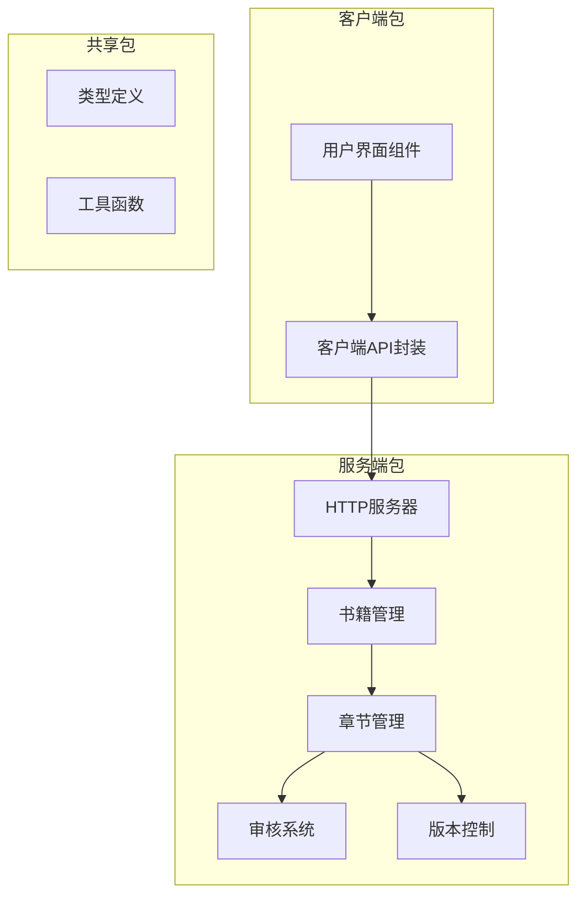
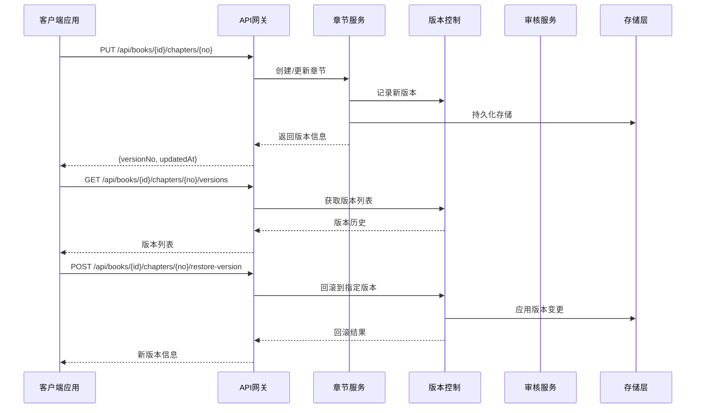
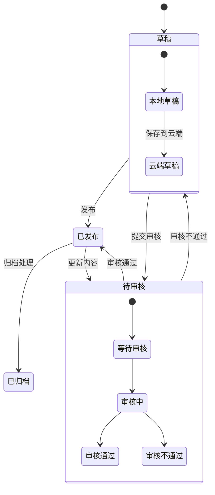
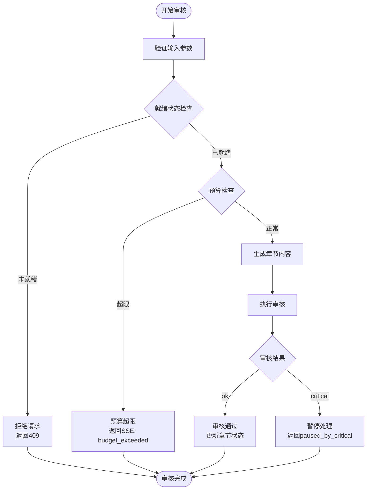
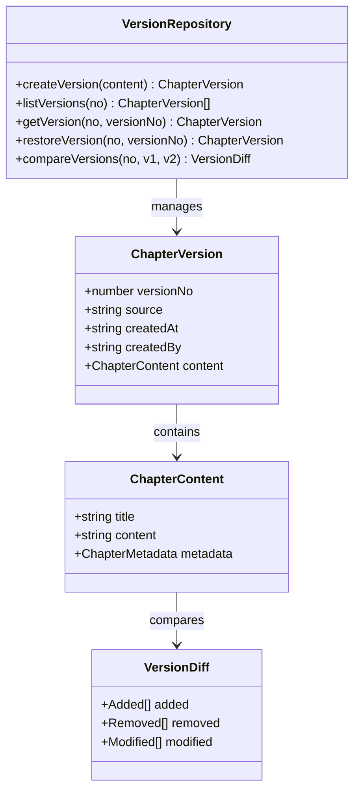
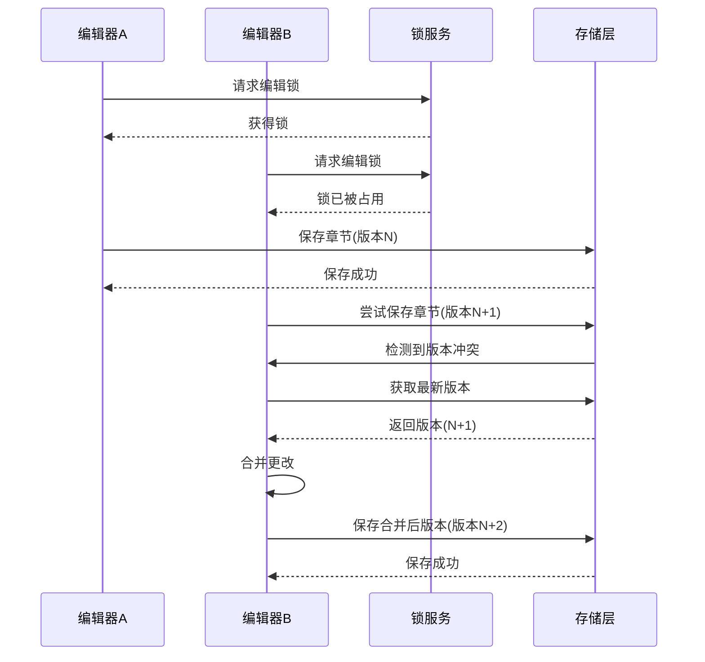
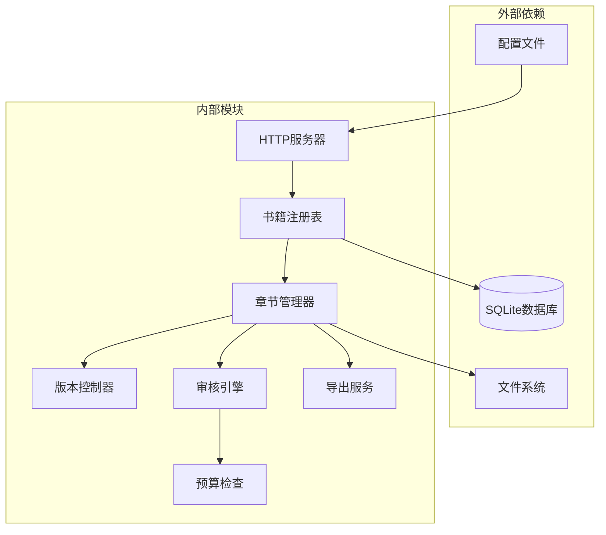
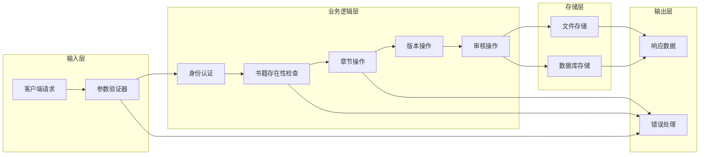

# 章节管理端点

<cite>
**本文档引用的文件**
- [e2e测试-核心旅程](file://e2e/tests/core-journey.spec.ts)
- [服务端集成测试-章节编辑路由](file://packages/server/tests/integration/chapter-edit-routes.test.ts)
- [服务端集成测试-自动模式](file://packages/server/tests/integration/auto-mode.test.ts)
- [客户端API封装](file://packages/client/src/api/client.ts)
</cite>

## 目录
1. [简介](#简介)
2. [项目结构](#项目结构)
3. [核心组件](#核心组件)
4. [架构概览](#架构概览)
5. [详细组件分析](#详细组件分析)
6. [依赖关系分析](#依赖关系分析)
7. [性能考虑](#性能考虑)
8. [故障排除指南](#故障排除指南)
9. [结论](#结论)

## 简介

Scribe项目的章节管理API端点提供了完整的章节生命周期管理功能，包括章节的创建、编辑、审核、发布以及版本控制机制。该系统支持手动编写和AI自动生成两种创作模式，并具备完善的质量门禁检查和并发编辑冲突解决机制。

## 项目结构

基于测试文件分析，Scribe项目采用多包架构，其中章节管理功能主要集中在服务端包中：

**图表来源**
- [e2e测试-核心旅程:1-82](file://e2e/tests/core-journey.spec.ts#L1-L82)
- [服务端集成测试-章节编辑路由:1-158](file://packages/server/tests/integration/chapter-edit-routes.test.ts#L1-L158)

**章节来源**
- [e2e测试-核心旅程:1-82](file://e2e/tests/core-journey.spec.ts#L1-L82)
- [服务端集成测试-章节编辑路由:1-158](file://packages/server/tests/integration/chapter-edit-routes.test.ts#L1-L158)

## 核心组件

### 章节管理核心功能

章节管理系统提供以下核心功能模块：

1. **章节创建与编辑**
   - 手动编辑模式
   - AI自动生成模式
   - 实时预览功能

2. **版本控制系统**
   - 多版本追踪
   - 版本回滚
   - 版本比较

3. **质量门禁检查**
   - 自动审核
   - 多维度评估
   - 审核状态管理

4. **并发编辑控制**
   - 编辑锁机制
   - 冲突检测
   - 并发安全保证

**章节来源**
- [服务端集成测试-章节编辑路由:52-121](file://packages/server/tests/integration/chapter-edit-routes.test.ts#L52-L121)
- [服务端集成测试-自动模式:165-281](file://packages/server/tests/integration/auto-mode.test.ts#L165-L281)

## 架构概览

章节管理系统的整体架构采用分层设计，确保各组件间的职责分离和松耦合：

**图表来源**
- [服务端集成测试-章节编辑路由:283-328](file://packages/server/tests/integration/chapter-edit-routes.test.ts#L283-L328)
- [服务端集成测试-自动模式:283-328](file://packages/server/tests/integration/auto-mode.test.ts#L283-L328)

## 详细组件分析

### 章节创建与编辑端点

#### 基础章节管理端点

| 端点 | 方法 | 描述 | 请求体 | 响应体 |
|------|------|------|--------|--------|
| `/api/books/{id}/chapters/{no}` | PUT | 创建或更新章节 | `{title: string, content: string}` | `{versionNo: number, updatedAt: string}` |
| `/api/books/{id}/chapters/{no}` | GET | 获取指定章节 | - | `{title: string, content: string, versionNo: number}` |
| `/api/books/{id}/chapters` | GET | 获取章节列表 | - | `{chapters: Array<{chapterNo: number}>}` |

#### 版本管理端点

| 端点 | 方法 | 描述 | 请求体 | 响应体 |
|------|------|------|--------|--------|
| `/api/books/{id}/chapters/{no}/versions` | GET | 获取版本历史 | - | `{versions: Array<{versionNo: number, source: string, createdAt: string}>}` |
| `/api/books/{id}/chapters/{no}/restore-version` | POST | 回滚到指定版本 | `{versionNo: number}` | `{versionNo: number, restoredFrom: number, updatedAt: string}` |

#### 审核相关端点

| 端点 | 方法 | 描述 | 请求体 | 响应体 |
|------|------|------|--------|--------|
| `/api/books/{id}/auto` | POST | AI自动生成章节 | `{n: number}` | 流式响应（SSE） |
| `/api/books/{id}/onboard-status` | GET | 获取书籍就绪状态 | - | `{ok: boolean, missing: Array<string>}` |
| `/api/books/{id}/onboard/skip` | POST | 跳过就绪检查 | - | `{ok: boolean}` |

**章节来源**
- [e2e测试-核心旅程:28-70](file://e2e/tests/core-journey.spec.ts#L28-L70)
- [服务端集成测试-章节编辑路由:52-157](file://packages/server/tests/integration/chapter-edit-routes.test.ts#L52-L157)
- [服务端集成测试-自动模式:165-179](file://packages/server/tests/integration/auto-mode.test.ts#L165-L179)

### 章节状态管理流程

章节状态管理采用有限状态机设计，支持多种状态转换：

**图表来源**
- [服务端集成测试-章节编辑路由:52-91](file://packages/server/tests/integration/chapter-edit-routes.test.ts#L52-L91)
- [服务端集成测试-自动模式:192-210](file://packages/server/tests/integration/auto-mode.test.ts#L192-L210)

### 质量门禁检查机制

系统实现了多层次的质量门禁检查，确保章节内容符合预设标准：

**图表来源**
- [服务端集成测试-自动模式:166-231](file://packages/server/tests/integration/auto-mode.test.ts#L166-L231)

**章节来源**
- [服务端集成测试-自动模式:54-73](file://packages/server/tests/integration/auto-mode.test.ts#L54-L73)
- [服务端集成测试-自动模式:192-210](file://packages/server/tests/integration/auto-mode.test.ts#L192-L210)

### 版本控制机制

版本控制系统支持完整的版本追踪和回滚功能：

**图表来源**
- [服务端集成测试-章节编辑路由:283-328](file://packages/server/tests/integration/chapter-edit-routes.test.ts#L283-L328)
- [服务端集成测试-章节编辑路由:299-316](file://packages/server/tests/integration/chapter-edit-routes.test.ts#L299-L316)

**章节来源**
- [服务端集成测试-章节编辑路由:283-328](file://packages/server/tests/integration/chapter-edit-routes.test.ts#L283-L328)

### 并发编辑冲突解决

系统采用乐观锁机制处理并发编辑冲突：

**图表来源**
- [服务端集成测试-章节编辑路由:73-91](file://packages/server/tests/integration/chapter-edit-routes.test.ts#L73-L91)

**章节来源**
- [服务端集成测试-章节编辑路由:73-91](file://packages/server/tests/integration/chapter-edit-routes.test.ts#L73-L91)

### 章节元数据管理

章节元数据系统支持丰富的元数据字段和标签管理：

| 元数据类型 | 字段名称 | 描述 | 示例值 |
|------------|----------|------|--------|
| 基本信息 | title | 章节标题 | "第一章 初见" |
| 基本信息 | content | 章节内容 | Markdown文本 |
| 标签系统 | tags | 标签数组 | ["角色", "场景", "对话"] |
| 关联资源 | characters | 角色引用 | ["主角", "配角"] |
| 关联资源 | locations | 地点引用 | ["古堡", "森林"] |
| 状态信息 | status | 章节状态 | "draft", "published", "review" |
| 质量信息 | auditScore | 审核分数 | 8.5/10 |
| 时间戳 | createdAt | 创建时间 | ISO8601格式 |
| 时间戳 | updatedAt | 更新时间 | ISO8601格式 |

**章节来源**
- [服务端集成测试-章节编辑路由:54-71](file://packages/server/tests/integration/chapter-edit-routes.test.ts#L54-L71)

## 依赖关系分析

### 组件间依赖关系

**图表来源**
- [服务端集成测试-章节编辑路由:1-27](file://packages/server/tests/integration/chapter-edit-routes.test.ts#L1-L27)
- [服务端集成测试-自动模式:101-111](file://packages/server/tests/integration/auto-mode.test.ts#L101-L111)

### 数据流分析

章节管理的数据流遵循严格的处理管道：

**图表来源**
- [服务端集成测试-章节编辑路由:93-120](file://packages/server/tests/integration/chapter-edit-routes.test.ts#L93-L120)

**章节来源**
- [服务端集成测试-章节编辑路由:93-120](file://packages/server/tests/integration/chapter-edit-routes.test.ts#L93-L120)

## 性能考虑

### 缓存策略

系统采用多级缓存机制优化性能：

1. **内存缓存**：活跃书籍的元数据和配置
2. **文件缓存**：章节内容的最近访问缓存
3. **数据库缓存**：查询结果的短期缓存

### 异步处理

对于耗时操作采用异步处理模式：

- AI生成章节使用流式响应（SSE）
- 大文件导出采用分块传输
- 批量操作支持进度报告

### 连接池管理

数据库连接采用连接池管理，支持：

- 最大连接数限制
- 连接超时处理
- 连接健康检查

## 故障排除指南

### 常见错误及解决方案

| 错误码 | 错误类型 | 可能原因 | 解决方案 |
|--------|----------|----------|----------|
| 400 | 参数错误 | 非法的章节编号或空内容 | 验证输入参数，检查章节编号格式 |
| 404 | 资源不存在 | 书籍ID或章节不存在 | 确认书籍ID有效性，检查章节是否已创建 |
| 409 | 状态冲突 | 书籍未完成就绪检查 | 完成必要的就绪步骤后再进行操作 |
| 503 | 服务不可用 | AI模型未配置或不可用 | 检查AI模型配置，确认API密钥有效 |
| 500 | 内部错误 | 系统异常或资源不足 | 检查系统日志，释放系统资源 |

### 调试建议

1. **启用详细日志**：在开发环境中启用详细的API调用日志
2. **监控资源使用**：关注内存和磁盘空间使用情况
3. **检查网络连接**：确保AI服务的网络连接稳定
4. **验证权限设置**：确认文件系统权限配置正确

**章节来源**
- [服务端集成测试-章节编辑路由:93-120](file://packages/server/tests/integration/chapter-edit-routes.test.ts#L93-L120)
- [服务端集成测试-自动模式:233-258](file://packages/server/tests/integration/auto-mode.test.ts#L233-L258)

## 结论

Scribe项目的章节管理API端点提供了完整而强大的章节生命周期管理功能。系统采用模块化设计，支持手动和AI两种创作模式，具备完善的版本控制、质量门禁检查和并发编辑冲突解决机制。

通过清晰的API设计和严格的错误处理，该系统能够满足从个人创作者到专业出版团队的各种需求。未来可以考虑添加更多高级功能，如章节间的交叉引用、更精细的权限控制和更丰富的导出格式支持。