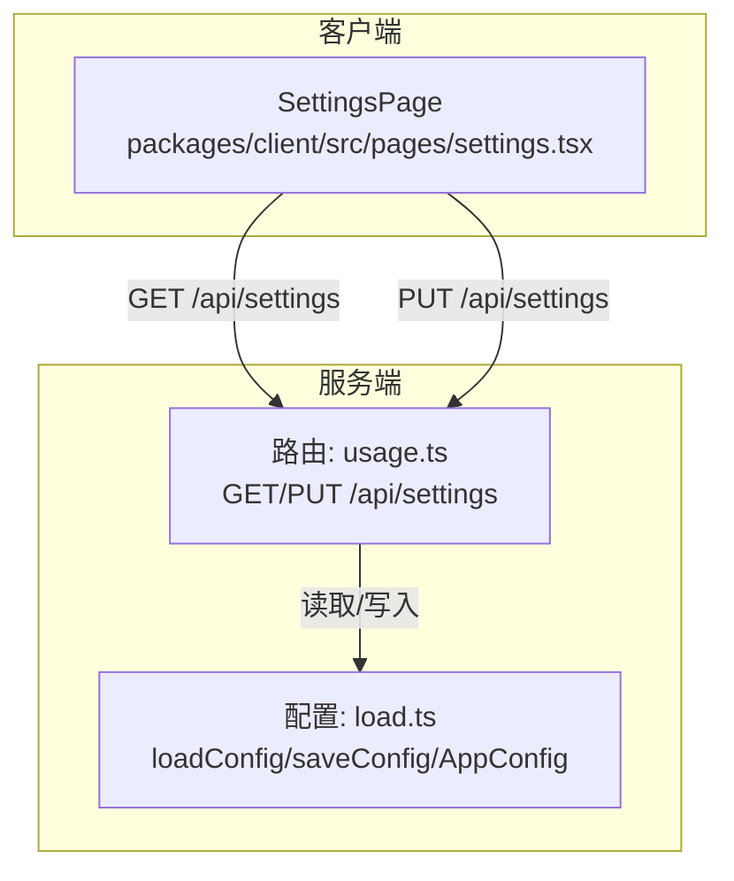
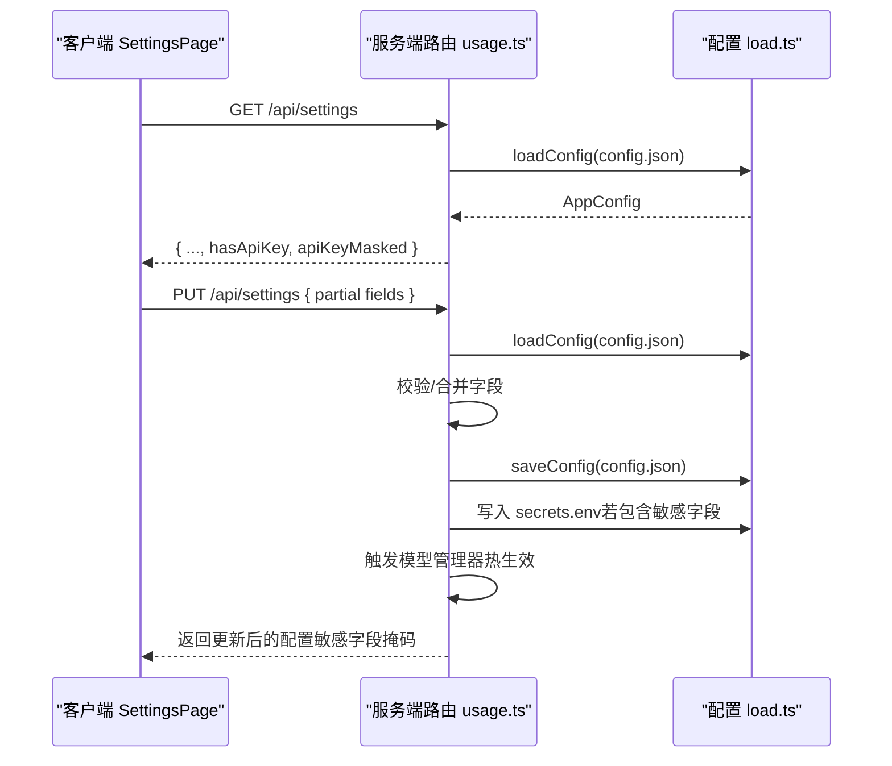
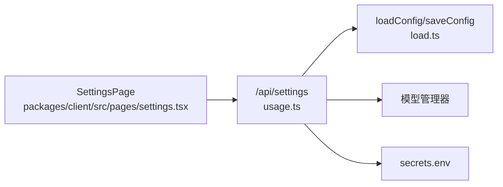

# 设置管理端点

<cite>
**本文档引用的文件**
- [packages/server/src/http/routes/usage.ts](file://packages/server/src/http/routes/usage.ts)
- [packages/server/src/config/load.ts](file://packages/server/src/config/load.ts)
- [packages/server/tests/integration/auto-mode.test.ts](file://packages/server/tests/integration/auto-mode.test.ts)
- [packages/server/tests/integration/settings-routes.test.ts](file://packages/server/tests/integration/settings-routes.test.ts)
- [packages/client/src/pages/settings.tsx](file://packages/client/src/pages/settings.tsx)
</cite>

## 目录
1. [简介](#简介)
2. [项目结构](#项目结构)
3. [核心组件](#核心组件)
4. [架构总览](#架构总览)
5. [详细组件分析](#详细组件分析)
6. [依赖关系分析](#依赖关系分析)
7. [性能考虑](#性能考虑)
8. [故障排除指南](#故障排除指南)
9. [结论](#结论)

## 简介
本文件面向 Scribe 项目的“设置管理”API 端点，系统性梳理以下能力与行为：
- 获取当前系统配置（含模型、预算、提示词等）
- 更新系统配置（支持部分字段更新）
- 安全处理敏感信息（如 API Key 的落盘与返回掩码）
- 配置持久化与热生效（模型管理器同步）
- 版本控制、变更历史与回滚机制（基于现有实现的约束说明）
- 批量操作支持（当前端点不支持批量，但可扩展）
- 请求/响应示例与安全存储策略

## 项目结构
围绕设置管理的核心文件与职责如下：
- 服务端路由：提供 GET/PUT /api/settings 端点，负责读取与更新全局配置
- 配置加载与保存：封装 config.json 的读取与写入逻辑
- 客户端页面：SettingsPage 组件通过 /api/settings 读取并提交更新
- 测试用例：覆盖 GET/PUT 行为、敏感信息掩码、持久化与热生效

图表来源
- [packages/server/src/http/routes/usage.ts:40-66](file://packages/server/src/http/routes/usage.ts#L40-L66)
- [packages/server/src/config/load.ts:1-50](file://packages/server/src/config/load.ts#L1-L50)
- [packages/client/src/pages/settings.tsx:31-40](file://packages/client/src/pages/settings.tsx#L31-L40)

章节来源
- [packages/server/src/http/routes/usage.ts:40-66](file://packages/server/src/http/routes/usage.ts#L40-L66)
- [packages/server/src/config/load.ts:1-50](file://packages/server/src/config/load.ts#L1-L50)
- [packages/client/src/pages/settings.tsx:31-40](file://packages/client/src/pages/settings.tsx#L31-L40)

## 核心组件
- 设置路由模块
  - 提供 GET /api/settings：返回当前配置，并在返回体中附带 hasApiKey 与 apiKeyMasked 字段，确保从不返回明文密钥
  - 提供 PUT /api/settings：接收部分字段更新，仅当字段有效时才写入；同时将敏感配置写入 secrets.env 并触发模型管理器热生效
- 配置加载模块
  - 定义 AppConfig 接口，包含系统级配置项（如 singleBudgetUsd、provider、writeModelId、auditModelId、masterPrompt 等）
  - 提供 loadConfig/saveConfig 方法，用于从 config.json 读取与写入配置
- 客户端设置页
  - 读取设置：调用 GET /api/settings，初始化表单字段
  - 更新设置：将 writeModelId、auditModelId、masterPrompt、singleBudgetUsd 等字段作为请求体提交至 PUT /api/settings

章节来源
- [packages/server/src/http/routes/usage.ts:40-66](file://packages/server/src/http/routes/usage.ts#L40-L66)
- [packages/server/src/config/load.ts:1-50](file://packages/server/src/config/load.ts#L1-L50)
- [packages/client/src/pages/settings.tsx:6-13](file://packages/client/src/pages/settings.tsx#L6-L13)
- [packages/client/src/pages/settings.tsx:66-79](file://packages/client/src/pages/settings.tsx#L66-L79)

## 架构总览
下图展示设置端点的请求-响应流程与数据流：

图表来源
- [packages/server/src/http/routes/usage.ts:40-66](file://packages/server/src/http/routes/usage.ts#L40-L66)
- [packages/server/src/config/load.ts:1-50](file://packages/server/src/config/load.ts#L1-L50)

## 详细组件分析

### 端点：GET /api/settings
- 功能
  - 返回当前全局配置
  - 返回 hasApiKey（是否存在密钥）与 apiKeyMasked（掩码后的密钥字符串），确保从不返回明文密钥
- 响应字段
  - 包含 AppConfig 中的全部或部分字段（具体以实际配置为准）
  - 新增字段：hasApiKey、apiKeyMasked
- 错误场景
  - 若服务未就绪（缺少 config.json 路径），返回 503 与错误信息

章节来源
- [packages/server/src/http/routes/usage.ts:40-50](file://packages/server/src/http/routes/usage.ts#L40-L50)
- [packages/server/tests/integration/settings-routes.test.ts:119-126](file://packages/server/tests/integration/settings-routes.test.ts#L119-L126)

### 端点：PUT /api/settings
- 功能
  - 支持部分字段更新（仅当字段满足校验条件时才写入）
  - 对敏感字段（如 API Key）进行落盘到 secrets.env，并触发模型管理器热生效
- 可更新字段（示例）
  - singleBudgetUsd：数值型，需大于 0
  - provider：枚举值，允许特定取值
  - writeModelId/auditModelId：字符串且非空
  - masterPrompt：字符串
  - apiKey：字符串（仅内部使用，不对外返回明文）
- 安全与热生效
  - 敏感字段写入 secrets.env
  - 模型管理器根据新配置热生效（如检测到 API Key 则加载模型）

章节来源
- [packages/server/src/http/routes/usage.ts:52-66](file://packages/server/src/http/routes/usage.ts#L52-L66)
- [packages/server/tests/integration/auto-mode.test.ts:370-385](file://packages/server/tests/integration/auto-mode.test.ts#L370-L385)
- [packages/server/tests/integration/settings-routes.test.ts:75-96](file://packages/server/tests/integration/settings-routes.test.ts#L75-L96)
- [packages/server/tests/integration/settings-routes.test.ts:98-106](file://packages/server/tests/integration/settings-routes.test.ts#L98-L106)

### 配置数据模型：AppConfig
- 字段类别
  - 系统配置项：如 provider、singleBudgetUsd
  - 模型配置：writeModelId、auditModelId
  - 用户偏好设置：masterPrompt
  - 工作区配置：由前端页面可见字段推断（如预算上限）
- 默认值与约束
  - singleBudgetUsd：数值型，测试用例显示存在默认值，且更新时要求大于 0
  - provider：枚举值限定
  - writeModelId/auditModelId：字符串且非空
  - masterPrompt：字符串
- 注意
  - 以上字段来源于路由实现与测试用例的行为约束，具体接口定义见配置加载模块

章节来源
- [packages/server/src/http/routes/usage.ts:56-66](file://packages/server/src/http/routes/usage.ts#L56-L66)
- [packages/server/src/config/load.ts:1-50](file://packages/server/src/config/load.ts#L1-L50)
- [packages/server/tests/integration/auto-mode.test.ts:370-385](file://packages/server/tests/integration/auto-mode.test.ts#L370-L385)

### 客户端交互：SettingsPage
- 读取设置
  - 调用 GET /api/settings 初始化表单字段
- 更新设置
  - 将 writeModelId、auditModelId、masterPrompt、singleBudgetUsd 等字段作为请求体提交
  - 对预算上调进行二次确认提示
- 表单字段映射
  - singleBudgetUsd、writeModelId、auditModelId、masterPrompt、apiKeyMasked、hasApiKey

章节来源
- [packages/client/src/pages/settings.tsx:31-40](file://packages/client/src/pages/settings.tsx#L31-L40)
- [packages/client/src/pages/settings.tsx:66-79](file://packages/client/src/pages/settings.tsx#L66-L79)

### 版本控制、变更历史与回滚机制
- 现状
  - 当前实现未发现内置的版本控制、变更历史与回滚机制
  - 配置更新采用直接覆盖的方式，不保留历史快照
- 建议（概念性）
  - 引入配置版本号与变更日志
  - 提供 /api/settings/history 与 /api/settings/reset/{version} 端点
  - 在 secrets.env 与 config.json 外增加备份目录，支持回滚

章节来源
- [packages/server/src/http/routes/usage.ts:52-66](file://packages/server/src/http/routes/usage.ts#L52-L66)

### 批量操作支持
- 现状
  - 当前端点不支持批量操作（仅单次更新）
- 建议（概念性）
  - 扩展 PUT /api/settings 接收数组对象，逐条校验与应用
  - 返回批量结果汇总与失败项列表

章节来源
- [packages/server/src/http/routes/usage.ts:52-66](file://packages/server/src/http/routes/usage.ts#L52-L66)

### 请求/响应示例（路径引用）
- 获取设置
  - 请求：GET /api/settings
  - 响应：包含 AppConfig 字段、hasApiKey、apiKeyMasked
  - 参考：[packages/server/src/http/routes/usage.ts:40-50](file://packages/server/src/http/routes/usage.ts#L40-L50)
- 更新设置
  - 请求：PUT /api/settings { singleBudgetUsd, writeModelId, auditModelId, masterPrompt }
  - 响应：返回更新后的配置（敏感字段掩码）
  - 参考：[packages/server/src/http/routes/usage.ts:52-66](file://packages/server/src/http/routes/usage.ts#L52-L66)
- 单测示例（行为验证）
  - GET/PUT 预算上限读写：[packages/server/tests/integration/auto-mode.test.ts:370-385](file://packages/server/tests/integration/auto-mode.test.ts#L370-L385)
  - 敏感字段掩码与落盘：[packages/server/tests/integration/settings-routes.test.ts:75-96](file://packages/server/tests/integration/settings-routes.test.ts#L75-L96)

## 依赖关系分析
- 组件耦合
  - 路由层依赖配置加载模块（读取/写入 config.json）
  - 路由层依赖模型管理器（热生效）
  - 客户端依赖路由层（读取/更新设置）
- 外部依赖
  - secrets.env 用于存放敏感配置（如 API Key）

图表来源
- [packages/server/src/http/routes/usage.ts:40-66](file://packages/server/src/http/routes/usage.ts#L40-L66)
- [packages/server/src/config/load.ts:1-50](file://packages/server/src/config/load.ts#L1-L50)
- [packages/client/src/pages/settings.tsx:31-40](file://packages/client/src/pages/settings.tsx#L31-L40)

章节来源
- [packages/server/src/http/routes/usage.ts:40-66](file://packages/server/src/http/routes/usage.ts#L40-L66)
- [packages/server/src/config/load.ts:1-50](file://packages/server/src/config/load.ts#L1-L50)
- [packages/client/src/pages/settings.tsx:31-40](file://packages/client/src/pages/settings.tsx#L31-L40)

## 性能考虑
- 配置读取
  - 读取 config.json 为轻量 I/O，建议在高频读取场景下引入内存缓存与变更通知
- 配置写入
  - 写入 config.json 与 secrets.env 属于同步 I/O，建议在批量更新时合并写入，减少磁盘写入次数
- 热生效
  - 模型管理器热生效可能涉及资源加载，建议在更新后进行异步初始化并反馈状态

## 故障排除指南
- 服务未就绪
  - 现象：GET/PUT /api/settings 返回 503 与错误信息
  - 原因：缺少 config.json 路径
  - 处理：检查服务启动参数与配置路径
  - 参考：[packages/server/src/http/routes/usage.ts:42-43](file://packages/server/src/http/routes/usage.ts#L42-L43)
- 敏感字段掩码
  - 现象：返回体包含 apiKeyMasked，不含明文密钥
  - 验证：测试用例断言掩码包含占位符且不包含原始密钥片段
  - 参考：[packages/server/tests/integration/settings-routes.test.ts:87-90](file://packages/server/tests/integration/settings-routes.test.ts#L87-L90)
- 模型热生效
  - 现象：PUT 含 API Key 后模型管理器可用
  - 验证：测试用例断言模型已加载
  - 参考：[packages/server/tests/integration/settings-routes.test.ts:95-96](file://packages/server/tests/integration/settings-routes.test.ts#L95-L96)

章节来源
- [packages/server/src/http/routes/usage.ts:42-43](file://packages/server/src/http/routes/usage.ts#L42-L43)
- [packages/server/tests/integration/settings-routes.test.ts:87-90](file://packages/server/tests/integration/settings-routes.test.ts#L87-L90)
- [packages/server/tests/integration/settings-routes.test.ts:95-96](file://packages/server/tests/integration/settings-routes.test.ts#L95-L96)

## 结论
- 当前设置管理端点提供了基础的获取与更新能力，具备敏感信息掩码与落盘、模型热生效等安全与运行时特性
- 版本控制、变更历史与回滚机制尚未实现，建议后续引入
- 批量操作暂不支持，可作为扩展方向
- 客户端通过 SettingsPage 与端点交互，表单字段与后端字段保持一致