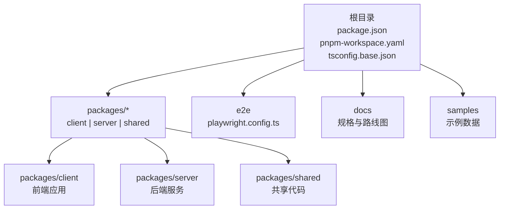
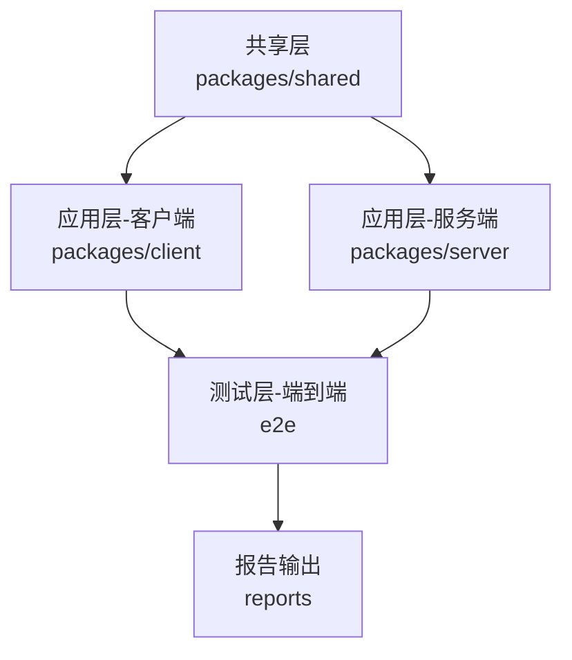
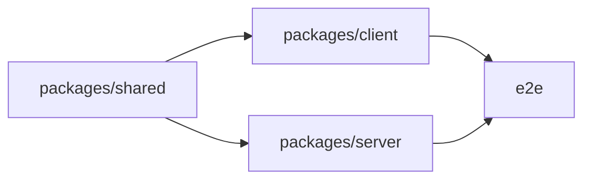

# 代码规范

<cite>
**本文档引用的文件**
- [package.json](file://package.json)
- [pnpm-workspace.yaml](file://pnpm-workspace.yaml)
- [tsconfig.base.json](file://tsconfig.base.json)
- [packages/client/package.json](file://packages/client/package.json)
- [packages/server/package.json](file://packages/server/package.json)
- [packages/shared/package.json](file://packages/shared/package.json)
- [e2e/package.json](file://e2e/package.json)
- [e2e/playwright.config.ts](file://e2e/playwright.config.ts)
- [.npmrc](file://.npmrc)
- [.gitignore](file://.gitignore)
</cite>

## 目录
1. [引言](#引言)
2. [项目结构](#项目结构)
3. [核心组件](#核心组件)
4. [架构总览](#架构总览)
5. [详细组件分析](#详细组件分析)
6. [依赖关系分析](#依赖关系分析)
7. [性能考虑](#性能考虑)
8. [故障排除指南](#故障排除指南)
9. [结论](#结论)
10. [附录](#附录)

## 引言
本文件为Scribe项目的代码规范与最佳实践指南，覆盖TypeScript编码标准、React组件设计原则、monorepo组织结构与包间依赖规范、共享代码管理策略、Git提交消息与分支命名约定、代码审查标准、ESLint与Prettier配置及自动化格式化设置，并提供性能优化与安全编码实践建议。目标是统一团队开发体验，提升代码质量与可维护性。

## 项目结构
Scribe采用monorepo架构，通过工作区管理多包协作。根目录包含全局配置与顶层依赖声明；packages目录下划分为客户端、服务端与共享模块；e2e目录提供端到端测试环境；docs与samples用于文档与示例数据管理。

**图表来源**
- [pnpm-workspace.yaml](file://pnpm-workspace.yaml)
- [package.json](file://package.json)
- [packages/client/package.json](file://packages/client/package.json)
- [packages/server/package.json](file://packages/server/package.json)
- [packages/shared/package.json](file://packages/shared/package.json)
- [e2e/package.json](file://e2e/package.json)

**章节来源**
- [pnpm-workspace.yaml](file://pnpm-workspace.yaml)
- [package.json](file://package.json)
- [tsconfig.base.json](file://tsconfig.base.json)

## 核心组件
- monorepo工作区：通过工作区文件声明各包路径，实现跨包依赖解析与统一脚本执行。
- TypeScript基础配置：通过基础配置集中管理编译选项、路径映射与严格性设置，供各包继承复用。
- 包级配置：client/server/shared各自维护独立的依赖、构建与运行时配置，确保职责清晰与边界明确。
- 端到端测试：独立的测试工作区与配置，隔离UI验证流程，避免与业务逻辑耦合。

**章节来源**
- [pnpm-workspace.yaml](file://pnpm-workspace.yaml)
- [tsconfig.base.json](file://tsconfig.base.json)
- [packages/client/package.json](file://packages/client/package.json)
- [packages/server/package.json](file://packages/server/package.json)
- [packages/shared/package.json](file://packages/shared/package.json)
- [e2e/package.json](file://e2e/package.json)
- [e2e/playwright.config.ts](file://e2e/playwright.config.ts)

## 架构总览
Scribe的架构围绕“共享层-应用层-测试层”展开。共享层提供跨平台通用能力；应用层分别面向客户端与服务端；测试层通过端到端工具保障关键流程稳定性。

**图表来源**
- [packages/shared/package.json](file://packages/shared/package.json)
- [packages/client/package.json](file://packages/client/package.json)
- [packages/server/package.json](file://packages/server/package.json)
- [e2e/package.json](file://e2e/package.json)

## 详细组件分析

### TypeScript编码标准
- 命名约定
  - 类型与接口使用帕斯卡命名法，如“类型名”。
  - 变量与函数使用驼峰命名法，如“变量名”。
  - 常量使用大写下划线分隔，如“常量名”。
  - 文件名采用帕斯卡命名法，如“文件名.ts”，避免使用连字符。
- 类型定义
  - 优先使用接口描述对象结构，使用类型别名处理联合与交叉类型。
  - 明确区分只读与可变属性，必要时使用只读数组与映射。
  - 使用泛型约束与条件类型提升类型表达力，避免any滥用。
- 模块组织
  - 将相关功能拆分为子模块，保持单一职责。
  - 使用显式导出与命名空间，避免深层嵌套。
  - 在共享层集中定义公共类型，减少重复与歧义。
- 编译与严格性
  - 继承基础配置，启用严格模式与合理的编译选项。
  - 路径映射与模块解析遵循工作区约定，避免相对路径地狱。

**章节来源**
- [tsconfig.base.json](file://tsconfig.base.json)
- [packages/shared/package.json](file://packages/shared/package.json)

### React组件设计原则
- 函数组件与Hooks
  - 优先使用函数组件与Hooks组合逻辑，避免类组件。
  - 将副作用封装在自定义Hook中，保持组件渲染逻辑纯净。
  - 合理拆分状态与派生状态，避免在同一层级管理过多状态。
- 状态管理
  - 局部状态优先，跨组件共享状态通过上下文或轻量状态库管理。
  - 对外部状态进行规范化与校验，防止脏数据进入组件。
- 性能优化
  - 使用memo与useMemo/useCallback缓存昂贵计算与子组件渲染。
  - 按需加载与懒加载，减少首屏负担。
  - 避免不必要的重渲染，合理划分组件边界。

**章节来源**
- [packages/client/package.json](file://packages/client/package.json)

### monorepo中的代码组织与依赖规范
- 包间依赖
  - 共享层作为上游依赖，客户端与服务端仅消费共享能力。
  - 客户端与服务端之间避免直接互相依赖，通过共享层或API契约解耦。
  - 工作区内部依赖通过包名解析，避免使用文件系统路径硬编码。
- 版本与发布
  - 统一版本策略，必要时采用固定版本或语义化版本。
  - 发布前进行一致性检查，确保依赖锁定与构建产物一致。
- 脚本与任务
  - 在根目录提供统一的开发与构建脚本，按包粒度执行任务。
  - 测试与构建命令在各自包内声明，便于独立运行与CI集成。

**章节来源**
- [pnpm-workspace.yaml](file://pnpm-workspace.yaml)
- [packages/client/package.json](file://packages/client/package.json)
- [packages/server/package.json](file://packages/server/package.json)
- [packages/shared/package.json](file://packages/shared/package.json)

### 共享代码管理
- 设计原则
  - 抽象通用能力，避免过早具体化；先有契约后有实现。
  - 保持向后兼容性，变更时提供迁移路径与弃用提示。
- 结构建议
  - 将类型、工具函数、常量与配置集中于共享层，按领域或功能分组。
  - 提供清晰的README与类型注释，降低使用成本。
- 访问控制
  - 限制共享层对外部系统的依赖，避免污染上层生态。
  - 对外暴露稳定API，内部实现可演进。

**章节来源**
- [packages/shared/package.json](file://packages/shared/package.json)

### Git提交消息规范
- 格式
  - 类型: 简要描述
  - 空行
  - 详细说明（可选）
  - 关联问题（可选）
- 类型
  - feat: 新功能
  - fix: 修复缺陷
  - docs: 文档更新
  - style: 格式调整（不影响逻辑）
  - refactor: 重构（既不修复错误也不新增功能）
  - perf: 性能优化
  - test: 测试相关
  - chore: 构建流程、依赖等杂项
- 示例
  - feat(shared): 添加用户权限模型
  - fix(client): 修复登录表单空指针异常
  - perf(server): 优化数据库查询缓存

### 分支命名约定
- 功能分支: feature/功能点简述
- 修复分支: fix/问题简述
- 文档分支: docs/文档主题
- 性能分支: perf/优化方向
- 热修复分支: hotfix/紧急修复

### 代码审查标准
- 正确性
  - 逻辑正确、边界处理完整、异常路径覆盖。
- 可读性
  - 命名清晰、注释充分、结构简洁。
- 兼容性
  - 不破坏现有API与行为；必要时提供迁移方案。
- 性能
  - 避免性能退化；对热点路径给出优化建议。
- 安全
  - 输入校验、权限控制、敏感信息处理符合安全基线。

### ESLint与Prettier配置与自动化格式化
- ESLint
  - 推荐使用TypeScript专用规则集，启用strict模式与import排序。
  - 自定义规则覆盖团队特定约束，如禁用console.warn以外的日志级别。
- Prettier
  - 统一缩进、引号、尾逗号与行宽；与编辑器保存钩子联动。
- 自动化
  - 在提交前执行lint与format，失败则阻止提交。
  - CI中增加lint与格式检查步骤，保证主干质量。

**章节来源**
- [package.json](file://package.json)
- [packages/client/package.json](file://packages/client/package.json)
- [packages/server/package.json](file://packages/server/package.json)
- [packages/shared/package.json](file://packages/shared/package.json)

### 端到端测试与质量门禁
- 配置
  - 使用独立配置文件管理浏览器、超时与截图策略。
  - 将测试脚本与报告输出分离，便于CI集成。
- 门禁
  - 通过脚本在本地与CI中强制执行测试，未通过不得合并。
  - 关键流程必须有端到端覆盖，避免回归。

**章节来源**
- [e2e/package.json](file://e2e/package.json)
- [e2e/playwright.config.ts](file://e2e/playwright.config.ts)

## 依赖关系分析
Scribe的依赖关系以共享层为核心，客户端与服务端分别消费共享能力，形成稳定的上层-底层依赖拓扑。

**图表来源**
- [pnpm-workspace.yaml](file://pnpm-workspace.yaml)
- [packages/shared/package.json](file://packages/shared/package.json)
- [packages/client/package.json](file://packages/client/package.json)
- [packages/server/package.json](file://packages/server/package.json)
- [e2e/package.json](file://e2e/package.json)

**章节来源**
- [pnpm-workspace.yaml](file://pnpm-workspace.yaml)
- [packages/shared/package.json](file://packages/shared/package.json)
- [packages/client/package.json](file://packages/client/package.json)
- [packages/server/package.json](file://packages/server/package.json)

## 性能考虑
- 渲染性能
  - 使用虚拟列表处理长列表；合理拆分组件，避免不必要的重渲染。
- 网络性能
  - 请求去抖与节流；缓存策略与失效机制；按需加载资源。
- 内存管理
  - 及时清理事件监听与定时器；避免闭包持有大对象。
- 数据处理
  - 批处理与异步化；对大数据结构使用高效算法与数据结构。

## 故障排除指南
- 常见问题
  - 依赖解析失败：检查工作区包名与版本，确认pnpm安装完成。
  - 类型错误：统一升级共享层类型定义，确保客户端/服务端同步更新。
  - 端到端测试失败：核对浏览器驱动版本与页面元素定位策略。
- 调试建议
  - 使用最小复现场景；逐步缩小范围；结合日志与断点定位。
  - 在CI日志中查找失败节点，针对性修复。

**章节来源**
- [pnpm-workspace.yaml](file://pnpm-workspace.yaml)
- [e2e/playwright.config.ts](file://e2e/playwright.config.ts)

## 结论
通过统一的代码规范与最佳实践，Scribe能够在多包协作中保持一致性与可维护性。建议团队在日常开发中严格执行命名、类型、模块与依赖规范，配合ESLint/Prettier自动化工具与端到端测试门禁，持续提升代码质量与交付效率。

## 附录
- 开发工具与配置
  - .npmrc：全局NPM配置与registry设置。
  - .gitignore：版本控制忽略规则。
- 运行与构建
  - 根目录与各包内提供统一脚本入口，便于本地与CI使用。
- 文档与示例
  - docs目录存放产品规划与技术规格；samples提供示例数据。

**章节来源**
- [.npmrc](file://.npmrc)
- [.gitignore](file://.gitignore)
- [package.json](file://package.json)