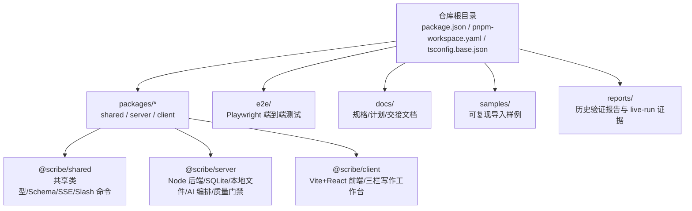
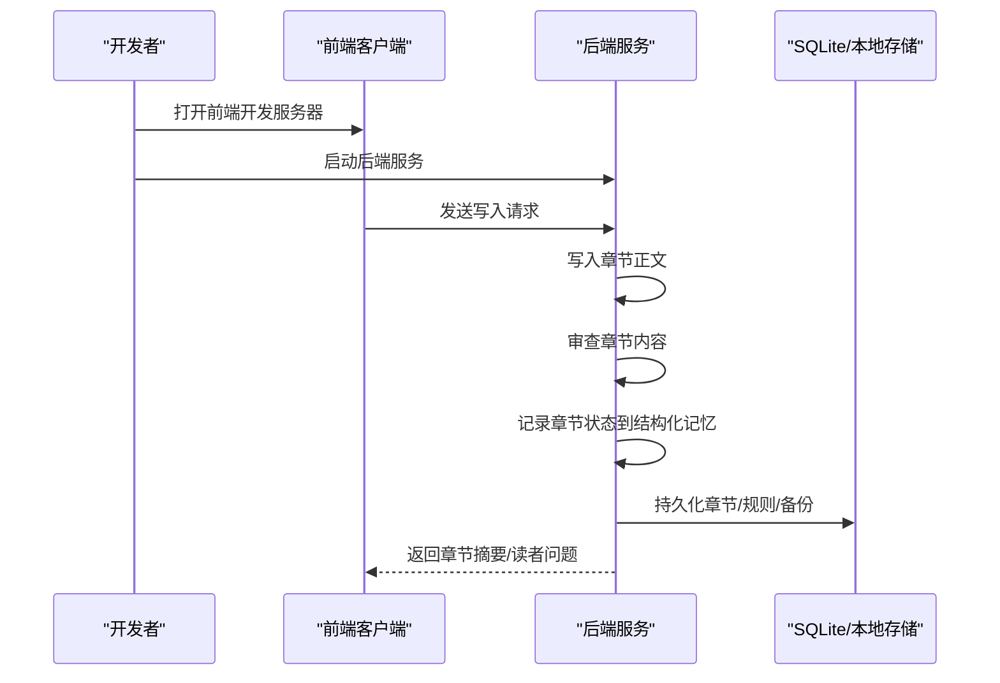
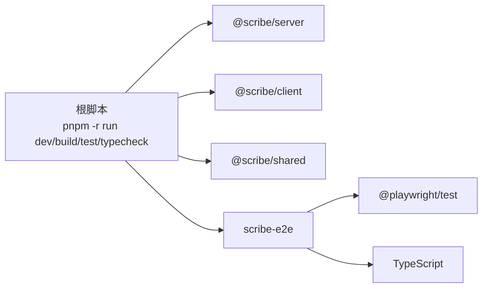

# 开发指南

<cite>
**本文引用的文件**
- [package.json](file://package.json)
- [pnpm-workspace.yaml](file://pnpm-workspace.yaml)
- [tsconfig.base.json](file://tsconfig.base.json)
- [README.md](file://README.md)
- [docs/README.md](file://docs/README.md)
- [docs/HANDOFF-codex.md](file://docs/HANDOFF-codex.md)
- [e2e/package.json](file://e2e/package.json)
- [e2e/playwright.config.ts](file://e2e/playwright.config.ts)
</cite>

## 目录
1. [简介](#简介)
2. [项目结构](#项目结构)
3. [核心组件](#核心组件)
4. [架构总览](#架构总览)
5. [详细组件分析](#详细组件分析)
6. [依赖分析](#依赖分析)
7. [性能考虑](#性能考虑)
8. [故障排除指南](#故障排除指南)
9. [结论](#结论)
10. [附录](#附录)

## 简介
本指南面向参与 Scribe 项目的开发者，提供从环境搭建、代码规范与最佳实践、测试策略与 TDD 方法、贡献流程、性能与安全、发布与兼容性，到常见问题排查的完整开发手册。Scribe 是一个“本地优先”的长篇小说创作工作台，目标是将设定、世界书、预设、对话意图、章节正文、审查结果与长期记忆整合为可持续推进的写作项目。

## 项目结构
仓库采用 pnpm monorepo 结构，根目录通过脚本统一管理多包构建与测试；端到端测试位于独立的 e2e 包中，使用 Playwright 并内置 Web 服务启动逻辑。

图表来源
- [pnpm-workspace.yaml:1-4](file://pnpm-workspace.yaml#L1-L4)
- [README.md:44-55](file://README.md#L44-L55)

章节来源
- [pnpm-workspace.yaml:1-4](file://pnpm-workspace.yaml#L1-L4)
- [README.md:44-55](file://README.md#L44-L55)

## 核心组件
- 仓库脚本与工具链
  - 使用 pnpm 9 与 Node.js ≥ 20（建议 24），启用 pnpm workspaces 管理多包。
  - 根脚本提供 dev/build/test/typecheck 等统一入口，支持并行执行。
- 类型系统
  - 统一的 tsconfig 基础配置，启用严格模式、索引访问校验等，确保类型安全。
- 端到端测试
  - e2e 包使用 Playwright，内置 webServer 启动后端，自动安装浏览器，支持 HTML 报告输出与重试策略。

章节来源
- [package.json:1-21](file://package.json#L1-L21)
- [tsconfig.base.json:1-16](file://tsconfig.base.json#L1-L16)
- [e2e/package.json:1-15](file://e2e/package.json#L1-L15)
- [e2e/playwright.config.ts:1-27](file://e2e/playwright.config.ts#L1-L27)

## 架构总览
Scribe 的核心工作流由“写入-审查-记录状态”三步组成，强调在最终文本确定后再进行结构化记忆写入，以避免错误记忆污染后续章节。该循环在端到端监控中被反复验证，确保长篇连续性与质量门禁有效运行。

图表来源
- [docs/HANDOFF-codex.md:151-170](file://docs/HANDOFF-codex.md#L151-L170)

章节来源
- [docs/HANDOFF-codex.md:151-170](file://docs/HANDOFF-codex.md#L151-L170)

## 详细组件分析

### 环境搭建与 IDE 配置
- 运行时与包管理
  - Node.js 版本要求：≥ 20（建议 24）
  - 包管理器：pnpm 9
  - 工作区：packages/* 与 e2e
- 初始化与启动
  - 安装依赖：使用 pnpm 安装
  - 启动后端：过滤器 @scribe/server 执行 tsx 启动主程序
  - 启动前端：过滤器 @scribe/client 启动 Vite 开发服务器
  - 配置 API Key：在数据目录创建 secrets.env（默认路径随平台变化，可通过环境变量覆盖）
- 端到端测试
  - 在 e2e 包内安装浏览器二进制
  - 使用 Playwright 启动本地 Web 服务，连接后端健康检查端点
  - 输出 HTML 报告，支持重试与超时控制

章节来源
- [README.md:5-34](file://README.md#L5-L34)
- [e2e/playwright.config.ts:16-26](file://e2e/playwright.config.ts#L16-L26)

### 代码规范与最佳实践
- TypeScript 编码标准
  - 严格模式开启，索引访问校验，跳过库类型检查，模块解析使用 Bundler
  - 推荐使用 verbatimModuleSyntax 保持一致性
- React 组件设计原则
  - 建议遵循单一职责、可组合、可测试的设计；组件状态尽量下沉，副作用集中在 hooks 中
  - 与后端交互通过明确的 API 层封装，避免在组件内直接拼接 URL 或处理复杂序列化
- Git 工作流程
  - 建议采用功能分支 + Pull Request 的方式，PR 合并前需通过单元/集成/端到端测试与类型检查
  - 提交信息清晰描述变更动机与影响范围，必要时关联相关文档与任务

章节来源
- [tsconfig.base.json:2-14](file://tsconfig.base.json#L2-L14)
- [README.md:36-42](file://README.md#L36-L42)

### 测试策略与 TDD 方法
- 单元测试与集成测试
  - 使用 Vitest 进行单元与集成测试，覆盖 server/shared/client 三个包
  - 重点验证：写入-审查-记录状态的闭环、输出净化、硬事实一致性门禁、世界书检索与上下文注入
- 端到端测试（E2E）
  - Playwright 配置内置 Web 服务，自动安装浏览器，超时与重试策略已设定
  - 建议在 PR 中运行端到端测试，确保真实服务场景下的稳定性
- 持续集成（CI）建议
  - 建议在 CI 中执行：pnpm test、pnpm test:e2e、pnpm typecheck
  - 将端到端测试报告上传为工件，便于回溯问题

章节来源
- [package.json:6-11](file://package.json#L6-L11)
- [e2e/package.json:6-9](file://e2e/package.json#L6-L9)
- [e2e/playwright.config.ts:10-15](file://e2e/playwright.config.ts#L10-L15)

### 贡献指南
- Pull Request 流程
  - 新功能/修复基于最新分支创建特性分支
  - 提交 PR 前确保通过本地测试、类型检查与端到端验证
  - 在 PR 描述中说明变更目的、影响范围与验证方法
- 代码审查标准
  - 关注：可读性、可维护性、性能与安全性；是否满足长篇连续性与质量门禁
  - 必须通过自动化检查与至少一名维护者批准
- 问题报告模板
  - 环境信息（操作系统、Node/pnpm 版本）
  - 复现步骤与期望/实际行为
  - 日志与端到端报告链接（如适用）

章节来源
- [README.md:36-42](file://README.md#L36-L42)
- [docs/HANDOFF-codex.md:536-588](file://docs/HANDOFF-codex.md#L536-L588)

### 性能优化建议
- 代码层面
  - 减少不必要的对象深拷贝与重复计算，合理拆分大函数
  - 使用惰性加载与缓存策略（如上下文构建与检索结果）
- 运行时
  - 控制端到端测试并发度，避免磁盘与网络成为瓶颈
  - 合理设置 Playwright 超时与重试次数，平衡稳定性与速度
- 存储与备份
  - 按书籍隔离数据目录，定期清理过期备份，避免无界增长

章节来源
- [README.md:57-62](file://README.md#L57-L62)
- [e2e/playwright.config.ts:11-12](file://e2e/playwright.config.ts#L11-L12)

### 安全考虑
- 秘钥与敏感信息
  - secrets.env 放置于数据目录，不在仓库中提交
  - 避免在代码或提交中泄露任何密钥或私有导出
- 输入净化
  - 输出净化模块移除 SillyTavern 风格的元信息块，仅保留故事内可见的状态面板文本
- 权限与隔离
  - 端到端测试使用独立数据目录，避免与本地开发数据冲突

章节来源
- [README.md:16-23](file://README.md#L16-L23)
- [docs/HANDOFF-codex.md:256-288](file://docs/HANDOFF-codex.md#L256-L288)

### 部署前检查清单
- 本地验证
  - 通过 pnpm test 与 pnpm typecheck
  - 运行端到端测试，检查 HTML 报告
  - 手动验证关键斜杠命令与导入流程
- 环境准备
  - 确认 Node ≥ 20、pnpm 9
  - 确认数据目录权限与空间充足
- 文档与证据
  - 更新相关文档与交接材料
  - 清理临时产物与未跟踪的私有导出

章节来源
- [README.md:36-42](file://README.md#L36-L42)
- [docs/HANDOFF-codex.md:519-535](file://docs/HANDOFF-codex.md#L519-L535)

### 开发周期、版本发布与兼容性
- 开发周期
  - 建议采用短周期迭代，每个周期聚焦于特定质量门禁与功能闭环
- 版本发布
  - 建议遵循语义化版本，重大变更与破坏性修改提升主版本号
- 向后兼容性
  - 保持 API 与数据模型稳定，对破坏性变更提供迁移指南与过渡期

章节来源
- [docs/HANDOFF-codex.md:536-588](file://docs/HANDOFF-codex.md#L536-L588)

### 常见问题与调试技巧
- 端到端测试无法连接后端
  - 检查 Playwright webServer 配置中的端口与健康检查 URL
  - 确认后端服务已监听 127.0.0.1:6789
- 浏览器安装失败
  - 在 e2e 包中执行安装浏览器命令
- 类型检查失败
  - 使用 pnpm typecheck 全量检查，定位严格模式相关的类型问题
- 斜杠命令无效
  - 确认前端已正确代理 /api 到后端端口，且后端已启动

章节来源
- [e2e/playwright.config.ts:16-25](file://e2e/playwright.config.ts#L16-L25)
- [e2e/package.json:8](file://e2e/package.json#L8)
- [README.md:24-34](file://README.md#L24-L34)

## 依赖分析
- 工作区与包关系
  - packages/* 与 e2e 由 pnpm-workspace.yaml 管理
  - 根脚本统一调度各包的 dev/build/test/typecheck
- 端到端测试依赖
  - Playwright 作为测试框架，tsx 启动后端，HTML 报告输出

图表来源
- [package.json:6-11](file://package.json#L6-L11)
- [pnpm-workspace.yaml:1-4](file://pnpm-workspace.yaml#L1-L4)
- [e2e/package.json:10-13](file://e2e/package.json#L10-L13)

章节来源
- [package.json:6-11](file://package.json#L6-L11)
- [pnpm-workspace.yaml:1-4](file://pnpm-workspace.yaml#L1-L4)
- [e2e/package.json:10-13](file://e2e/package.json#L10-L13)

## 性能考虑
- 代码与运行时优化
  - 严格类型检查有助于提前发现潜在性能问题
  - 端到端测试应避免过度并发，减少磁盘与网络争用
- 数据与存储
  - 按书籍隔离数据目录，定期清理过期备份，避免无界增长

章节来源
- [tsconfig.base.json:7-10](file://tsconfig.base.json#L7-L10)
- [README.md:57-62](file://README.md#L57-L62)

## 故障排除指南
- 端到端测试失败
  - 检查 webServer 命令与健康检查端点
  - 查看 HTML 报告定位具体失败用例
- 类型检查失败
  - 使用 pnpm typecheck 全量检查，逐项修复严格模式相关问题
- 导入与连续性问题
  - 使用提供的工具与命令验证导入与长篇监控，关注状态记录是否成功

章节来源
- [e2e/playwright.config.ts:16-25](file://e2e/playwright.config.ts#L16-L25)
- [README.md:36-42](file://README.md#L36-L42)
- [docs/HANDOFF-codex.md:589-622](file://docs/HANDOFF-codex.md#L589-L622)

## 结论
本开发指南围绕 Scribe 的 monorepo 结构、核心工作流、测试策略与贡献流程提供了系统化的实践建议。建议团队在日常开发中坚持 TDD 与端到端验证，重视长篇连续性与质量门禁，确保代码与写作质量双达标。

## 附录
- 建议阅读顺序（文档）
  - 产品目标 → Phase 1 计划 → 最终路线图 → 交接文档 → 实施笔记
- 关键命令速查
  - 安装：pnpm install
  - 启动后端：pnpm --filter @scribe/server exec tsx src/main.ts
  - 启动前端：pnpm --filter @scribe/client dev
  - 测试：pnpm test / pnpm test:e2e / pnpm typecheck
  - 端到端安装浏览器：pnpm --filter scribe-e2e run install-browsers

章节来源
- [docs/README.md:5-24](file://docs/README.md#L5-L24)
- [README.md:10-42](file://README.md#L10-L42)