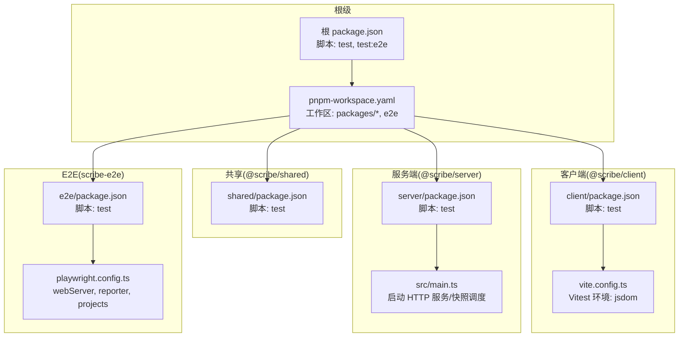
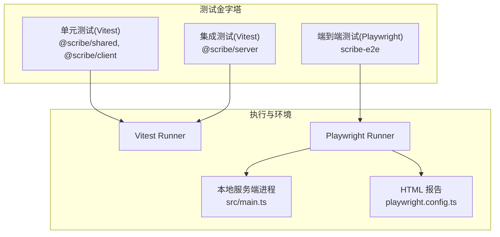
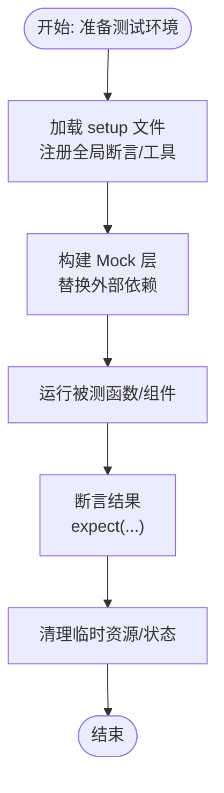
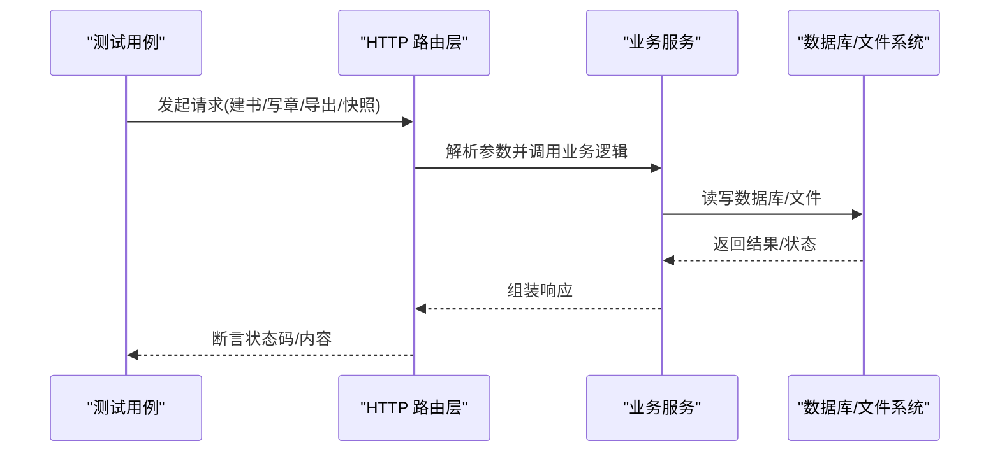
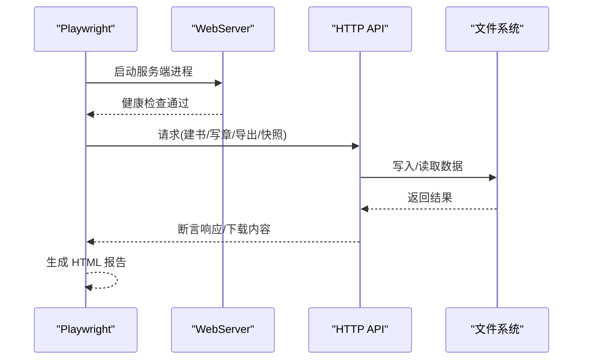
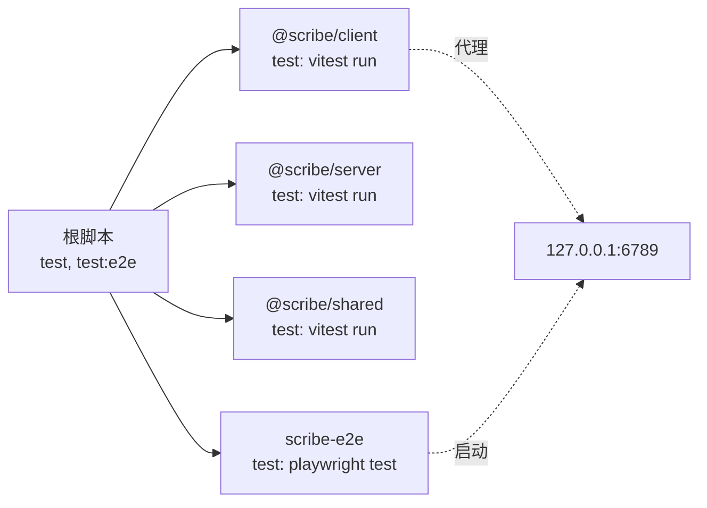

# 测试策略

<cite>
**本文引用的文件**
- [package.json](file://package.json)
- [pnpm-workspace.yaml](file://pnpm-workspace.yaml)
- [e2e/package.json](file://e2e/package.json)
- [e2e/playwright.config.ts](file://e2e/playwright.config.ts)
- [packages/client/package.json](file://packages/client/package.json)
- [packages/server/package.json](file://packages/server/package.json)
- [packages/shared/package.json](file://packages/shared/package.json)
- [packages/client/vite.config.ts](file://packages/client/vite.config.ts)
- [packages/server/src/main.ts](file://packages/server/src/main.ts)
- [e2e/tests/smoke.spec.ts](file://e2e/tests/smoke.spec.ts)
- [e2e/tests/core-journey.spec.ts](file://e2e/tests/core-journey.spec.ts)
</cite>

## 目录
1. [引言](#引言)
2. [项目结构](#项目结构)
3. [核心组件](#核心组件)
4. [架构总览](#架构总览)
5. [详细组件分析](#详细组件分析)
6. [依赖分析](#依赖分析)
7. [性能考虑](#性能考虑)
8. [故障排查指南](#故障排查指南)
9. [结论](#结论)
10. [附录](#附录)

## 引言
本文件为 Scribe 项目的测试策略与实施指南，围绕测试金字塔（单元测试、集成测试、端到端测试）展开，结合当前仓库中已有的 Vitest 与 Playwright 配置与用例，给出可落地的测试实施方法、Mock 策略、断言最佳实践、测试数据管理与覆盖率目标，并补充持续集成中的自动化测试流程、测试报告生成与性能回归检测建议。同时，提供测试驱动开发（TDD）在本项目中的应用思路。

## 项目结构
Scribe 采用 monorepo 结构，通过 pnpm workspace 管理多包，包含客户端、服务端、共享模块以及 E2E 测试子工程。根级脚本统一调度各包测试；E2E 子工程独立管理 Playwright 测试与浏览器生命周期。

**图表来源**
- [package.json:1-21](file://package.json#L1-L21)
- [pnpm-workspace.yaml:1-4](file://pnpm-workspace.yaml#L1-L4)
- [packages/client/vite.config.ts:1-20](file://packages/client/vite.config.ts#L1-L20)
- [packages/server/src/main.ts:1-96](file://packages/server/src/main.ts#L1-L96)
- [e2e/playwright.config.ts:1-27](file://e2e/playwright.config.ts#L1-L27)

**章节来源**
- [package.json:1-21](file://package.json#L1-L21)
- [pnpm-workspace.yaml:1-4](file://pnpm-workspace.yaml#L1-L4)

## 核心组件
- 客户端测试：基于 Vitest + jsdom，使用 Vite 插件 React，代理后端接口到本地服务端进程，便于 UI 组件与状态逻辑的单元测试。
- 服务端测试：基于 Vitest，覆盖路由、业务流程与持久化行为；当前以集成测试为主，包含大量 API 级别的端到端风格用例。
- 共享模块测试：基于 Vitest，聚焦纯函数与数据校验等可测试逻辑。
- E2E 测试：基于 Playwright，自管浏览器生命周期，启动真实服务端进程进行 API 级端到端验证。

**章节来源**
- [packages/client/package.json:1-39](file://packages/client/package.json#L1-L39)
- [packages/server/package.json:1-33](file://packages/server/package.json#L1-L33)
- [packages/shared/package.json:1-19](file://packages/shared/package.json#L1-L19)
- [e2e/package.json:1-15](file://e2e/package.json#L1-L15)

## 架构总览
下图展示测试金字塔在本项目中的落地形态与交互关系：

**图表来源**
- [packages/client/vite.config.ts:14-18](file://packages/client/vite.config.ts#L14-L18)
- [packages/server/package.json:10](file://packages/server/package.json#L10)
- [packages/shared/package.json:8](file://packages/shared/package.json#L8)
- [e2e/playwright.config.ts:9-26](file://e2e/playwright.config.ts#L9-L26)
- [packages/server/src/main.ts:64-75](file://packages/server/src/main.ts#L64-L75)

## 详细组件分析

### 单元测试（@scribe/shared 与 @scribe/client）
- 环境与配置
  - 使用 jsdom 作为 DOM 环境，支持 React 组件渲染与事件模拟。
  - 通过 setup 文件注入全局测试工具，便于统一断言与辅助函数。
- Mock 策略
  - 对外部依赖（如网络请求、文件系统）进行模块层替换或函数替身，隔离副作用。
  - 对 AI/模型调用使用 stub，避免真实 API key 与网络开销。
- 断言最佳实践
  - 使用明确的 expect 语句表达期望值，配合 toBe、toContain、toHaveLength 等匹配器。
  - 对异步逻辑使用 await 并对错误场景进行显式断言。
- 数据与状态
  - 使用测试专用的临时目录或内存存储，避免污染真实数据。
  - 对于状态管理（如 zustand），通过重置 store 或替换依赖实现可控状态。

**章节来源**
- [packages/client/vite.config.ts:14-18](file://packages/client/vite.config.ts#L14-L18)
- [packages/client/package.json:25-37](file://packages/client/package.json#L25-L37)
- [packages/shared/package.json:14-17](file://packages/shared/package.json#L14-L17)

### 集成测试（@scribe/server）
- 覆盖范围
  - 路由层：书籍、章节、导出、快照、用量与设置等 API。
  - 业务流程：新建书籍、手动写作、读回校验、导出下载、快照创建与恢复。
  - 持久化：SQLite 数据库一致性与备份策略验证。
- Mock 策略
  - 对 AI 模型调用进行 stub，确保非模型路径也能完整验证端到端流程。
  - 对外部服务（如第三方 API）进行替身，保证测试稳定与可重复。
- 断言最佳实践
  - 对响应状态码、JSON 结构与内容片段进行断言。
  - 对副作用（文件写入、数据库变更）进行二次读取验证。
- 数据与状态
  - 使用独立的数据目录与数据库文件，避免跨测试干扰。
  - 在测试前后进行清理，确保每次运行的初始状态一致。

**章节来源**
- [packages/server/package.json:10](file://packages/server/package.json#L10)
- [packages/server/src/main.ts:64-75](file://packages/server/src/main.ts#L64-L75)

### 端到端测试（scribe-e2e）
- 配置要点
  - 使用 webServer 启动真实服务端进程，确保与生产相近的运行时。
  - 设置 baseURL、超时与重试策略，提升稳定性。
  - HTML 报告输出，便于 CI 中归档与审阅。
- Mock 策略
  - 对 AI 写作路径使用 stub，避免真实模型调用。
  - 对浏览器行为（如下载）进行断言与文件落盘验证。
- 断言最佳实践
  - 对健康检查、列表可见性、内容一致性、下载完整性进行断言。
  - 对恢复流程进行正反向验证（确认词缺失时应拒绝）。
- 数据与状态
  - 使用独立的 e2e 数据目录，按 bookId 隔离，避免相互影响。
  - 用例间尽量保持幂等，必要时在测试后清理。

**图表来源**
- [e2e/playwright.config.ts:16-25](file://e2e/playwright.config.ts#L16-L25)
- [e2e/tests/core-journey.spec.ts:8-81](file://e2e/tests/core-journey.spec.ts#L8-L81)

**章节来源**
- [e2e/package.json:6-9](file://e2e/package.json#L6-L9)
- [e2e/playwright.config.ts:1-27](file://e2e/playwright.config.ts#L1-L27)
- [e2e/tests/smoke.spec.ts:1-7](file://e2e/tests/smoke.spec.ts#L1-L7)
- [e2e/tests/core-journey.spec.ts:1-82](file://e2e/tests/core-journey.spec.ts#L1-L82)

## 依赖分析
- 工作区与脚本
  - 根级脚本统一触发各包测试；E2E 通过过滤器单独执行。
  - 工作区声明包含 packages/* 与 e2e，确保依赖解析正确。
- 测试工具链
  - 客户端与共享模块使用 Vitest；服务端与 E2E 使用 Vitest 与 Playwright。
  - 客户端通过代理将 /api 与 /sse 转发至本地服务端端口，便于联调。

**图表来源**
- [package.json:6-11](file://package.json#L6-L11)
- [pnpm-workspace.yaml:1-4](file://pnpm-workspace.yaml#L1-L4)
- [packages/client/vite.config.ts:9-12](file://packages/client/vite.config.ts#L9-L12)
- [e2e/playwright.config.ts:16-21](file://e2e/playwright.config.ts#L16-L21)

**章节来源**
- [package.json:6-11](file://package.json#L6-L11)
- [pnpm-workspace.yaml:1-4](file://pnpm-workspace.yaml#L1-L4)
- [packages/client/vite.config.ts:9-12](file://packages/client/vite.config.ts#L9-L12)

## 性能考虑
- 测试执行速度
  - 单元测试优先，减少对外部依赖的耦合，提高执行效率。
  - 集成测试聚焦关键路径，避免冗长的等待与 IO。
- 资源隔离
  - 使用独立数据目录与临时文件，避免并发测试互相影响。
  - E2E 使用独立的 webServer，避免端口冲突与状态污染。
- 报告与可视化
  - 使用 HTML 报告便于快速定位问题；在 CI 中归档报告以便追溯。

## 故障排查指南
- 端口占用与服务未就绪
  - 确认服务端监听地址与端口配置一致；在 webServer 启动后等待健康检查通过。
- 浏览器安装与缓存
  - 使用安装脚本准备浏览器；必要时清理缓存或更换浏览器版本。
- 数据隔离与状态残留
  - 清理 e2e 数据目录或在测试前初始化；确保每次运行的初始状态一致。
- 断言失败定位
  - 逐步缩小范围：先验证网络请求是否成功，再检查响应体结构与内容。

**章节来源**
- [e2e/playwright.config.ts:16-25](file://e2e/playwright.config.ts#L16-L25)
- [e2e/tests/core-journey.spec.ts:10-12](file://e2e/tests/core-journey.spec.ts#L10-L12)

## 结论
本项目已具备完整的测试金字塔基础：单元测试覆盖共享与客户端，集成测试覆盖服务端关键流程，E2E 以 Playwright 验证真实服务端行为。建议在现有基础上完善覆盖率目标、引入 TDD 流程、优化 Mock 策略与报告体系，并在 CI 中加入性能回归检测，以进一步提升质量与交付效率。

## 附录

### 测试金字塔实施清单
- 单元测试
  - 覆盖率：共享模块与客户端核心逻辑达到高覆盖率。
  - Mock：对外部依赖进行模块层替换，确保可重复性。
- 集成测试
  - 覆盖率：关键路由与业务流程达到中高覆盖率。
  - Mock：对 AI 模型调用进行 stub，保证非模型路径验证。
- 端到端测试
  - 覆盖率：核心用户旅程与关键 API 达到高覆盖率。
  - Mock：对 AI 写作路径进行 stub，避免真实密钥与网络。

### 测试数据管理
- 临时目录：使用独立的临时目录存放测试数据，避免污染真实数据。
- 初始化与清理：在测试前初始化最小化数据集，在测试后清理。
- 隔离策略：按测试类型与用例维度隔离数据，避免并发冲突。

### 持续集成与自动化
- 自动化流程
  - 触发条件：PR/MR 合并请求与主分支推送。
  - 步骤：安装依赖、类型检查、单元测试、集成测试、E2E 测试、生成报告。
- 报告与归档
  - HTML 报告与日志归档，便于审阅与回溯。
- 性能回归检测
  - 记录关键测试耗时阈值，CI 中对比历史数据，发现异常波动即告警。

### 测试驱动开发（TDD）实践
- 红—绿—重构循环
  - 编写失败的测试用例（红）→ 实现最小功能使其通过（绿）→ 重构代码与测试（重构）。
- 从用户故事出发
  - 将用户故事拆解为可测试的验收标准，先写 E2E 场景，再写集成与单元测试。
- Mock 与替身
  - 在 TDD 过程中尽早引入替身，隔离外部依赖，确保测试稳定。
- 覆盖率与质量门禁
  - 设定覆盖率门槛，结合静态分析与报告，持续改进测试质量。