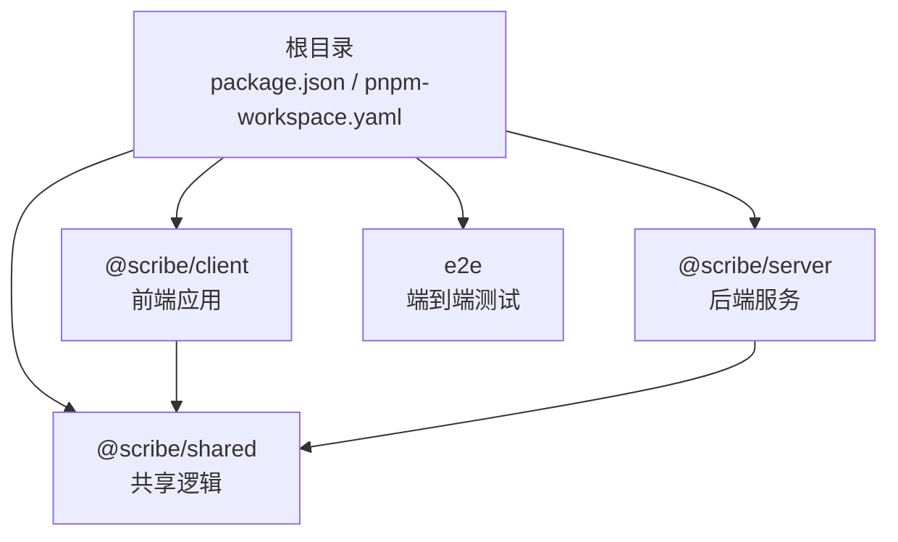
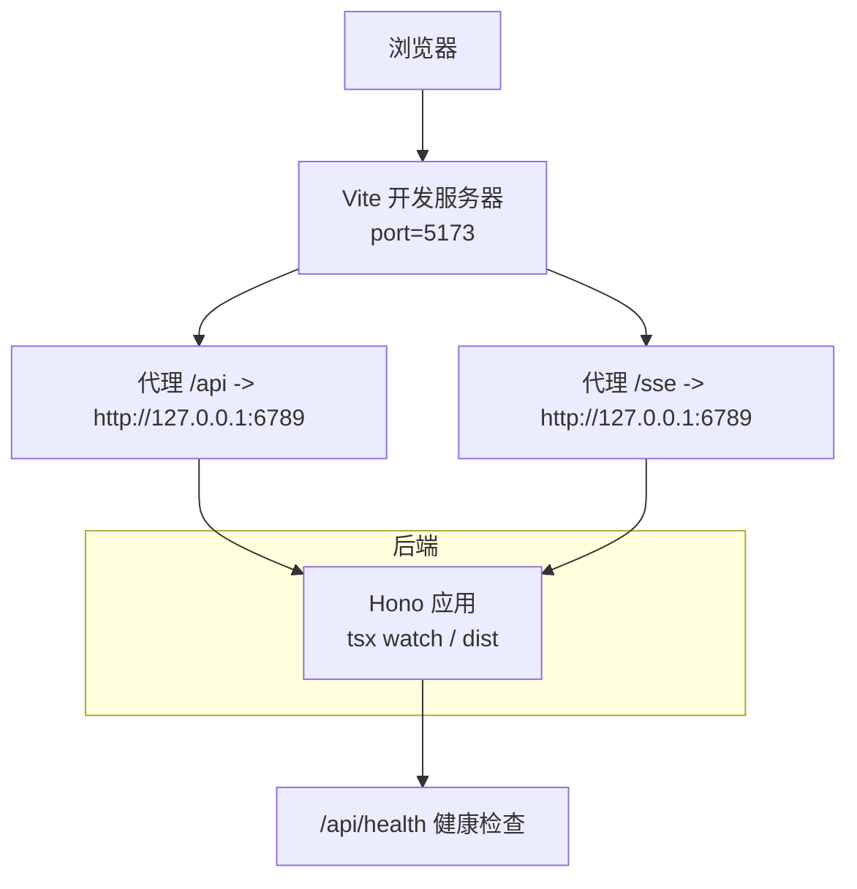
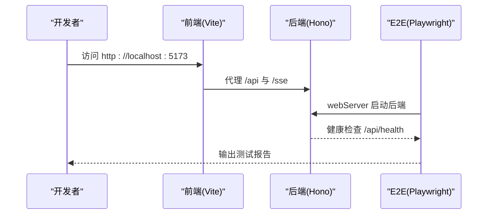
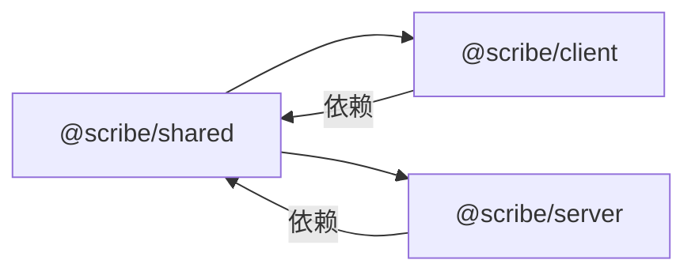

# 环境搭建

<cite>
**本文引用的文件**
- [package.json](file://package.json)
- [pnpm-workspace.yaml](file://pnpm-workspace.yaml)
- [.npmrc](file://.npmrc)
- [tsconfig.base.json](file://tsconfig.base.json)
- [packages/client/package.json](file://packages/client/package.json)
- [packages/server/package.json](file://packages/server/package.json)
- [packages/shared/package.json](file://packages/shared/package.json)
- [e2e/package.json](file://e2e/package.json)
- [e2e/playwright.config.ts](file://e2e/playwright.config.ts)
- [packages/client/vite.config.ts](file://packages/client/vite.config.ts)
- [packages/server/tsconfig.json](file://packages/server/tsconfig.json)
- [packages/server/tsconfig.build.json](file://packages/server/tsconfig.build.json)
- [packages/client/tsconfig.json](file://packages/client/tsconfig.json)
</cite>

## 目录
1. [简介](#简介)
2. [项目结构](#项目结构)
3. [核心组件](#核心组件)
4. [架构总览](#架构总览)
5. [详细组件分析](#详细组件分析)
6. [依赖分析](#依赖分析)
7. [性能考虑](#性能考虑)
8. [故障排除指南](#故障排除指南)
9. [结论](#结论)
10. [附录](#附录)

## 简介
本指南面向首次搭建 Scribe 项目的开发者，覆盖系统要求、依赖安装、开发工具与 IDE 配置、调试环境与本地服务启动、monorepo 包管理与联调流程，以及常见问题排查。项目采用 PNPM 工作区组织多包结构，前端使用 Vite + React，后端基于 Hono + TypeScript，共享逻辑位于 shared 包，并通过 E2E 测试保障端到端质量。

## 项目结构
Scribe 采用 monorepo 结构，根目录通过工作区配置聚合各子包与 E2E 测试目录。核心模块划分如下：
- packages/client：前端应用（React/Vite）
- packages/server：后端服务（Hono/TypeScript）
- packages/shared：共享类型与工具
- e2e：端到端测试（Playwright）

图表来源
- [pnpm-workspace.yaml:1-4](file://pnpm-workspace.yaml#L1-L4)
- [packages/client/package.json:1-39](file://packages/client/package.json#L1-L39)
- [packages/server/package.json:1-33](file://packages/server/package.json#L1-L33)
- [packages/shared/package.json:1-19](file://packages/shared/package.json#L1-L19)
- [e2e/package.json:1-15](file://e2e/package.json#L1-L15)

章节来源
- [pnpm-workspace.yaml:1-4](file://pnpm-workspace.yaml#L1-L4)
- [package.json:1-21](file://package.json#L1-L21)

## 核心组件
- 前端客户端：负责编辑器与界面交互，通过 Vite 提供开发服务器与代理，构建产物用于部署或预览。
- 后端服务：提供 API 与 SSE 接口，使用 Hono 框架，TypeScript 编译输出至 dist 目录。
- 共享包：包含跨域复用的类型定义与工具，被前后端共同依赖。
- E2E 测试：以 Playwright 驱动，自动拉起后端服务进行端到端验证。

章节来源
- [packages/client/package.json:1-39](file://packages/client/package.json#L1-L39)
- [packages/server/package.json:1-33](file://packages/server/package.json#L1-L33)
- [packages/shared/package.json:1-19](file://packages/shared/package.json#L1-L19)
- [e2e/package.json:1-15](file://e2e/package.json#L1-L15)

## 架构总览
下图展示本地开发时的典型交互：浏览器访问前端开发服务器，请求经由 Vite 代理转发到后端；后端健康检查接口用于 E2E 启动前的可用性确认。

图表来源
- [packages/client/vite.config.ts:1-20](file://packages/client/vite.config.ts#L1-L20)
- [e2e/playwright.config.ts:16-25](file://e2e/playwright.config.ts#L16-L25)

章节来源
- [packages/client/vite.config.ts:1-20](file://packages/client/vite.config.ts#L1-L20)
- [e2e/playwright.config.ts:16-25](file://e2e/playwright.config.ts#L16-L25)

## 详细组件分析

### 系统要求与安装前置
- Node.js 版本：>= 20.0.0（由根目录 engines 字段约束）
- 包管理器：PNPM（版本在根 package.json 中声明）
- 安装方式：使用 PNPM 工作区统一安装所有包依赖

章节来源
- [package.json:18-19](file://package.json#L18-L19)

### 依赖安装与工作区配置
- 工作区范围：packages/* 与 e2e
- 依赖解析策略：严格处理 peer 依赖，自动安装 peers
- 根级脚本：提供并行开发、构建、测试与类型检查命令

章节来源
- [pnpm-workspace.yaml:1-4](file://pnpm-workspace.yaml#L1-L4)
- [.npmrc:1-3](file://.npmrc#L1-L3)
- [package.json:6-12](file://package.json#L6-L12)

### TypeScript 基础配置
- 目标与模块：ES2022 + ESNext + Bundler 解析
- 严格模式：开启严格检查与索引访问安全
- 工具选项：跳过库检查、JSON 模块解析、隔离模块等
- 子包继承：各子包通过 extends 继承基础配置

章节来源
- [tsconfig.base.json:1-16](file://tsconfig.base.json#L1-L16)
- [packages/client/tsconfig.json:1-10](file://packages/client/tsconfig.json#L1-L10)
- [packages/server/tsconfig.json:1-8](file://packages/server/tsconfig.json#L1-L8)
- [packages/server/tsconfig.build.json:1-10](file://packages/server/tsconfig.build.json#L1-L10)

### 前端开发配置（Vite + React）
- 开发服务器端口：5173
- 代理规则：/api 与 /sse 转发至后端地址
- 测试环境：jsdom，启用全局测试 API
- 依赖关系：依赖 shared 包与各类 UI/编辑器生态库

章节来源
- [packages/client/vite.config.ts:1-20](file://packages/client/vite.config.ts#L1-L20)
- [packages/client/package.json:1-39](file://packages/client/package.json#L1-L39)

### 后端开发配置（Hono + TS）
- 开发模式：tsx watch 监听源码变更
- 构建流程：TypeScript 编译 + 迁移脚本复制
- 类型检查：通过 tsc --noEmit
- 依赖关系：依赖 shared 包与数据库、日志、AI SDK 等

章节来源
- [packages/server/package.json:1-33](file://packages/server/package.json#L1-L33)
- [packages/server/tsconfig.json:1-8](file://packages/server/tsconfig.json#L1-L8)
- [packages/server/tsconfig.build.json:1-10](file://packages/server/tsconfig.build.json#L1-L10)

### 共享包（Shared）
- 角色：为 client 与 server 提供跨域类型与工具
- 测试与类型检查：内置测试脚本与类型检查目标

章节来源
- [packages/shared/package.json:1-19](file://packages/shared/package.json#L1-L19)

### E2E 测试（Playwright）
- 测试命令：直接运行 Playwright
- 浏览器安装：提供安装 Chromium 的便捷脚本
- 自动化启动：通过 webServer 在测试前启动后端服务
- 环境变量：指定数据目录与端口

章节来源
- [e2e/package.json:1-15](file://e2e/package.json#L1-L15)
- [e2e/playwright.config.ts:1-27](file://e2e/playwright.config.ts#L1-L27)

### 开发工具与 IDE 配置建议（VS Code）
- 插件推荐
  - ESLint：统一代码风格与静态检查
  - Prettier：格式化一致性
  - TypeScript Importer：自动导入辅助
  - Path Intellisense：路径补全
  - Bracket Pair Colorizer：括号配对高亮
- TypeScript 设置
  - 使用工作区根的 tsconfig.base.json 作为基础
  - 子包 tsconfig 继承基础配置
- 调试配置
  - VS Code 可针对后端使用 tsx 调试（参考后端开发脚本）
  - 前端可使用 Vite 内置调试能力（浏览器断点）
- 任务与启动配置
  - 建议在 .vscode/tasks.json 中添加“安装依赖”“启动前端”“启动后端”的任务
  - 在 .vscode/launch.json 中配置后端调试入口

[本节为通用开发工具建议，不直接分析具体文件，故无章节来源]

### 本地开发服务器启动方法
- 并行启动（推荐）
  - 在根目录执行开发脚本，同时启动前端与后端（根脚本会并行运行子包 dev）
- 分别启动
  - 前端：进入 packages/client 执行其 dev 脚本
  - 后端：进入 packages/server 执行其 dev 脚本
- E2E 启动
  - 进入 e2e 执行测试脚本，Playwright 将自动启动后端服务并等待健康检查

章节来源
- [package.json:7](file://package.json#L7)
- [packages/client/package.json:5-10](file://packages/client/package.json#L5-L10)
- [packages/server/package.json:6-11](file://packages/server/package.json#L6-L11)
- [e2e/playwright.config.ts:16-25](file://e2e/playwright.config.ts#L16-L25)

### monorepo 包管理与依赖解析
- 工作区范围：packages/* 与 e2e
- 依赖解析：使用 workspace:* 引用共享包，避免重复安装
- 锁定文件：pnpm-lock.yaml 记录完整依赖树，确保团队一致性
- peer 依赖：严格 peer 依赖关闭，自动安装 peers，降低版本冲突概率

章节来源
- [pnpm-workspace.yaml:1-4](file://pnpm-workspace.yaml#L1-L4)
- [packages/client/package.json:12-24](file://packages/client/package.json#L12-L24)
- [packages/server/package.json:13-24](file://packages/server/package.json#L13-L24)
- [.npmrc:1-3](file://.npmrc#L1-L3)
- [pnpm-lock.yaml:1-3782](file://pnpm-lock.yaml#L1-L200)

### 开发联调流程
- 前端联调：通过 Vite 代理将 /api 与 /sse 请求转发至后端
- 健康检查：E2E 通过 /api/health 确认后端可用
- 数据隔离：E2E 使用独立数据目录，避免测试间互相影响

图表来源
- [packages/client/vite.config.ts:7-12](file://packages/client/vite.config.ts#L7-L12)
- [e2e/playwright.config.ts:16-25](file://e2e/playwright.config.ts#L16-L25)

## 依赖分析
- 前端依赖链：client -> shared；引入编辑器、路由、状态管理与 Markdown 生态
- 后端依赖链：server -> shared；引入 Web 框架、数据库、日志与 AI SDK
- 类型系统：统一基于 TypeScript，基础配置在根 tsconfig.base.json，子包继承

图表来源
- [packages/client/package.json:12-24](file://packages/client/package.json#L12-L24)
- [packages/server/package.json:13-24](file://packages/server/package.json#L13-L24)

章节来源
- [packages/client/package.json:12-24](file://packages/client/package.json#L12-L24)
- [packages/server/package.json:13-24](file://packages/server/package.json#L13-L24)
- [tsconfig.base.json:1-16](file://tsconfig.base.json#L1-L16)

## 性能考虑
- 并行构建与开发：根脚本支持并行执行，缩短等待时间
- 代理直连：前端代理减少中间层开销，提升联调效率
- 类型检查：分层 tsconfig，避免重复编译，提升迭代速度

[本节提供一般性指导，不直接分析具体文件，故无章节来源]

## 故障排除指南
- 权限问题
  - 症状：安装失败或写入受限
  - 处理：以管理员身份运行终端；检查用户目录权限；避免在受保护路径下操作
- 网络代理
  - 症状：无法下载依赖或超时
  - 处理：配置 npm/HTTP 代理；确保 .npmrc 中的 strict-peer-dependencies 与 auto-install-peers 设置生效
- 版本冲突
  - 症状：peer 依赖报错或运行时报错
  - 处理：使用 pnpm-lock.yaml 固定版本；避免手动升级导致的不一致；必要时清理 node_modules 并重新安装
- Node 版本不符
  - 症状：引擎校验失败
  - 处理：升级 Node 至 >= 20.0.0；使用版本管理器（如 nvm）切换版本
- E2E 启动失败
  - 症状：健康检查超时或浏览器不可用
  - 处理：先安装浏览器；检查后端端口占用；确认 E2E 数据目录可写

章节来源
- [package.json:18-19](file://package.json#L18-L19)
- [.npmrc:1-3](file://.npmrc#L1-L3)
- [e2e/playwright.config.ts:16-25](file://e2e/playwright.config.ts#L16-L25)

## 结论
按照本指南完成系统要求与依赖安装后，即可通过 PNPM 工作区并行启动前端与后端服务，配合 Vite 代理与 Playwright E2E，快速完成本地联调与测试。遇到问题时，优先核对 Node 版本、网络代理与锁文件一致性，结合本指南的排障步骤逐项排查。

## 附录
- 快速命令清单
  - 安装依赖：在根目录执行 PNPM 安装
  - 并行开发：根目录执行开发脚本
  - 单独启动前端/后端：分别进入对应包执行 dev 脚本
  - 运行 E2E：进入 e2e 执行测试脚本
- 推荐 IDE 配置
  - 安装 ESLint、Prettier、TypeScript Importer、Path Intellisense、Bracket Pair Colorizer
  - 在 VS Code 中配置 tasks 与 launch，便于一键启动与调试

[本节为补充信息，不直接分析具体文件，故无章节来源]