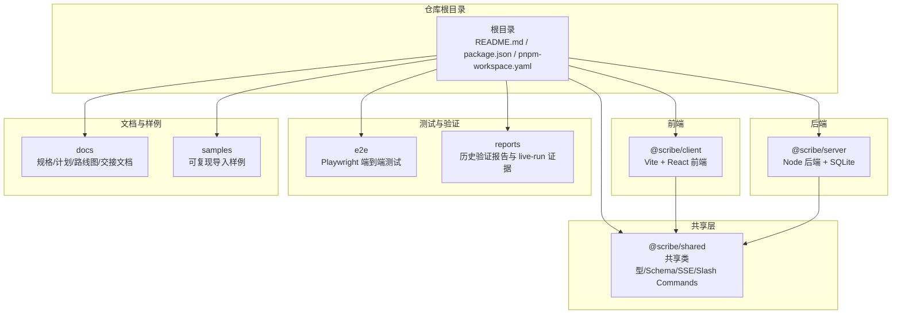
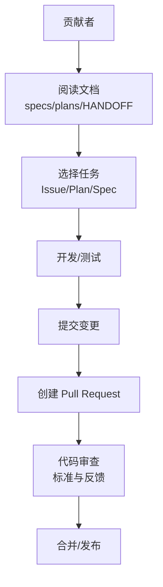
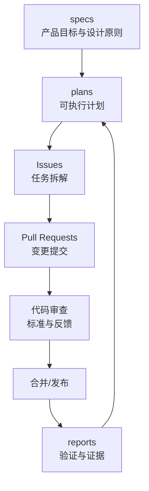

# 贡献指南

<cite>
**本文引用的文件**
- [README.md](file://README.md)
- [docs/README.md](file://docs/README.md)
- [docs/superpowers/specs/2026-06-17-scribe-ultimate-product-goal.md](file://docs/superpowers/specs/2026-06-17-scribe-ultimate-product-goal.md)
- [docs/superpowers/plans/2026-06-17-scribe-final-roadmap.md](file://docs/superpowers/plans/2026-06-17-scribe-final-roadmap.md)
- [.claude/settings.json](file://.claude/settings.json)
</cite>

## 目录
1. 引言
2. 项目结构
3. 核心组件
4. 架构总览
5. 详细组件分析
6. 依赖分析
7. 性能考虑
8. 故障排除指南
9. 结论
10. 附录

## 引言
本指南面向希望为 Scribe 项目做出贡献的开发者与审阅者，系统化阐述贡献流程、协作规范、代码审查标准、问题报告与功能请求流程、开发任务分配与里程碑规划、版本发布机制、社区行为准则与沟通渠道、CLA（贡献者许可协议）签署要求及知识产权政策，并提供新贡献者入门与导师制度建议。Scribe 是一个本地优先的长篇小说创作工作台，强调可审计的生成工作流、通用质量门禁与可编辑的长期记忆，目标是帮助用户构建并持续推进一个完整的长篇小说项目。

## 项目结构
仓库采用多包（monorepo）结构，核心模块包括：
- packages/shared：前后端共享类型、Zod schema、SSE 事件、斜杠命令表等
- packages/server：Node 后端、SQLite、本地文件、AI 编排、质量门禁
- packages/client：Vite + React 前端、三栏写作工作台
- e2e：Playwright 端到端测试与截图证据
- docs：规格、计划、路线图、交接文档
- samples：可复现导入样例（当前包含 SillyTavern 预设与世界书）
- reports：历史验证报告与 live-run 证据

此外，根目录包含项目安装、配置、启动与测试说明，以及文档阅读顺序指引。

图表来源
- [README.md:44-55](file://README.md#L44-L55)

章节来源
- [README.md:10-42](file://README.md#L10-L42)
- [docs/README.md:1-24](file://docs/README.md#L1-L24)

## 核心组件
- 产品愿景与设计原则：明确 Scribe 的最终目标、用户旅程、核心产出与架构分层，确保所有贡献围绕“可审计生成工作流、通用质量门禁、可编辑长期记忆”展开。
- 实施路线图：将最终目标分解为阶段性交付物（Phase 1-6），为贡献者提供清晰的任务边界与验收标准。
- 文档体系：specs（目标与设计原则）、plans（可执行计划）、HANDOFF（当前状态与交接）、_implementation-notes（历史实现债），形成“目标—计划—状态—实现”的闭环。
- 开发与测试：提供统一的安装、启动、测试与类型检查命令，确保贡献流程标准化。

章节来源
- [docs/superpowers/specs/2026-06-17-scribe-ultimate-product-goal.md:1-335](file://docs/superpowers/specs/2026-06-17-scribe-ultimate-product-goal.md#L1-L335)
- [docs/superpowers/plans/2026-06-17-scribe-final-roadmap.md:1-79](file://docs/superpowers/plans/2026-06-17-scribe-final-roadmap.md#L1-L79)
- [README.md:36-42](file://README.md#L36-L42)

## 架构总览
下图展示贡献者在不同阶段的交互路径：从阅读文档理解目标，到选择任务（Issue/Plan/Spec），再到开发、测试、提交 PR，最后进入审阅与合并流程。

## 详细组件分析

### 分支策略与 Fork 流程
- Fork 仓库：在 GitHub 上 Fork 主仓库至个人账户
- 本地克隆：使用 pnpm 工作区进行安装与开发
- 分支命名：建议采用 feature/issue-编号/简述 的格式，便于追踪与审阅
- 提交规范：遵循项目内已有的命令与脚本，确保通过测试与类型检查后再提交

章节来源
- [README.md:10-14](file://README.md#L10-L14)

### Pull Request 规范
- 描述要求：在 PR 描述中说明变更目的、影响范围、测试方法与验证结果
- 关联 Issue：PR 应关联一个或多个 Issue，便于追溯
- 审查流程：至少一名维护者同意后方可合并；涉及重大变更需在文档中同步更新
- 合并策略：优先使用 Squash 合并以保持提交历史整洁

### 代码审查标准
- 功能正确性：符合 specs/plans 中定义的功能与验收标准
- 质量门禁：确保不会绕过通用质量门禁，避免将“坏章节”写入长期记忆
- 可审计性：变更应可追溯，必要时补充日志或诊断输出
- 兼容性：对 SillyTavern 导入与运行兼容性的影响需明确说明
- 性能与稳定性：避免引入回归，确保端到端测试通过

章节来源
- [docs/superpowers/specs/2026-06-17-scribe-ultimate-product-goal.md:127-142](file://docs/superpowers/specs/2026-06-17-scribe-ultimate-product-goal.md#L127-L142)
- [docs/superpowers/specs/2026-06-17-scribe-ultimate-product-goal.md:248-291](file://docs/superpowers/specs/2026-06-17-scribe-ultimate-product-goal.md#L248-L291)

### 问题报告模板与功能请求流程
- 问题报告模板（建议）：
  - 标题：简洁描述问题
  - 环境：操作系统、Node 版本、pnpm 版本
  - 复现步骤：最小可复现步骤
  - 预期行为：期望结果
  - 实际行为：实际结果
  - 日志与截图：附上相关日志与截图
  - 影响范围：是否影响导入、生成、质量门禁或长期记忆
- 功能请求流程：
  - 在提出功能请求前，先查阅 specs 与 plans，确认是否与产品目标一致
  - 提交 Issue 并标注“enhancement”，在讨论达成共识后再开始实现

章节来源
- [docs/superpowers/specs/2026-06-17-scribe-ultimate-product-goal.md:306-317](file://docs/superpowers/specs/2026-06-17-scribe-ultimate-product-goal.md#L306-L317)

### 开发任务分配、里程碑规划与版本发布
- 任务分配：基于 docs/superpowers/plans 中的阶段性交付物，由维护者将任务拆解为 Issue 并指派给贡献者
- 里程碑规划：以 Phase 为单位设置里程碑，每个里程碑包含明确的验收条件与测试场景
- 版本发布：遵循语义化版本管理，发布前确保通过单元测试、集成测试与端到端测试，并在 reports 中记录验证结果

章节来源
- [docs/superpowers/plans/2026-06-17-scribe-final-roadmap.md:1-79](file://docs/superpowers/plans/2026-06-17-scribe-final-roadmap.md#L1-L79)
- [README.md:36-42](file://README.md#L36-L42)

### 社区行为准则与沟通渠道
- 行为准则：尊重、包容、建设性反馈；禁止人身攻击与歧视性言论
- 沟通渠道：Issue 讨论、PR 评论、文档更新；重要决策在 specs/plans 中沉淀为共识

章节来源
- [docs/superpowers/specs/2026-06-17-scribe-ultimate-product-goal.md:306-317](file://docs/superpowers/specs/2026-06-17-scribe-ultimate-product-goal.md#L306-L317)

### CLA（贡献者许可协议）与知识产权政策
- CLA 要求：贡献者在首次提交 PR 前签署 CLA，授权项目使用其贡献
- 知识产权：贡献者保留原始版权；通过 CLA 授予项目必要的使用与分发权利；第三方内容需注明来源与许可证
- 仓库内 CLA 设置：仓库包含 CLA 相关配置文件，用于自动化流程辅助

章节来源
- [.claude/settings.json](file://.claude/settings.json)

### 新贡献者入门与导师制度
- 入门路径：建议按 docs/README.md 中的阅读顺序学习，先理解产品目标与路线图，再深入技术实现
- 导师制度：为新贡献者指定一位维护者作为导师，协助完成首次贡献与后续任务

章节来源
- [docs/README.md:5-16](file://docs/README.md#L5-L16)

## 依赖分析
贡献流程中的关键依赖关系如下：

图表来源
- [docs/superpowers/specs/2026-06-17-scribe-ultimate-product-goal.md:1-335](file://docs/superpowers/specs/2026-06-17-scribe-ultimate-product-goal.md#L1-L335)
- [docs/superpowers/plans/2026-06-17-scribe-final-roadmap.md:1-79](file://docs/superpowers/plans/2026-06-17-scribe-final-roadmap.md#L1-L79)

章节来源
- [docs/superpowers/specs/2026-06-17-scribe-ultimate-product-goal.md:1-335](file://docs/superpowers/specs/2026-06-17-scribe-ultimate-product-goal.md#L1-L335)
- [docs/superpowers/plans/2026-06-17-scribe-final-roadmap.md:1-79](file://docs/superpowers/plans/2026-06-17-scribe-final-roadmap.md#L1-L79)

## 性能考虑
- 本地优先：尽量减少网络依赖，利用本地 SQLite 与文件系统
- 质量门禁前置：在持久化前进行严格校验，避免回滚成本
- 端到端测试：通过 e2e 验证真实场景下的性能与稳定性

## 故障排除指南
- 环境与安装：确保满足 Node.js 与 pnpm 版本要求，使用 pnpm install 安装依赖
- 启动服务：分别启动后端与前端开发服务器，确认代理与端口配置
- 测试执行：优先运行单元与集成测试，再执行端到端测试，定位问题范围
- 日志与证据：在 reports 中记录验证过程与结果，便于复现与追溯

章节来源
- [README.md:5-32](file://README.md#L5-L32)
- [README.md:36-42](file://README.md#L36-L42)

## 结论
本贡献指南以 Scribe 的产品目标与实施计划为纲，结合文档体系与测试实践，建立了从入门到审阅、从任务分配到版本发布的完整协作流程。建议贡献者在提交任何变更前，先通读 specs 与 plans，确保与产品方向一致；在 PR 中清晰描述变更动机与验证方法；在审阅过程中积极回应反馈，共同提升代码质量与项目可维护性。

## 附录
- 快速参考
  - 安装与启动：参见根目录 README
  - 文档阅读顺序：参见 docs/README
  - 路线图与阶段目标：参见 docs/superpowers/plans/2026-06-17-scribe-final-roadmap.md
  - 产品最终目标：参见 docs/superpowers/specs/2026-06-17-scribe-ultimate-product-goal.md
  - CLA 设置：参见 .claude/settings.json