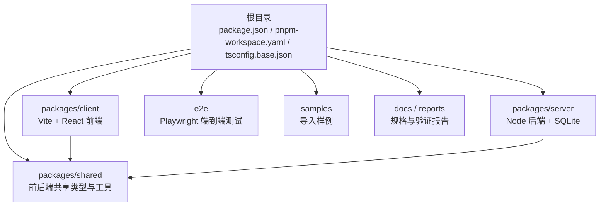
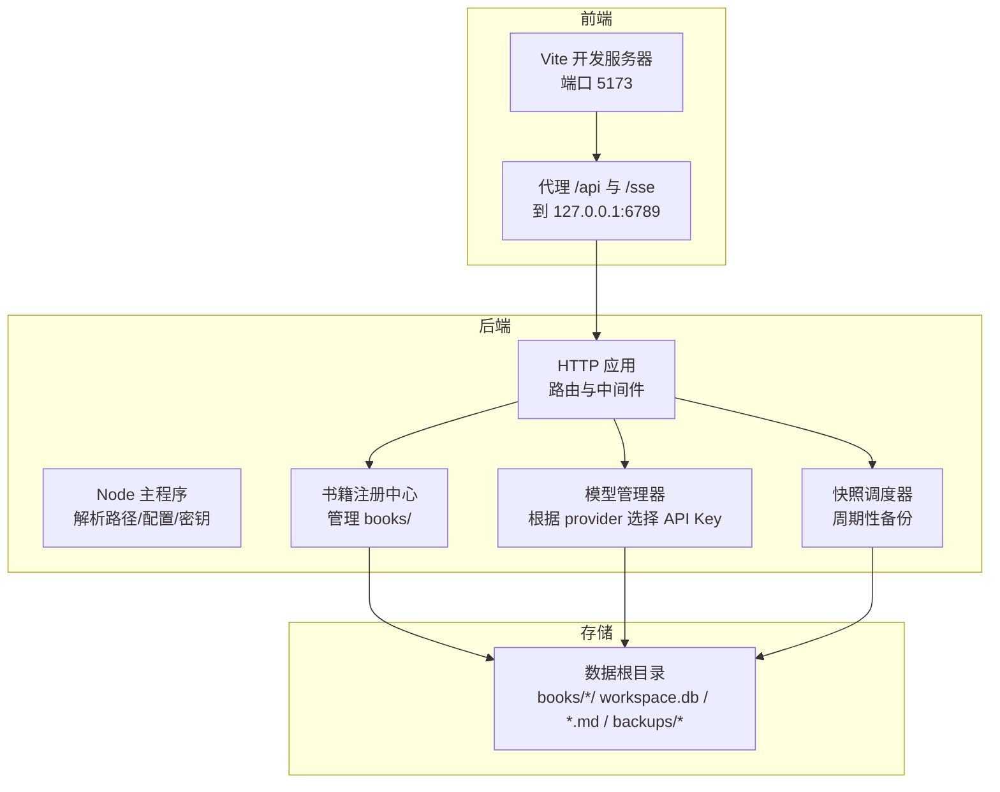
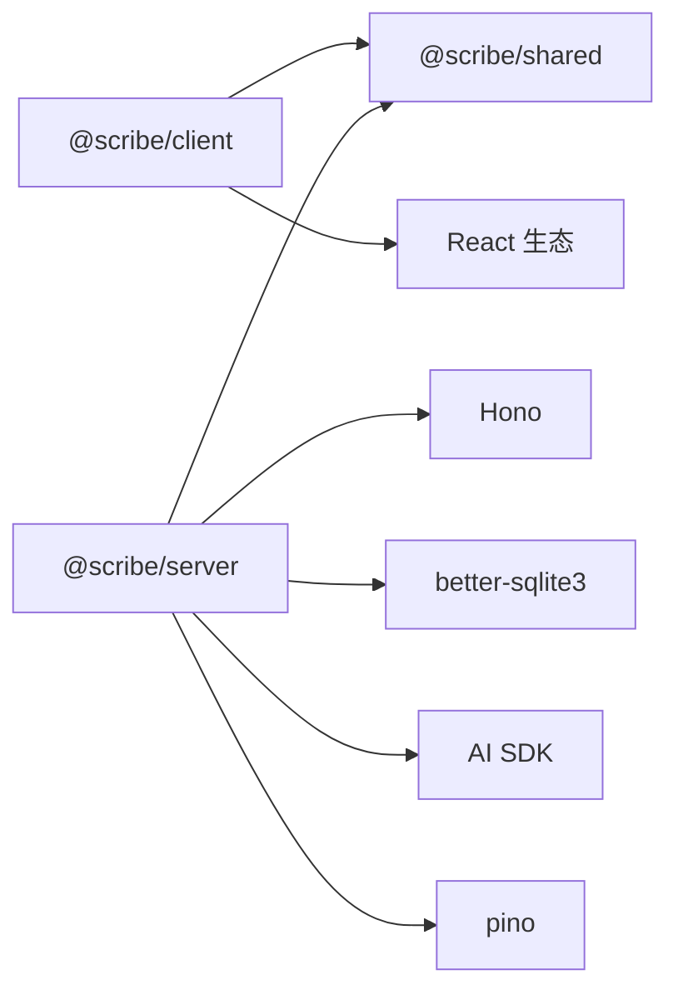

# 快速开始

<cite>
**本文引用的文件**
- [package.json](file://package.json)
- [pnpm-workspace.yaml](file://pnpm-workspace.yaml)
- [tsconfig.base.json](file://tsconfig.base.json)
- [README.md](file://README.md)
- [packages/client/package.json](file://packages/client/package.json)
- [packages/server/package.json](file://packages/server/package.json)
- [packages/shared/package.json](file://packages/shared/package.json)
- [packages/client/vite.config.ts](file://packages/client/vite.config.ts)
- [packages/server/src/main.ts](file://packages/server/src/main.ts)
- [packages/shared/src/index.ts](file://packages/shared/src/index.ts)
- [e2e/package.json](file://e2e/package.json)
- [e2e/playwright.config.ts](file://e2e/playwright.config.ts)
- [samples/README.md](file://samples/README.md)
</cite>

## 目录
1. [简介](#简介)
2. [项目结构](#项目结构)
3. [核心组件](#核心组件)
4. [架构总览](#架构总览)
5. [详细组件分析](#详细组件分析)
6. [依赖分析](#依赖分析)
7. [性能考虑](#性能考虑)
8. [故障排除指南](#故障排除指南)
9. [结论](#结论)
10. [附录](#附录)

## 简介
本指南面向首次接触 Scribe 的开发者，帮助你在约 30 分钟内完成环境准备、安装与首次运行，并体验核心功能（创建书籍、发起对话、基础写作与审查）。Scribe 是一个“本地优先”的长篇小说创作工作台，强调通过设定、世界书、预设、对话意图、章节正文、审查结果与长期记忆，构建可持续推进的写作项目。

## 项目结构
Scribe 采用 monorepo 工作区，使用 pnpm 管理多包依赖。顶层脚本统一调度各包的开发、构建、测试与类型检查；packages 目录下包含客户端、服务端与共享层；e2e 目录提供端到端测试；samples 提供可复现的导入样例；docs 与 reports 存放规格、路线图与历史验证报告。

图表来源
- [package.json:1-21](file://package.json#L1-L21)
- [pnpm-workspace.yaml:1-4](file://pnpm-workspace.yaml#L1-L4)
- [packages/client/package.json:1-39](file://packages/client/package.json#L1-L39)
- [packages/server/package.json:1-33](file://packages/server/package.json#L1-L33)
- [packages/shared/package.json:1-19](file://packages/shared/package.json#L1-L19)
- [e2e/package.json:1-15](file://e2e/package.json#L1-L15)

章节来源
- [README.md:44-55](file://README.md#L44-L55)
- [pnpm-workspace.yaml:1-4](file://pnpm-workspace.yaml#L1-L4)

## 核心组件
- 服务端（@scribe/server）：基于 Hono 的 HTTP 服务器，集成 SQLite、AI 模型编排、质量门禁与定时快照备份。
- 客户端（@scribe/client）：基于 Vite + React 的三栏写作工作台，内置代理到后端 API/SSE。
- 共享层（@scribe/shared）：前后端共享的类型定义、Zod Schema、SSE 事件与斜杠命令等。
- 端到端测试（scribe-e2e）：Playwright 测试，自动启动后端并进行健康检查。

章节来源
- [packages/server/src/main.ts:1-96](file://packages/server/src/main.ts#L1-L96)
- [packages/client/vite.config.ts:1-20](file://packages/client/vite.config.ts#L1-L20)
- [packages/shared/src/index.ts:1-20](file://packages/shared/src/index.ts#L1-L20)
- [e2e/playwright.config.ts:1-27](file://e2e/playwright.config.ts#L1-L27)

## 架构总览
Scribe 的运行时由“前端开发服务器 + 后端服务 + 本地数据目录”构成。前端通过本地代理将 /api 与 /sse 请求转发至后端；后端负责应用路径解析、配置与密钥加载、模型管理、书籍注册、HTTP 路由与定时快照。

图表来源
- [packages/client/vite.config.ts:7-13](file://packages/client/vite.config.ts#L7-L13)
- [packages/server/src/main.ts:13-96](file://packages/server/src/main.ts#L13-L96)

## 详细组件分析

### 环境与工具链要求
- Node.js：建议使用 20 或更高版本（实测 24），根配置中声明最低版本为 20。
- pnpm：版本 9，作为包管理器与工作区驱动。
- TypeScript：版本 ^5.6，配合严格模式与 ESNext 模块解析。
- 浏览器：用于访问前端开发服务器（默认 http://localhost:5173）。

章节来源
- [README.md:5-8](file://README.md#L5-L8)
- [package.json:18-19](file://package.json#L18-L19)
- [tsconfig.base.json:1-16](file://tsconfig.base.json#L1-L16)

### 安装与首次运行
- 克隆仓库后，在项目根目录执行安装：
  - 运行 pnpm install 安装全部依赖。
- 配置 API Key：
  - 在数据目录创建 secrets.env 文件（默认 Windows：%APPDATA%\scribe\，可用环境变量 SCRIBE_HOME 修改根目录），添加 DEEPSEEK_API_KEY 或 MIMO_API_KEY（取决于 provider）。
- 启动后端：
  - 在根目录执行：pnpm --filter @scribe/server exec tsx src/main.ts，默认监听 http://127.0.0.1:6789。
- 启动前端：
  - 在另一个终端执行：pnpm --filter @scribe/client dev，默认监听 http://localhost:5173，并自动代理 /api 与 /sse 到后端。
- 打开浏览器访问 http://localhost:5173 即可使用。

章节来源
- [README.md:10-34](file://README.md#L10-L34)
- [packages/server/src/main.ts:13-20](file://packages/server/src/main.ts#L13-L20)

### monorepo 工作区与包管理策略
- 工作区配置：packages/* 与 e2e 均纳入工作区，pnpm 通过 workspace:* 解析跨包依赖。
- 顶层脚本：
  - dev：并行启动所有包的开发任务。
  - build：依次构建所有包。
  - test：运行所有包的单元/集成测试。
  - test:e2e：仅运行 e2e 包的测试。
  - typecheck：对所有包执行类型检查。
- 包依赖关系：
  - @scribe/client 依赖 @scribe/shared。
  - @scribe/server 依赖 @scribe/shared，并引入 Hono、better-sqlite3、AI SDK 等。
  - @scribe/shared 依赖 zod。

章节来源
- [pnpm-workspace.yaml:1-4](file://pnpm-workspace.yaml#L1-L4)
- [package.json:6-12](file://package.json#L6-L12)
- [packages/client/package.json:12-24](file://packages/client/package.json#L12-L24)
- [packages/server/package.json:13-24](file://packages/server/package.json#L13-L24)
- [packages/shared/package.json:11-13](file://packages/shared/package.json#L11-L13)

### 第一个项目：创建书籍与对话体验
- 创建书籍：
  - 在前端界面创建新书，系统会在数据根目录的 books/<id> 下初始化 workspace.db、章节与规则文件。
- 发起对话：
  - 在编辑器中输入斜杠命令（如 /write 续写、/auto N 自动写 N 章、/audit 审查当前章、/recall 检索全书），或通过前端交互面板操作。
- 基础功能演示：
  - 斜杠命令列表与行为见常用命令表格。
  - 后端会根据 provider 与 API Key 初始化模型管理器，并在章节提交时触发快照调度器进行备份。

章节来源
- [README.md:63-72](file://README.md#L63-L72)
- [packages/server/src/main.ts:22-32](file://packages/server/src/main.ts#L22-L32)
- [packages/server/src/main.ts:71-77](file://packages/server/src/main.ts#L71-L77)

### 端到端测试与健康检查
- e2e 使用 Playwright，自动启动后端并通过 /api/health 健康检查。
- 测试超时与重试策略、报告输出与浏览器项目配置均可在 e2e/playwright.config.ts 中查看。

章节来源
- [e2e/playwright.config.ts:9-27](file://e2e/playwright.config.ts#L9-L27)
- [e2e/package.json:6-9](file://e2e/package.json#L6-L9)

## 依赖分析
- 依赖耦合与内聚：
  - @scribe/client 与 @scribe/server 通过 @scribe/shared 解耦共享类型与协议。
  - @scribe/server 内部模块化清晰：配置加载、密钥管理、模型管理、书籍注册、HTTP 应用、快照调度。
- 外部依赖：
  - Hono 作为轻量 HTTP 框架，better-sqlite3 用于本地数据库，AI SDK 用于模型调用，pino 用于日志。
- 类型与构建：
  - TypeScript 严格模式开启，ESNext 模块解析，Bundler 方案，跳过库类型检查以提升速度。

图表来源
- [packages/client/package.json:12-24](file://packages/client/package.json#L12-L24)
- [packages/server/package.json:13-24](file://packages/server/package.json#L13-L24)
- [packages/shared/package.json:11-13](file://packages/shared/package.json#L11-L13)

章节来源
- [packages/client/package.json:12-38](file://packages/client/package.json#L12-L38)
- [packages/server/package.json:13-33](file://packages/server/package.json#L13-L33)
- [packages/shared/package.json:11-19](file://packages/shared/package.json#L11-L19)

## 性能考虑
- 快照备份策略：在章节提交后触发增量快照，先对 SQLite 使用在线备份生成一致副本，再打包章节与备份，避免并发写入导致的数据撕裂。
- 代理与网络：前端代理减少跨域与额外握手成本，便于本地联调。
- 类型检查：启用严格模式与隔离模块，提升类型安全与构建稳定性。

章节来源
- [packages/server/src/main.ts:34-61](file://packages/server/src/main.ts#L34-L61)
- [packages/client/vite.config.ts:9-12](file://packages/client/vite.config.ts#L9-L12)
- [tsconfig.base.json:7-14](file://tsconfig.base.json#L7-L14)

## 故障排除指南
- Node 版本不满足要求
  - 现象：pnpm 安装报错或运行时报引擎版本不匹配。
  - 处理：升级 Node 至 20+，确保 package.json 中 engines.node 条件满足。
- pnpm 版本不匹配
  - 现象：提示 packageManager 版本不符。
  - 处理：使用 pnpm 9.x，或按需安装指定版本。
- API Key 未配置
  - 现象：后端启动后提示未配置 API Key，前端设置页可录入。
  - 处理：在数据目录 secrets.env 中添加对应供应商的 API Key。
- 端口占用
  - 现象：后端无法绑定 6789 或前端无法绑定 5173。
  - 处理：修改环境变量 PORT 或关闭占用进程。
- e2e 浏览器未安装
  - 现象：执行 test:e2e 报错，提示缺少浏览器。
  - 处理：执行 pnpm --filter scribe-e2e run install-browsers 安装 Chromium。
- 数据目录权限
  - 现象：无法创建 books 或备份目录。
  - 处理：确认 SCRIBE_HOME 或默认目录权限，确保可读写。

章节来源
- [package.json:18-19](file://package.json#L18-L19)
- [README.md:16-22](file://README.md#L16-L22)
- [packages/server/src/main.ts:13-18](file://packages/server/src/main.ts#L13-L18)
- [e2e/playwright.config.ts:16-25](file://e2e/playwright.config.ts#L16-L25)

## 结论
通过本指南，你可以在 30 分钟内完成 Scribe 的环境准备、安装与首次运行，并体验核心功能。建议后续继续探索斜杠命令、世界书与角色设定导入、以及通过 samples 目录复现实验场景。

## 附录

### 常用斜杠命令
- /write 或 /续写：开始下一章
- /auto N：自动写 N 章（遇到关键问题即停，预算上限保护）
- /audit 或 /审查：对当前章立即审查
- /recall <关键词>：全书检索
- /help：列出所有命令

章节来源
- [README.md:63-72](file://README.md#L63-L72)

### 数据存放位置
- 默认根目录：Windows %APPDATA%\scribe\，Linux ~/.config/scribe
- 每本书：books/<id>/（包含 workspace.db、chapters/*.md、rules.md）
- 自动快照：backups/<id>/*.tar.gz（30 天滚动 + 每周保留）

章节来源
- [README.md:57-62](file://README.md#L57-L62)

### 导入样例与使用原则
- SillyTavern 预设与世界书样例可用于验证导入、预设渲染、世界书检索与长篇连续性。
- 不得将样例中的专有词、角色名、道具名写死进通用逻辑；新增样例需在对应子目录并说明用途。

章节来源
- [samples/README.md:1-16](file://samples/README.md#L1-L16)