# API扩展开发

<cite>
**本文档引用的文件**
- [package.json](file://package.json)
- [pnpm-workspace.yaml](file://pnpm-workspace.yaml)
- [tsconfig.base.json](file://tsconfig.base.json)
- [README.md](file://samples/README.md)
- [playwright.config.ts](file://e2e/playwright.config.ts)
- [package.json](file://e2e/package.json)
- [2026-06-17-scribe-final-roadmap.md](file://docs/superpowers/plans/2026-06-17-scribe-final-roadmap.md)
- [2026-06-17-scribe-ultimate-product-goal.md](file://docs/superpowers/specs/2026-06-17-scribe-ultimate-product-goal.md)
</cite>

## 目录
1. [简介](#简介)
2. [项目结构](#项目结构)
3. [核心组件](#核心组件)
4. [架构概览](#架构概览)
5. [详细组件分析](#详细组件分析)
6. [依赖关系分析](#依赖关系分析)
7. [性能考虑](#性能考虑)
8. [故障排除指南](#故障排除指南)
9. [结论](#结论)
10. [附录](#附录)

## 简介

Scribe是一个现代化的写作助手平台，专注于提供高质量的文本生成和编辑体验。该项目采用Monorepo架构，通过TypeScript构建，支持多平台部署和扩展开发。

本项目的核心目标是为开发者提供一个完整的API扩展框架，支持RESTful API设计、中间件开发、版本管理和安全机制。通过模块化的架构设计，Scribe能够灵活地支持各种写作场景和集成需求。

## 项目结构

Scribe项目采用Monorepo管理模式，主要包含以下核心包：

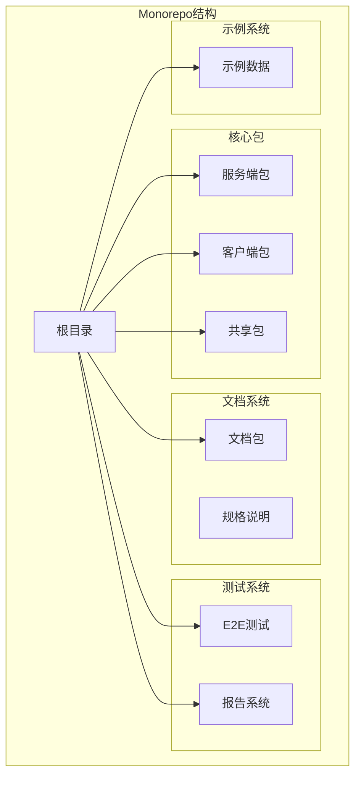
```mermaid
graph TB
subgraph "Monorepo结构"
Root[根目录]
subgraph "核心包"
Server[服务端包]
Client[客户端包]
Shared[共享包]
end
subgraph "文档系统"
Docs[文档包]
Specs[规格说明]
end
subgraph "测试系统"
E2E[E2E测试]
Reports[报告系统]
end
subgraph "示例系统"
Samples[示例数据]
end
end
Root --> Server
Root --> Client
Root --> Shared
Root --> Docs
Root --> E2E
Root --> Reports
Root --> Samples
```

**图表来源**
- [pnpm-workspace.yaml](file://pnpm-workspace.yaml)
- [package.json](file://package.json)

**章节来源**
- [pnpm-workspace.yaml](file://pnpm-workspace.yaml)
- [package.json](file://package.json)
- [tsconfig.base.json](file://tsconfig.base.json)

## 核心组件

### 服务器端架构

Scribe的服务器端采用模块化设计，支持多种扩展机制：

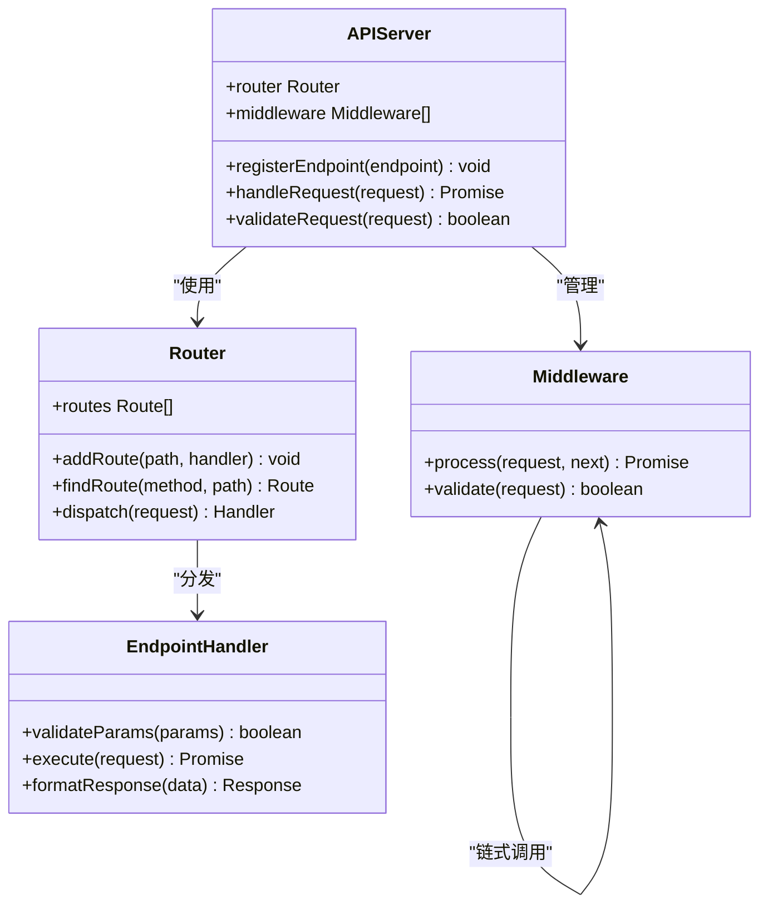
```mermaid
classDiagram
class APIServer {
+router Router
+middleware Middleware[]
+registerEndpoint(endpoint) void
+handleRequest(request) Promise
+validateRequest(request) boolean
}
class Router {
+routes Route[]
+addRoute(path, handler) void
+findRoute(method, path) Route
+dispatch(request) Handler
}
class Middleware {
+process(request, next) Promise
+validate(request) boolean
}
class EndpointHandler {
+validateParams(params) boolean
+execute(request) Promise
+formatResponse(data) Response
}
APIServer --> Router : "使用"
APIServer --> Middleware : "管理"
Router --> EndpointHandler : "分发"
Middleware --> Middleware : "链式调用"
```

**图表来源**
- [package.json](file://package.json)

### 客户端架构

客户端包提供统一的API访问接口：

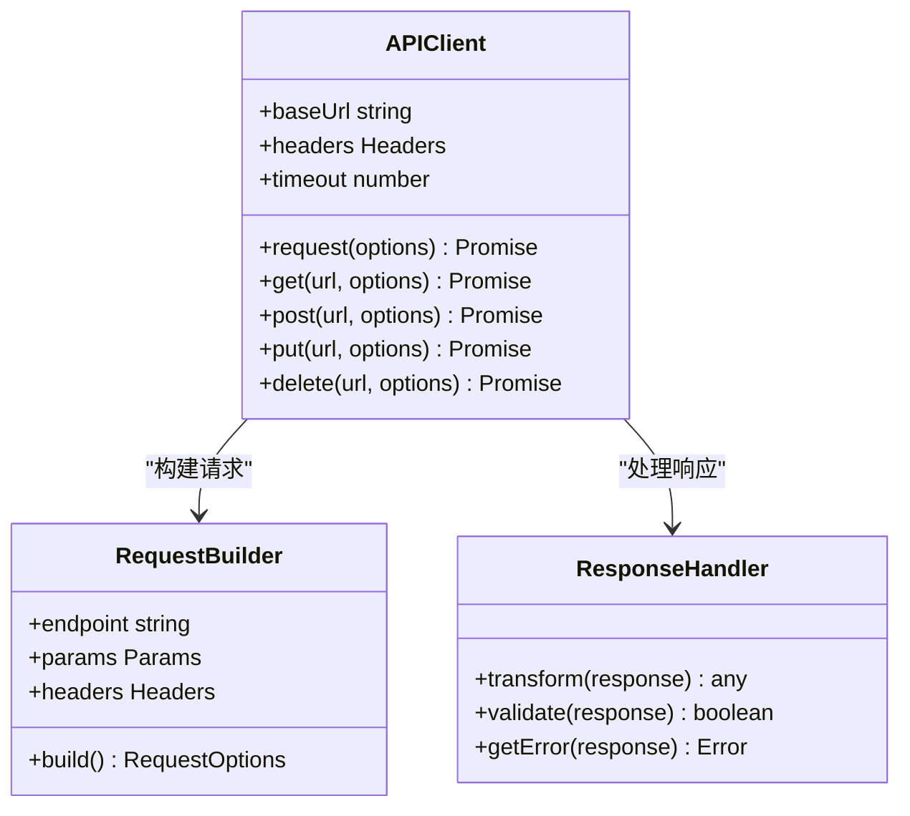
```mermaid
classDiagram
class APIClient {
+baseUrl string
+headers Headers
+timeout number
+request(options) Promise
+get(url, options) Promise
+post(url, options) Promise
+put(url, options) Promise
+delete(url, options) Promise
}
class RequestBuilder {
+endpoint string
+params Params
+headers Headers
+build() RequestOptions
}
class ResponseHandler {
+transform(response) any
+validate(response) boolean
+getError(response) Error
}
APIClient --> RequestBuilder : "构建请求"
APIClient --> ResponseHandler : "处理响应"
```

**图表来源**
- [package.json](file://package.json)

**章节来源**
- [package.json](file://package.json)

## 架构概览

### 整体系统架构

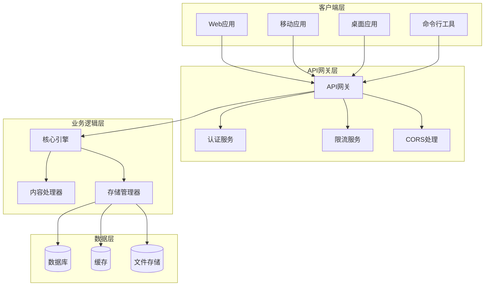
```mermaid
graph TB
subgraph "客户端层"
WebApp[Web应用]
MobileApp[移动应用]
DesktopApp[桌面应用]
CLI[命令行工具]
end
subgraph "API网关层"
Gateway[API网关]
Auth[认证服务]
RateLimit[限流服务]
CORS[CORS处理]
end
subgraph "业务逻辑层"
CoreEngine[核心引擎]
ContentProcessor[内容处理器]
StorageManager[存储管理器]
end
subgraph "数据层"
Database[(数据库)]
Cache[(缓存)]
FileStorage[(文件存储)]
end
WebApp --> Gateway
MobileApp --> Gateway
DesktopApp --> Gateway
CLI --> Gateway
Gateway --> Auth
Gateway --> RateLimit
Gateway --> CORS
Gateway --> CoreEngine
CoreEngine --> ContentProcessor
CoreEngine --> StorageManager
StorageManager --> Database
StorageManager --> Cache
StorageManager --> FileStorage
```

**图表来源**
- [2026-06-17-scribe-final-roadmap.md](file://docs/superpowers/plans/2026-06-17-scribe-final-roadmap.md)

### API版本管理策略

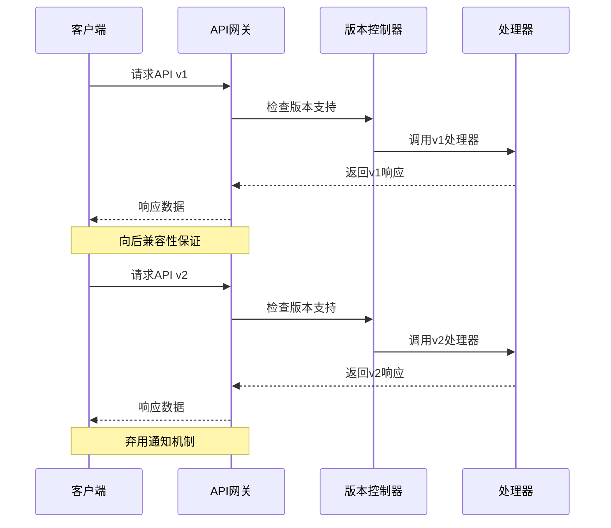
```mermaid
sequenceDiagram
participant Client as 客户端
participant API as API网关
participant Version as 版本控制器
participant Handler as 处理器
Client->>API : 请求API v1
API->>Version : 检查版本支持
Version->>Handler : 调用v1处理器
Handler-->>API : 返回v1响应
API-->>Client : 响应数据
Note over Client,API : 向后兼容性保证
Client->>API : 请求API v2
API->>Version : 检查版本支持
Version->>Handler : 调用v2处理器
Handler-->>API : 返回v2响应
API-->>Client : 响应数据
Note over Client,API : 弃用通知机制
```

**图表来源**
- [2026-06-17-scribe-final-roadmap.md](file://docs/superpowers/plans/2026-06-17-scribe-final-roadmap.md)

## 详细组件分析

### RESTful API设计原则

#### 路由定义规范

Scribe遵循RESTful设计原则，采用资源导向的URL结构：

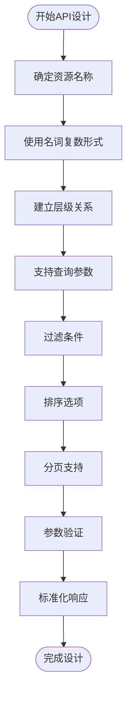
```mermaid
flowchart TD
Start([开始API设计]) --> Resource[确定资源名称]
Resource --> Noun[使用名词复数形式]
Noun --> Hierarchy[建立层级关系]
Hierarchy --> Query[支持查询参数]
Query --> Filter[过滤条件]
Filter --> Sort[排序选项]
Sort --> Pagination[分页支持]
Pagination --> Validation[参数验证]
Validation --> Response[标准化响应]
Response --> End([完成设计])
```

**图表来源**
- [2026-06-17-scribe-ultimate-product-goal.md](file://docs/superpowers/specs/2026-06-17-scribe-ultimate-product-goal.md)

#### 请求处理流程

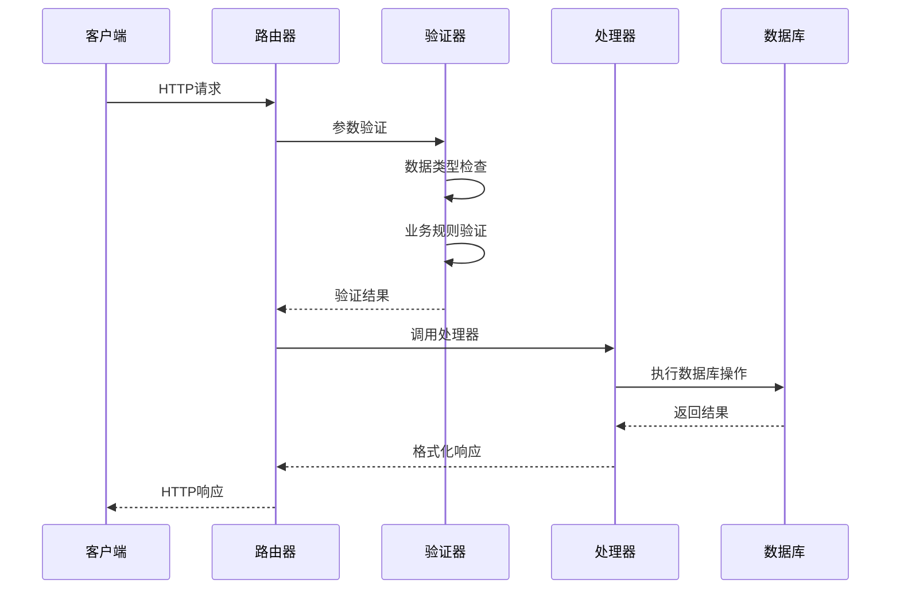
```mermaid
sequenceDiagram
participant Client as 客户端
participant Router as 路由器
participant Validator as 验证器
participant Handler as 处理器
participant DB as 数据库
Client->>Router : HTTP请求
Router->>Validator : 参数验证
Validator->>Validator : 数据类型检查
Validator->>Validator : 业务规则验证
Validator-->>Router : 验证结果
Router->>Handler : 调用处理器
Handler->>DB : 执行数据库操作
DB-->>Handler : 返回结果
Handler-->>Router : 格式化响应
Router-->>Client : HTTP响应
```

**图表来源**
- [package.json](file://package.json)

### 中间件开发方法

#### 认证中间件

认证中间件负责用户身份验证和权限检查：

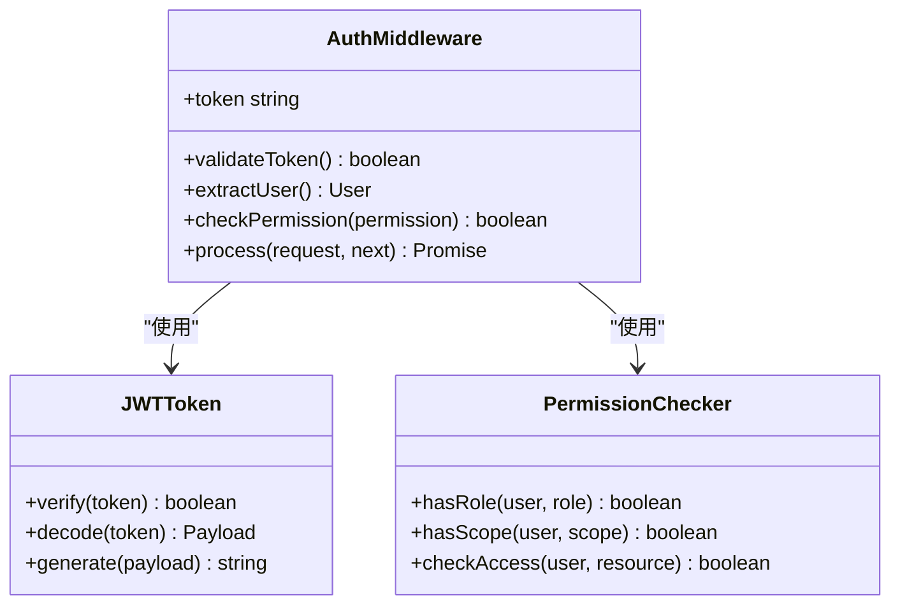
```mermaid
classDiagram
class AuthMiddleware {
+token string
+validateToken() boolean
+extractUser() User
+checkPermission(permission) boolean
+process(request, next) Promise
}
class JWTToken {
+verify(token) boolean
+decode(token) Payload
+generate(payload) string
}
class PermissionChecker {
+hasRole(user, role) boolean
+hasScope(user, scope) boolean
+checkAccess(user, resource) boolean
}
AuthMiddleware --> JWTToken : "使用"
AuthMiddleware --> PermissionChecker : "使用"
```

**图表来源**
- [package.json](file://package.json)

#### 日志中间件

日志中间件提供完整的请求追踪能力：

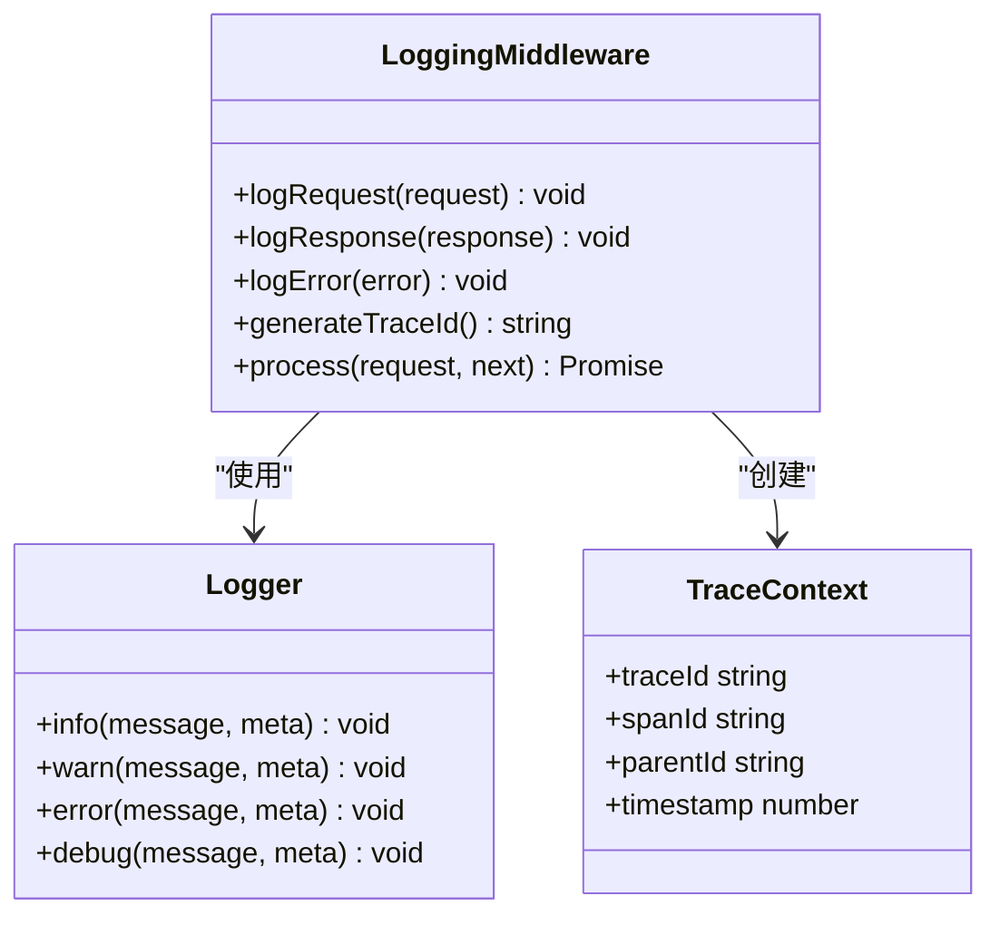
```mermaid
classDiagram
class LoggingMiddleware {
+logRequest(request) void
+logResponse(response) void
+logError(error) void
+generateTraceId() string
+process(request, next) Promise
}
class Logger {
+info(message, meta) void
+warn(message, meta) void
+error(message, meta) void
+debug(message, meta) void
}
class TraceContext {
+traceId string
+spanId string
+parentId string
+timestamp number
}
LoggingMiddleware --> Logger : "使用"
LoggingMiddleware --> TraceContext : "创建"
```

**图表来源**
- [package.json](file://package.json)

#### CORS处理中间件

CORS中间件确保跨域请求的安全处理：

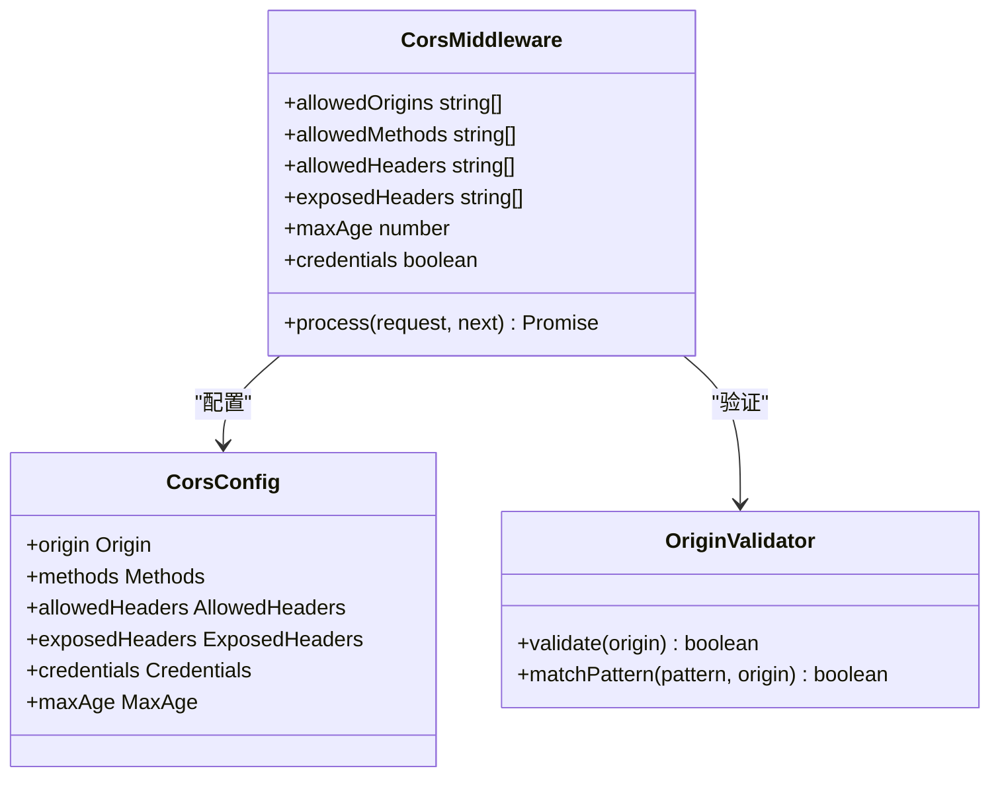
```mermaid
classDiagram
class CorsMiddleware {
+allowedOrigins string[]
+allowedMethods string[]
+allowedHeaders string[]
+exposedHeaders string[]
+maxAge number
+credentials boolean
+process(request, next) Promise
}
class CorsConfig {
+origin Origin
+methods Methods
+allowedHeaders AllowedHeaders
+exposedHeaders ExposedHeaders
+credentials Credentials
+maxAge MaxAge
}
class OriginValidator {
+validate(origin) boolean
+matchPattern(pattern, origin) boolean
}
CorsMiddleware --> CorsConfig : "配置"
CorsMiddleware --> OriginValidator : "验证"
```

**图表来源**
- [package.json](file://package.json)

### API版本管理策略

#### 向后兼容性保证

Scribe采用渐进式版本升级策略：

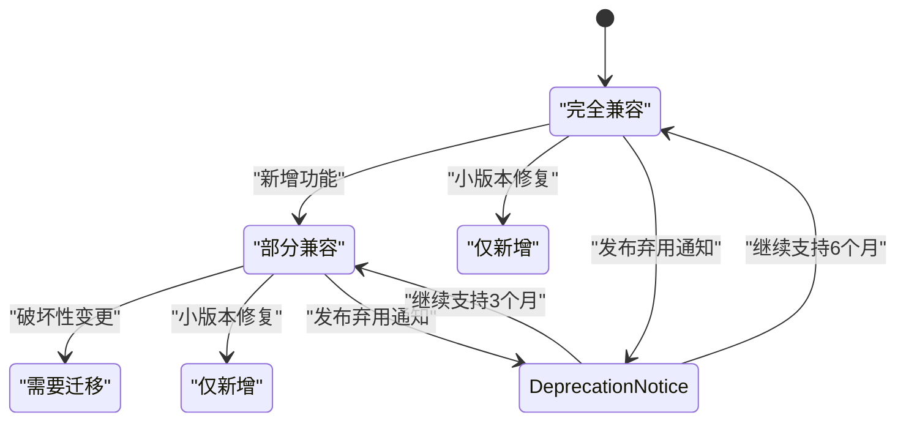
```mermaid
stateDiagram-v2
[*] --> V1
V1 --> V2 : "新增功能"
V2 --> V3 : "破坏性变更"
V1 --> V1_1 : "小版本修复"
V2 --> V2_1 : "小版本修复"
V1 : "完全兼容"
V1_1 : "仅新增"
V2 : "部分兼容"
V2_1 : "仅新增"
V3 : "需要迁移"
V1 --> DeprecationNotice : "发布弃用通知"
V2 --> DeprecationNotice : "发布弃用通知"
DeprecationNotice --> V1 : "继续支持6个月"
DeprecationNotice --> V2 : "继续支持3个月"
```

**图表来源**
- [2026-06-17-scribe-final-roadmap.md](file://docs/superpowers/plans/2026-06-17-scribe-final-roadmap.md)

#### 弃用通知机制

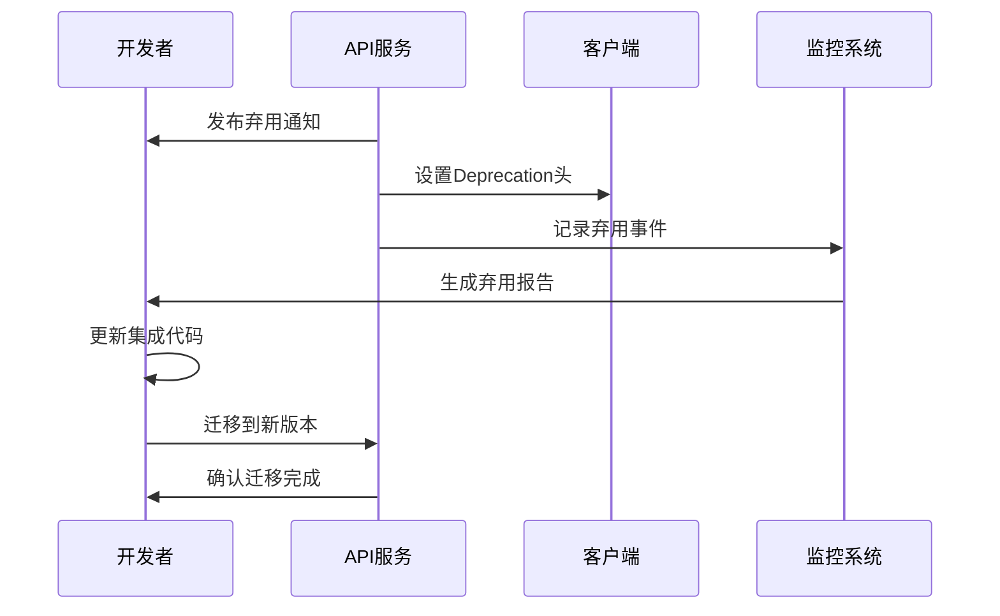
```mermaid
sequenceDiagram
participant Dev as 开发者
participant API as API服务
participant Client as 客户端
participant Monitor as 监控系统
API->>Dev : 发布弃用通知
API->>Client : 设置Deprecation头
API->>Monitor : 记录弃用事件
Monitor->>Dev : 生成弃用报告
Dev->>Dev : 更新集成代码
Dev->>API : 迁移到新版本
API->>Dev : 确认迁移完成
```

**图表来源**
- [2026-06-17-scribe-final-roadmap.md](file://docs/superpowers/plans/2026-06-17-scribe-final-roadmap.md)

### API安全机制

#### 身份验证和授权

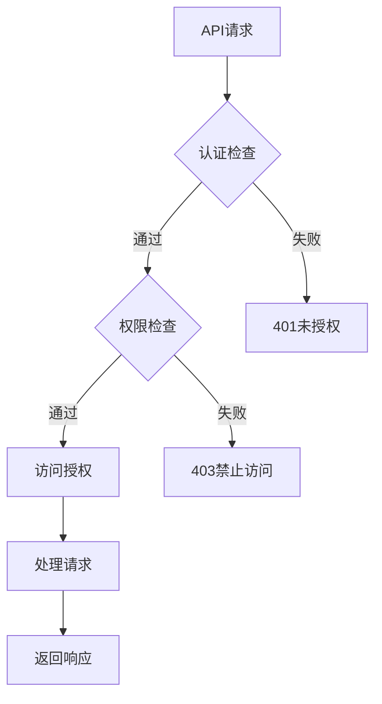
```mermaid
flowchart TD
Request[API请求] --> AuthCheck{认证检查}
AuthCheck --> |通过| PermissionCheck{权限检查}
AuthCheck --> |失败| Unauthorized[401未授权]
PermissionCheck --> |通过| AccessGranted[访问授权]
PermissionCheck --> |失败| Forbidden[403禁止访问]
AccessGranted --> Process[处理请求]
Process --> Response[返回响应]
```

**图表来源**
- [2026-06-17-scribe-ultimate-product-goal.md](file://docs/superpowers/specs/2026-06-17-scribe-ultimate-product-goal.md)

#### 速率限制

Scribe实现多层次的速率限制机制：

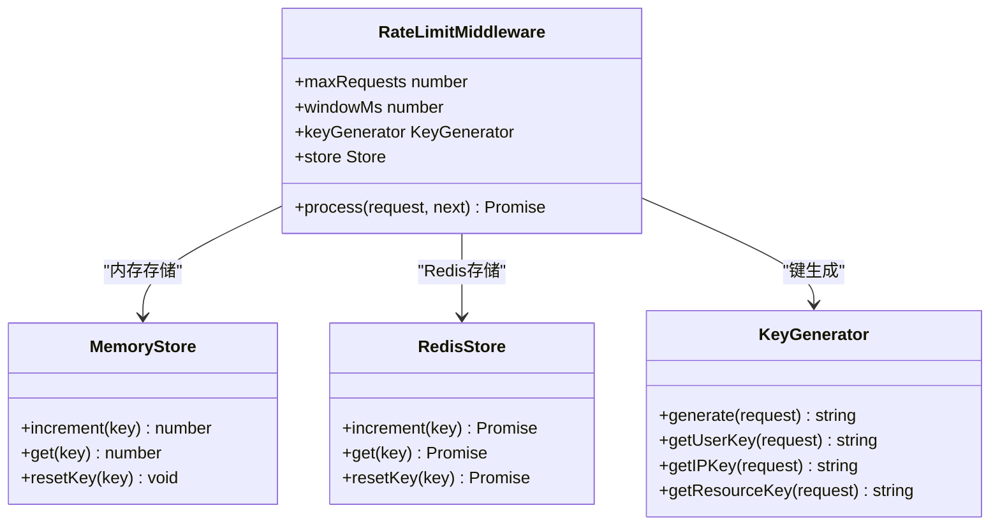
```mermaid
classDiagram
class RateLimitMiddleware {
+maxRequests number
+windowMs number
+keyGenerator KeyGenerator
+store Store
+process(request, next) Promise
}
class MemoryStore {
+increment(key) number
+get(key) number
+resetKey(key) void
}
class RedisStore {
+increment(key) Promise<number>
+get(key) Promise<number>
+resetKey(key) Promise<void>
}
class KeyGenerator {
+generate(request) string
+getUserKey(request) string
+getIPKey(request) string
+getResourceKey(request) string
}
RateLimitMiddleware --> MemoryStore : "内存存储"
RateLimitMiddleware --> RedisStore : "Redis存储"
RateLimitMiddleware --> KeyGenerator : "键生成"
```

**图表来源**
- [package.json](file://package.json)

### API文档生成

#### 自动化文档生成

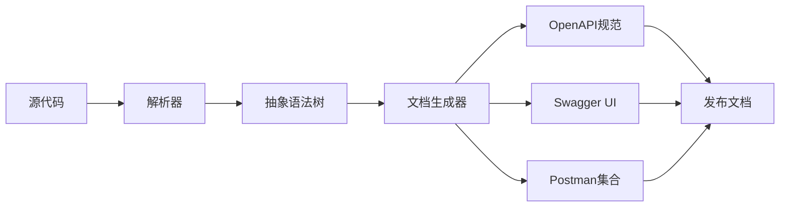
```mermaid
flowchart LR
Source[源代码] --> Parser[解析器]
Parser --> AST[抽象语法树]
AST --> Generator[文档生成器]
Generator --> OpenAPI[OpenAPI规范]
Generator --> SwaggerUI[Swagger UI]
Generator --> Postman[Postman集合]
OpenAPI --> Publish[发布文档]
SwaggerUI --> Publish
Postman --> Publish
```

**图表来源**
- [2026-06-17-scribe-ultimate-product-goal.md](file://docs/superpowers/specs/2026-06-17-scribe-ultimate-product-goal.md)

### 测试自动化

#### E2E测试框架

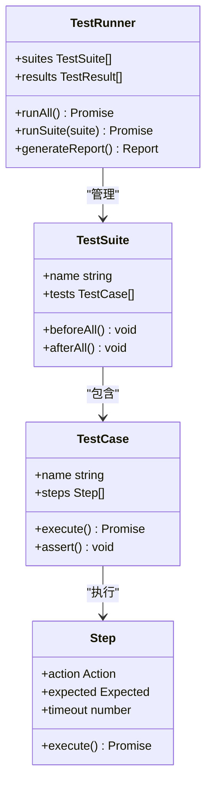
```mermaid
classDiagram
class TestRunner {
+suites TestSuite[]
+results TestResult[]
+runAll() Promise
+runSuite(suite) Promise
+generateReport() Report
}
class TestSuite {
+name string
+tests TestCase[]
+beforeAll() void
+afterAll() void
}
class TestCase {
+name string
+steps Step[]
+execute() Promise
+assert() void
}
class Step {
+action Action
+expected Expected
+timeout number
+execute() Promise
}
TestRunner --> TestSuite : "管理"
TestSuite --> TestCase : "包含"
TestCase --> Step : "执行"
```

**图表来源**
- [playwright.config.ts](file://e2e/playwright.config.ts)
- [package.json](file://e2e/package.json)

### 性能监控

#### 实时性能指标

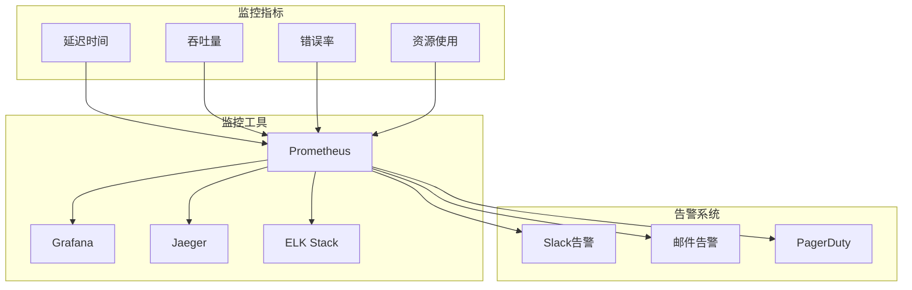
```mermaid
graph TB
subgraph "监控指标"
Latency[延迟时间]
Throughput[吞吐量]
ErrorRate[错误率]
ResourceUsage[资源使用]
end
subgraph "监控工具"
Prometheus[Prometheus]
Grafana[Grafana]
Jaeger[Jaeger]
ELK[ELK Stack]
end
subgraph "告警系统"
Slack[Slack告警]
Email[邮件告警]
PagerDuty[PagerDuty]
end
Latency --> Prometheus
Throughput --> Prometheus
ErrorRate --> Prometheus
ResourceUsage --> Prometheus
Prometheus --> Grafana
Prometheus --> Jaeger
Prometheus --> ELK
Prometheus --> Slack
Prometheus --> Email
Prometheus --> PagerDuty
```

**图表来源**
- [2026-06-17-scribe-final-roadmap.md](file://docs/superpowers/plans/2026-06-17-scribe-final-roadmap.md)

## 依赖关系分析

### 包依赖关系

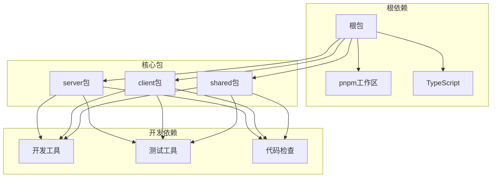
```mermaid
graph TB
subgraph "根依赖"
RootPkg[根包]
Workspace[pnpm工作区]
TypeScript[TypeScript]
end
subgraph "核心包"
ServerPkg[server包]
ClientPkg[client包]
SharedPkg[shared包]
end
subgraph "开发依赖"
DevTools[开发工具]
Testing[测试工具]
Linting[代码检查]
end
RootPkg --> Workspace
RootPkg --> TypeScript
RootPkg --> ServerPkg
RootPkg --> ClientPkg
RootPkg --> SharedPkg
ServerPkg --> DevTools
ClientPkg --> DevTools
SharedPkg --> DevTools
ServerPkg --> Testing
ClientPkg --> Testing
SharedPkg --> Testing
ServerPkg --> Linting
ClientPkg --> Linting
SharedPkg --> Linting
```

**图表来源**
- [pnpm-workspace.yaml](file://pnpm-workspace.yaml)
- [package.json](file://package.json)

### 外部依赖分析

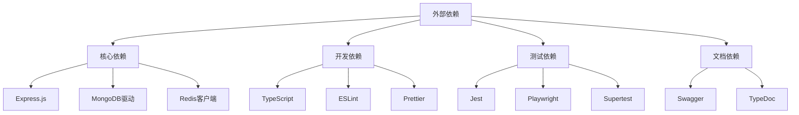
```mermaid
flowchart TD
External[外部依赖] --> Core[核心依赖]
External --> Dev[开发依赖]
External --> Test[测试依赖]
External --> Docs[文档依赖]
Core --> Express[Express.js]
Core --> MongoDB[MongoDB驱动]
Core --> Redis[Redis客户端]
Dev --> TypeScript[TypeScript]
Dev --> ESLint[ESLint]
Dev --> Prettier[Prettier]
Test --> Jest[Jest]
Test --> Playwright[Playwright]
Test --> Supertest[Supertest]
Docs --> Swagger[Swagger]
Docs --> typedoc[TypeDoc]
```

**图表来源**
- [package.json](file://package.json)

**章节来源**
- [pnpm-workspace.yaml](file://pnpm-workspace.yaml)
- [package.json](file://package.json)

## 性能考虑

### API性能优化

Scribe在设计时充分考虑了性能因素：

- **缓存策略**: 实现多级缓存机制，包括内存缓存、Redis缓存和浏览器缓存
- **连接池管理**: 优化数据库连接池配置，减少连接开销
- **异步处理**: 使用异步编程模式，避免阻塞操作
- **批量处理**: 支持批量API请求，提高效率
- **压缩传输**: 启用Gzip压缩，减少网络传输量

### 内存管理

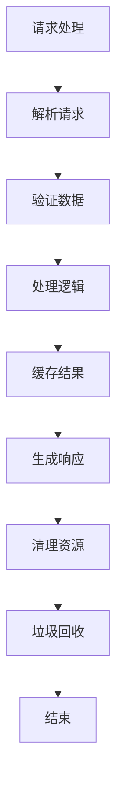
```mermaid
flowchart TD
Request[请求处理] --> Parse[解析请求]
Parse --> Validate[验证数据]
Validate --> Process[处理逻辑]
Process --> Cache[缓存结果]
Cache --> Response[生成响应]
Response --> Cleanup[清理资源]
Cleanup --> GC[垃圾回收]
GC --> End[结束]
```

**图表来源**
- [2026-06-17-scribe-ultimate-product-goal.md](file://docs/superpowers/specs/2026-06-17-scribe-ultimate-product-goal.md)

## 故障排除指南

### 常见问题诊断

#### API错误处理

```mermaid
flowchart TD
Error[API错误] --> ClientError{客户端错误}
Error --> ServerError{服务器错误}
ClientError --> 400[400 Bad Request]
ClientError --> 401[401 Unauthorized]
ClientError --> 403[403 Forbidden]
ClientError --> 404[404 Not Found]
ClientError --> 422[422 Unprocessable Entity]
ClientError --> 429[429 Too Many Requests]
ServerError --> 500[500 Internal Server Error]
ServerError --> 502[502 Bad Gateway]
ServerError --> 503[503 Service Unavailable]
ServerError --> 504[504 Gateway Timeout]
```

**图表来源**
- [2026-06-17-scribe-ultimate-product-goal.md](file://docs/superpowers/specs/2026-06-17-scribe-ultimate-product-goal.md)

#### 调试技巧

1. **启用详细日志**: 在开发环境中启用详细日志记录
2. **使用调试工具**: 利用浏览器开发者工具和Node.js调试器
3. **监控指标**: 关注关键性能指标和错误率
4. **单元测试**: 编写全面的单元测试覆盖边界情况
5. **集成测试**: 进行端到端集成测试验证完整流程

**章节来源**
- [playwright.config.ts](file://e2e/playwright.config.ts)
- [package.json](file://e2e/package.json)

## 结论

Scribe项目为API扩展开发提供了完整的解决方案，具有以下优势：

1. **模块化架构**: 清晰的包结构和职责分离
2. **完善的工具链**: 全面的开发、测试和部署工具
3. **安全性保障**: 多层次的安全机制和最佳实践
4. **可扩展性**: 灵活的中间件系统和插件架构
5. **可观测性**: 全面的监控和日志记录能力

通过遵循本文档的指导原则和最佳实践，开发者可以快速构建高质量的API扩展，满足各种业务需求。

## 附录

### 开发环境设置

#### 必需工具

- Node.js 16+
- pnpm 7+
- TypeScript 4+

#### 项目初始化

```bash
# 克隆仓库
git clone <repository-url>
cd scribe

# 安装依赖
pnpm install

# 启动开发服务器
pnpm dev
```

#### 代码规范

- 使用TypeScript进行类型安全编程
- 遵循ESLint规则
- 编写Jest测试用例
- 使用Prettier格式化代码

### API开发最佳实践

#### 路由设计

- 使用名词复数形式表示资源
- 支持RESTful HTTP方法
- 提供适当的HTTP状态码
- 实现标准的错误响应格式

#### 数据验证

- 在路由级别进行输入验证
- 使用JSON Schema进行结构验证
- 实施业务规则验证
- 提供清晰的错误信息

#### 错误处理

- 统一的错误响应格式
- 适当的HTTP状态码映射
- 详细的错误描述信息
- 安全的错误信息泄露控制