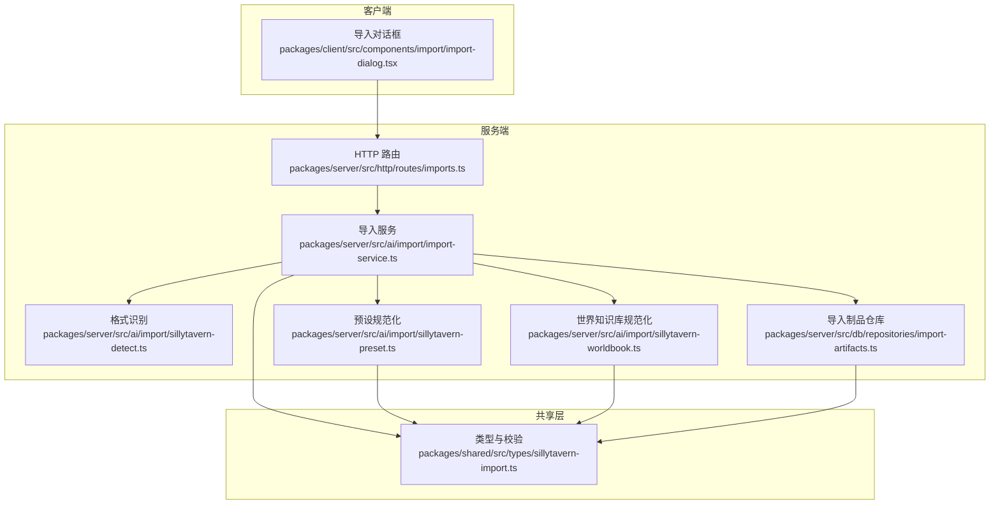
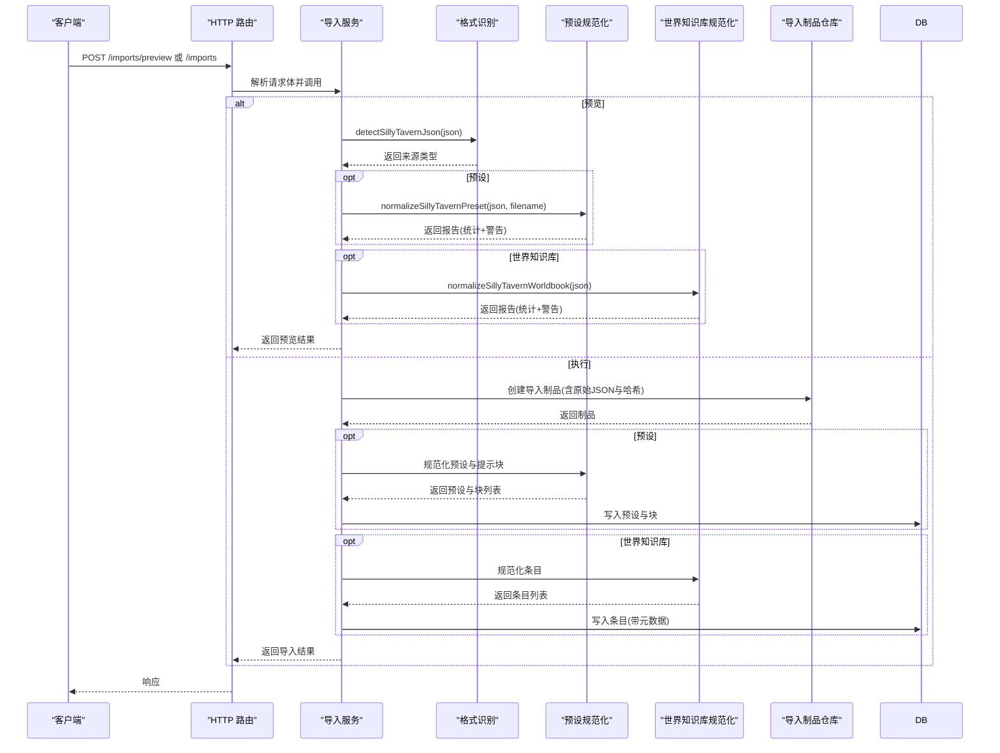
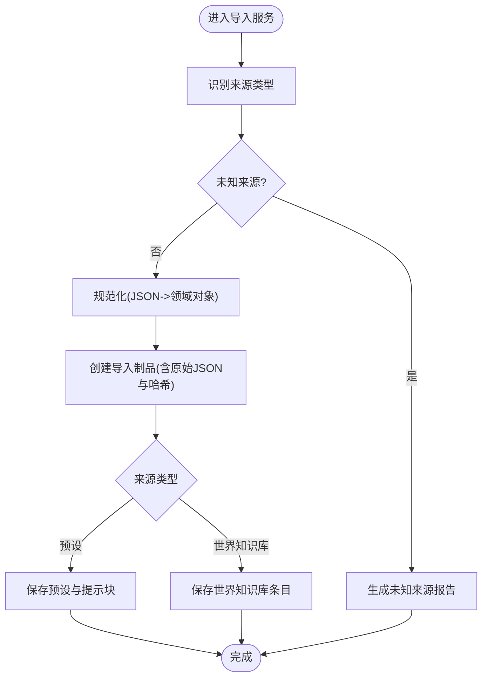
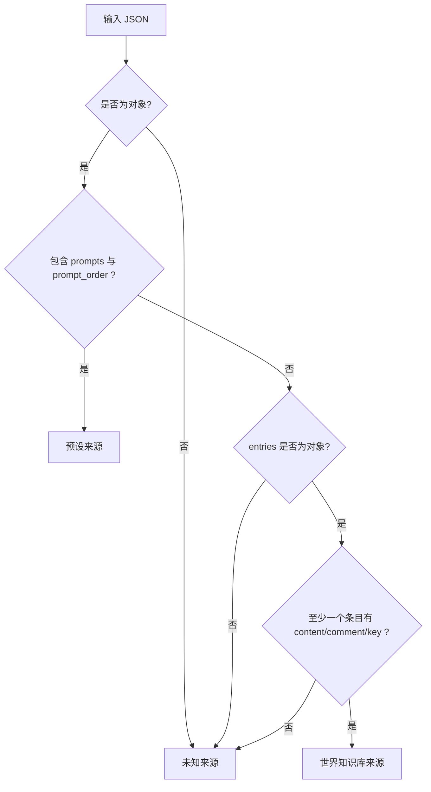
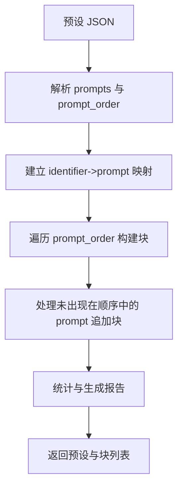
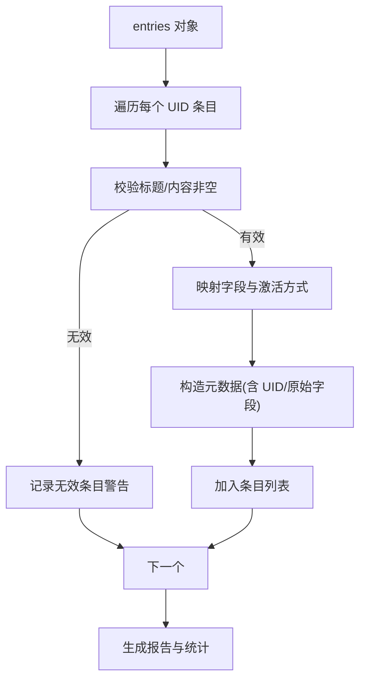
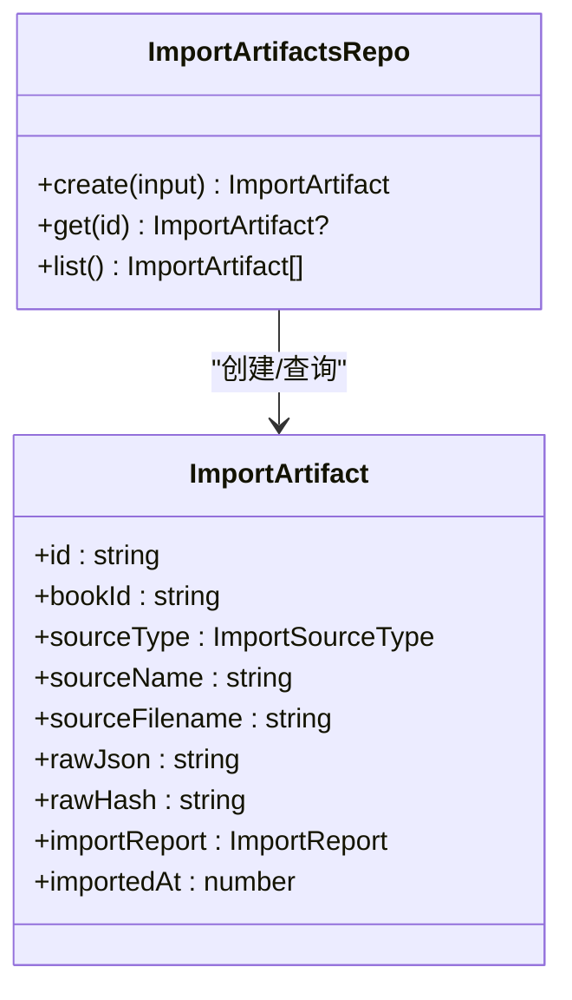
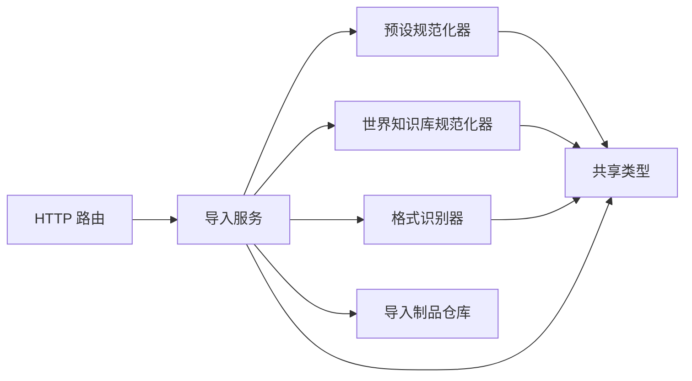

# 导入格式扩展

<cite>
**本文引用的文件**
- [packages/server/src/ai/import/import-service.ts](file://packages/server/src/ai/import/import-service.ts)
- [packages/server/src/ai/import/sillytavern-detect.ts](file://packages/server/src/ai/import/sillytavern-detect.ts)
- [packages/server/src/ai/import/sillytavern-preset.ts](file://packages/server/src/ai/import/sillytavern-preset.ts)
- [packages/server/src/ai/import/sillytavern-worldbook.ts](file://packages/server/src/ai/import/sillytavern-worldbook.ts)
- [packages/server/src/db/repositories/import-artifacts.ts](file://packages/server/src/db/repositories/import-artifacts.ts)
- [packages/server/src/http/routes/imports.ts](file://packages/server/src/http/routes/imports.ts)
- [packages/shared/src/types/sillytavern-import.ts](file://packages/shared/src/types/sillytavern-import.ts)
- [packages/server/tools/verify-sillytavern-import.ts](file://packages/server/tools/verify-sillytavern-import.ts)
- [packages/shared/tests/sillytavern-import.test.ts](file://packages/shared/tests/sillytavern-import.test.ts)
- [packages/server/tests/unit/ai/import/sillytavern-detect.test.ts](file://packages/server/tests/unit/ai/import/sillytavern-detect.test.ts)
- [packages/server/tests/unit/ai/import/sillytavern-preset.test.ts](file://packages/server/tests/unit/ai/import/sillytavern-preset.test.ts)
- [packages/server/tests/unit/ai/import/sillytavern-worldbook.test.ts](file://packages/server/tests/unit/ai/import/sillytavern-worldbook.test.ts)
- [packages/server/tests/unit/db/repositories/import-artifacts.test.ts](file://packages/server/tests/unit/db/repositories/import-artifacts.test.ts)
- [samples/sillytavern/Izumi 0503.json](file://samples/sillytavern/Izumi 0503.json)
- [docs/superpowers/specs/2026-06-16-sillytavern-import-design.md](file://docs/superpowers/specs/2026-06-16-sillytavern-import-design.md)
- [docs/superpowers/plans/2026-06-16-sillytavern-import.md](file://docs/superpowers/plans/2026-06-16-sillytavern-import.md)
</cite>

## 目录
1. [简介](#简介)
2. [项目结构](#项目结构)
3. [核心组件](#核心组件)
4. [架构总览](#架构总览)
5. [详细组件分析](#详细组件分析)
6. [依赖关系分析](#依赖关系分析)
7. [性能考虑](#性能考虑)
8. [故障排查指南](#故障排查指南)
9. [结论](#结论)
10. [附录](#附录)

## 简介
本文件面向希望扩展与定制 Scribe 导入能力的开发者，系统化阐述导入系统的架构设计、扩展机制与实现细节。重点覆盖以下方面：
- 导入系统整体架构与扩展点：格式识别、规范化与持久化
- SillyTavern 导入器的实现原理：JSON 形状识别、数据映射规则与兼容性处理
- 新导入格式的开发指南：格式识别、解析器实现与数据验证
- 批量导入、进度跟踪与中断恢复（概念性说明）
- 数据清洗、冲突解决与重复检测策略
- 性能优化、内存管理与并发控制建议
- 测试方法与质量保证流程

## 项目结构
导入功能主要由服务端模块提供，前端通过 HTTP 接口调用；共享类型定义确保前后端一致性；测试与样例辅助验证。

**图表来源**
- [packages/server/src/http/routes/imports.ts:1-66](file://packages/server/src/http/routes/imports.ts#L1-L66)
- [packages/server/src/ai/import/import-service.ts:1-134](file://packages/server/src/ai/import/import-service.ts#L1-L134)
- [packages/server/src/ai/import/sillytavern-detect.ts:1-20](file://packages/server/src/ai/import/sillytavern-detect.ts#L1-L20)
- [packages/server/src/ai/import/sillytavern-preset.ts:1-211](file://packages/server/src/ai/import/sillytavern-preset.ts#L1-L211)
- [packages/server/src/ai/import/sillytavern-worldbook.ts:1-156](file://packages/server/src/ai/import/sillytavern-worldbook.ts#L1-L156)
- [packages/server/src/db/repositories/import-artifacts.ts:1-77](file://packages/server/src/db/repositories/import-artifacts.ts#L1-L77)
- [packages/shared/src/types/sillytavern-import.ts:1-157](file://packages/shared/src/types/sillytavern-import.ts#L1-L157)

**章节来源**
- [packages/server/src/http/routes/imports.ts:1-66](file://packages/server/src/http/routes/imports.ts#L1-L66)
- [packages/server/src/ai/import/import-service.ts:1-134](file://packages/server/src/ai/import/import-service.ts#L1-L134)
- [packages/shared/src/types/sillytavern-import.ts:1-157](file://packages/shared/src/types/sillytavern-import.ts#L1-L157)

## 核心组件
- HTTP 路由：提供导入预览与执行接口，负责参数校验与错误响应。
- 导入服务：统一协调识别、规范化与持久化流程，并产出导入统计与警告。
- 规范化器：针对 SillyTavern 的预设与世界知识库进行字段映射与数据清洗。
- 格式识别器：基于 JSON 结构特征判断来源类型。
- 导入制品仓库：持久化原始 JSON、哈希与导入报告，支持回溯与审计。
- 类型与校验：使用 Zod 定义导入相关的数据模型与校验规则。

**章节来源**
- [packages/server/src/http/routes/imports.ts:1-66](file://packages/server/src/http/routes/imports.ts#L1-L66)
- [packages/server/src/ai/import/import-service.ts:1-134](file://packages/server/src/ai/import/import-service.ts#L1-L134)
- [packages/server/src/ai/import/sillytavern-detect.ts:1-20](file://packages/server/src/ai/import/sillytavern-detect.ts#L1-L20)
- [packages/server/src/ai/import/sillytavern-preset.ts:1-211](file://packages/server/src/ai/import/sillytavern-preset.ts#L1-L211)
- [packages/server/src/ai/import/sillytavern-worldbook.ts:1-156](file://packages/server/src/ai/import/sillytavern-worldbook.ts#L1-L156)
- [packages/server/src/db/repositories/import-artifacts.ts:1-77](file://packages/server/src/db/repositories/import-artifacts.ts#L1-L77)
- [packages/shared/src/types/sillytavern-import.ts:1-157](file://packages/shared/src/types/sillytavern-import.ts#L1-L157)

## 架构总览
导入流程分为“预览”和“执行”两阶段：
- 预览阶段：识别来源类型，运行规范化器生成报告（统计与警告），不写入数据库。
- 执行阶段：创建导入制品，按来源类型写入对应实体（预设/提示块或世界知识库条目）。

**图表来源**
- [packages/server/src/http/routes/imports.ts:16-62](file://packages/server/src/http/routes/imports.ts#L16-L62)
- [packages/server/src/ai/import/import-service.ts:71-133](file://packages/server/src/ai/import/import-service.ts#L71-L133)
- [packages/server/src/ai/import/sillytavern-detect.ts:7-18](file://packages/server/src/ai/import/sillytavern-detect.ts#L7-L18)
- [packages/server/src/ai/import/sillytavern-preset.ts:120-210](file://packages/server/src/ai/import/sillytavern-preset.ts#L120-L210)
- [packages/server/src/ai/import/sillytavern-worldbook.ts:75-155](file://packages/server/src/ai/import/sillytavern-worldbook.ts#L75-L155)
- [packages/server/src/db/repositories/import-artifacts.ts:38-57](file://packages/server/src/db/repositories/import-artifacts.ts#L38-L57)

## 详细组件分析

### 导入服务与路由
- 路由职责：接收文件名与 JSON，校验参数，分别调用预览或执行函数；对未知来源返回明确错误码。
- 导入服务：统一入口，负责来源识别、规范化、制品创建与实体写入；输出导入统计与警告。

**图表来源**
- [packages/server/src/ai/import/import-service.ts:42-133](file://packages/server/src/ai/import/import-service.ts#L42-L133)
- [packages/server/src/http/routes/imports.ts:16-62](file://packages/server/src/http/routes/imports.ts#L16-L62)

**章节来源**
- [packages/server/src/http/routes/imports.ts:1-66](file://packages/server/src/http/routes/imports.ts#L1-L66)
- [packages/server/src/ai/import/import-service.ts:1-134](file://packages/server/src/ai/import/import-service.ts#L1-L134)

### SillyTavern 格式识别器
- 识别逻辑：基于顶层键是否存在与类型判断来源类型；优先匹配预设结构，再匹配世界知识库结构。
- 设计要点：仅依赖 JSON 结构特征，避免对内容做深度解析，保证识别快速且稳定。

**图表来源**
- [packages/server/src/ai/import/sillytavern-detect.ts:7-18](file://packages/server/src/ai/import/sillytavern-detect.ts#L7-L18)

**章节来源**
- [packages/server/src/ai/import/sillytavern-detect.ts:1-20](file://packages/server/src/ai/import/sillytavern-detect.ts#L1-L20)

### SillyTavern 预设规范化器
- 输入：预设 JSON 对象
- 输出：规范化后的预设对象与提示块列表，以及导入报告
- 关键处理：
  - 提取 generationSettings：排除已知键，保留非对象/非数组的顶层设置
  - 合并与去重：根据 prompt_order 的 identifier 顺序构建块，缺失项追加到末尾
  - 元数据保留：将原始 prompt 与关键字段写入块的 metadata，便于溯源
  - 警告生成：如 enabled 与排序状态不一致、启用但内容为空等
  - 统计：提示总数、有序提示数、激活提示数、角色分布、正则脚本数量

**图表来源**
- [packages/server/src/ai/import/sillytavern-preset.ts:120-210](file://packages/server/src/ai/import/sillytavern-preset.ts#L120-L210)

**章节来源**
- [packages/server/src/ai/import/sillytavern-preset.ts:1-211](file://packages/server/src/ai/import/sillytavern-preset.ts#L1-L211)

### SillyTavern 世界知识库规范化器
- 输入：包含 entries 的对象
- 输出：规范化后的条目列表与导入报告
- 关键处理：
  - 标题与内容：优先 comment 作为标题，否则使用 name；均需非空
  - 激活方式：constant=true 为 constant，否则为 triggered
  - 触发键：支持主键与次级键数组
  - 元数据：保留原始字段与 UID，便于后续行为控制与回溯
  - 警告生成：如无触发键、内容过大、无效条目等
  - 统计：条目总数、启用数、常驻数、触发数、触发键总数

**图表来源**
- [packages/server/src/ai/import/sillytavern-worldbook.ts:75-155](file://packages/server/src/ai/import/sillytavern-worldbook.ts#L75-L155)

**章节来源**
- [packages/server/src/ai/import/sillytavern-worldbook.ts:1-156](file://packages/server/src/ai/import/sillytavern-worldbook.ts#L1-L156)

### 导入制品仓库
- 职责：持久化导入制品，包含来源类型、名称、文件名、原始 JSON 文本与哈希、导入报告等
- 查询：按书本 ID 列表导入历史，按 ID 获取单个制品
- 价值：支持审计、去重、回滚与二次处理

**图表来源**
- [packages/server/src/db/repositories/import-artifacts.ts:20-76](file://packages/server/src/db/repositories/import-artifacts.ts#L20-L76)

**章节来源**
- [packages/server/src/db/repositories/import-artifacts.ts:1-77](file://packages/server/src/db/repositories/import-artifacts.ts#L1-L77)

### 类型与校验（共享层）
- 使用 Zod 定义导入来源类型、导入报告、导入制品、提示预设、提示块、世界知识库元数据等
- 作用：前后端一致的数据契约，保障 API 交互与存储结构的正确性

**章节来源**
- [packages/shared/src/types/sillytavern-import.ts:1-157](file://packages/shared/src/types/sillytavern-import.ts#L1-L157)

## 依赖关系分析
- 路由依赖导入服务；导入服务依赖识别器与规范化器；规范化器依赖共享类型；导入服务依赖制品仓库。
- 识别器与规范化器彼此独立，便于扩展新的来源类型。
- 共享类型为所有模块提供统一约束，降低耦合风险。

**图表来源**
- [packages/server/src/http/routes/imports.ts:1-66](file://packages/server/src/http/routes/imports.ts#L1-L66)
- [packages/server/src/ai/import/import-service.ts:1-134](file://packages/server/src/ai/import/import-service.ts#L1-L134)
- [packages/shared/src/types/sillytavern-import.ts:1-157](file://packages/shared/src/types/sillytavern-import.ts#L1-L157)

**章节来源**
- [packages/server/src/http/routes/imports.ts:1-66](file://packages/server/src/http/routes/imports.ts#L1-L66)
- [packages/server/src/ai/import/import-service.ts:1-134](file://packages/server/src/ai/import/import-service.ts#L1-L134)

## 性能考虑
- 识别阶段：仅进行浅层结构检查，时间复杂度近似 O(n)（n 为顶层键数量），开销极低。
- 规范化阶段：
  - 预设：遍历 prompt_order 与 prompts，时间复杂度 O(p)，空间复杂度 O(p)（p 为提示数）
  - 世界知识库：遍历 entries，时间复杂度 O(e)，空间复杂度 O(e)
- 存储阶段：一次 INSERT 写入制品，随后批量写入实体；SQLite 的事务与索引可提升吞吐。
- 内存管理：避免在规范化过程中复制大文本；保持中间对象短生命周期；必要时分批处理。
- 并发控制：导入操作建议串行化至同一书本，避免并发写入导致的锁竞争；跨书本可并行。

[本节为通用指导，无需具体文件引用]

## 故障排查指南
- 常见错误与定位
  - 未知来源 JSON：当 JSON 不符合任一已知形状时返回“未知来源”，检查顶层键与类型
  - 非法导入载荷：路由对 filename 与 JSON 进行基础校验，若缺失或类型不符会返回错误
  - 预设启用状态不一致：规范化器会记录启用标志与排序状态冲突的警告
  - 空内容提示：启用但内容为空会生成警告
  - 世界知识库无效条目：缺少标题/内容或键为空会生成警告
- 审计与回溯
  - 通过导入制品仓库查询导入历史，核对原始 JSON 与哈希
  - 使用工具脚本对导入结果进行一致性验证

**章节来源**
- [packages/server/src/http/routes/imports.ts:16-62](file://packages/server/src/http/routes/imports.ts#L16-L62)
- [packages/server/src/ai/import/import-service.ts:42-69](file://packages/server/src/ai/import/import-service.ts#L42-L69)
- [packages/server/src/ai/import/sillytavern-preset.ts:72-118](file://packages/server/src/ai/import/sillytavern-preset.ts#L72-L118)
- [packages/server/src/ai/import/sillytavern-worldbook.ts:88-122](file://packages/server/src/ai/import/sillytavern-worldbook.ts#L88-L122)
- [packages/server/src/db/repositories/import-artifacts.ts:38-74](file://packages/server/src/db/repositories/import-artifacts.ts#L38-L74)

## 结论
Scribe 的导入系统采用“识别—规范化—持久化”的清晰分层，既保证了对 SillyTavern 的高兼容性，也为未来扩展其他来源格式提供了良好接口。通过共享类型与严格的校验，系统在正确性与可维护性上具备坚实基础。建议在扩展新格式时遵循现有模式：先识别、再规范化、最后持久化，并配套完善的测试与报告。

[本节为总结，无需具体文件引用]

## 附录

### 新导入格式开发指南
- 格式识别
  - 在识别器中新增分支，依据 JSON 结构特征判断来源类型
  - 返回受控枚举值，避免污染未知来源判断
- 规范化器实现
  - 定义规范化输出结构（如预设/条目列表与导入报告）
  - 实现字段映射与数据清洗，保留原始信息以便审计
  - 生成统计与警告，确保可追溯性
- 数据验证
  - 使用共享类型进行输入与输出校验
  - 在路由与服务层统一处理异常与错误响应
- 集成与持久化
  - 在导入服务中注册新来源的规范化流程
  - 将规范化结果写入对应实体与导入制品仓库
- 测试与质量保证
  - 单元测试：覆盖边界条件、异常路径与映射规则
  - 集成测试：端到端验证预览与执行流程
  - 样例驱动：使用真实样例（如 SillyTavern JSON）进行回归测试

**章节来源**
- [packages/server/src/ai/import/sillytavern-detect.ts:7-18](file://packages/server/src/ai/import/sillytavern-detect.ts#L7-L18)
- [packages/server/src/ai/import/sillytavern-preset.ts:120-210](file://packages/server/src/ai/import/sillytavern-preset.ts#L120-L210)
- [packages/server/src/ai/import/sillytavern-worldbook.ts:75-155](file://packages/server/src/ai/import/sillytavern-worldbook.ts#L75-L155)
- [packages/shared/src/types/sillytavern-import.ts:1-157](file://packages/shared/src/types/sillytavern-import.ts#L1-L157)

### 批量导入、进度跟踪与中断恢复（概念性说明）
- 批量导入：建议按书本维度串行处理，避免并发写入冲突；对超大文件可分片读取与流式解析
- 进度跟踪：在导入制品中记录时间戳与统计信息；前端轮询或事件推送展示进度
- 中断恢复：利用导入制品的哈希与原始 JSON，支持幂等重试与差异对比

[本节为概念性说明，无需具体文件引用]

### 数据清洗、冲突解决与重复检测
- 清洗策略：去除空标题/内容、标准化布尔与数值字段、保留原始元数据
- 冲突解决：启用状态与排序状态冲突时以排序为准并记录警告；世界知识库禁用字段映射为启用取反
- 重复检测：基于导入制品的哈希进行去重；实体层面可结合共享类型声明的身份字段进行去重

**章节来源**
- [packages/server/src/ai/import/sillytavern-preset.ts:72-118](file://packages/server/src/ai/import/sillytavern-preset.ts#L72-L118)
- [packages/server/src/ai/import/sillytavern-worldbook.ts:88-122](file://packages/server/src/ai/import/sillytavern-worldbook.ts#L88-L122)
- [packages/server/src/db/repositories/import-artifacts.ts:38-57](file://packages/server/src/db/repositories/import-artifacts.ts#L38-L57)

### 导入性能优化与并发控制
- 识别与规范化：尽量减少对象拷贝与字符串拼接；使用 Set/Map 进行去重与查找
- 存储：批量插入前开启事务；合理索引（如按导入时间倒序列出）
- 并发：同一书本串行导入；跨书本并行；I/O 与 CPU 密集任务分离

[本节为通用指导，无需具体文件引用]

### 导入格式测试方法与质量保证流程
- 单元测试：覆盖识别器、规范化器与仓库的边界与异常场景
- 集成测试：端到端验证路由、服务与数据库交互
- 样例测试：使用样例 JSON 文件进行回归测试
- 工具验证：使用专用工具脚本对导入结果进行一致性校验

**章节来源**
- [packages/server/tests/unit/ai/import/sillytavern-detect.test.ts](file://packages/server/tests/unit/ai/import/sillytavern-detect.test.ts)
- [packages/server/tests/unit/ai/import/sillytavern-preset.test.ts](file://packages/server/tests/unit/ai/import/sillytavern-preset.test.ts)
- [packages/server/tests/unit/ai/import/sillytavern-worldbook.test.ts](file://packages/server/tests/unit/ai/import/sillytavern-worldbook.test.ts)
- [packages/server/tests/unit/db/repositories/import-artifacts.test.ts](file://packages/server/tests/unit/db/repositories/import-artifacts.test.ts)
- [packages/shared/tests/sillytavern-import.test.ts](file://packages/shared/tests/sillytavern-import.test.ts)
- [packages/server/tools/verify-sillytavern-import.ts](file://packages/server/tools/verify-sillytavern-import.ts)
- [samples/sillytavern/Izumi 0503.json](file://samples/sillytavern/Izumi 0503.json)

### SillyTavern 导入映射与设计规范
- 映射规则与保留字段：参考设计文档中的映射与保留字段清单，确保行为一致性与可扩展性
- 核心行为支持：启用/禁用、常驻/触发、优先级/深度、递归限制、预算修剪、概率触发、选择性逻辑、分组评分、粘性/冷却/延迟、大小写敏感与全词匹配、扫描深度等

**章节来源**
- [docs/superpowers/specs/2026-06-16-sillytavern-import-design.md:217-265](file://docs/superpowers/specs/2026-06-16-sillytavern-import-design.md#L217-L265)

### 前端导入对话框与工作流
- 前端对话框：读取本地 JSON 文件，解析后调用预览接口，展示来源类型、统计与警告，确认后执行导入
- 交互流程：文件选择 → 预览 → 确认导入 → 成功回调

**章节来源**
- [docs/superpowers/plans/2026-06-16-sillytavern-import.md:2330-2388](file://docs/superpowers/plans/2026-06-16-sillytavern-import.md#L2330-L2388)