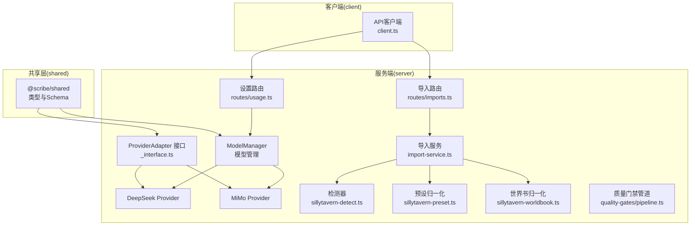
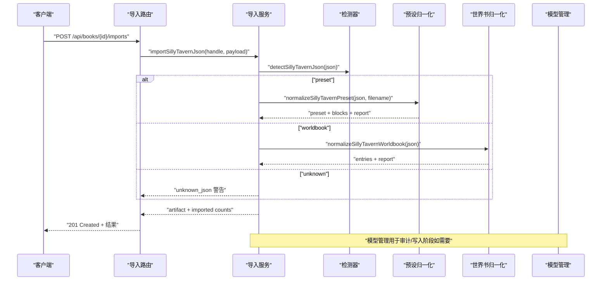
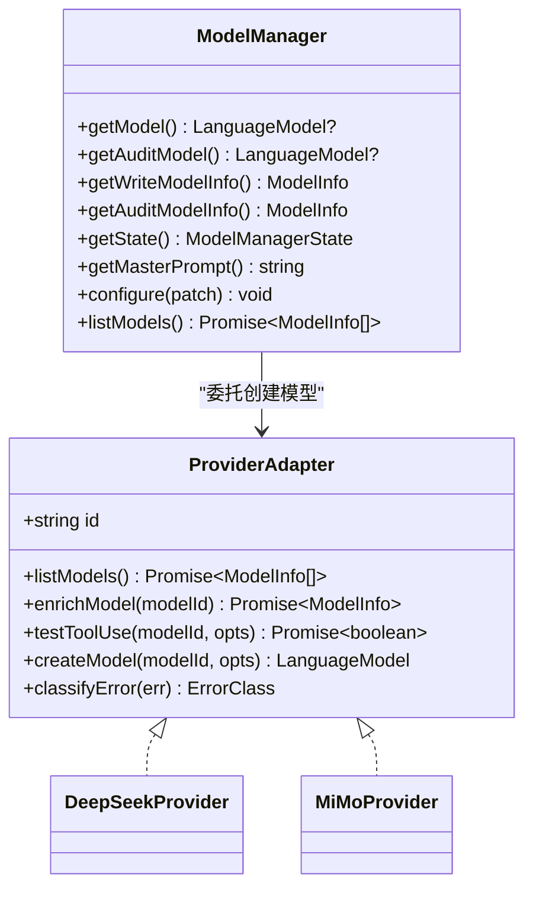
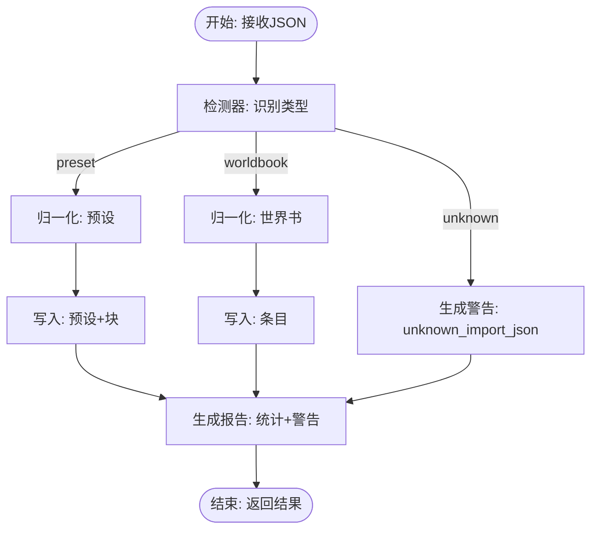
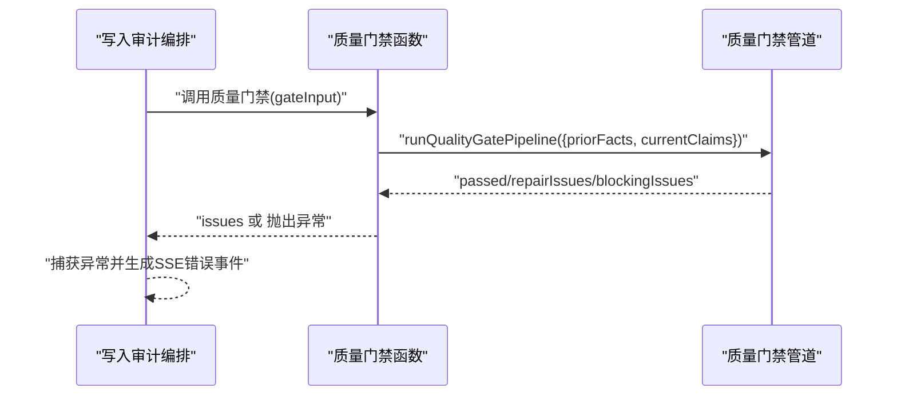
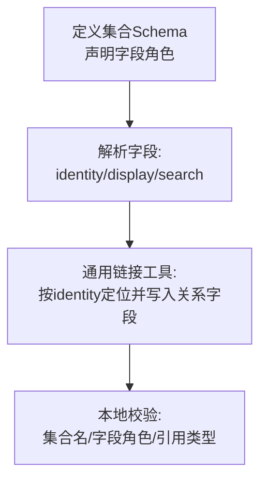
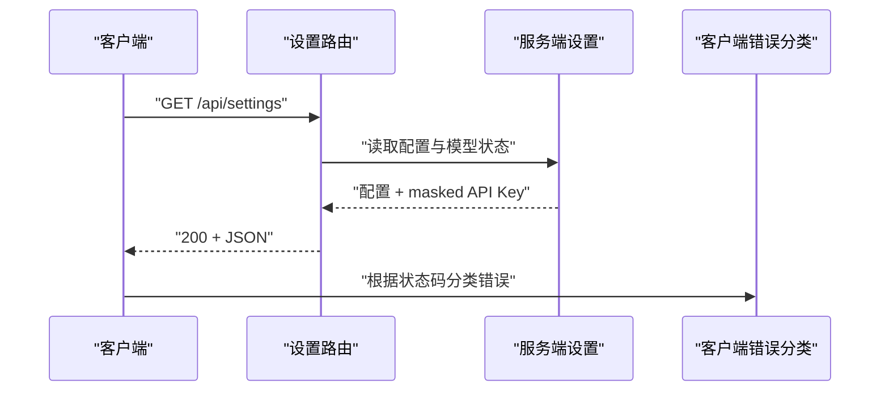
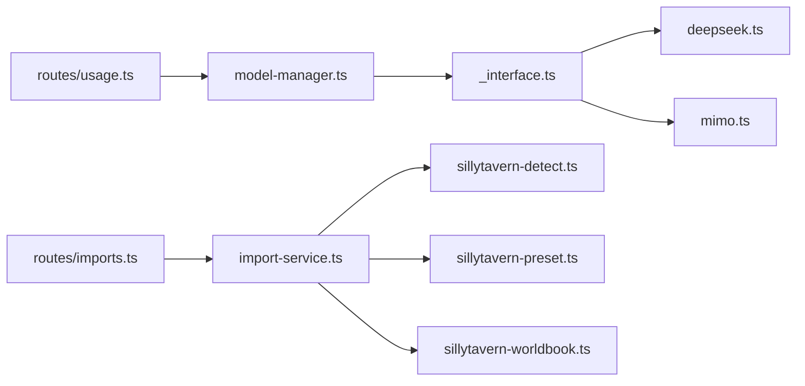

# 扩展开发

<cite>
**本文档引用的文件**
- [packages/server/src/ai/model-manager.ts](file://packages/server/src/ai/model-manager.ts)
- [packages/server/src/ai/providers/_interface.ts](file://packages/server/src/ai/providers/_interface.ts)
- [packages/server/src/ai/providers/deepseek.ts](file://packages/server/src/ai/providers/deepseek.ts)
- [packages/server/src/ai/providers/mimo.ts](file://packages/server/src/ai/providers/mimo.ts)
- [packages/server/src/ai/providers/local-model-table.ts](file://packages/server/src/ai/providers/local-model-table.ts)
- [packages/server/src/ai/import/sillytavern-detect.ts](file://packages/server/src/ai/import/sillytavern-detect.ts)
- [packages/server/src/ai/import/sillytavern-preset.ts](file://packages/server/src/ai/import/sillytavern-preset.ts)
- [packages/server/src/ai/import/sillytavern-worldbook.ts](file://packages/server/src/ai/import/sillytavern-worldbook.ts)
- [packages/server/src/ai/import/import-service.ts](file://packages/server/src/ai/import/import-service.ts)
- [packages/server/src/http/routes/imports.ts](file://packages/server/src/http/routes/imports.ts)
- [packages/server/src/http/routes/usage.ts](file://packages/server/src/http/routes/usage.ts)
- [packages/server/src/ai/orchestrator/write-with-audit.ts](file://packages/server/src/ai/orchestrator/write-with-audit.ts)
- [packages/server/src/ai/quality-gates/pipeline.ts](file://packages/server/src/ai/quality-gates/pipeline.ts)
- [packages/server/tests/unit/ai/providers/interface.test.ts](file://packages/server/tests/unit/ai/providers/interface.test.ts)
- [packages/server/tests/unit/ai/import/sillytavern-detect.test.ts](file://packages/server/tests/unit/ai/import/sillytavern-detect.test.ts)
- [packages/server/tests/unit/ai/import/sillytavern-preset.test.ts](file://packages/server/tests/unit/ai/import/sillytavern-preset.test.ts)
- [packages/server/tests/unit/ai/import/sillytavern-worldbook.test.ts](file://packages/server/tests/unit/ai/import/sillytavern-worldbook.test.ts)
- [packages/server/tests/integration/auto-mode.test.ts](file://packages/server/tests/integration/auto-mode.test.ts)
- [packages/server/tests/integration/sidebar-routes.test.ts](file://packages/server/tests/integration/sidebar-routes.test.ts)
- [packages/server/tests/fixtures/mock-llm.ts](file://packages/server/tests/fixtures/mock-llm.ts)
- [packages/client/src/api/client.ts](file://packages/client/src/api/client.ts)
- [docs/superpowers/plans/2026-06-04-scribe-mvp.md](file://docs/superpowers/plans/2026-06-04-scribe-mvp.md)
- [docs/superpowers/plans/2026-06-15-generic-record-architecture.md](file://docs/superpowers/plans/2026-06-15-generic-record-architecture.md)
- [docs/superpowers/plans/2026-06-16-sillytavern-import.md](file://docs/superpowers/plans/2026-06-16-sillytavern-import.md)
- [docs/superpowers/specs/2026-06-17-scribe-ultimate-product-goal.md](file://docs/superpowers/specs/2026-06-17-scribe-ultimate-product-goal.md)
- [samples/sillytavern/Izumi 0503.json](file://samples/sillytavern/Izumi 0503.json)
</cite>

## 目录
1. [简介](#简介)
2. [项目结构](#项目结构)
3. [核心组件](#核心组件)
4. [架构总览](#架构总览)
5. [详细组件分析](#详细组件分析)
6. [依赖分析](#依赖分析)
7. [性能考量](#性能考量)
8. [故障排查指南](#故障排查指南)
9. [结论](#结论)
10. [附录](#附录)

## 简介
本文件面向希望在Scribe项目上进行扩展开发的工程师，系统化阐述插件系统架构、扩展点识别与实现路径，覆盖以下主题：
- AI模型接口扩展：新增Provider适配器、模型清单与错误分类
- 导入格式扩展：以SiliconTavern导入器为例，说明检测、归一化与导入流程
- 质量检查器扩展：质量门禁管道、检查规则定义与结果报告
- 通用记录架构：数据模型扩展方法与关系链接工具
- API扩展：新增端点、中间件与认证扩展
- 最佳实践、测试方法与发布流程
- 版本管理与向后兼容性策略

## 项目结构
Scribe采用Monorepo结构，核心包包括：
- packages/shared：共享类型与Schema（仅导出类型，不包含运行时）
- packages/server：服务端逻辑（AI模型管理、导入器、HTTP路由、质量门禁等）
- packages/client：前端客户端（API封装与错误分类）

图表来源
- [packages/server/src/ai/model-manager.ts:1-82](file://packages/server/src/ai/model-manager.ts#L1-L82)
- [packages/server/src/ai/providers/_interface.ts:1-18](file://packages/server/src/ai/providers/_interface.ts#L1-L18)
- [packages/server/src/ai/import/import-service.ts:45-133](file://packages/server/src/ai/import/import-service.ts#L45-L133)
- [packages/server/src/http/routes/imports.ts:39-65](file://packages/server/src/http/routes/imports.ts#L39-L65)
- [packages/server/src/http/routes/usage.ts:40-66](file://packages/server/src/http/routes/usage.ts#L40-L66)
- [packages/client/src/api/client.ts:146-181](file://packages/client/src/api/client.ts#L146-L181)

章节来源
- [docs/superpowers/plans/2026-06-04-scribe-mvp.md:235-399](file://docs/superpowers/plans/2026-06-04-scribe-mvp.md#L235-L399)

## 核心组件
- 模型管理与Provider接口
  - ModelManager负责选择Provider、加载模型信息、热配置参数，并暴露统一的模型工厂
  - ProviderAdapter定义了统一的接口：列出模型、增强模型信息、测试工具使用、创建语言模型、错误分类
- 导入服务
  - 基于检测器识别输入类型，调用对应归一化模块，最终写入目标存储并生成导入工件
- 质量门禁
  - 通过质量门禁管道对先验事实与当前声明进行对比，输出修复与阻断问题
- 通用记录架构
  - 通过声明式字段角色（identity、label、summary等）与关系字段，实现跨领域通用记录模型与链接工具

章节来源
- [packages/server/src/ai/model-manager.ts:1-82](file://packages/server/src/ai/model-manager.ts#L1-L82)
- [packages/server/src/ai/providers/_interface.ts:1-18](file://packages/server/src/ai/providers/_interface.ts#L1-L18)
- [packages/server/src/ai/import/import-service.ts:45-133](file://packages/server/src/ai/import/import-service.ts#L45-L133)
- [packages/server/src/ai/orchestrator/write-with-audit.ts:292-316](file://packages/server/src/ai/orchestrator/write-with-audit.ts#L292-L316)
- [packages/server/src/ai/quality-gates/pipeline.ts:1-38](file://packages/server/src/ai/quality-gates/pipeline.ts#L1-L38)
- [docs/superpowers/plans/2026-06-15-generic-record-architecture.md:13-950](file://docs/superpowers/plans/2026-06-15-generic-record-architecture.md#L13-L950)

## 架构总览
下图展示了从客户端请求到服务端处理、模型调用与导入流程的关键交互。

图表来源
- [packages/server/src/http/routes/imports.ts:39-65](file://packages/server/src/http/routes/imports.ts#L39-L65)
- [packages/server/src/ai/import/import-service.ts:45-133](file://packages/server/src/ai/import/import-service.ts#L45-L133)
- [packages/server/src/ai/import/sillytavern-detect.ts:7-19](file://packages/server/src/ai/import/sillytavern-detect.ts#L7-L19)
- [packages/server/src/ai/import/sillytavern-preset.ts](file://packages/server/src/ai/import/sillytavern-preset.ts)
- [packages/server/src/ai/import/sillytavern-worldbook.ts](file://packages/server/src/ai/import/sillytavern-worldbook.ts)
- [packages/server/src/ai/model-manager.ts:1-82](file://packages/server/src/ai/model-manager.ts#L1-L82)

## 详细组件分析

### 组件A：AI模型接口与Provider扩展
- 设计要点
  - ProviderAdapter抽象统一模型列表、增强、工具使用测试、模型创建与错误分类
  - ModelManager根据Provider与密钥动态创建模型实例，支持热配置（如写模型ID、审计模型ID、全局最深提示词）
  - 本地模型表用于补充模型上下文窗口、定价等元信息
- 扩展步骤
  1) 在shared中定义模型信息与错误分类Schema
  2) 实现ProviderAdapter接口，提供listModels/enrichModel/createModel/classifyError
  3) 在ModelManager中注册新Provider并更新默认模型ID
  4) 编写单元测试确保接口契约满足

图表来源
- [packages/server/src/ai/providers/_interface.ts:1-18](file://packages/server/src/ai/providers/_interface.ts#L1-L18)
- [packages/server/src/ai/model-manager.ts:1-82](file://packages/server/src/ai/model-manager.ts#L1-L82)
- [packages/server/src/ai/providers/deepseek.ts](file://packages/server/src/ai/providers/deepseek.ts)
- [packages/server/src/ai/providers/mimo.ts](file://packages/server/src/ai/providers/mimo.ts)

章节来源
- [packages/server/src/ai/providers/_interface.ts:1-18](file://packages/server/src/ai/providers/_interface.ts#L1-L18)
- [packages/server/src/ai/model-manager.ts:1-82](file://packages/server/src/ai/model-manager.ts#L1-L82)
- [packages/server/tests/unit/ai/providers/interface.test.ts:1-10](file://packages/server/tests/unit/ai/providers/interface.test.ts#L1-L10)
- [docs/superpowers/plans/2026-06-04-scribe-mvp.md:1174-1226](file://docs/superpowers/plans/2026-06-04-scribe-mvp.md#L1174-L1226)

### 组件B：SiliconTavern导入器扩展
- 设计要点
  - 检测器：基于JSON结构特征识别preset/worldbook/unknown
  - 归一化：将外部格式映射为内部通用结构，保留未知字段到原始元数据
  - 导入服务：生成导入工件、写入存储、统计导入数量
  - 路由：提供预览与导入端点，返回警告与统计信息
- 扩展步骤
  1) 新增检测分支与归一化模块，保持与现有检测器一致的返回结构
  2) 在导入服务中增加类型分支与写入逻辑
  3) 在路由中处理新类型并返回相应统计与警告
  4) 补充单元与集成测试，覆盖边界与错误场景

图表来源
- [packages/server/src/ai/import/sillytavern-detect.ts:7-19](file://packages/server/src/ai/import/sillytavern-detect.ts#L7-L19)
- [packages/server/src/ai/import/sillytavern-preset.ts](file://packages/server/src/ai/import/sillytavern-preset.ts)
- [packages/server/src/ai/import/sillytavern-worldbook.ts](file://packages/server/src/ai/import/sillytavern-worldbook.ts)
- [packages/server/src/ai/import/import-service.ts:45-133](file://packages/server/src/ai/import/import-service.ts#L45-L133)
- [packages/server/src/http/routes/imports.ts:39-65](file://packages/server/src/http/routes/imports.ts#L39-L65)

章节来源
- [packages/server/src/ai/import/sillytavern-detect.ts:1-19](file://packages/server/src/ai/import/sillytavern-detect.ts#L1-L19)
- [packages/server/src/ai/import/import-service.ts:45-133](file://packages/server/src/ai/import/import-service.ts#L45-L133)
- [packages/server/src/http/routes/imports.ts:39-65](file://packages/server/src/http/routes/imports.ts#L39-L65)
- [packages/server/tests/unit/ai/import/sillytavern-detect.test.ts:1-21](file://packages/server/tests/unit/ai/import/sillytavern-detect.test.ts#L1-L21)
- [packages/server/tests/unit/ai/import/sillytavern-preset.test.ts:1-750](file://packages/server/tests/unit/ai/import/sillytavern-preset.test.ts#L1-L750)
- [packages/server/tests/unit/ai/import/sillytavern-worldbook.test.ts:1-819](file://packages/server/tests/unit/ai/import/sillytavern-worldbook.test.ts#L1-L819)
- [docs/superpowers/plans/2026-06-16-sillytavern-import.md:653-819](file://docs/superpowers/plans/2026-06-16-sillytavern-import.md#L653-L819)
- [docs/superpowers/plans/2026-06-16-sillytavern-import.md:927-2388](file://docs/superpowers/plans/2026-06-16-sillytavern-import.md#L927-L2388)

### 组件C：质量检查器扩展
- 设计要点
  - 质量门禁管道接收先验事实与当前声明，判定是否通过、需要修复或阻断
  - 写入审计流程中可注入自定义质量门禁函数，捕获异常并转换为SSE事件
- 扩展步骤
  1) 定义检查规则与阈值，编写质量门禁函数，返回issues数组
  2) 在写入审计流程中传递质量门禁函数
  3) 将异常转换为标准化错误类，便于前端展示与重试

图表来源
- [packages/server/src/ai/orchestrator/write-with-audit.ts:292-316](file://packages/server/src/ai/orchestrator/write-with-audit.ts#L292-L316)
- [packages/server/src/ai/quality-gates/pipeline.ts:1-38](file://packages/server/src/ai/quality-gates/pipeline.ts#L1-L38)

章节来源
- [packages/server/src/ai/orchestrator/write-with-audit.ts:292-316](file://packages/server/src/ai/orchestrator/write-with-audit.ts#L292-L316)
- [packages/server/src/ai/quality-gates/pipeline.ts:1-38](file://packages/server/src/ai/quality-gates/pipeline.ts#L1-L38)

### 组件D：通用记录架构与数据模型扩展
- 设计要点
  - 通过声明式字段角色（identity、label、summary等）解析唯一标识、显示字段与搜索文本
  - 关系字段使用ref:section:目标集合语法，本地只校验声明与引用，不理解领域语义
  - 提供通用链接工具，按集合声明的identityFields定位两端记录并写入关系字段
- 扩展步骤
  1) 定义新的记录集合Schema，声明identityFields/displayFields/searchFields与字段角色
  2) 使用通用链接工具建立关系，确保引用类型匹配
  3) 在UI与脚本中仅依赖声明，避免猜测字段名或位置

图表来源
- [docs/superpowers/plans/2026-06-15-generic-record-architecture.md:163-224](file://docs/superpowers/plans/2026-06-15-generic-record-architecture.md#L163-L224)
- [docs/superpowers/plans/2026-06-15-generic-record-architecture.md:911-950](file://docs/superpowers/plans/2026-06-15-generic-record-architecture.md#L911-L950)

章节来源
- [docs/superpowers/plans/2026-06-15-generic-record-architecture.md:13-950](file://docs/superpowers/plans/2026-06-15-generic-record-architecture.md#L13-L950)

### 组件E：API扩展（新增端点、中间件与认证）
- 新增端点
  - 参考设置路由与导入路由，遵循统一的错误响应结构与状态码约定
  - 在路由中解析参数、调用业务处理并返回标准JSON
- 中间件
  - 可在NueHttp应用层添加鉴权、限流、日志等中间件，统一处理跨域与CORS
- 认证扩展
  - 客户端侧对401/403/429/503等状态进行错误分类与用户提示
  - 服务端设置路由返回masked API Key与可用状态，便于前端展示

图表来源
- [packages/server/src/http/routes/usage.ts:40-66](file://packages/server/src/http/routes/usage.ts#L40-L66)
- [packages/client/src/api/client.ts:146-181](file://packages/client/src/api/client.ts#L146-L181)

章节来源
- [packages/server/src/http/routes/usage.ts:40-66](file://packages/server/src/http/routes/usage.ts#L40-L66)
- [packages/client/src/api/client.ts:146-181](file://packages/client/src/api/client.ts#L146-L181)
- [packages/server/tests/integration/auto-mode.test.ts:368-386](file://packages/server/tests/integration/auto-mode.test.ts#L368-L386)

## 依赖分析
- 组件耦合
  - ModelManager依赖ProviderAdapter实现；Provider实现可替换
  - 导入服务依赖检测器与归一化模块；路由依赖导入服务
  - 质量门禁管道独立于导入流程，但可在写入审计中被调用
- 外部依赖
  - ai库提供的LanguageModel接口
  - Vitest用于单元与集成测试
  - Playwright用于端到端测试

图表来源
- [packages/server/src/ai/providers/_interface.ts:1-18](file://packages/server/src/ai/providers/_interface.ts#L1-L18)
- [packages/server/src/ai/model-manager.ts:1-82](file://packages/server/src/ai/model-manager.ts#L1-L82)
- [packages/server/src/ai/import/import-service.ts:45-133](file://packages/server/src/ai/import/import-service.ts#L45-L133)
- [packages/server/src/http/routes/imports.ts:39-65](file://packages/server/src/http/routes/imports.ts#L39-L65)
- [packages/server/src/http/routes/usage.ts:40-66](file://packages/server/src/http/routes/usage.ts#L40-L66)

章节来源
- [packages/server/src/ai/providers/_interface.ts:1-18](file://packages/server/src/ai/providers/_interface.ts#L1-L18)
- [packages/server/src/ai/model-manager.ts:1-82](file://packages/server/src/ai/model-manager.ts#L1-L82)
- [packages/server/src/ai/import/import-service.ts:45-133](file://packages/server/src/ai/import/import-service.ts#L45-L133)

## 性能考量
- 模型管理
  - 通过热配置减少重启成本；优先缓存模型信息与本地模型表
- 导入流程
  - 归一化阶段尽量避免重复计算；批量写入时合并事务
- 质量门禁
  - 对大体量先验事实与当前声明进行分页或增量处理，降低内存峰值
- API
  - 合理设置查询限制与分页；对高频端点启用缓存与压缩

## 故障排查指南
- Provider相关
  - 若未配置API Key，listModels会抛错；请先在设置中保存有效Key
  - 错误分类用于区分速率限制、超时、流空闲、认证、上下文溢出等
- 导入相关
  - unknown JSON会返回明确警告；请确认输入格式符合preset或worldbook结构
  - 预览端点可用于提前发现潜在问题
- 质量门禁
  - 门禁函数异常会被捕获并转为SSE错误事件；检查异常消息定位问题
- 客户端错误分类
  - 401/403标记为auth，429为rate_limit，503为service_unavailable，404为not_found

章节来源
- [packages/server/src/ai/model-manager.ts:76-81](file://packages/server/src/ai/model-manager.ts#L76-L81)
- [packages/server/src/http/routes/usage.ts:52-66](file://packages/server/src/http/routes/usage.ts#L52-L66)
- [packages/server/src/ai/orchestrator/write-with-audit.ts:306-316](file://packages/server/src/ai/orchestrator/write-with-audit.ts#L306-L316)
- [packages/client/src/api/client.ts:146-181](file://packages/client/src/api/client.ts#L146-L181)

## 结论
Scribe通过清晰的插件化架构与声明式设计，为扩展开发提供了稳定且可演进的基础：
- Provider接口与ModelManager使模型扩展简单可控
- 导入器以检测/归一化/导入三段式解耦，便于新增格式
- 质量门禁管道与通用记录架构保障内容质量与跨领域一致性
- API扩展遵循统一的错误分类与响应规范，便于前端与运维

## 附录
- 开发最佳实践
  - 严格遵守ProviderAdapter接口契约，确保listModels/enrichModel/createModel/classifyError完整实现
  - 导入器需提供检测、归一化与导入三部分测试，覆盖正常与异常路径
  - 质量门禁函数应幂等、可重试，并提供清晰的问题描述
  - 通用记录Schema必须声明identity与display字段角色，避免猜测字段名
- 测试方法
  - 单元测试：接口契约、边界条件、错误分类
  - 集成测试：端到端导入流程、设置变更生效
  - 端到端测试：Playwright覆盖关键用户旅程
- 发布流程
  - 本地构建与类型检查通过后，使用pnpm工作区并行构建
  - 运行所有测试集，确保覆盖率与稳定性
  - 更新版本号与变更日志，推送标签并发布
- 版本管理与向后兼容
  - 严格遵循语义化版本；破坏性变更提升主版本
  - 通过兼容层或迁移路径保证历史书籍可读
  - 对外暴露的API与Schema变更需提供迁移指南

章节来源
- [docs/superpowers/specs/2026-06-17-scribe-ultimate-product-goal.md:270-295](file://docs/superpowers/specs/2026-06-17-scribe-ultimate-product-goal.md#L270-L295)
- [docs/superpowers/plans/2026-06-04-scribe-mvp.md:235-399](file://docs/superpowers/plans/2026-06-04-scribe-mvp.md#L235-L399)