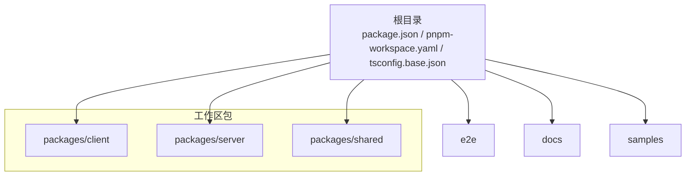
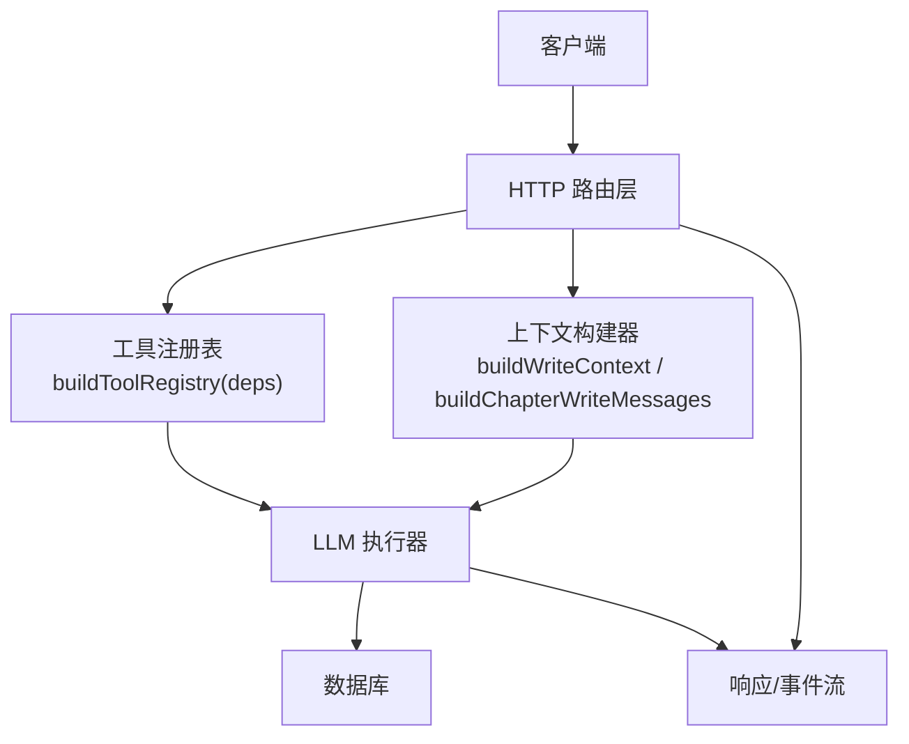
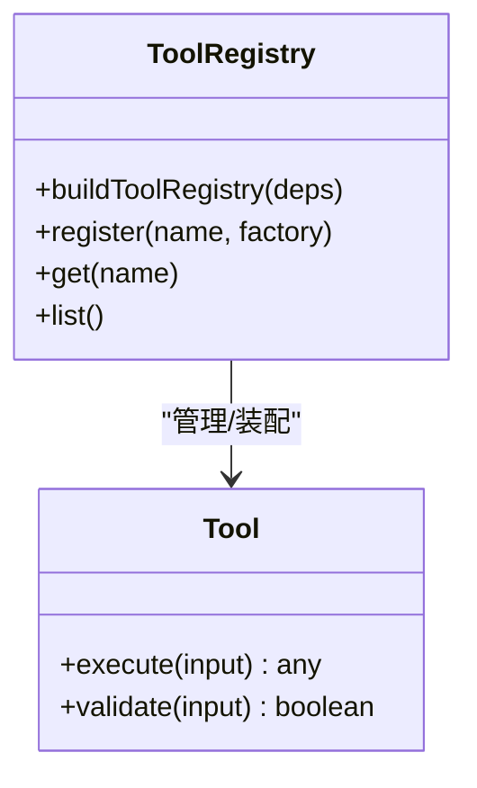
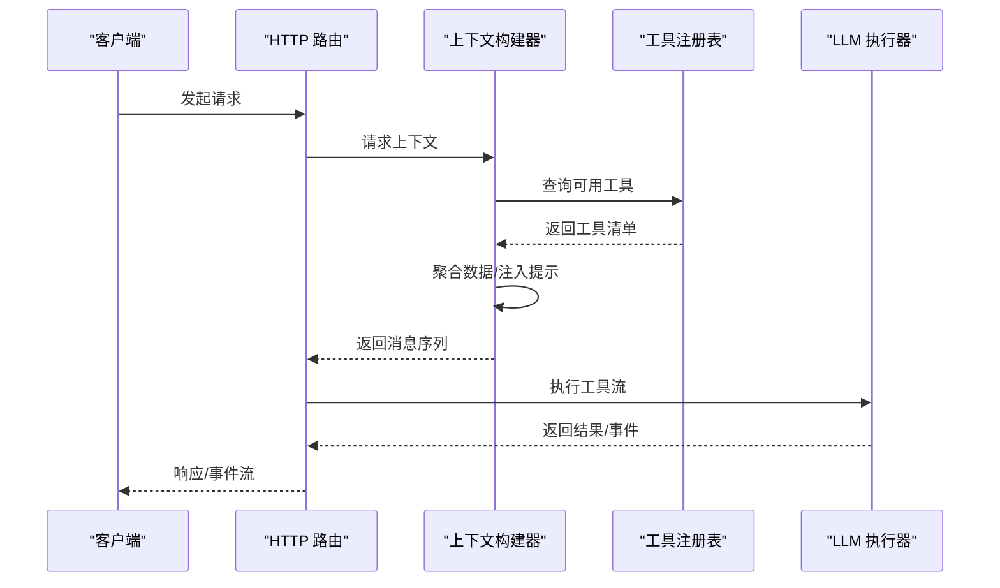
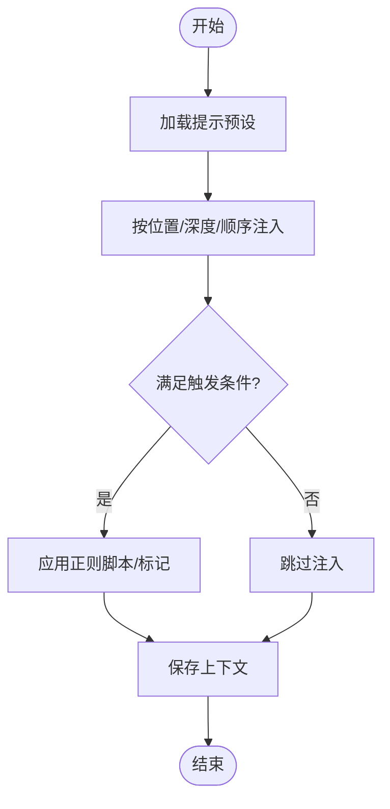
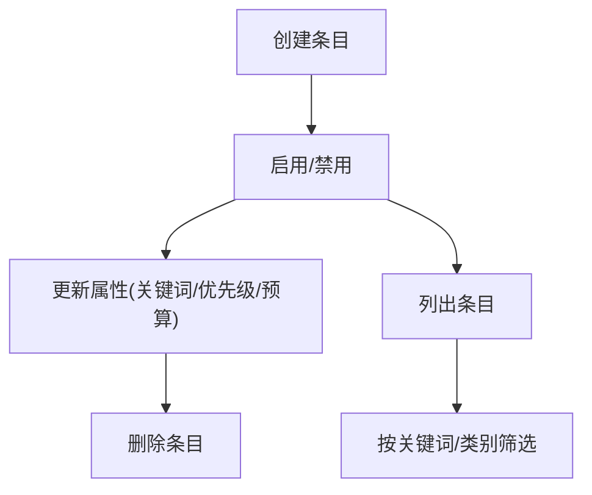
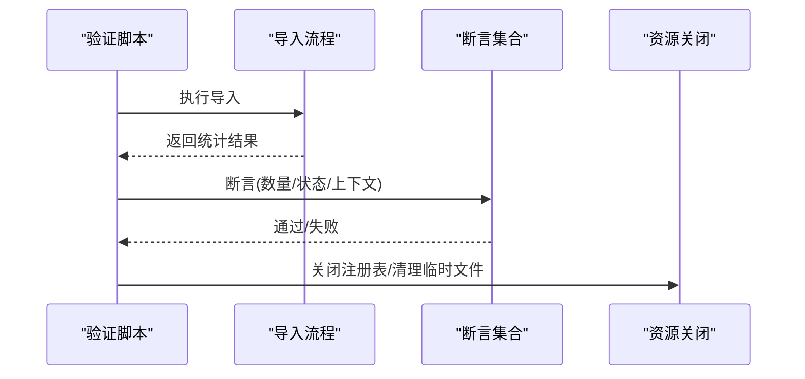
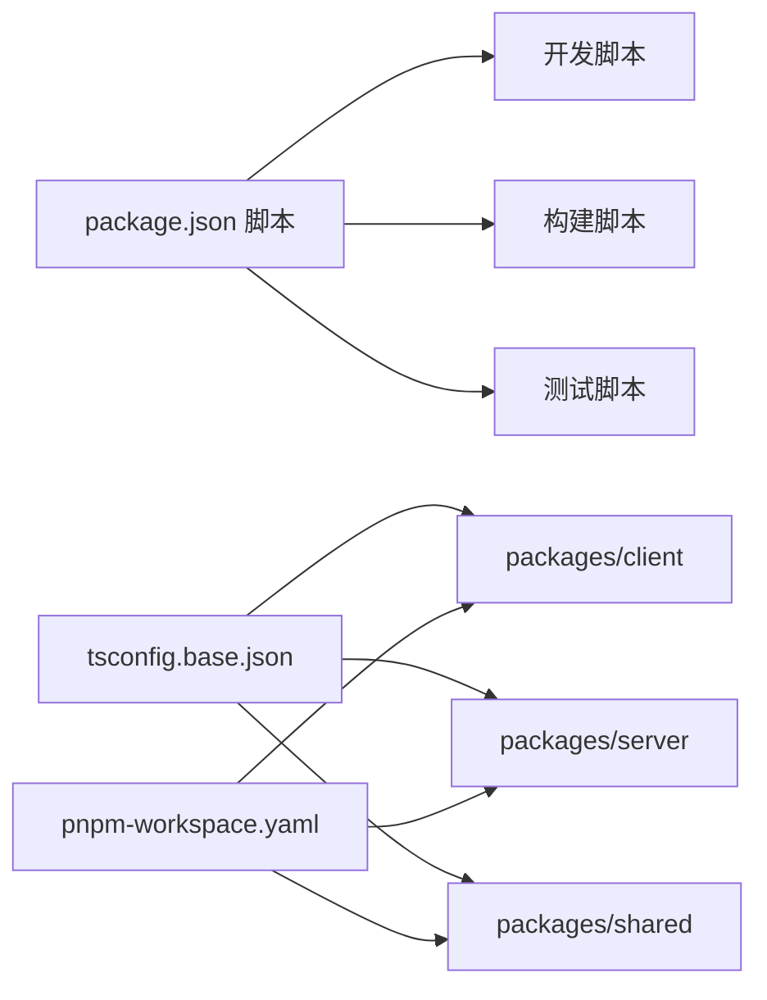

# 插件系统架构

<cite>
**本文引用的文件**
- [package.json](file://package.json)
- [pnpm-workspace.yaml](file://pnpm-workspace.yaml)
- [tsconfig.base.json](file://tsconfig.base.json)
- [docs/_implementation-notes.md](file://docs/_implementation-notes.md)
- [packages/server/tools/verify-sillytavern-import.ts](file://packages/server/tools/verify-sillytavern-import.ts)
- [packages/server/tests/unit/db/repositories/worldbook.test.ts](file://packages/server/tests/unit/db/repositories/worldbook.test.ts)
- [packages/server/tests/unit/db/repositories/prompt-presets.test.ts](file://packages/server/tests/unit/db/repositories/prompt-presets.test.ts)
- [packages/server/tests/unit/ai/tools/genre-section-tools.test.ts](file://packages/server/tests/unit/ai/tools/genre-section-tools.test.ts)
- [samples/sillytavern/Izumi 0503.json](file://samples/sillytavern/Izumi 0503.json)
</cite>

## 目录
1. [引言](#引言)
2. [项目结构](#项目结构)
3. [核心组件](#核心组件)
4. [架构概览](#架构概览)
5. [详细组件分析](#详细组件分析)
6. [依赖分析](#依赖分析)
7. [性能考虑](#性能考虑)
8. [故障排查指南](#故障排查指南)
9. [结论](#结论)
10. [附录](#附录)

## 引言
本文件面向Scribe插件系统的架构设计与实现，基于仓库现有文档与测试用例进行系统化梳理。当前仓库尚未包含完整的插件系统实现代码，但通过工具注册、上下文构建、提示工程与世界书（Worldbook）等模块，可以抽象出插件系统的高层设计理念：以“工具注册表”为核心，结合“上下文构建器”和“依赖注入”的思想，实现可扩展、可组合、可测试的插件能力。

本架构文档将围绕以下主题展开：
- 设计理念与架构模式：依赖注入、插件注册流程与生命周期管理
- 插件接口定义、加载机制与插件间通信
- 安全模型、权限控制与资源隔离策略
- 插件开发流程、模板、开发环境与调试方法
- 热重载机制、版本管理与兼容性检查
- 性能监控、错误处理与日志记录最佳实践

## 项目结构
Scribe采用monorepo结构，通过pnpm workspace管理多包协作；TypeScript基础配置统一收敛至tsconfig.base.json，确保各包共享严格的编译选项与模块解析策略。

图表来源
- [pnpm-workspace.yaml:1-4](file://pnpm-workspace.yaml#L1-L4)
- [package.json:1-21](file://package.json#L1-L21)
- [tsconfig.base.json:1-16](file://tsconfig.base.json#L1-L16)

章节来源
- [pnpm-workspace.yaml:1-4](file://pnpm-workspace.yaml#L1-L4)
- [package.json:1-21](file://package.json#L1-L21)
- [tsconfig.base.json:1-16](file://tsconfig.base.json#L1-L16)

## 核心组件
基于现有测试与实现笔记，Scribe插件系统的核心构件可归纳如下：

- 工具注册表（Tool Registry）
  - 作用：集中管理各类“工具”（如提示构建、世界书检索、题材板块操作等），提供按需注入与动态装配能力
  - 关键证据：实现笔记中明确提到“buildToolRegistry(deps)”模式，以及后续任务在注册表中增加新工具的规划
- 上下文构建器（Context Builder）
  - 作用：将书籍快照、章节上下文、世界书条目、题材板块等数据整合为LLM可消费的消息序列
  - 关键证据：实现笔记多次强调“buildWriteContext”、“buildChapterWriteMessages”等上下文组装流程
- 提示工程与注入（Prompt Engineering & Injection）
  - 作用：通过预设提示、注入位置与深度、触发条件等机制，将插件能力嵌入到写作流程中
  - 关键证据：测试用例展示了“提示预设”和“注入位置/深度/顺序”的结构化定义
- 世界书（Worldbook）
  - 作用：维护可触发的世界观规则与条目，支持递归匹配、优先级与令牌预算控制
  - 关键证据：单元测试覆盖了世界书条目的创建、更新、禁用与删除流程
- 导入验证与兼容性（Import Verification & Compatibility）
  - 作用：通过端到端验证脚本确保外部格式（如SillyTavern）的导入完整性与一致性
  - 关键证据：导入验证脚本对提示块数量、启用状态、世界书条目、正则脚本应用等进行断言

章节来源
- [docs/_implementation-notes.md:377-381](file://docs/_implementation-notes.md#L377-L381)
- [docs/_implementation-notes.md:310-315](file://docs/_implementation-notes.md#L310-L315)
- [packages/server/tests/unit/db/repositories/worldbook.test.ts:38-96](file://packages/server/tests/unit/db/repositories/worldbook.test.ts#L38-L96)
- [packages/server/tests/unit/db/repositories/prompt-presets.test.ts:39-67](file://packages/server/tests/unit/db/repositories/prompt-presets.test.ts#L39-L67)
- [packages/server/tools/verify-sillytavern-import.ts:179-199](file://packages/server/tools/verify-sillytavern-import.ts#L179-L199)

## 架构概览
下图展示Scribe插件系统的核心交互关系：客户端通过HTTP路由发起请求，服务端经由工具注册表与上下文构建器生成消息序列，最终驱动LLM执行具体任务，并将结果写入数据库或返回响应。

图表来源
- [docs/_implementation-notes.md:377-381](file://docs/_implementation-notes.md#L377-L381)
- [docs/_implementation-notes.md:310-315](file://docs/_implementation-notes.md#L310-L315)

## 详细组件分析

### 工具注册表（Tool Registry）
- 设计要点
  - 依赖注入：通过工厂函数按需注入依赖，降低耦合度
  - 动态装配：在运行时根据配置或上下文选择性启用工具
  - 可测试性：每个工具模块导出标准化接口，便于单元测试与集成测试
- 生命周期
  - 初始化：应用启动时构建注册表实例
  - 运行期：按需调用工具，支持错误恢复与重试
  - 关闭：在导入验证脚本中演示了统一关闭资源的模式
- 代码级关系示意

图表来源
- [docs/_implementation-notes.md:377-381](file://docs/_implementation-notes.md#L377-L381)
- [packages/server/tools/verify-sillytavern-import.ts:190-193](file://packages/server/tools/verify-sillytavern-import.ts#L190-L193)

章节来源
- [docs/_implementation-notes.md:377-381](file://docs/_implementation-notes.md#L377-L381)
- [packages/server/tools/verify-sillytavern-import.ts:190-193](file://packages/server/tools/verify-sillytavern-import.ts#L190-L193)

### 上下文构建器（Context Builder）
- 设计要点
  - 数据聚合：从书籍快照、世界书、题材板块、读者问题等来源抽取上下文
  - 结构化注入：通过注入位置、深度与顺序控制提示的组织方式
  - 可扩展性：支持正则脚本、触发条件与递归匹配等高级特性
- 关键流程

图表来源
- [docs/_implementation-notes.md:310-315](file://docs/_implementation-notes.md#L310-L315)
- [docs/_implementation-notes.md:377-381](file://docs/_implementation-notes.md#L377-L381)

章节来源
- [docs/_implementation-notes.md:310-315](file://docs/_implementation-notes.md#L310-L315)
- [docs/_implementation-notes.md:377-381](file://docs/_implementation-notes.md#L377-L381)

### 提示工程与注入（Prompt Engineering & Injection）
- 设计要点
  - 结构化定义：通过标识符、名称、启用状态、注入位置/深度/顺序等字段描述提示块
  - 触发机制：支持基于正则表达式的触发条件与标记位
  - 兼容性：通过导入验证脚本确保不同来源的数据在注入后仍保持一致性
- 流程示意

图表来源
- [packages/server/tests/unit/db/repositories/prompt-presets.test.ts:39-67](file://packages/server/tests/unit/db/repositories/prompt-presets.test.ts#L39-L67)
- [samples/sillytavern/Izumi 0503.json:934-1630](file://samples/sillytavern/Izumi 0503.json#L934-L1630)

章节来源
- [packages/server/tests/unit/db/repositories/prompt-presets.test.ts:39-67](file://packages/server/tests/unit/db/repositories/prompt-presets.test.ts#L39-L67)
- [samples/sillytavern/Izumi 0503.json:934-1630](file://samples/sillytavern/Izumi 0503.json#L934-L1630)

### 世界书（Worldbook）
- 设计要点
  - 条目管理：支持创建、更新、启用/禁用、删除等操作
  - 触发与递归：支持基于关键词的触发、递归匹配与预算控制
  - 元数据：通过元数据字段承载来源与扩展属性
- 流程示意

图表来源
- [packages/server/tests/unit/db/repositories/worldbook.test.ts:38-96](file://packages/server/tests/unit/db/repositories/worldbook.test.ts#L38-L96)

章节来源
- [packages/server/tests/unit/db/repositories/worldbook.test.ts:38-96](file://packages/server/tests/unit/db/repositories/worldbook.test.ts#L38-L96)

### 导入验证（Import Verification）
- 设计要点
  - 端到端验证：覆盖提示块数量、启用状态、世界书条目、正则脚本应用等关键指标
  - 资源清理：统一关闭注册表与临时资源，保证测试环境整洁
- 流程示意

图表来源
- [packages/server/tools/verify-sillytavern-import.ts:179-199](file://packages/server/tools/verify-sillytavern-import.ts#L179-L199)

章节来源
- [packages/server/tools/verify-sillytavern-import.ts:179-199](file://packages/server/tools/verify-sillytavern-import.ts#L179-L199)

## 依赖分析
- 工作区与包管理
  - pnpm workspace统一管理多包，根package.json定义了开发、构建与测试脚本
  - monorepo结构有利于插件系统的模块化与版本协同
- TypeScript配置
  - tsconfig.base.json统一编译目标、模块解析与严格模式，确保跨包一致性
- 测试与验证
  - 单元测试覆盖工具、提示与世界书等关键模块
  - 端到端验证脚本保障外部格式导入的兼容性

图表来源
- [package.json:6-12](file://package.json#L6-L12)
- [tsconfig.base.json:1-16](file://tsconfig.base.json#L1-L16)
- [pnpm-workspace.yaml:1-4](file://pnpm-workspace.yaml#L1-L4)

章节来源
- [package.json:6-12](file://package.json#L6-L12)
- [tsconfig.base.json:1-16](file://tsconfig.base.json#L1-L16)
- [pnpm-workspace.yaml:1-4](file://pnpm-workspace.yaml#L1-L4)

## 性能考虑
- 上下文构建优化
  - 通过快照缓存与工具注册表的按需装配，减少不必要的数据加载与消息拼装
  - 在实现笔记中提出“在单LLM调用周期内复用snapshot”的建议，有助于降低重复IO
- 事务化写入
  - 对审计与摘要的写入建议使用事务包裹，避免孤儿记录与不一致状态
- 令牌预算与回退
  - 通过估计公式与上下文裁剪策略控制成本，结合工具错误恢复提升鲁棒性

章节来源
- [docs/_implementation-notes.md:316-320](file://docs/_implementation-notes.md#L316-L320)
- [docs/_implementation-notes.md:268-272](file://docs/_implementation-notes.md#L268-L272)
- [docs/_implementation-notes.md:321-325](file://docs/_implementation-notes.md#L321-L325)
- [docs/_implementation-notes.md:347-353](file://docs/_implementation-notes.md#L347-L353)

## 故障排查指南
- 工具错误恢复
  - 通过包装工具执行函数实现“工具级错误恢复”，将错误转换为普通工具结果返回给模型，使其进行自我修正
- 日志与错误脱敏
  - 建议在错误事件中分离用户可见消息与内部详情，避免向UI暴露技术细节
- 资源清理
  - 在导入验证脚本中演示了统一关闭注册表与清理临时文件的模式，建议在插件生命周期中复用

章节来源
- [docs/_implementation-notes.md:347-353](file://docs/_implementation-notes.md#L347-L353)
- [docs/_implementation-notes.md:274-278](file://docs/_implementation-notes.md#L274-L278)
- [packages/server/tools/verify-sillytavern-import.ts:190-193](file://packages/server/tools/verify-sillytavern-import.ts#L190-L193)

## 结论
Scribe插件系统以“工具注册表+上下文构建器”为核心，结合严格的依赖注入与模块化设计，在不直接暴露具体实现的前提下提供了高度可扩展的插件能力。通过导入验证与测试用例，系统在功能正确性与兼容性方面建立了坚实基础。后续可在以下方向深化：
- 明确插件接口规范与生命周期钩子
- 引入热重载与版本管理机制
- 完善安全模型与资源隔离策略
- 建立插件开发模板与调试工具链

## 附录
- 开发环境配置
  - 使用pnpm workspace管理多包，确保依赖版本一致
  - TypeScript严格模式与模块解析策略由tsconfig.base.json统一约束
- 插件开发流程（建议）
  - 定义工具接口与工厂函数
  - 在工具注册表中注册并编写单元测试
  - 通过上下文构建器集成到消息序列
  - 使用导入验证脚本进行端到端测试
- 调试方法
  - 利用工具错误恢复与日志分离机制定位问题
  - 在测试中模拟外部格式导入，验证兼容性

章节来源
- [pnpm-workspace.yaml:1-4](file://pnpm-workspace.yaml#L1-L4)
- [tsconfig.base.json:1-16](file://tsconfig.base.json#L1-L16)
- [docs/_implementation-notes.md:347-353](file://docs/_implementation-notes.md#L347-L353)
- [packages/server/tools/verify-sillytavern-import.ts:179-199](file://packages/server/tools/verify-sillytavern-import.ts#L179-L199)