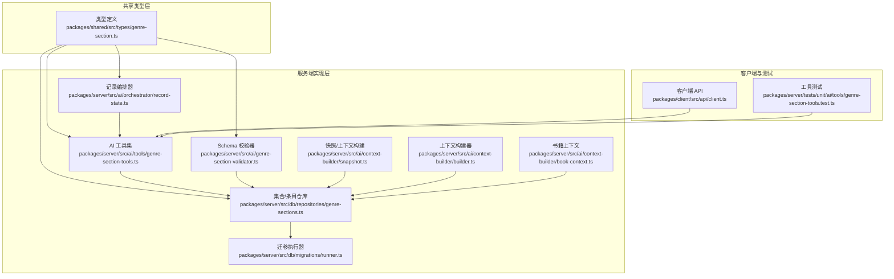
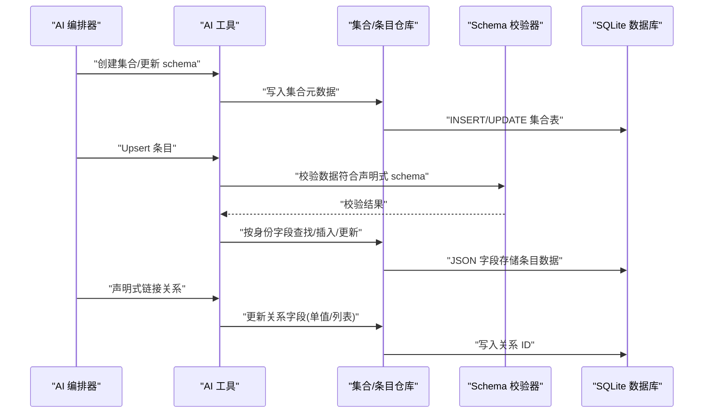
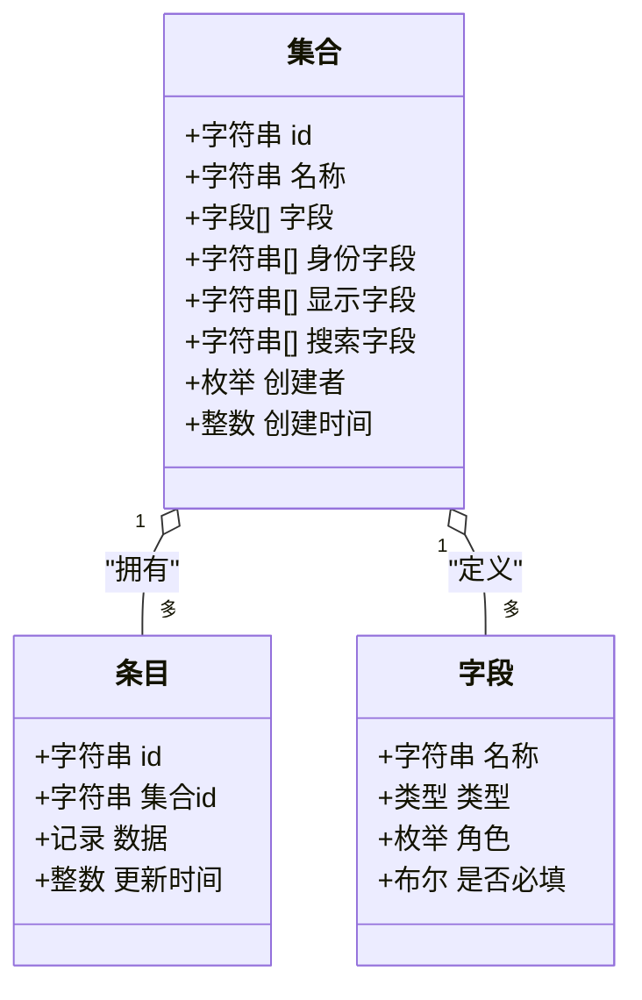
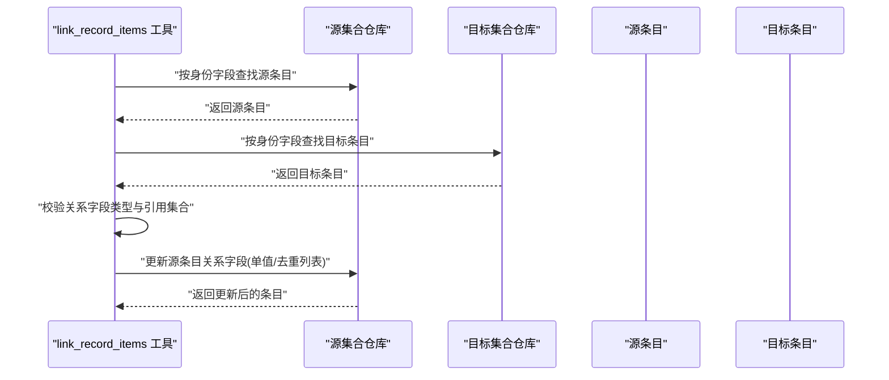
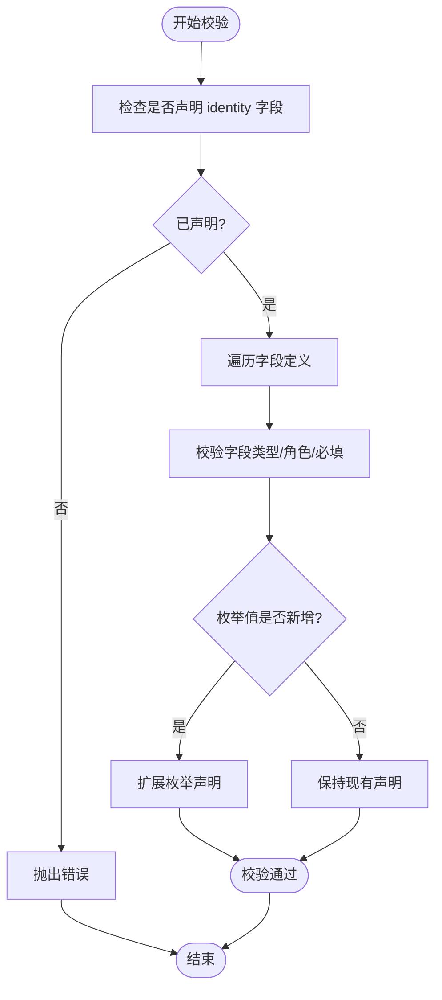
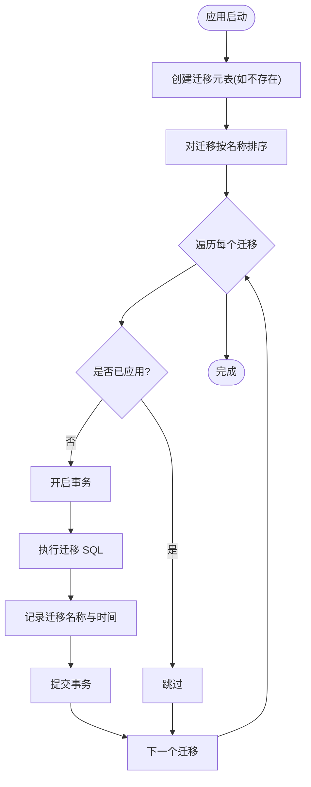
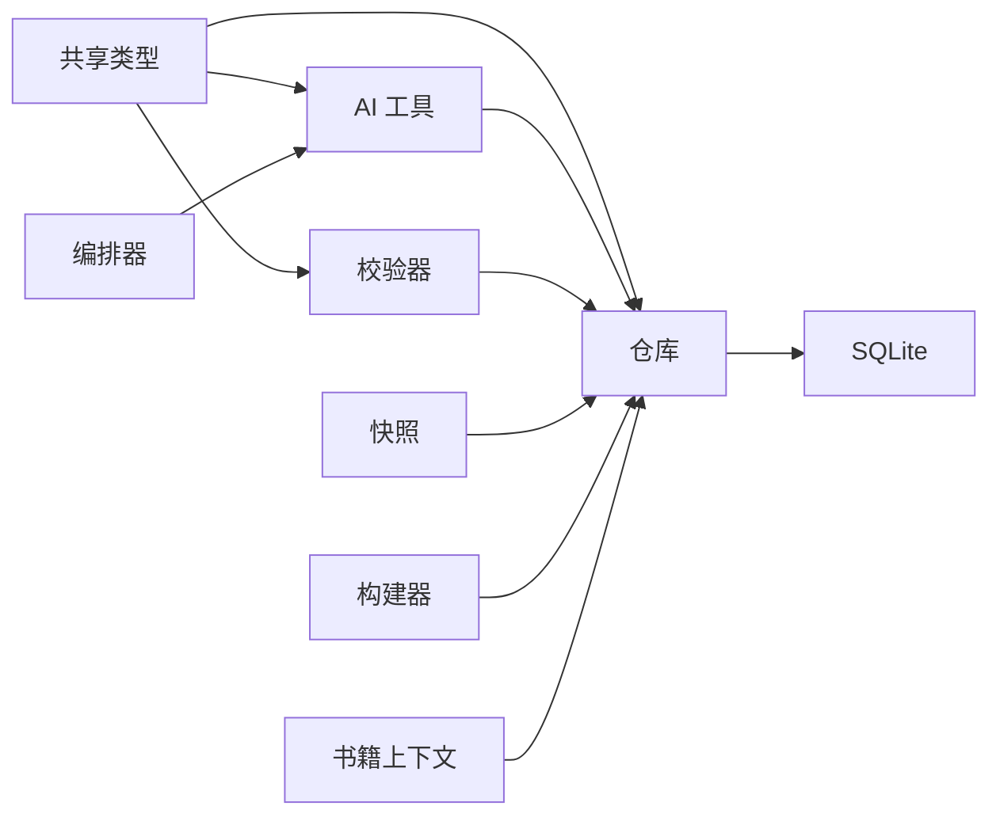

# 数据模型扩展

<cite>
**本文档引用的文件**
- [2026-06-15-generic-record-architecture.md](file://docs/superpowers/plans/2026-06-15-generic-record-architecture.md)
- [genre-section-tools.test.ts](file://packages/server/tests/unit/ai/tools/genre-section-tools.test.ts)
- [runner.ts](file://packages/server/src/db/migrations/runner.ts)
- [genre-section.ts](file://packages/shared/src/types/genre-section.ts)
- [genre-sections.ts](file://packages/server/src/db/repositories/genre-sections.ts)
- [genre-section-validator.ts](file://packages/server/src/ai/genre-section-validator.ts)
- [genre-section-tools.ts](file://packages/server/src/ai/tools/genre-section-tools.ts)
- [record-state.ts](file://packages/server/src/ai/orchestrator/record-state.ts)
- [snapshot.ts](file://packages/server/src/ai/context-builder/snapshot.ts)
- [builder.ts](file://packages/server/src/ai/context-builder/builder.ts)
- [book-context.ts](file://packages/server/src/ai/context-builder/book-context.ts)
- [new-book-onboard.ts](file://packages/server/src/ai/prompts/new-book-onboard.ts)
</cite>

## 目录
1. [简介](#简介)
2. [项目结构](#项目结构)
3. [核心组件](#核心组件)
4. [架构总览](#架构总览)
5. [详细组件分析](#详细组件分析)
6. [依赖分析](#依赖分析)
7. [性能考虑](#性能考虑)
8. [故障排查指南](#故障排查指南)
9. [结论](#结论)
10. [附录](#附录)

## 简介
本文件系统化阐述 Scribe 的“通用记录架构”（Generic Record Architecture）在数据模型层面的设计与实现，重点覆盖以下方面：
- Record 模型的动态字段支持、关系映射与元数据管理
- 如何扩展数据模型以支持新的实体类型（字段定义、约束规则、索引策略）
- 数据迁移机制、版本升级与向后兼容性
- 自定义实体类型的开发指南（schema 设计、查询优化、缓存策略）
- 数据验证规则、业务逻辑集成与事务处理
- 测试方法、性能优化技巧与监控指标

该架构目标是：消除硬编码领域分类（如修炼、法宝、势力等），通过“集合（Section）+ 条目（Item）+ 字段（Field）”的通用模型，让 AI 能从上下文动态创建集合、演进 schema、去重 upsert、声明式建立关系，并通过纯声明式工具完成跨集合链接。

## 项目结构
围绕通用记录架构的关键模块分布如下：
- 类型与契约层（共享包）：定义集合、条目、字段的类型与校验规则
- 服务端实现层（Server）：AI 工具、校验器、仓库、迁移、上下文构建
- 客户端与测试（Client/Tests）：工具链集成、端到端与单元测试

图表来源
- [genre-section.ts:195-220](file://packages/shared/src/types/genre-section.ts#L195-L220)
- [genre-section-tools.ts:1-100](file://packages/server/src/ai/tools/genre-section-tools.ts#L1-L100)
- [genre-section-validator.ts:1-100](file://packages/server/src/ai/genre-section-validator.ts#L1-L100)
- [genre-sections.ts:1-150](file://packages/server/src/db/repositories/genre-sections.ts#L1-L150)
- [runner.ts:1-23](file://packages/server/src/db/migrations/runner.ts#L1-L23)
- [record-state.ts:1-200](file://packages/server/src/ai/orchestrator/record-state.ts#L1-L200)
- [snapshot.ts:1-60](file://packages/server/src/ai/context-builder/snapshot.ts#L1-L60)
- [builder.ts:1-200](file://packages/server/src/ai/context-builder/builder.ts#L1-L200)
- [book-context.ts:1-60](file://packages/server/src/ai/context-builder/book-context.ts#L1-L60)

章节来源
- [2026-06-15-generic-record-architecture.md:13-115](file://docs/superpowers/plans/2026-06-15-generic-record-architecture.md#L13-L115)
- [genre-section.ts:195-220](file://packages/shared/src/types/genre-section.ts#L195-L220)

## 核心组件
- 集合（Section）与条目（Item）：集合描述字段、身份字段、显示字段、搜索字段；条目为集合中的具体记录
- 字段（Field）：包含名称、类型、角色（identity/label/summary/status/relation/tag/evidence 等）、是否必填等
- AI 工具：创建集合、更新 schema、upsert 条目、声明式链接关系
- 校验器：基于声明式 schema 对条目数据进行校验，支持枚举扩展与向后兼容
- 仓库：持久化集合与条目，支持按身份字段查找、更新、删除
- 迁移：版本化数据库结构变更，确保幂等与可回溯
- 上下文构建：将集合与条目纳入写作上下文、快照与召回

章节来源
- [genre-section.ts:195-220](file://packages/shared/src/types/genre-section.ts#L195-L220)
- [genre-section-tools.ts:1-100](file://packages/server/src/ai/tools/genre-section-tools.ts#L1-L100)
- [genre-section-validator.ts:70-100](file://packages/server/src/ai/genre-section-validator.ts#L70-L100)
- [genre-sections.ts:56-121](file://packages/server/src/db/repositories/genre-sections.ts#L56-L121)
- [runner.ts:1-23](file://packages/server/src/db/migrations/runner.ts#L1-L23)
- [record-state.ts:20-60](file://packages/server/src/ai/orchestrator/record-state.ts#L20-L60)

## 架构总览
通用记录架构通过“声明式 schema + 动态字段 + 关系声明 + 去重 upsert + 事务保障”的组合，实现跨领域的可演进数据模型。

图表来源
- [genre-section-tools.ts:438-474](file://packages/server/src/ai/tools/genre-section-tools.ts#L438-L474)
- [genre-sections.ts:56-121](file://packages/server/src/db/repositories/genre-sections.ts#L56-L121)
- [genre-section-validator.ts:70-100](file://packages/server/src/ai/genre-section-validator.ts#L70-L100)

## 详细组件分析

### Record 模型与动态字段支持
- 动态字段：条目数据以 JSON 存储，字段名与值在运行期解析，允许 schema 演进而不破坏既有数据
- 元数据管理：集合表保存字段定义、身份字段、显示字段、搜索字段等声明，读取时零猜测
- 字段角色：通过角色声明统一识别 identity/label/summary/status/relation/tag/evidence 等用途，避免硬编码

图表来源
- [genre-section.ts:195-220](file://packages/shared/src/types/genre-section.ts#L195-L220)

章节来源
- [genre-section.ts:175-220](file://packages/shared/src/types/genre-section.ts#L175-L220)

### 关系映射与声明式链接
- 关系字段：通过字段类型声明引用其他集合（单值或列表），并以 role=relation 表达意图
- 链接工具：按集合声明的身份字段定位源/目标条目，写入关系字段，支持去重（列表关系）
- 无领域语义：本地仅校验声明与引用，不理解关系的实际业务含义

图表来源
- [genre-section-tools.ts:914-950](file://packages/server/src/ai/tools/genre-section-tools.ts#L914-L950)
- [genre-section-tools.test.ts:438-455](file://packages/server/tests/unit/ai/tools/genre-section-tools.test.ts#L438-L455)

章节来源
- [genre-section-tools.ts:914-950](file://packages/server/src/ai/tools/genre-section-tools.ts#L914-L950)
- [genre-section-tools.test.ts:438-455](file://packages/server/tests/unit/ai/tools/genre-section-tools.test.ts#L438-L455)

### 数据验证规则与演进兼容
- 必备角色：schema 必须声明 identity 字段；label 字段用于显示名
- 向后兼容：schema 演进时，多余字段被忽略，旧数据不受影响
- 枚举扩展：AI 写入新枚举值时自动扩展声明（测试覆盖）

图表来源
- [genre-section-validator.ts:34-80](file://packages/server/src/ai/genre-section-validator.ts#L34-L80)
- [genre-section-tools.test.ts:306-328](file://packages/server/tests/unit/ai/tools/genre-section-tools.test.ts#L306-L328)

章节来源
- [genre-section-validator.ts:34-80](file://packages/server/src/ai/genre-section-validator.ts#L34-L80)
- [genre-section-tools.test.ts:306-328](file://packages/server/tests/unit/ai/tools/genre-section-tools.test.ts#L306-L328)

### 数据迁移机制与版本升级
- 迁移表：维护已应用的迁移名称与时间戳，保证幂等
- 应用流程：启动时扫描迁移列表，按名称排序执行未应用的迁移，事务包裹 SQL 与记录日志
- 版本升级：新增迁移文件即纳入升级路径，不影响已有数据

图表来源
- [runner.ts:8-23](file://packages/server/src/db/migrations/runner.ts#L8-L23)

章节来源
- [runner.ts:1-23](file://packages/server/src/db/migrations/runner.ts#L1-L23)

### 开发指南：扩展新的实体类型
- 步骤一：创建集合并声明字段与角色
  - 使用工具创建集合，指定 identityFields/displayFields/searchFields 与字段数组
  - 参考：[集合创建测试:286-304](file://packages/server/tests/unit/ai/tools/genre-section-tools.test.ts#L286-L304)
- 步骤二：演进 schema
  - 通过更新工具增加字段，保持元数据一致性
  - 参考：[schema 更新测试:458-472](file://packages/server/tests/unit/ai/tools/genre-section-tools.test.ts#L458-L472)
- 步骤三：upsert 条目
  - 基于声明式 schema 校验，自动去重与扩展枚举
  - 参考：[upsert 流程:438-474](file://packages/server/src/ai/tools/genre-section-tools.ts#L438-L474)
- 步骤四：声明式链接关系
  - 在源集合中声明 relation 字段，使用工具按 identity 定位并写入
  - 参考：[链接工具:914-950](file://packages/server/src/ai/tools/genre-section-tools.ts#L914-L950)

章节来源
- [genre-section-tools.test.ts:286-304](file://packages/server/tests/unit/ai/tools/genre-section-tools.test.ts#L286-L304)
- [genre-section-tools.test.ts:458-472](file://packages/server/tests/unit/ai/tools/genre-section-tools.test.ts#L458-L472)
- [genre-section-tools.ts:438-474](file://packages/server/src/ai/tools/genre-section-tools.ts#L438-L474)
- [genre-section-tools.ts:914-950](file://packages/server/src/ai/tools/genre-section-tools.ts#L914-L950)

### 查询优化与缓存策略
- 查询优化建议
  - 为集合表与条目表建立复合索引：(name)、(section_id, 身份字段)、(updated_at)
  - 按需投影：仅选择需要的字段，避免大 JSON 全量读取
  - 分页与游标：对列表接口采用游标分页，减少内存占用
- 缓存策略
  - 集合元数据：短期缓存（如 1 分钟），变更时失效
  - 常用条目：基于身份键的 LRU 缓存，结合 TTL
  - 关系字段：对热点集合的关联查询结果做短期缓存

[本节为通用实践建议，无需特定文件来源]

### 业务逻辑集成与事务处理
- 事务边界
  - 集合删除：先删除条目，再删除集合，事务包裹保证一致性
  - upsert：按身份字段查找，存在则合并更新，不存在则插入，事务包裹
  - 链接关系：原子更新源条目的关系字段，列表关系去重
- 业务约束
  - 身份唯一：由声明式 identity 字段保证
  - 关系引用：严格校验字段类型与目标集合
  - 枚举扩展：AI 写入新值时自动扩展声明

章节来源
- [genre-sections.ts:115-121](file://packages/server/src/db/repositories/genre-sections.ts#L115-L121)
- [genre-section-tools.ts:438-474](file://packages/server/src/ai/tools/genre-section-tools.ts#L438-L474)

### 测试方法与质量保障
- 单元测试
  - 集合创建/更新/删除：验证仓库行为与 SQL 执行
  - upsert 与去重：验证 identity 查找与数据合并
  - 关系链接：验证声明式链接与引用校验
- 端到端测试
  - 通过工具链执行完整流程，覆盖真实场景
- 参考测试用例
  - [集合创建与 upsert:286-304](file://packages/server/tests/unit/ai/tools/genre-section-tools.test.ts#L286-L304)
  - [枚举扩展:306-328](file://packages/server/tests/unit/ai/tools/genre-section-tools.test.ts#L306-L328)
  - [关系链接:438-455](file://packages/server/tests/unit/ai/tools/genre-section-tools.test.ts#L438-L455)
  - [schema 更新:458-472](file://packages/server/tests/unit/ai/tools/genre-section-tools.test.ts#L458-L472)

章节来源
- [genre-section-tools.test.ts:286-304](file://packages/server/tests/unit/ai/tools/genre-section-tools.test.ts#L286-L304)
- [genre-section-tools.test.ts:306-328](file://packages/server/tests/unit/ai/tools/genre-section-tools.test.ts#L306-L328)
- [genre-section-tools.test.ts:438-455](file://packages/server/tests/unit/ai/tools/genre-section-tools.test.ts#L438-L455)
- [genre-section-tools.test.ts:458-472](file://packages/server/tests/unit/ai/tools/genre-section-tools.test.ts#L458-L472)

## 依赖分析
- 组件耦合
  - AI 工具依赖共享类型与仓库；仓库依赖数据库；校验器独立但与工具配合
  - 上下文构建器依赖仓库读取集合与条目，形成闭环
- 外部依赖
  - SQLite 作为持久化存储，迁移器负责结构演进
  - Zod 类型系统用于声明式 schema 校验

图表来源
- [genre-section.ts:195-220](file://packages/shared/src/types/genre-section.ts#L195-L220)
- [genre-section-tools.ts:1-100](file://packages/server/src/ai/tools/genre-section-tools.ts#L1-L100)
- [genre-section-validator.ts:1-100](file://packages/server/src/ai/genre-section-validator.ts#L1-L100)
- [genre-sections.ts:1-150](file://packages/server/src/db/repositories/genre-sections.ts#L1-L150)
- [record-state.ts:1-200](file://packages/server/src/ai/orchestrator/record-state.ts#L1-L200)
- [snapshot.ts:1-60](file://packages/server/src/ai/context-builder/snapshot.ts#L1-L60)
- [builder.ts:1-200](file://packages/server/src/ai/context-builder/builder.ts#L1-L200)
- [book-context.ts:1-60](file://packages/server/src/ai/context-builder/book-context.ts#L1-L60)

## 性能考虑
- 存储层
  - JSON 字段适合动态 schema，但查询条件受限；建议在高频查询字段上建立索引
  - 大 JSON 文本读写成本高，建议按需加载与懒解析
- 事务与并发
  - 批量 upsert 与批量链接应使用事务，减少锁竞争
  - 并发冲突时采用乐观锁或重试策略
- 缓存与预热
  - 热点集合与常用条目启用缓存，定期预热
  - 缓存失效策略与 TTL 结合，避免脏读
- 查询优化
  - 列表接口分页与游标，避免一次性加载全部
  - 使用投影与条件过滤，减少网络与 CPU 开销

[本节提供通用指导，无需特定文件来源]

## 故障排查指南
- 常见问题
  - 身份字段缺失：创建集合时报错，需补充 identityFields
  - 关系字段类型不匹配：链接时报错，需确认字段类型与目标集合一致
  - 重复 upsert：工具会自动去重，若出现异常需检查 identity 解析
- 排查步骤
  - 检查集合元数据：确认字段角色、身份字段、显示字段声明
  - 校验条目数据：使用校验器逐项核对
  - 回滚迁移：必要时回退到上一个稳定迁移
- 监控指标
  - 数据库慢查询与锁等待
  - upsert/链接成功率与耗时
  - 缓存命中率与失效频率
  - 迁移应用耗时与失败次数

章节来源
- [genre-section-validator.ts:34-80](file://packages/server/src/ai/genre-section-validator.ts#L34-L80)
- [genre-section-tools.ts:914-950](file://packages/server/src/ai/tools/genre-section-tools.ts#L914-L950)
- [runner.ts:1-23](file://packages/server/src/db/migrations/runner.ts#L1-L23)

## 结论
通用记录架构通过声明式 schema、动态字段与关系声明，实现了跨领域的可演进数据模型。配合严格的校验、事务与迁移机制，既能满足 AI 驱动的灵活创作需求，又能保证数据一致性与可维护性。建议在生产环境中持续完善测试矩阵、监控体系与缓存策略，以支撑大规模场景下的稳定性与性能。

[本节为总结性内容，无需特定文件来源]

## 附录
- Prompt 指南：新书初始化时，提示 AI 仅使用通用角色字段（identity/label/summary/status/relation/tag/evidence），并在后续发现字段不足时使用更新工具扩展集合
- 上下文集成：将集合与条目纳入写作上下文、快照与召回，提升 AI 对全局信息的利用效率

章节来源
- [new-book-onboard.ts:26-32](file://packages/server/src/ai/prompts/new-book-onboard.ts#L26-L32)
- [record-state.ts:138-173](file://packages/server/src/ai/orchestrator/record-state.ts#L138-L173)
- [snapshot.ts:31-48](file://packages/server/src/ai/context-builder/snapshot.ts#L31-L48)
- [builder.ts:88-191](file://packages/server/src/ai/context-builder/builder.ts#L88-L191)
- [book-context.ts:36-7](file://packages/server/src/ai/context-builder/book-context.ts#L36-L7)