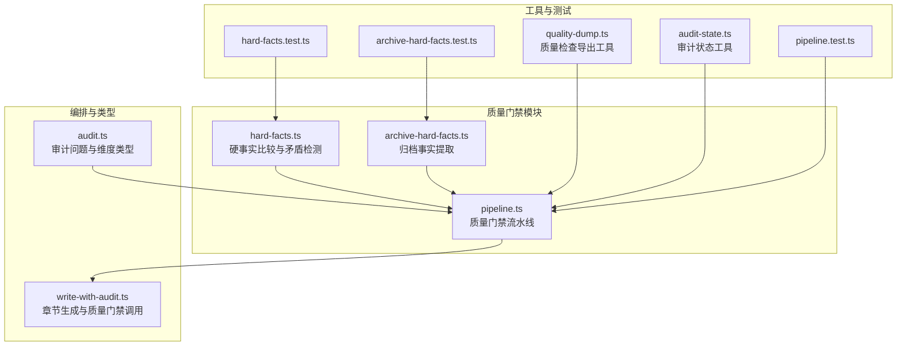
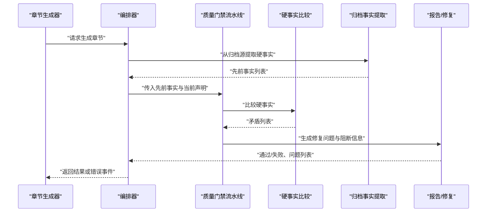
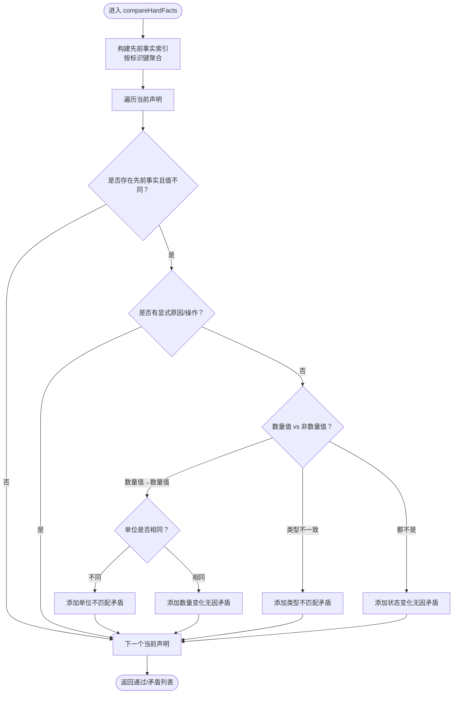
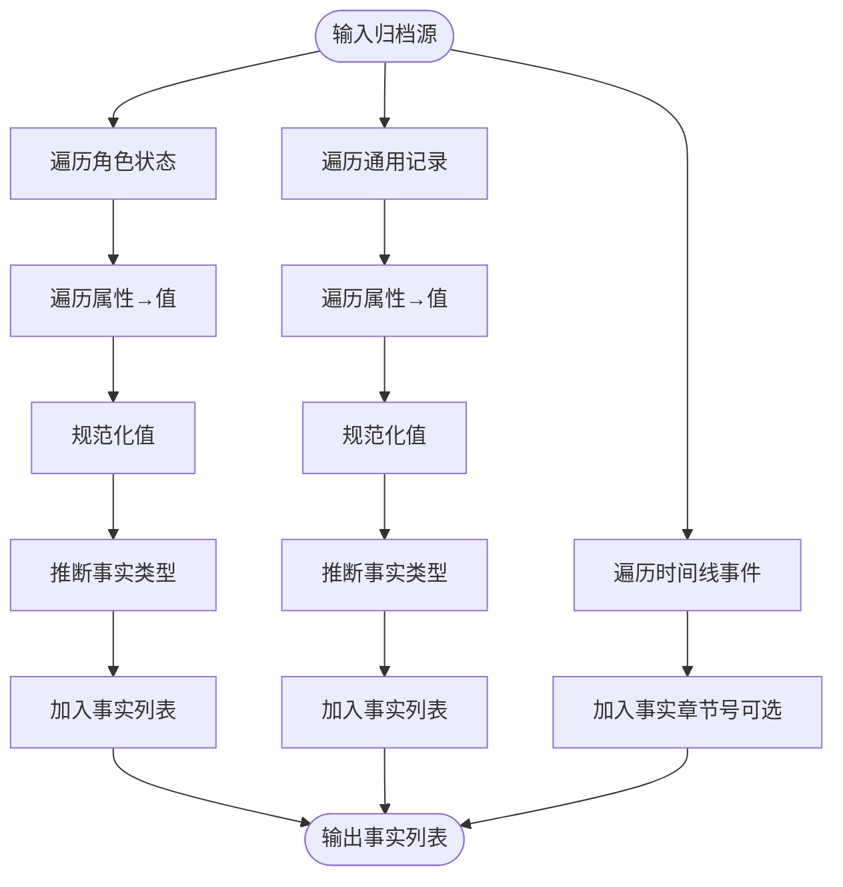
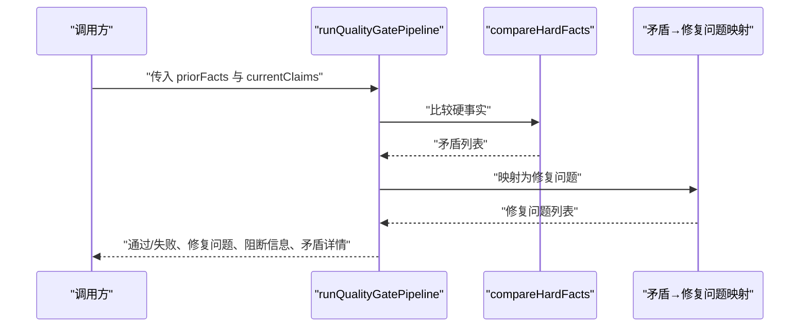
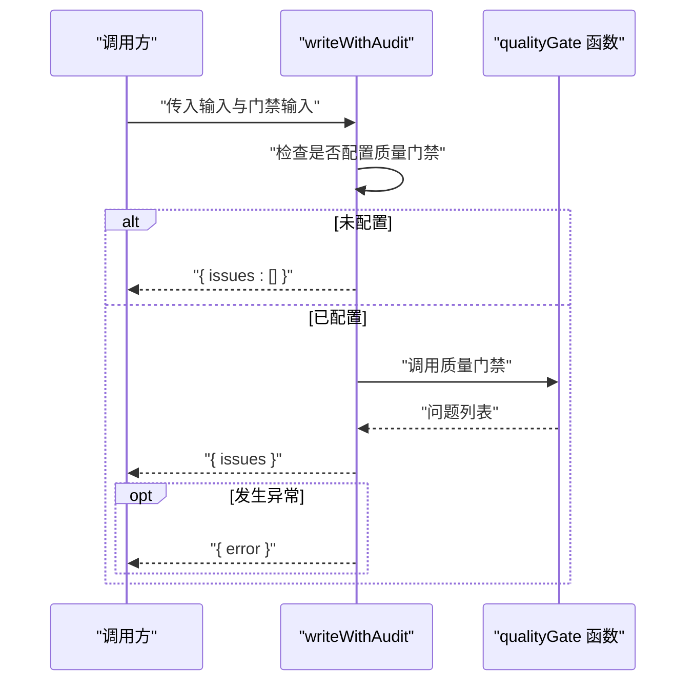
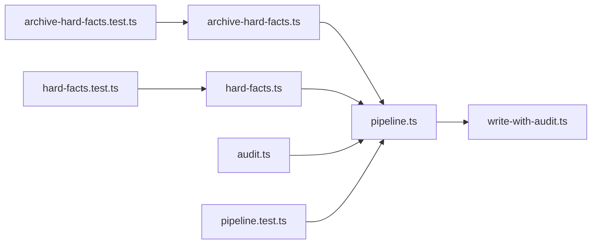

# 质量检查器扩展

<cite>
**本文引用的文件**
- [packages/server/src/ai/quality-gates/hard-facts.ts](file://packages/server/src/ai/quality-gates/hard-facts.ts)
- [packages/server/src/ai/quality-gates/archive-hard-facts.ts](file://packages/server/src/ai/quality-gates/archive-hard-facts.ts)
- [packages/server/src/ai/quality-gates/pipeline.ts](file://packages/server/src/ai/quality-gates/pipeline.ts)
- [packages/server/src/ai/orchestrator/write-with-audit.ts](file://packages/server/src/ai/orchestrator/write-with-audit.ts)
- [packages/shared/src/types/audit.ts](file://packages/shared/src/types/audit.ts)
- [packages/server/tests/unit/ai/quality-gates/hard-facts.test.ts](file://packages/server/tests/unit/ai/quality-gates/hard-facts.test.ts)
- [packages/server/tests/unit/ai/quality-gates/archive-hard-facts.test.ts](file://packages/server/tests/unit/ai/quality-gates/archive-hard-facts.test.ts)
- [packages/server/tests/unit/ai/quality-gates/pipeline.test.ts](file://packages/server/tests/unit/ai/quality-gates/pipeline.test.ts)
- [packages/server/tools/quality-dump.ts](file://packages/server/tools/quality-dump.ts)
- [packages/server/tools/audit-state.ts](file://packages/server/tools/audit-state.ts)
- [docs/superpowers/plans/2026-06-16-sillytavern-quality-continuity.md](file://docs/superpowers/plans/2026-06-16-sillytavern-quality-continuity.md)
</cite>

## 目录
1. [简介](#简介)
2. [项目结构](#项目结构)
3. [核心组件](#核心组件)
4. [架构总览](#架构总览)
5. [详细组件分析](#详细组件分析)
6. [依赖分析](#依赖分析)
7. [性能考虑](#性能考虑)
8. [故障排查指南](#故障排查指南)
9. [结论](#结论)
10. [附录](#附录)

## 简介
本文件面向希望扩展与定制Scribe质量检查器系统的开发者，系统性阐述质量门禁（Quality Gates）的设计原理、扩展机制与最佳实践。内容覆盖：
- 检查器接口定义与执行流程
- 结果处理与修复建议生成
- 自定义检查器开发方法（硬事实检查、连续性验证、风格一致性检查）
- 性能优化（并行执行、缓存、增量检查）
- 结果可视化、报告生成与修复建议
- 测试方法、覆盖率统计与回归测试
- 调试工具与监控指标

## 项目结构
质量检查器相关代码主要位于服务端包的AI子模块中，围绕“硬事实检查”“归档事实提取”“质量门禁流水线”展开，并通过编排器与审计类型进行集成。

图表来源
- [packages/server/src/ai/quality-gates/hard-facts.ts:1-159](file://packages/server/src/ai/quality-gates/hard-facts.ts#L1-L159)
- [packages/server/src/ai/quality-gates/archive-hard-facts.ts:1-92](file://packages/server/src/ai/quality-gates/archive-hard-facts.ts#L1-L92)
- [packages/server/src/ai/quality-gates/pipeline.ts:1-34](file://packages/server/src/ai/quality-gates/pipeline.ts#L1-L34)
- [packages/server/src/ai/orchestrator/write-with-audit.ts:292-316](file://packages/server/src/ai/orchestrator/write-with-audit.ts#L292-L316)
- [packages/shared/src/types/audit.ts:1-67](file://packages/shared/src/types/audit.ts#L1-L67)
- [packages/server/tools/quality-dump.ts](file://packages/server/tools/quality-dump.ts)
- [packages/server/tools/audit-state.ts](file://packages/server/tools/audit-state.ts)
- [packages/server/tests/unit/ai/quality-gates/hard-facts.test.ts](file://packages/server/tests/unit/ai/quality-gates/hard-facts.test.ts)
- [packages/server/tests/unit/ai/quality-gates/archive-hard-facts.test.ts](file://packages/server/tests/unit/ai/quality-gates/archive-hard-facts.test.ts)
- [packages/server/tests/unit/ai/quality-gates/pipeline.test.ts](file://packages/server/tests/unit/ai/quality-gates/pipeline.test.ts)

章节来源
- [packages/server/src/ai/quality-gates/hard-facts.ts:1-159](file://packages/server/src/ai/quality-gates/hard-facts.ts#L1-L159)
- [packages/server/src/ai/quality-gates/archive-hard-facts.ts:1-92](file://packages/server/src/ai/quality-gates/archive-hard-facts.ts#L1-L92)
- [packages/server/src/ai/quality-gates/pipeline.ts:1-34](file://packages/server/src/ai/quality-gates/pipeline.ts#L1-L34)
- [packages/server/src/ai/orchestrator/write-with-audit.ts:292-316](file://packages/server/src/ai/orchestrator/write-with-audit.ts#L292-L316)
- [packages/shared/src/types/audit.ts:1-67](file://packages/shared/src/types/audit.ts#L1-L67)

## 核心组件
- 硬事实检查器（Hard Fact Gate）
  - 输入：先前事实集合与当前声明集合
  - 算法：基于实体-属性-作用域标识键对比，检测数值单位不一致、数量变化无因、类型不匹配、状态变化无因等矛盾
  - 输出：是否通过、矛盾列表
- 归档事实提取器（Archive Hard Facts Extractor）
  - 输入：角色状态、时间线事件、通用记录等归档源
  - 算法：类型推断与值规范化，生成标准化硬事实声明
  - 输出：标准化硬事实列表
- 质量门禁流水线（Quality Gate Pipeline）
  - 输入：先前事实、当前声明
  - 处理：调用硬事实比较，转换为修复问题，汇总阻断项
  - 输出：通过/失败、修复问题、阻断信息、矛盾详情
- 编排器集成（Write With Audit）
  - 将质量门禁作为可选步骤接入章节生成流程，捕获异常并返回错误事件
- 审计类型（Audit Types）
  - 规范化审计问题结构（维度、严重性、分数、摘录、备注），支撑报告与修复建议

章节来源
- [packages/server/src/ai/quality-gates/hard-facts.ts:50-159](file://packages/server/src/ai/quality-gates/hard-facts.ts#L50-L159)
- [packages/server/src/ai/quality-gates/archive-hard-facts.ts:39-92](file://packages/server/src/ai/quality-gates/archive-hard-facts.ts#L39-L92)
- [packages/server/src/ai/quality-gates/pipeline.ts:9-34](file://packages/server/src/ai/quality-gates/pipeline.ts#L9-L34)
- [packages/server/src/ai/orchestrator/write-with-audit.ts:292-316](file://packages/server/src/ai/orchestrator/write-with-audit.ts#L292-L316)
- [packages/shared/src/types/audit.ts:4-21](file://packages/shared/src/types/audit.ts#L4-L21)

## 架构总览
质量门禁系统以“归档事实提取 → 硬事实比较 → 修复问题映射 → 门禁结果”的流水线为核心，贯穿章节生成与审计环节。

图表来源
- [packages/server/src/ai/quality-gates/pipeline.ts:21-33](file://packages/server/src/ai/quality-gates/pipeline.ts#L21-L33)
- [packages/server/src/ai/quality-gates/hard-facts.ts:88-143](file://packages/server/src/ai/quality-gates/hard-facts.ts#L88-L143)
- [packages/server/src/ai/quality-gates/archive-hard-facts.ts:39-92](file://packages/server/src/ai/quality-gates/archive-hard-facts.ts#L39-L92)
- [packages/server/src/ai/orchestrator/write-with-audit.ts:292-316](file://packages/server/src/ai/orchestrator/write-with-audit.ts#L292-L316)

## 详细组件分析

### 硬事实检查器（Hard Fact Gate）
- 数据模型
  - 硬事实值：字符串、数字、布尔、空、带数量与单位的对象
  - 硬事实类型：状态、数量、地点、所有权、关系、截止/冷却、伤害、任务
  - 矛盾种类：数量变化无因、状态变化无因、单位不匹配、类型不匹配
- 关键算法
  - 标识键：作用域::实体::属性（小写+去空白）
  - 数值比较：数量值需同时比较数量与单位；其他值比较规范化字符串
  - 因果判断：若声明包含原因或操作，则跳过矛盾
- 结果映射
  - 将矛盾转换为修复问题，统一维度为“连续性”，严重性为“严重”

图表来源
- [packages/server/src/ai/quality-gates/hard-facts.ts:88-143](file://packages/server/src/ai/quality-gates/hard-facts.ts#L88-L143)

章节来源
- [packages/server/src/ai/quality-gates/hard-facts.ts:1-159](file://packages/server/src/ai/quality-gates/hard-facts.ts#L1-L159)

### 归档事实提取器（Archive Hard Facts Extractor）
- 输入来源：角色状态、时间线事件、通用记录
- 类型推断：根据属性名关键词推断事实类型（如“location/ownership/deadline/injury/relationship/state”）
- 值规范化：数组→逗号连接；对象→JSON串；非法值丢弃
- 输出：标准化硬事实声明（实体、属性、值、类型、作用域、证据、置信度）

图表来源
- [packages/server/src/ai/quality-gates/archive-hard-facts.ts:39-92](file://packages/server/src/ai/quality-gates/archive-hard-facts.ts#L39-L92)

章节来源
- [packages/server/src/ai/quality-gates/archive-hard-facts.ts:1-92](file://packages/server/src/ai/quality-gates/archive-hard-facts.ts#L1-L92)

### 质量门禁流水线（Quality Gate Pipeline）
- 输入：先前事实、当前声明
- 处理：调用硬事实比较，将矛盾映射为修复问题与阻断信息
- 输出：通过/失败、修复问题、阻断信息、矛盾详情

图表来源
- [packages/server/src/ai/quality-gates/pipeline.ts:21-33](file://packages/server/src/ai/quality-gates/pipeline.ts#L21-L33)
- [packages/server/src/ai/quality-gates/hard-facts.ts:145-159](file://packages/server/src/ai/quality-gates/hard-facts.ts#L145-L159)

章节来源
- [packages/server/src/ai/quality-gates/pipeline.ts:1-34](file://packages/server/src/ai/quality-gates/pipeline.ts#L1-L34)

### 编排器集成（Write With Audit）
- 入口参数：章节号、章节内容、阶段（草稿/修复）、审计裁决
- 执行逻辑：若未配置质量门禁则直接返回空问题；否则调用门禁函数，捕获异常并返回错误事件
- 错误事件：包含错误类别与消息，便于上层处理

图表来源
- [packages/server/src/ai/orchestrator/write-with-audit.ts:292-316](file://packages/server/src/ai/orchestrator/write-with-audit.ts#L292-L316)

章节来源
- [packages/server/src/ai/orchestrator/write-with-audit.ts:292-316](file://packages/server/src/ai/orchestrator/write-with-audit.ts#L292-L316)

### 审计类型与报告结构
- 审计问题：维度、严重性、可选分数、可选摘录、必填备注
- 章节审计：章节号、裁决、问题列表、审计模型、审计时间戳
- LLM输出格式：限定维度枚举、含分数与摘要对象，落盘时拆分为章节审计与章节摘要

章节来源
- [packages/shared/src/types/audit.ts:4-67](file://packages/shared/src/types/audit.ts#L4-L67)

## 依赖分析
- 组件耦合
  - pipeline 依赖 hard-facts 的比较与映射能力
  - archive-hard-facts 为 pipeline 提供先前事实输入
  - orchestrator 在章节生成流程中调用 pipeline 或自定义质量门禁
  - audit 类型为报告与修复建议提供结构化约束
- 外部依赖
  - 测试框架（Vitest）用于单元与集成测试
  - 工具脚本（quality-dump、audit-state）辅助调试与状态观测

图表来源
- [packages/server/src/ai/quality-gates/pipeline.ts:1-34](file://packages/server/src/ai/quality-gates/pipeline.ts#L1-L34)
- [packages/server/src/ai/quality-gates/hard-facts.ts:1-159](file://packages/server/src/ai/quality-gates/hard-facts.ts#L1-L159)
- [packages/server/src/ai/quality-gates/archive-hard-facts.ts:1-92](file://packages/server/src/ai/quality-gates/archive-hard-facts.ts#L1-L92)
- [packages/server/src/ai/orchestrator/write-with-audit.ts:292-316](file://packages/server/src/ai/orchestrator/write-with-audit.ts#L292-L316)
- [packages/shared/src/types/audit.ts:1-67](file://packages/shared/src/types/audit.ts#L1-L67)
- [packages/server/tests/unit/ai/quality-gates/hard-facts.test.ts](file://packages/server/tests/unit/ai/quality-gates/hard-facts.test.ts)
- [packages/server/tests/unit/ai/quality-gates/archive-hard-facts.test.ts](file://packages/server/tests/unit/ai/quality-gates/archive-hard-facts.test.ts)
- [packages/server/tests/unit/ai/quality-gates/pipeline.test.ts](file://packages/server/tests/unit/ai/quality-gates/pipeline.test.ts)

章节来源
- [packages/server/src/ai/quality-gates/pipeline.ts:1-34](file://packages/server/src/ai/quality-gates/pipeline.ts#L1-L34)
- [packages/server/src/ai/quality-gates/hard-facts.ts:1-159](file://packages/server/src/ai/quality-gates/hard-facts.ts#L1-L159)
- [packages/server/src/ai/quality-gates/archive-hard-facts.ts:1-92](file://packages/server/src/ai/quality-gates/archive-hard-facts.ts#L1-L92)
- [packages/server/src/ai/orchestrator/write-with-audit.ts:292-316](file://packages/server/src/ai/orchestrator/write-with-audit.ts#L292-L316)
- [packages/shared/src/types/audit.ts:1-67](file://packages/shared/src/types/audit.ts#L1-L67)

## 性能考虑
- 并行执行
  - 将多个独立检查器并行化，注意避免共享状态竞争
  - 对大体量归档源的提取与比较分批处理，降低峰值内存占用
- 缓存策略
  - 以“标识键→先前事实”建立只读缓存，减少重复扫描
  - 对规范化值与单位比较结果进行短期缓存，加速后续比较
- 增量检查
  - 仅对新增或变更的章节声明参与比较，忽略已确认一致的事实
  - 利用章节号与作用域过滤，缩小比较范围
- I/O与序列化
  - 使用流式处理与批量写入，减少磁盘压力
  - 对LLM输出与报告进行压缩存储，必要时延迟序列化

## 故障排查指南
- 常见问题定位
  - 单元测试：通过测试用例快速定位比较逻辑与映射问题
  - 工具脚本：使用质量检查导出与审计状态工具输出中间状态
- 错误事件
  - 编排器在质量门禁失败时返回错误事件，包含错误类别与消息，便于上层告警与重试
- 可视化与报告
  - 审计类型规范了问题结构，便于前端渲染与报告生成
  - 修复建议来自矛盾映射，包含前后证据与修改建议

章节来源
- [packages/server/src/ai/orchestrator/write-with-audit.ts:303-315](file://packages/server/src/ai/orchestrator/write-with-audit.ts#L303-L315)
- [packages/server/tools/quality-dump.ts](file://packages/server/tools/quality-dump.ts)
- [packages/server/tools/audit-state.ts](file://packages/server/tools/audit-state.ts)
- [packages/shared/src/types/audit.ts:4-21](file://packages/shared/src/types/audit.ts#L4-L21)

## 结论
Scribe的质量门禁系统以“硬事实检查”为核心，结合“归档事实提取”与“流水线编排”，形成可扩展、可观测、可修复的质量控制闭环。通过标准化的数据模型与严格的测试体系，开发者可以安全地扩展新的检查器类型，并在保持性能与稳定性的同时提升写作质量与连续性保障。

## 附录

### 开发自定义质量检查器指南
- 接口约定
  - 输入：先前事实集合、当前声明集合
  - 输出：通过/失败、矛盾列表、修复问题、阻断信息
- 规则定义
  - 明确实体-属性-作用域标识键与比较策略
  - 设定因果条件与阈值（如单位、类型、数量差异）
- 算法实现
  - 使用规范化与类型推断确保输入一致性
  - 采用映射函数将矛盾转化为修复问题
- 阈值配置
  - 支持外部配置文件或运行时参数调整阈值
  - 为不同场景（草稿/修复）提供差异化阈值

### 不同类型检查器的开发方法
- 硬事实检查
  - 基于实体-属性-作用域标识键与值比较
  - 强制因果链：无因变化即为矛盾
- 连续性验证
  - 基于上下文注入的“硬连续性约束”块
  - 对计时器、资源、契约等关键状态进行强约束
- 风格一致性检查
  - 基于正则表达式与关键词检测，识别元输出泄漏与缺失必需段落
  - 与写作与修复提示协同，确保风格一致性

### 检查器测试方法
- 单元测试
  - 覆盖边界条件（空值、单位不一致、类型不匹配、因果存在/不存在）
  - 使用测试夹具模拟先前事实与当前声明
- 集成测试
  - 在流水线中集成真实归档源，验证端到端行为
- 回归测试
  - 保持历史用例稳定，防止回归
- 覆盖率统计
  - 使用测试框架内置覆盖率工具，关注关键分支与路径

章节来源
- [packages/server/tests/unit/ai/quality-gates/hard-facts.test.ts](file://packages/server/tests/unit/ai/quality-gates/hard-facts.test.ts)
- [packages/server/tests/unit/ai/quality-gates/archive-hard-facts.test.ts](file://packages/server/tests/unit/ai/quality-gates/archive-hard-facts.test.ts)
- [packages/server/tests/unit/ai/quality-gates/pipeline.test.ts](file://packages/server/tests/unit/ai/quality-gates/pipeline.test.ts)

### 调试工具与监控指标
- 调试工具
  - 质量检查导出：导出中间状态与矛盾详情
  - 审计状态：观测审计过程中的关键变量与决策点
- 监控指标
  - 门禁通过率、平均处理时延、并发请求数
  - 矛盾分布（单位不匹配、数量变化无因、类型不匹配、状态变化无因）
  - 修复问题数量与严重性分布

章节来源
- [packages/server/tools/quality-dump.ts](file://packages/server/tools/quality-dump.ts)
- [packages/server/tools/audit-state.ts](file://packages/server/tools/audit-state.ts)