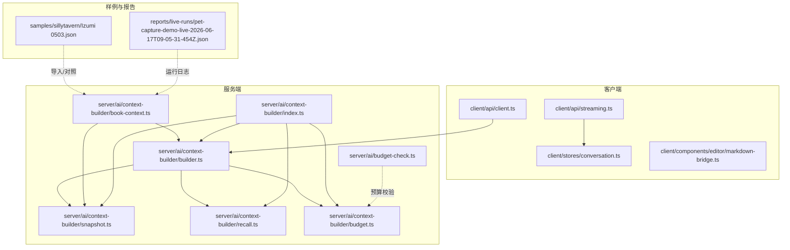
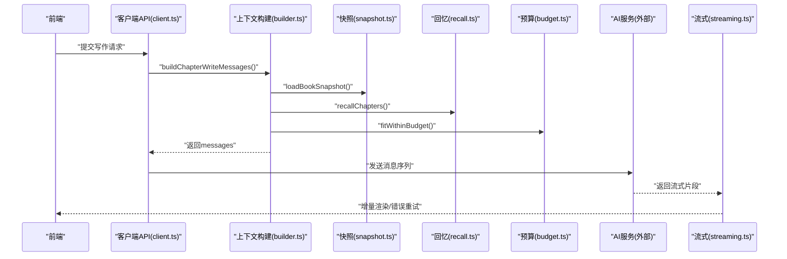
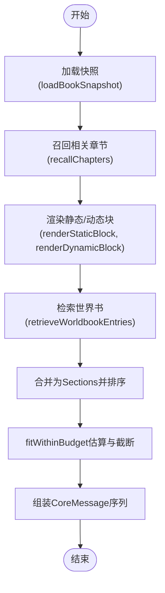
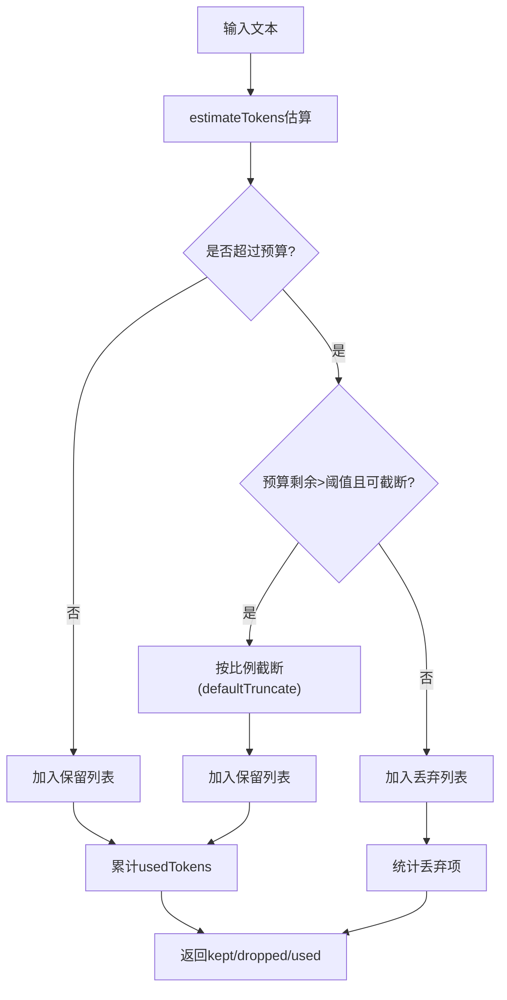
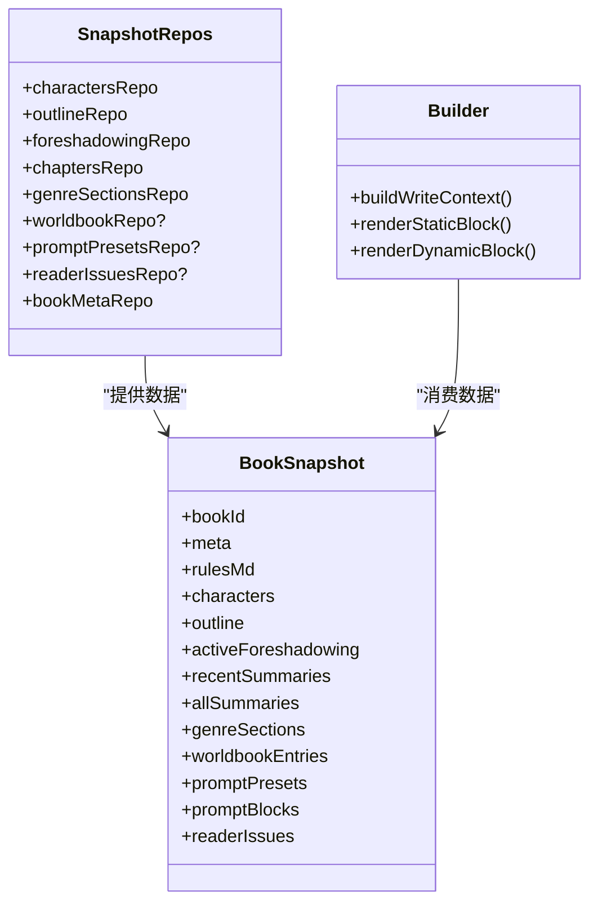
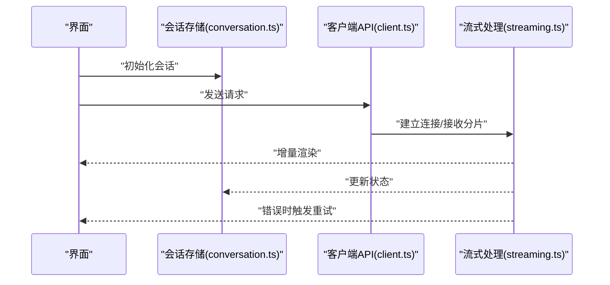
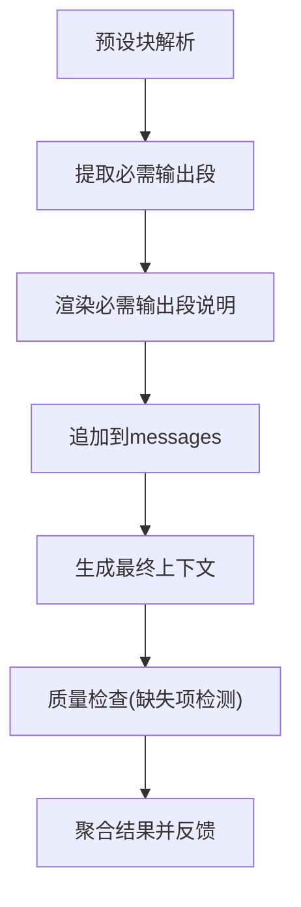
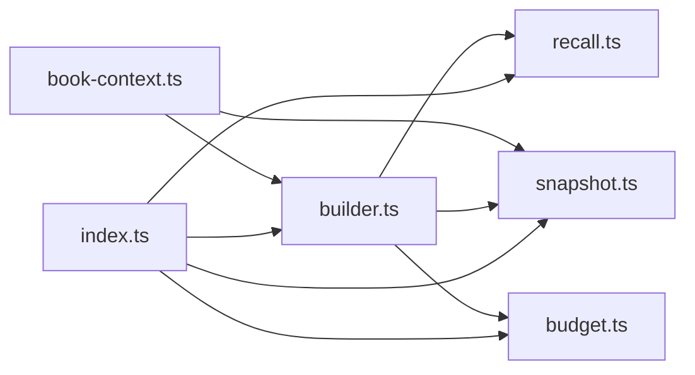

# AI集成

<cite>
**本文引用的文件**
- [packages/server/src/ai/context-builder/snapshot.ts](file://packages/server/src/ai/context-builder/snapshot.ts)
- [packages/server/src/ai/context-builder/recall.ts](file://packages/server/src/ai/context-builder/recall.ts)
- [packages/server/src/ai/context-builder/budget.ts](file://packages/server/src/ai/context-builder/budget.ts)
- [packages/server/src/ai/context-builder/builder.ts](file://packages/server/src/ai/context-builder/builder.ts)
- [packages/server/src/ai/context-builder/book-context.ts](file://packages/server/src/ai/context-builder/book-context.ts)
- [packages/server/src/ai/context-builder/index.ts](file://packages/server/src/ai/context-builder/index.ts)
- [packages/client/src/api/streaming.ts](file://packages/client/src/api/streaming.ts)
- [packages/client/src/api/client.ts](file://packages/client/src/api/client.ts)
- [packages/client/src/stores/conversation.ts](file://packages/client/src/stores/conversation.ts)
- [packages/client/src/components/editor/markdown-bridge.ts](file://packages/client/src/components/editor/markdown-bridge.ts)
- [packages/server/src/ai/budget-check.ts](file://packages/server/src/ai/budget-check.ts)
- [samples/sillytavern/Izumi 0503.json](file://samples/sillytavern/Izumi 0503.json)
- [reports/live-runs/pet-capture-demo-live-2026-06-17T09-05-31-454Z.json](file://reports/live-runs/pet-capture-demo-live-2026-06-17T09-05-31-454Z.json)
</cite>

## 目录
1. [简介](#简介)
2. [项目结构](#项目结构)
3. [核心组件](#核心组件)
4. [架构总览](#架构总览)
5. [详细组件分析](#详细组件分析)
6. [依赖关系分析](#依赖关系分析)
7. [性能考虑](#性能考虑)
8. [故障排查指南](#故障排查指南)
9. [结论](#结论)
10. [附录](#附录)

## 简介
本技术文档面向Scribe AI集成，聚焦以下主题：
- 上下文构建器：快照生成、回忆检索、上下文压缩与预算控制
- 预算控制机制：token估算、成本控制与资源限制
- AI模型接口设计：抽象工厂、适配器模式与统一调用接口
- 流式响应处理：WebSocket连接、数据分片与错误重试
- 质量检查器集成：规则定义、执行顺序与结果聚合
- 外部AI服务集成协议与数据格式转换
- 性能优化、并发控制与资源管理策略
- 具体代码示例路径（以源码定位代替直接代码）

## 项目结构
Scribe采用多包结构，AI相关能力集中在server端的context-builder模块，并通过client侧的API与前端交互；同时提供演示与报告用于验证集成效果。

图表来源
- [packages/server/src/ai/context-builder/index.ts:1-5](file://packages/server/src/ai/context-builder/index.ts#L1-L5)
- [packages/server/src/ai/context-builder/snapshot.ts:1-145](file://packages/server/src/ai/context-builder/snapshot.ts#L1-L145)
- [packages/server/src/ai/context-builder/recall.ts:1-63](file://packages/server/src/ai/context-builder/recall.ts#L1-L63)
- [packages/server/src/ai/context-builder/budget.ts:1-70](file://packages/server/src/ai/context-builder/budget.ts#L1-L70)
- [packages/server/src/ai/context-builder/builder.ts:1-286](file://packages/server/src/ai/context-builder/builder.ts#L1-L286)
- [packages/server/src/ai/context-builder/book-context.ts:1-506](file://packages/server/src/ai/context-builder/book-context.ts#L1-L506)
- [packages/server/src/ai/budget-check.ts](file://packages/server/src/ai/budget-check.ts)
- [packages/client/src/api/client.ts](file://packages/client/src/api/client.ts)
- [packages/client/src/api/streaming.ts](file://packages/client/src/api/streaming.ts)
- [packages/client/src/stores/conversation.ts](file://packages/client/src/stores/conversation.ts)
- [packages/client/src/components/editor/markdown-bridge.ts](file://packages/client/src/components/editor/markdown-bridge.ts)
- [samples/sillytavern/Izumi 0503.json](file://samples/sillytavern/Izumi 0503.json)
- [reports/live-runs/pet-capture-demo-live-2026-06-17T09-05-31-454Z.json](file://reports/live-runs/pet-capture-demo-live-2026-06-17T09-05-31-454Z.json)

章节来源
- [packages/server/src/ai/context-builder/index.ts:1-5](file://packages/server/src/ai/context-builder/index.ts#L1-L5)

## 核心组件
- 快照加载与缓存：从各仓库聚合故事元数据、角色、章节摘要、世界书、预设块等，形成BookSnapshot，并提供缓存withSnapshot与失效invalidate。
- 回忆检索：基于角色名、伏笔标签、记录关键词在章节摘要中进行子串计分，结合keyEvents精确标注加成，返回Top-K相关章节。
- 上下文压缩与预算：按优先级合并静态/动态块，使用token估算与截断策略控制总量，支持“预算不足时按比例截断”。
- 写作/审查上下文组装：在快照基础上追加硬连续约束、结构化状态、时间线事实与产出要求，形成LLM消息序列。
- 流式响应处理：客户端通过统一API发起请求，接收分片数据，维护会话状态与Markdown桥接，支持错误重试与状态恢复。
- 预算控制：服务端提供token估算与预算拟合，配合全局预算检查模块进行成本控制与资源限制管理。

章节来源
- [packages/server/src/ai/context-builder/snapshot.ts:71-145](file://packages/server/src/ai/context-builder/snapshot.ts#L71-L145)
- [packages/server/src/ai/context-builder/recall.ts:34-63](file://packages/server/src/ai/context-builder/recall.ts#L34-L63)
- [packages/server/src/ai/context-builder/budget.ts:33-70](file://packages/server/src/ai/context-builder/budget.ts#L33-L70)
- [packages/server/src/ai/context-builder/builder.ts:185-286](file://packages/server/src/ai/context-builder/builder.ts#L185-L286)
- [packages/server/src/ai/context-builder/book-context.ts:365-440](file://packages/server/src/ai/context-builder/book-context.ts#L365-L440)
- [packages/client/src/api/streaming.ts](file://packages/client/src/api/streaming.ts)
- [packages/server/src/ai/budget-check.ts](file://packages/server/src/ai/budget-check.ts)

## 架构总览
Scribe的AI集成围绕“上下文构建-预算控制-模型调用-流式响应-质量检查”的闭环展开。服务端负责数据聚合与上下文组装，客户端负责请求发起与流式渲染，预算模块贯穿其中进行成本控制。

图表来源
- [packages/server/src/ai/context-builder/book-context.ts:365-440](file://packages/server/src/ai/context-builder/book-context.ts#L365-L440)
- [packages/server/src/ai/context-builder/builder.ts:185-286](file://packages/server/src/ai/context-builder/builder.ts#L185-L286)
- [packages/server/src/ai/context-builder/snapshot.ts:71-117](file://packages/server/src/ai/context-builder/snapshot.ts#L71-L117)
- [packages/server/src/ai/context-builder/recall.ts:34-63](file://packages/server/src/ai/context-builder/recall.ts#L34-L63)
- [packages/server/src/ai/context-builder/budget.ts:33-70](file://packages/server/src/ai/context-builder/budget.ts#L33-L70)
- [packages/client/src/api/streaming.ts](file://packages/client/src/api/streaming.ts)

## 详细组件分析

### 上下文构建器：快照、回忆与压缩
- 快照生成
  - 从角色、大纲、章节摘要、世界书、预设块、读者问题等仓库聚合BookSnapshot。
  - 支持rules.md文件读取与promptPresets/promptBlocks启用过滤与排序。
  - 提供withSnapshot缓存与invalidate失效，避免重复构建。
- 回忆检索
  - 对摘要文本进行角色名/伏笔词/记录关键词的子串计分，keyEvents精确标注额外加分。
  - 基于当前章号设置截止范围，防止无限回溯。
- 上下文压缩与预算
  - 将静态块、世界书块、读者问题块、动态块按优先级合并，使用token估算与fitWithinBudget控制总量。
  - 当预算不足时，defaultTruncate按比例截断并在末尾添加截断提示，确保prompt cache友好顺序。

图表来源
- [packages/server/src/ai/context-builder/snapshot.ts:71-117](file://packages/server/src/ai/context-builder/snapshot.ts#L71-L117)
- [packages/server/src/ai/context-builder/recall.ts:34-63](file://packages/server/src/ai/context-builder/recall.ts#L34-L63)
- [packages/server/src/ai/context-builder/builder.ts:50-133](file://packages/server/src/ai/context-builder/builder.ts#L50-L133)
- [packages/server/src/ai/context-builder/builder.ts:246-286](file://packages/server/src/ai/context-builder/builder.ts#L246-L286)
- [packages/server/src/ai/context-builder/budget.ts:33-70](file://packages/server/src/ai/context-builder/budget.ts#L33-L70)

章节来源
- [packages/server/src/ai/context-builder/snapshot.ts:71-145](file://packages/server/src/ai/context-builder/snapshot.ts#L71-L145)
- [packages/server/src/ai/context-builder/recall.ts:34-63](file://packages/server/src/ai/context-builder/recall.ts#L34-L63)
- [packages/server/src/ai/context-builder/builder.ts:185-286](file://packages/server/src/ai/context-builder/builder.ts#L185-L286)
- [packages/server/src/ai/context-builder/budget.ts:33-70](file://packages/server/src/ai/context-builder/budget.ts#L33-L70)

### 预算控制机制：token计算、成本估算与资源限制
- token估算
  - 中文字符按经验系数折算，英文按字符长度估算，其他字符按比例折算，综合得出粗略token数。
- 上下文拟合
  - 按优先级排序，逐段尝试加入；当剩余预算大于阈值且支持截断时进行比例截断，否则丢弃。
- 截断策略
  - defaultTruncate按比例保留头部，追加截断提示，留足余量避免越界。
- 成本控制与资源限制
  - 结合全局预算检查模块，对请求进行限额与超支预警，必要时拒绝或降级处理。

图表来源
- [packages/server/src/ai/context-builder/budget.ts:1-70](file://packages/server/src/ai/context-builder/budget.ts#L1-L70)
- [packages/server/src/ai/budget-check.ts](file://packages/server/src/ai/budget-check.ts)

章节来源
- [packages/server/src/ai/context-builder/budget.ts:1-70](file://packages/server/src/ai/context-builder/budget.ts#L1-L70)
- [packages/server/src/ai/budget-check.ts](file://packages/server/src/ai/budget-check.ts)

### AI模型接口设计：抽象工厂、适配器与统一调用
- 统一调用接口
  - 客户端通过统一API发起请求，服务端将BookSnapshot与召回结果组装为messages后提交至外部AI服务。
- 适配器模式
  - 通过快照与上下文构建器适配不同来源的数据（角色、章节、世界书、预设块），保证对外接口一致。
- 抽象工厂
  - 以SnapshotRepos为抽象工厂，屏蔽具体仓库实现差异，便于替换与扩展。

图表来源
- [packages/server/src/ai/context-builder/snapshot.ts:39-65](file://packages/server/src/ai/context-builder/snapshot.ts#L39-L65)
- [packages/server/src/ai/context-builder/snapshot.ts:22-37](file://packages/server/src/ai/context-builder/snapshot.ts#L22-L37)
- [packages/server/src/ai/context-builder/builder.ts:185-286](file://packages/server/src/ai/context-builder/builder.ts#L185-L286)

章节来源
- [packages/server/src/ai/context-builder/snapshot.ts:39-65](file://packages/server/src/ai/context-builder/snapshot.ts#L39-L65)
- [packages/server/src/ai/context-builder/builder.ts:185-286](file://packages/server/src/ai/context-builder/builder.ts#L185-L286)

### 流式响应处理：WebSocket、分片与重试
- 请求与会话
  - 客户端API负责发起请求，会话状态由store维护，Markdown桥接组件负责渲染。
- 流式分片
  - 服务端返回流式片段，客户端按分片增量更新UI，支持错误重试与状态恢复。
- 错误处理
  - 在网络异常或服务端错误时，客户端进行指数退避重试与用户提示。

图表来源
- [packages/client/src/api/client.ts](file://packages/client/src/api/client.ts)
- [packages/client/src/api/streaming.ts](file://packages/client/src/api/streaming.ts)
- [packages/client/src/stores/conversation.ts](file://packages/client/src/stores/conversation.ts)
- [packages/client/src/components/editor/markdown-bridge.ts](file://packages/client/src/components/editor/markdown-bridge.ts)

章节来源
- [packages/client/src/api/streaming.ts](file://packages/client/src/api/streaming.ts)
- [packages/client/src/stores/conversation.ts](file://packages/client/src/stores/conversation.ts)
- [packages/client/src/components/editor/markdown-bridge.ts](file://packages/client/src/components/editor/markdown-bridge.ts)

### 质量检查器集成：规则、顺序与聚合
- 规则定义
  - 从预设块中提取“必须包含”的输出段落要求，识别状态栏等关键字段。
- 执行顺序
  - 在上下文构建完成后，追加硬连续约束、结构化状态、时间线事实与产出要求，最后附加任务指令。
- 结果聚合
  - 将缺失项汇总为可读提示，便于后续修正与审计。

图表来源
- [packages/server/src/ai/context-builder/book-context.ts:99-147](file://packages/server/src/ai/context-builder/book-context.ts#L99-L147)
- [packages/server/src/ai/context-builder/book-context.ts:412-432](file://packages/server/src/ai/context-builder/book-context.ts#L412-L432)

章节来源
- [packages/server/src/ai/context-builder/book-context.ts:99-147](file://packages/server/src/ai/context-builder/book-context.ts#L99-L147)
- [packages/server/src/ai/context-builder/book-context.ts:412-432](file://packages/server/src/ai/context-builder/book-context.ts#L412-L432)

### 外部AI服务集成协议与数据格式
- 协议与接口
  - 客户端统一API向外部AI服务提交messages序列，服务端负责上下文组装与预算控制。
- 数据格式
  - 使用CoreMessage结构传递角色与内容，确保系统提示、预设消息与动态上下文有序排列。
- 样例与报告
  - 通过样例导入与运行报告验证集成效果与一致性。

章节来源
- [packages/server/src/ai/context-builder/builder.ts:266-270](file://packages/server/src/ai/context-builder/builder.ts#L266-L270)
- [samples/sillytavern/Izumi 0503.json](file://samples/sillytavern/Izumi 0503.json)
- [reports/live-runs/pet-capture-demo-live-2026-06-17T09-05-31-454Z.json](file://reports/live-runs/pet-capture-demo-live-2026-06-17T09-05-31-454Z.json)

## 依赖关系分析
- 组件耦合
  - builder依赖snapshot、recall、budget；book-context依赖snapshot与builder；index导出所有上下文构建相关模块。
- 外部依赖
  - ai库的CoreMessage类型用于统一消息结构；@scribe/shared提供实体与字段解析工具。
- 并发与缓存
  - withSnapshot提供按bookId的缓存，避免重复构建；recall与budget均在单次请求内完成，适合并发场景。

图表来源
- [packages/server/src/ai/context-builder/index.ts:1-5](file://packages/server/src/ai/context-builder/index.ts#L1-L5)
- [packages/server/src/ai/context-builder/builder.ts:1-20](file://packages/server/src/ai/context-builder/builder.ts#L1-L20)
- [packages/server/src/ai/context-builder/book-context.ts:1-18](file://packages/server/src/ai/context-builder/book-context.ts#L1-L18)

章节来源
- [packages/server/src/ai/context-builder/index.ts:1-5](file://packages/server/src/ai/context-builder/index.ts#L1-L5)
- [packages/server/src/ai/context-builder/builder.ts:1-20](file://packages/server/src/ai/context-builder/builder.ts#L1-L20)
- [packages/server/src/ai/context-builder/book-context.ts:1-18](file://packages/server/src/ai/context-builder/book-context.ts#L1-L18)

## 性能考虑
- 快照缓存
  - 使用withSnapshot按书目缓存快照，减少重复IO与聚合开销。
- 回忆检索优化
  - 仅对候选区间内的摘要评分，避免全量扫描；子串计分简单高效。
- 预算拟合
  - 先估后裁，预算不足时按比例截断，避免多次昂贵的token重估。
- 流式渲染
  - 分片增量渲染降低首屏延迟，提升用户体验。
- 并发控制
  - 建议对同一书目的并发请求进行队列化，避免重复构建与资源争用。

## 故障排查指南
- token估算偏差
  - 若发现截断过多或过少，调整估算系数或提高预算阈值。
- 回忆召回不相关
  - 检查角色名/伏笔标签/记录关键词是否出现在摘要文本中；适当放宽topK或调整权重。
- 流式连接失败
  - 检查网络与代理配置，确认客户端重试策略生效；关注会话状态与错误提示。
- 预算超支
  - 通过全局预算检查模块定位超支环节，必要时降低预算或精简上下文块。

章节来源
- [packages/server/src/ai/context-builder/budget.ts:1-70](file://packages/server/src/ai/context-builder/budget.ts#L1-L70)
- [packages/server/src/ai/context-builder/recall.ts:34-63](file://packages/server/src/ai/context-builder/recall.ts#L34-L63)
- [packages/client/src/api/streaming.ts](file://packages/client/src/api/streaming.ts)
- [packages/server/src/ai/budget-check.ts](file://packages/server/src/ai/budget-check.ts)

## 结论
Scribe的AI集成以“上下文构建-预算控制-流式响应-质量检查”为核心闭环，通过快照缓存、回忆检索与预算拟合保障上下文质量与成本可控；借助统一API与适配器模式实现与外部AI服务的平滑对接；配合流式渲染与错误重试提升用户体验。建议在实际部署中结合业务规模与SLA，完善并发控制与资源监控，持续优化token估算与截断策略。

## 附录
- 示例路径参考
  - 上下文构建流程：[packages/server/src/ai/context-builder/builder.ts:185-286](file://packages/server/src/ai/context-builder/builder.ts#L185-L286)
  - 快照加载与缓存：[packages/server/src/ai/context-builder/snapshot.ts:71-145](file://packages/server/src/ai/context-builder/snapshot.ts#L71-L145)
  - 回忆检索算法：[packages/server/src/ai/context-builder/recall.ts:34-63](file://packages/server/src/ai/context-builder/recall.ts#L34-L63)
  - 预算拟合与截断：[packages/server/src/ai/context-builder/budget.ts:33-70](file://packages/server/src/ai/context-builder/budget.ts#L33-L70)
  - 写作/审查上下文组装：[packages/server/src/ai/context-builder/book-context.ts:365-505](file://packages/server/src/ai/context-builder/book-context.ts#L365-L505)
  - 流式响应处理：[packages/client/src/api/streaming.ts](file://packages/client/src/api/streaming.ts)
  - 客户端API入口：[packages/client/src/api/client.ts](file://packages/client/src/api/client.ts)
  - 会话状态管理：[packages/client/src/stores/conversation.ts](file://packages/client/src/stores/conversation.ts)
  - Markdown桥接：[packages/client/src/components/editor/markdown-bridge.ts](file://packages/client/src/components/editor/markdown-bridge.ts)
  - 全局预算检查：[packages/server/src/ai/budget-check.ts](file://packages/server/src/ai/budget-check.ts)
  - 样例导入：[samples/sillytavern/Izumi 0503.json](file://samples/sillytavern/Izumi 0503.json)
  - 运行报告：[reports/live-runs/pet-capture-demo-live-2026-06-17T09-05-31-454Z.json](file://reports/live-runs/pet-capture-demo-live-2026-06-17T09-05-31-454Z.json)