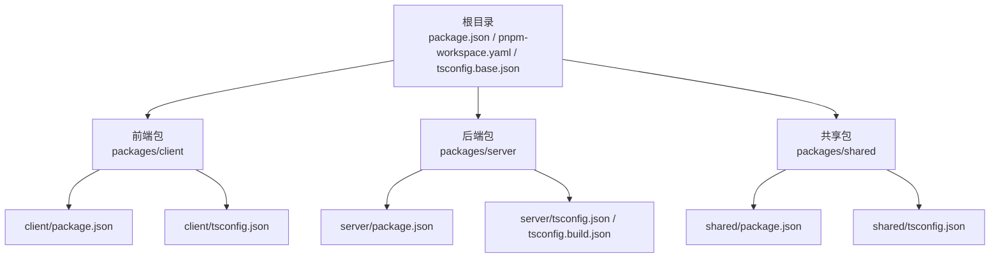
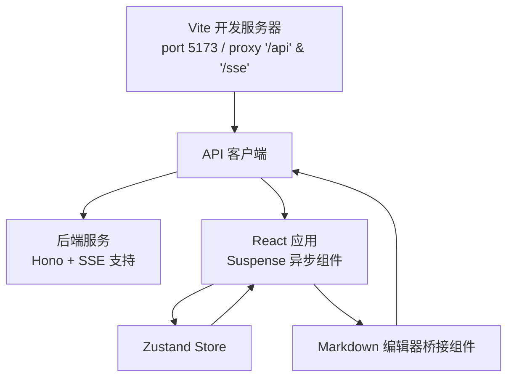
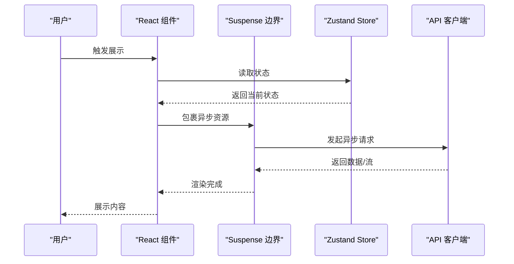
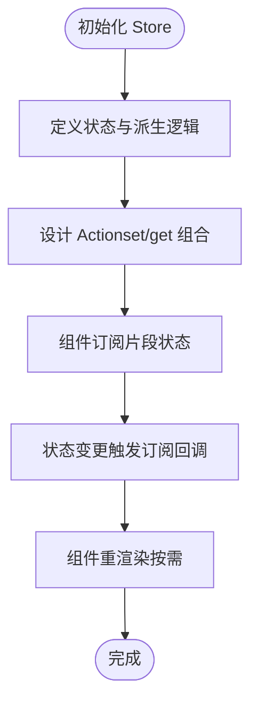
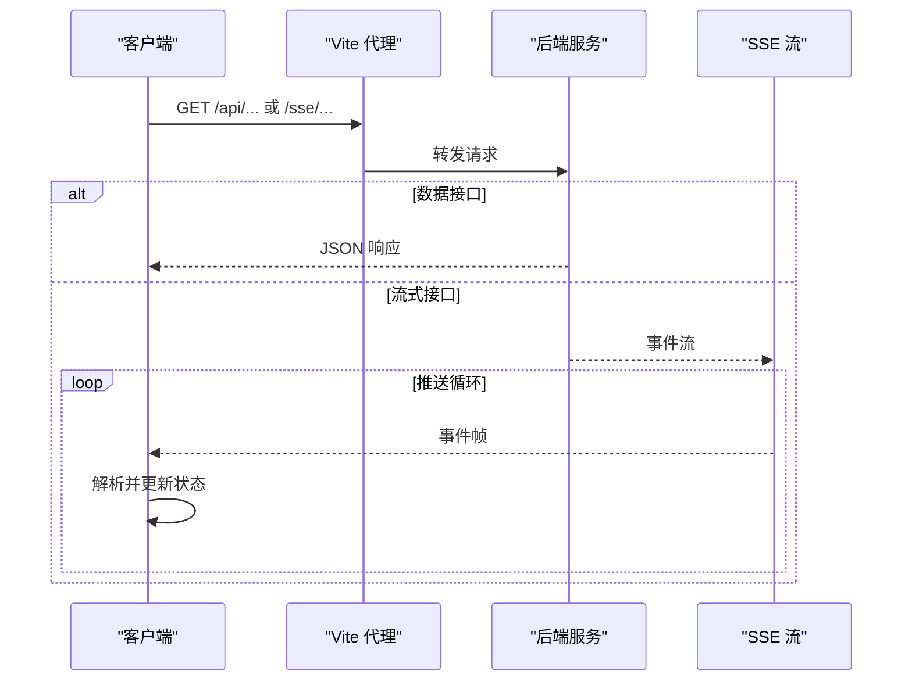
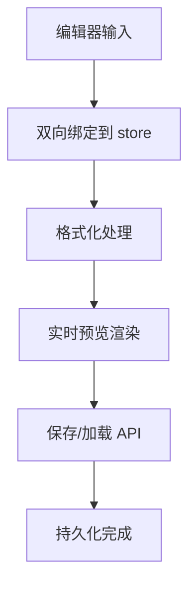
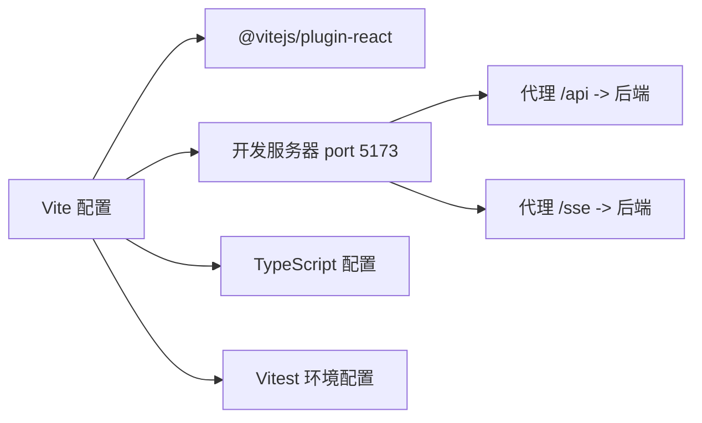
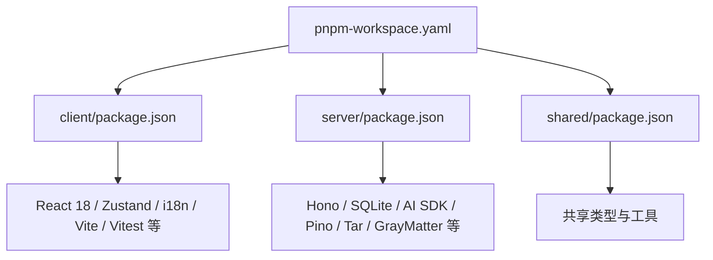

# 前端架构

<cite>
**本文引用的文件**
- [package.json](file://package.json)
- [pnpm-workspace.yaml](file://pnpm-workspace.yaml)
- [tsconfig.base.json](file://tsconfig.base.json)
- [docs/_backups/20260604-162405/2026-06-04-scribe-mvp.md](file://docs/_backups/20260604-162405/2026-06-04-scribe-mvp.md)
- [docs/HANDOFF-codex.md](file://docs/HANDOFF-codex.md)
- [packages/client/package.json](file://packages/client/package.json)
- [packages/client/tsconfig.json](file://packages/client/tsconfig.json)
- [packages/server/package.json](file://packages/server/package.json)
- [packages/server/tsconfig.json](file://packages/server/tsconfig.json)
- [packages/server/tsconfig.build.json](file://packages/server/tsconfig.build.json)
- [packages/shared/package.json](file://packages/shared/package.json)
- [packages/shared/tsconfig.json](file://packages/shared/tsconfig.json)
- [e2e/package.json](file://e2e/package.json)
- [e2e/playwright.config.ts](file://e2e/playwright.config.ts)
</cite>

## 目录
1. [引言](#引言)
2. [项目结构](#项目结构)
3. [核心组件](#核心组件)
4. [架构总览](#架构总览)
5. [详细组件分析](#详细组件分析)
6. [依赖关系分析](#依赖关系分析)
7. [性能考虑](#性能考虑)
8. [故障排查指南](#故障排查指南)
9. [结论](#结论)
10. [附录](#附录)

## 引言
本文件面向Scribe前端架构的技术文档，聚焦于React 18组件体系（含Suspense异步组件）、状态管理模式（Zustand）与组件通信机制；同时涵盖API客户端设计（请求/响应拦截与流式处理）、Markdown编辑器桥接组件（双向绑定、实时预览与格式化）、Vite构建与开发服务器配置，以及性能优化、内存管理与调试技巧。为保证准确性，本文所有技术要点均来自仓库现有文件与文档记录。

## 项目结构
Scribe采用多包工作区（monorepo），通过pnpm进行统一管理。前端位于packages/client，后端位于packages/server，共享逻辑位于packages/shared。根目录的package.json与pnpm-workspace.yaml定义了工作区范围与脚本入口；各包内的package.json声明了依赖与构建脚本；tsconfig.base.json提供全局TS配置基线。

**图示来源**
- [pnpm-workspace.yaml](file://pnpm-workspace.yaml)
- [package.json](file://package.json)
- [tsconfig.base.json](file://tsconfig.base.json)
- [packages/client/package.json](file://packages/client/package.json)
- [packages/client/tsconfig.json](file://packages/client/tsconfig.json)
- [packages/server/package.json](file://packages/server/package.json)
- [packages/server/tsconfig.json](file://packages/server/tsconfig.json)
- [packages/server/tsconfig.build.json](file://packages/server/tsconfig.build.json)
- [packages/shared/package.json](file://packages/shared/package.json)
- [packages/shared/tsconfig.json](file://packages/shared/tsconfig.json)

**章节来源**
- [pnpm-workspace.yaml](file://pnpm-workspace.yaml)
- [package.json](file://package.json)
- [tsconfig.base.json](file://tsconfig.base.json)

## 核心组件
- 组件体系：React 18 + Suspense异步组件，用于优雅降级与并发渲染，避免阻塞UI。
- 状态管理：Zustand（非Redux），强调轻量与函数式风格，便于快速迭代。
- 组件通信：基于props与上下文（Context）传递，结合Zustand store进行跨层级状态同步。
- API客户端：统一请求/响应处理与流式数据（SSE）支持，代理至后端服务。
- Markdown编辑器桥接：双向绑定、实时预览与格式化处理，提升写作体验。
- 构建与测试：Vite开发服务器与代理、Vitest测试框架、Playwright端到端测试。

**章节来源**
- [docs/_backups/20260604-162405/2026-06-04-scribe-mvp.md](file://docs/_backups/20260604-162405/2026-06-04-scribe-mvp.md)

## 架构总览
前端通过Vite提供开发服务器与热更新，代理/api与/sse至后端（默认本地端口）。React应用以Suspense包裹异步资源加载，Zustand store集中管理应用状态并驱动视图更新。Markdown编辑器桥接组件负责输入输出的双向绑定与格式化，最终通过API客户端提交或拉取数据。

**图示来源**
- [docs/_backups/20260604-162405/2026-06-04-scribe-mvp.md](file://docs/_backups/20260604-162405/2026-06-04-scribe-mvp.md)

## 详细组件分析

### React 18与Suspense异步组件
- 设计理念：利用Suspense捕获异步边界，配合fallback实现渐进式加载，避免页面闪烁与阻塞。
- 典型用法：将昂贵的资源（如远程数据、大组件）置于Suspense边界内，确保在数据就绪前显示占位符。
- 生命周期：Suspense边界内的Promise解析后触发重新渲染；异常时进入错误边界。
- 与状态管理协作：Zustand store可作为数据源，当状态变化时触发组件重渲染，与Suspense形成稳定的数据流闭环。

**图示来源**
- [docs/_backups/20260604-162405/2026-06-04-scribe-mvp.md](file://docs/_backups/20260604-162405/2026-06-04-scribe-mvp.md)

**章节来源**
- [docs/_backups/20260604-162405/2026-06-04-scribe-mvp.md](file://docs/_backups/20260604-162405/2026-06-04-scribe-mvp.md)

### Zustand状态管理
- store定义：以函数式风格定义状态与派生逻辑，避免样板代码。
- action设计：通过set与get组合实现状态更新与跨字段计算，保持原子性与可追踪性。
- 订阅机制：组件通过订阅store片段实现细粒度更新，减少不必要重渲染。
- 与组件通信：通过自定义Hook封装订阅，使组件无需感知底层存储实现。

**图示来源**
- [docs/_backups/20260604-162405/2026-06-04-scribe-mvp.md](file://docs/_backups/20260604-162405/2026-06-04-scribe-mvp.md)

**章节来源**
- [docs/_backups/20260604-162405/2026-06-04-scribe-mvp.md](file://docs/_backups/20260604-162405/2026-06-04-scribe-mvp.md)

### API客户端设计
- 请求拦截器：统一注入认证头、序列化请求体、处理重试与超时。
- 响应处理器：解析JSON、处理HTTP错误码、转换为业务错误对象。
- 流式数据处理：对/sse路径建立长连接，逐条推送事件，解析数据帧并更新store。
- 代理配置：Vite开发服务器将/api与/sse转发至后端地址，便于前后端联调。

**图示来源**
- [docs/_backups/20260604-162405/2026-06-04-scribe-mvp.md](file://docs/_backups/20260604-162405/2026-06-04-scribe-mvp.md)

**章节来源**
- [docs/_backups/20260604-162405/2026-06-04-scribe-mvp.md](file://docs/_backups/20260604-162405/2026-06-04-scribe-mvp.md)

### Markdown编辑器桥接组件
- 双向绑定：编辑器值与store字段保持一致，输入变更即时同步。
- 实时预览：编辑器内容经格式化处理后，同步渲染为HTML，提升反馈速度。
- 格式化处理：对特殊语法进行高亮与转义，保证预览一致性与安全性。
- 与API集成：保存/加载操作通过API客户端完成，确保数据持久化。

**图示来源**
- [docs/_backups/20260604-162405/2026-06-04-scribe-mvp.md](file://docs/_backups/20260604-162405/2026-06-04-scribe-mvp.md)

**章节来源**
- [docs/_backups/20260604-162405/2026-06-04-scribe-mvp.md](file://docs/_backups/20260604-162405/2026-06-04-scribe-mvp.md)

### Vite构建与开发服务器
- 插件注册：@vitejs/plugin-react启用Fast Refresh与JSX转换。
- 开发服务器：默认端口5173，开启代理将/api与/sse转发至后端。
- 测试环境：Vitest配置使用jsdom环境，支持全局变量与setupFiles。
- TypeScript：client侧tsconfig继承基础配置，启用jsx转换与DOM库。

**图示来源**
- [docs/_backups/20260604-162405/2026-06-04-scribe-mvp.md](file://docs/_backups/20260604-162405/2026-06-04-scribe-mvp.md)

**章节来源**
- [docs/_backups/20260604-162405/2026-06-04-scribe-mvp.md](file://docs/_backups/20260604-162405/2026-06-04-scribe-mvp.md)

## 依赖关系分析
- 工作区：pnpm-workspace定义了client、server、shared三个包，统一版本与脚本。
- 前端依赖：React 18、Zustand、i18n等；开发依赖包含Vite、@vitejs/plugin-react、Vitest、@testing-library等。
- 后端依赖：Hono、@hono/node-server、better-sqlite3、ai、@ai-sdk/openai-compatible、zod、pino、tar、gray-matter等。
- 共享依赖：@scribe/shared提供跨包复用类型与工具。

**图示来源**
- [pnpm-workspace.yaml](file://pnpm-workspace.yaml)
- [packages/client/package.json](file://packages/client/package.json)
- [packages/server/package.json](file://packages/server/package.json)
- [packages/shared/package.json](file://packages/shared/package.json)

**章节来源**
- [pnpm-workspace.yaml](file://pnpm-workspace.yaml)
- [packages/client/package.json](file://packages/client/package.json)
- [packages/server/package.json](file://packages/server/package.json)
- [packages/shared/package.json](file://packages/shared/package.json)

## 性能考虑
- 渲染优化：合理使用Suspense与细粒度订阅，避免全树重渲染；对高频组件采用memo化与浅比较。
- 状态管理：Zustand的原子更新与片段订阅降低无关重渲染；避免在action中执行阻塞操作。
- 网络层：合并请求、缓存响应、限制并发；对SSE流进行背压控制与断线重连。
- 构建优化：按需引入polyfill、拆分代码、启用压缩；开发阶段仅在必要时刷新。
- 内存管理：及时清理事件监听、定时器与订阅；对大文本与二进制数据进行懒加载与释放策略。

## 故障排查指南
- 端到端测试：使用Playwright配置与测试用例验证主流程，定位UI交互问题。
- 单元测试：Vitest运行组件与工具函数，确保边界条件与错误分支被覆盖。
- 日志与监控：后端使用pino输出结构化日志，前端通过控制台与网络面板检查请求/响应与SSE事件。
- 常见问题：代理不通检查Vite代理配置；SSE无事件检查后端SSE路由与跨域设置；状态不同步检查store订阅与action调用时机。

**章节来源**
- [e2e/playwright.config.ts](file://e2e/playwright.config.ts)
- [e2e/package.json](file://e2e/package.json)
- [docs/_backups/20260604-162405/2026-06-04-scribe-mvp.md](file://docs/_backups/20260604-162405/2026-06-04-scribe-mvp.md)

## 结论
Scribe前端以React 18与Suspense为核心，结合Zustand实现高效的状态管理与组件通信；通过Vite与代理实现流畅的开发体验；API客户端与SSE流式处理保障数据实时性；Markdown编辑器桥接组件提升写作效率。整体架构清晰、模块职责明确，具备良好的扩展性与可维护性。

## 附录
- TypeScript配置：client与shared继承基础tsconfig，启用jsx转换与DOM库；server使用独立tsconfig与构建配置。
- 文档参考：MVP设计文档与Codex手稿提供了架构背景与后续演进方向。

**章节来源**
- [packages/client/tsconfig.json](file://packages/client/tsconfig.json)
- [packages/shared/tsconfig.json](file://packages/shared/tsconfig.json)
- [packages/server/tsconfig.json](file://packages/server/tsconfig.json)
- [packages/server/tsconfig.build.json](file://packages/server/tsconfig.build.json)
- [docs/_backups/20260604-162405/2026-06-04-scribe-mvp.md](file://docs/_backups/20260604-162405/2026-06-04-scribe-mvp.md)
- [docs/HANDOFF-codex.md](file://docs/HANDOFF-codex.md)