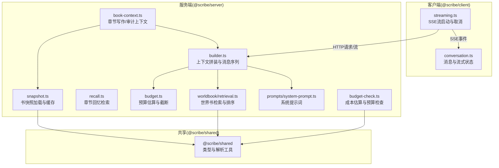
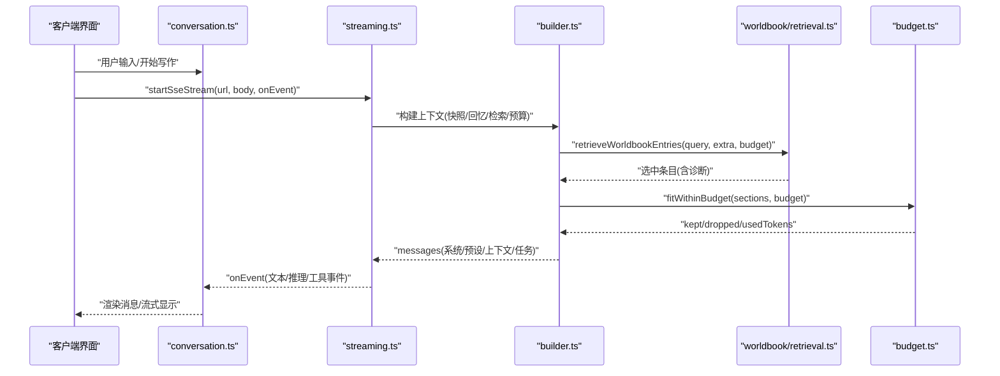
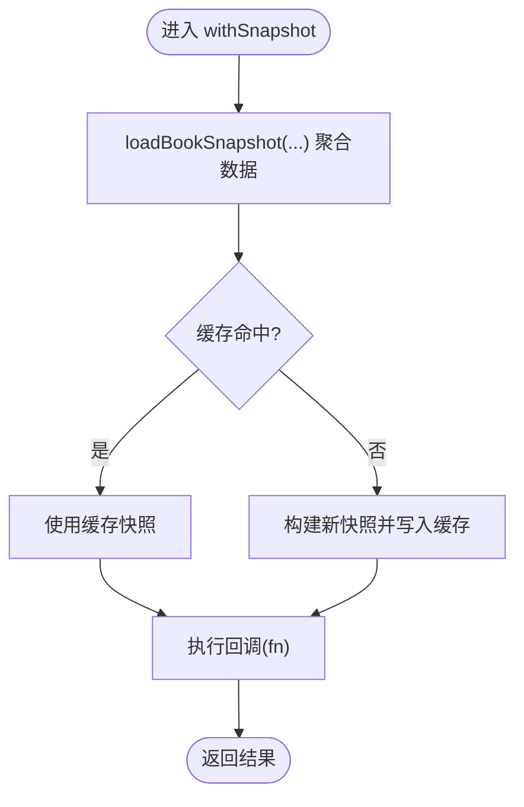
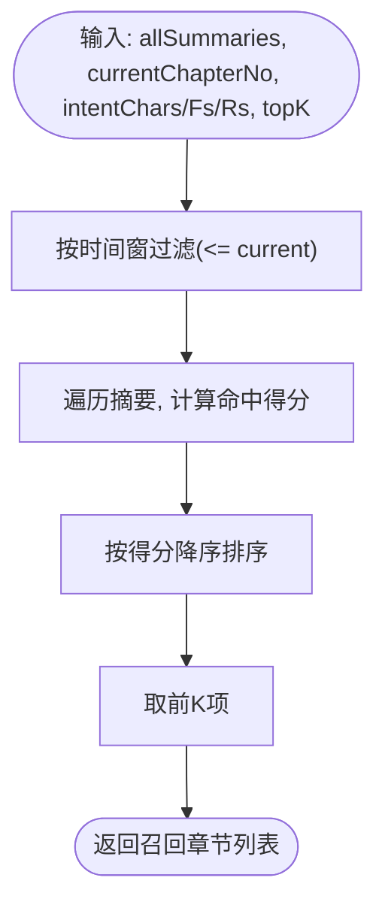
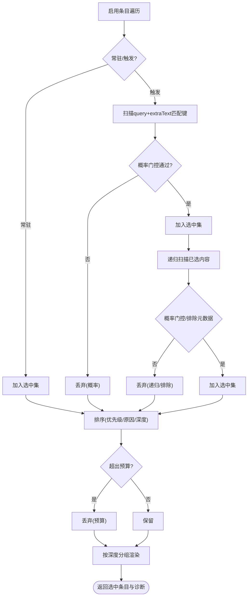
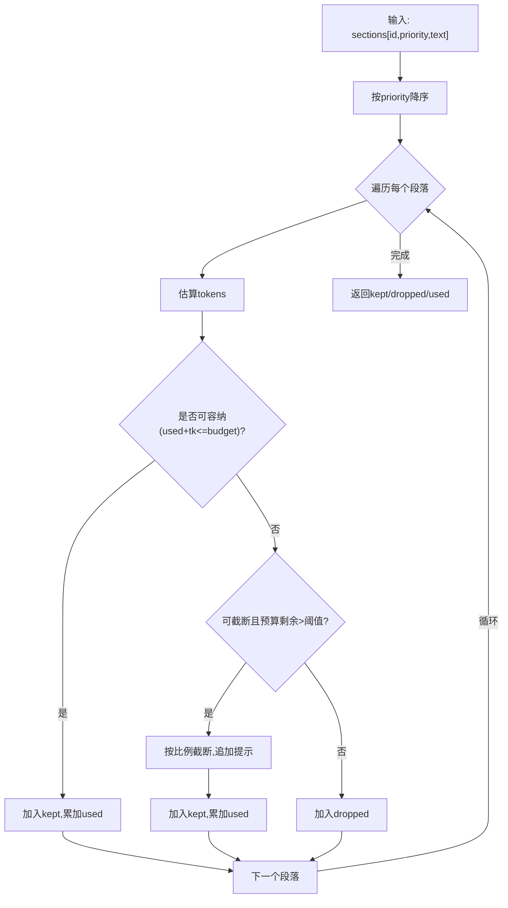
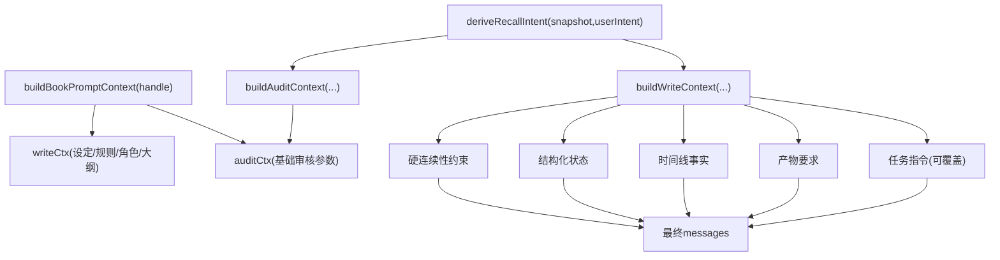
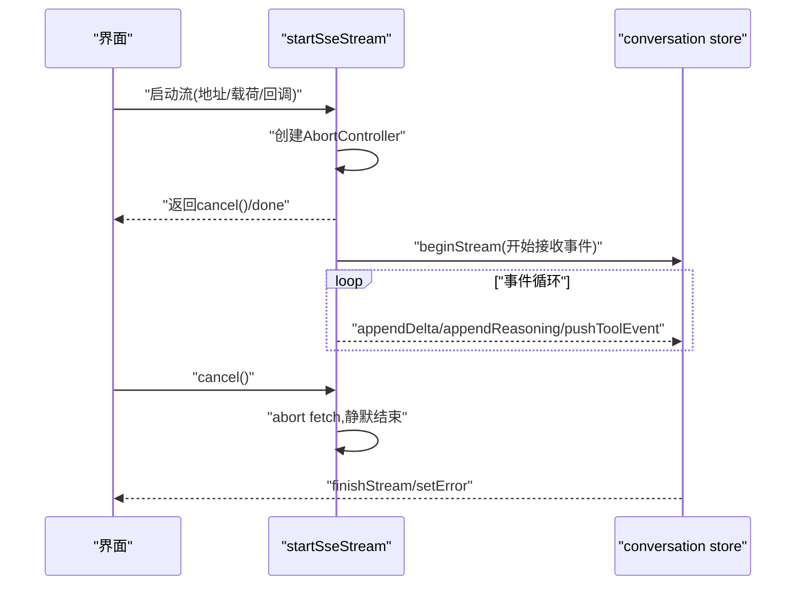
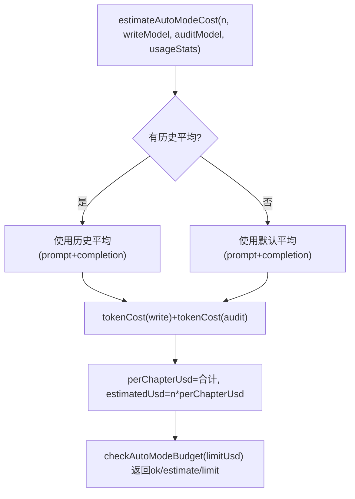
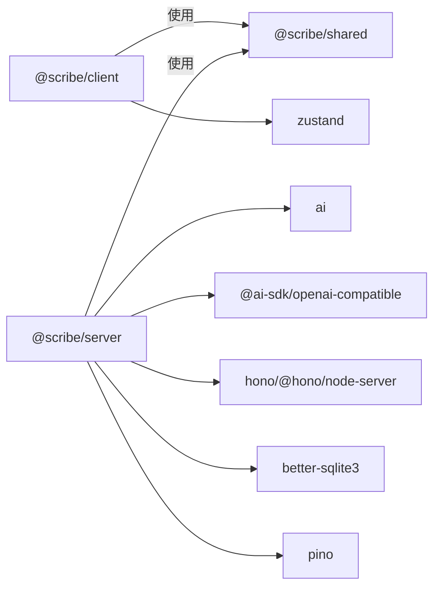

# AI集成与上下文构建

<cite>
**本文引用的文件**   
- [packages/server/src/ai/context-builder/snapshot.ts](file://packages/server/src/ai/context-builder/snapshot.ts)
- [packages/server/src/ai/context-builder/recall.ts](file://packages/server/src/ai/context-builder/recall.ts)
- [packages/server/src/ai/context-builder/budget.ts](file://packages/server/src/ai/context-builder/budget.ts)
- [packages/server/src/ai/context-builder/builder.ts](file://packages/server/src/ai/context-builder/builder.ts)
- [packages/server/src/ai/context-builder/book-context.ts](file://packages/server/src/ai/context-builder/book-context.ts)
- [packages/server/src/ai/worldbook/retrieval.ts](file://packages/server/src/ai/worldbook/retrieval.ts)
- [packages/server/src/ai/prompts/system-prompt.ts](file://packages/server/src/ai/prompts/system-prompt.ts)
- [packages/server/src/ai/budget-check.ts](file://packages/server/src/ai/budget-check.ts)
- [packages/client/src/api/streaming.ts](file://packages/client/src/api/streaming.ts)
- [packages/client/src/stores/conversation.ts](file://packages/client/src/stores/conversation.ts)
- [packages/server/package.json](file://packages/server/package.json)
- [packages/shared/package.json](file://packages/shared/package.json)
</cite>

## 目录
1. [引言](#引言)
2. [项目结构](#项目结构)
3. [核心组件](#核心组件)
4. [架构总览](#架构总览)
5. [详细组件分析](#详细组件分析)
6. [依赖关系分析](#依赖关系分析)
7. [性能考量](#性能考量)
8. [故障排查指南](#故障排查指南)
9. [结论](#结论)
10. [附录](#附录)

## 引言
本文件面向Scribe AI集成与上下文构建系统，围绕以下目标展开：  
- 解释AI上下文构建器的核心算法：快照管理策略、回忆检索机制、上下文预算控制与压缩。  
- 阐述模型管理与成本控制：多模型支持、预算检查与成本估算。  
- 说明流式响应处理：实时数据传输、缓冲与连接优化。  
- 给出上下文压缩算法：重要性评分、摘要生成与增量更新。  
- 提供AI调用示例：对话处理、内容生成与质量评估。  
- 解释错误重试与降级策略。

## 项目结构
系统采用前后端分层与模块化设计：  
- 服务端（@scribe/server）负责AI上下文构建、世界书检索、预算与成本估算、以及与客户端的SSE流对接。  
- 客户端（@scribe/client）负责流式事件消费、消息存储与UI状态管理。  
- 共享模块（@scribe/shared）提供类型定义与跨包共享逻辑。  



图表来源
- [packages/server/src/ai/context-builder/snapshot.ts:71-117](file://packages/server/src/ai/context-builder/snapshot.ts#L71-L117)
- [packages/server/src/ai/context-builder/recall.ts:34-62](file://packages/server/src/ai/context-builder/recall.ts#L34-L62)
- [packages/server/src/ai/context-builder/budget.ts:33-55](file://packages/server/src/ai/context-builder/budget.ts#L33-L55)
- [packages/server/src/ai/context-builder/builder.ts:185-285](file://packages/server/src/ai/context-builder/builder.ts#L185-L285)
- [packages/server/src/ai/context-builder/book-context.ts:365-440](file://packages/server/src/ai/context-builder/book-context.ts#L365-L440)
- [packages/server/src/ai/worldbook/retrieval.ts:160-300](file://packages/server/src/ai/worldbook/retrieval.ts#L160-L300)
- [packages/server/src/ai/prompts/system-prompt.ts:1-7](file://packages/server/src/ai/prompts/system-prompt.ts#L1-L7)
- [packages/server/src/ai/budget-check.ts:18-57](file://packages/server/src/ai/budget-check.ts#L18-L57)
- [packages/client/src/api/streaming.ts:18-38](file://packages/client/src/api/streaming.ts#L18-L38)
- [packages/client/src/stores/conversation.ts:53-129](file://packages/client/src/stores/conversation.ts#L53-L129)
- [packages/server/package.json:13-24](file://packages/server/package.json#L13-L24)
- [packages/shared/package.json:1-19](file://packages/shared/package.json#L1-L19)

章节来源
- [packages/server/package.json:13-24](file://packages/server/package.json#L13-L24)
- [packages/shared/package.json:1-19](file://packages/shared/package.json#L1-L19)

## 核心组件
- 书快照与缓存：统一聚合角色、大纲、章节摘要、世界书、预设块等，提供withSnapshot缓存以减少重复构建。  
- 回忆检索：基于角色名/伏笔词/记录关键词的“全文子串命中”打分，结合关键事件精确标注进行加成，限定时间窗口后TopK召回。  
- 世界书检索：支持触发、递归、概率门控、预算约束与插入深度分组，最终按优先级/原因/深度排序。  
- 上下文预算：按优先级贪心选择段落，不足时按默认策略截断，保留提示信息。  
- 写作/审计上下文：在静态块（设定/规则/角色/伏笔/记录）与动态块（最近/召回/意图）之间插入硬连续性约束与产物要求。  
- 成本估算与预算检查：基于历史或默认token用量估算单章成本，支持自动模式预算上限校验。  
- 流式响应：SSE事件驱动，客户端累积delta，支持取消与错误固化。

章节来源
- [packages/server/src/ai/context-builder/snapshot.ts:71-117](file://packages/server/src/ai/context-builder/snapshot.ts#L71-L117)
- [packages/server/src/ai/context-builder/recall.ts:34-62](file://packages/server/src/ai/context-builder/recall.ts#L34-L62)
- [packages/server/src/ai/worldbook/retrieval.ts:160-300](file://packages/server/src/ai/worldbook/retrieval.ts#L160-L300)
- [packages/server/src/ai/context-builder/budget.ts:33-69](file://packages/server/src/ai/context-builder/budget.ts#L33-L69)
- [packages/server/src/ai/context-builder/builder.ts:185-285](file://packages/server/src/ai/context-builder/builder.ts#L185-L285)
- [packages/server/src/ai/context-builder/book-context.ts:365-505](file://packages/server/src/ai/context-builder/book-context.ts#L365-L505)
- [packages/server/src/ai/budget-check.ts:18-57](file://packages/server/src/ai/budget-check.ts#L18-L57)
- [packages/client/src/api/streaming.ts:18-38](file://packages/client/src/api/streaming.ts#L18-L38)
- [packages/client/src/stores/conversation.ts:53-129](file://packages/client/src/stores/conversation.ts#L53-L129)

## 架构总览
系统围绕“书快照”为中心，通过“回忆检索 + 世界书检索 + 预算控制”生成LLM输入messages，再由模型生成正文；同时提供成本估算与预算检查，以及SSE流式输出。



图表来源
- [packages/client/src/api/streaming.ts:18-38](file://packages/client/src/api/streaming.ts#L18-L38)
- [packages/client/src/stores/conversation.ts:53-129](file://packages/client/src/stores/conversation.ts#L53-L129)
- [packages/server/src/ai/context-builder/builder.ts:185-285](file://packages/server/src/ai/context-builder/builder.ts#L185-L285)
- [packages/server/src/ai/worldbook/retrieval.ts:160-300](file://packages/server/src/ai/worldbook/retrieval.ts#L160-L300)
- [packages/server/src/ai/context-builder/budget.ts:33-55](file://packages/server/src/ai/context-builder/budget.ts#L33-L55)

## 详细组件分析

### 快照管理与缓存（Snapshot）
- 聚合来源：角色、大纲、章节摘要、题材记录、世界书、预设块、读者问题、book_meta。  
- 缓存策略：withSnapshot闭包内复用，按bookId缓存，显式invalidate失效。  
- 输出：BookSnapshot接口，作为后续构建上下文的唯一事实来源。



图表来源
- [packages/server/src/ai/context-builder/snapshot.ts:71-117](file://packages/server/src/ai/context-builder/snapshot.ts#L71-L117)
- [packages/server/src/ai/context-builder/snapshot.ts:119-144](file://packages/server/src/ai/context-builder/snapshot.ts#L119-L144)

章节来源
- [packages/server/src/ai/context-builder/snapshot.ts:22-117](file://packages/server/src/ai/context-builder/snapshot.ts#L22-L117)
- [packages/server/src/ai/context-builder/snapshot.ts:119-144](file://packages/server/src/ai/context-builder/snapshot.ts#L119-L144)

### 回忆检索（Recall）
- 输入：所有章节摘要、当前章号、意图中的角色/伏笔/记录关键词、topK。  
- 打分策略：  
  - 全文子串命中（角色名权重高、伏笔词/记录权重中低）。  
  - 关键事件精确标注命中额外加分。  
- 时间窗过滤：排除当前章及之后的章节，限制召回范围。  
- 排序与截断：按分数降序，取TopK。



图表来源
- [packages/server/src/ai/context-builder/recall.ts:34-62](file://packages/server/src/ai/context-builder/recall.ts#L34-L62)

章节来源
- [packages/server/src/ai/context-builder/recall.ts:3-62](file://packages/server/src/ai/context-builder/recall.ts#L3-L62)

### 世界书检索（Worldbook）
- 匹配：支持大小写/整词开关、选择性主次键、扫描深度限制。  
- 触发与递归：常驻条目直接选中；触发条目可递归激活下游条目，受递归限制与排除元数据控制。  
- 概率门控：可配置概率阈值随机放行。  
- 排序与预算：按优先级、原因、深度、更新时间排序；超过token预算时丢弃。  
- 渲染：按插入深度分组渲染，形成“Worldbook”区块。



图表来源
- [packages/server/src/ai/worldbook/retrieval.ts:160-300](file://packages/server/src/ai/worldbook/retrieval.ts#L160-L300)

章节来源
- [packages/server/src/ai/worldbook/retrieval.ts:3-326](file://packages/server/src/ai/worldbook/retrieval.ts#L3-L326)

### 上下文预算与压缩（Budget）
- 估算：中文字符按经验系数放大、英文按字符长度折算、其他按一定比例折算。  
- 贪心选择：按优先级降序，逐段加入，直至预算不足。  
- 截断策略：当剩余预算大于阈值时，按字符比例截断并在末尾添加提示标识。  
- 结果：返回kept/dropped/usedTokens，保证prompt cache友好顺序（静态块优先）。



图表来源
- [packages/server/src/ai/context-builder/budget.ts:33-69](file://packages/server/src/ai/context-builder/budget.ts#L33-L69)

章节来源
- [packages/server/src/ai/context-builder/budget.ts:1-70](file://packages/server/src/ai/context-builder/budget.ts#L1-L70)

### 上下文构建器（Builder）
- 静态块：故事设定、rules.md、活跃伏笔、通用记录集合、主要角色信息。  
- 动态块：最近/召回章节摘要、本章计划、用户最新指令。  
- 世界书块：检索并渲染，受token预算约束。  
- 预设块与正则脚本：渲染预设消息并通过正则脚本应用到prompt。  
- 诊断：记录预设块ID、正则脚本应用、世界书条目、读者问题等。  
- 输出：messages数组（系统/预设/上下文/任务），并返回召回/最近章节号与丢弃段落ID。

```mermaid
sequenceDiagram
participant Opt as "BuildOptions"
participant Snap as "快照"
participant Rec as "recallChapters"
participant WB as "retrieveWorldbookEntries"
participant Bud as "fitWithinBudget"
participant Msg as "messages"
Opt->>Snap : "加载快照"
Opt->>Rec : "召回相关章节"
Opt->>WB : "检索世界书(含预算)"
Opt->>Bud : "按优先级与预算拟合"
Bud-->>Msg : "组合静态/动态/世界书/预设/任务"
Msg-->>Opt : "返回messages与诊断"
```

图表来源
- [packages/server/src/ai/context-builder/builder.ts:185-285](file://packages/server/src/ai/context-builder/builder.ts#L185-L285)

章节来源
- [packages/server/src/ai/context-builder/builder.ts:21-48](file://packages/server/src/ai/context-builder/builder.ts#L21-L48)
- [packages/server/src/ai/context-builder/builder.ts:185-285](file://packages/server/src/ai/context-builder/builder.ts#L185-L285)

### 章节写作与审计上下文（BookPromptContext）
- 写作上下文：从快照派生premise/rules/characters/outline，附加硬连续性约束、结构化状态、时间线事实、产物要求等。  
- 审核上下文：在写作上下文基础上补充世界书与读者问题上下文、近期/召回摘要。  
- 任务指令：支持覆盖默认“写第N章”的任务指令（如重写场景）。  
- 输出：分别封装为writeCtx/auditCtx与对应章节号列表。



图表来源
- [packages/server/src/ai/context-builder/book-context.ts:24-77](file://packages/server/src/ai/context-builder/book-context.ts#L24-L77)
- [packages/server/src/ai/context-builder/book-context.ts:295-356](file://packages/server/src/ai/context-builder/book-context.ts#L295-L356)
- [packages/server/src/ai/context-builder/book-context.ts:365-440](file://packages/server/src/ai/context-builder/book-context.ts#L365-L440)
- [packages/server/src/ai/context-builder/book-context.ts:442-505](file://packages/server/src/ai/context-builder/book-context.ts#L442-L505)

章节来源
- [packages/server/src/ai/context-builder/book-context.ts:15-90](file://packages/server/src/ai/context-builder/book-context.ts#L15-L90)
- [packages/server/src/ai/context-builder/book-context.ts:295-356](file://packages/server/src/ai/context-builder/book-context.ts#L295-L356)
- [packages/server/src/ai/context-builder/book-context.ts:365-505](file://packages/server/src/ai/context-builder/book-context.ts#L365-L505)

### 流式响应处理（Streaming）
- 客户端：startSseStream提供可取消的SSE流，内部使用AbortController中断fetch；onEvent回调仅在未取消时触发。  
- 状态管理：conversation store维护消息队列、流式文本/推理/工具事件，支持错误固化与自动状态跟踪。  
- 交互：UI在收到事件后更新store，最终渲染为消息卡片。



图表来源
- [packages/client/src/api/streaming.ts:18-38](file://packages/client/src/api/streaming.ts#L18-L38)
- [packages/client/src/stores/conversation.ts:53-129](file://packages/client/src/stores/conversation.ts#L53-L129)

章节来源
- [packages/client/src/api/streaming.ts:1-39](file://packages/client/src/api/streaming.ts#L1-L39)
- [packages/client/src/stores/conversation.ts:1-130](file://packages/client/src/stores/conversation.ts#L1-L130)

### 成本控制与预算检查（Budget Check）
- 估算：无历史时使用默认token用量（写/审），有历史时使用最近平均值。  
- 成本：按模型单价（每百万tokens输入/输出）换算USD。  
- 预算：对n章估算总成本并与limit比较，返回ok/估计值/限额。



图表来源
- [packages/server/src/ai/budget-check.ts:18-57](file://packages/server/src/ai/budget-check.ts#L18-L57)

章节来源
- [packages/server/src/ai/budget-check.ts:1-58](file://packages/server/src/ai/budget-check.ts#L1-L58)

## 依赖关系分析
- 服务端依赖：@scribe/shared（类型与解析）、ai（消息类型）、@ai-sdk/openai-compatible（兼容SDK）、hono/@hono/node-server（Web服务器）、better-sqlite3（数据库）、pino（日志）、tar/gray-matter（打包与解析）。  
- 客户端依赖：zustand（状态管理）、浏览器SSE能力。  
- 共享依赖：zod（类型校验）。



图表来源
- [packages/server/package.json:13-24](file://packages/server/package.json#L13-L24)
- [packages/shared/package.json:11-13](file://packages/shared/package.json#L11-L13)

章节来源
- [packages/server/package.json:13-24](file://packages/server/package.json#L13-L24)
- [packages/shared/package.json:11-13](file://packages/shared/package.json#L11-L13)

## 性能考量
- 快照缓存：按bookId缓存，避免重复聚合与IO，建议在变更后显式invalidate。  
- 回忆检索：时间窗与TopK限制降低搜索空间；关键词去噪（过滤空/空白）提升命中效率。  
- 世界书检索：概率门控与递归限制可显著减少选中数量；扫描深度限制控制输入规模。  
- 预算控制：优先级+贪心+截断策略在预算与信息密度间平衡；默认截断保留提示，便于溯源。  
- 流式传输：SSE事件粒度小、累计delta轻量；AbortController即时取消，避免资源浪费。  
- 成本估算：历史均值更贴近真实成本，建议长期运行后启用usageStats以提高精度。

## 故障排查指南
- 流中断与静默：startSseStream在取消时会abort fetch并吞掉异常，确保前端不再接收事件。  
- 错误固化：conversation store在流中有输出时将错误标记到消息中，便于用户识别与反馈。  
- 诊断信息：builder返回diagnostics包含预设块ID、正则脚本应用、世界书条目与读者问题ID，可用于定位上下文来源。  
- 世界书预算超支：当budget过小导致大量条目被丢弃时，检查token预算与插入深度分组，适当放宽预算或调整条目优先级。  
- 成本超支：若checkAutoModeBudget返回false，应降低章节数或切换更便宜模型，或优化上下文长度。

章节来源
- [packages/client/src/api/streaming.ts:28-30](file://packages/client/src/api/streaming.ts#L28-L30)
- [packages/client/src/stores/conversation.ts:102-116](file://packages/client/src/stores/conversation.ts#L102-L116)
- [packages/server/src/ai/context-builder/builder.ts:272-284](file://packages/server/src/ai/context-builder/builder.ts#L272-L284)
- [packages/server/src/ai/worldbook/retrieval.ts:287-297](file://packages/server/src/ai/worldbook/retrieval.ts#L287-L297)
- [packages/server/src/ai/budget-check.ts:48-57](file://packages/server/src/ai/budget-check.ts#L48-L57)

## 结论
本系统通过“快照-回忆-检索-预算-压缩-上下文-流式输出”的闭环，实现了可控、可审计、可扩展的AI写作与审核流程。  
- 快照与缓存确保数据一致性与性能；  
- 回忆与世界书检索提供强相关的历史与外部知识；  
- 预算与截断保障token安全与prompt cache友好；  
- 成本估算与预算检查实现经济性与风险控制；  
- 流式响应提供良好的用户体验与可观测性。  
建议在生产环境持续收集usageStats，动态优化预算与模型选择，并对世界书条目进行定期治理以提升检索质量。

## 附录
- AI调用示例（路径参考）  
  - 写作上下文构建：[packages/server/src/ai/context-builder/book-context.ts:365-440](file://packages/server/src/ai/context-builder/book-context.ts#L365-L440)  
  - 审核上下文构建：[packages/server/src/ai/context-builder/book-context.ts:442-505](file://packages/server/src/ai/context-builder/book-context.ts#L442-L505)  
  - 上下文拼装与消息序列：[packages/server/src/ai/context-builder/builder.ts:185-285](file://packages/server/src/ai/context-builder/builder.ts#L185-L285)  
  - 世界书检索与渲染：[packages/server/src/ai/worldbook/retrieval.ts:160-326](file://packages/server/src/ai/worldbook/retrieval.ts#L160-L326)  
  - 预算估算与截断：[packages/server/src/ai/context-builder/budget.ts:1-70](file://packages/server/src/ai/context-builder/budget.ts#L1-L70)  
  - 成本估算与预算检查：[packages/server/src/ai/budget-check.ts:18-57](file://packages/server/src/ai/budget-check.ts#L18-L57)  
  - 流式SSE启动与取消：[packages/client/src/api/streaming.ts:18-38](file://packages/client/src/api/streaming.ts#L18-L38)  
  - 消息与流式状态管理：[packages/client/src/stores/conversation.ts:53-129](file://packages/client/src/stores/conversation.ts#L53-L129)