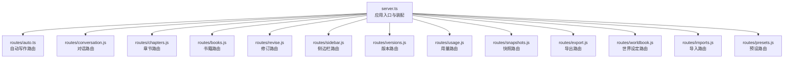
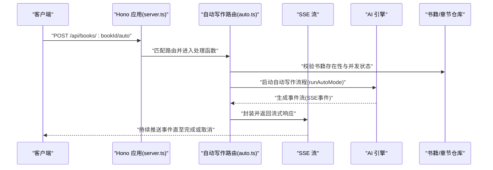
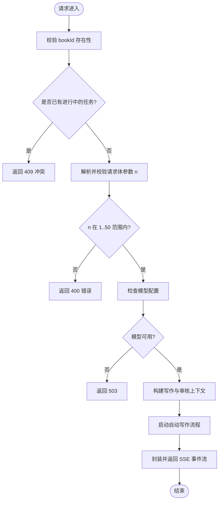
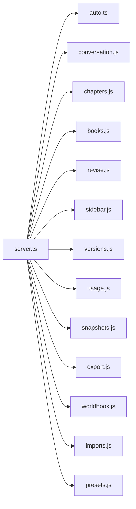

# HTTP路由系统

<cite>
**本文档引用的文件**
- [packages/server/src/http/server.ts](file://packages/server/src/http/server.ts)
- [packages/server/src/http/routes/auto.ts](file://packages/server/src/http/routes/auto.ts)
- [docs/_backups/20260604-162405/2026-06-04-scribe-mvp.md](file://docs/_backups/20260604-162405/2026-06-04-scribe-mvp.md)
- [docs/superpowers/plans/2026-06-04-scribe-mvp.md](file://docs/superpowers/plans/2026-06-04-scribe-mvp.md)
- [docs/superpowers/plans/2026-06-16-sillytavern-import.md](file://docs/superpowers/plans/2026-06-16-sillytavern-import.md)
</cite>

## 目录
1. [简介](#简介)
2. [项目结构](#项目结构)
3. [核心组件](#核心组件)
4. [架构总览](#架构总览)
5. [详细组件分析](#详细组件分析)
6. [依赖关系分析](#依赖关系分析)
7. [性能考虑](#性能考虑)
8. [故障排除指南](#故障排除指南)
9. [结论](#结论)

## 简介
本文件为 Scribe 项目的 HTTP 路由系统技术文档，聚焦于基于 Hono 的 RESTful API 设计与实现。文档从路由组织、资源命名、HTTP 方法映射、版本控制与模块化分组、中间件管道、请求验证、具体路由示例（CRUD、批量、文件上传）、以及性能优化与限流策略等方面进行全面阐述，并结合实际源码路径进行溯源。

## 项目结构
Scribe 的服务端采用多包工作区结构，HTTP 路由集中在 packages/server/src/http 下，通过 server.ts 统一装配各模块路由。主要目录与职责如下：
- packages/server/src/http/server.ts：应用入口与路由装配器，负责将各功能路由挂载到统一的 Hono 应用实例上。
- packages/server/src/http/routes/auto.ts：自动写作相关路由，包含 SSE 流式响应与并发控制。
- 文档资料中的路由示例：用于说明 API 命名规范与调用方式（如 /api/books/:bookId/conversation）。

图表来源
- [packages/server/src/http/server.ts:39-88](file://packages/server/src/http/server.ts#L39-L88)

章节来源
- [packages/server/src/http/server.ts:1-89](file://packages/server/src/http/server.ts#L1-L89)

## 核心组件
- Hono 应用实例：作为统一的路由容器，支持 GET/POST 等 HTTP 方法注册与中间件链路。
- 路由模块化：每个功能域（如 auto、books、chapters、conversation 等）独立定义路由并由 server.ts 统一挂载。
- 依赖注入：通过 createApp(deps) 将模型、仓库、配置等依赖注入到各路由模块，便于测试与扩展。
- 健康检查：/api/health 提供基础健康探测接口。

章节来源
- [packages/server/src/http/server.ts:39-88](file://packages/server/src/http/server.ts#L39-L88)

## 架构总览
下图展示了应用启动后路由装配与请求流转的关键节点：

图表来源
- [packages/server/src/http/server.ts:47-86](file://packages/server/src/http/server.ts#L47-L86)
- [packages/server/src/http/routes/auto.ts:32-226](file://packages/server/src/http/routes/auto.ts#L32-L226)

## 详细组件分析

### 自动写作路由（autoRoutes）
- 功能定位：提供书籍级别的自动写作能力，支持并发控制、参数校验、SSE 流式输出与成本统计。
- 关键点：
  - 资源命名：/api/books/:bookId/auto；取消接口 /api/books/:bookId/auto/cancel
  - 并发控制：使用 Map 记录每个 bookId 的 AbortController，避免重复任务
  - 参数校验：对请求体中的 n 进行范围校验（1-50 的整数）
  - 模型校验：若未配置模型则返回 503
  - 上下文构建：整合书籍设定、角色、大纲、规则等，注入写作与审核提示词
  - 成本统计：分别记录写入与审核阶段的用量与费用
  - 流式响应：通过 streamSseResponse 返回事件流，支持客户端断连自动取消

图表来源
- [packages/server/src/http/routes/auto.ts:37-215](file://packages/server/src/http/routes/auto.ts#L37-L215)

章节来源
- [packages/server/src/http/routes/auto.ts:1-231](file://packages/server/src/http/routes/auto.ts#L1-L231)

### 版本控制与模块化组织
- 版本控制：通过 routes/versions.js 提供版本信息查询接口，便于客户端识别服务端版本。
- 模块化组织：server.ts 使用 app.route("/", moduleRoutes(...)) 将各模块路由挂载到根路径，形成清晰的功能域划分。
- 条件装配：仅在具备必要依赖（如 bookRegistry）时才装配书籍相关路由，确保运行时环境满足条件。

章节来源
- [packages/server/src/http/server.ts:58-86](file://packages/server/src/http/server.ts#L58-L86)

### 请求验证机制
- 路径参数：使用 c.req.param("bookId") 获取路径参数，配合存在性检查防止无效 ID。
- 请求体：使用 c.req.json() 解析并捕获异常，随后对字段进行类型与范围校验（如 n 的整数与区间）。
- 业务规则：在执行前检查“建书信息完整性”与世界设定的充分性，避免低质量输入导致的无效计算。
- 模型可用性：在关键流程前检查模型配置，确保服务可用性。

章节来源
- [packages/server/src/http/routes/auto.ts:37-85](file://packages/server/src/http/routes/auto.ts#L37-L85)

### 中间件管道设计
- 认证中间件：当前路由未显示内置认证中间件，建议在 Hono 层级添加鉴权中间件以保护敏感接口。
- 日志中间件：建议在 app.use(...) 中间件层加入请求日志与耗时统计，便于问题排查与性能分析。
- 错误处理中间件：建议在路由层外包裹全局错误处理器，统一格式化错误响应并记录堆栈信息。
- 注意：以上为通用中间件设计建议，当前源码未体现具体实现，后续可在 server.ts 中扩展。

### 具体路由定义示例
- 健康检查：GET /api/health
- 对话管理：POST /api/books/:bookId/conversation（参考文档示例）
- 导入与预设：POST /api/books/:bookId/imports/preview、POST /api/books/:bookId/imports、GET/PUT 预设相关接口（参考文档示例）

章节来源
- [packages/server/src/http/server.ts:48](file://packages/server/src/http/server.ts#L48)
- [docs/_backups/20260604-162405/2026-06-04-scribe-mvp.md:456-468](file://docs/_backups/20260604-162405/2026-06-04-scribe-mvp.md#L456-L468)
- [docs/_backups/20260604-162405/2026-06-04-scribe-mvp.md:1630-1646](file://docs/_backups/20260604-162405/2026-06-04-scribe-mvp.md#L1630-L1646)
- [docs/superpowers/plans/2026-06-16-sillytavern-import.md:1108-1151](file://docs/superpowers/plans/2026-06-16-sillytavern-import.md#L1108-L1151)
- [docs/superpowers/plans/2026-06-16-sillytavern-import.md:2051-2103](file://docs/superpowers/plans/2026-06-16-sillytavern-import.md#L2051-L2103)

### 文件上传与批量处理
- 文件上传：建议在 exports 或 imports 模块中增加 multipart/form-data 接口，用于接收与处理大型文档或媒体文件。
- 批量处理：对导入/导出类接口支持批量操作时，应提供异步任务队列与进度查询接口，避免阻塞主线程。

## 依赖关系分析
- server.ts 作为装配中心，集中导入并挂载各模块路由，降低耦合度。
- auto.ts 依赖 BookRegistry 与 AI 引擎，通过依赖注入解耦底层实现。
- 路由间无直接循环依赖，符合模块化设计原则。

图表来源
- [packages/server/src/http/server.ts:4-16](file://packages/server/src/http/server.ts#L4-L16)

章节来源
- [packages/server/src/http/server.ts:39-88](file://packages/server/src/http/server.ts#L39-L88)

## 性能考虑
- 流式响应：自动写作使用 SSE 将事件逐步推送给客户端，减少一次性大响应带来的内存压力。
- 并发控制：通过 Map 记录进行中的任务，避免同一书籍的重复并发，提升稳定性。
- 成本统计：在事件流中实时记录 token 用量与费用，便于预算控制与审计。
- 缓存策略：建议在 AI 上下文构建与模型调用处引入缓存，降低重复计算开销。
- 限流机制：建议在 Hono 层添加基于 IP/用户/书籍维度的限流中间件，防止滥用与资源耗尽。

## 故障排除指南
- 404 书籍不存在：当 bookId 无效时返回 404，需检查前端传参与后端仓库一致性。
- 409 并发冲突：同一书籍已有进行中的自动写作，需等待或取消后再试。
- 400 参数错误：请求体参数不符合要求（如 n 不在 1-50），需修正请求格式。
- 503 模型未配置：未正确配置模型密钥或模型信息，需检查环境变量与配置文件。
- 断连处理：客户端断连会触发 AbortController，自动释放资源并终止任务。

章节来源
- [packages/server/src/http/routes/auto.ts:37-85](file://packages/server/src/http/routes/auto.ts#L37-L85)
- [packages/server/src/http/routes/auto.ts:217-223](file://packages/server/src/http/routes/auto.ts#L217-L223)

## 结论
Scribe 的 HTTP 路由系统以 Hono 为核心，采用模块化与依赖注入的设计理念，实现了清晰的功能域划分与良好的可扩展性。自动写作路由展示了参数校验、并发控制、SSE 流式响应与成本统计的完整闭环。建议后续补充认证、日志与错误处理中间件，并在导入/导出模块中完善文件上传与批量处理能力，同时引入缓存与限流策略以进一步提升性能与稳定性。