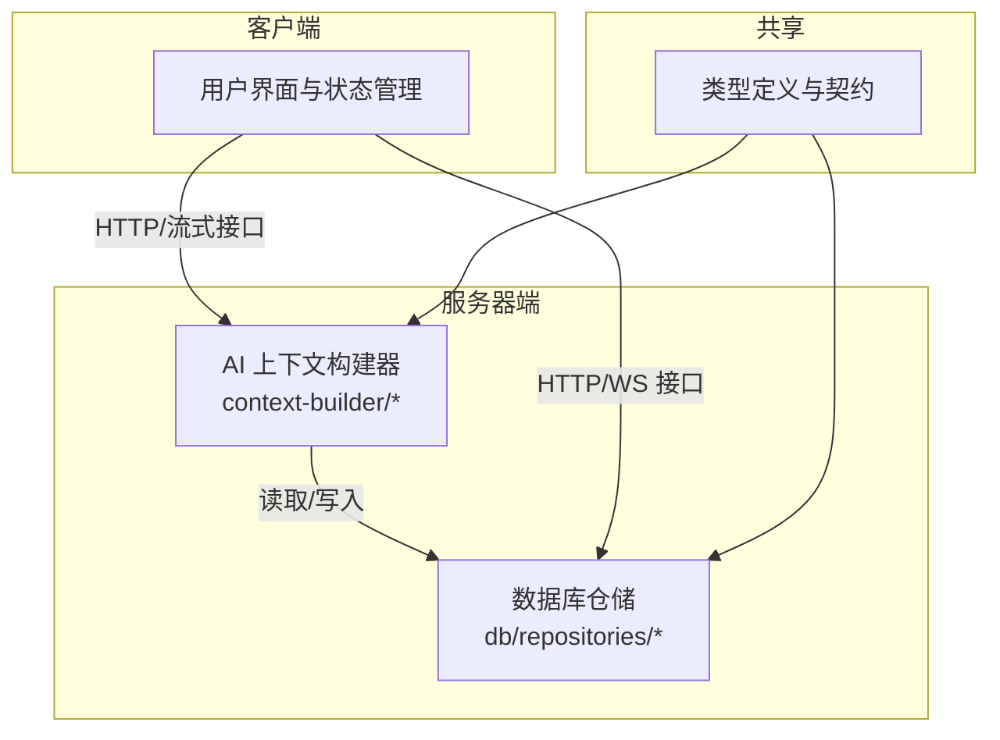
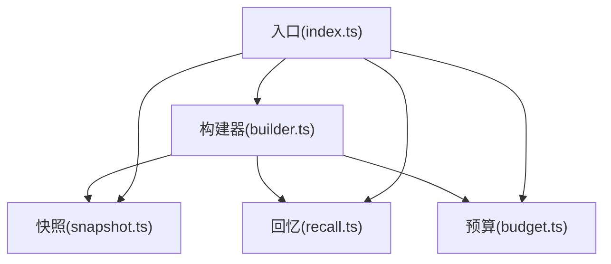
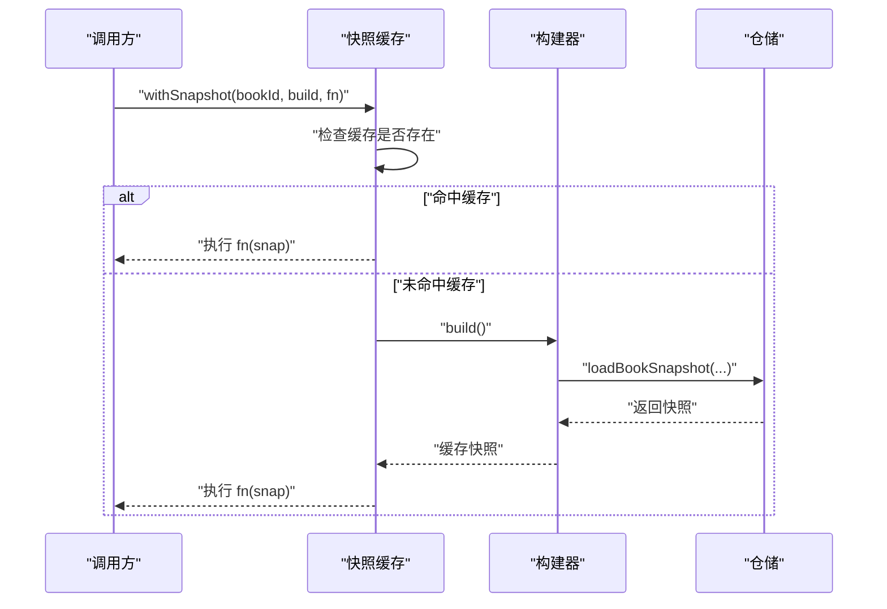
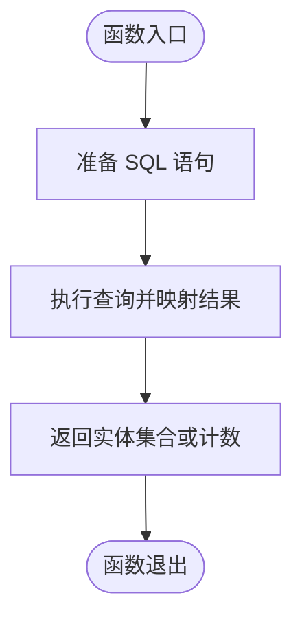
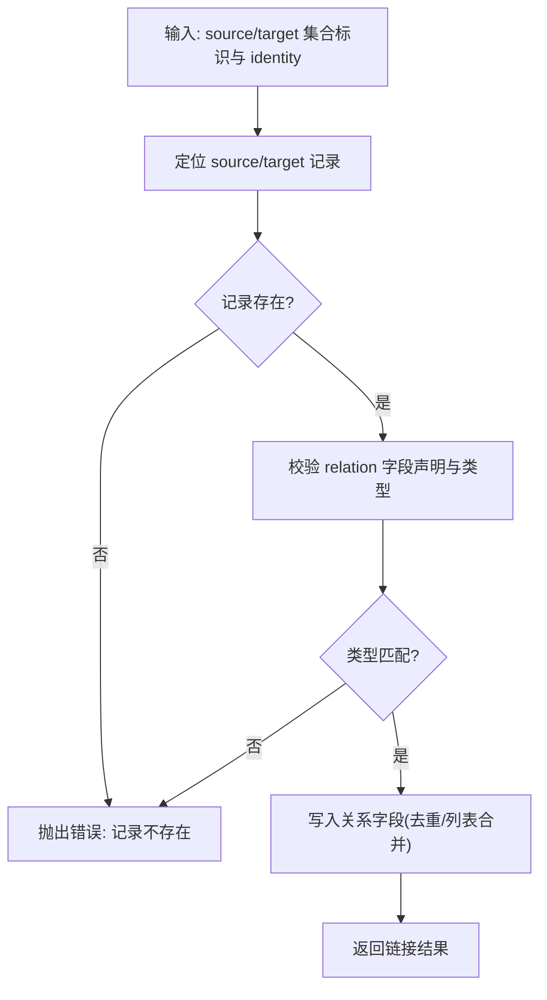
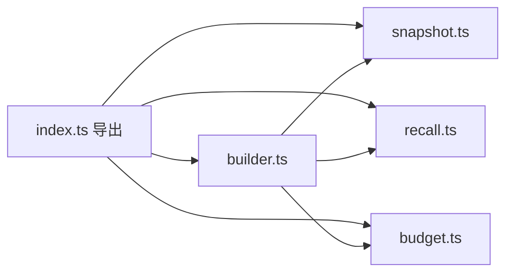

# 业务逻辑层

<cite>
**本文档引用的文件**
- [packages/server/src/db/repositories/conversations.ts](file://packages/server/src/db/repositories/conversations.ts)
- [packages/server/src/ai/context-builder/index.ts](file://packages/server/src/ai/context-builder/index.ts)
- [packages/server/src/ai/context-builder/snapshot.ts](file://packages/server/src/ai/context-builder/snapshot.ts)
- [packages/server/src/ai/context-builder/recall.ts](file://packages/server/src/ai/context-builder/recall.ts)
- [packages/server/src/ai/context-builder/builder.ts](file://packages/server/src/ai/context-builder/builder.ts)
- [packages/server/src/ai/context-builder/budget.ts](file://packages/server/src/ai/context-builder/budget.ts)
- [packages/server/tests/unit/db/repositories/books.test.ts](file://packages/server/tests/unit/db/repositories/books.test.ts)
- [packages/server/tests/unit/ai/context-builder/snapshot.test.ts](file://packages/server/tests/unit/ai/context-builder/snapshot.test.ts)
- [docs/superpowers/plans/2026-06-15-generic-record-architecture.md](file://docs/superpowers/plans/2026-06-15-generic-record-architecture.md)
- [tsconfig.base.json](file://tsconfig.base.json)
</cite>

## 目录
1. [引言](#引言)
2. [项目结构](#项目结构)
3. [核心组件](#核心组件)
4. [架构总览](#架构总览)
5. [详细组件分析](#详细组件分析)
6. [依赖分析](#依赖分析)
7. [性能考虑](#性能考虑)
8. [故障排除指南](#故障排除指南)
9. [结论](#结论)
10. [附录](#附录)

## 引言
本文件聚焦于 Scribe 业务逻辑层的架构与实现，围绕以下目标展开：服务类设计模式（领域服务、应用服务、基础设施服务）、依赖注入容器配置与使用、事务管理机制（数据库事务、分布式事务与补偿）、数据访问层设计（仓储模式、查询对象、缓存策略）、业务用例示例（复杂流程与异常处理）、服务间通信与异步任务、以及单元测试策略与模拟对象。本文在不直接粘贴代码的前提下，通过“章节来源”与“图表来源”定位到仓库中的具体实现位置，帮助读者快速定位到真实代码。

## 项目结构
Scribe 采用多包工作区组织，业务逻辑主要位于 packages/server 下，客户端与共享模块分别位于 packages/client 与 packages/shared。服务器端包含 AI 上下文构建器与数据库仓储两大业务域，配合测试用例验证行为。

**图表来源**
- [packages/server/src/ai/context-builder/index.ts:1-4](file://packages/server/src/ai/context-builder/index.ts#L1-L4)
- [packages/server/src/db/repositories/conversations.ts:40-63](file://packages/server/src/db/repositories/conversations.ts#L40-L63)

**章节来源**
- [tsconfig.base.json:1-15](file://tsconfig.base.json#L1-L15)

## 核心组件
- AI 上下文构建器：负责从书籍快照、回忆与预算等维度构建写作上下文，支持缓存与失效控制。
- 数据库仓储：提供对话消息等实体的持久化操作，封装 SQL 查询与映射。
- 测试套件：覆盖仓储增删改查与上下文缓存行为，确保业务正确性与性能预期。

**章节来源**
- [packages/server/src/ai/context-builder/snapshot.ts:125-144](file://packages/server/src/ai/context-builder/snapshot.ts#L125-L144)
- [packages/server/src/db/repositories/conversations.ts:40-63](file://packages/server/src/db/repositories/conversations.ts#L40-L63)
- [packages/server/tests/unit/db/repositories/books.test.ts:35-47](file://packages/server/tests/unit/db/repositories/books.test.ts#L35-L47)
- [packages/server/tests/unit/ai/context-builder/snapshot.test.ts:130-170](file://packages/server/tests/unit/ai/context-builder/snapshot.test.ts#L130-L170)

## 架构总览
业务逻辑层以“上下文构建 + 数据访问”为核心，通过模块化导出与测试驱动保障稳定性。AI 上下文构建器内部聚合快照、回忆、预算与构建器，形成可复用的上下文生成能力；数据库仓储提供统一的数据访问接口，便于事务与缓存策略落地。

**图表来源**
- [packages/server/src/ai/context-builder/index.ts:1-4](file://packages/server/src/ai/context-builder/index.ts#L1-L4)
- [packages/server/src/ai/context-builder/builder.ts](file://packages/server/src/ai/context-builder/builder.ts)
- [packages/server/src/ai/context-builder/snapshot.ts](file://packages/server/src/ai/context-builder/snapshot.ts)
- [packages/server/src/ai/context-builder/recall.ts](file://packages/server/src/ai/context-builder/recall.ts)
- [packages/server/src/ai/context-builder/budget.ts](file://packages/server/src/ai/context-builder/budget.ts)

## 详细组件分析

### 组件一：AI 上下文构建器（上下文生成）
- 职责划分
  - 领域服务：根据书籍快照、回忆与预算生成写作上下文，保证上下文一致性与成本控制。
  - 应用服务：协调构建流程，暴露 withSnapshot 缓存与 invalidate 失效能力。
  - 基础设施服务：依赖仓储与路径工具加载与更新数据。
- 关键行为
  - 快照缓存：同一 bookId 在同周期内仅构建一次，避免重复开销。
  - 失效策略：显式调用 invalidate 后重新构建。
  - 不同 bookId 各自缓存，互不影响。
- 复杂流程示意

**图表来源**
- [packages/server/src/ai/context-builder/snapshot.ts:125-144](file://packages/server/src/ai/context-builder/snapshot.ts#L125-L144)
- [packages/server/tests/unit/ai/context-builder/snapshot.test.ts:130-170](file://packages/server/tests/unit/ai/context-builder/snapshot.test.ts#L130-L170)

**章节来源**
- [packages/server/src/ai/context-builder/snapshot.ts:125-144](file://packages/server/src/ai/context-builder/snapshot.ts#L125-L144)
- [packages/server/tests/unit/ai/context-builder/snapshot.test.ts:130-170](file://packages/server/tests/unit/ai/context-builder/snapshot.test.ts#L130-L170)

### 组件二：数据库仓储（对话消息）
- 职责划分
  - 领域服务：封装对话消息的 CRUD 操作，提供列表、计数与时间窗口查询。
  - 基础设施服务：基于 SQL 实现数据持久化，屏蔽底层存储细节。
- 关键行为
  - 列表与计数：提供最新消息列表与总数统计。
  - 时间窗口查询：按时间戳筛选增量消息。
- 复杂流程示意

**图表来源**
- [packages/server/src/db/repositories/conversations.ts:40-63](file://packages/server/src/db/repositories/conversations.ts#L40-L63)

**章节来源**
- [packages/server/src/db/repositories/conversations.ts:40-63](file://packages/server/src/db/repositories/conversations.ts#L40-L63)

### 组件三：通用记录架构（跨模块设计）
- 设计理念
  - 无硬编码领域分类，AI 可动态创建任意记录集合，定义字段、演进模式、去重与关系链接。
  - 关系通过声明式字段与通用链接工具维护，本地仅做声明与引用校验。
- 关键能力
  - 通用链接工具：按 source/target 集合的 identityFields 定位两端记录，写入 relation 字段。
  - 类型约束：支持单值与列表两种关系类型，并进行引用类型校验。
- 业务流程示意

**图表来源**
- [docs/superpowers/plans/2026-06-15-generic-record-architecture.md:911-950](file://docs/superpowers/plans/2026-06-15-generic-record-architecture.md#L911-L950)

**章节来源**
- [docs/superpowers/plans/2026-06-15-generic-record-architecture.md:13-23](file://docs/superpowers/plans/2026-06-15-generic-record-architecture.md#L13-L23)
- [docs/superpowers/plans/2026-06-15-generic-record-architecture.md:911-950](file://docs/superpowers/plans/2026-06-15-generic-record-architecture.md#L911-L950)

## 依赖分析
- 模块耦合
  - AI 上下文构建器通过 index.ts 聚合导出，降低上层对内部实现的耦合。
  - 仓储模块与 AI 构建器之间为单向依赖，由构建器调用仓储加载数据。
- 生命周期与循环依赖
  - 通过工厂函数与模块化导出避免循环依赖；缓存实例在 withSnapshot 内部管理，不暴露到模块边界。
- 外部依赖
  - TypeScript 编译配置统一，确保严格类型检查与模块解析策略一致。

**图表来源**
- [packages/server/src/ai/context-builder/index.ts:1-4](file://packages/server/src/ai/context-builder/index.ts#L1-L4)

**章节来源**
- [tsconfig.base.json:1-15](file://tsconfig.base.json#L1-L15)

## 性能考虑
- 缓存策略
  - 快照缓存按 bookId 分片，同一周期内仅构建一次，显著降低重复计算成本。
  - 失效后重建，保证数据新鲜度与一致性。
- 查询优化
  - 仓储提供时间窗口查询与计数接口，减少不必要的全量扫描。
- 并发与线程安全
  - 缓存使用 Map 结构，建议在并发场景下配合锁或不可变快照策略，避免竞态条件。

**章节来源**
- [packages/server/src/ai/context-builder/snapshot.ts:125-144](file://packages/server/src/ai/context-builder/snapshot.ts#L125-L144)
- [packages/server/tests/unit/ai/context-builder/snapshot.test.ts:130-170](file://packages/server/tests/unit/ai/context-builder/snapshot.test.ts#L130-L170)
- [packages/server/src/db/repositories/conversations.ts:40-63](file://packages/server/src/db/repositories/conversations.ts#L40-L63)

## 故障排除指南
- 仓储操作失败
  - 现象：删除后获取返回未定义、累加成本不正确。
  - 排查：确认事务提交与 ID 生成策略；核对映射函数与查询条件。
- 上下文缓存异常
  - 现象：缓存未生效、失效后未重建、不同 bookId 共享缓存。
  - 排查：检查 withSnapshot 的 bookId 参数、invalidate 调用时机与缓存键策略。
- 通用链接工具报错
  - 现象：集合未找到、字段未声明、引用类型不匹配。
  - 排查：核对集合名称、identityFields 与 relation 字段声明、目标集合类型。

**章节来源**
- [packages/server/tests/unit/db/repositories/books.test.ts:35-47](file://packages/server/tests/unit/db/repositories/books.test.ts#L35-L47)
- [packages/server/tests/unit/ai/context-builder/snapshot.test.ts:130-170](file://packages/server/tests/unit/ai/context-builder/snapshot.test.ts#L130-L170)
- [docs/superpowers/plans/2026-06-15-generic-record-architecture.md:911-950](file://docs/superpowers/plans/2026-06-15-generic-record-architecture.md#L911-L950)

## 结论
Scribe 业务逻辑层通过清晰的服务分层与模块化设计，实现了可扩展的上下文构建与稳定的数据访问。AI 上下文构建器的缓存机制与仓储查询接口共同支撑了高吞吐与低延迟的业务场景。未来可在依赖注入容器、分布式事务与补偿机制方面进一步完善，以满足更复杂的生产需求。

## 附录
- 术语
  - 领域服务：封装核心业务规则与流程。
  - 应用服务：编排业务用例，协调多个领域服务。
  - 基础设施服务：提供技术能力（如缓存、数据库、消息队列）。
- 最佳实践
  - 使用工厂与模块化导出避免循环依赖。
  - 将缓存与事务边界明确化，确保一致性与性能平衡。
  - 通过测试用例覆盖关键路径与边界条件。