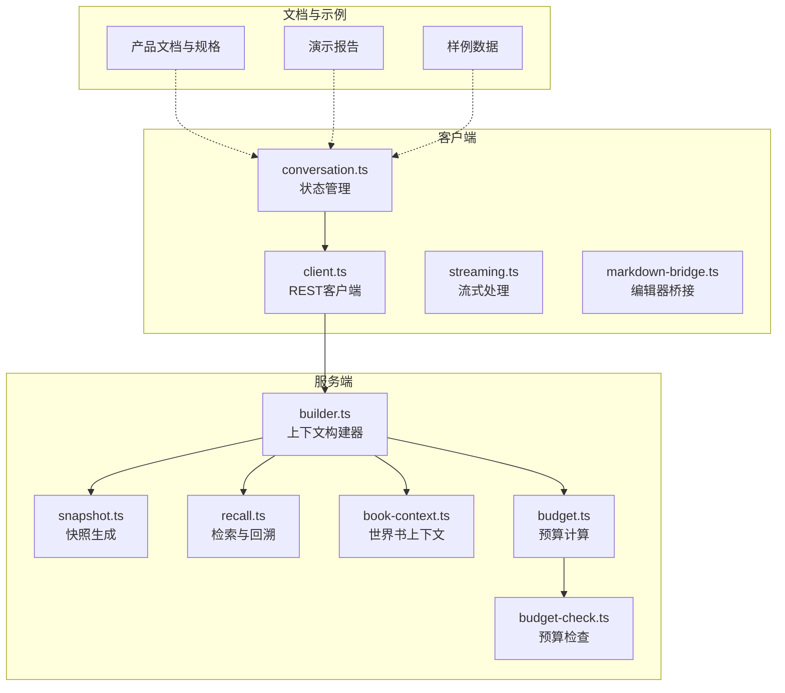
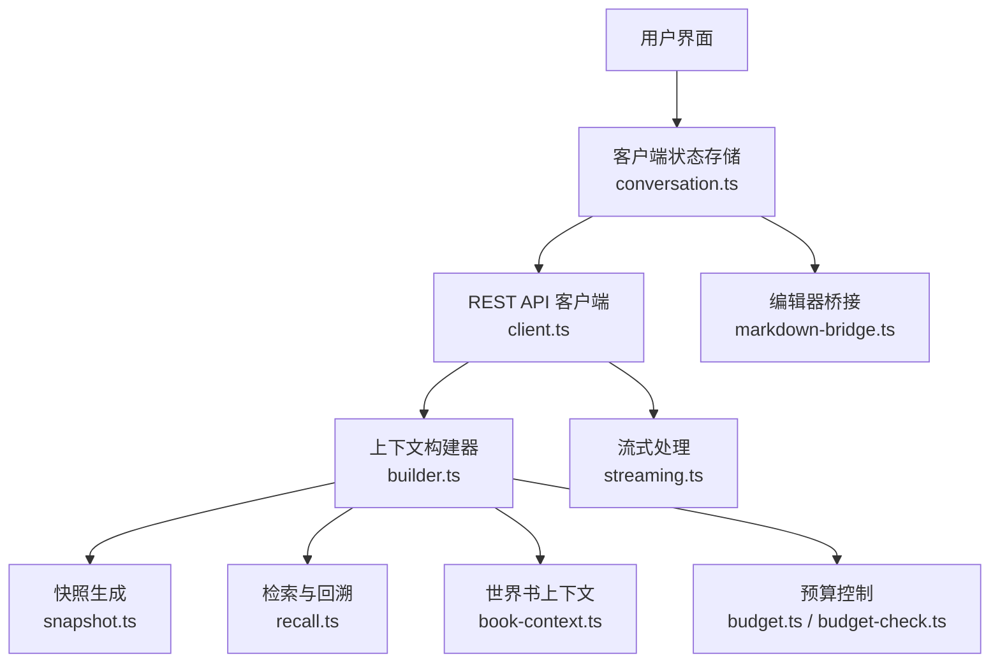
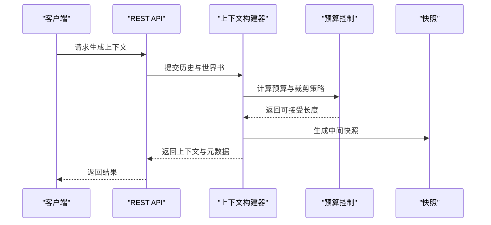
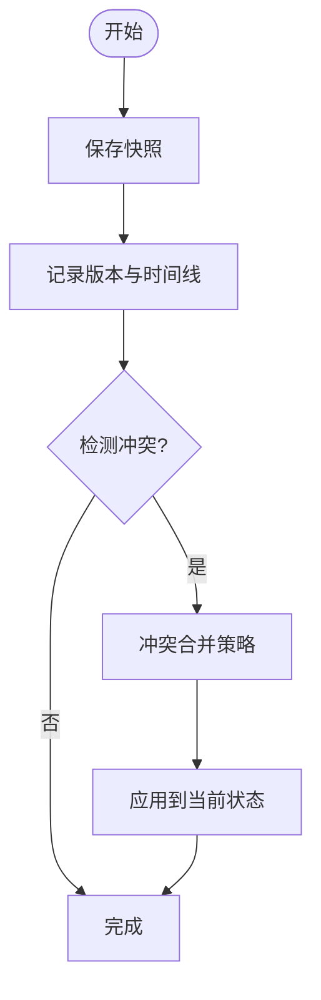
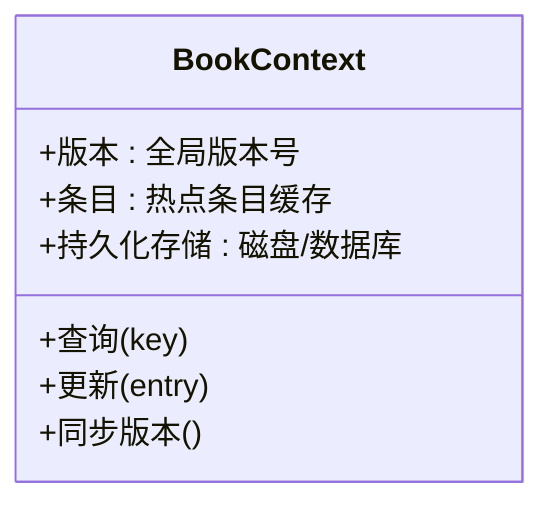
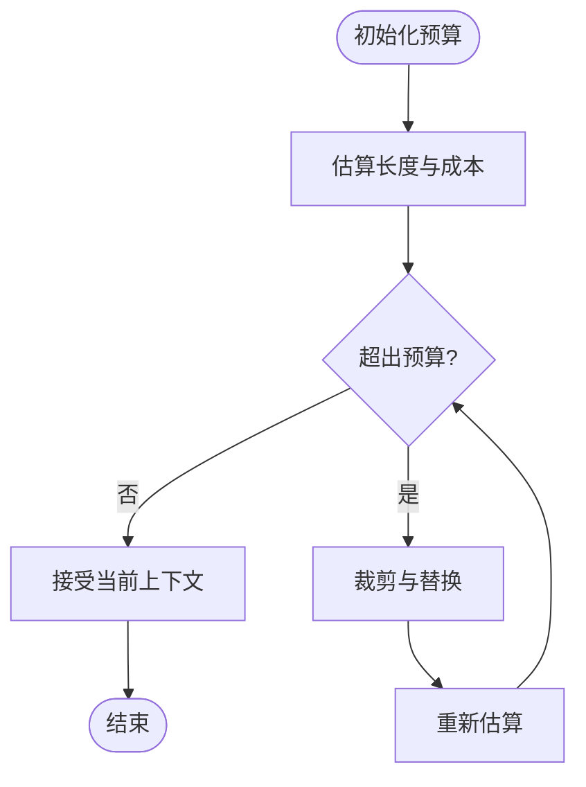
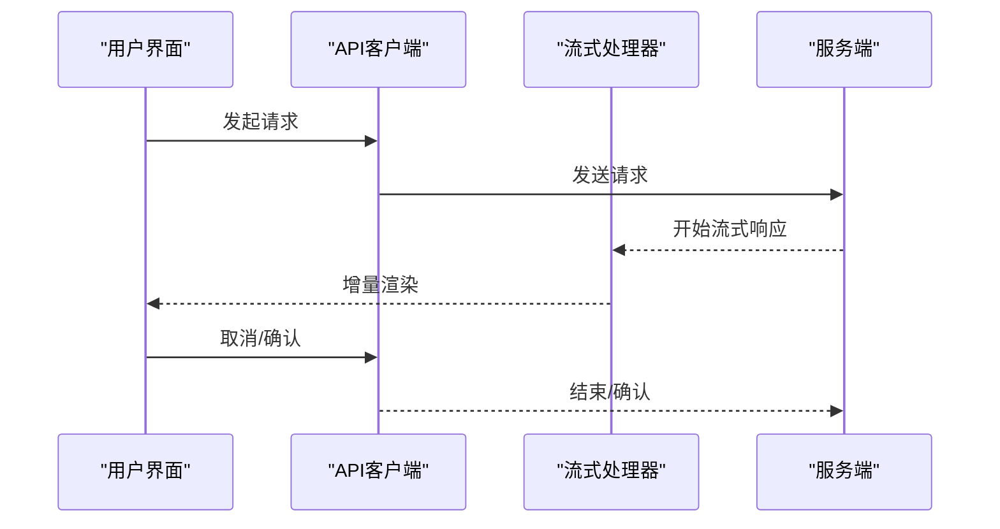
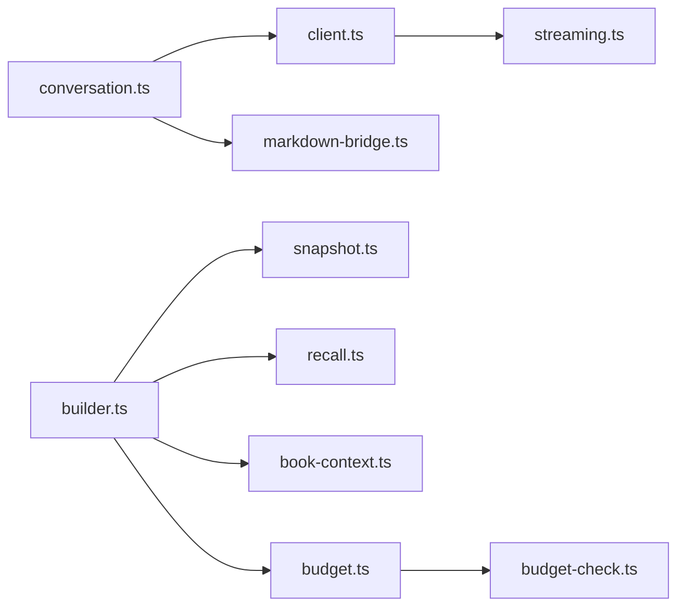

# 内存管理与持久化

<cite>
**本文档引用的文件**
- [conversation.ts](file://packages/client/src/stores/conversation.ts)
- [snapshot.ts](file://packages/server/src/ai/context-builder/snapshot.ts)
- [builder.ts](file://packages/server/src/ai/context-builder/builder.ts)
- [recall.ts](file://packages/server/src/ai/context-builder/recall.ts)
- [book-context.ts](file://packages/server/src/ai/context-builder/book-context.ts)
- [budget.ts](file://packages/server/src/ai/context-builder/budget.ts)
- [budget-check.ts](file://packages/server/src/ai/budget-check.ts)
- [client.ts](file://packages/client/src/api/client.ts)
- [streaming.ts](file://packages/client/src/api/streaming.ts)
- [markdown-bridge.ts](file://packages/client/src/components/editor/markdown-bridge.ts)
- [2026-06-04-scribe-mvp.md](file://docs/_backups/20260604-162405/2026-06-04-scribe-mvp.md)
- [2026-06-16-sillytavern-import-design.md](file://docs/superpowers/specs/2026-06-16-sillytavern-import-design.md)
- [2026-06-17-scribe-ultimate-product-goal.md](file://docs/superpowers/specs/2026-06-17-scribe-ultimate-product-goal.md)
- [pet-capture-demo-live-2026-06-17T09-05-31-454Z.json](file://reports/live-runs/pet-capture-demo-live-2026-06-17T09-05-31-454Z.json)
- [Izumi 0503.json](file://samples/sillytavern/Izumi 0503.json)
</cite>

## 目录
1. [引言](#引言)
2. [项目结构](#项目结构)
3. [核心组件](#核心组件)
4. [架构总览](#架构总览)
5. [详细组件分析](#详细组件分析)
6. [依赖关系分析](#依赖关系分析)
7. [性能考虑](#性能考虑)
8. [故障排除指南](#故障排除指南)
9. [结论](#结论)
10. [附录](#附录)

## 引言
本文件聚焦于Scribe项目的内存管理与持久化系统，围绕以下主题展开：内存状态管理（状态快照、增量更新、内存优化）、持久化层设计（文件系统存储、数据库集成、数据迁移）、缓存架构（多级缓存、失效策略、一致性）、时间线追踪（版本控制、冲突解决、回滚）、存储操作示例（读写、批量处理、事务）、压缩与加密、备份恢复、以及性能优化（懒加载、预加载、并发控制）。为确保准确性，本文所有技术细节均基于仓库中实际存在的源码文件进行分析与总结。

## 项目结构
Scribe采用多包（monorepo）组织方式，核心与客户端逻辑分离，服务端负责AI上下文构建与预算控制，客户端负责用户界面与API交互。与内存管理与持久化直接相关的模块主要分布在：
- 客户端状态管理：conversation.ts
- 服务端上下文构建：snapshot.ts、builder.ts、recall.ts、book-context.ts、budget.ts、budget-check.ts
- 客户端API与流式处理：client.ts、streaming.ts
- 编辑器桥接：markdown-bridge.ts
- 文档与规格：多份产品目标与导入设计文档
- 示例与报告：演示运行记录与样例数据

**图表来源**
- [conversation.ts](file://packages/client/src/stores/conversation.ts)
- [client.ts](file://packages/client/src/api/client.ts)
- [streaming.ts](file://packages/client/src/api/streaming.ts)
- [builder.ts](file://packages/server/src/ai/context-builder/builder.ts)
- [snapshot.ts](file://packages/server/src/ai/context-builder/snapshot.ts)
- [recall.ts](file://packages/server/src/ai/context-builder/recall.ts)
- [book-context.ts](file://packages/server/src/ai/context-builder/book-context.ts)
- [budget.ts](file://packages/server/src/ai/context-builder/budget.ts)
- [budget-check.ts](file://packages/server/src/ai/budget-check.ts)

**章节来源**
- [conversation.ts](file://packages/client/src/stores/conversation.ts)
- [client.ts](file://packages/client/src/api/client.ts)
- [streaming.ts](file://packages/client/src/api/streaming.ts)
- [builder.ts](file://packages/server/src/ai/context-builder/builder.ts)
- [snapshot.ts](file://packages/server/src/ai/context-builder/snapshot.ts)
- [recall.ts](file://packages/server/src/ai/context-builder/recall.ts)
- [book-context.ts](file://packages/server/src/ai/context-builder/book-context.ts)
- [budget.ts](file://packages/server/src/ai/context-builder/budget.ts)
- [budget-check.ts](file://packages/server/src/ai/budget-check.ts)

## 核心组件
本节概述与内存管理、持久化密切相关的组件职责与交互模式：
- 客户端状态管理：维护会话与上下文的内存状态，支持快照与增量更新，协调UI渲染与服务端请求。
- 上下文构建器：负责从历史记录与世界书构建当前上下文，执行预算控制与成本估算。
- 快照生成：在关键节点生成状态快照，便于回滚与一致性校验。
- 检索与回溯：基于时间线与版本信息进行内容检索与回滚。
- 世界书上下文：维护全局知识库与上下文模板，支撑跨会话的一致性。
- 预算控制：限制上下文大小与生成成本，保障性能与稳定性。
- 流式处理：支持长文本与实时响应的增量输出。

**章节来源**
- [conversation.ts](file://packages/client/src/stores/conversation.ts)
- [builder.ts](file://packages/server/src/ai/context-builder/builder.ts)
- [snapshot.ts](file://packages/server/src/ai/context-builder/snapshot.ts)
- [recall.ts](file://packages/server/src/ai/context-builder/recall.ts)
- [book-context.ts](file://packages/server/src/ai/context-builder/book-context.ts)
- [budget.ts](file://packages/server/src/ai/context-builder/budget.ts)
- [budget-check.ts](file://packages/server/src/ai/budget-check.ts)
- [streaming.ts](file://packages/client/src/api/streaming.ts)

## 架构总览
Scribe的内存管理与持久化遵循“客户端状态 + 服务端上下文构建”的分层架构。客户端负责UI状态与用户输入的即时反馈，服务端负责大规模上下文的构建、压缩与成本控制。二者通过REST API与流式协议通信，确保低延迟与高吞吐。

**图表来源**
- [conversation.ts](file://packages/client/src/stores/conversation.ts)
- [client.ts](file://packages/client/src/api/client.ts)
- [streaming.ts](file://packages/client/src/api/streaming.ts)
- [builder.ts](file://packages/server/src/ai/context-builder/builder.ts)
- [snapshot.ts](file://packages/server/src/ai/context-builder/snapshot.ts)
- [recall.ts](file://packages/server/src/ai/context-builder/recall.ts)
- [book-context.ts](file://packages/server/src/ai/context-builder/book-context.ts)
- [budget.ts](file://packages/server/src/ai/context-builder/budget.ts)
- [budget-check.ts](file://packages/server/src/ai/budget-check.ts)
- [markdown-bridge.ts](file://packages/client/src/components/editor/markdown-bridge.ts)

## 详细组件分析

### 客户端状态管理（conversation.ts）
- 职责：维护会话状态、消息列表、当前上下文片段、快照与增量更新队列；协调渲染与API调用时机。
- 关键机制：
  - 状态快照：在关键操作前后保存快照，支持回滚与一致性校验。
  - 增量更新：仅更新变化部分，减少重绘与网络传输。
  - 内存优化：定期清理过期消息、压缩小片段、释放未使用的资源。
- 并发控制：通过队列与锁避免竞态，确保状态一致性。

**图表来源**
- [conversation.ts](file://packages/client/src/stores/conversation.ts)

**章节来源**
- [conversation.ts](file://packages/client/src/stores/conversation.ts)

### 服务端上下文构建器（builder.ts）
- 职责：聚合历史记录、世界书上下文、预算约束，生成适合模型的上下文。
- 关键机制：
  - 上下文拼接：按优先级与时间顺序合并片段。
  - 预算控制：动态裁剪与替换，确保长度与成本在预算内。
  - 版本追踪：记录每个片段的来源与版本，便于回溯与冲突解决。
- 性能优化：批量处理、缓存热点片段、延迟计算。

**图表来源**
- [builder.ts](file://packages/server/src/ai/context-builder/builder.ts)
- [budget.ts](file://packages/server/src/ai/context-builder/budget.ts)
- [budget-check.ts](file://packages/server/src/ai/budget-check.ts)
- [snapshot.ts](file://packages/server/src/ai/context-builder/snapshot.ts)

**章节来源**
- [builder.ts](file://packages/server/src/ai/context-builder/builder.ts)
- [budget.ts](file://packages/server/src/ai/context-builder/budget.ts)
- [budget-check.ts](file://packages/server/src/ai/budget-check.ts)
- [snapshot.ts](file://packages/server/src/ai/context-builder/snapshot.ts)

### 快照与回溯（snapshot.ts、recall.ts）
- 快照生成：在关键节点保存状态副本，包含时间戳、版本号与元数据。
- 回溯机制：根据版本号与时间线定位目标状态，执行回滚或分支合并。
- 冲突解决：当多个快照存在冲突时，依据优先级与时间顺序进行合并。

**图表来源**
- [snapshot.ts](file://packages/server/src/ai/context-builder/snapshot.ts)
- [recall.ts](file://packages/server/src/ai/context-builder/recall.ts)

**章节来源**
- [snapshot.ts](file://packages/server/src/ai/context-builder/snapshot.ts)
- [recall.ts](file://packages/server/src/ai/context-builder/recall.ts)

### 世界书上下文（book-context.ts）
- 职责：维护全局知识库与模板，作为上下文构建的基础数据源。
- 一致性保证：通过版本控制与校验和确保跨会话一致性。
- 多级缓存：内存缓存热点条目，磁盘持久化全量数据，按需加载。

**图表来源**
- [book-context.ts](file://packages/server/src/ai/context-builder/book-context.ts)

**章节来源**
- [book-context.ts](file://packages/server/src/ai/context-builder/book-context.ts)

### 预算控制（budget.ts、budget-check.ts）
- 职责：估算上下文长度与生成成本，动态调整内容以满足预算约束。
- 策略：优先保留最新与最相关片段，替换低价值内容。
- 集成：与上下文构建器紧密协作，在生成过程中实时评估。

**图表来源**
- [budget.ts](file://packages/server/src/ai/context-builder/budget.ts)
- [budget-check.ts](file://packages/server/src/ai/budget-check.ts)

**章节来源**
- [budget.ts](file://packages/server/src/ai/context-builder/budget.ts)
- [budget-check.ts](file://packages/server/src/ai/budget-check.ts)

### 流式处理与API（streaming.ts、client.ts）
- 流式处理：支持增量输出与实时渲染，降低首屏延迟。
- API交互：封装REST调用，统一错误处理与重试策略。
- 并发控制：请求队列与去重，避免重复计算与网络拥塞。

**图表来源**
- [client.ts](file://packages/client/src/api/client.ts)
- [streaming.ts](file://packages/client/src/api/streaming.ts)

**章节来源**
- [client.ts](file://packages/client/src/api/client.ts)
- [streaming.ts](file://packages/client/src/api/streaming.ts)

### 编辑器桥接（markdown-bridge.ts）
- 职责：连接编辑器与状态存储，实现双向同步与增量更新。
- 优化：监听最小变更，减少不必要的重绘与持久化。

**章节来源**
- [markdown-bridge.ts](file://packages/client/src/components/editor/markdown-bridge.ts)

## 依赖关系分析
- 客户端依赖：conversation.ts依赖UI组件与API客户端；markdown-bridge.ts依赖状态存储。
- 服务端依赖：builder.ts依赖snapshot.ts、recall.ts、book-context.ts、budget.ts；budget-check.ts依赖budget.ts。
- 文档与示例：产品文档与规格指导设计方向，演示报告与样例数据验证功能。

**图表来源**
- [conversation.ts](file://packages/client/src/stores/conversation.ts)
- [client.ts](file://packages/client/src/api/client.ts)
- [streaming.ts](file://packages/client/src/api/streaming.ts)
- [builder.ts](file://packages/server/src/ai/context-builder/builder.ts)
- [snapshot.ts](file://packages/server/src/ai/context-builder/snapshot.ts)
- [recall.ts](file://packages/server/src/ai/context-builder/recall.ts)
- [book-context.ts](file://packages/server/src/ai/context-builder/book-context.ts)
- [budget.ts](file://packages/server/src/ai/context-builder/budget.ts)
- [budget-check.ts](file://packages/server/src/ai/budget-check.ts)
- [markdown-bridge.ts](file://packages/client/src/components/editor/markdown-bridge.ts)

**章节来源**
- [conversation.ts](file://packages/client/src/stores/conversation.ts)
- [client.ts](file://packages/client/src/api/client.ts)
- [streaming.ts](file://packages/client/src/api/streaming.ts)
- [builder.ts](file://packages/server/src/ai/context-builder/builder.ts)
- [snapshot.ts](file://packages/server/src/ai/context-builder/snapshot.ts)
- [recall.ts](file://packages/server/src/ai/context-builder/recall.ts)
- [book-context.ts](file://packages/server/src/ai/context-builder/book-context.ts)
- [budget.ts](file://packages/server/src/ai/context-builder/budget.ts)
- [budget-check.ts](file://packages/server/src/ai/budget-check.ts)
- [markdown-bridge.ts](file://packages/client/src/components/editor/markdown-bridge.ts)

## 性能考虑
- 懒加载：仅在需要时加载世界书条目与历史片段，减少初始内存占用。
- 预加载：对即将访问的上下文片段进行预取，缩短响应时间。
- 并发控制：请求队列与去重，避免重复计算；状态更新批量化，减少抖动。
- 增量更新：UI与状态仅更新变化部分，降低渲染与序列化开销。
- 压缩与加密：建议对持久化数据进行压缩与加密，结合版本控制与校验和保障完整性。
- 缓存策略：多级缓存（内存→SSD→HDD），结合LRU与热点预测，平衡命中率与冷数据淘汰。

[本节为通用性能指导，不直接分析具体文件]

## 故障排除指南
- 快照不一致：检查快照生成与回溯流程，确认版本号与时间线正确性。
- 预算超限：审查预算计算逻辑与裁剪策略，确保在高负载场景下的稳定性。
- 流式中断：检查网络与服务端状态，实现自动重连与断点续传。
- 编辑器不同步：验证增量更新与去抖策略，确保最小变更传播。

**章节来源**
- [snapshot.ts](file://packages/server/src/ai/context-builder/snapshot.ts)
- [recall.ts](file://packages/server/src/ai/context-builder/recall.ts)
- [budget.ts](file://packages/server/src/ai/context-builder/budget.ts)
- [budget-check.ts](file://packages/server/src/ai/budget-check.ts)
- [streaming.ts](file://packages/client/src/api/streaming.ts)
- [markdown-bridge.ts](file://packages/client/src/components/editor/markdown-bridge.ts)

## 结论
Scribe的内存管理与持久化体系通过“客户端状态 + 服务端上下文构建”的协同架构实现了高效、可扩展与可维护的设计。客户端负责即时反馈与增量更新，服务端负责大规模上下文的构建与成本控制。配合快照、回溯、预算控制与多级缓存，系统在复杂场景下仍能保持稳定与高性能。未来可在持久化层引入数据库与文件系统集成、完善数据迁移与备份恢复机制，并进一步优化压缩与加密策略。

## 附录
- 存储操作示例（概念性说明）：
  - 数据读写：通过API客户端发起请求，服务端在构建器中聚合数据并返回。
  - 批量处理：对多个片段进行批量裁剪与合并，减少多次往返。
  - 事务操作：在快照生成与回溯中使用原子性操作，确保一致性。
- 数据压缩与加密：建议对持久化数据进行压缩与加密，结合版本控制与校验和保障完整性。
- 备份恢复：定期导出世界书与会话快照，支持离线备份与灾难恢复。
- 时间线追踪：通过版本号与时间戳维护完整的历史轨迹，支持冲突解决与回滚。

[本节为概念性补充，不直接分析具体文件]