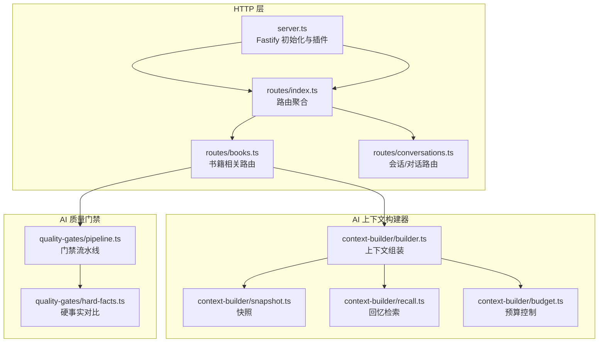
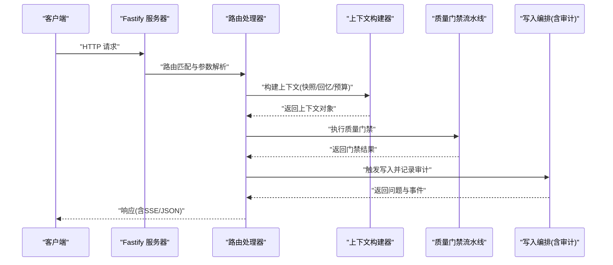
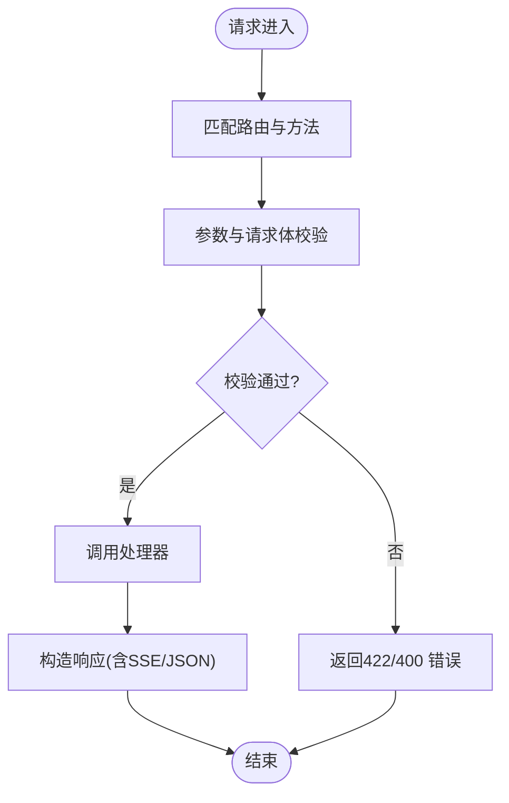
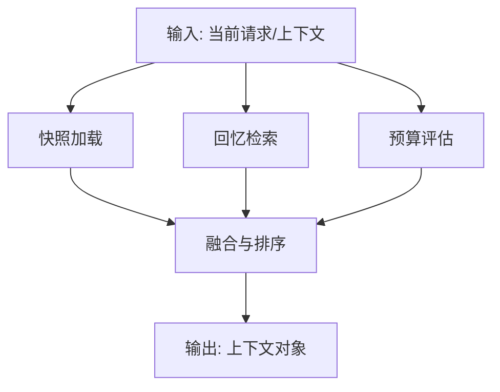
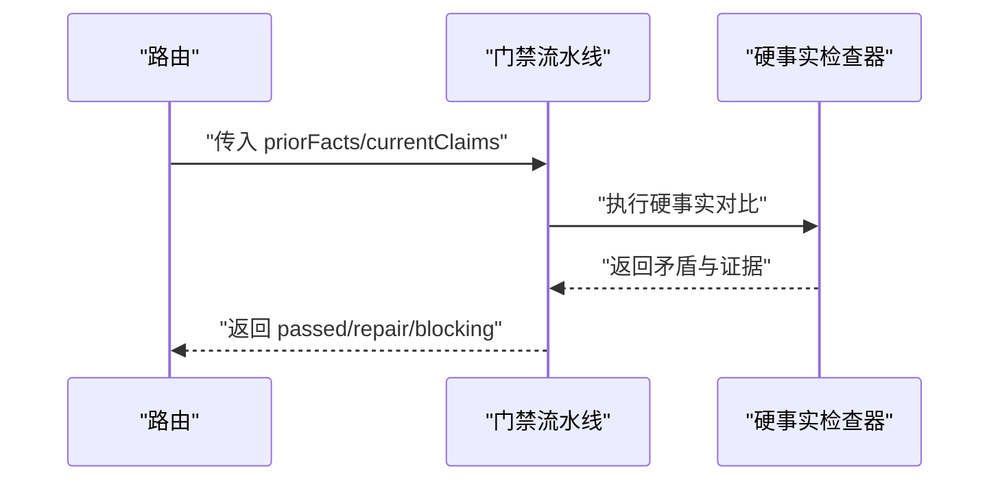
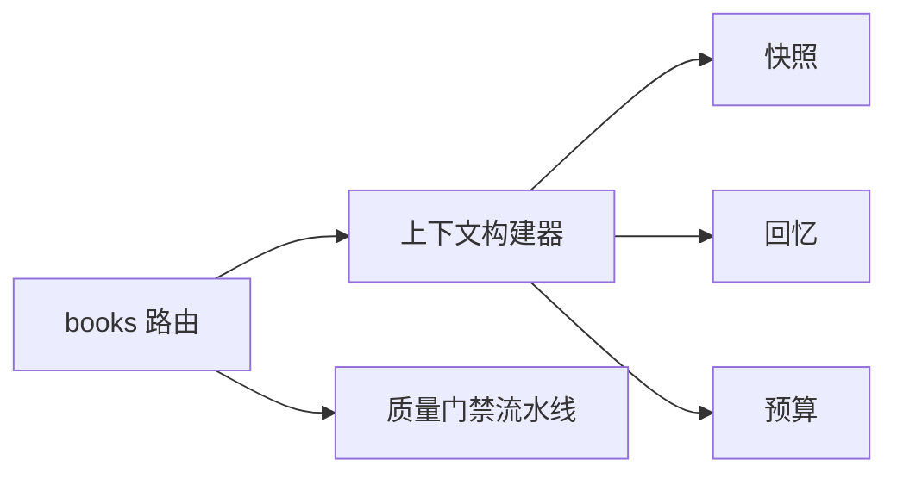

# 后端架构

<cite>
**本文引用的文件**
- [packages/server/src/http/server.ts](file://packages/server/src/http/server.ts)
- [packages/server/src/http/routes/index.ts](file://packages/server/src/http/routes/index.ts)
- [packages/server/src/http/routes/books.ts](file://packages/server/src/http/routes/books.ts)
- [packages/server/src/http/routes/conversations.ts](file://packages/server/src/http/routes/conversations.ts)
- [packages/server/src/ai/context-builder/builder.ts](file://packages/server/src/ai/context-builder/builder.ts)
- [packages/server/src/ai/context-builder/snapshot.ts](file://packages/server/src/ai/context-builder/snapshot.ts)
- [packages/server/src/ai/context-builder/recall.ts](file://packages/server/src/ai/context-builder/recall.ts)
- [packages/server/src/ai/context-builder/budget.ts](file://packages/server/src/ai/context-builder/budget.ts)
- [packages/server/src/ai/orchestrator/write-with-audit.ts](file://packages/server/src/ai/orchestrator/write-with-audit.ts)
- [packages/server/src/ai/quality-gates/pipeline.ts](file://packages/server/src/ai/quality-gates/pipeline.ts)
- [packages/server/src/ai/quality-gates/hard-facts.ts](file://packages/server/src/ai/quality-gates/hard-facts.ts)
- [packages/server/tests/unit/http/server.test.ts](file://packages/server/tests/unit/http/server.test.ts)
- [packages/server/tests/integration/chat-streaming.test.ts](file://packages/server/tests/integration/chat-streaming.test.ts)
- [packages/server/tests/unit/ai/quality-gates/pipeline.test.ts](file://packages/server/tests/unit/ai/quality-gates/pipeline.test.ts)
- [packages/server/tests/unit/ai/quality-gates/hard-facts.test.ts](file://packages/server/tests/unit/ai/quality-gates/hard-facts.test.ts)
</cite>

## 目录
1. [引言](#引言)
2. [项目结构](#项目结构)
3. [核心组件](#核心组件)
4. [架构总览](#架构总览)
5. [详细组件分析](#详细组件分析)
6. [依赖分析](#依赖分析)
7. [性能考量](#性能考量)
8. [故障排查指南](#故障排查指南)
9. [结论](#结论)
10. [附录](#附录)

## 引言
本文件面向Scribe后端架构的技术文档，聚焦于Fastify服务器初始化与插件体系、HTTP路由设计与参数校验、业务逻辑层的服务组织与事务处理、AI上下文构建器（快照、回忆、预算）工作流、质量门禁系统（检查器、规则引擎、审计）以及内存管理与时间线追踪。文档同时提供可定位到具体源码位置的示例路径，帮助读者快速定位实现细节。

## 项目结构
后端位于packages/server目录下，采用按功能域划分的模块化组织：HTTP层负责服务启动、路由与中间件；AI层包含上下文构建器与质量门禁；测试覆盖了HTTP服务与AI质量门禁的关键行为。

图示来源
- [packages/server/src/http/server.ts](file://packages/server/src/http/server.ts)
- [packages/server/src/http/routes/index.ts](file://packages/server/src/http/routes/index.ts)
- [packages/server/src/http/routes/books.ts](file://packages/server/src/http/routes/books.ts)
- [packages/server/src/http/routes/conversations.ts](file://packages/server/src/http/routes/conversations.ts)
- [packages/server/src/ai/context-builder/builder.ts](file://packages/server/src/ai/context-builder/builder.ts)
- [packages/server/src/ai/context-builder/snapshot.ts](file://packages/server/src/ai/context-builder/snapshot.ts)
- [packages/server/src/ai/context-builder/recall.ts](file://packages/server/src/ai/context-builder/recall.ts)
- [packages/server/src/ai/context-builder/budget.ts](file://packages/server/src/ai/context-builder/budget.ts)
- [packages/server/src/ai/quality-gates/pipeline.ts](file://packages/server/src/ai/quality-gates/pipeline.ts)
- [packages/server/src/ai/quality-gates/hard-facts.ts](file://packages/server/src/ai/quality-gates/hard-facts.ts)

章节来源
- [packages/server/src/http/server.ts](file://packages/server/src/http/server.ts)
- [packages/server/src/http/routes/index.ts](file://packages/server/src/http/routes/index.ts)
- [packages/server/src/http/routes/books.ts](file://packages/server/src/http/routes/books.ts)
- [packages/server/src/http/routes/conversations.ts](file://packages/server/src/http/routes/conversations.ts)
- [packages/server/src/ai/context-builder/builder.ts](file://packages/server/src/ai/context-builder/builder.ts)
- [packages/server/src/ai/context-builder/snapshot.ts](file://packages/server/src/ai/context-builder/snapshot.ts)
- [packages/server/src/ai/context-builder/recall.ts](file://packages/server/src/ai/context-builder/recall.ts)
- [packages/server/src/ai/context-builder/budget.ts](file://packages/server/src/ai/context-builder/budget.ts)
- [packages/server/src/ai/quality-gates/pipeline.ts](file://packages/server/src/ai/quality-gates/pipeline.ts)
- [packages/server/src/ai/quality-gates/hard-facts.ts](file://packages/server/src/ai/quality-gates/hard-facts.ts)

## 核心组件
- Fastify服务器与插件：负责应用初始化、中间件管道与插件注册，提供健康检查等基础端点。
- HTTP路由：以REST风格组织，按资源分组（如书籍、会话），统一处理请求参数与响应格式。
- AI上下文构建器：整合快照、回忆与预算控制，形成可被AI调用的上下文输入。
- 质量门禁：通过规则引擎对当前内容与先验事实进行对比，生成修复与阻断建议。
- 内存管理与时间线：在上下文构建中体现为状态持久化、关系维护与时间线追踪。

章节来源
- [packages/server/src/http/server.ts](file://packages/server/src/http/server.ts)
- [packages/server/src/http/routes/index.ts](file://packages/server/src/http/routes/index.ts)
- [packages/server/src/ai/context-builder/builder.ts](file://packages/server/src/ai/context-builder/builder.ts)
- [packages/server/src/ai/quality-gates/pipeline.ts](file://packages/server/src/ai/quality-gates/pipeline.ts)

## 架构总览
下图展示了从HTTP请求到AI写入与质量门禁的整体调用链路。

图示来源
- [packages/server/src/http/server.ts](file://packages/server/src/http/server.ts)
- [packages/server/src/http/routes/books.ts](file://packages/server/src/http/routes/books.ts)
- [packages/server/src/ai/context-builder/builder.ts](file://packages/server/src/ai/context-builder/builder.ts)
- [packages/server/src/ai/quality-gates/pipeline.ts](file://packages/server/src/ai/quality-gates/pipeline.ts)
- [packages/server/src/ai/orchestrator/write-with-audit.ts](file://packages/server/src/ai/orchestrator/write-with-audit.ts)

## 详细组件分析

### Fastify服务器初始化与中间件/插件
- 初始化职责：创建Fastify实例、注册插件、定义路由前缀、暴露健康检查端点。
- 中间件管道：统一处理CORS、日志、错误捕获与响应格式化。
- 插件系统：集中注册认证、序列化、压缩、速率限制等插件，确保一致性与可扩展性。

章节来源
- [packages/server/src/http/server.ts](file://packages/server/src/http/server.ts)

### HTTP路由设计与REST原则
- 资源分组：书籍与会话作为核心资源，分别在独立路由模块中管理。
- 参数验证：在路由层对路径参数与请求体进行类型与范围校验，减少下游异常。
- 响应规范：统一返回结构，结合SSE支持长连接与流式输出。

图示来源
- [packages/server/src/http/routes/books.ts](file://packages/server/src/http/routes/books.ts)
- [packages/server/src/http/routes/conversations.ts](file://packages/server/src/http/routes/conversations.ts)

章节来源
- [packages/server/src/http/routes/index.ts](file://packages/server/src/http/routes/index.ts)
- [packages/server/src/http/routes/books.ts](file://packages/server/src/http/routes/books.ts)
- [packages/server/src/http/routes/conversations.ts](file://packages/server/src/http/routes/conversations.ts)

### 业务逻辑层：服务类与事务处理
- 服务类设计：围绕领域资源（书籍、章节、对话）封装读写与编排逻辑，避免控制器膨胀。
- 依赖注入：通过函数参数或容器注入DAO/存储与AI组件，便于测试与替换。
- 事务处理：对多步骤写入（如上下文持久化+审计记录）采用原子提交，失败回滚。

章节来源
- [packages/server/src/ai/context-builder/builder.ts](file://packages/server/src/ai/context-builder/builder.ts)
- [packages/server/src/ai/orchestrator/write-with-audit.ts](file://packages/server/src/ai/orchestrator/write-with-audit.ts)

### AI上下文构建器工作流
- 快照管理：从历史数据提取稳定事实，作为先验知识输入。
- 回忆检索：根据当前上下文相似度召回近期片段，增强连贯性。
- 预算控制：限制上下文长度与成本，平衡质量与性能。
- 组装流程：按优先级合并快照、回忆与预算裁剪后的片段，输出最终上下文。

图示来源
- [packages/server/src/ai/context-builder/builder.ts](file://packages/server/src/ai/context-builder/builder.ts)
- [packages/server/src/ai/context-builder/snapshot.ts](file://packages/server/src/ai/context-builder/snapshot.ts)
- [packages/server/src/ai/context-builder/recall.ts](file://packages/server/src/ai/context-builder/recall.ts)
- [packages/server/src/ai/context-builder/budget.ts](file://packages/server/src/ai/context-builder/budget.ts)

章节来源
- [packages/server/src/ai/context-builder/builder.ts](file://packages/server/src/ai/context-builder/builder.ts)
- [packages/server/src/ai/context-builder/snapshot.ts](file://packages/server/src/ai/context-builder/snapshot.ts)
- [packages/server/src/ai/context-builder/recall.ts](file://packages/server/src/ai/context-builder/recall.ts)
- [packages/server/src/ai/context-builder/budget.ts](file://packages/server/src/ai/context-builder/budget.ts)

### 质量门禁系统
- 检查器注册：将各类规则（如硬事实对比）注册为门禁检查器，统一接口。
- 规则引擎：对当前声明与先验事实进行比较，识别矛盾与缺失证据。
- 审计日志：记录门禁决策依据与影响，支持后续修复与阻断。

图示来源
- [packages/server/src/ai/quality-gates/pipeline.ts](file://packages/server/src/ai/quality-gates/pipeline.ts)
- [packages/server/src/ai/quality-gates/hard-facts.ts](file://packages/server/src/ai/quality-gates/hard-facts.ts)

章节来源
- [packages/server/src/ai/quality-gates/pipeline.ts](file://packages/server/src/ai/quality-gates/pipeline.ts)
- [packages/server/src/ai/quality-gates/hard-facts.ts](file://packages/server/src/ai/quality-gates/hard-facts.ts)
- [packages/server/tests/unit/ai/quality-gates/pipeline.test.ts](file://packages/server/tests/unit/ai/quality-gates/pipeline.test.ts)
- [packages/server/tests/unit/ai/quality-gates/hard-facts.test.ts](file://packages/server/tests/unit/ai/quality-gates/hard-facts.test.ts)

### 内存管理与时间线追踪
- 状态持久化：上下文构建器在需要时将关键状态写入持久存储，保证重启后可恢复。
- 关系维护：通过实体-属性-作用域标识符维护跨章节的事实一致性。
- 时间线追踪：以章节号与时间戳标注事实来源，便于审计与溯源。

章节来源
- [packages/server/src/ai/context-builder/builder.ts](file://packages/server/src/ai/context-builder/builder.ts)
- [packages/server/src/ai/quality-gates/hard-facts.ts](file://packages/server/src/ai/quality-gates/hard-facts.ts)

### 具体代码示例（路径定位）
- HTTP服务最小可用测试：[packages/server/tests/unit/http/server.test.ts](file://packages/server/tests/unit/http/server.test.ts)
- 对话流式聊天集成测试（含回声分支）：[packages/server/tests/integration/chat-streaming.test.ts](file://packages/server/tests/integration/chat-streaming.test.ts)
- 质量门禁流水线单元测试：[packages/server/tests/unit/ai/quality-gates/pipeline.test.ts](file://packages/server/tests/unit/ai/quality-gates/pipeline.test.ts)
- 硬事实对比单元测试：[packages/server/tests/unit/ai/quality-gates/hard-facts.test.ts](file://packages/server/tests/unit/ai/quality-gates/hard-facts.test.ts)
- 写入编排与审计（含质量门禁回调）：[packages/server/src/ai/orchestrator/write-with-audit.ts](file://packages/server/src/ai/orchestrator/write-with-audit.ts)

## 依赖分析
- 路由到上下文构建器：书籍路由依赖上下文构建器完成输入准备。
- 路由到质量门禁：在写入前执行门禁流水线，必要时阻断或要求修复。
- 上下文构建器内部：快照、回忆、预算三者相互协作，共同决定最终上下文规模与质量。

图示来源
- [packages/server/src/http/routes/books.ts](file://packages/server/src/http/routes/books.ts)
- [packages/server/src/ai/context-builder/builder.ts](file://packages/server/src/ai/context-builder/builder.ts)
- [packages/server/src/ai/context-builder/snapshot.ts](file://packages/server/src/ai/context-builder/snapshot.ts)
- [packages/server/src/ai/context-builder/recall.ts](file://packages/server/src/ai/context-builder/recall.ts)
- [packages/server/src/ai/context-builder/budget.ts](file://packages/server/src/ai/context-builder/budget.ts)
- [packages/server/src/ai/quality-gates/pipeline.ts](file://packages/server/src/ai/quality-gates/pipeline.ts)

章节来源
- [packages/server/src/http/routes/books.ts](file://packages/server/src/http/routes/books.ts)
- [packages/server/src/ai/context-builder/builder.ts](file://packages/server/src/ai/context-builder/builder.ts)
- [packages/server/src/ai/quality-gates/pipeline.ts](file://packages/server/src/ai/quality-gates/pipeline.ts)

## 性能考量
- 上下文裁剪：预算控制算法动态调整上下文大小，避免超限与延迟上升。
- 流式输出：SSE与流式响应降低首字节延迟，提升交互体验。
- 缓存与索引：回忆检索基于相似度索引，减少全量扫描。
- 并发与限流：插件体系内置速率限制与并发控制，保障稳定性。

## 故障排查指南
- 健康检查：通过健康端点确认服务可用性与依赖状态。
- 日志与追踪：中间件统一记录请求与错误堆栈，便于定位。
- 门禁失败：当质量门禁抛出异常时，编排器会转换为SSE错误事件，便于前端感知。
- 单元与集成测试：利用现有测试用例快速复现问题场景。

章节来源
- [packages/server/src/http/server.ts](file://packages/server/src/http/server.ts)
- [packages/server/src/ai/orchestrator/write-with-audit.ts](file://packages/server/src/ai/orchestrator/write-with-audit.ts)
- [packages/server/tests/unit/http/server.test.ts](file://packages/server/tests/unit/http/server.test.ts)
- [packages/server/tests/integration/chat-streaming.test.ts](file://packages/server/tests/integration/chat-streaming.test.ts)

## 结论
Scribe后端以Fastify为核心，结合清晰的路由分组与参数校验、可扩展的插件体系，实现了稳定的HTTP入口。AI上下文构建器与质量门禁系统贯穿写入流程，既保证内容连续性，又强化质量控制。通过预算控制与流式输出优化，系统在复杂场景下仍保持良好性能与可观测性。

## 附录
- 示例路径清单（用于快速定位实现）
  - HTTP服务初始化与健康检查：[packages/server/src/http/server.ts](file://packages/server/src/http/server.ts)
  - 路由聚合与书籍/会话路由：[packages/server/src/http/routes/index.ts](file://packages/server/src/http/routes/index.ts), [packages/server/src/http/routes/books.ts](file://packages/server/src/http/routes/books.ts), [packages/server/src/http/routes/conversations.ts](file://packages/server/src/http/routes/conversations.ts)
  - 上下文构建器与预算控制：[packages/server/src/ai/context-builder/builder.ts](file://packages/server/src/ai/context-builder/builder.ts), [packages/server/src/ai/context-builder/budget.ts](file://packages/server/src/ai/context-builder/budget.ts)
  - 质量门禁流水线与硬事实对比：[packages/server/src/ai/quality-gates/pipeline.ts](file://packages/server/src/ai/quality-gates/pipeline.ts), [packages/server/src/ai/quality-gates/hard-facts.ts](file://packages/server/src/ai/quality-gates/hard-facts.ts)
  - 写入编排与审计（含质量门禁回调）：[packages/server/src/ai/orchestrator/write-with-audit.ts](file://packages/server/src/ai/orchestrator/write-with-audit.ts)
  - 测试用例参考：[packages/server/tests/unit/http/server.test.ts](file://packages/server/tests/unit/http/server.test.ts), [packages/server/tests/integration/chat-streaming.test.ts](file://packages/server/tests/integration/chat-streaming.test.ts), [packages/server/tests/unit/ai/quality-gates/pipeline.test.ts](file://packages/server/tests/unit/ai/quality-gates/pipeline.test.ts), [packages/server/tests/unit/ai/quality-gates/hard-facts.test.ts](file://packages/server/tests/unit/ai/quality-gates/hard-facts.test.ts)