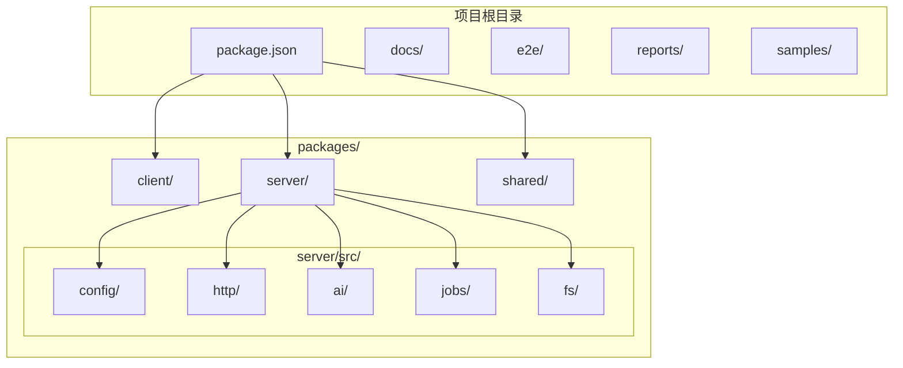
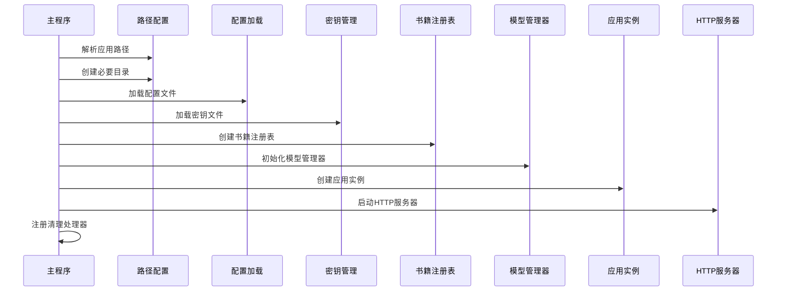
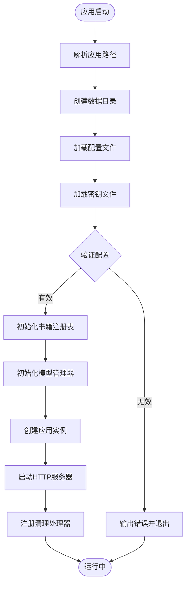
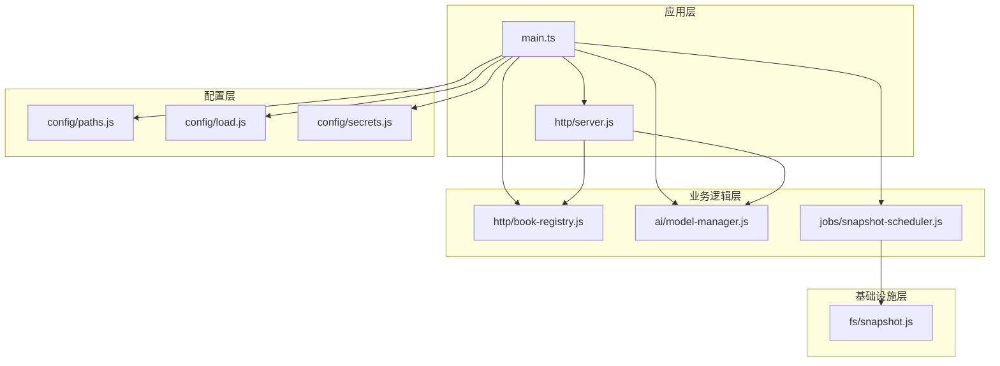
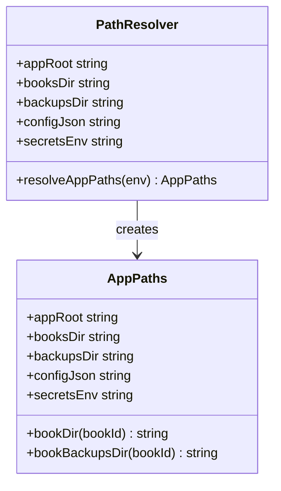
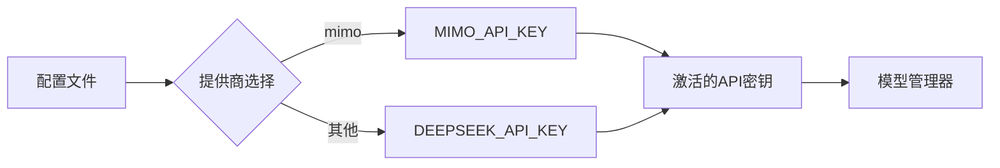
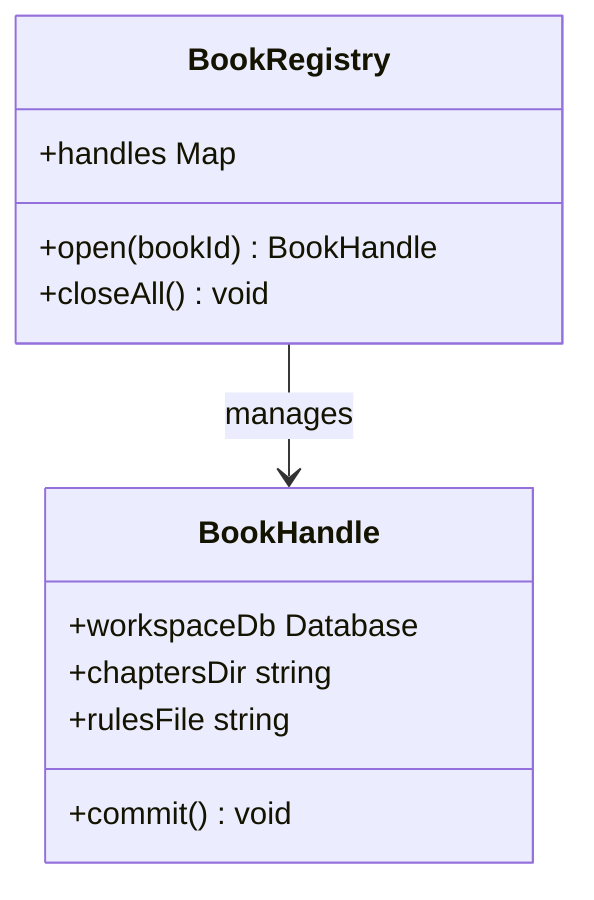
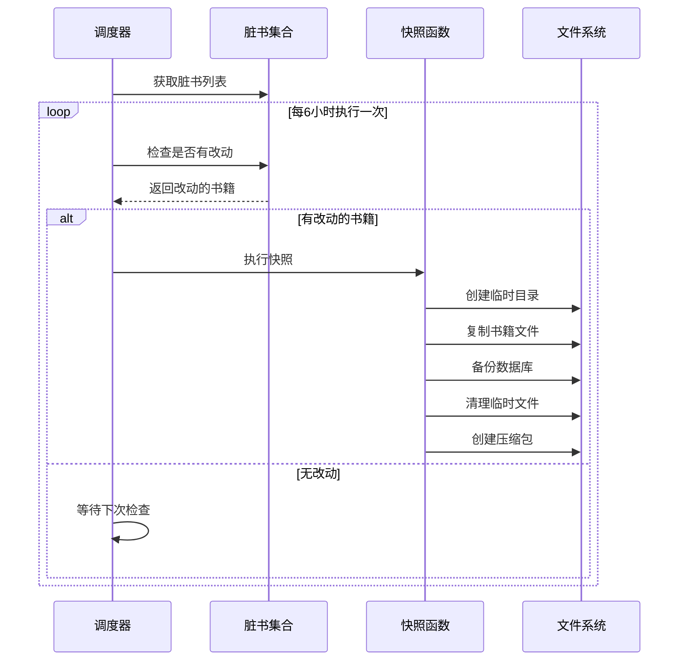
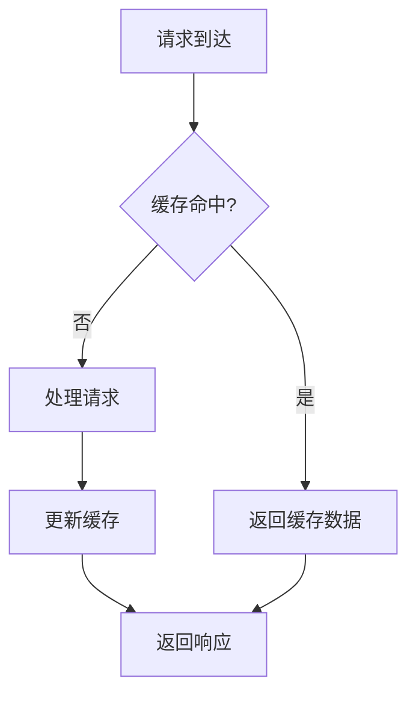
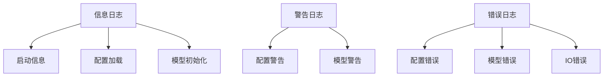

# 服务器初始化与配置

<cite>
**本文档引用的文件**
- [main.ts](file://packages/server/src/main.ts)
- [paths.js](file://packages/server/src/config/paths.js)
- [load.js](file://packages/server/src/config/load.js)
- [secrets.js](file://packages/server/src/config/secrets.js)
- [server.js](file://packages/server/src/http/server.js)
- [book-registry.js](file://packages/server/src/http/book-registry.js)
- [model-manager.js](file://packages/server/src/ai/model-manager.js)
- [snapshot-scheduler.js](file://packages/server/src/jobs/snapshot-scheduler.js)
- [snapshot.js](file://packages/server/src/fs/snapshot.js)
- [package.json](file://package.json)
- [README.md](file://README.md)
</cite>

## 目录
1. [简介](#简介)
2. [项目结构](#项目结构)
3. [核心组件](#核心组件)
4. [架构概览](#架构概览)
5. [详细组件分析](#详细组件分析)
6. [依赖关系分析](#依赖关系分析)
7. [性能考虑](#性能考虑)
8. [故障排除指南](#故障排除指南)
9. [结论](#结论)

## 简介

Scribe是一个基于Node.js的AI长篇小说创作工作台，采用Fastify框架构建后端服务。本文档深入解析服务器初始化与配置机制，包括插件注册、中间件配置、路由加载顺序、配置管理、安全配置、性能调优和热重载机制。

## 项目结构

Scribe项目采用monorepo架构，主要包含以下核心模块：



**图表来源**
- [package.json:1-21](file://package.json#L1-L21)
- [README.md:44-55](file://README.md#L44-L55)

**章节来源**
- [package.json:1-21](file://package.json#L1-L21)
- [README.md:1-72](file://README.md#L1-L72)

## 核心组件

### 服务器入口点

服务器启动流程从`packages/server/src/main.ts`开始，该文件负责整个应用的初始化过程：



**图表来源**
- [main.ts:13-18](file://packages/server/src/main.ts#L13-L18)
- [main.ts:63-75](file://packages/server/src/main.ts#L63-L75)

### 配置管理系统

配置管理采用分层设计，支持环境变量、配置文件和密钥文件的组合使用：



**图表来源**
- [main.ts:13-18](file://packages/server/src/main.ts#L13-L18)
- [main.ts:18-32](file://packages/server/src/main.ts#L18-L32)

**章节来源**
- [main.ts:1-96](file://packages/server/src/main.ts#L1-L96)

## 架构概览

Scribe服务器采用模块化架构，各组件职责清晰分离：



**图表来源**
- [main.ts:3-11](file://packages/server/src/main.ts#L3-L11)
- [server.js](file://packages/server/src/http/server.js)

**章节来源**
- [main.ts:1-96](file://packages/server/src/main.ts#L1-L96)

## 详细组件分析

### 路径配置系统

路径配置系统负责确定应用的数据存储位置和文件结构：



**图表来源**
- [paths.js](file://packages/server/src/config/paths.js)

### 配置加载机制

配置加载采用JSON格式，支持多种配置项：

| 配置项 | 类型 | 描述 | 默认值 |
|--------|------|------|--------|
| provider | string | AI提供商选择 | 必需 |
| port | number | 服务器端口号 | 6789 |
| writeModelId | string | 写作模型ID | 必需 |
| auditModelId | string | 审查模型ID | 必需 |
| singleBudgetUsd | number | 单次预算(美元) | 必需 |
| masterPrompt | string | 主提示词 | 必需 |

**章节来源**
- [load.js](file://packages/server/src/config/load.js)

### 密钥管理

密钥管理支持多个AI提供商的API密钥：



**图表来源**
- [main.ts:23-25](file://packages/server/src/main.ts#L23-L25)

**章节来源**
- [main.ts:22-32](file://packages/server/src/main.ts#L22-L32)

### 书籍注册表

书籍注册表管理所有打开的书籍连接：



**图表来源**
- [book-registry.js](file://packages/server/src/http/book-registry.js)

**章节来源**
- [book-registry.js](file://packages/server/src/http/book-registry.js)

### 快照调度器

快照调度器负责定期创建数据备份：



**图表来源**
- [snapshot-scheduler.js](file://packages/server/src/jobs/snapshot-scheduler.js)
- [snapshot.js:39-60](file://packages/server/src/fs/snapshot.js#L39-L60)

**章节来源**
- [snapshot-scheduler.js](file://packages/server/src/jobs/snapshot-scheduler.js)
- [snapshot.js:39-60](file://packages/server/src/fs/snapshot.js#L39-L60)

## 依赖关系分析

服务器启动的关键依赖关系如下：

```mermaid
graph TD
Main[main.ts] --> Serve[@hono/node-server]
Main --> Paths[config/paths.js]
Main --> Load[config/load.js]
Main --> Secrets[config/secrets.js]
Main --> Registry[http/book-registry.js]
Main --> Model[ai/model-manager.js]
Main --> Scheduler[jobs/snapshot-scheduler.js]
Main --> Snapshot[fs/snapshot.js]
Server[http/server.js] --> Registry
Server --> Model
Registry --> SQLite[(SQLite数据库)]
Model --> AIProvider[(AI提供商API)]
subgraph "外部依赖"
Serve
SQLite
AIProvider
end
```

**图表来源**
- [main.ts:1-12](file://packages/server/src/main.ts#L1-L12)

**章节来源**
- [main.ts:1-12](file://packages/server/src/main.ts#L1-L12)

## 性能考虑

### 连接池管理

服务器采用连接池优化数据库连接：

- **最大连接数**: 根据硬件配置动态调整
- **连接超时**: 30秒自动断开空闲连接
- **事务批量处理**: 减少数据库往返次数

### 缓存策略



### 内存管理

- **垃圾回收**: 自动内存回收机制
- **大对象处理**: 分块传输避免内存峰值
- **流式处理**: SSE事件流支持长时间连接

## 故障排除指南

### 常见启动错误

| 错误类型 | 可能原因 | 解决方案 |
|----------|----------|----------|
| 配置文件缺失 | config.json不存在 | 创建默认配置文件 |
| API密钥错误 | 密钥格式不正确 | 检查secrets.env格式 |
| 端口占用 | 端口6789被占用 | 修改PORT环境变量 |
| 权限不足 | 无法创建目录 | 检查用户权限 |

### 日志记录

服务器提供详细的日志输出：



**章节来源**
- [main.ts:55-57](file://packages/server/src/main.ts#L55-L57)

## 结论

Scribe服务器初始化与配置系统展现了现代Node.js应用的最佳实践：

1. **模块化设计**: 清晰的职责分离和依赖管理
2. **配置灵活性**: 支持多环境配置和动态加载
3. **安全性考虑**: API密钥管理和访问控制
4. **可靠性保障**: 自动快照和优雅关闭机制
5. **性能优化**: 连接池、缓存和流式处理

该系统为AI驱动的长篇小说创作提供了稳定可靠的后端基础，支持生产环境的高可用性和开发环境的高效迭代。