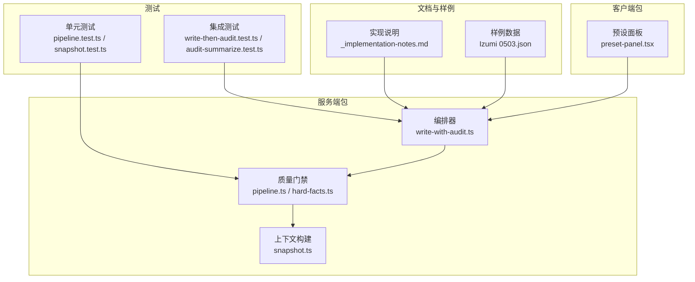
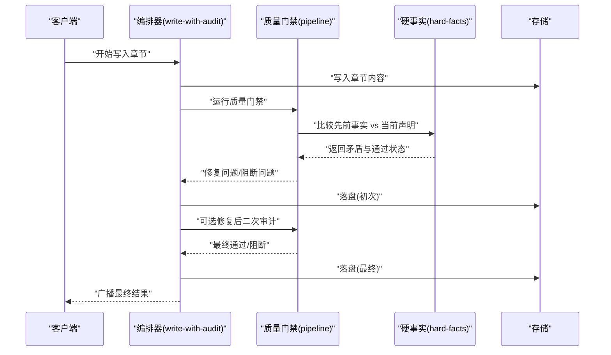
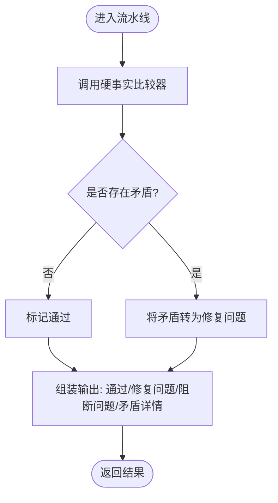
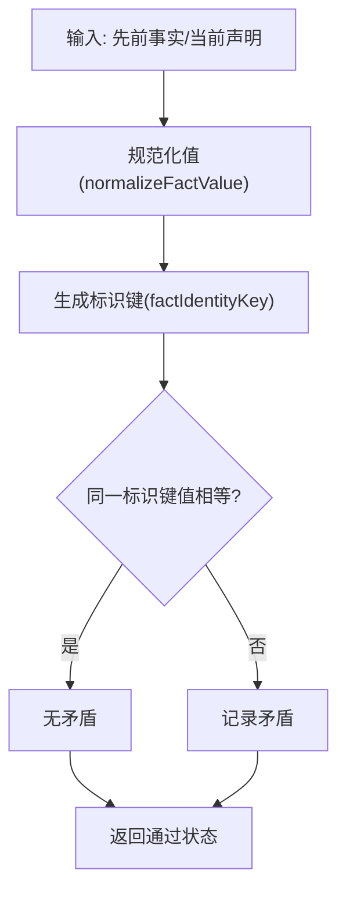
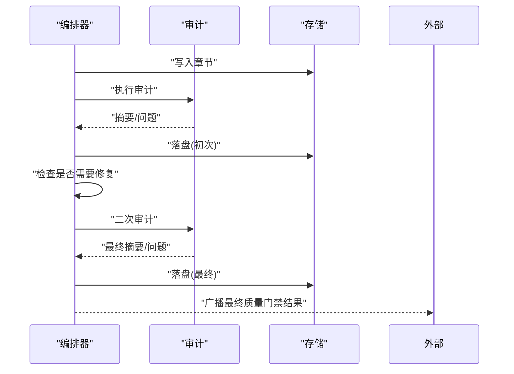
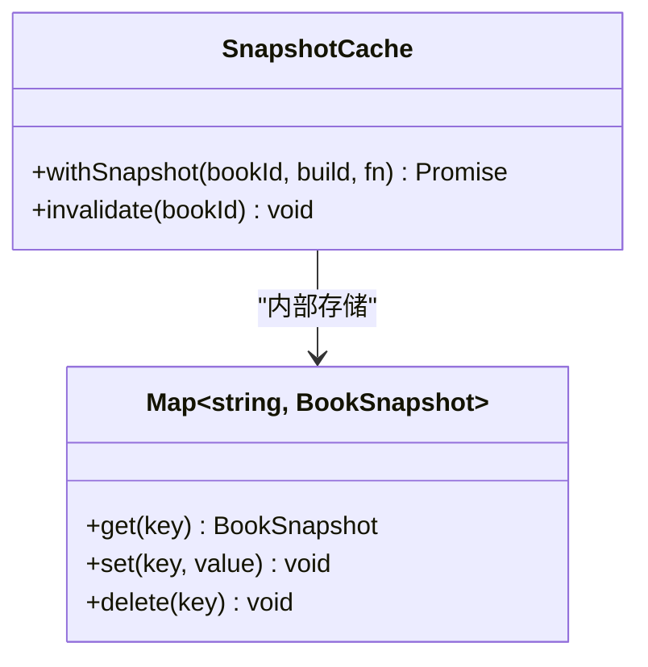
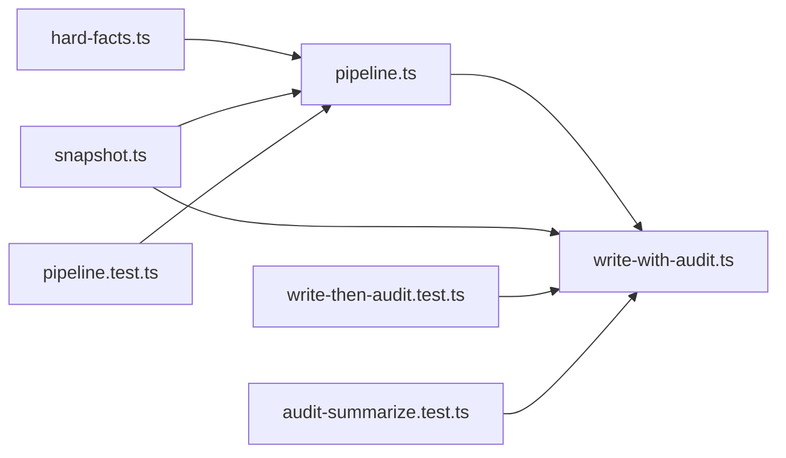

# 质量控制系统

<cite>
**本文引用的文件**
- [packages/server/src/ai/quality-gates/pipeline.ts](file://packages/server/src/ai/quality-gates/pipeline.ts)
- [packages/server/src/ai/quality-gates/hard-facts.ts](file://packages/server/src/ai/quality-gates/hard-facts.ts)
- [packages/server/src/ai/orchestrator/write-with-audit.ts](file://packages/server/src/ai/orchestrator/write-with-audit.ts)
- [packages/server/tests/unit/ai/quality-gates/pipeline.test.ts](file://packages/server/tests/unit/ai/quality-gates/pipeline.test.ts)
- [packages/server/tests/integration/write-then-audit.test.ts](file://packages/server/tests/integration/write-then-audit.test.ts)
- [packages/server/tests/unit/ai/prompts/audit-summarize.test.ts](file://packages/server/tests/unit/ai/prompts/audit-summarize.test.ts)
- [packages/server/src/ai/context-builder/snapshot.ts](file://packages/server/src/ai/context-builder/snapshot.ts)
- [packages/server/tests/unit/ai/context-builder/snapshot.test.ts](file://packages/server/tests/unit/ai/context-builder/snapshot.test.ts)
- [docs/_implementation-notes.md](file://docs/_implementation-notes.md)
- [samples/sillytavern/Izumi 0503.json](file://samples/sillytavern/Izumi 0503.json)
- [packages/client/src/components/presets/preset-panel.tsx](file://packages/client/src/components/presets/preset-panel.tsx)
</cite>

## 目录
1. [引言](#引言)
2. [项目结构](#项目结构)
3. [核心组件](#核心组件)
4. [架构总览](#架构总览)
5. [详细组件分析](#详细组件分析)
6. [依赖关系分析](#依赖关系分析)
7. [性能考虑](#性能考虑)
8. [故障排除指南](#故障排除指南)
9. [结论](#结论)
10. [附录](#附录)

## 引言
本文件为 Scribe 质量控制系统的综合技术文档，聚焦质量门禁（Quality Gates）与审计跟踪体系。文档从设计原理出发，系统阐述检查器注册机制、规则引擎与评估算法；深入解释通用质量门禁的实现，包括硬事实检查、连续性验证与一致性评估；说明审计跟踪系统，涵盖操作日志、变更历史与合规性报告；给出自定义检查器的开发指南与扩展机制；提供质量检查示例与性能优化建议；最后覆盖错误处理与异常策略。

## 项目结构
仓库采用多包工作区组织，质量控制系统主要分布在服务端包中，前端包提供预设与界面交互支持。质量门禁相关代码位于服务端 AI 子模块，测试覆盖单元与集成场景，文档与样例辅助理解。

图表来源
- [packages/server/src/ai/quality-gates/pipeline.ts:1-33](file://packages/server/src/ai/quality-gates/pipeline.ts#L1-L33)
- [packages/server/src/ai/quality-gates/hard-facts.ts:51-88](file://packages/server/src/ai/quality-gates/hard-facts.ts#L51-L88)
- [packages/server/src/ai/orchestrator/write-with-audit.ts:292-316](file://packages/server/src/ai/orchestrator/write-with-audit.ts#L292-L316)
- [packages/server/src/ai/context-builder/snapshot.ts:125-144](file://packages/server/src/ai/context-builder/snapshot.ts#L125-L144)
- [packages/server/tests/unit/ai/quality-gates/pipeline.test.ts:1-38](file://packages/server/tests/unit/ai/quality-gates/pipeline.test.ts#L1-L38)
- [packages/server/tests/integration/write-then-audit.test.ts:41-99](file://packages/server/tests/integration/write-then-audit.test.ts#L41-L99)
- [packages/server/tests/unit/ai/prompts/audit-summarize.test.ts:60-99](file://packages/server/tests/unit/ai/prompts/audit-summarize.test.ts#L60-L99)
- [docs/_implementation-notes.md:260-284](file://docs/_implementation-notes.md#L260-L284)
- [samples/sillytavern/Izumi 0503.json:3327-3848](file://samples/sillytavern/Izumi 0503.json#L3327-L3848)
- [packages/client/src/components/presets/preset-panel.tsx:107-138](file://packages/client/src/components/presets/preset-panel.tsx#L107-L138)

章节来源
- [packages/server/src/ai/quality-gates/pipeline.ts:1-33](file://packages/server/src/ai/quality-gates/pipeline.ts#L1-L33)
- [packages/server/src/ai/quality-gates/hard-facts.ts:51-88](file://packages/server/src/ai/quality-gates/hard-facts.ts#L51-L88)
- [packages/server/src/ai/orchestrator/write-with-audit.ts:292-316](file://packages/server/src/ai/orchestrator/write-with-audit.ts#L292-L316)
- [packages/server/src/ai/context-builder/snapshot.ts:125-144](file://packages/server/src/ai/context-builder/snapshot.ts#L125-L144)
- [packages/server/tests/unit/ai/quality-gates/pipeline.test.ts:1-38](file://packages/server/tests/unit/ai/quality-gates/pipeline.test.ts#L1-L38)
- [packages/server/tests/integration/write-then-audit.test.ts:41-99](file://packages/server/tests/integration/write-then-audit.test.ts#L41-L99)
- [packages/server/tests/unit/ai/prompts/audit-summarize.test.ts:60-99](file://packages/server/tests/unit/ai/prompts/audit-summarize.test.ts#L60-L99)
- [docs/_implementation-notes.md:260-284](file://docs/_implementation-notes.md#L260-L284)
- [samples/sillytavern/Izumi 0503.json:3327-3848](file://samples/sillytavern/Izumi 0503.json#L3327-L3848)
- [packages/client/src/components/presets/preset-panel.tsx:107-138](file://packages/client/src/components/presets/preset-panel.tsx#L107-L138)

## 核心组件
- 质量门禁流水线：接收“先前事实”与“当前声明”，执行硬事实对比，输出通过状态、修复问题与阻断问题列表。
- 硬事实比较器：规范化数值与字符串，计算实体-属性-作用域标识键，判断值相等与矛盾。
- 编排器审计：在写入章节后触发审计，产出摘要与最终质量门禁结果，支持可选修复与二次审计。
- 上下文快照缓存：按书籍维度缓存快照，避免重复构建，支持失效重算。
- 审计输出解析：严格校验 JSON 结构、维度枚举、长度限制等，保证审计结果稳定性。

章节来源
- [packages/server/src/ai/quality-gates/pipeline.ts:9-33](file://packages/server/src/ai/quality-gates/pipeline.ts#L9-L33)
- [packages/server/src/ai/quality-gates/hard-facts.ts:55-88](file://packages/server/src/ai/quality-gates/hard-facts.ts#L55-L88)
- [packages/server/src/ai/orchestrator/write-with-audit.ts:292-316](file://packages/server/src/ai/orchestrator/write-with-audit.ts#L292-L316)
- [packages/server/src/ai/context-builder/snapshot.ts:125-144](file://packages/server/src/ai/context-builder/snapshot.ts#L125-L144)
- [packages/server/tests/unit/ai/prompts/audit-summarize.test.ts:60-99](file://packages/server/tests/unit/ai/prompts/audit-summarize.test.ts#L60-L99)

## 架构总览
质量控制系统围绕“写入-审计-落盘-修复-再审计-落盘”的编排流程展开，硬事实门禁贯穿其中，作为阻断性质量门槛。上下文快照缓存为门禁与审计提供稳定的数据基础。

图表来源
- [packages/server/src/ai/orchestrator/write-with-audit.ts:292-316](file://packages/server/src/ai/orchestrator/write-with-audit.ts#L292-L316)
- [packages/server/src/ai/quality-gates/pipeline.ts:21-33](file://packages/server/src/ai/quality-gates/pipeline.ts#L21-L33)
- [packages/server/src/ai/quality-gates/hard-facts.ts:88-120](file://packages/server/src/ai/quality-gates/hard-facts.ts#L88-L120)

## 详细组件分析

### 质量门禁流水线
- 输入：先前事实数组、当前声明数组
- 输出：通过状态、修复问题列表、阻断问题列表、矛盾详情
- 关键流程：调用硬事实比较器，将矛盾转换为修复问题，汇总阻断消息

图表来源
- [packages/server/src/ai/quality-gates/pipeline.ts:21-33](file://packages/server/src/ai/quality-gates/pipeline.ts#L21-L33)

章节来源
- [packages/server/src/ai/quality-gates/pipeline.ts:9-33](file://packages/server/src/ai/quality-gates/pipeline.ts#L9-L33)
- [packages/server/tests/unit/ai/quality-gates/pipeline.test.ts:16-37](file://packages/server/tests/unit/ai/quality-gates/pipeline.test.ts#L16-L37)

### 硬事实检查器
- 规范化：数值型事实统一为字符串表示，便于比较
- 标识键：基于作用域、实体、属性的小写规范化组合
- 数值比较：数量值需同时匹配数值与单位
- 矛盾判定：当同一标识键的事实值不一致时视为矛盾

图表来源
- [packages/server/src/ai/quality-gates/hard-facts.ts:60-86](file://packages/server/src/ai/quality-gates/hard-facts.ts#L60-L86)
- [packages/server/src/ai/quality-gates/hard-facts.ts:88-120](file://packages/server/src/ai/quality-gates/hard-facts.ts#L88-L120)

章节来源
- [packages/server/src/ai/quality-gates/hard-facts.ts:55-88](file://packages/server/src/ai/quality-gates/hard-facts.ts#L55-L88)
- [packages/server/src/ai/quality-gates/hard-facts.ts:88-120](file://packages/server/src/ai/quality-gates/hard-facts.ts#L88-L120)

### 编排器与审计广播
- 在写入章节后，编排器触发审计并落盘；若启用硬事实门禁，会广播最终通过状态与阻断问题列表
- 对于空缓冲或静默跳过的情况，补充结束事件以确保 SSE 终结契约

图表来源
- [packages/server/src/ai/orchestrator/write-with-audit.ts:292-316](file://packages/server/src/ai/orchestrator/write-with-audit.ts#L292-L316)

章节来源
- [packages/server/src/ai/orchestrator/write-with-audit.ts:292-316](file://packages/server/src/ai/orchestrator/write-with-audit.ts#L292-L316)
- [docs/_implementation-notes.md:260-266](file://docs/_implementation-notes.md#L260-L266)

### 上下文快照缓存
- 以书籍 ID 为键缓存快照对象，首次访问构建，后续复用；支持显式失效后重建
- 适用于硬事实比较与审计过程中的上下文读取，降低重复构建成本

图表来源
- [packages/server/src/ai/context-builder/snapshot.ts:125-144](file://packages/server/src/ai/context-builder/snapshot.ts#L125-L144)

章节来源
- [packages/server/src/ai/context-builder/snapshot.ts:125-144](file://packages/server/src/ai/context-builder/snapshot.ts#L125-L144)
- [packages/server/tests/unit/ai/context-builder/snapshot.test.ts:140-170](file://packages/server/tests/unit/ai/context-builder/snapshot.test.ts#L140-L170)

### 审计输出解析与约束
- 严格解析 JSON，校验 verdict 与 issues 中 dimension 枚举
- 对 oneLiner 长度进行上限校验，防止过长摘要
- 针对非法输入抛出明确错误，保障下游稳定性

章节来源
- [packages/server/tests/unit/ai/prompts/audit-summarize.test.ts:60-99](file://packages/server/tests/unit/ai/prompts/audit-summarize.test.ts#L60-L99)

## 依赖关系分析
- 质量门禁流水线依赖硬事实比较器；编排器依赖质量门禁流水线与存储；上下文快照缓存被门禁与审计共享使用
- 测试覆盖了门禁逻辑、编排流程与审计输出解析的关键路径

图表来源
- [packages/server/src/ai/quality-gates/pipeline.ts:1-7](file://packages/server/src/ai/quality-gates/pipeline.ts#L1-L7)
- [packages/server/src/ai/quality-gates/hard-facts.ts:1-120](file://packages/server/src/ai/quality-gates/hard-facts.ts#L1-L120)
- [packages/server/src/ai/orchestrator/write-with-audit.ts:292-316](file://packages/server/src/ai/orchestrator/write-with-audit.ts#L292-L316)
- [packages/server/src/ai/context-builder/snapshot.ts:125-144](file://packages/server/src/ai/context-builder/snapshot.ts#L125-L144)
- [packages/server/tests/unit/ai/quality-gates/pipeline.test.ts:1-38](file://packages/server/tests/unit/ai/quality-gates/pipeline.test.ts#L1-L38)
- [packages/server/tests/integration/write-then-audit.test.ts:41-99](file://packages/server/tests/integration/write-then-audit.test.ts#L41-L99)
- [packages/server/tests/unit/ai/prompts/audit-summarize.test.ts:60-99](file://packages/server/tests/unit/ai/prompts/audit-summarize.test.ts#L60-L99)

章节来源
- [packages/server/src/ai/quality-gates/pipeline.ts:1-33](file://packages/server/src/ai/quality-gates/pipeline.ts#L1-L33)
- [packages/server/src/ai/quality-gates/hard-facts.ts:1-120](file://packages/server/src/ai/quality-gates/hard-facts.ts#L1-L120)
- [packages/server/src/ai/orchestrator/write-with-audit.ts:292-316](file://packages/server/src/ai/orchestrator/write-with-audit.ts#L292-L316)
- [packages/server/src/ai/context-builder/snapshot.ts:125-144](file://packages/server/src/ai/context-builder/snapshot.ts#L125-L144)
- [packages/server/tests/unit/ai/quality-gates/pipeline.test.ts:1-38](file://packages/server/tests/unit/ai/quality-gates/pipeline.test.ts#L1-L38)
- [packages/server/tests/integration/write-then-audit.test.ts:41-99](file://packages/server/tests/integration/write-then-audit.test.ts#L41-L99)
- [packages/server/tests/unit/ai/prompts/audit-summarize.test.ts:60-99](file://packages/server/tests/unit/ai/prompts/audit-summarize.test.ts#L60-L99)

## 性能考虑
- 上下文快照缓存：通过 Map 以书籍 ID 为键缓存快照，避免重复构建，提升硬事实比较与审计效率
- 并行执行：可在门禁流水线中并行比较多个实体-属性-作用域组合（需注意锁与一致性）
- 结果缓存：对相同输入的门禁结果可做短期缓存，减少重复计算
- I/O 优化：批量写入与落盘，减少数据库往返次数

章节来源
- [packages/server/src/ai/context-builder/snapshot.ts:125-144](file://packages/server/src/ai/context-builder/snapshot.ts#L125-L144)
- [packages/server/tests/unit/ai/context-builder/snapshot.test.ts:140-170](file://packages/server/tests/unit/ai/context-builder/snapshot.test.ts#L140-L170)
- [docs/_implementation-notes.md:268-272](file://docs/_implementation-notes.md#L268-L272)

## 故障排除指南
- 审计输出解析失败：检查 JSON 结构、verdict 与 dimension 是否符合约束，确保 oneLiner 长度不超过限制
- 硬事实矛盾：确认实体-属性-作用域标识键生成规则与值规范化逻辑，排查单位差异导致的不相等
- 编排器流终结：确保每个 SSE 终结路径唯一 yield done 或 error，tool_call_start 与 tool_call_end 成对出现
- 错误文案脱敏：避免直接暴露底层异常文本到 UI，建议在错误事件中分离 message 与 details 字段

章节来源
- [packages/server/tests/unit/ai/prompts/audit-summarize.test.ts:60-99](file://packages/server/tests/unit/ai/prompts/audit-summarize.test.ts#L60-L99)
- [packages/server/src/ai/quality-gates/hard-facts.ts:60-86](file://packages/server/src/ai/quality-gates/hard-facts.ts#L60-L86)
- [packages/server/src/ai/orchestrator/write-with-audit.ts:292-316](file://packages/server/src/ai/orchestrator/write-with-audit.ts#L292-L316)
- [docs/_implementation-notes.md:274-278](file://docs/_implementation-notes.md#L274-L278)

## 结论
Scribe 质量控制系统以硬事实门禁为核心，结合编排器的写-审-落盘流程与上下文快照缓存，形成稳定高效的门禁与审计闭环。通过严格的输出解析与测试覆盖，系统在复杂场景下仍能保持一致性与可维护性。未来可在并行执行、结果缓存与修复策略上进一步优化，以满足更高吞吐与实时性需求。

## 附录

### 自定义检查器开发指南
- 接口定义：参考硬事实比较器的输入输出约定，定义检查器函数签名与返回结构
- 配置管理：通过预设面板启用/禁用检查器，支持正则脚本开关
- 扩展机制：在门禁流水线中注册新检查器，将其结果合并至修复问题与阻断问题列表

章节来源
- [packages/server/src/ai/quality-gates/pipeline.ts:9-19](file://packages/server/src/ai/quality-gates/pipeline.ts#L9-L19)
- [packages/server/src/ai/quality-gates/hard-facts.ts:55-58](file://packages/server/src/ai/quality-gates/hard-facts.ts#L55-L58)
- [packages/client/src/components/presets/preset-panel.tsx:107-138](file://packages/client/src/components/presets/preset-panel.tsx#L107-L138)

### 质量检查示例
- 内容审核：基于审计模型输出的维度与严重度，结合门禁结果进行阻断或修复
- 格式验证：对摘要与问题字段进行长度与结构校验，确保输出规范
- 业务规则检查：以硬事实门禁为例，验证跨章节事实一致性（如角色属性、物品数量）

章节来源
- [packages/server/tests/integration/write-then-audit.test.ts:41-99](file://packages/server/tests/integration/write-then-audit.test.ts#L41-L99)
- [packages/server/tests/unit/ai/prompts/audit-summarize.test.ts:60-99](file://packages/server/tests/unit/ai/prompts/audit-summarize.test.ts#L60-L99)
- [packages/server/tests/unit/ai/quality-gates/pipeline.test.ts:16-37](file://packages/server/tests/unit/ai/quality-gates/pipeline.test.ts#L16-L37)

### 审计跟踪与合规报告
- 操作日志：编排器在关键节点落盘与广播结果，形成可追溯的执行轨迹
- 变更历史：通过先前事实与当前声明的对比，记录事实层面的变化
- 合规性报告：基于审计摘要与门禁结果，生成维度化的合规报告

章节来源
- [packages/server/src/ai/orchestrator/write-with-audit.ts:292-316](file://packages/server/src/ai/orchestrator/write-with-audit.ts#L292-L316)
- [packages/server/tests/integration/write-then-audit.test.ts:41-99](file://packages/server/tests/integration/write-then-audit.test.ts#L41-L99)
- [samples/sillytavern/Izumi 0503.json:3327-3848](file://samples/sillytavern/Izumi 0503.json#L3327-L3848)