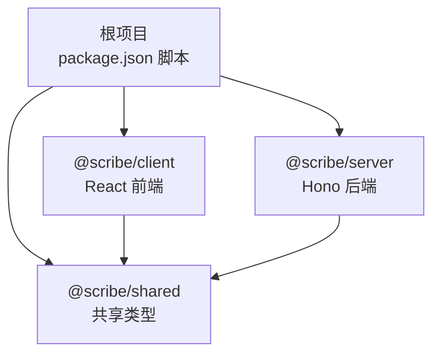
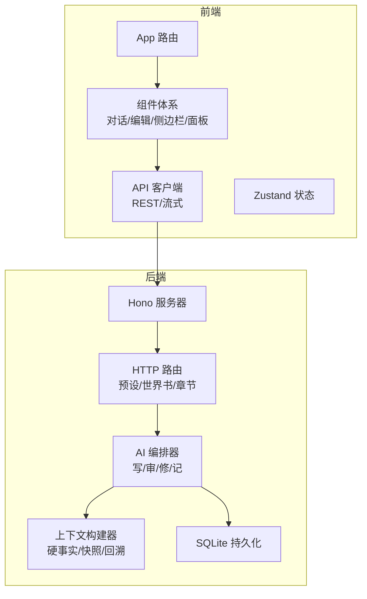
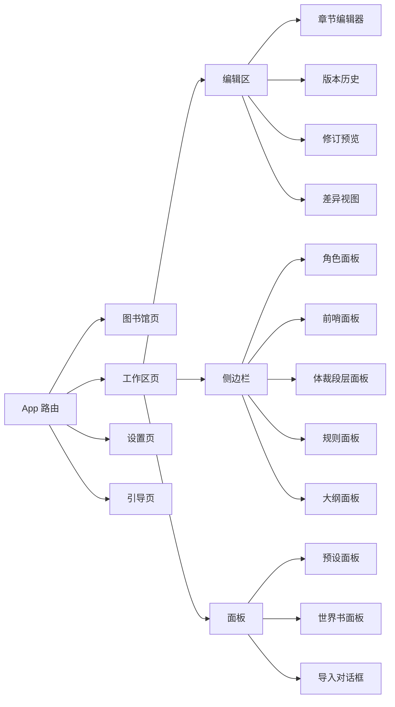
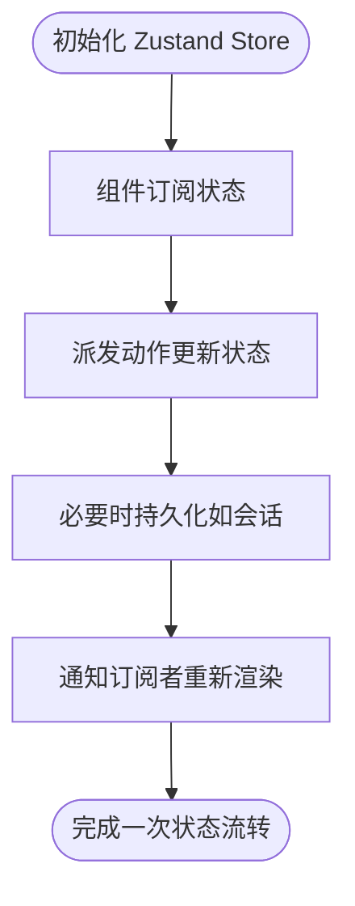
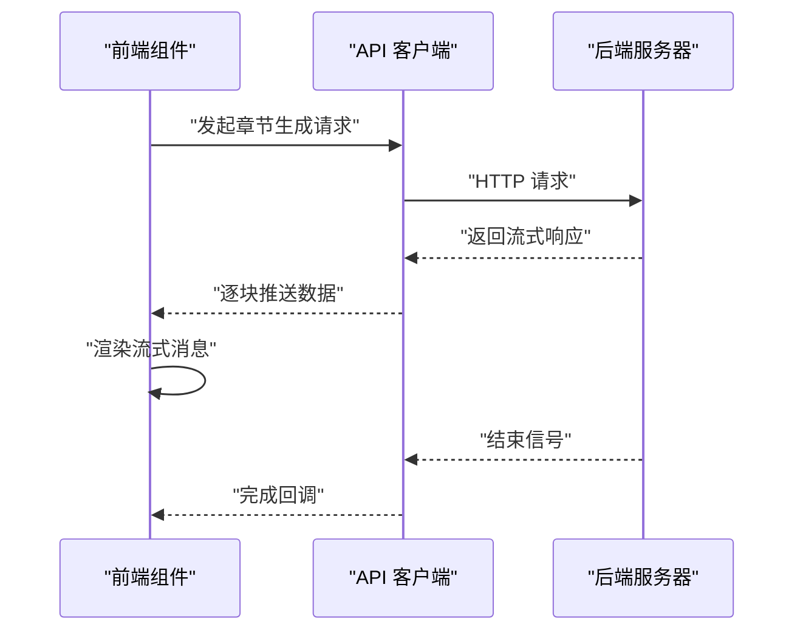
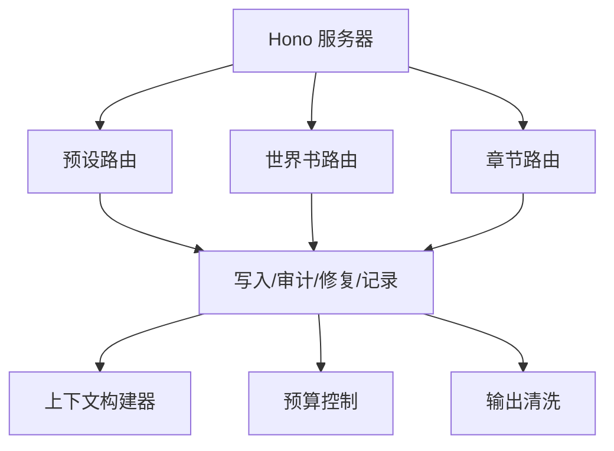
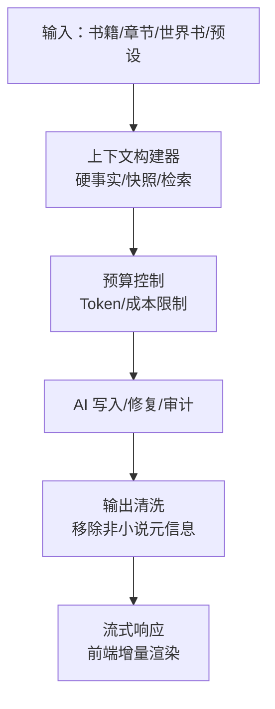
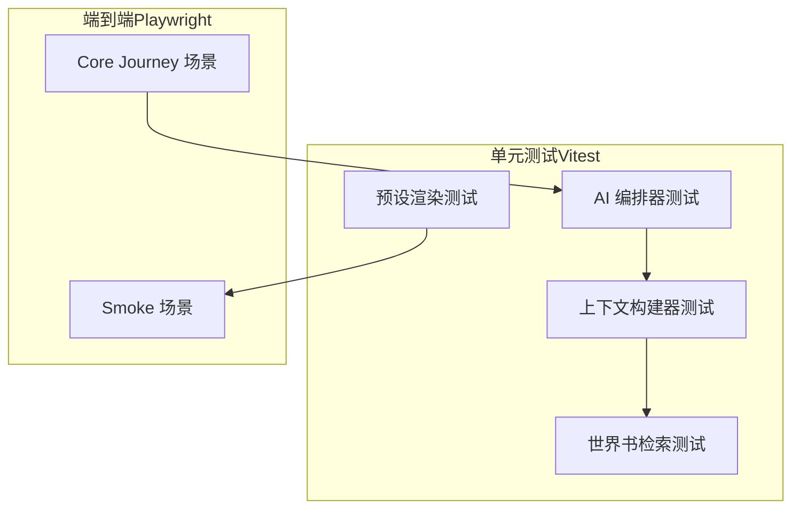
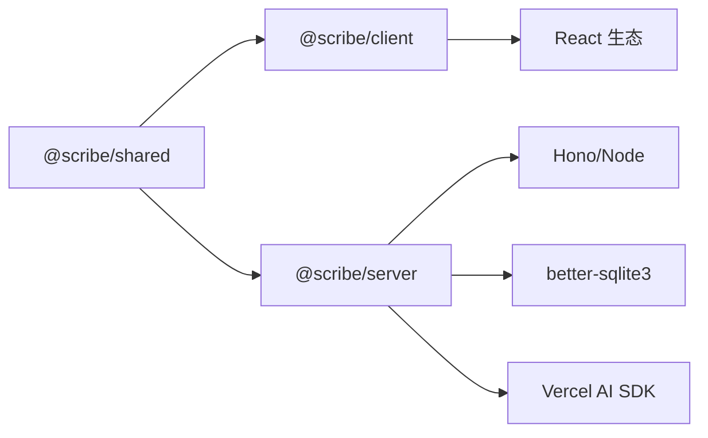

# 技术实现

<cite>
**本文引用的文件**
- [package.json](file://package.json)
- [pnpm-workspace.yaml](file://pnpm-workspace.yaml)
- [tsconfig.base.json](file://tsconfig.base.json)
- [docs/HANDOFF-codex.md](file://docs/HANDOFF-codex.md)
- [packages/client/package.json](file://packages/client/package.json)
- [packages/server/package.json](file://packages/server/package.json)
- [packages/shared/package.json](file://packages/shared/package.json)
- [packages/client/src/App.tsx](file://packages/client/src/App.tsx)
- [packages/client/src/api/client.ts](file://packages/client/src/api/client.ts)
- [packages/client/src/api/streaming.ts](file://packages/client/src/api/streaming.ts)
- [packages/client/src/stores/conversation.ts](file://packages/client/src/stores/conversation.ts)
- [packages/client/src/stores/toast.ts](file://packages/client/src/stores/toast.ts)
- [packages/client/src/components/editor/markdown-bridge.ts](file://packages/client/src/components/editor/markdown-bridge.ts)
- [packages/client/src/components/editor/chapter-editor.tsx](file://packages/client/src/components/editor/chapter-editor.tsx)
- [packages/client/src/components/editor/editor-pane.tsx](file://packages/client/src/components/editor/editor-pane.tsx)
- [packages/client/src/components/editor/version-history.tsx](file://packages/client/src/components/editor/version-history.tsx)
- [packages/client/src/components/editor/revise-preview.tsx](file://packages/client/src/components/editor/revise-preview.tsx)
- [packages/client/src/components/editor/diff-view.tsx](file://packages/client/src/components/editor/diff-view.tsx)
- [packages/client/src/components/conversation/conversation-pane.tsx](file://packages/client/src/components/conversation/conversation-pane.tsx)
- [packages/client/src/components/conversation/message.tsx](file://packages/client/src/components/conversation/message.tsx)
- [packages/client/src/components/conversation/streaming-message.tsx](file://packages/client/src/components/conversation/streaming-message.tsx)
- [packages/client/src/components/sidebar/side-panel.tsx](file://packages/client/src/components/sidebar/side-panel.tsx)
- [packages/client/src/components/sidebar/characters-panel.tsx](file://packages/client/src/components/sidebar/characters-panel.tsx)
- [packages/client/src/components/sidebar/foreshadowing-panel.tsx](file://packages/client/src/components/sidebar/foreshadowing-panel.tsx)
- [packages/client/src/components/sidebar/genre-section-panel.tsx](file://packages/client/src/components/sidebar/genre-section-panel.tsx)
- [packages/client/src/components/sidebar/rules-panel.tsx](file://packages/client/src/components/sidebar/rules-panel.tsx)
- [packages/client/src/components/sidebar/outline-panel.tsx](file://packages/client/src/components/sidebar/outline-panel.tsx)
- [packages/client/src/components/presets/preset-panel.tsx](file://packages/client/src/components/presets/preset-panel.tsx)
- [packages/client/src/components/worldbook/worldbook-panel.tsx](file://packages/client/src/components/worldbook/worldbook-panel.tsx)
- [packages/client/src/components/import/import-dialog.tsx](file://packages/client/src/components/import/import-dialog.tsx)
- [packages/server/src/ai/budget-check.ts](file://packages/server/src/ai/budget-check.ts)
- [packages/server/src/ai/context-builder/book-context.ts](file://packages/server/src/ai/context-builder/book-context.ts)
- [packages/server/src/ai/context-builder/budget.ts](file://packages/server/src/ai/context-builder/budget.ts)
- [packages/server/src/ai/context-builder/recall.ts](file://packages/server/src/ai/context-builder/recall.ts)
- [packages/server/src/ai/context-builder/snapshot.ts](file://packages/server/src/ai/context-builder/snapshot.ts)
- [packages/server/src/ai/context-builder/builder.ts](file://packages/server/src/ai/context-builder/builder.ts)
- [packages/server/src/ai/context-builder/index.ts](file://packages/server/src/ai/context-builder/index.ts)
- [packages/server/src/ai/orchestrator/output-sanitize.ts](file://packages/server/src/ai/orchestrator/output-sanitize.ts)
- [packages/server/src/ai/orchestrator/write-chapter.ts](file://packages/server/src/ai/orchestrator/write-chapter.ts)
- [packages/server/src/ai/orchestrator/write-with-audit.ts](file://packages/server/src/ai/orchestrator/write-with-audit.ts)
- [packages/server/src/ai/orchestrator/repair-chapter.ts](file://packages/server/src/ai/orchestrator/repair-chapter.ts)
- [packages/server/src/ai/prompts/write-chapter.ts](file://packages/server/src/ai/prompts/write-chapter.ts)
- [packages/server/src/ai/prompts/repair-chapter.ts](file://packages/server/src/ai/prompts/repair-chapter.ts)
- [packages/server/src/ai/worldbook/retrieval.ts](file://packages/server/src/ai/worldbook/retrieval.ts)
- [packages/server/src/http/routes/presets.ts](file://packages/server/src/http/routes/presets.ts)
- [packages/server/src/http/routes/worldbook.ts](file://packages/server/src/http/routes/worldbook.ts)
- [e2e/playwright.config.ts](file://e2e/playwright.config.ts)
- [e2e/tests/smoke.spec.ts](file://e2e/tests/smoke.spec.ts)
- [e2e/tests/core-journey.spec.ts](file://e2e/tests/core-journey.spec.ts)
</cite>

## 目录
1. 引言
2. 项目结构
3. 核心组件
4. 架构总览
5. 详细组件分析
6. 依赖关系分析
7. 性能考虑
8. 故障排除指南
9. 结论
10. 附录

## 引言
本技术实现文档面向Scribe项目，聚焦于前端架构（React组件体系、Zustand状态管理、API客户端）、后端架构（Hono服务器、HTTP路由与业务逻辑）、AI集成（上下文构建、预算控制、流式响应）、测试策略（Vitest单元测试与Playwright端到端测试），并提供部署脚本说明、性能优化建议、错误处理模式与调试方法。文档同时阐释TypeScript类型系统在全栈开发中的应用方式。

## 项目结构
仓库采用monorepo布局，通过pnpm工作区组织三个核心包：
- packages/client：React前端
- packages/server：Hono + SQLite + Vercel AI SDK 后端
- packages/shared：共享类型与工具

根级脚本统一管理开发、构建、测试与类型检查；工作区配置确保包间依赖以workspace协议解析。

图表来源
- [pnpm-workspace.yaml:1-4](file://pnpm-workspace.yaml#L1-L4)
- [package.json:6-12](file://package.json#L6-L12)

章节来源
- [pnpm-workspace.yaml:1-4](file://pnpm-workspace.yaml#L1-L4)
- [package.json:1-21](file://package.json#L1-L21)

## 核心组件
- 前端组件体系：围绕“图书馆/工作区/设置/引导页”路由，包含对话面板、章节编辑器、侧边栏（角色、前哨、体裁段落、规则、大纲）、预设与世界书面板等。
- 状态管理：基于Zustand的状态容器，覆盖会话、提示气泡等。
- API客户端：封装REST与流式响应，支持章节生成、审计、状态记录与世界书/预设编辑路由。
- 后端服务：Hono路由承载HTTP接口，业务逻辑位于AI编排器与上下文构建器，结合SQLite持久化。
- AI集成：上下文构建器聚合硬事实、时间线、角色状态与检索结果；预算控制限制Token消耗；输出清洗保障纯小说文本；流式响应提升交互体验。
- 测试：Vitest用于单元测试，Playwright用于端到端场景验证。

章节来源
- [packages/client/src/App.tsx:1-30](file://packages/client/src/App.tsx#L1-L30)
- [packages/client/src/stores/conversation.ts](file://packages/client/src/stores/conversation.ts)
- [packages/client/src/stores/toast.ts](file://packages/client/src/stores/toast.ts)
- [packages/client/src/api/client.ts](file://packages/client/src/api/client.ts)
- [packages/client/src/api/streaming.ts](file://packages/client/src/api/streaming.ts)
- [packages/server/src/http/routes/presets.ts](file://packages/server/src/http/routes/presets.ts)
- [packages/server/src/http/routes/worldbook.ts](file://packages/server/src/http/routes/worldbook.ts)
- [packages/server/src/ai/context-builder/index.ts](file://packages/server/src/ai/context-builder/index.ts)
- [packages/server/src/ai/budget-check.ts](file://packages/server/src/ai/budget-check.ts)
- [packages/server/src/ai/orchestrator/output-sanitize.ts](file://packages/server/src/ai/orchestrator/output-sanitize.ts)

## 架构总览
整体架构遵循“前端React + 后端Hono + 共享类型”的分层设计。前端通过API客户端调用后端HTTP接口；后端通过AI编排器与上下文构建器完成写作、审计与状态记录；世界书与预设作为外部输入参与上下文注入；SQLite负责本地持久化。

图表来源
- [packages/client/src/App.tsx:1-30](file://packages/client/src/App.tsx#L1-L30)
- [packages/client/src/api/client.ts](file://packages/client/src/api/client.ts)
- [packages/client/src/api/streaming.ts](file://packages/client/src/api/streaming.ts)
- [packages/server/src/http/routes/presets.ts](file://packages/server/src/http/routes/presets.ts)
- [packages/server/src/http/routes/worldbook.ts](file://packages/server/src/http/routes/worldbook.ts)
- [packages/server/src/ai/context-builder/index.ts](file://packages/server/src/ai/context-builder/index.ts)

## 详细组件分析

### 前端架构与组件体系
- 路由与页面：根路由重定向至图书馆，支持工作区、设置、引导页与404兜底。
- 组件层次：
  - 对话面板：消息展示、流式消息接收、斜杠建议触发。
  - 编辑器：章节编辑器、编辑区、版本历史、修订预览、差异视图。
  - 侧边栏：角色、前哨、体裁段落、规则、大纲等面板。
  - 面板：预设面板、世界书面板、导入对话框。
- 状态管理：会话状态与提示气泡状态通过Zustand容器集中管理，便于跨组件共享。

图表来源
- [packages/client/src/App.tsx:1-30](file://packages/client/src/App.tsx#L1-L30)
- [packages/client/src/components/editor/editor-pane.tsx](file://packages/client/src/components/editor/editor-pane.tsx)
- [packages/client/src/components/editor/chapter-editor.tsx](file://packages/client/src/components/editor/chapter-editor.tsx)
- [packages/client/src/components/editor/version-history.tsx](file://packages/client/src/components/editor/version-history.tsx)
- [packages/client/src/components/editor/revise-preview.tsx](file://packages/client/src/components/editor/revise-preview.tsx)
- [packages/client/src/components/editor/diff-view.tsx](file://packages/client/src/components/editor/diff-view.tsx)
- [packages/client/src/components/conversation/conversation-pane.tsx](file://packages/client/src/components/conversation/conversation-pane.tsx)
- [packages/client/src/components/conversation/message.tsx](file://packages/client/src/components/conversation/message.tsx)
- [packages/client/src/components/conversation/streaming-message.tsx](file://packages/client/src/components/conversation/streaming-message.tsx)
- [packages/client/src/components/sidebar/side-panel.tsx](file://packages/client/src/components/sidebar/side-panel.tsx)
- [packages/client/src/components/sidebar/characters-panel.tsx](file://packages/client/src/components/sidebar/characters-panel.tsx)
- [packages/client/src/components/sidebar/foreshadowing-panel.tsx](file://packages/client/src/components/sidebar/foreshadowing-panel.tsx)
- [packages/client/src/components/sidebar/genre-section-panel.tsx](file://packages/client/src/components/sidebar/genre-section-panel.tsx)
- [packages/client/src/components/sidebar/rules-panel.tsx](file://packages/client/src/components/sidebar/rules-panel.tsx)
- [packages/client/src/components/sidebar/outline-panel.tsx](file://packages/client/src/components/sidebar/outline-panel.tsx)
- [packages/client/src/components/presets/preset-panel.tsx](file://packages/client/src/components/presets/preset-panel.tsx)
- [packages/client/src/components/worldbook/worldbook-panel.tsx](file://packages/client/src/components/worldbook/worldbook-panel.tsx)
- [packages/client/src/components/import/import-dialog.tsx](file://packages/client/src/components/import/import-dialog.tsx)

章节来源
- [packages/client/src/App.tsx:1-30](file://packages/client/src/App.tsx#L1-L30)
- [packages/client/src/components/editor/editor-pane.tsx](file://packages/client/src/components/editor/editor-pane.tsx)
- [packages/client/src/components/conversation/conversation-pane.tsx](file://packages/client/src/components/conversation/conversation-pane.tsx)
- [packages/client/src/components/sidebar/side-panel.tsx](file://packages/client/src/components/sidebar/side-panel.tsx)

### Zustand 状态管理
- 会话状态：集中存储当前书籍、章节、消息与操作状态，供对话与编辑组件消费。
- 提示气泡状态：统一管理全局提示与错误信息，避免重复渲染与状态分散。

图表来源
- [packages/client/src/stores/conversation.ts](file://packages/client/src/stores/conversation.ts)
- [packages/client/src/stores/toast.ts](file://packages/client/src/stores/toast.ts)

章节来源
- [packages/client/src/stores/conversation.ts](file://packages/client/src/stores/conversation.ts)
- [packages/client/src/stores/toast.ts](file://packages/client/src/stores/toast.ts)

### API 客户端与流式响应
- REST客户端：封装请求头、认证、错误处理与响应解析。
- 流式响应：基于ReadableStream解析SSE/Server-Sent Events，逐块推送AI生成片段，前端实时渲染。

图表来源
- [packages/client/src/api/client.ts](file://packages/client/src/api/client.ts)
- [packages/client/src/api/streaming.ts](file://packages/client/src/api/streaming.ts)

章节来源
- [packages/client/src/api/client.ts](file://packages/client/src/api/client.ts)
- [packages/client/src/api/streaming.ts](file://packages/client/src/api/streaming.ts)

### 后端架构与HTTP路由
- Hono服务器：轻量、高性能的Web框架，适配Node运行时。
- HTTP路由：
  - 预设路由：导入、查询、更新预设相关字段。
  - 世界书路由：导入、查询、更新世界书条目。
  - 章节相关：写入、审计、状态记录等编排入口。
- 业务逻辑层：AI编排器协调写入、修复、审计与状态记录；上下文构建器整合硬事实、快照与检索结果。

图表来源
- [packages/server/src/http/routes/presets.ts](file://packages/server/src/http/routes/presets.ts)
- [packages/server/src/http/routes/worldbook.ts](file://packages/server/src/http/routes/worldbook.ts)
- [packages/server/src/ai/context-builder/index.ts](file://packages/server/src/ai/context-builder/index.ts)
- [packages/server/src/ai/budget-check.ts](file://packages/server/src/ai/budget-check.ts)
- [packages/server/src/ai/orchestrator/output-sanitize.ts](file://packages/server/src/ai/orchestrator/output-sanitize.ts)

章节来源
- [packages/server/src/http/routes/presets.ts](file://packages/server/src/http/routes/presets.ts)
- [packages/server/src/http/routes/worldbook.ts](file://packages/server/src/http/routes/worldbook.ts)

### AI 集成：上下文构建、预算控制与流式响应
- 上下文构建器：聚合硬事实（角色状态、时间线）、近期摘要、读者问题、检索到的世界书条目，形成结构化上下文，贯穿写入与审计阶段。
- 预算控制：限制每次调用的Token消耗，避免成本失控与超限错误。
- 输出清洗：移除非小说类元信息块，保留故事内可见的状态栏文本，确保后续审计与记录的准确性。
- 流式响应：在前端与后端之间建立低延迟的数据通道，提升交互体验。

图表来源
- [packages/server/src/ai/context-builder/book-context.ts](file://packages/server/src/ai/context-builder/book-context.ts)
- [packages/server/src/ai/context-builder/budget.ts](file://packages/server/src/ai/context-builder/budget.ts)
- [packages/server/src/ai/context-builder/recall.ts](file://packages/server/src/ai/context-builder/recall.ts)
- [packages/server/src/ai/context-builder/snapshot.ts](file://packages/server/src/ai/context-builder/snapshot.ts)
- [packages/server/src/ai/budget-check.ts](file://packages/server/src/ai/budget-check.ts)
- [packages/server/src/ai/orchestrator/output-sanitize.ts](file://packages/server/src/ai/orchestrator/output-sanitize.ts)
- [packages/client/src/api/streaming.ts](file://packages/client/src/api/streaming.ts)

章节来源
- [packages/server/src/ai/context-builder/book-context.ts](file://packages/server/src/ai/context-builder/book-context.ts)
- [packages/server/src/ai/context-builder/builder.ts](file://packages/server/src/ai/context-builder/builder.ts)
- [packages/server/src/ai/budget-check.ts](file://packages/server/src/ai/budget-check.ts)
- [packages/server/src/ai/orchestrator/output-sanitize.ts](file://packages/server/src/ai/orchestrator/output-sanitize.ts)

### 测试策略：Vitest 单元测试与 Playwright 端到端测试
- Vitest：覆盖AI编排器、上下文构建器、世界书检索、预设渲染等模块，确保关键路径稳定。
- Playwright：端到端场景验证，包括Smoke与Core Journey测试，覆盖导入、编辑、写作与监控流程。

图表来源
- [e2e/tests/smoke.spec.ts](file://e2e/tests/smoke.spec.ts)
- [e2e/tests/core-journey.spec.ts](file://e2e/tests/core-journey.spec.ts)
- [packages/server/src/ai/orchestrator/write-with-audit.ts](file://packages/server/src/ai/orchestrator/write-with-audit.ts)
- [packages/server/src/ai/context-builder/book-context.ts](file://packages/server/src/ai/context-builder/book-context.ts)
- [packages/server/src/ai/worldbook/retrieval.ts](file://packages/server/src/ai/worldbook/retrieval.ts)

章节来源
- [e2e/playwright.config.ts](file://e2e/playwright.config.ts)
- [e2e/tests/smoke.spec.ts](file://e2e/tests/smoke.spec.ts)
- [e2e/tests/core-journey.spec.ts](file://e2e/tests/core-journey.spec.ts)

## 依赖关系分析
- 包依赖：client依赖shared；server依赖shared与第三方库（Hono、SQLite、AI SDK等）。
- 类型系统：通过共享类型约束前后端契约，减少不一致带来的运行时错误。
- 工作区：pnpm工作区确保本地包解析与版本一致性。

图表来源
- [packages/client/package.json:12-24](file://packages/client/package.json#L12-L24)
- [packages/server/package.json:13-24](file://packages/server/package.json#L13-L24)
- [packages/shared/package.json:11-13](file://packages/shared/package.json#L11-L13)

章节来源
- [packages/client/package.json:1-39](file://packages/client/package.json#L1-L39)
- [packages/server/package.json:1-33](file://packages/server/package.json#L1-L33)
- [packages/shared/package.json:1-19](file://packages/shared/package.json#L1-L19)

## 性能考虑
- 前端
  - 组件拆分与懒加载：按需渲染大型面板与编辑器，降低首屏压力。
  - 状态最小化：Zustand仅存放必要状态，避免频繁重渲染。
  - Diff与版本历史：对大文档变更采用增量对比，减少计算开销。
- 后端
  - 预算控制：严格限制Token与并发调用，防止资源耗尽。
  - 上下文压缩：仅注入必要上下文，避免冗余信息导致延迟。
  - 数据库索引：为常用查询字段建立索引，加速检索与回溯。
- 流式响应
  - 分块传输：前端按块渲染，缩短首字节时间。
  - 背压处理：后端根据客户端消费速率调整推送节奏。

## 故障排除指南
- 常见问题
  - 导入失败：检查SillyTavern样本文件格式与字段映射，确认预设与世界书路由返回正确状态码。
  - 连续性问题：若审计通过但状态未记录，检查编排器是否执行了状态记录步骤。
  - 元信息泄漏：确认输出清洗已移除非小说元块，避免污染后续审计。
- 调试方法
  - 前端：启用React DevTools，观察组件树与状态变化；检查网络面板的流式响应。
  - 后端：开启日志级别，定位编排器与上下文构建器的关键节点；使用工具脚本运行短链路监控。
- 回归验证
  - 使用Vitest运行关键模块测试，确保AI编排器与上下文构建器行为稳定。
  - 使用Playwright执行Smoke与Core Journey，覆盖导入、编辑与写作主流程。

章节来源
- [packages/server/src/ai/orchestrator/output-sanitize.ts](file://packages/server/src/ai/orchestrator/output-sanitize.ts)
- [packages/server/src/ai/orchestrator/write-with-audit.ts](file://packages/server/src/ai/orchestrator/write-with-audit.ts)
- [e2e/tests/smoke.spec.ts](file://e2e/tests/smoke.spec.ts)
- [e2e/tests/core-journey.spec.ts](file://e2e/tests/core-journey.spec.ts)

## 结论
Scribe项目通过清晰的前端组件体系、Zustand状态管理与API客户端，配合Hono后端与AI编排器，实现了从导入、写作、审计到状态记录的闭环。上下文构建器、预算控制与输出清洗保障了长期连续性与质量；Vitest与Playwright共同构成全面的测试策略。借助TypeScript类型系统与pnpm工作区，项目在可维护性与扩展性上具备良好基础。

## 附录

### TypeScript 类型系统应用
- 共享类型：在shared包中定义跨前后端的接口与枚举，确保契约一致。
- 前端类型：组件Props、Zustand状态与API响应模型均以类型约束，减少运行时错误。
- 后端类型：路由参数、数据库Schema与AI工具输入输出均以类型校验，提升健壮性。

章节来源
- [packages/shared/package.json:11-13](file://packages/shared/package.json#L11-L13)
- [packages/client/src/api/client.ts](file://packages/client/src/api/client.ts)
- [packages/server/src/http/routes/presets.ts](file://packages/server/src/http/routes/presets.ts)
- [packages/server/src/http/routes/worldbook.ts](file://packages/server/src/http/routes/worldbook.ts)

### 部署脚本说明
- 根脚本
  - 开发：并行启动各包dev任务
  - 构建：依次构建各包
  - 测试：并行运行各包测试
  - 类型检查：并行执行类型检查
- 包脚本
  - client：Vite开发/构建/预览，Vitest测试，TSC类型检查
  - server：TSX热重载开发，Node生产启动，TSC构建与迁移拷贝，Vitest测试，TSC类型检查
  - shared：Vitest测试，TSC类型检查

章节来源
- [package.json:6-12](file://package.json#L6-L12)
- [packages/client/package.json:5-11](file://packages/client/package.json#L5-L11)
- [packages/server/package.json:6-12](file://packages/server/package.json#L6-L12)
- [packages/shared/package.json:7-10](file://packages/shared/package.json#L7-L10)