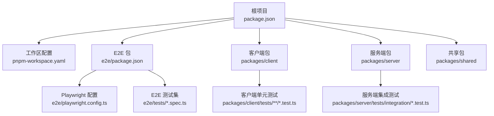
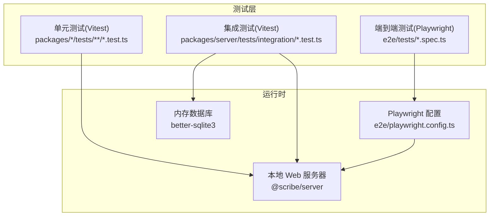
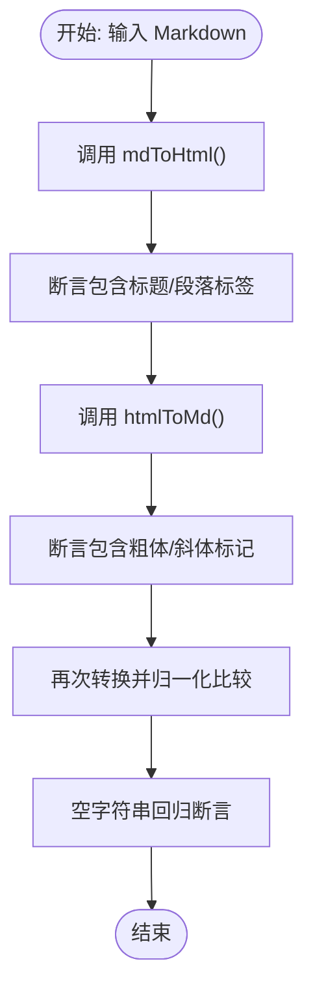
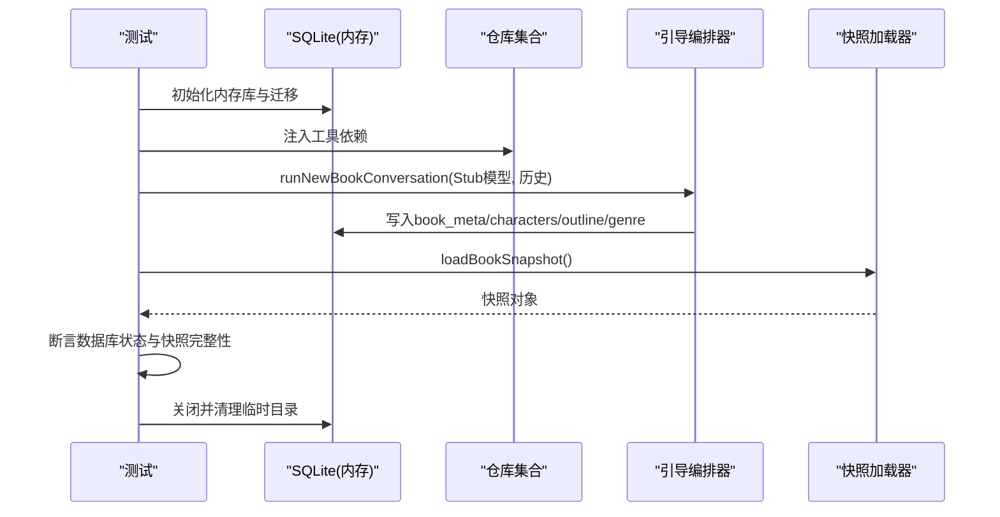
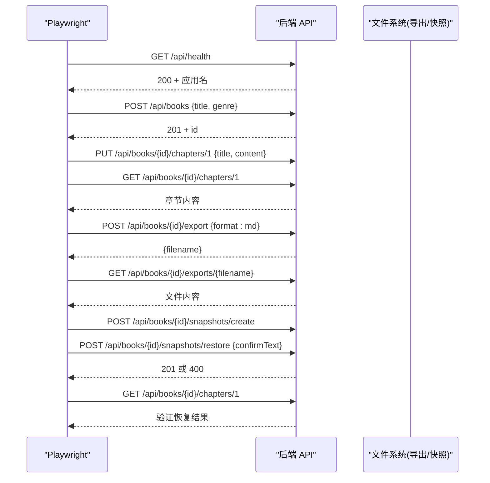
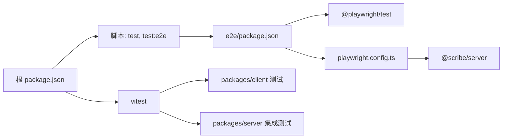

# 测试策略

<cite>
**本文引用的文件**
- [package.json](file://package.json)
- [pnpm-workspace.yaml](file://pnpm-workspace.yaml)
- [e2e/package.json](file://e2e/package.json)
- [e2e/playwright.config.ts](file://e2e/playwright.config.ts)
- [e2e/tests/smoke.spec.ts](file://e2e/tests/smoke.spec.ts)
- [e2e/tests/core-journey.spec.ts](file://e2e/tests/core-journey.spec.ts)
- [packages/client/tests/components/markdown-bridge.test.ts](file://packages/client/tests/components/markdown-bridge.test.ts)
- [packages/server/tests/integration/new-book-flow.test.ts](file://packages/server/tests/integration/new-book-flow.test.ts)
</cite>

## 目录
1. [引言](#引言)
2. [项目结构](#项目结构)
3. [核心组件](#核心组件)
4. [架构总览](#架构总览)
5. [详细组件分析](#详细组件分析)
6. [依赖分析](#依赖分析)
7. [性能考虑](#性能考虑)
8. [故障排查指南](#故障排查指南)
9. [结论](#结论)
10. [附录](#附录)

## 引言
本文件系统化梳理 Scribe 的测试策略，覆盖以下方面：
- Vitest 单元测试：配置、测试文件组织、模拟对象（Mock/Stub）与断言策略
- Playwright 端到端测试：页面对象模型、测试用例设计与浏览器自动化
- 测试金字塔：单元、集成与系统测试的平衡策略
- Mock 与 Stub 使用模式：API 模拟、数据库替换与外部依赖隔离
- 测试数据管理：Fixture、测试环境配置与清理策略
- 实战示例：组件测试、API 测试与集成测试最佳实践
- 持续集成与覆盖率：当前仓库未包含 CI/覆盖率配置，建议参考“附录”
- 性能测试方案：当前仓库未包含性能测试，建议参考“附录”
- 测试驱动开发（TDD）：在项目中的应用与测试驱动的重构策略

## 项目结构
Scribe 采用 monorepo 结构，通过 pnpm 工作区管理多包与 E2E 测试套件。根脚本统一触发各包测试；E2E 子包独立维护 Playwright 配置与测试。

图示来源
- [package.json:1-21](file://package.json#L1-L21)
- [pnpm-workspace.yaml:1-4](file://pnpm-workspace.yaml#L1-L4)
- [e2e/package.json:1-15](file://e2e/package.json#L1-L15)
- [e2e/playwright.config.ts:1-27](file://e2e/playwright.config.ts#L1-L27)

章节来源
- [package.json:1-21](file://package.json#L1-L21)
- [pnpm-workspace.yaml:1-4](file://pnpm-workspace.yaml#L1-L4)

## 核心组件
- 单元测试（Vitest）
  - 客户端组件测试：以功能为粒度拆分用例，强调行为断言与边界条件
  - 示例：Markdown 转换双向一致性与空输入安全
- 集成测试（Vitest）
  - 服务端集成测试：以业务流程为主线，结合内存数据库与工具依赖注入，验证端到端数据流
  - 示例：新书引导全流程（Onboarding），断言数据库状态与快照完整性
- 端到端测试（Playwright）
  - API 级别 E2E：基于真实服务进程，覆盖建书、写章、导出、快照与恢复等关键旅程
  - 示例：核心旅程测试，验证健康检查、书籍 CRUD、章节读写、导出下载与快照恢复

章节来源
- [packages/client/tests/components/markdown-bridge.test.ts:1-32](file://packages/client/tests/components/markdown-bridge.test.ts#L1-L32)
- [packages/server/tests/integration/new-book-flow.test.ts:1-370](file://packages/server/tests/integration/new-book-flow.test.ts#L1-L370)
- [e2e/tests/core-journey.spec.ts:1-82](file://e2e/tests/core-journey.spec.ts#L1-L82)

## 架构总览
下图展示测试体系在系统中的位置与交互关系：单元测试位于客户端与服务端包内；集成测试聚焦服务端业务流程；E2E 通过 Playwright 启动本地 Web 服务器并与真实后端交互。

图示来源
- [e2e/playwright.config.ts:9-26](file://e2e/playwright.config.ts#L9-L26)
- [packages/server/tests/integration/new-book-flow.test.ts:27-66](file://packages/server/tests/integration/new-book-flow.test.ts#L27-L66)

## 详细组件分析

### 单元测试：客户端 Markdown 桥接组件
- 测试目标
  - 验证 Markdown 与 HTML 的双向转换正确性
  - 覆盖常见格式（标题、段落、粗体、斜体、列表）
  - 空字符串安全处理
- 关键策略
  - 行为断言：断言输出包含预期标记或文本片段
  - 边界用例：空输入、复杂混合格式
- 示例入口
  - [packages/client/tests/components/markdown-bridge.test.ts:1-32](file://packages/client/tests/components/markdown-bridge.test.ts#L1-L32)

图示来源
- [packages/client/tests/components/markdown-bridge.test.ts:7-30](file://packages/client/tests/components/markdown-bridge.test.ts#L7-L30)

章节来源
- [packages/client/tests/components/markdown-bridge.test.ts:1-32](file://packages/client/tests/components/markdown-bridge.test.ts#L1-L32)

### 集成测试：新书引导完整流程
- 测试目标
  - 验证 Onboarding 对话驱动的数据初始化与快照生成
  - 断言 SQLite 数据库状态与快照完整性
  - 支持“跳过流程”场景：即使未完成引导也能进入工作台
- 关键策略
  - 内存数据库：每个测试前创建临时目录与内存数据库，迁移初始化 SQL
  - 工具依赖注入：通过仓库工厂函数注入到工具依赖对象
  - Stub 模型：多轮对话序列化返回，模拟语言模型流式输出
  - 清理策略：测试结束后关闭数据库并删除临时目录
- 示例入口
  - [packages/server/tests/integration/new-book-flow.test.ts:1-370](file://packages/server/tests/integration/new-book-flow.test.ts#L1-L370)

图示来源
- [packages/server/tests/integration/new-book-flow.test.ts:27-66](file://packages/server/tests/integration/new-book-flow.test.ts#L27-L66)
- [packages/server/tests/integration/new-book-flow.test.ts:72-96](file://packages/server/tests/integration/new-book-flow.test.ts#L72-L96)
- [packages/server/tests/integration/new-book-flow.test.ts:334-357](file://packages/server/tests/integration/new-book-flow.test.ts#L334-L357)

章节来源
- [packages/server/tests/integration/new-book-flow.test.ts:1-370](file://packages/server/tests/integration/new-book-flow.test.ts#L1-L370)

### 端到端测试：核心旅程（API 级）
- 测试目标
  - 覆盖从建书到快照恢复的完整业务旅程
  - 验证健康检查、书籍 CRUD、章节读写、导出下载与快照恢复
- 关键策略
  - 基于真实服务进程：Playwright 在启动命令中指定服务入口
  - 环境隔离：通过 SCRIBE_HOME 与端口配置隔离测试数据
  - 请求级断言：使用 request 接口发起 HTTP 请求并断言状态码与响应内容
- 示例入口
  - [e2e/tests/core-journey.spec.ts:1-82](file://e2e/tests/core-journey.spec.ts#L1-L82)

图示来源
- [e2e/tests/core-journey.spec.ts:8-81](file://e2e/tests/core-journey.spec.ts#L8-L81)
- [e2e/playwright.config.ts:16-25](file://e2e/playwright.config.ts#L16-L25)

章节来源
- [e2e/tests/core-journey.spec.ts:1-82](file://e2e/tests/core-journey.spec.ts#L1-L82)
- [e2e/playwright.config.ts:1-27](file://e2e/playwright.config.ts#L1-L27)

### 端到端测试：冒烟测试
- 测试目标
  - 确保 Playwright 环境可用，不依赖真实服务
- 关键策略
  - 纯断言：验证基本数学运算
- 示例入口
  - [e2e/tests/smoke.spec.ts:1-7](file://e2e/tests/smoke.spec.ts#L1-L7)

章节来源
- [e2e/tests/smoke.spec.ts:1-7](file://e2e/tests/smoke.spec.ts#L1-L7)

## 依赖分析
- 工作区与脚本
  - 根脚本统一触发各包测试与类型检查；E2E 通过过滤器单独执行
- E2E 依赖
  - Playwright 作为测试运行器与浏览器自动化引擎
  - 本地 Web 服务器由服务端包提供，Playwright 在启动阶段拉起
- 单元/集成测试依赖
  - Vitest 提供断言与测试运行能力
  - better-sqlite3 用于集成测试中的内存数据库

图示来源
- [package.json:6-11](file://package.json#L6-L11)
- [e2e/package.json:6-13](file://e2e/package.json#L6-L13)
- [e2e/playwright.config.ts:16-25](file://e2e/playwright.config.ts#L16-L25)

章节来源
- [package.json:1-21](file://package.json#L1-L21)
- [e2e/package.json:1-15](file://e2e/package.json#L1-L15)

## 性能考虑
- 单元测试
  - 优先使用纯函数与小对象，减少 IO 与外部依赖
- 集成测试
  - 内存数据库与最小化依赖注入，缩短测试执行时间
  - 将昂贵初始化逻辑（如模型调用）替换为 Stub，仅在必要时进行真实调用
- 端到端测试
  - 控制并发与重试次数，避免浏览器资源争用
  - 使用稳定的本地端口与数据目录，减少冷启动开销

## 故障排查指南
- Playwright 无法连接本地服务
  - 检查 webServer 命令是否正确指向服务入口
  - 确认端口与环境变量（如 SCRIBE_HOME、PORT）已生效
- E2E 测试失败但本地服务正常
  - 查看 HTML 报告输出位置，定位失败步骤
  - 增加重试次数或调整超时参数
- 集成测试数据库异常
  - 确认迁移脚本已执行
  - 检查临时目录权限与清理逻辑

章节来源
- [e2e/playwright.config.ts:16-25](file://e2e/playwright.config.ts#L16-L25)

## 结论
Scribe 的测试策略以“测试金字塔”为核心：单元测试覆盖组件行为与边界；集成测试聚焦业务流程与数据一致性；E2E 覆盖关键用户旅程与真实服务交互。通过内存数据库、Stub 模型与环境隔离，有效提升稳定性与可重复性。建议后续补充 CI/覆盖率与性能测试方案，以进一步完善质量保障体系。

## 附录

### 测试金字塔与平衡策略
- 单元测试（客户端组件）
  - 优势：快速、稳定、易调试
  - 建议：以行为断言为主，覆盖边界与错误分支
- 集成测试（服务端业务流程）
  - 优势：贴近真实数据流，验证模块协作
  - 建议：使用内存数据库与工具依赖注入，控制测试范围
- 系统测试（E2E）
  - 优势：端到端验证用户体验
  - 建议：聚焦关键旅程，避免过度冗余

### Mock 与 Stub 使用模式
- API 模拟
  - 使用 Stub 模型返回预定义的流式片段，便于断言多轮对话
  - 参考：[packages/server/tests/integration/new-book-flow.test.ts:72-96](file://packages/server/tests/integration/new-book-flow.test.ts#L72-L96)
- 数据库替换
  - 内存数据库（better-sqlite3）替代真实数据库，提升速度与可控性
  - 参考：[packages/server/tests/integration/new-book-flow.test.ts:29-34](file://packages/server/tests/integration/new-book-flow.test.ts#L29-L34)
- 外部依赖隔离
  - 通过依赖注入与工具函数工厂，将外部依赖替换为可控实现
  - 参考：[packages/server/tests/integration/new-book-flow.test.ts:36-50](file://packages/server/tests/integration/new-book-flow.test.ts#L36-L50)

### 测试数据管理
- Fixture 创建
  - 通过 beforeEach 创建临时目录与内存数据库，迁移初始化 SQL
  - 参考：[packages/server/tests/integration/new-book-flow.test.ts:27-34](file://packages/server/tests/integration/new-book-flow.test.ts#L27-L34)
- 测试环境配置
  - E2E 使用环境变量隔离数据目录与端口
  - 参考：[e2e/playwright.config.ts:21-24](file://e2e/playwright.config.ts#L21-L24)
- 清理策略
  - 测试结束后关闭数据库并递归删除临时目录
  - 参考：[packages/server/tests/integration/new-book-flow.test.ts:61-66](file://packages/server/tests/integration/new-book-flow.test.ts#L61-L66)

### 实战示例入口
- 组件测试（客户端）
  - [packages/client/tests/components/markdown-bridge.test.ts:1-32](file://packages/client/tests/components/markdown-bridge.test.ts#L1-L32)
- API 测试（E2E）
  - [e2e/tests/core-journey.spec.ts:1-82](file://e2e/tests/core-journey.spec.ts#L1-L82)
- 集成测试（服务端）
  - [packages/server/tests/integration/new-book-flow.test.ts:1-370](file://packages/server/tests/integration/new-book-flow.test.ts#L1-L370)

### 持续集成与覆盖率
- 当前状态
  - 仓库未包含 CI 配置与覆盖率统计配置
- 建议
  - 在 CI 中分别运行单元测试、集成测试与 E2E，并上传覆盖率报告
  - 使用 Playwright HTML 报告与 Vitest 覆盖率工具链

### 性能测试方案
- 当前状态
  - 仓库未包含性能测试
- 建议
  - 使用 Vitest 的计时断言评估关键函数性能
  - 使用 Lighthouse 或 Playwright Performance API 评估前端渲染与交互性能

### 测试驱动开发（TDD）在项目中的应用
- 单元测试先行
  - 在新增组件或修改逻辑前编写断言，再实现功能
- 集成测试驱动
  - 以业务流程为目标编写集成测试，逐步填充依赖与实现
- 回归与重构
  - 通过测试套件保证重构后的正确性，优先修复失败用例