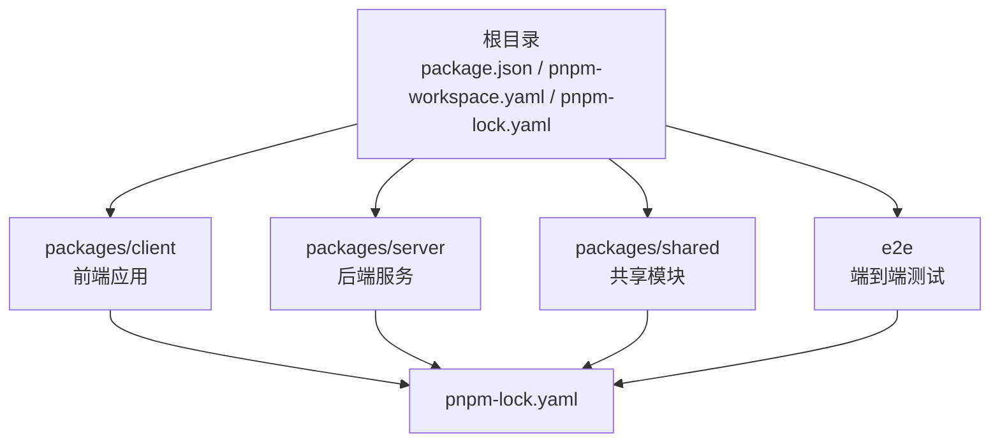
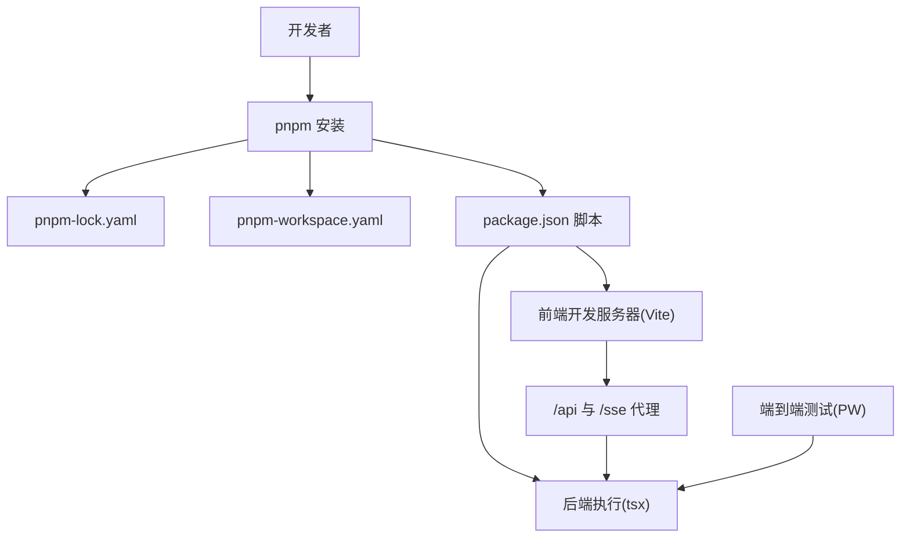
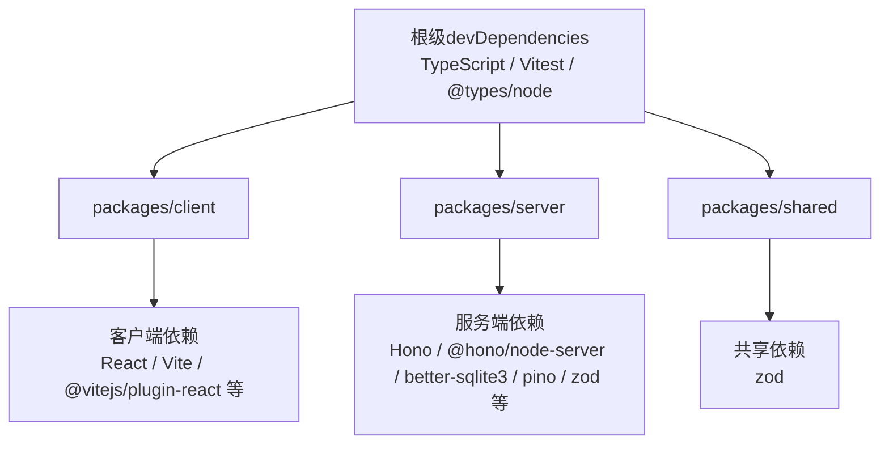
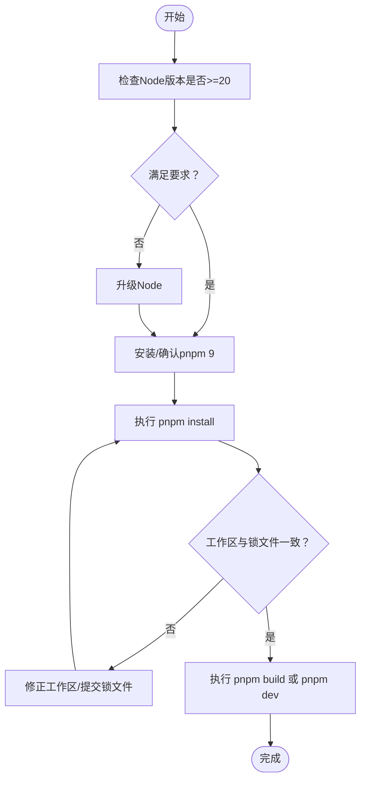

# 安装问题

<cite>
**本文引用的文件**
- [package.json](file://package.json)
- [pnpm-workspace.yaml](file://pnpm-workspace.yaml)
- [pnpm-lock.yaml](file://pnpm-lock.yaml)
- [.npmrc](file://.npmrc)
- [tsconfig.base.json](file://tsconfig.base.json)
- [README.md](file://README.md)
- [e2e/playwright.config.ts](file://e2e/playwright.config.ts)
- [packages/client/vite.config.ts](file://packages/client/vite.config.ts)
- [docs/_implementation-notes.md](file://docs/_implementation-notes.md)
</cite>

## 目录
1. [简介](#简介)
2. [项目结构](#项目结构)
3. [核心组件](#核心组件)
4. [架构总览](#架构总览)
5. [详细组件分析](#详细组件分析)
6. [依赖关系分析](#依赖关系分析)
7. [性能考虑](#性能考虑)
8. [故障排除指南](#故障排除指南)
9. [结论](#结论)
10. [附录](#附录)

## 简介
本指南聚焦于Scribe项目的安装与运行期常见问题，覆盖以下主题：
- Node.js版本兼容性与引擎约束
- pnpm包管理器安装失败与工作区配置问题
- 依赖解析冲突与peer依赖处理
- 权限与网络相关问题（含代理）
- 不同操作系统（Windows、macOS、Linux）的差异与注意事项
- 离线安装与锁文件一致性
- 常见错误信息与对应策略

本指南以仓库中现有配置与脚本为依据，结合pnpm工作区与锁文件的实际内容，给出可操作的诊断与修复步骤。

## 项目结构
Scribe采用monorepo结构，使用pnpm工作区管理多包，并通过统一的TypeScript基础配置与脚本驱动开发流程。关键要点如下：
- 根级脚本通过pnpm工作区并行或分包执行，便于在多包间统一管理开发与测试任务
- 工作区定义了packages子包与e2e测试目录
- 通过.lock文件锁定依赖版本，确保跨环境一致性
- 顶层.npmrc关闭严格peer依赖校验，开启自动安装peer，降低因peer冲突导致的安装失败概率

图表来源
- [pnpm-workspace.yaml:1-4](file://pnpm-workspace.yaml#L1-L4)
- [package.json:6-12](file://package.json#L6-L12)
- [pnpm-lock.yaml:1-20](file://pnpm-lock.yaml#L1-L20)

章节来源
- [pnpm-workspace.yaml:1-4](file://pnpm-workspace.yaml#L1-L4)
- [package.json:6-12](file://package.json#L6-L12)
- [pnpm-lock.yaml:1-20](file://pnpm-lock.yaml#L1-L20)

## 核心组件
- Node.js引擎与包管理器
  - 引擎要求：Node.js >= 20（实测24可用）
  - 包管理器：pnpm 9
- 工作区与脚本
  - 工作区：packages/* 与 e2e
  - 常用脚本：dev、build、test、test:e2e、typecheck
- TypeScript基础配置
  - 目标与模块：ES2022/ESNext
  - 解析策略：Bundler
  - 严格模式与工具链选项
- 前端开发服务器与代理
  - Vite开发服务器，默认端口5173
  - 代理/api与/sse转发至后端
- 端到端测试
  - Playwright配置，自动启动后端服务进行测试

章节来源
- [README.md:5-8](file://README.md#L5-L8)
- [package.json:13-19](file://package.json#L13-L19)
- [pnpm-workspace.yaml:1-4](file://pnpm-workspace.yaml#L1-L4)
- [tsconfig.base.json:1-16](file://tsconfig.base.json#L1-L16)
- [packages/client/vite.config.ts:1-20](file://packages/client/vite.config.ts#L1-L20)
- [e2e/playwright.config.ts:1-27](file://e2e/playwright.config.ts#L1-L27)

## 架构总览
下图展示安装与启动阶段的关键交互：从pnpm安装到前端开发服务器与后端服务的协作。

图表来源
- [package.json:6-12](file://package.json#L6-L12)
- [pnpm-workspace.yaml:1-4](file://pnpm-workspace.yaml#L1-L4)
- [pnpm-lock.yaml:1-20](file://pnpm-lock.yaml#L1-L20)
- [packages/client/vite.config.ts:7-13](file://packages/client/vite.config.ts#L7-L13)
- [e2e/playwright.config.ts:16-25](file://e2e/playwright.config.ts#L16-L25)

## 详细组件分析

### Node.js与包管理器
- Node.js版本要求：>= 20；推荐使用与实测相符的版本（如24）
- pnpm版本：9
- 顶层.npmrc设置：
  - 关闭严格peer依赖校验
  - 自动安装peer
- 作用：降低因peer依赖版本不匹配导致的安装失败风险，提升安装成功率

章节来源
- [README.md:5-8](file://README.md#L5-L8)
- [package.json:17-19](file://package.json#L17-L19)
- [.npmrc:1-3](file://.npmrc#L1-L3)

### pnpm工作区与锁文件
- 工作区范围：packages/* 与 e2e
- 锁文件：pnpm-lock.yaml，记录各包依赖树与解析结果
- 诊断要点：
  - 工作区包内依赖声明需与workspace:*保持一致
  - 锁文件变更需与包目录同时提交，避免工作区状态“脏”
  - 若出现“找不到包”或“解析失败”，优先检查工作区与锁文件一致性

章节来源
- [pnpm-workspace.yaml:1-4](file://pnpm-workspace.yaml#L1-L4)
- [pnpm-lock.yaml:1-20](file://pnpm-lock.yaml#L1-L20)
- [docs/_implementation-notes.md:51-53](file://docs/_implementation-notes.md#L51-L53)

### TypeScript基础配置
- 目标与模块：ES2022/ESNext
- 模块解析：Bundler
- 严格模式与工具链：严格、索引访问检查、esm互操作、跳过库检查、JSON模块解析、隔离模块
- 影响：影响构建与类型检查行为，避免因解析策略不当导致的类型错误

章节来源
- [tsconfig.base.json:1-16](file://tsconfig.base.json#L1-L16)

### 前端开发服务器与代理
- Vite默认端口：5173
- 代理规则：/api 与 /sse 转发至后端地址
- 作用：简化前后端联调，避免跨域与代理配置复杂度

章节来源
- [packages/client/vite.config.ts:1-20](file://packages/client/vite.config.ts#L1-L20)

### 端到端测试与后端启动
- Playwright配置：自动启动后端服务，健康检查端点为/api/health
- 环境变量：SCRIBE_HOME、PORT
- 作用：确保测试环境具备可用的后端实例

章节来源
- [e2e/playwright.config.ts:1-27](file://e2e/playwright.config.ts#L1-L27)

## 依赖关系分析
- 顶层依赖与工具链：TypeScript、Vitest、@types/node
- 工作区包依赖：
  - client：React、Vite、@vitejs/plugin-react、@types/react等
  - server：Hono、@hono/node-server、better-sqlite3、pino、zod等
  - shared：zod等
- peer依赖与引擎约束：
  - 多个依赖声明了node引擎最低版本要求（如>=18）
  - 顶层要求>=20，满足大多数依赖的引擎门槛
- peer依赖处理：
  - 顶层.npmrc关闭严格peer校验，有助于缓解安装期冲突

图表来源
- [package.json:13-19](file://package.json#L13-L19)
- [pnpm-lock.yaml:30-160](file://pnpm-lock.yaml#L30-L160)

章节来源
- [package.json:13-19](file://package.json#L13-L19)
- [pnpm-lock.yaml:30-160](file://pnpm-lock.yaml#L30-L160)

## 性能考虑
- 使用pnpm的快速安装与去重机制，减少磁盘占用与安装时间
- 顶层.npmrc的自动安装peer可减少重复安装，但需关注潜在的版本漂移
- 建议在CI中固定Node与pnpm版本，确保缓存命中与稳定性

## 故障排除指南

### 1. Node.js版本不兼容
- 症状
  - 安装或运行时报“引擎不满足”或“版本过低”
- 诊断
  - 检查当前Node版本是否满足>=20的要求
  - 确认全局/本地Node版本与项目期望一致
- 修复
  - 升级Node至>=20（建议与实测相符的版本）
  - 使用版本管理器（如nvm）切换到正确版本后再执行安装

章节来源
- [README.md:5-8](file://README.md#L5-L8)
- [package.json:17-19](file://package.json#L17-L19)

### 2. pnpm安装失败
- 症状
  - 安装卡住、超时、报错“无法解析依赖”
- 诊断
  - 检查网络连通性与代理设置
  - 确认.pnpmrc与.npmrc未被意外覆盖
  - 查看锁文件是否损坏或与工作区不一致
- 修复
  - 清理缓存后重试：删除node_modules与pnpm-lock.yaml后重新安装
  - 在受限网络环境下配置代理或使用镜像源
  - 确保工作区包与锁文件同步提交

章节来源
- [.npmrc:1-3](file://.npmrc#L1-L3)
- [pnpm-lock.yaml:1-20](file://pnpm-lock.yaml#L1-L20)
- [docs/_implementation-notes.md:51-53](file://docs/_implementation-notes.md#L51-L53)

### 3. 依赖解析冲突与peer依赖问题
- 症状
  - 安装时报peer依赖缺失或版本冲突
  - 运行时报模块找不到或版本不匹配
- 诊断
  - 查看依赖树中是否存在多个版本的同一包
  - 检查顶层.npmrc是否关闭了严格peer校验
- 修复
  - 保持严格peer校验关闭以降低冲突概率（当前配置已开启自动安装peer）
  - 统一升级相关包到兼容版本，避免多版本并存
  - 在CI中固定依赖版本，避免锁文件漂移

章节来源
- [.npmrc:1-3](file://.npmrc#L1-L3)
- [pnpm-lock.yaml:160-220](file://pnpm-lock.yaml#L160-L220)

### 4. 权限问题（Windows/macOS/Linux）
- Windows
  - 以管理员权限运行终端，避免因权限不足导致的写入失败
  - 若使用WSL，确认文件系统权限与路径映射正确
- macOS
  - 确保用户对项目目录具有读写权限
  - 如使用Homebrew安装的Node，请确认PATH指向正确版本
- Linux
  - 使用非root用户安装，避免权限污染
  - 确认npm/pnpm缓存目录权限正确

### 5. 工作区配置问题（pnpm workspace）
- 症状
  - “找不到包”或“workspace:*解析失败”
- 诊断
  - 检查pnpm-workspace.yaml中的包路径是否正确
  - 确认包内package.json的name与workspace声明一致
- 修复
  - 修正工作区路径或包名
  - 提交包目录与pnpm-lock.yaml，避免工作区状态“脏”

章节来源
- [pnpm-workspace.yaml:1-4](file://pnpm-workspace.yaml#L1-L4)
- [docs/_implementation-notes.md:51-53](file://docs/_implementation-notes.md#L51-L53)

### 6. 离线安装与代理配置
- 离线安装
  - 确保本地缓存包含所需包，或提前下载并配置私有镜像
  - 在CI中使用缓存策略，避免重复下载
- 代理配置
  - 设置HTTP/HTTPS代理环境变量
  - 使用pnpm的registry镜像（如国内镜像），并在.npmrc中配置

### 7. 常见错误信息与对策
- “引擎不满足”
  - 升级Node至>=20
- “找不到包/解析失败”
  - 清理缓存与锁文件后重试
  - 检查工作区与锁文件一致性
- “peer依赖缺失”
  - 保持严格peer校验关闭（当前配置已开启自动安装peer）
  - 统一相关包版本
- “端口被占用/代理失败”
  - 修改前端端口或后端端口，避免冲突
  - 检查代理规则与后端健康检查端点

章节来源
- [README.md:5-8](file://README.md#L5-L8)
- [pnpm-workspace.yaml:1-4](file://pnpm-workspace.yaml#L1-L4)
- [pnpm-lock.yaml:1-20](file://pnpm-lock.yaml#L1-L20)
- [packages/client/vite.config.ts:7-13](file://packages/client/vite.config.ts#L7-L13)
- [e2e/playwright.config.ts:16-25](file://e2e/playwright.config.ts#L16-L25)

## 结论
Scribe的安装与运行依赖严格的Node与pnpm版本、一致的工作区与锁文件，以及合理的peer依赖处理策略。遵循本文提供的诊断与修复步骤，可有效规避大多数安装期问题，并在不同操作系统与网络环境下稳定运行。

## 附录

### A. 安装与启动流程（概念示意）

[此图为概念流程，无需图表来源]