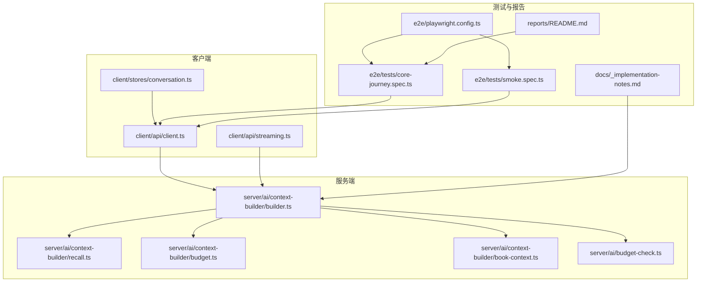
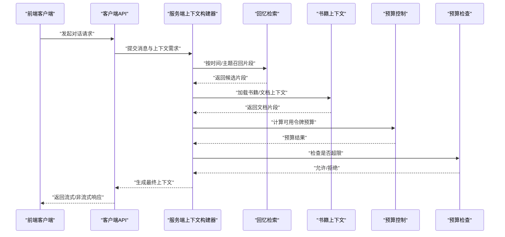
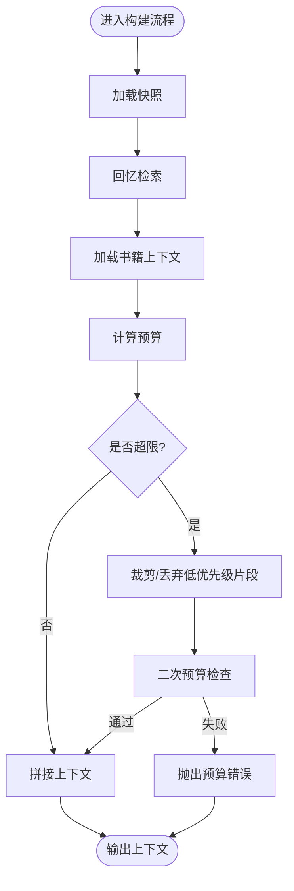
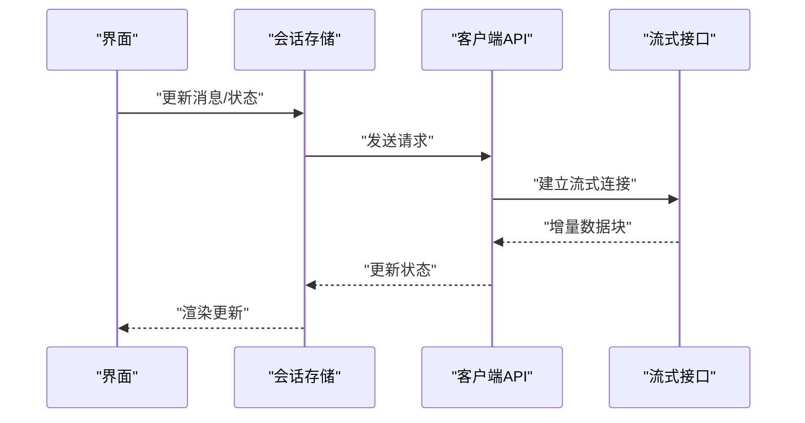
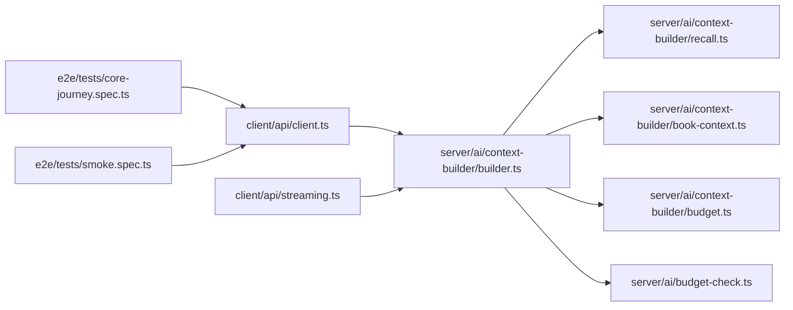

# 性能问题

<cite>
**本文引用的文件**
- [packages/server/src/ai/context-builder/index.ts](file://packages/server/src/ai/context-builder/index.ts)
- [packages/server/src/ai/context-builder/builder.ts](file://packages/server/src/ai/context-builder/builder.ts)
- [packages/server/src/ai/context-builder/recall.ts](file://packages/server/src/ai/context-builder/recall.ts)
- [packages/server/src/ai/context-builder/budget.ts](file://packages/server/src/ai/context-builder/budget.ts)
- [packages/server/src/ai/context-builder/book-context.ts](file://packages/server/src/ai/context-builder/book-context.ts)
- [packages/server/src/ai/budget-check.ts](file://packages/server/src/ai/budget-check.ts)
- [packages/client/src/api/client.ts](file://packages/client/src/api/client.ts)
- [packages/client/src/api/streaming.ts](file://packages/client/src/api/streaming.ts)
- [packages/client/src/stores/conversation.ts](file://packages/client/src/stores/conversation.ts)
- [e2e/tests/core-journey.spec.ts](file://e2e/tests/core-journey.spec.ts)
- [e2e/tests/smoke.spec.ts](file://e2e/tests/smoke/spec.ts)
- [e2e/playwright.config.ts](file://e2e/playwright.config.ts)
- [reports/README.md](file://reports/README.md)
- [docs/_implementation-notes.md](file://docs/_implementation-notes.md)
</cite>

## 目录
1. [简介](#简介)
2. [项目结构](#项目结构)
3. [核心组件](#核心组件)
4. [架构总览](#架构总览)
5. [详细组件分析](#详细组件分析)
6. [依赖关系分析](#依赖关系分析)
7. [性能考量](#性能考量)
8. [故障排查指南](#故障排查指南)
9. [结论](#结论)
10. [附录](#附录)

## 简介
本指南面向Scribe项目的性能问题诊断与优化，聚焦以下场景：AI生成延迟、内存占用过高、CPU使用率异常；提供性能监控指标解读与阈值设定；解释上下文构建器的性能瓶颈识别与优化策略；覆盖数据库查询优化与缓存策略；给出负载与压力测试方法；说明如何分析性能报告并定位热点；包含不同硬件配置下的调优建议；以及性能回归检测与持续监控方案。

## 项目结构
Scribe采用多包工作区（monorepo）组织，核心与客户端代码分置于packages目录下，服务端AI模块位于packages/server/src/ai，其中上下文构建器位于packages/server/src/ai/context-builder。前端客户端位于packages/client，端到端测试位于e2e目录，性能报告与实现注记在reports与docs中。

图表来源
- [packages/server/src/ai/context-builder/builder.ts](file://packages/server/src/ai/context-builder/builder.ts)
- [packages/server/src/ai/context-builder/recall.ts](file://packages/server/src/ai/context-builder/recall.ts)
- [packages/server/src/ai/context-builder/budget.ts](file://packages/server/src/ai/context-builder/budget.ts)
- [packages/server/src/ai/context-builder/book-context.ts](file://packages/server/src/ai/context-builder/book-context.ts)
- [packages/server/src/ai/budget-check.ts](file://packages/server/src/ai/budget-check.ts)
- [packages/client/src/api/client.ts](file://packages/client/src/api/client.ts)
- [packages/client/src/api/streaming.ts](file://packages/client/src/api/streaming.ts)
- [packages/client/src/stores/conversation.ts](file://packages/client/src/stores/conversation.ts)
- [e2e/tests/core-journey.spec.ts](file://e2e/tests/core-journey.spec.ts)
- [e2e/tests/smoke.spec.ts](file://e2e/tests/smoke.spec.ts)
- [e2e/playwright.config.ts](file://e2e/playwright.config.ts)
- [reports/README.md](file://reports/README.md)
- [docs/_implementation-notes.md](file://docs/_implementation-notes.md)

章节来源
- [packages/server/src/ai/context-builder/index.ts](file://packages/server/src/ai/context-builder/index.ts)
- [packages/server/src/ai/context-builder/builder.ts](file://packages/server/src/ai/context-builder/builder.ts)
- [packages/server/src/ai/context-builder/recall.ts](file://packages/server/src/ai/context-builder/recall.ts)
- [packages/server/src/ai/context-builder/budget.ts](file://packages/server/src/ai/context-builder/budget.ts)
- [packages/server/src/ai/context-builder/book-context.ts](file://packages/server/src/ai/context-builder/book-context.ts)
- [packages/server/src/ai/budget-check.ts](file://packages/server/src/ai/budget-check.ts)
- [packages/client/src/api/client.ts](file://packages/client/src/api/client.ts)
- [packages/client/src/api/streaming.ts](file://packages/client/src/api/streaming.ts)
- [packages/client/src/stores/conversation.ts](file://packages/client/src/stores/conversation.ts)
- [e2e/tests/core-journey.spec.ts](file://e2e/tests/core-journey.spec.ts)
- [e2e/tests/smoke.spec.ts](file://e2e/tests/smoke.spec.ts)
- [e2e/playwright.config.ts](file://e2e/playwright.config.ts)
- [reports/README.md](file://reports/README.md)
- [docs/_implementation-notes.md](file://docs/_implementation-notes.md)

## 核心组件
- 上下文构建器：负责从快照、回忆与预算等维度构建AI输入上下文，是影响生成延迟与内存的关键路径。
- 预算控制：限制上下文长度与令牌消耗，避免越界导致的性能退化。
- 回忆检索：从历史记录中召回相关信息，涉及I/O与匹配开销。
- 客户端API与流式接口：负责请求发起与响应接收，影响端到端时延。
- 端到端测试：提供可重复的负载与压力场景，支撑回归与基线对比。

章节来源
- [packages/server/src/ai/context-builder/builder.ts](file://packages/server/src/ai/context-builder/builder.ts)
- [packages/server/src/ai/context-builder/recall.ts](file://packages/server/src/ai/context-builder/recall.ts)
- [packages/server/src/ai/context-builder/budget.ts](file://packages/server/src/ai/context-builder/budget.ts)
- [packages/server/src/ai/context-builder/book-context.ts](file://packages/server/src/ai/context-builder/book-context.ts)
- [packages/server/src/ai/budget-check.ts](file://packages/server/src/ai/budget-check.ts)
- [packages/client/src/api/client.ts](file://packages/client/src/api/client.ts)
- [packages/client/src/api/streaming.ts](file://packages/client/src/api/streaming.ts)
- [packages/client/src/stores/conversation.ts](file://packages/client/src/stores/conversation.ts)

## 架构总览
下图展示从客户端到服务端的典型请求链路，以及与上下文构建器相关的处理阶段。

图表来源
- [packages/client/src/api/client.ts](file://packages/client/src/api/client.ts)
- [packages/client/src/api/streaming.ts](file://packages/client/src/api/streaming.ts)
- [packages/server/src/ai/context-builder/builder.ts](file://packages/server/src/ai/context-builder/builder.ts)
- [packages/server/src/ai/context-builder/recall.ts](file://packages/server/src/ai/context-builder/recall.ts)
- [packages/server/src/ai/context-builder/book-context.ts](file://packages/server/src/ai/context-builder/book-context.ts)
- [packages/server/src/ai/context-builder/budget.ts](file://packages/server/src/ai/context-builder/budget.ts)
- [packages/server/src/ai/budget-check.ts](file://packages/server/src/ai/budget-check.ts)

## 详细组件分析

### 上下文构建器（Context Builder）
- 职责：整合快照、回忆与书籍上下文，依据预算进行裁剪与拼接，输出适合LLM的输入。
- 关键流程：
  - 快照读取：快速获取最近状态，减少重复计算。
  - 回忆检索：基于时间窗口或关键词召回，注意I/O与匹配成本。
  - 书籍上下文：加载外部文档片段，需考虑序列化/反序列化与分块策略。
  - 预算控制：动态计算可用令牌数，避免溢出。
  - 预算检查：在拼接后再次校验，确保合规。

图表来源
- [packages/server/src/ai/context-builder/builder.ts](file://packages/server/src/ai/context-builder/builder.ts)
- [packages/server/src/ai/context-builder/recall.ts](file://packages/server/src/ai/context-builder/recall.ts)
- [packages/server/src/ai/context-builder/book-context.ts](file://packages/server/src/ai/context-builder/book-context.ts)
- [packages/server/src/ai/context-builder/budget.ts](file://packages/server/src/ai/context-builder/budget.ts)
- [packages/server/src/ai/budget-check.ts](file://packages/server/src/ai/budget-check.ts)

章节来源
- [packages/server/src/ai/context-builder/builder.ts](file://packages/server/src/ai/context-builder/builder.ts)
- [packages/server/src/ai/context-builder/recall.ts](file://packages/server/src/ai/context-builder/recall.ts)
- [packages/server/src/ai/context-builder/book-context.ts](file://packages/server/src/ai/context-builder/book-context.ts)
- [packages/server/src/ai/context-builder/budget.ts](file://packages/server/src/ai/context-builder/budget.ts)
- [packages/server/src/ai/budget-check.ts](file://packages/server/src/ai/budget-check.ts)

### 客户端API与流式接口
- 职责：封装HTTP请求、处理流式响应、管理会话状态。
- 性能关注点：
  - 请求合并与去抖，避免频繁小请求。
  - 流式传输的背压与缓冲策略。
  - 重试与超时参数的合理设置。

图表来源
- [packages/client/src/api/client.ts](file://packages/client/src/api/client.ts)
- [packages/client/src/api/streaming.ts](file://packages/client/src/api/streaming.ts)
- [packages/client/src/stores/conversation.ts](file://packages/client/src/stores/conversation.ts)

章节来源
- [packages/client/src/api/client.ts](file://packages/client/src/api/client.ts)
- [packages/client/src/api/streaming.ts](file://packages/client/src/api/streaming.ts)
- [packages/client/src/stores/conversation.ts](file://packages/client/src/stores/conversation.ts)

### 端到端测试与性能报告
- 端到端测试提供稳定的负载场景，可用于：
  - 基线采集：记录正常条件下的响应时间与资源占用。
  - 回归验证：每次变更后的对比分析。
  - 压力测试：逐步提升并发与消息长度，观察拐点。
- 报告与实现注记用于沉淀经验与阈值设定。

章节来源
- [e2e/tests/core-journey.spec.ts](file://e2e/tests/core-journey.spec.ts)
- [e2e/tests/smoke.spec.ts](file://e2e/tests/smoke.spec.ts)
- [e2e/playwright.config.ts](file://e2e/playwright.config.ts)
- [reports/README.md](file://reports/README.md)
- [docs/_implementation-notes.md](file://docs/_implementation-notes.md)

## 依赖关系分析
- 客户端对服务端的依赖集中在API层，服务端内部通过上下文构建器串联回忆、书籍上下文与预算控制。
- 端到端测试通过Playwright驱动浏览器，间接调用客户端API，形成闭环验证。

图表来源
- [packages/client/src/api/client.ts](file://packages/client/src/api/client.ts)
- [packages/client/src/api/streaming.ts](file://packages/client/src/api/streaming.ts)
- [packages/server/src/ai/context-builder/builder.ts](file://packages/server/src/ai/context-builder/builder.ts)
- [packages/server/src/ai/context-builder/recall.ts](file://packages/server/src/ai/context-builder/recall.ts)
- [packages/server/src/ai/context-builder/book-context.ts](file://packages/server/src/ai/context-builder/book-context.ts)
- [packages/server/src/ai/context-builder/budget.ts](file://packages/server/src/ai/context-builder/budget.ts)
- [packages/server/src/ai/budget-check.ts](file://packages/server/src/ai/budget-check.ts)
- [e2e/tests/core-journey.spec.ts](file://e2e/tests/core-journey.spec.ts)
- [e2e/tests/smoke.spec.ts](file://e2e/tests/smoke.spec.ts)

章节来源
- [packages/client/src/api/client.ts](file://packages/client/src/api/client.ts)
- [packages/client/src/api/streaming.ts](file://packages/client/src/api/streaming.ts)
- [packages/server/src/ai/context-builder/builder.ts](file://packages/server/src/ai/context-builder/builder.ts)
- [packages/server/src/ai/context-builder/recall.ts](file://packages/server/src/ai/context-builder/recall.ts)
- [packages/server/src/ai/context-builder/book-context.ts](file://packages/server/src/ai/context-builder/book-context.ts)
- [packages/server/src/ai/context-builder/budget.ts](file://packages/server/src/ai/context-builder/budget.ts)
- [packages/server/src/ai/budget-check.ts](file://packages/server/src/ai/budget-check.ts)
- [e2e/tests/core-journey.spec.ts](file://e2e/tests/core-journey.spec.ts)
- [e2e/tests/smoke.spec.ts](file://e2e/tests/smoke.spec.ts)

## 性能考量

### AI生成延迟
- 影响因素：
  - 上下文长度与碎片数量（回忆与书籍上下文）。
  - 预算计算与裁剪策略的复杂度。
  - 客户端流式传输的缓冲与解码开销。
- 优化策略：
  - 优先保留高相关性片段，降低无效拼接。
  - 使用更高效的召回算法（如向量检索）与索引。
  - 合理设置预算阈值，避免反复裁剪。
  - 在客户端启用背压与批量刷新，减少频繁渲染。

章节来源
- [packages/server/src/ai/context-builder/builder.ts](file://packages/server/src/ai/context-builder/builder.ts)
- [packages/server/src/ai/context-builder/recall.ts](file://packages/server/src/ai/context-builder/recall.ts)
- [packages/server/src/ai/context-builder/budget.ts](file://packages/server/src/ai/context-builder/budget.ts)
- [packages/client/src/api/streaming.ts](file://packages/client/src/api/streaming.ts)

### 内存占用过高
- 可能原因：
  - 上下文累积增长，未及时裁剪或释放。
  - 回忆与书籍上下文未做分页或懒加载。
  - 客户端状态存储未清理旧会话。
- 优化策略：
  - 引入滑动窗口与LRU淘汰机制。
  - 对大文档进行分块与增量加载。
  - 清理不再使用的会话与中间结果。

章节来源
- [packages/server/src/ai/context-builder/builder.ts](file://packages/server/src/ai/context-builder/builder.ts)
- [packages/server/src/ai/context-builder/book-context.ts](file://packages/server/src/ai/context-builder/book-context.ts)
- [packages/client/src/stores/conversation.ts](file://packages/client/src/stores/conversation.ts)

### CPU使用率异常
- 可能原因：
  - 高频拼接与字符串处理。
  - 复杂的预算计算或多次回溯。
  - 客户端渲染与状态更新过于频繁。
- 优化策略：
  - 批量化上下文拼接，减少重复分配。
  - 缓存预算计算中间结果。
  - 降低渲染频率，使用虚拟滚动与节流。

章节来源
- [packages/server/src/ai/context-builder/builder.ts](file://packages/server/src/ai/context-builder/builder.ts)
- [packages/server/src/ai/context-builder/budget.ts](file://packages/server/src/ai/context-builder/budget.ts)
- [packages/client/src/stores/conversation.ts](file://packages/client/src/stores/conversation.ts)

### 数据库查询优化与缓存策略
- 查询优化：
  - 为回忆检索建立合适索引（时间戳、关键词、会话ID）。
  - 使用分页与游标翻页，避免全表扫描。
  - 将热点查询结果缓存至内存或Redis。
- 缓存策略：
  - LRU或LFU缓存常用书籍上下文。
  - 对召回结果进行短期缓存，结合版本号失效。
  - 客户端本地缓存近期会话摘要，减少往返。

章节来源
- [packages/server/src/ai/context-builder/recall.ts](file://packages/server/src/ai/context-builder/recall.ts)
- [packages/server/src/ai/context-builder/book-context.ts](file://packages/server/src/ai/context-builder/book-context.ts)

### 负载测试与压力测试
- 方法：
  - 使用端到端测试脚本模拟真实用户行为，逐步增加并发与消息长度。
  - 记录P50/P95响应时间、CPU/内存曲线与错误率。
  - 对比不同预算阈值与召回策略的效果。
- Playwright配置：
  - 合理设置超时、重试与并发数，确保稳定复现。

章节来源
- [e2e/tests/core-journey.spec.ts](file://e2e/tests/core-journey.spec.ts)
- [e2e/tests/smoke.spec.ts](file://e2e/tests/smoke.spec.ts)
- [e2e/playwright.config.ts](file://e2e/playwright.config.ts)

### 性能报告分析与热点定位
- 指标解读与阈值建议（示例）：
  - 响应时间：P50 ≤ X ms，P95 ≤ Y ms（根据业务目标设定）。
  - CPU利用率：单核 ≤ 80%，整体 ≤ 60%（留有余量）。
  - 内存：RSS峰值 ≤ Z MB（按会话数与上下文长度估算）。
  - 错误率：≤ 1%（含超时与预算错误）。
- 工具与方法：
  - 使用性能剖析工具定位热点函数（如上下文拼接、预算计算）。
  - 结合日志采样与埋点，追踪端到端耗时。

章节来源
- [reports/README.md](file://reports/README.md)
- [docs/_implementation-notes.md](file://docs/_implementation-notes.md)

### 不同硬件配置下的调优建议
- 低配机器：
  - 减少初始上下文长度，提高裁剪阈值。
  - 启用更强的缓存与更保守的召回范围。
- 中配机器：
  - 平衡预算与召回，适度提升并发。
- 高配机器：
  - 开启更激进的召回与更大的上下文，配合更好的网络与磁盘IO。

章节来源
- [packages/server/src/ai/context-builder/budget.ts](file://packages/server/src/ai/context-builder/budget.ts)
- [packages/server/src/ai/context-builder/recall.ts](file://packages/server/src/ai/context-builder/recall.ts)

### 性能回归检测与持续监控
- 方案：
  - 在CI中集成端到端测试，固定阈值报警。
  - 以基准报告为对照，比较每次变更的P50/P95变化。
  - 对关键路径（预算计算、召回、拼接）设置独立探针。

章节来源
- [e2e/tests/core-journey.spec.ts](file://e2e/tests/core-journey.spec.ts)
- [reports/README.md](file://reports/README.md)

## 故障排查指南
- 常见症状与定位思路：
  - 生成缓慢：检查上下文长度、预算阈值与召回效率。
  - 内存飙升：确认会话清理逻辑与缓存淘汰策略。
  - CPU飙升：排查高频拼接与不必要的重算。
- 日志与采样：
  - 在客户端与服务端分别记录关键步骤耗时。
  - 使用采样器捕获热点函数与调用栈。

章节来源
- [packages/server/src/ai/context-builder/builder.ts](file://packages/server/src/ai/context-builder/builder.ts)
- [packages/server/src/ai/context-builder/budget.ts](file://packages/server/src/ai/context-builder/budget.ts)
- [packages/client/src/api/client.ts](file://packages/client/src/api/client.ts)
- [packages/client/src/api/streaming.ts](file://packages/client/src/api/streaming.ts)

## 结论
通过对上下文构建器、客户端API与端到端测试的系统化分析，可以有效识别并缓解AI生成延迟、内存与CPU异常等问题。建议以端到端测试为基线，结合预算控制与缓存策略，在不同硬件配置下制定差异化调优方案，并通过持续监控与回归检测保障长期稳定性。

## 附录
- 相关实现注记与报告说明可参考实现注记与报告文档。

章节来源
- [docs/_implementation-notes.md](file://docs/_implementation-notes.md)
- [reports/README.md](file://reports/README.md)