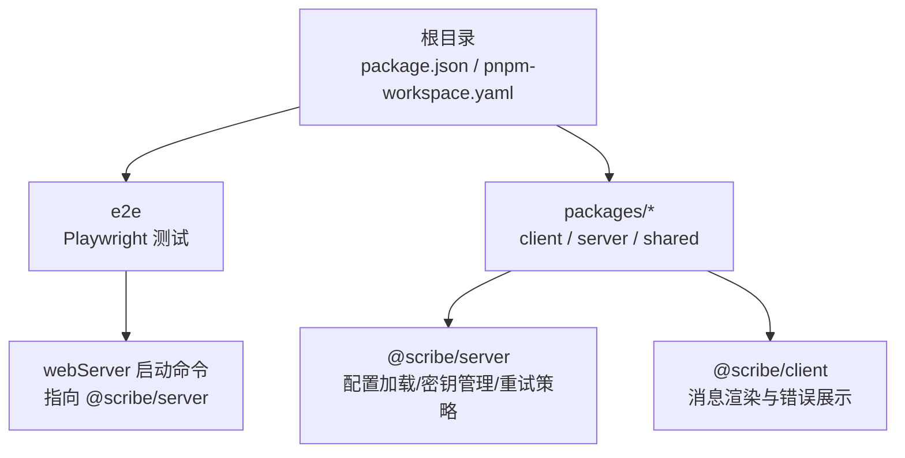
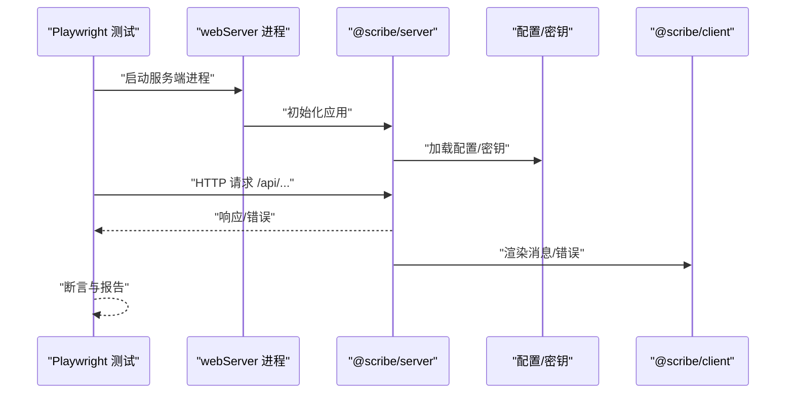
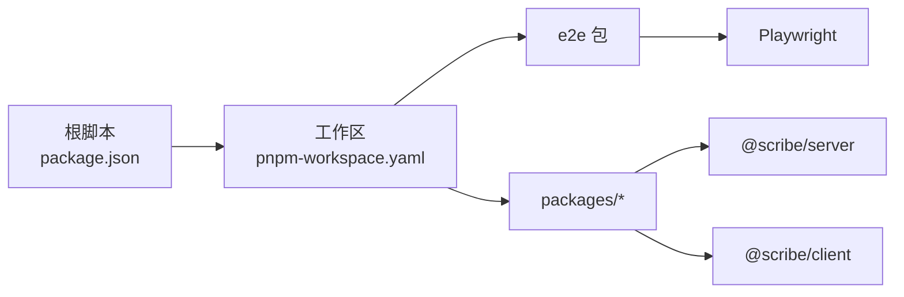

# 故障排除

<cite>
**本文引用的文件**
- [package.json](file://package.json)
- [pnpm-workspace.yaml](file://pnpm-workspace.yaml)
- [e2e/package.json](file://e2e/package.json)
- [e2e/playwright.config.ts](file://e2e/playwright.config.ts)
- [reports/README.md](file://reports/README.md)
- [packages/server/src/config/load.ts](file://packages/server/src/config/load.ts)
- [packages/server/src/config/secrets.ts](file://packages/server/src/config/secrets.ts)
- [packages/server/src/ai/retry.ts](file://packages/server/src/ai/retry.ts)
- [packages/client/src/components/conversation/message.tsx](file://packages/client/src/components/conversation/message.tsx)
- [packages/server/tests/unit/config/paths.test.ts](file://packages/server/tests/unit/config/paths.test.ts)
- [packages/server/tests/integration/settings-routes.test.ts](file://packages/server/tests/integration/settings-routes.test.ts)
- [packages/server/tests/integration/auto-mode.test.ts](file://packages/server/tests/integration/auto-mode.test.ts)
- [packages/server/tests/unit/ai/llm-call.test.ts](file://packages/server/tests/unit/ai/llm-call.test.ts)
- [packages/server/tests/integration/genre-section-conversation.test.ts](file://packages/server/tests/integration/genre-section-conversation.test.ts)
</cite>

## 目录
1. [简介](#简介)
2. [项目结构](#项目结构)
3. [核心组件](#核心组件)
4. [架构总览](#架构总览)
5. [详细组件分析](#详细组件分析)
6. [依赖分析](#依赖分析)
7. [性能考虑](#性能考虑)
8. [故障排除指南](#故障排除指南)
9. [结论](#结论)
10. [附录](#附录)

## 简介
本指南面向Scribe项目的开发者与运维人员，提供系统化的故障排除方法论与实操步骤，覆盖安装与环境准备、运行时错误定位、性能问题诊断、E2E测试失败排查、配置错误修复、跨平台与浏览器差异处理、日志与报告分析、以及预防性维护与监控告警建议。文档所有技术细节均基于仓库中现有脚本、配置与测试文件进行归纳总结。

## 项目结构
Scribe采用多包工作区（pnpm workspaces）组织，核心模块包括：
- 根级脚本与引擎约束：统一开发、构建、测试与类型检查入口，要求Node版本不低于指定范围。
- e2e端到端测试：Playwright驱动，自动启动服务端并执行UI场景。
- packages子包：client（前端）、server（后端）、shared（共享逻辑），通过workspaces统一管理。

图表来源
- [package.json:1-21](file://package.json#L1-L21)
- [pnpm-workspace.yaml:1-4](file://pnpm-workspace.yaml#L1-L4)
- [e2e/playwright.config.ts:16-25](file://e2e/playwright.config.ts#L16-L25)

章节来源
- [package.json:1-21](file://package.json#L1-L21)
- [pnpm-workspace.yaml:1-4](file://pnpm-workspace.yaml#L1-L4)

## 核心组件
- 端到端测试配置：Playwright在本地启动服务端，访问健康检查接口，超时与重试策略明确，便于快速定位服务启动与网络问题。
- 配置与密钥管理：配置文件与secrets文件的读取、落盘与热生效机制，是设置类问题的高发区。
- 重试策略：针对限流、超时、流空闲等错误类别的退避与重试次数控制，影响稳定性与可观测性。
- 客户端错误展示：消息组件对错误字段的呈现，有助于前端侧问题定位与用户反馈。

章节来源
- [e2e/playwright.config.ts:9-26](file://e2e/playwright.config.ts#L9-L26)
- [packages/server/src/config/load.ts:39-59](file://packages/server/src/config/load.ts#L39-L59)
- [packages/server/src/config/secrets.ts:1-29](file://packages/server/src/config/secrets.ts#L1-L29)
- [packages/server/src/ai/retry.ts:1-33](file://packages/server/src/ai/retry.ts#L1-L33)
- [packages/client/src/components/conversation/message.tsx:90-94](file://packages/client/src/components/conversation/message.tsx#L90-L94)

## 架构总览
下图展示了E2E测试的典型调用链：客户端发起请求，Playwright启动服务端进程，服务端加载配置与密钥，处理业务逻辑并通过重试策略应对外部服务波动；前端负责渲染与错误提示。

图表来源
- [e2e/playwright.config.ts:16-25](file://e2e/playwright.config.ts#L16-L25)
- [packages/server/src/config/load.ts:39-59](file://packages/server/src/config/load.ts#L39-L59)
- [packages/server/src/config/secrets.ts:1-29](file://packages/server/src/config/secrets.ts#L1-L29)
- [packages/client/src/components/conversation/message.tsx:90-94](file://packages/client/src/components/conversation/message.tsx#L90-L94)

## 详细组件分析

### 端到端测试与服务启动
- 启动方式：通过过滤器启动服务端主程序，确保测试前服务可用。
- 健康检查：等待特定健康端点就绪，超时时间与重试次数可调。
- 环境变量：通过SCRIBE_HOME与PORT隔离测试数据与端口冲突。
- 报告：HTML报告生成但不自动打开，便于CI集成与本地复盘。

章节来源
- [e2e/playwright.config.ts:16-25](file://e2e/playwright.config.ts#L16-L25)
- [e2e/package.json:6-8](file://e2e/package.json#L6-L8)

### 配置与密钥管理
- 配置加载：对字段进行类型与默认值校验，异常时回退至默认配置，避免启动崩溃。
- 密钥落盘：支持增量更新与权限保护，确保敏感信息安全。
- 掩码显示：对外返回的密钥进行掩码处理，兼顾可观测性与安全性。

章节来源
- [packages/server/src/config/load.ts:39-59](file://packages/server/src/config/load.ts#L39-L59)
- [packages/server/src/config/secrets.ts:1-29](file://packages/server/src/config/secrets.ts#L1-L29)

### 重试策略与错误分类
- 错误分类：区分限流、超时、流空闲、鉴权、上下文溢出与未知错误。
- 退避策略：指数退避与固定重试次数，平衡稳定性与响应时间。
- 观测钩子：可选的尝试回调，便于记录与告警。

章节来源
- [packages/server/src/ai/retry.ts:1-33](file://packages/server/src/ai/retry.ts#L1-L33)

### 客户端错误展示
- 渲染位置：在消息组件中以警告样式展示错误信息，便于用户感知。
- 用途：辅助前端侧问题定位与用户反馈闭环。

章节来源
- [packages/client/src/components/conversation/message.tsx:90-94](file://packages/client/src/components/conversation/message.tsx#L90-L94)

### 跨平台路径解析与测试
- 平台差异：Linux、macOS、Windows分别使用不同的应用根目录约定。
- 测试保障：通过模拟平台与家目录，验证路径解析正确性。

章节来源
- [packages/server/tests/unit/config/paths.test.ts:15-33](file://packages/server/tests/unit/config/paths.test.ts#L15-L33)

### 设置路由与密钥热生效
- 初始状态：未配置API Key时返回相应标志位。
- 更新流程：PUT设置后，密钥落盘并热生效，同时返回掩码后的Key。
- 断言要点：确保落盘文件存在、内容正确，模型管理器已更新。

章节来源
- [packages/server/tests/integration/settings-routes.test.ts:75-96](file://packages/server/tests/integration/settings-routes.test.ts#L75-L96)

### 自动模式预算上限
- 场景：读取与更新单次预算上限，验证持久化与读取一致性。
- 用途：防止单次调用成本过高，保障资源可控。

章节来源
- [packages/server/tests/integration/auto-mode.test.ts:370-385](file://packages/server/tests/integration/auto-mode.test.ts#L370-L385)

### 工具调用错误与流收尾
- 场景：工具首次调用抛错，后续轮次由LLM改以文本收尾，流最终以done结束。
- 不变量：确保错误传播路径或以done收尾，数据库状态不受影响。

章节来源
- [packages/server/tests/unit/ai/llm-call.test.ts:41-79](file://packages/server/tests/unit/ai/llm-call.test.ts#L41-L79)
- [packages/server/tests/integration/genre-section-conversation.test.ts:223-262](file://packages/server/tests/integration/genre-section-conversation.test.ts#L223-L262)

## 依赖分析
- 工作区：packages与e2e均纳入工作区，保证依赖与脚本的一致性。
- 脚本耦合：根脚本通过过滤器调用具体包的命令，形成清晰的执行边界。
- E2E依赖：Playwright作为测试框架，服务端作为被测目标。

图表来源
- [package.json:6-11](file://package.json#L6-L11)
- [pnpm-workspace.yaml:1-4](file://pnpm-workspace.yaml#L1-L4)
- [e2e/package.json:10-13](file://e2e/package.json#L10-L13)

章节来源
- [package.json:6-11](file://package.json#L6-L11)
- [pnpm-workspace.yaml:1-4](file://pnpm-workspace.yaml#L1-L4)

## 性能考虑
- 重试与退避：合理设置最大重试次数与退避间隔，避免雪崩效应。
- 超时与重试：E2E层设置合理的超时与重试，减少不稳定因素对结果的影响。
- 日志与报告：利用HTML报告与列表报告，结合日志定位瓶颈与失败根因。

章节来源
- [packages/server/src/ai/retry.ts:9-16](file://packages/server/src/ai/retry.ts#L9-L16)
- [e2e/playwright.config.ts:11-12](file://e2e/playwright.config.ts#L11-L12)

## 故障排除指南

### 一、安装与环境准备
- Node版本与包管理器
  - 确认Node版本满足要求，使用指定版本的pnpm。
  - 参考：根脚本与引擎约束。
- 工作区安装
  - 在根目录执行安装，确保packages与e2e依赖一致。
  - 参考：工作区定义。
- 浏览器与驱动
  - E2E使用Chromium，如需安装浏览器驱动，请使用提供的脚本。
  - 参考：e2e包脚本。

章节来源
- [package.json:18-20](file://package.json#L18-L20)
- [pnpm-workspace.yaml:1-4](file://pnpm-workspace.yaml#L1-L4)
- [e2e/package.json:7-8](file://e2e/package.json#L7-L8)

### 二、运行时错误定位
- 服务启动失败
  - 检查webServer命令是否能成功启动服务端主程序。
  - 查看健康检查端点可达性与超时设置。
  - 参考：E2E配置中的webServer段。
- 配置加载异常
  - 若配置JSON格式错误或字段缺失，将回退到默认配置。
  - 建议：核对配置文件完整性与字段类型。
  - 参考：配置加载逻辑。
- 密钥相关问题
  - PUT设置后应落盘并热生效；若未生效，检查密钥文件是否存在与权限。
  - 返回值应包含掩码后的Key，便于确认更新成功。
  - 参考：设置路由测试与密钥落盘逻辑。
- 工具调用错误
  - 工具抛错时，流应以done收尾；数据库状态不应被破坏。
  - 参考：工具调用与对话测试。

章节来源
- [e2e/playwright.config.ts:16-25](file://e2e/playwright.config.ts#L16-L25)
- [packages/server/src/config/load.ts:52-54](file://packages/server/src/config/load.ts#L52-L54)
- [packages/server/tests/integration/settings-routes.test.ts:75-96](file://packages/server/tests/integration/settings-routes.test.ts#L75-L96)
- [packages/server/src/config/secrets.ts:17-23](file://packages/server/src/config/secrets.ts#L17-L23)
- [packages/server/tests/unit/ai/llm-call.test.ts:73-79](file://packages/server/tests/unit/ai/llm-call.test.ts#L73-L79)
- [packages/server/tests/integration/genre-section-conversation.test.ts:256-262](file://packages/server/tests/integration/genre-section-conversation.test.ts#L256-L262)

### 三、性能问题诊断
- 重试与退避
  - 检查错误分类与重试策略是否匹配当前外部服务行为。
  - 参考：重试策略配置。
- 超时与重试参数
  - E2E层的超时与重试次数可适当调整，以平衡稳定性与速度。
  - 参考：E2E配置。
- 报告分析
  - 使用HTML报告定位耗时环节，结合日志进行根因分析。
  - 参考：报告说明。

章节来源
- [packages/server/src/ai/retry.ts:9-16](file://packages/server/src/ai/retry.ts#L9-L16)
- [e2e/playwright.config.ts:11-12](file://e2e/playwright.config.ts#L11-L12)
- [reports/README.md:1-14](file://reports/README.md#L1-L14)

### 四、E2E测试失败排查
- 启动阶段
  - 确认服务端进程能正常启动，健康检查端点可达。
  - 检查端口占用与数据目录隔离。
- 场景失败
  - 对照测试断言，逐项比对期望与实际结果。
  - 参考：设置路由、自动模式、工具调用与对话等测试。
- 报告与截图
  - HTML报告与列表报告可用于失败复现与对比。
  - 参考：E2E配置中的reporter选项。

章节来源
- [e2e/playwright.config.ts:16-25](file://e2e/playwright.config.ts#L16-L25)
- [packages/server/tests/integration/settings-routes.test.ts:75-96](file://packages/server/tests/integration/settings-routes.test.ts#L75-L96)
- [packages/server/tests/integration/auto-mode.test.ts:370-385](file://packages/server/tests/integration/auto-mode.test.ts#L370-L385)
- [packages/server/tests/unit/ai/llm-call.test.ts:41-79](file://packages/server/tests/unit/ai/llm-call.test.ts#L41-L79)
- [packages/server/tests/integration/genre-section-conversation.test.ts:223-262](file://packages/server/tests/integration/genre-section-conversation.test.ts#L223-L262)

### 五、跨平台与浏览器差异
- 路径解析
  - Linux、macOS、Windows使用不同的应用根目录约定，确保路径解析正确。
  - 参考：路径解析测试。
- 浏览器
  - 当前E2E仅配置Chromium，如需其他浏览器请扩展projects。
  - 参考：E2E配置。

章节来源
- [packages/server/tests/unit/config/paths.test.ts:15-33](file://packages/server/tests/unit/config/paths.test.ts#L15-L33)
- [e2e/playwright.config.ts:15](file://e2e/playwright.config.ts#L15)

### 六、配置错误常见模式与修复
- 配置字段缺失或类型不符
  - 将回退到默认配置，检查配置文件格式与字段名。
  - 参考：配置加载逻辑。
- 密钥未落盘或权限不当
  - 确保secrets文件存在且权限正确，更新后验证热生效。
  - 参考：密钥落盘与热生效测试。
- 掩码显示异常
  - 返回值应包含掩码Key，若异常需检查掩码实现。
  - 参考：密钥掩码逻辑。

章节来源
- [packages/server/src/config/load.ts:39-59](file://packages/server/src/config/load.ts#L39-L59)
- [packages/server/tests/integration/settings-routes.test.ts:75-96](file://packages/server/tests/integration/settings-routes.test.ts#L75-L96)
- [packages/server/src/config/secrets.ts:25-29](file://packages/server/src/config/secrets.ts#L25-L29)

### 七、日志分析、错误追踪与性能监控
- 日志与报告
  - 使用HTML报告与列表报告，结合E2E配置中的reporter设置。
  - 参考：E2E配置。
- 错误追踪
  - 结合前端错误展示组件，定位用户可见错误。
  - 参考：消息组件错误渲染。
- 性能监控
  - 通过重试策略与超时参数调节，观察系统在压力下的表现。
  - 参考：重试策略与E2E超时设置。

章节来源
- [e2e/playwright.config.ts:14](file://e2e/playwright.config.ts#L14)
- [packages/client/src/components/conversation/message.tsx:90-94](file://packages/client/src/components/conversation/message.tsx#L90-L94)
- [packages/server/src/ai/retry.ts:18-33](file://packages/server/src/ai/retry.ts#L18-L33)
- [e2e/playwright.config.ts:11-12](file://e2e/playwright.config.ts#L11-L12)

### 八、测试报告解读
- 报告用途
  - 用于说明运行进度、暴露问题与提供可复查的证据。
  - 参考：报告说明。
- 使用原则
  - 临时排查产物优先不提交；仅对交接或复现有价值时才保留。
  - 参考：报告说明。

章节来源
- [reports/README.md:1-14](file://reports/README.md#L1-L14)

### 九、系统性排查流程
- 环境检查
  - Node版本、pnpm版本、工作区安装状态。
- 依赖与脚本
  - 校验根脚本与工作区配置，确保命令可执行。
- 服务启动
  - 检查webServer命令、健康检查端点、端口与数据目录。
- 配置与密钥
  - 校验配置文件与secrets文件，确认落盘与热生效。
- 功能验证
  - 运行单元与集成测试，对照断言逐项验证。
- 性能与稳定性
  - 调整重试与超时参数，观察系统表现。
- 报告与复盘
  - 生成并分析报告，沉淀问题与修复方案。

章节来源
- [package.json:6-11](file://package.json#L6-L11)
- [pnpm-workspace.yaml:1-4](file://pnpm-workspace.yaml#L1-L4)
- [e2e/playwright.config.ts:16-25](file://e2e/playwright.config.ts#L16-L25)
- [packages/server/src/config/load.ts:39-59](file://packages/server/src/config/load.ts#L39-L59)
- [packages/server/src/config/secrets.ts:17-23](file://packages/server/src/config/secrets.ts#L17-L23)

### 十、社区支持与问题报告模板
- 社区支持
  - 通过项目内报告与测试用例进行问题复现与定位。
  - 参考：报告说明与测试用例。
- 问题报告模板（建议）
  - 环境信息：操作系统、Node版本、pnpm版本。
  - 复现步骤：最小可复现操作序列。
  - 预期结果与实际结果：明确对比。
  - 日志与报告：附带HTML报告与列表报告链接。
  - 附加信息：配置文件片段、密钥掩码后的Key（不泄露原始值）。

章节来源
- [reports/README.md:1-14](file://reports/README.md#L1-L14)
- [packages/server/tests/integration/settings-routes.test.ts:75-96](file://packages/server/tests/integration/settings-routes.test.ts#L75-L96)

## 结论
本指南提供了从环境准备到根因分析的完整方法论，并结合仓库中的脚本、配置与测试用例，给出了可操作的排障步骤与参考路径。建议在日常开发中遵循“先检查环境与依赖、再验证服务与配置、最后回归测试与报告”的流程，配合重试策略与报告体系，持续提升系统的稳定性与可观测性。

## 附录

### A. 常见问题与解决方案速查
- Node版本过低
  - 现象：安装或运行报错。
  - 解决：升级Node至要求版本，重新安装依赖。
- 服务启动失败
  - 现象：健康检查超时。
  - 解决：检查webServer命令、端口占用、数据目录权限。
- 配置加载异常
  - 现象：功能不可用或默认配置生效。
  - 解决：修正配置文件格式与字段，确保类型匹配。
- 密钥未生效
  - 现象：PUT设置后仍无法使用。
  - 解决：检查secrets文件存在与权限，确认热生效流程。
- 工具调用失败
  - 现象：流未以done收尾或数据库状态异常。
  - 解决：根据测试断言修正工具实现与对话逻辑。

章节来源
- [package.json:18-20](file://package.json#L18-L20)
- [e2e/playwright.config.ts:16-25](file://e2e/playwright.config.ts#L16-L25)
- [packages/server/src/config/load.ts:52-54](file://packages/server/src/config/load.ts#L52-L54)
- [packages/server/src/config/secrets.ts:17-23](file://packages/server/src/config/secrets.ts#L17-L23)
- [packages/server/tests/unit/ai/llm-call.test.ts:73-79](file://packages/server/tests/unit/ai/llm-call.test.ts#L73-L79)
- [packages/server/tests/integration/genre-section-conversation.test.ts:256-262](file://packages/server/tests/integration/genre-section-conversation.test.ts#L256-L262)

### B. 预防性维护与监控告警建议
- 预防性维护
  - 定期校验配置文件与密钥文件，保持最小权限与掩码显示。
  - 在CI中运行E2E与单元测试，确保回归稳定。
- 监控告警
  - 基于重试策略与超时参数，建立告警阈值。
  - 结合HTML报告与日志，设置失败率与响应时间告警。

章节来源
- [packages/server/src/ai/retry.ts:9-16](file://packages/server/src/ai/retry.ts#L9-L16)
- [e2e/playwright.config.ts:11-12](file://e2e/playwright.config.ts#L11-L12)
- [reports/README.md:1-14](file://reports/README.md#L1-L14)