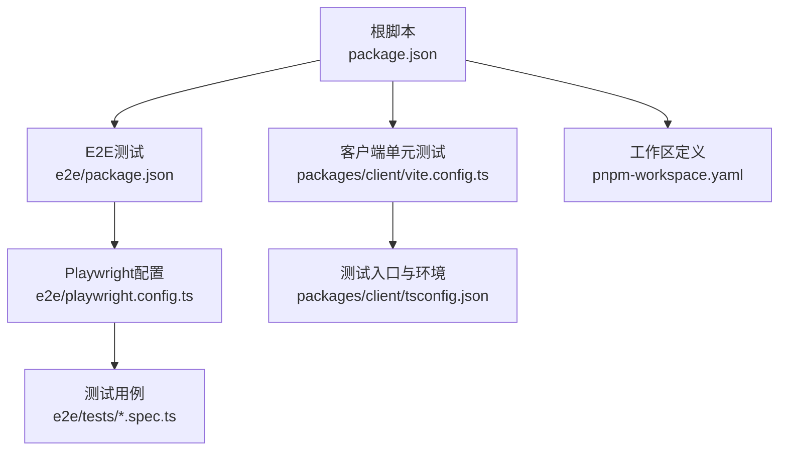
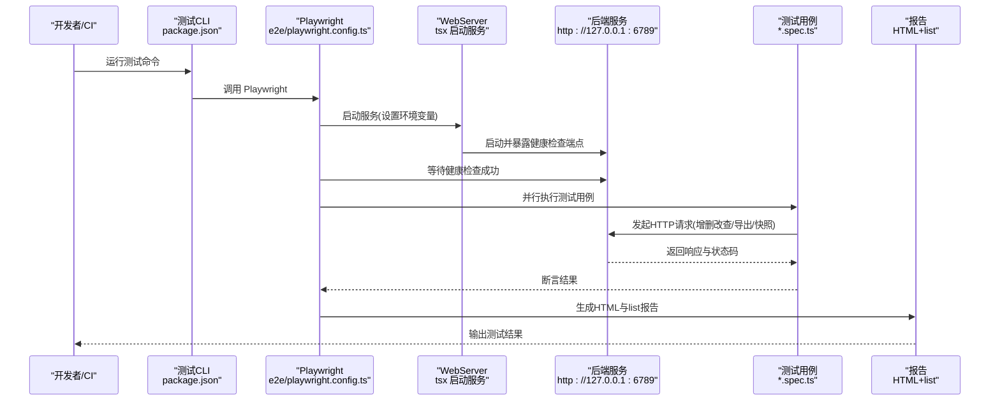
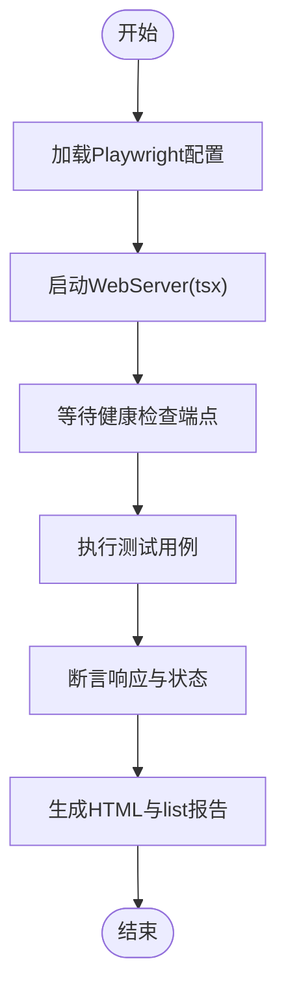
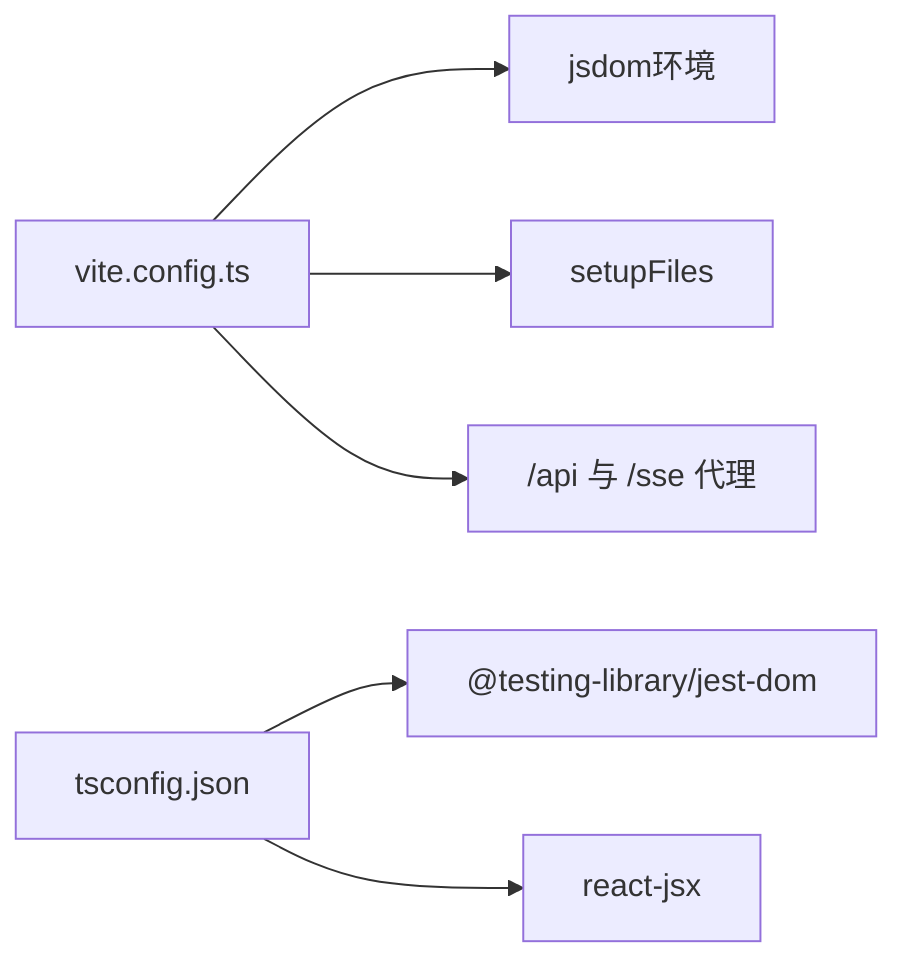
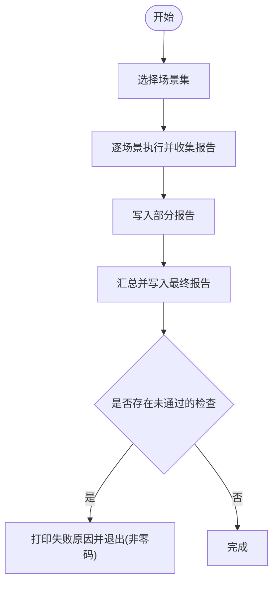
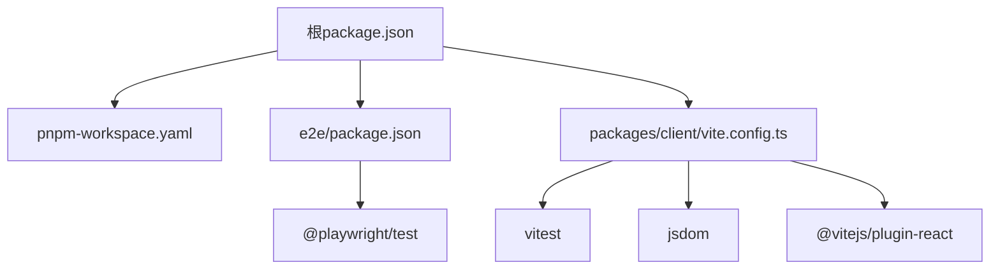
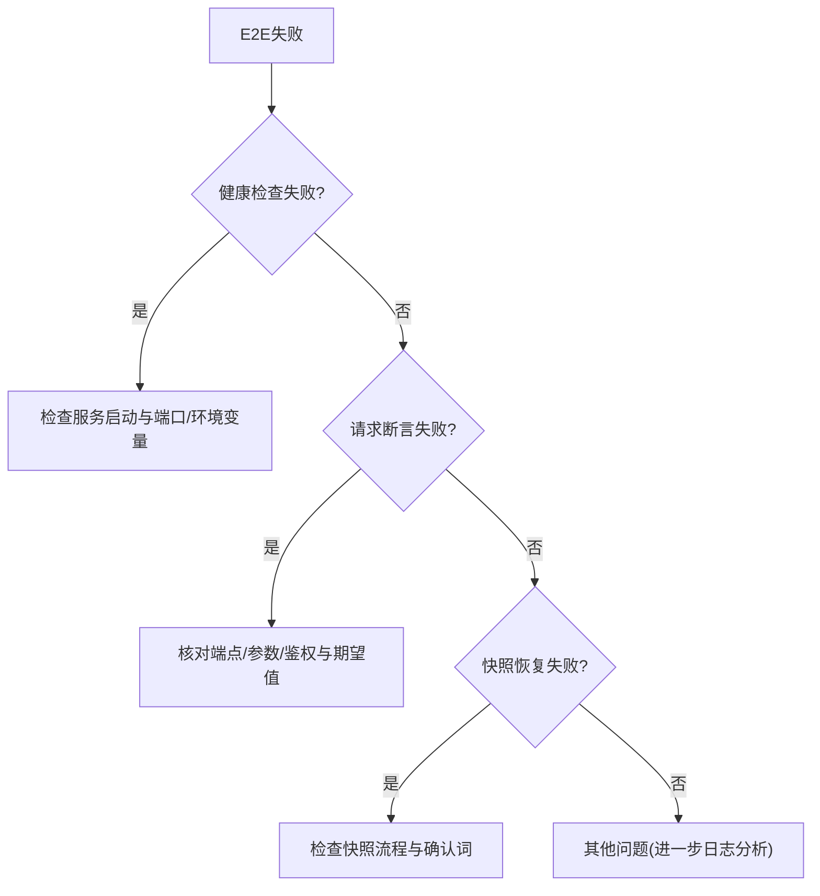

# 测试与调试

<cite>
**本文引用的文件**
- [e2e/playwright.config.ts](file://e2e/playwright.config.ts)
- [e2e/package.json](file://e2e/package.json)
- [e2e/tests/core-journey.spec.ts](file://e2e/tests/core-journey.spec.ts)
- [e2e/tests/smoke.spec.ts](file://e2e/tests/smoke.spec.ts)
- [package.json](file://package.json)
- [pnpm-workspace.yaml](file://pnpm-workspace.yaml)
- [packages/client/vite.config.ts](file://packages/client/vite.config.ts)
- [packages/client/tsconfig.json](file://packages/client/tsconfig.json)
- [packages/server/tools/monitor-generic-record-flow.ts](file://packages/server/tools/monitor-generic-record-flow.ts)
- [reports/README.md](file://reports/README.md)
- [samples/README.md](file://samples/README.md)
</cite>

## 目录
1. [简介](#简介)
2. [项目结构](#项目结构)
3. [核心组件](#核心组件)
4. [架构总览](#架构总览)
5. [详细组件分析](#详细组件分析)
6. [依赖关系分析](#依赖关系分析)
7. [性能考量](#性能考量)
8. [故障排除指南](#故障排除指南)
9. [结论](#结论)
10. [附录](#附录)

## 简介
本指南面向Scribe项目的测试与调试场景，覆盖端到端（E2E）测试、单元测试、覆盖率分析、测试环境搭建与维护、测试数据管理与清理、CI/CD流水线中的测试问题诊断、性能与负载测试、测试报告解读与问题定位，以及调试工具的使用方法与配置要点。文档基于仓库内现有配置与测试文件进行系统化梳理，并提供可操作的排障步骤与最佳实践。

## 项目结构
Scribe采用monorepo结构，通过pnpm工作区组织多包。测试相关的关键位置如下：
- E2E测试位于 e2e 目录，包含 Playwright 配置、测试脚本与报告生成器
- 客户端包（packages/client）使用Vitest进行单元测试，配合Vite开发服务器与代理
- 顶层脚本统一调度各包测试任务
- 报告与样例位于 reports 与 samples 目录

图表来源
- [package.json:1-21](file://package.json#L1-L21)
- [e2e/package.json:1-15](file://e2e/package.json#L1-L15)
- [e2e/playwright.config.ts:1-27](file://e2e/playwright.config.ts#L1-L27)
- [packages/client/vite.config.ts:1-19](file://packages/client/vite.config.ts#L1-L19)
- [pnpm-workspace.yaml:1-3](file://pnpm-workspace.yaml#L1-L3)

章节来源
- [package.json:1-21](file://package.json#L1-L21)
- [pnpm-workspace.yaml:1-3](file://pnpm-workspace.yaml#L1-L3)

## 核心组件
- E2E测试框架与配置：基于Playwright，自动启动服务进程、设置超时与重试、生成HTML报告
- 单元测试框架与环境：基于Vitest（jsdom），支持测试工具库与全局设置
- 顶层测试脚本：统一入口，便于在CI或本地运行全量测试
- 监控与报告工具：通用记录流程监控工具用于生成报告并判定失败

章节来源
- [e2e/playwright.config.ts:1-27](file://e2e/playwright.config.ts#L1-L27)
- [e2e/package.json:1-15](file://e2e/package.json#L1-L15)
- [packages/client/vite.config.ts:1-19](file://packages/client/vite.config.ts#L1-L19)
- [packages/client/tsconfig.json:1-9](file://packages/client/tsconfig.json#L1-L9)
- [package.json:1-21](file://package.json#L1-L21)
- [packages/server/tools/monitor-generic-record-flow.ts:760-794](file://packages/server/tools/monitor-generic-record-flow.ts#L760-L794)

## 架构总览
下图展示E2E测试从启动到执行再到报告输出的整体流程，包括服务自启动、请求断言与报告生成。

图表来源
- [package.json:6-11](file://package.json#L6-L11)
- [e2e/playwright.config.ts:9-26](file://e2e/playwright.config.ts#L9-L26)
- [e2e/tests/core-journey.spec.ts:1-82](file://e2e/tests/core-journey.spec.ts#L1-L82)

## 详细组件分析

### E2E测试配置与执行
- 关键配置项
  - 测试目录与超时：指定测试目录、单个用例超时、重试次数
  - 基础URL与语言：统一基础地址与区域设置
  - 报告器：list与HTML报告（不自动打开）
  - 项目与浏览器：单一项目（chromium）
  - WebServer：通过tsx启动后端服务，等待健康检查端点，设置环境变量（数据目录、端口）
- 执行流程
  - 通过顶层脚本触发E2E测试
  - Playwright根据配置启动服务进程
  - 执行测试用例，对API端点进行增删改查、导出、快照与恢复等操作
  - 生成HTML报告并输出列表式报告

图表来源
- [e2e/playwright.config.ts:9-26](file://e2e/playwright.config.ts#L9-L26)
- [e2e/tests/core-journey.spec.ts:8-81](file://e2e/tests/core-journey.spec.ts#L8-L81)

章节来源
- [e2e/playwright.config.ts:1-27](file://e2e/playwright.config.ts#L1-L27)
- [e2e/package.json:6-9](file://e2e/package.json#L6-L9)
- [e2e/tests/core-journey.spec.ts:1-82](file://e2e/tests/core-journey.spec.ts#L1-L82)

### 单元测试与调试环境
- Vite/Vitest配置
  - jsdom环境、全局启用、测试设置文件
  - React JSX支持、类型扩展
  - 开发服务器代理到后端服务端口，便于前端组件与后端联调
- 调试技巧
  - 使用Vitest交互模式与断点调试
  - 在setup文件中引入测试工具库，统一断言风格
  - 通过Vite代理快速验证接口连通性与响应格式

图表来源
- [packages/client/vite.config.ts:14-18](file://packages/client/vite.config.ts#L14-L18)
- [packages/client/tsconfig.json:1-9](file://packages/client/tsconfig.json#L1-L9)

章节来源
- [packages/client/vite.config.ts:1-19](file://packages/client/vite.config.ts#L1-L19)
- [packages/client/tsconfig.json:1-9](file://packages/client/tsconfig.json#L1-L9)

### 监控与报告工具
- 工具职责
  - 针对通用记录流程批量运行场景，收集报告与工具事件
  - 将部分中间产物与最终报告写入文件，失败时退出码非零
- 报告解读
  - 失败场景会汇总失败原因并打印，便于定位问题

图表来源
- [packages/server/tools/monitor-generic-record-flow.ts:760-794](file://packages/server/tools/monitor-generic-record-flow.ts#L760-L794)

章节来源
- [packages/server/tools/monitor-generic-record-flow.ts:760-794](file://packages/server/tools/monitor-generic-record-flow.ts#L760-L794)

## 依赖关系分析
- 工作区与包管理
  - pnpm工作区包含 packages/* 与 e2e
  - 顶层脚本统一调度各包测试
- E2E依赖
  - Playwright作为测试框架
  - 通过webServer字段启动后端服务进程
- 单测依赖
  - Vitest + jsdom + React插件
  - Vite代理到后端服务端口

图表来源
- [package.json:6-11](file://package.json#L6-L11)
- [pnpm-workspace.yaml:1-3](file://pnpm-workspace.yaml#L1-L3)
- [e2e/package.json:10-13](file://e2e/package.json#L10-L13)
- [packages/client/vite.config.ts:14-18](file://packages/client/vite.config.ts#L14-L18)

章节来源
- [package.json:1-21](file://package.json#L1-L21)
- [pnpm-workspace.yaml:1-3](file://pnpm-workspace.yaml#L1-L3)
- [e2e/package.json:1-15](file://e2e/package.json#L1-L15)
- [packages/client/vite.config.ts:1-19](file://packages/client/vite.config.ts#L1-L19)

## 性能考量
- E2E测试超时与重试
  - 合理设置超时与重试次数，避免瞬时网络抖动导致误判
- 服务启动与健康检查
  - 通过健康检查端点确认服务可用后再执行测试
- 报告生成
  - HTML报告便于人工审阅，建议在CI中保留归档以便后续分析

章节来源
- [e2e/playwright.config.ts:11-12](file://e2e/playwright.config.ts#L11-L12)
- [e2e/playwright.config.ts:16-25](file://e2e/playwright.config.ts#L16-L25)

## 故障排除指南

### E2E测试失败的诊断与修复
- 健康检查失败
  - 现象：测试等待健康检查超时
  - 排查：确认服务启动命令、端口与环境变量是否正确；查看服务日志
  - 修复：调整webServer配置或提升超时时间
- 请求断言失败
  - 现象：状态码或响应体不符合预期
  - 排查：核对API端点、请求参数与鉴权；对比期望值
  - 修复：修正测试用例或后端实现
- 快照恢复校验失败
  - 现象：恢复后内容未还原或仍包含误改内容
  - 排查：确认快照创建与恢复流程、确认词是否正确传递
  - 修复：完善恢复逻辑或更新测试断言

图表来源
- [e2e/playwright.config.ts:16-25](file://e2e/playwright.config.ts#L16-L25)
- [e2e/tests/core-journey.spec.ts:8-81](file://e2e/tests/core-journey.spec.ts#L8-L81)

章节来源
- [e2e/playwright.config.ts:16-25](file://e2e/playwright.config.ts#L16-L25)
- [e2e/tests/core-journey.spec.ts:1-82](file://e2e/tests/core-journey.spec.ts#L1-L82)

### Playwright测试配置问题排查
- 浏览器安装
  - 现象：首次运行提示缺少浏览器
  - 解决：执行安装脚本以准备浏览器
- 项目与浏览器
  - 现象：跨浏览器差异导致失败
  - 解决：锁定项目为单一浏览器或针对差异补充分支
- 报告与输出
  - 现象：报告未生成或无法打开
  - 解决：确认报告器配置与输出路径

章节来源
- [e2e/package.json:8](file://e2e/package.json#L8)
- [e2e/playwright.config.ts:14](file://e2e/playwright.config.ts#L14)
- [e2e/playwright.config.ts:15](file://e2e/playwright.config.ts#L15)

### 单元测试调试技巧与覆盖率
- 调试技巧
  - 使用Vitest交互模式逐步执行
  - 在setup文件中统一断言风格，减少重复代码
  - 通过Vite代理快速验证接口连通性
- 覆盖率
  - 可在Vitest配置中启用覆盖率统计（如需添加，请参考Vitest官方配置）
  - 结合断言与边界条件设计用例，提升覆盖率

章节来源
- [packages/client/vite.config.ts:14-18](file://packages/client/vite.config.ts#L14-L18)
- [packages/client/tsconfig.json:6](file://packages/client/tsconfig.json#L6)

### 测试环境搭建与维护
- 本地环境
  - 安装浏览器：执行安装脚本
  - 启动服务：通过webServer自动启动或手动启动
- CI环境
  - 缓存依赖与浏览器二进制
  - 固定Node版本与包管理器版本
  - 分阶段执行：先单测，再E2E

章节来源
- [e2e/package.json:8](file://e2e/package.json#L8)
- [e2e/playwright.config.ts:16-25](file://e2e/playwright.config.ts#L16-L25)
- [package.json:18-20](file://package.json#L18-L20)

### 测试数据管理与清理
- 数据隔离
  - E2E专用数据目录按bookId隔离，无需每轮清空
- 清理策略
  - 通过测试用例删除资源或在测试后端点执行清理
  - 对于持久化数据，建议在测试前初始化，在测试后回收

章节来源
- [e2e/playwright.config.ts:6-7](file://e2e/playwright.config.ts#L6-L7)
- [e2e/tests/core-journey.spec.ts:14-22](file://e2e/tests/core-journey.spec.ts#L14-L22)

### CI/CD流水线中的测试问题诊断
- 步骤拆分
  - 单测优先，E2E次之
  - 为E2E单独作业，避免与单测共享资源
- 资源与缓存
  - 缓存Node模块与Playwright浏览器
  - 固定端口与数据目录，避免冲突
- 报告与日志
  - 归档HTML报告与日志，便于回溯

章节来源
- [package.json:6-11](file://package.json#L6-L11)
- [e2e/playwright.config.ts:14](file://e2e/playwright.config.ts#L14)
- [reports/README.md](file://reports/README.md)

### 性能测试与负载测试
- 当前现状
  - 仓库未提供专门的性能/负载测试脚本
- 建议方案
  - 使用压测工具对关键API端点施加负载，结合服务端指标观察
  - 在E2E中加入延迟注入与并发控制，评估系统在高负载下的稳定性
  - 产出吞吐、延迟与错误率指标，形成回归基线

[本节为通用指导，不直接分析具体文件]

### 测试报告解读与问题定位
- HTML报告
  - 查看失败用例与堆栈信息
  - 对比期望与实际响应
- 列表报告
  - 快速定位失败总数与失败用例清单
- 监控报告
  - 关注失败原因汇总，定位流程瓶颈

章节来源
- [e2e/playwright.config.ts:14](file://e2e/playwright.config.ts#L14)
- [packages/server/tools/monitor-generic-record-flow.ts:780-788](file://packages/server/tools/monitor-generic-record-flow.ts#L780-L788)

### 调试工具使用与配置
- Playwright
  - 使用调试模式与视频录制（如需添加，请参考Playwright官方配置）
- Vitest
  - 启用交互模式与断点调试
  - 统一断言风格，减少噪音
- Vite代理
  - 将/api与/sse代理至后端，便于前端联调

章节来源
- [e2e/playwright.config.ts:14](file://e2e/playwright.config.ts#L14)
- [packages/client/vite.config.ts:14-18](file://packages/client/vite.config.ts#L14-L18)

## 结论
本指南基于仓库现有配置与测试文件，提供了E2E与单元测试的完整排障路径、环境搭建与维护建议、报告解读方法与调试技巧。对于缺失的性能/负载测试与覆盖率统计，建议按文中方案扩展。通过规范化的测试流程与报告归档，可显著提升问题定位效率与系统稳定性。

## 附录
- 示例与样例
  - 样例数据位于samples目录，可用于导入/导出等场景的验证
- 报告说明
  - reports目录提供报告使用说明，便于理解输出格式与解读方式

章节来源
- [samples/README.md](file://samples/README.md)
- [reports/README.md](file://reports/README.md)