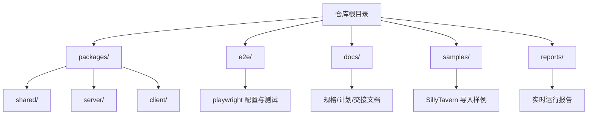
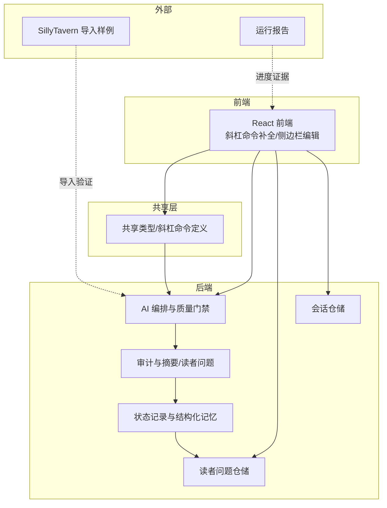
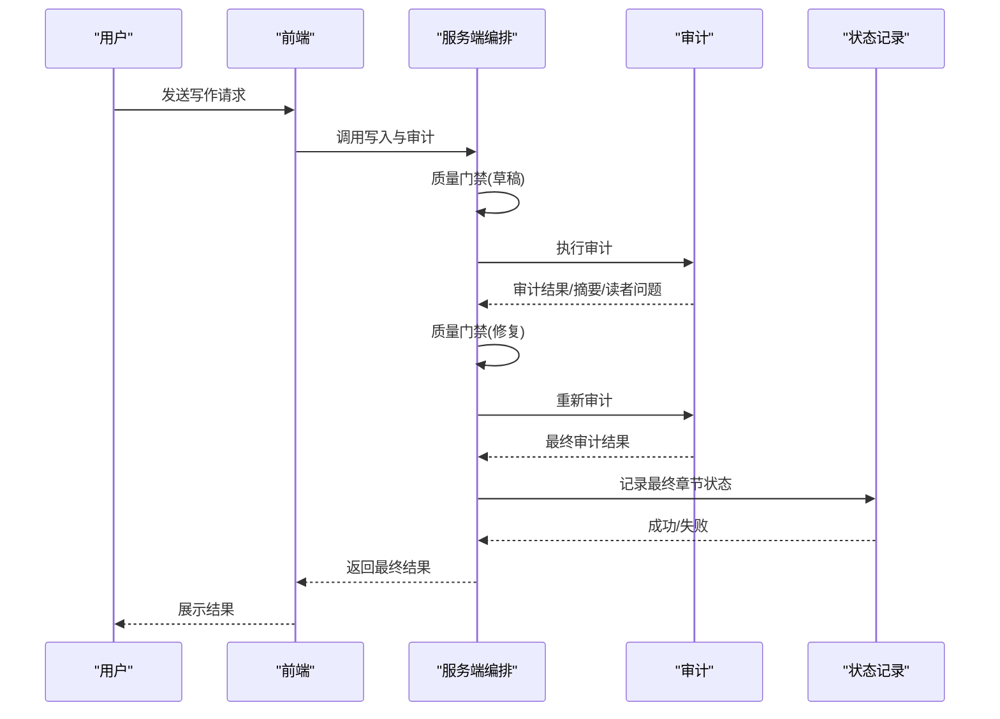
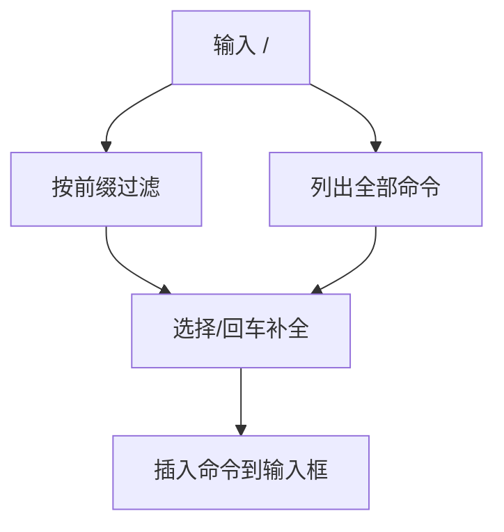
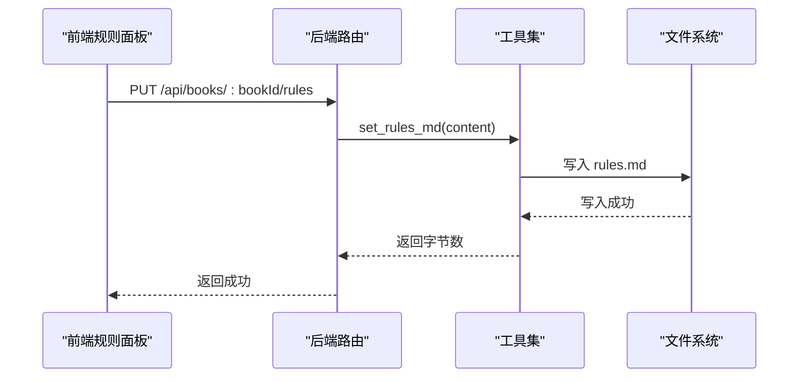
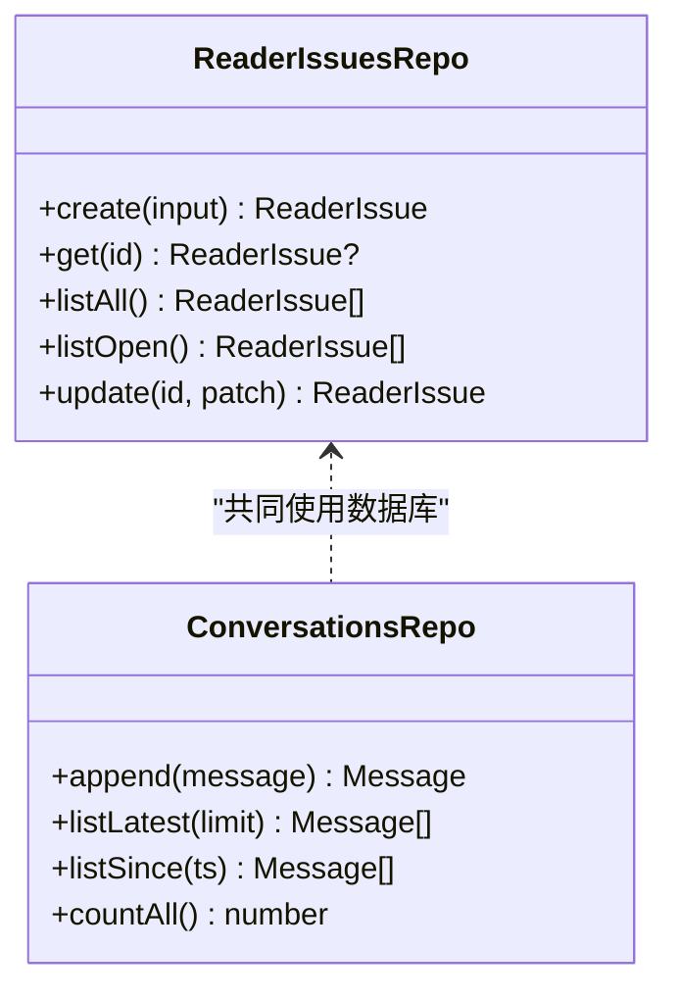
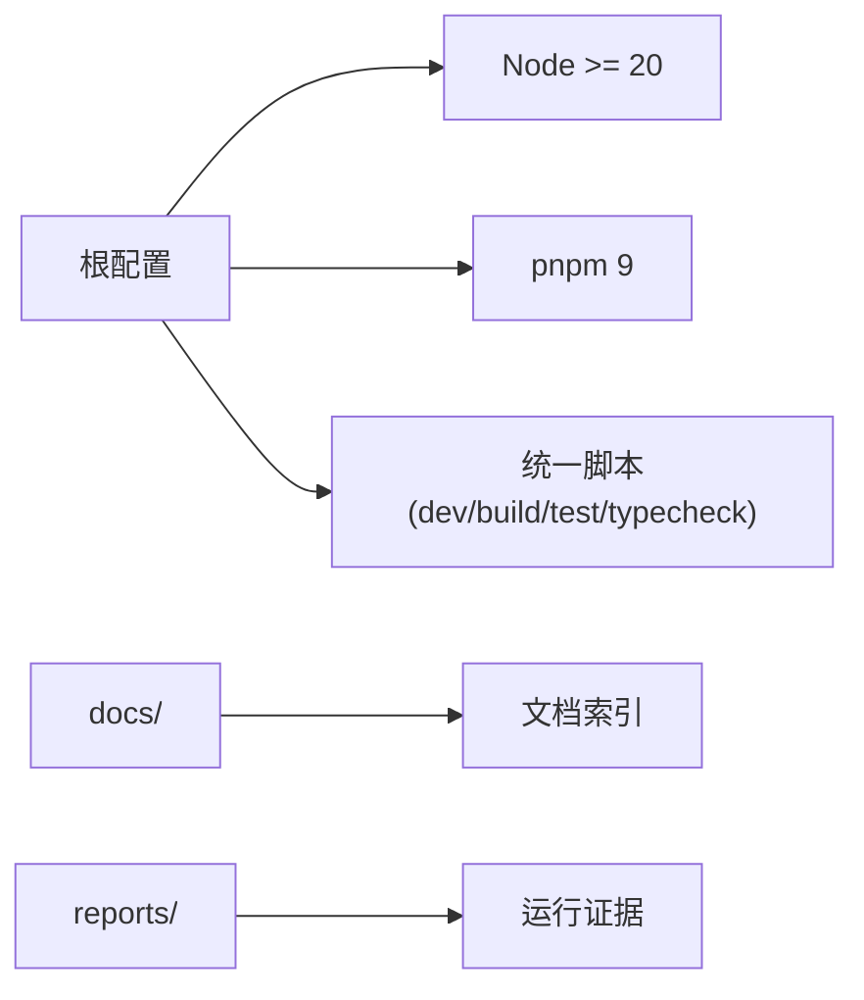

# 社区支持

<cite>
**本文引用的文件**
- [README.md](file://README.md)
- [package.json](file://package.json)
- [pnpm-workspace.yaml](file://pnpm-workspace.yaml)
- [docs/README.md](file://docs/README.md)
- [docs/HANDOFF-codex.md](file://docs/HANDOFF-codex.md)
- [samples/README.md](file://samples/README.md)
- [reports/README.md](file://reports/README.md)
- [.claude/settings.json](file://.claude/settings.json)
- [packages/server/src/ai/orchestrator/write-with-audit.ts](file://packages/server/src/ai/orchestrator/write-with-audit.ts)
- [packages/server/src/ai/tools/book-meta-tools.ts](file://packages/server/src/ai/tools/book-meta-tools.ts)
- [packages/client/src/components/sidebar/rules-panel.tsx](file://packages/client/src/components/sidebar/rules-panel.tsx)
- [packages/server/src/http/routes/sidebar.ts](file://packages/server/src/http/routes/sidebar.ts)
- [packages/server/src/db/repositories/reader-issues.ts](file://packages/server/src/db/repositories/reader-issues.ts)
- [packages/shared/tests/sillytavern-import.test.ts](file://packages/shared/tests/sillytavern-import.test.ts)
- [packages/client/src/components/conversation/slash-suggestions.tsx](file://packages/client/src/components/conversation/slash-suggestions.tsx)
- [packages/shared/tests/slash-commands.test.ts](file://packages/shared/tests/slash-commands.test.ts)
- [packages/client/src/components/worldbook/worldbook-panel.tsx](file://packages/client/src/components/worldbook/worldbook-panel.tsx)
- [packages/server/tests/unit/db/repositories/reader-issues.test.ts](file://packages/server/tests/unit/db/repositories/reader-issues.test.ts)
- [packages/server/tests/unit/db/repositories/conversations.test.ts](file://packages/server/tests/unit/db/repositories/conversations.test.ts)
- [packages/server/src/db/repositories/conversations.ts](file://packages/server/src/db/repositories/conversations.ts)
</cite>

## 目录
1. [简介](#简介)
2. [项目结构](#项目结构)
3. [核心组件](#核心组件)
4. [架构总览](#架构总览)
5. [详细组件分析](#详细组件分析)
6. [依赖分析](#依赖分析)
7. [性能考虑](#性能考虑)
8. [故障排除指南](#故障排除指南)
9. [结论](#结论)
10. [附录](#附录)

## 简介
本指南面向Scribe项目的使用者与贡献者，提供社区支持与问题报告的标准化流程，帮助大家高效定位问题、清晰描述现象、提供可复现实验，并通过合适的渠道进行沟通与协作。同时涵盖问题分类与标签建议、进度查询方法、贡献代码与文档的原则、常见问题解答、行为准则与紧急问题处理流程。

## 项目结构
Scribe采用多包工作区布局，核心模块包括前后端共享类型、服务端AI编排与数据库、客户端界面与交互、端到端测试与证据报告、示例输入样例等。开发者可通过统一脚本与工具链快速启动、测试与验证。

图表来源
- [pnpm-workspace.yaml:1-4](file://pnpm-workspace.yaml#L1-L4)
- [README.md:44-55](file://README.md#L44-L55)

章节来源
- [pnpm-workspace.yaml:1-4](file://pnpm-workspace.yaml#L1-L4)
- [README.md:10-55](file://README.md#L10-L55)

## 核心组件
- 工作区与脚本
  - 使用 pnpm 工作区管理多包，提供统一开发与测试脚本，便于并行构建与类型检查。
- 文档体系
  - docs/ 提供产品目标、实施计划、交接材料与实现说明，建议按推荐顺序阅读以建立一致认知。
- 示例与证据
  - samples/ 仅用于本地复现与验证，避免将专有名词硬编码至通用逻辑；reports/ 存放运行证据与历史报告，用于追踪问题与验证进展。
- 质量门禁与修复闭环
  - 服务端提供质量门禁钩子，结合审计与状态记录，形成“写作-审计-修复-再审计-记录”的闭环，确保长篇连续性与质量控制。

章节来源
- [package.json:6-12](file://package.json#L6-L12)
- [docs/README.md:5-24](file://docs/README.md#L5-L24)
- [samples/README.md:11-16](file://samples/README.md#L11-L16)
- [reports/README.md:9-14](file://reports/README.md#L9-L14)
- [packages/server/src/ai/orchestrator/write-with-audit.ts:292-316](file://packages/server/src/ai/orchestrator/write-with-audit.ts#L292-L316)

## 架构总览
Scribe围绕“写作-审计-记录”三段式管线构建，强调可复现的长篇连续性与可编辑的导入内容。质量门禁贯穿草稿与修复阶段，确保最终落盘的状态一致且可追溯。

图表来源
- [README.md:44-55](file://README.md#L44-L55)
- [docs/HANDOFF-codex.md:151-170](file://docs/HANDOFF-codex.md#L151-L170)
- [packages/server/src/ai/orchestrator/write-with-audit.ts:292-316](file://packages/server/src/ai/orchestrator/write-with-audit.ts#L292-L316)
- [packages/server/src/db/repositories/reader-issues.ts:47-94](file://packages/server/src/db/repositories/reader-issues.ts#L47-L94)
- [packages/server/src/db/repositories/conversations.ts:40-63](file://packages/server/src/db/repositories/conversations.ts#L40-L63)

## 详细组件分析

### 组件A：质量门禁与修复闭环
- 设计要点
  - 质量门禁钩子在草稿与修复阶段均可触发，用于识别并驱动修复，必要时阻止进入记录阶段。
  - 审计阶段输出摘要与读者问题，修复后重新审计，确保最终文本符合要求后再写入结构化记忆。
- 关键路径
  - 草稿/修复阶段调用质量门禁，收集修复议题。
  - 审计阶段评估并生成摘要与读者问题。
  - 记录阶段将最终文本的持久化事实写入结构化存储。
- 适用场景
  - 需要强一致性与可追溯性的长篇写作与世界构建。

图表来源
- [packages/server/src/ai/orchestrator/write-with-audit.ts:292-316](file://packages/server/src/ai/orchestrator/write-with-audit.ts#L292-L316)
- [docs/HANDOFF-codex.md:151-170](file://docs/HANDOFF-codex.md#L151-L170)

章节来源
- [packages/server/src/ai/orchestrator/write-with-audit.ts:292-316](file://packages/server/src/ai/orchestrator/write-with-audit.ts#L292-L316)
- [docs/HANDOFF-codex.md:151-170](file://docs/HANDOFF-codex.md#L151-L170)

### 组件B：斜杠命令与补全
- 功能概述
  - 前端提供斜杠命令补全，支持中英文前缀过滤与键盘导航，提升交互效率。
  - 命令集合由共享层统一定义，保证前后端一致。
- 使用建议
  - 在问题报告中明确指出使用的具体命令及其上下文，有助于复现与定位。

图表来源
- [packages/client/src/components/conversation/slash-suggestions.tsx:11-83](file://packages/client/src/components/conversation/slash-suggestions.tsx#L11-L83)
- [packages/shared/tests/slash-commands.test.ts:34-53](file://packages/shared/tests/slash-commands.test.ts#L34-L53)

章节来源
- [packages/client/src/components/conversation/slash-suggestions.tsx:11-83](file://packages/client/src/components/conversation/slash-suggestions.tsx#L11-L83)
- [packages/shared/tests/slash-commands.test.ts:34-53](file://packages/shared/tests/slash-commands.test.ts#L34-L53)
- [README.md:63-72](file://README.md#L63-L72)

### 组件C：规则文件与侧边栏编辑
- 功能概述
  - 通过后端工具与前端面板，支持编写与更新规则文件，规则内容将注入写作与审计提示，影响生成质量。
- 使用建议
  - 在问题报告中说明是否修改过规则文件及修改内容，以便判断是否为规则差异导致的行为变化。

图表来源
- [packages/server/src/http/routes/sidebar.ts:118-126](file://packages/server/src/http/routes/sidebar.ts#L118-L126)
- [packages/server/src/ai/tools/book-meta-tools.ts:188-201](file://packages/server/src/ai/tools/book-meta-tools.ts#L188-L201)
- [packages/client/src/components/sidebar/rules-panel.tsx:36-72](file://packages/client/src/components/sidebar/rules-panel.tsx#L36-L72)

章节来源
- [packages/server/src/http/routes/sidebar.ts:118-126](file://packages/server/src/http/routes/sidebar.ts#L118-L126)
- [packages/server/src/ai/tools/book-meta-tools.ts:188-201](file://packages/server/src/ai/tools/book-meta-tools.ts#L188-L201)
- [packages/client/src/components/sidebar/rules-panel.tsx:36-72](file://packages/client/src/components/sidebar/rules-panel.tsx#L36-L72)

### 组件D：读者问题与状态记录
- 功能概述
  - 读者问题仓储负责创建、查询与更新问题状态，支撑持续的质量反馈与修复闭环。
  - 状态记录阶段在最终文本确定后执行，确保结构化记忆的正确写入。
- 使用建议
  - 在报告中附上相关章节的读者问题列表与状态，有助于定位矛盾与缺失。

图表来源
- [packages/server/src/db/repositories/reader-issues.ts:47-94](file://packages/server/src/db/repositories/reader-issues.ts#L47-L94)
- [packages/server/src/db/repositories/conversations.ts:40-63](file://packages/server/src/db/repositories/conversations.ts#L40-L63)

章节来源
- [packages/server/src/db/repositories/reader-issues.ts:47-94](file://packages/server/src/db/repositories/reader-issues.ts#L47-L94)
- [packages/server/src/db/repositories/conversations.ts:40-63](file://packages/server/src/db/repositories/conversations.ts#L40-L63)
- [packages/server/tests/unit/db/repositories/reader-issues.test.ts:1-45](file://packages/server/tests/unit/db/repositories/reader-issues.test.ts#L1-L45)
- [packages/server/tests/unit/db/repositories/conversations.test.ts:1-37](file://packages/server/tests/unit/db/repositories/conversations.test.ts#L1-L37)

### 组件E：SillyTavern 导入与样例
- 功能概述
  - 提供导入样例与验证工具，用于确认预设与世界书的导入完整性与运行时效果。
  - 样例目录严格限定用途，避免将专有名词硬编码至通用逻辑。
- 使用建议
  - 在报告中明确列出所用样例文件与版本，确保复现实验的一致性。

章节来源
- [samples/README.md:11-16](file://samples/README.md#L11-L16)
- [packages/shared/tests/sillytavern-import.test.ts:42-96](file://packages/shared/tests/sillytavern-import.test.ts#L42-L96)
- [docs/HANDOFF-codex.md:186-225](file://docs/HANDOFF-codex.md#L186-L225)

## 依赖分析
- 工具链与运行时
  - Node.js 版本要求与包管理器版本在根配置中声明，确保团队环境一致性。
- 包管理与脚本
  - pnpm 工作区统一管理多包，提供开发、构建、测试与类型检查的快捷方式。
- 文档与证据
  - 文档索引与交接材料指引阅读顺序；证据报告用于阶段性验证与问题溯源。

图表来源
- [package.json:13-20](file://package.json#L13-L20)
- [pnpm-workspace.yaml:1-4](file://pnpm-workspace.yaml#L1-L4)
- [docs/README.md:5-24](file://docs/README.md#L5-L24)
- [reports/README.md:9-14](file://reports/README.md#L9-L14)

章节来源
- [package.json:13-20](file://package.json#L13-L20)
- [pnpm-workspace.yaml:1-4](file://pnpm-workspace.yaml#L1-L4)
- [docs/README.md:5-24](file://docs/README.md#L5-L24)
- [reports/README.md:9-14](file://reports/README.md#L9-L14)

## 性能考虑
- 本地开发优先：遵循安装与启动说明，使用工作区脚本并行启动前后端，减少等待时间。
- 端到端测试：利用 e2e 工具链与真实服务验证关键路径，降低回归成本。
- 类型检查：在提交前执行全包类型检查，尽早发现潜在问题。

章节来源
- [README.md:10-42](file://README.md#L10-L42)
- [package.json:6-12](file://package.json#L6-L12)

## 故障排除指南
- 环境与依赖
  - 确认 Node.js 与 pnpm 版本满足要求；如升级后出现异常，清理缓存并重新安装依赖。
- 断言与测试
  - 使用单元与集成测试定位问题范围；关注读者问题仓储与会话仓储的测试用例，验证状态一致性。
- 导入与样例
  - 使用官方样例进行最小复现；避免将样例中的专有名词硬编码到通用逻辑。
- 报告与证据
  - 将运行报告与日志纳入问题描述，便于他人复现与验证。

章节来源
- [README.md:5-42](file://README.md#L5-L42)
- [samples/README.md:11-16](file://samples/README.md#L11-L16)
- [reports/README.md:9-14](file://reports/README.md#L9-L14)
- [packages/server/tests/unit/db/repositories/reader-issues.test.ts:1-45](file://packages/server/tests/unit/db/repositories/reader-issues.test.ts#L1-L45)
- [packages/server/tests/unit/db/repositories/conversations.test.ts:1-37](file://packages/server/tests/unit/db/repositories/conversations.test.ts#L1-L37)

## 结论
通过标准化的问题报告流程、清晰的分类与标签、完善的进度证据与贡献规范，Scribe社区能够高效协作，持续提升长篇写作引擎的质量与稳定性。建议在每次提交问题或功能请求前，先查阅文档与样例，确保信息完整、可复现性强。

## 附录

### 问题报告模板与标准格式
- 标题
  - 精确描述问题现象，避免模糊表述。
- 环境信息
  - 操作系统、Node.js 版本、pnpm 版本、Scribe 版本（如有）。
- 复现步骤
  - 清晰列出每一步操作与预期/实际结果；若涉及斜杠命令，请注明命令别名与参数。
- 日志与证据
  - 附上报错信息、运行报告、屏幕截图或最小样例；指向具体文件与行号更佳。
- 影响范围
  - 是否影响导入、写作、审计或记录阶段；是否与特定样例或规则相关。
- 附加信息
  - 已尝试的解决方法、相关线程或讨论链接。

### 问题分类与标签建议
- 类别
  - 功能缺陷、导入问题、连续性问题、UI交互、性能问题、文档问题、安全问题。
- 标签
  - 导入样例、质量门禁、读者问题、世界书、规则文件、斜杠命令、端到端测试、证据报告。

### 进度查询方法
- 文档索引
  - 按推荐顺序阅读 docs/ 中的规格、计划与交接材料，了解当前阶段目标与下一步。
- 运行报告
  - 查看 reports/live-runs/ 下的历史报告，确认问题是否已被覆盖或需要进一步验证。
- 测试用例
  - 参考 packages/server 与 packages/client 的测试用例，定位问题边界与修复范围。

章节来源
- [docs/README.md:5-24](file://docs/README.md#L5-L24)
- [reports/README.md:9-14](file://reports/README.md#L9-L14)
- [packages/server/tests/unit/db/repositories/reader-issues.test.ts:1-45](file://packages/server/tests/unit/db/repositories/reader-issues.test.ts#L1-L45)
- [packages/server/tests/unit/db/repositories/conversations.test.ts:1-37](file://packages/server/tests/unit/db/repositories/conversations.test.ts#L1-L37)

### 贡献代码与文档的指导原则
- 代码贡献
  - 遵循统一脚本与类型检查；为关键路径补充单元与集成测试；避免将样例中的专有名词硬编码到通用逻辑。
- 文档贡献
  - 更新相关文档与交接材料；保持文档索引与实际实现一致；在 docs/README.md 推荐顺序下补充或修订内容。
- 行为准则
  - 尊重他人、保持专业、聚焦问题本身；避免人身攻击与无关争论；优先提出建设性意见与可行方案。

章节来源
- [README.md:10-42](file://README.md#L10-L42)
- [samples/README.md:11-16](file://samples/README.md#L11-L16)
- [docs/README.md:5-24](file://docs/README.md#L5-L24)

### FAQ
- 如何最小化复现问题？
  - 使用 samples/ 中的官方样例，逐步缩小步骤，仅保留必要条件。
- 为什么某些样例不提交到仓库？
  - 样例可能包含私有信息；仅用于本地验证，避免泄露敏感内容。
- 如何确认质量门禁是否生效？
  - 关注审计与修复后的再次审计结果，以及最终状态记录是否成功。
- 如何查看运行证据？
  - 在 reports/live-runs/ 中查找对应报告，核对章节状态与工具调用次数等指标。

章节来源
- [samples/README.md:11-16](file://samples/README.md#L11-L16)
- [reports/README.md:9-14](file://reports/README.md#L9-L14)
- [docs/HANDOFF-codex.md:326-441](file://docs/HANDOFF-codex.md#L326-L441)

### 社区讨论渠道与联系方式
- 仓库与分支
  - 当前分支与远程仓库地址在交接文档中有说明；首次推送前请确认未提交本地密钥与无关文件。
- 插件与工具
  - 项目启用了特定插件；可在本地环境中配合使用以提升开发体验。

章节来源
- [.claude/settings.json:1-5](file://.claude/settings.json#L1-L5)
- [docs/HANDOFF-codex.md:631-650](file://docs/HANDOFF-codex.md#L631-L650)

### 紧急问题处理流程
- 步骤
  - 快速复现并收集环境信息、日志与证据；在问题报告中明确标注“紧急”类别与标签。
  - 优先联系维护者或在公开渠道同步进展，避免长时间无人响应。
- 联系方式
  - 依据交接文档中的远程仓库地址与分支信息进行沟通；避免在公开渠道泄露敏感信息。

章节来源
- [docs/HANDOFF-codex.md:631-650](file://docs/HANDOFF-codex.md#L631-L650)