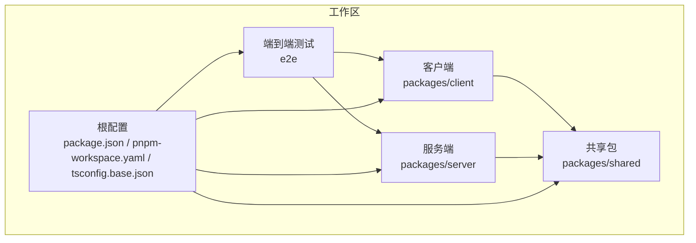
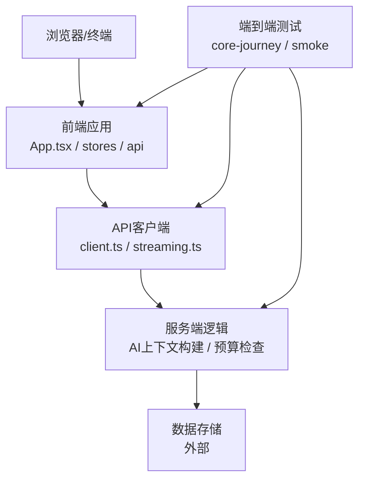
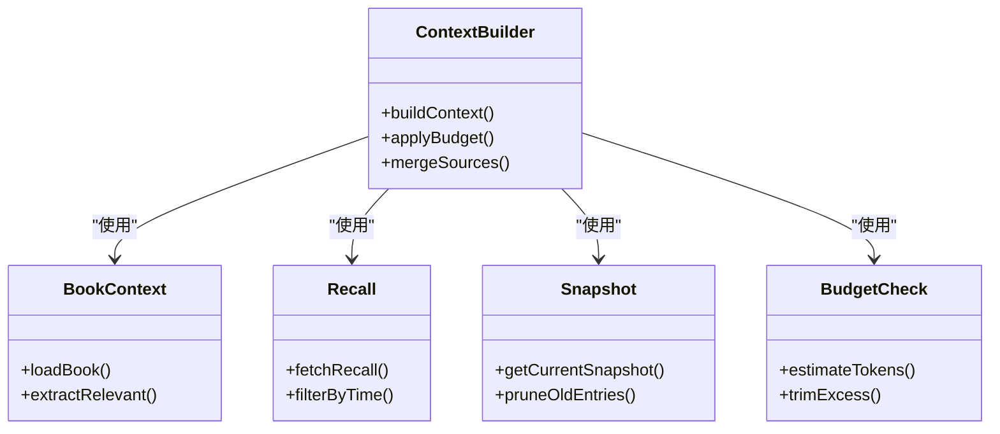
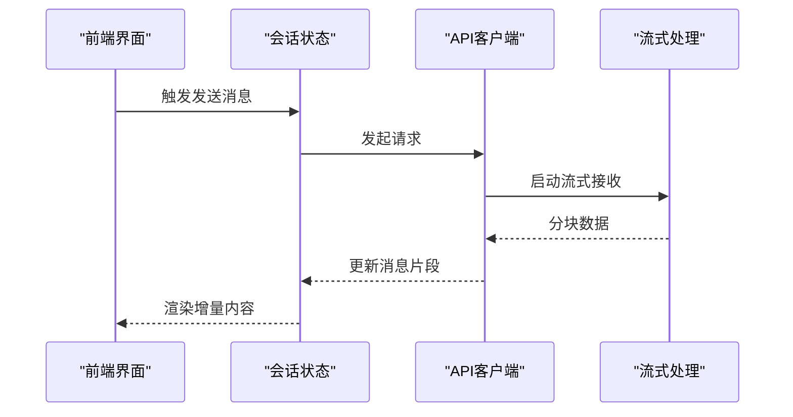
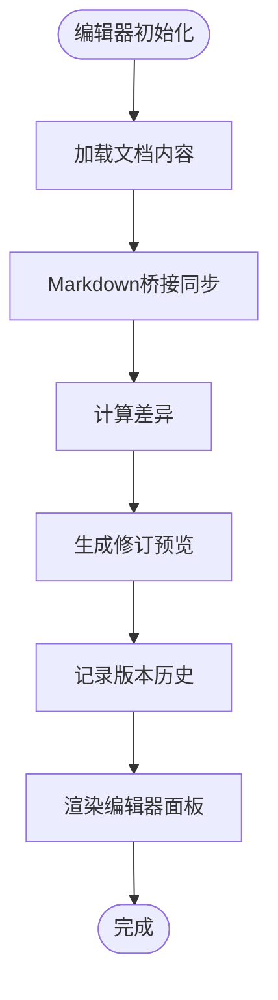
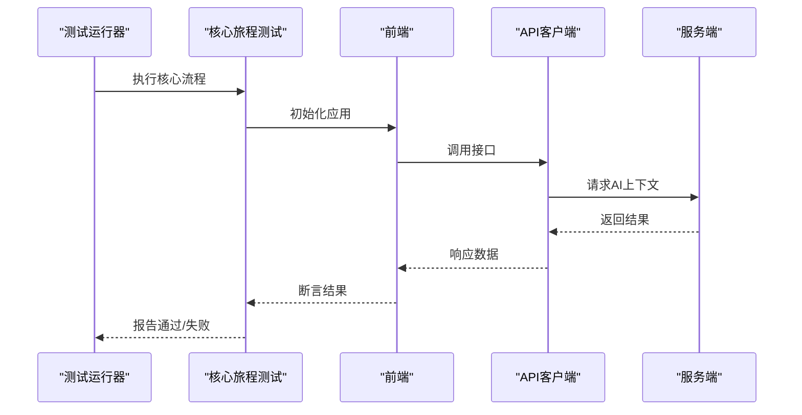
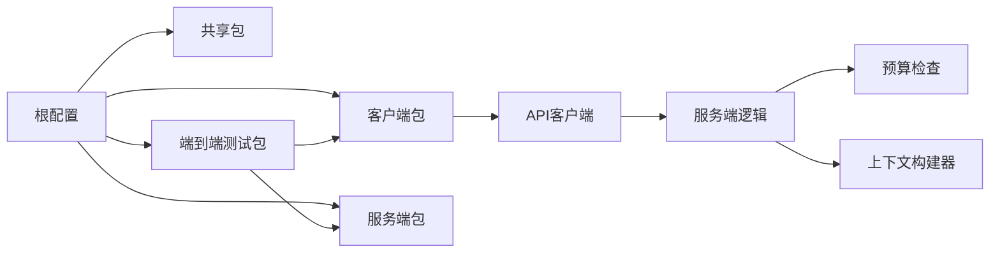
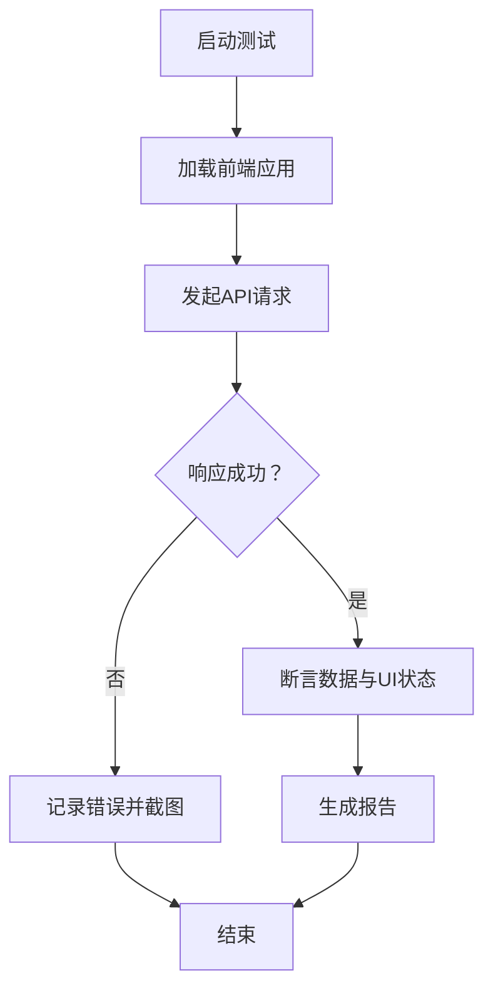

# 运行时错误

<cite>
**本文引用的文件**
- [package.json](file://package.json)
- [pnpm-workspace.yaml](file://pnpm-workspace.yaml)
- [tsconfig.base.json](file://tsconfig.base.json)
- [packages/server/src/ai/context-builder/index.ts](file://packages/server/src/ai/context-builder/index.ts)
- [packages/server/src/ai/context-builder/builder.ts](file://packages/server/src/ai/context-builder/builder.ts)
- [packages/server/src/ai/context-builder/book-context.ts](file://packages/server/src/ai/context-builder/book-context.ts)
- [packages/server/src/ai/context-builder/recall.ts](file://packages/server/src/ai/context-builder/recall.ts)
- [packages/server/src/ai/context-builder/snapshot.ts](file://packages/server/src/ai/context-builder/snapshot.ts)
- [packages/server/src/ai/budget-check.ts](file://packages/server/src/ai/budget-check.ts)
- [packages/client/src/api/client.ts](file://packages/client/src/api/client.ts)
- [packages/client/src/api/streaming.ts](file://packages/client/src/api/streaming.ts)
- [packages/client/src/stores/conversation.ts](file://packages/client/src/stores/conversation.ts)
- [packages/client/src/components/editor/markdown-bridge.ts](file://packages/client/src/components/editor/markdown-bridge.ts)
- [packages/client/src/App.tsx](file://packages/client/src/App.tsx)
- [e2e/tests/core-journey.spec.ts](file://e2e/tests/core-journey.spec.ts)
- [e2e/tests/smoke.spec.ts](file://e2e/tests/smoke.spec.ts)
- [e2e/playwright.config.ts](file://e2e/playwright.config.ts)
- [docs/_implementation-notes.md](file://docs/_implementation-notes.md)
</cite>

## 目录
1. [简介](#简介)
2. [项目结构](#项目结构)
3. [核心组件](#核心组件)
4. [架构总览](#架构总览)
5. [详细组件分析](#详细组件分析)
6. [依赖关系分析](#依赖关系分析)
7. [性能考量](#性能考量)
8. [故障排除指南](#故障排除指南)
9. [结论](#结论)
10. [附录](#附录)

## 简介
本指南面向Scribe项目的运行时错误排查与处理，覆盖服务器启动失败、API端点错误、前端渲染异常、内存泄漏检测、进程崩溃诊断、日志分析、数据库连接问题、跨域与网络超时、以及开发与生产环境的差异化策略。文档基于仓库中可得的源码与配置文件进行分析，并提供可操作的定位与修复建议。

## 项目结构
Scribe采用多包工作区（monorepo）组织，核心模块包括：
- packages/server：AI上下文构建、预算检查等后端逻辑
- packages/client：前端应用、API客户端、编辑器桥接与状态管理
- packages/shared：共享类型与工具（在当前视图中未展开）
- e2e：端到端测试（Playwright）
- 根级配置：工作区、TypeScript基础配置与包管理

**图表来源**
- [package.json](file://package.json)
- [pnpm-workspace.yaml](file://pnpm-workspace.yaml)
- [tsconfig.base.json](file://tsconfig.base.json)

**章节来源**
- [package.json](file://package.json)
- [pnpm-workspace.yaml](file://pnpm-workspace.yaml)
- [tsconfig.base.json](file://tsconfig.base.json)

## 核心组件
- AI上下文构建器：负责从书籍、回忆、快照等数据源构建对话上下文，支持预算控制与上下文拼接。
- 客户端API层：封装HTTP客户端与流式响应处理，支撑会话与消息流。
- 前端状态与编辑器：会话状态管理、Markdown桥接、编辑器面板与版本历史等。
- 端到端测试：验证核心流程与冒烟测试，辅助定位运行时回归。

**章节来源**
- [packages/server/src/ai/context-builder/index.ts](file://packages/server/src/ai/context-builder/index.ts)
- [packages/server/src/ai/context-builder/builder.ts](file://packages/server/src/ai/context-builder/builder.ts)
- [packages/server/src/ai/context-builder/book-context.ts](file://packages/server/src/ai/context-builder/book-context.ts)
- [packages/server/src/ai/context-builder/recall.ts](file://packages/server/src/ai/context-builder/recall.ts)
- [packages/server/src/ai/context-builder/snapshot.ts](file://packages/server/src/ai/context-builder/snapshot.ts)
- [packages/server/src/ai/budget-check.ts](file://packages/server/src/ai/budget-check.ts)
- [packages/client/src/api/client.ts](file://packages/client/src/api/client.ts)
- [packages/client/src/api/streaming.ts](file://packages/client/src/api/streaming.ts)
- [packages/client/src/stores/conversation.ts](file://packages/client/src/stores/conversation.ts)
- [packages/client/src/components/editor/markdown-bridge.ts](file://packages/client/src/components/editor/markdown-bridge.ts)
- [packages/client/src/App.tsx](file://packages/client/src/App.tsx)
- [e2e/tests/core-journey.spec.ts](file://e2e/tests/core-journey.spec.ts)
- [e2e/tests/smoke.spec.ts](file://e2e/tests/smoke.spec.ts)

## 架构总览
下图展示客户端、服务端与测试之间的交互关系，以及关键运行时组件的职责边界。

**图表来源**
- [packages/client/src/App.tsx](file://packages/client/src/App.tsx)
- [packages/client/src/api/client.ts](file://packages/client/src/api/client.ts)
- [packages/client/src/api/streaming.ts](file://packages/client/src/api/streaming.ts)
- [packages/server/src/ai/context-builder/index.ts](file://packages/server/src/ai/context-builder/index.ts)
- [packages/server/src/ai/budget-check.ts](file://packages/server/src/ai/budget-check.ts)
- [e2e/tests/core-journey.spec.ts](file://e2e/tests/core-journey.spec.ts)
- [e2e/tests/smoke.spec.ts](file://e2e/tests/smoke.spec.ts)

## 详细组件分析

### 组件A：AI上下文构建器
该组件负责将书籍、回忆、快照等信息整合为对话上下文，同时进行预算控制，避免上下文过长导致性能或成本问题。

**图表来源**
- [packages/server/src/ai/context-builder/builder.ts](file://packages/server/src/ai/context-builder/builder.ts)
- [packages/server/src/ai/context-builder/book-context.ts](file://packages/server/src/ai/context-builder/book-context.ts)
- [packages/server/src/ai/context-builder/recall.ts](file://packages/server/src/ai/context-builder/recall.ts)
- [packages/server/src/ai/context-builder/snapshot.ts](file://packages/server/src/ai/context-builder/snapshot.ts)
- [packages/server/src/ai/budget-check.ts](file://packages/server/src/ai/budget-check.ts)

**章节来源**
- [packages/server/src/ai/context-builder/index.ts](file://packages/server/src/ai/context-builder/index.ts)
- [packages/server/src/ai/context-builder/builder.ts](file://packages/server/src/ai/context-builder/builder.ts)
- [packages/server/src/ai/context-builder/book-context.ts](file://packages/server/src/ai/context-builder/book-context.ts)
- [packages/server/src/ai/context-builder/recall.ts](file://packages/server/src/ai/context-builder/recall.ts)
- [packages/server/src/ai/context-builder/snapshot.ts](file://packages/server/src/ai/context-builder/snapshot.ts)
- [packages/server/src/ai/budget-check.ts](file://packages/server/src/ai/budget-check.ts)

### 组件B：客户端API与流式处理
前端通过API客户端发起请求并处理流式响应，用于实时消息生成与更新。

**图表来源**
- [packages/client/src/stores/conversation.ts](file://packages/client/src/stores/conversation.ts)
- [packages/client/src/api/client.ts](file://packages/client/src/api/client.ts)
- [packages/client/src/api/streaming.ts](file://packages/client/src/api/streaming.ts)

**章节来源**
- [packages/client/src/api/client.ts](file://packages/client/src/api/client.ts)
- [packages/client/src/api/streaming.ts](file://packages/client/src/api/streaming.ts)
- [packages/client/src/stores/conversation.ts](file://packages/client/src/stores/conversation.ts)

### 组件C：Markdown桥接与编辑器
编辑器通过Markdown桥接实现内容同步与差异渲染，支持修订预览与版本历史。

**图表来源**
- [packages/client/src/components/editor/markdown-bridge.ts](file://packages/client/src/components/editor/markdown-bridge.ts)

**章节来源**
- [packages/client/src/components/editor/markdown-bridge.ts](file://packages/client/src/components/editor/markdown-bridge.ts)

### 组件D：端到端测试流程
端到端测试覆盖核心旅程与冒烟测试，帮助快速发现运行时回归。

**图表来源**
- [e2e/tests/core-journey.spec.ts](file://e2e/tests/core-journey.spec.ts)
- [e2e/tests/smoke.spec.ts](file://e2e/tests/smoke.spec.ts)
- [packages/client/src/App.tsx](file://packages/client/src/App.tsx)
- [packages/client/src/api/client.ts](file://packages/client/src/api/client.ts)
- [packages/server/src/ai/context-builder/index.ts](file://packages/server/src/ai/context-builder/index.ts)

**章节来源**
- [e2e/tests/core-journey.spec.ts](file://e2e/tests/core-journey.spec.ts)
- [e2e/tests/smoke.spec.ts](file://e2e/tests/smoke.spec.ts)
- [e2e/playwright.config.ts](file://e2e/playwright.config.ts)

## 依赖关系分析
- 工作区与包管理：根级配置定义了monorepo布局与共享编译设置。
- 前后端耦合：客户端通过API客户端调用服务端逻辑；服务端依赖上下文构建与预算检查模块。
- 测试耦合：端到端测试直接依赖前端应用与API客户端，间接验证服务端行为。

**图表来源**
- [package.json](file://package.json)
- [pnpm-workspace.yaml](file://pnpm-workspace.yaml)
- [packages/client/src/api/client.ts](file://packages/client/src/api/client.ts)
- [packages/server/src/ai/context-builder/index.ts](file://packages/server/src/ai/context-builder/index.ts)
- [packages/server/src/ai/budget-check.ts](file://packages/server/src/ai/budget-check.ts)

**章节来源**
- [package.json](file://package.json)
- [pnpm-workspace.yaml](file://pnpm-workspace.yaml)

## 性能考量
- 上下文预算控制：通过估算令牌数与裁剪冗余条目，避免上下文过长导致延迟与成本上升。
- 流式传输：前端按块接收数据，减少首字节时间与内存峰值。
- 编辑器差异计算：仅对变更区域进行渲染，降低重绘开销。
- 测试驱动的回归防护：端到端测试在CI中快速暴露性能退化。

**章节来源**
- [packages/server/src/ai/budget-check.ts](file://packages/server/src/ai/budget-check.ts)
- [packages/client/src/api/streaming.ts](file://packages/client/src/api/streaming.ts)
- [packages/client/src/components/editor/markdown-bridge.ts](file://packages/client/src/components/editor/markdown-bridge.ts)
- [e2e/tests/core-journey.spec.ts](file://e2e/tests/core-journey.spec.ts)

## 故障排除指南

### 服务器启动失败
常见原因与排查步骤：
- 环境变量缺失：确认运行时必需的环境变量已正确注入。
- 端口占用：检查监听端口是否被占用，必要时切换端口或释放冲突进程。
- 依赖安装不完整：在工作区内执行统一安装，确保所有包的依赖一致。
- 日志输出：开启详细日志，定位初始化阶段的异常堆栈。
- 端到端验证：通过冒烟测试快速判断服务是否可用。

**章节来源**
- [e2e/tests/smoke.spec.ts](file://e2e/tests/smoke.spec.ts)

### API端点错误
常见症状与处理：
- 4xx语义错误：检查请求参数、认证头与路径参数，参考端点契约。
- 5xx服务端错误：查看服务端日志中的异常堆栈，优先处理空值访问与资源未找到。
- 流式响应中断：确认上游服务稳定性与网络连通性，增加重试与降级策略。
- 前端状态同步：确保会话状态在收到新片段后及时更新，避免渲染错位。

**章节来源**
- [packages/client/src/api/client.ts](file://packages/client/src/api/client.ts)
- [packages/client/src/api/streaming.ts](file://packages/client/src/api/streaming.ts)
- [packages/client/src/stores/conversation.ts](file://packages/client/src/stores/conversation.ts)

### 前端渲染异常
常见问题与修复：
- Markdown桥接不同步：检查文档加载与桥接同步逻辑，确保差异计算在渲染前完成。
- 版本历史不一致：核对版本记录与当前内容一致性，避免回滚后状态错乱。
- 编辑器面板闪烁：减少不必要的强制重渲染，仅对变更区域进行更新。
- 应用入口异常：确认应用初始化顺序与依赖注入，避免在依赖未就绪时渲染。

**章节来源**
- [packages/client/src/components/editor/markdown-bridge.ts](file://packages/client/src/components/editor/markdown-bridge.ts)
- [packages/client/src/App.tsx](file://packages/client/src/App.tsx)

### 内存泄漏检测与处理
检测方法：
- 使用浏览器开发者工具的时间轴与内存面板，观察长时间运行后的内存曲线。
- 在编辑器高频操作场景下监控内存增长，定位大对象持有与事件监听未清理。
- 对流式处理的回调与订阅进行泄漏排查，确保在组件卸载时取消订阅。
- 对会话状态进行周期性快照对比，识别异常增长的对象集合。

处理建议：
- 及时移除DOM事件与定时器。
- 在组件销毁钩子中清理订阅与缓存。
- 将大型对象拆分为可回收的片段，避免闭包捕获造成持有。

**章节来源**
- [packages/client/src/api/streaming.ts](file://packages/client/src/api/streaming.ts)
- [packages/client/src/stores/conversation.ts](file://packages/client/src/stores/conversation.ts)

### 进程崩溃诊断与日志分析
诊断技巧：
- 捕获并保存崩溃转储（core dump），结合符号表定位崩溃位置。
- 在服务端启用结构化日志，记录请求ID与时间戳，便于跨组件关联。
- 区分“可恢复错误”与“致命错误”，前者走重试与降级，后者触发告警与优雅退出。
- 利用端到端测试复现崩溃场景，缩小问题范围。

日志分析要点：
- 关注异常堆栈的调用链，优先处理空指针与数组越界。
- 记录上下文构建过程中的输入数据与中间结果，辅助回放与调试。
- 对预算检查失败与流式传输中断进行专项日志标记。

**章节来源**
- [packages/server/src/ai/context-builder/index.ts](file://packages/server/src/ai/context-builder/index.ts)
- [packages/server/src/ai/budget-check.ts](file://packages/server/src/ai/budget-check.ts)
- [e2e/tests/core-journey.spec.ts](file://e2e/tests/core-journey.spec.ts)

### 数据库连接问题
排查步骤：
- 连接字符串与凭据：核对主机、端口、数据库名与认证信息。
- 网络连通性：使用ping/ telnet/ curl验证可达性。
- 连接池配置：检查最大连接数、空闲超时与重试策略。
- 事务隔离级别：确认与业务需求匹配，避免死锁与脏读。
- 服务端日志：关注连接建立失败与超时错误，定位具体环节。

**章节来源**
- [packages/server/src/ai/context-builder/index.ts](file://packages/server/src/ai/context-builder/index.ts)

### 跨域请求与网络超时
跨域问题：
- 检查CORS头配置（允许的来源、方法、头字段与凭据）。
- 预检请求处理：确保OPTIONS路由正确返回204。
- 本地开发代理：通过反向代理统一解决开发环境跨域。

网络超时：
- 增加客户端超时阈值与指数退避重试。
- 服务端限流与熔断：防止雪崩效应。
- CDN与网络质量：在边缘节点缓存静态资源，优化首字节时间。

**章节来源**
- [packages/client/src/api/client.ts](file://packages/client/src/api/client.ts)

### 开发与生产环境的差异化策略
- 日志级别：开发环境使用详细日志，生产环境使用结构化日志并限制敏感信息。
- 错误报告：开发环境直接抛出错误以便调试，生产环境统一上报并降噪。
- 缓存策略：开发环境禁用缓存加速迭代，生产环境启用强缓存与CDN。
- 监控与告警：生产环境接入APM与日志平台，设置阈值告警与自动恢复。

**章节来源**
- [docs/_implementation-notes.md](file://docs/_implementation-notes.md)

## 结论
通过明确前后端职责边界、强化流式处理与上下文预算控制、完善端到端测试与日志体系，Scribe能够在复杂运行环境中保持稳定与可观测性。建议将本指南作为日常排障的标准作业程序（SOP），并在CI中集成冒烟测试与性能回归检查，持续提升系统韧性。

## 附录

### 错误代码对照表（示例）
- 400：请求参数无效或格式错误
- 401：未授权或认证失败
- 403：权限不足
- 404：资源不存在
- 429：请求过于频繁（限流）
- 500：服务器内部错误
- 502/503：上游服务不可用或维护

说明：以上为通用HTTP状态码示例，具体实现请以实际API响应为准。

### 关键流程图：端到端测试与运行时验证

**图表来源**
- [e2e/tests/core-journey.spec.ts](file://e2e/tests/core-journey.spec.ts)
- [e2e/tests/smoke.spec.ts](file://e2e/tests/smoke.spec.ts)