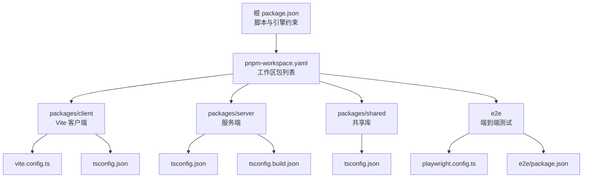
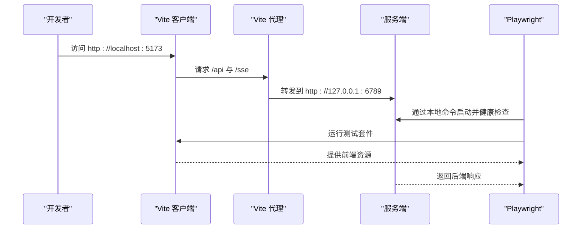
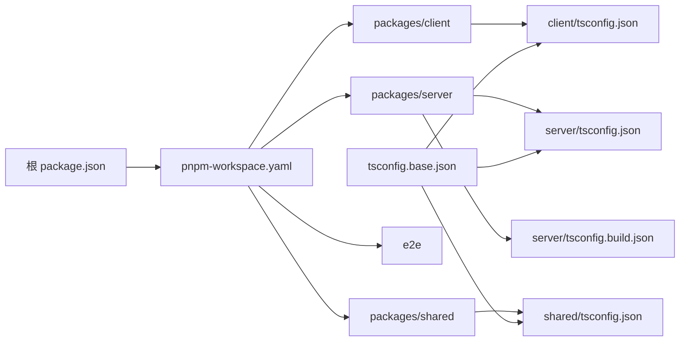
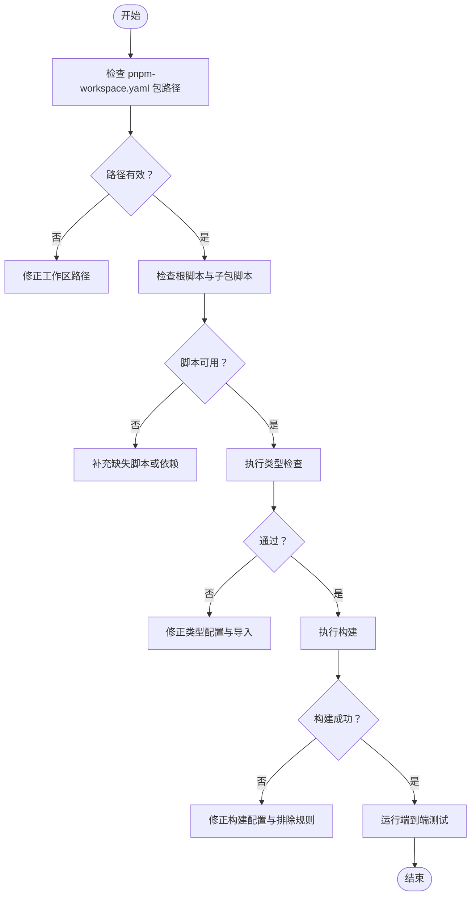

# 配置问题

<cite>
**本文引用的文件**
- [package.json](file://package.json)
- [pnpm-workspace.yaml](file://pnpm-workspace.yaml)
- [tsconfig.base.json](file://tsconfig.base.json)
- [packages/client/vite.config.ts](file://packages/client/vite.config.ts)
- [packages/client/tsconfig.json](file://packages/client/tsconfig.json)
- [packages/server/tsconfig.json](file://packages/server/tsconfig.json)
- [packages/server/tsconfig.build.json](file://packages/server/tsconfig.build.json)
- [packages/shared/tsconfig.json](file://packages/shared/tsconfig.json)
- [e2e/package.json](file://e2e/package.json)
- [e2e/playwright.config.ts](file://e2e/playwright.config.ts)
</cite>

## 目录
1. [简介](#简介)
2. [项目结构](#项目结构)
3. [核心组件](#核心组件)
4. [架构总览](#架构总览)
5. [详细组件分析](#详细组件分析)
6. [依赖关系分析](#依赖关系分析)
7. [性能考量](#性能考量)
8. [故障排除指南](#故障排除指南)
9. [结论](#结论)
10. [附录](#附录)

## 简介
本指南聚焦于 Scribe 项目的配置问题排查与最佳实践，覆盖以下主题：
- TypeScript 配置错误定位与修复
- Vite 构建与开发服务器配置问题
- pnpm 工作区配置异常与包解析问题
- 配置文件语法错误的诊断流程
- 环境变量配置与敏感信息保护
- 跨平台配置差异处理
- 配置验证与测试方法
- 配置热更新与重启策略
- 配置迁移与版本升级注意事项
- 配置模板与最佳实践示例

## 项目结构
Scribe 采用 monorepo 结构，使用 pnpm 工作区管理多包，TypeScript 基础配置集中于根目录，客户端、服务端与共享库分别维护各自的 tsconfig 扩展与构建配置；端到端测试通过 Playwright 驱动。

图表来源
- [package.json:1-21](file://package.json#L1-L21)
- [pnpm-workspace.yaml:1-4](file://pnpm-workspace.yaml#L1-L4)
- [packages/client/vite.config.ts:1-20](file://packages/client/vite.config.ts#L1-L20)
- [packages/client/tsconfig.json:1-10](file://packages/client/tsconfig.json#L1-L10)
- [packages/server/tsconfig.json:1-8](file://packages/server/tsconfig.json#L1-L8)
- [packages/server/tsconfig.build.json:1-10](file://packages/server/tsconfig.build.json#L1-L10)
- [packages/shared/tsconfig.json:1-5](file://packages/shared/tsconfig.json#L1-L5)
- [e2e/playwright.config.ts:1-27](file://e2e/playwright.config.ts#L1-L27)
- [e2e/package.json:1-15](file://e2e/package.json#L1-L15)

章节来源
- [package.json:1-21](file://package.json#L1-L21)
- [pnpm-workspace.yaml:1-4](file://pnpm-workspace.yaml#L1-L4)

## 核心组件
- 根级脚本与引擎约束：统一管理开发、构建、测试与类型检查命令，并声明 Node 版本要求与包管理器版本。
- TypeScript 基础配置：集中定义严格模式、模块系统、解析策略与库目标，供各包继承扩展。
- 客户端 Vite 配置：定义开发服务器端口、代理规则、测试环境与插件。
- 服务端 TypeScript 配置：区分常规编译与构建输出配置，控制 rootDir 与 emit 行为。
- 端到端测试配置：Playwright 启动本地 Web 服务、设置超时与环境变量，确保可重复性。

章节来源
- [package.json:6-12](file://package.json#L6-L12)
- [tsconfig.base.json:1-16](file://tsconfig.base.json#L1-L16)
- [packages/client/vite.config.ts:1-20](file://packages/client/vite.config.ts#L1-L20)
- [packages/server/tsconfig.json:1-8](file://packages/server/tsconfig.json#L1-L8)
- [packages/server/tsconfig.build.json:1-10](file://packages/server/tsconfig.build.json#L1-L10)
- [e2e/playwright.config.ts:9-26](file://e2e/playwright.config.ts#L9-L26)

## 架构总览
下图展示配置在端到端测试中的交互路径：客户端 Vite 开发服务器代理请求至服务端，Playwright 通过本地命令启动服务端并进行健康检查，随后执行测试用例。

图表来源
- [packages/client/vite.config.ts:7-13](file://packages/client/vite.config.ts#L7-L13)
- [e2e/playwright.config.ts:16-25](file://e2e/playwright.config.ts#L16-L25)

## 详细组件分析

### TypeScript 基础配置（tsconfig.base.json）
- 继承关系：各包通过 extends 引用根基础配置，避免重复与不一致。
- 关键选项：
  - 模块系统与解析：ESNext + Bundler，适配现代打包链路。
  - 严格性：开启严格模式与索引访问校验，提升类型安全。
  - 库目标：ES2022，保证运行时 API 可用性。
  - JSON 模块与隔离模块：支持 JSON 导入与单文件模块化。
- 复杂度与性能：严格的类型检查会增加编译时间，建议在 CI 中分层缓存与增量编译。

章节来源
- [tsconfig.base.json:1-16](file://tsconfig.base.json#L1-L16)
- [packages/client/tsconfig.json:2](file://packages/client/tsconfig.json#L2)
- [packages/server/tsconfig.json:2](file://packages/server/tsconfig.json#L2)
- [packages/shared/tsconfig.json:2](file://packages/shared/tsconfig.json#L2)

### 客户端 Vite 配置（packages/client/vite.config.ts）
- 插件：React 生态插件，配合 React JSX 编译。
- 开发服务器：固定端口与代理规则，将 /api 与 /sse 转发至服务端地址。
- 测试：jsdom 环境、全局测试 API 与初始化脚本。
- 典型问题：
  - 代理目标与服务端端口不一致导致请求失败。
  - 测试环境未正确加载 DOM 类型或初始化脚本路径错误。
  - 端口冲突导致开发服务器无法启动。

章节来源
- [packages/client/vite.config.ts:1-20](file://packages/client/vite.config.ts#L1-L20)

### 服务端 TypeScript 构建配置
- 常规编译：指定 outDir，便于本地调试与产物定位。
- 构建配置：显式 rootDir 与允许 emit，排除测试与脚本目录，确保生产构建干净。
- 注意事项：
  - 包含/排除规则需与实际源码结构匹配，避免遗漏或误打包。
  - 构建输出目录需与部署/打包流程一致。

章节来源
- [packages/server/tsconfig.json:1-8](file://packages/server/tsconfig.json#L1-L8)
- [packages/server/tsconfig.build.json:1-10](file://packages/server/tsconfig.build.json#L1-L10)

### 端到端测试配置（e2e/playwright.config.ts）
- Web 服务：通过 pnpm filter 指定服务端包并以 tsx 启动主入口，设置健康检查 URL。
- 环境变量：SCRIBE_HOME 指向测试数据目录，PORT 固定为 6789，避免端口冲突。
- 超时与重试：合理设置超时与重试次数，平衡稳定性与执行效率。
- 报告器：同时输出 list 与 HTML 报告，便于本地与 CI 查看。

章节来源
- [e2e/playwright.config.ts:1-27](file://e2e/playwright.config.ts#L1-L27)
- [e2e/package.json:1-15](file://e2e/package.json#L1-L15)

## 依赖关系分析
- 工作区包解析：pnpm-workspace.yaml 声明 packages/* 与 e2e，确保 pnpm 正确识别子包。
- 脚本耦合：根脚本通过 pnpm -r 并行或顺序执行子包任务，需确保子包 scripts 完整且无循环依赖。
- 类型继承：各包 tsconfig 仅覆盖必要差异，保持一致性与可维护性。

图表来源
- [pnpm-workspace.yaml:1-4](file://pnpm-workspace.yaml#L1-L4)
- [package.json:6-12](file://package.json#L6-L12)
- [tsconfig.base.json:1-16](file://tsconfig.base.json#L1-L16)
- [packages/client/tsconfig.json:1-10](file://packages/client/tsconfig.json#L1-L10)
- [packages/server/tsconfig.json:1-8](file://packages/server/tsconfig.json#L1-L8)
- [packages/server/tsconfig.build.json:1-10](file://packages/server/tsconfig.build.json#L1-L10)
- [packages/shared/tsconfig.json:1-5](file://packages/shared/tsconfig.json#L1-L5)

章节来源
- [pnpm-workspace.yaml:1-4](file://pnpm-workspace.yaml#L1-L4)
- [package.json:6-12](file://package.json#L6-L12)

## 性能考量
- 类型检查：在大型 monorepo 中，类型检查成本较高。建议：
  - 使用增量编译与缓存（如启用 tsconfig 的相关选项）。
  - 在 CI 中分阶段执行，先快后慢。
- Vite 开发体验：固定端口与代理有助于减少冷启动与重连开销。
- 端到端测试：合理设置超时与重试，避免长时间等待；复用浏览器安装脚本以减少首次准备时间。

## 故障排除指南

### TypeScript 配置错误
- 症状
  - 编译报错集中在模块解析、严格模式或库目标不兼容。
  - 子包继承后出现意外的类型行为。
- 诊断步骤
  - 校验根基础配置是否被所有包正确继承。
  - 对比各包 tsconfig 的 include/exclude 是否覆盖到实际源码。
  - 检查 moduleResolution 与 target 是否与打包器一致。
- 修复建议
  - 明确各包差异项，避免在 base 中覆盖关键选项。
  - 使用类型检查脚本在本地快速定位问题。
  - 在 CI 中对不同包分别执行类型检查，缩小问题范围。

章节来源
- [tsconfig.base.json:1-16](file://tsconfig.base.json#L1-L16)
- [packages/client/tsconfig.json:1-10](file://packages/client/tsconfig.json#L1-L10)
- [packages/server/tsconfig.json:1-8](file://packages/server/tsconfig.json#L1-L8)
- [packages/server/tsconfig.build.json:1-10](file://packages/server/tsconfig.build.json#L1-L10)
- [packages/shared/tsconfig.json:1-5](file://packages/shared/tsconfig.json#L1-L5)

### Vite 构建与开发配置问题
- 症状
  - 代理不通、端口占用、测试环境缺失 DOM 类型。
- 诊断步骤
  - 确认服务端已启动且健康检查可达。
  - 检查 Vite server.port 与代理目标端口一致性。
  - 校验测试环境配置与初始化脚本路径。
- 修复建议
  - 将代理目标与服务端端口解耦为环境变量，便于跨环境切换。
  - 在本地与 CI 中统一端口策略，避免冲突。
  - 确保测试环境类型与初始化脚本在 tsconfig 与 vite.config 中均声明。

章节来源
- [packages/client/vite.config.ts:1-20](file://packages/client/vite.config.ts#L1-L20)

### pnpm 工作区配置异常
- 症状
  - 子包脚本不可用、包解析失败、跨包依赖未生效。
- 诊断步骤
  - 检查 pnpm-workspace.yaml 的包路径是否与实际目录一致。
  - 确认根 package.json 的脚本是否正确使用 pnpm -r 与 filter。
  - 验证子包的 package.json 是否具备必要的脚本与依赖。
- 修复建议
  - 保持工作区包路径简洁明确，避免相对路径歧义。
  - 在根脚本中显式声明并行/顺序策略，确保可预期的执行顺序。

章节来源
- [pnpm-workspace.yaml:1-4](file://pnpm-workspace.yaml#L1-L4)
- [package.json:6-12](file://package.json#L6-L12)
- [e2e/package.json:1-15](file://e2e/package.json#L1-L15)

### 配置文件语法错误
- 诊断方法
  - 使用编辑器/IDE 的 JSON/TS 语法高亮与校验。
  - 在变更后执行最小化验证（如 typecheck、build、test）。
  - 在 CI 中加入格式与语法检查步骤。
- 修复步骤
  - 逐项回退最近变更，定位具体字段。
  - 对照仓库中其他同类配置文件进行对比修正。
  - 保留变更记录以便追溯。

### 环境变量配置与敏感信息保护
- 最佳实践
  - 将敏感信息置于独立的 .env 文件并在 .gitignore 中忽略。
  - 使用环境变量注入而非硬编码，区分开发、测试、生产。
  - 在端到端测试中通过 Playwright 的 env 字段设置临时变量。
- 示例要点
  - 端口与数据目录通过环境变量传递，避免硬编码。
  - 在 CI 中通过密钥管理服务注入敏感值。

章节来源
- [e2e/playwright.config.ts:21-24](file://e2e/playwright.config.ts#L21-L24)

### 跨平台配置差异
- 症状
  - 路径分隔符不一致、换行符差异、大小写敏感导致的模块解析失败。
- 处理方法
  - 使用 Node 内置路径工具进行路径拼接与解析。
  - 在配置中避免硬编码绝对路径，优先使用相对路径与变量组合。
  - 在 CI 中统一使用同一操作系统镜像，或在配置中显式处理差异。

### 配置验证与测试
- 验证方法
  - 类型检查：在各包执行 typecheck，确保类型安全。
  - 构建验证：执行 build，确认产物生成与排除规则正确。
  - 端到端测试：通过 playwright config 的 webServer 启动与健康检查，再运行测试。
- 测试策略
  - 将测试数据隔离到独立目录，避免状态污染。
  - 设置合理的超时与重试，提高稳定性。

章节来源
- [package.json:11](file://package.json#L11)
- [e2e/playwright.config.ts:16-25](file://e2e/playwright.config.ts#L16-L25)

### 配置热更新与重启策略
- 热更新
  - Vite 支持前端代码热替换，修改客户端源码后自动刷新。
  - 服务端热重载可通过外部工具实现，但需谨慎处理状态与持久化。
- 重启策略
  - 当配置发生重大变更（如端口、代理、环境变量）时，建议手动重启相关进程。
  - 在 CI 中使用一次性容器或清理步骤，避免旧状态影响。

### 配置迁移与版本升级
- 升级注意事项
  - 更新 TypeScript 与 Vite 版本时，先在 dev 分支验证兼容性。
  - 检查模块解析策略与库目标变化对现有代码的影响。
  - 渐进式迁移 tsconfig 选项，避免一次性大改引入大量编译错误。
- 迁移建议
  - 保留历史配置快照，便于回滚。
  - 在 CI 中添加兼容性矩阵，覆盖关键 Node 与包版本。

### 配置模板与最佳实践示例
- TypeScript 基础模板
  - 统一 target/module/moduleResolution/lib/strict 等关键选项。
  - 各包仅覆盖必要差异，避免分散式配置。
- Vite 模板
  - 固定开发端口与代理规则，结合环境变量实现灵活切换。
  - 测试环境与初始化脚本清晰分离。
- 端到端测试模板
  - 通过 webServer 启动本地服务并进行健康检查。
  - 使用独立数据目录与固定端口，确保可重复性。

## 依赖关系分析

图表来源
- [pnpm-workspace.yaml:1-4](file://pnpm-workspace.yaml#L1-L4)
- [package.json:6-12](file://package.json#L6-L12)
- [tsconfig.base.json:1-16](file://tsconfig.base.json#L1-L16)
- [packages/client/tsconfig.json:1-10](file://packages/client/tsconfig.json#L1-L10)
- [packages/server/tsconfig.json:1-8](file://packages/server/tsconfig.json#L1-L8)
- [packages/server/tsconfig.build.json:1-10](file://packages/server/tsconfig.build.json#L1-L10)
- [e2e/playwright.config.ts:16-25](file://e2e/playwright.config.ts#L16-L25)

章节来源
- [pnpm-workspace.yaml:1-4](file://pnpm-workspace.yaml#L1-L4)
- [package.json:6-12](file://package.json#L6-L12)

## 性能考量
- 类型检查：在大型 monorepo 中，类型检查成本较高。建议：
  - 使用增量编译与缓存（如启用 tsconfig 的相关选项）。
  - 在 CI 中分阶段执行，先快后慢。
- Vite 开发体验：固定端口与代理有助于减少冷启动与重连开销。
- 端到端测试：合理设置超时与重试，避免长时间等待；复用浏览器安装脚本以减少首次准备时间。

## 故障排除指南

### TypeScript 配置错误
- 症状
  - 编译报错集中在模块解析、严格模式或库目标不兼容。
  - 子包继承后出现意外的类型行为。
- 诊断步骤
  - 校验根基础配置是否被所有包正确继承。
  - 对比各包 tsconfig 的 include/exclude 是否覆盖到实际源码。
  - 检查 moduleResolution 与 target 是否与打包器一致。
- 修复建议
  - 明确各包差异项，避免在 base 中覆盖关键选项。
  - 使用类型检查脚本在本地快速定位问题。
  - 在 CI 中对不同包分别执行类型检查，缩小问题范围。

章节来源
- [tsconfig.base.json:1-16](file://tsconfig.base.json#L1-L16)
- [packages/client/tsconfig.json:1-10](file://packages/client/tsconfig.json#L1-L10)
- [packages/server/tsconfig.json:1-8](file://packages/server/tsconfig.json#L1-L8)
- [packages/server/tsconfig.build.json:1-10](file://packages/server/tsconfig.build.json#L1-L10)
- [packages/shared/tsconfig.json:1-5](file://packages/shared/tsconfig.json#L1-L5)

### Vite 构建与开发配置问题
- 症状
  - 代理不通、端口占用、测试环境缺失 DOM 类型。
- 诊断步骤
  - 确认服务端已启动且健康检查可达。
  - 检查 Vite server.port 与代理目标端口一致性。
  - 校验测试环境配置与初始化脚本路径。
- 修复建议
  - 将代理目标与服务端端口解耦为环境变量，便于跨环境切换。
  - 在本地与 CI 中统一端口策略，避免冲突。
  - 确保测试环境类型与初始化脚本在 tsconfig 与 vite.config 中均声明。

章节来源
- [packages/client/vite.config.ts:1-20](file://packages/client/vite.config.ts#L1-L20)

### pnpm 工作区配置异常
- 症状
  - 子包脚本不可用、包解析失败、跨包依赖未生效。
- 诊断步骤
  - 检查 pnpm-workspace.yaml 的包路径是否与实际目录一致。
  - 确认根 package.json 的脚本是否正确使用 pnpm -r 与 filter。
  - 验证子包的 package.json 是否具备必要的脚本与依赖。
- 修复建议
  - 保持工作区包路径简洁明确，避免相对路径歧义。
  - 在根脚本中显式声明并行/顺序策略，确保可预期的执行顺序。

章节来源
- [pnpm-workspace.yaml:1-4](file://pnpm-workspace.yaml#L1-L4)
- [package.json:6-12](file://package.json#L6-L12)
- [e2e/package.json:1-15](file://e2e/package.json#L1-L15)

### 配置文件语法错误
- 诊断方法
  - 使用编辑器/IDE 的 JSON/TS 语法高亮与校验。
  - 在变更后执行最小化验证（如 typecheck、build、test）。
  - 在 CI 中加入格式与语法检查步骤。
- 修复步骤
  - 逐项回退最近变更，定位具体字段。
  - 对照仓库中其他同类配置文件进行对比修正。
  - 保留变更记录以便追溯。

### 环境变量配置与敏感信息保护
- 最佳实践
  - 将敏感信息置于独立的 .env 文件并在 .gitignore 中忽略。
  - 使用环境变量注入而非硬编码，区分开发、测试、生产。
  - 在端到端测试中通过 Playwright 的 env 字段设置临时变量。
- 示例要点
  - 端口与数据目录通过环境变量传递，避免硬编码。
  - 在 CI 中通过密钥管理服务注入敏感值。

章节来源
- [e2e/playwright.config.ts:21-24](file://e2e/playwright.config.ts#L21-L24)

### 跨平台配置差异
- 症状
  - 路径分隔符不一致、换行符差异、大小写敏感导致的模块解析失败。
- 处理方法
  - 使用 Node 内置路径工具进行路径拼接与解析。
  - 在配置中避免硬编码绝对路径，优先使用相对路径与变量组合。
  - 在 CI 中统一使用同一操作系统镜像，或在配置中显式处理差异。

### 配置验证与测试
- 验证方法
  - 类型检查：在各包执行 typecheck，确保类型安全。
  - 构建验证：执行 build，确认产物生成与排除规则正确。
  - 端到端测试：通过 playwright config 的 webServer 启动与健康检查，再运行测试。
- 测试策略
  - 将测试数据隔离到独立目录，避免状态污染。
  - 设置合理的超时与重试，提高稳定性。

章节来源
- [package.json:11](file://package.json#L11)
- [e2e/playwright.config.ts:16-25](file://e2e/playwright.config.ts#L16-L25)

### 配置热更新与重启策略
- 热更新
  - Vite 支持前端代码热替换，修改客户端源码后自动刷新。
  - 服务端热重载可通过外部工具实现，但需谨慎处理状态与持久化。
- 重启策略
  - 当配置发生重大变更（如端口、代理、环境变量）时，建议手动重启相关进程。
  - 在 CI 中使用一次性容器或清理步骤，避免旧状态影响。

### 配置迁移与版本升级
- 升级注意事项
  - 更新 TypeScript 与 Vite 版本时，先在 dev 分支验证兼容性。
  - 检查模块解析策略与库目标变化对现有代码的影响。
  - 渐进式迁移 tsconfig 选项，避免一次性大改引入大量编译错误。
- 迁移建议
  - 保留历史配置快照，便于回滚。
  - 在 CI 中添加兼容性矩阵，覆盖关键 Node 与包版本。

### 配置模板与最佳实践示例
- TypeScript 基础模板
  - 统一 target/module/moduleResolution/lib/strict 等关键选项。
  - 各包仅覆盖必要差异，避免分散式配置。
- Vite 模板
  - 固定开发端口与代理规则，结合环境变量实现灵活切换。
  - 测试环境与初始化脚本清晰分离。
- 端到端测试模板
  - 通过 webServer 启动本地服务并进行健康检查。
  - 使用独立数据目录与固定端口，确保可重复性。

## 结论
通过统一的 TypeScript 基础配置、规范化的 Vite 与工作区脚本、严谨的端到端测试流程，Scribe 的配置体系在可维护性与可扩展性上具备良好基础。遵循本文提供的诊断流程与最佳实践，可显著降低配置错误带来的开发与运维成本。

## 附录
- 快速检查清单
  - 工作区包路径与脚本完整
  - TypeScript 继承与差异配置清晰
  - Vite 端口与代理规则一致
  - 环境变量与敏感信息隔离
  - 端到端测试健康检查与超时设置合理
  - 跨平台路径与大小写处理一致