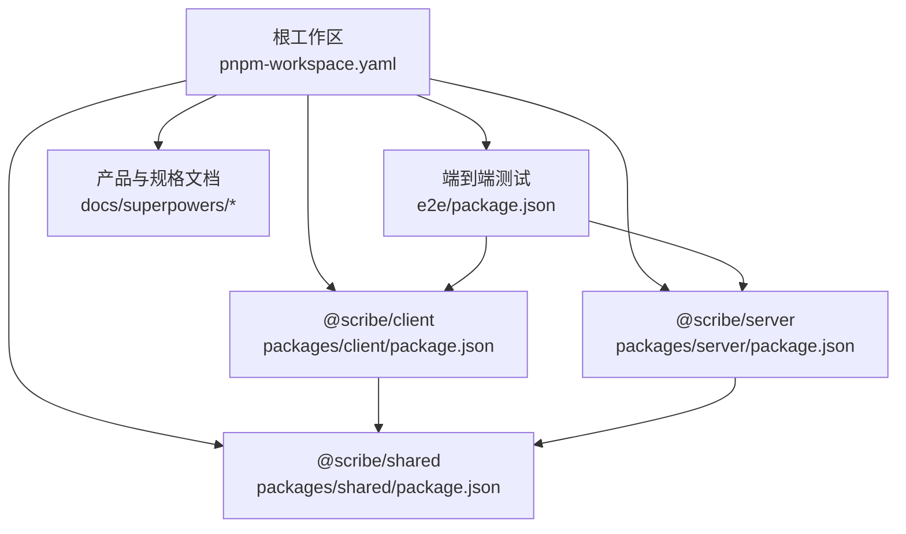
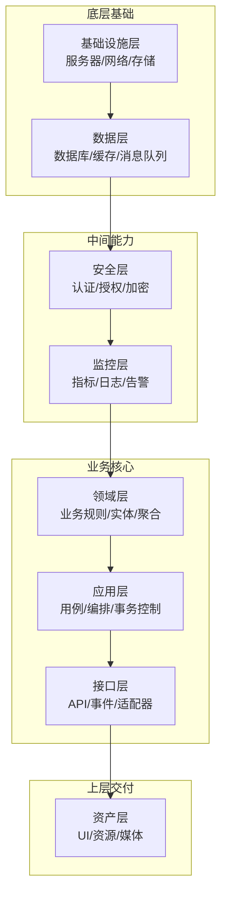
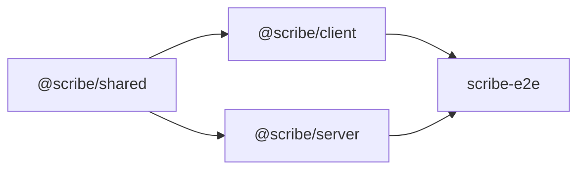

# 八层架构详解

<cite>
**本文档引用的文件**
- [package.json](file://package.json)
- [pnpm-workspace.yaml](file://pnpm-workspace.yaml)
- [tsconfig.base.json](file://tsconfig.base.json)
- [e2e/package.json](file://e2e/package.json)
- [packages/client/package.json](file://packages/client/package.json)
- [packages/server/package.json](file://packages/server/package.json)
- [packages/shared/package.json](file://packages/shared/package.json)
- [docs/superpowers/plans/2026-06-17-scribe-final-roadmap.md](file://docs/superpowers/plans/2026-06-17-scribe-final-roadmap.md)
- [docs/superpowers/specs/2026-06-17-scribe-ultimate-product-goal.md](file://docs/superpowers/specs/2026-06-17-scribe-ultimate-product-goal.md)
- [samples/sillytavern/Izumi 0503.json](file://samples/sillytavern/Izumi 0503.json)
</cite>

## 目录
1. [引言](#引言)
2. [项目结构](#项目结构)
3. [核心组件](#核心组件)
4. [架构总览](#架构总览)
5. [详细组件分析](#详细组件分析)
6. [依赖关系分析](#依赖关系分析)
7. [性能考虑](#性能考虑)
8. [故障排除指南](#故障排除指南)
9. [结论](#结论)
10. [附录](#附录)

## 引言
本文件系统性阐述 Scribe 项目的八层架构：资产层（Assets Layer）、领域层（Domain Layer）、应用层（Application Layer）、接口层（Interface Layer）、基础设施层（Infrastructure Layer）、数据层（Data Layer）、安全层（Security Layer）与监控层（Monitoring Layer）。文档基于仓库现有配置与规划文档进行结构化解读，重点说明各层职责、边界与交互协议，并通过可视化图表呈现依赖关系与数据流。同时总结分层架构在关注点分离、模块化开发、可维护性与可测试性方面的优势。

## 项目结构
Scribe 采用 monorepo 管理，根目录通过工作区配置统一管理多包。核心包包括客户端、服务端与共享库，配合端到端测试套件与产品规划文档，形成从需求到实现的完整闭环。

**图表来源**
- [pnpm-workspace.yaml:1-2](file://pnpm-workspace.yaml#L1-L2)
- [packages/client/package.json:1-15](file://packages/client/package.json#L1-L15)
- [packages/server/package.json:1-15](file://packages/server/package.json#L1-L15)
- [packages/shared/package.json:1-15](file://packages/shared/package.json#L1-L15)
- [e2e/package.json:1-5](file://e2e/package.json#L1-L5)

**章节来源**
- [pnpm-workspace.yaml:1-2](file://pnpm-workspace.yaml#L1-L2)
- [package.json:1-5](file://package.json#L1-L5)
- [tsconfig.base.json:1-50](file://tsconfig.base.json#L1-L50)

## 核心组件
- 客户端包（@scribe/client）：负责用户界面与交互逻辑，面向最终用户的输入输出处理。
- 服务端包（@scribe/server）：承载业务逻辑、数据处理与对外 API，作为系统的核心执行单元。
- 共享包（@scribe/shared）：存放跨包复用的类型、常量、工具与通用抽象，确保一致性与低耦合。
- 端到端测试（e2e）：验证端到端流程与集成行为，保障功能稳定性与回归质量。
- 规划与规格文档：定义产品目标、路线图与技术规范，指导架构演进与实现方向。

上述组件共同构成八层架构的运行载体，其中共享层为上层提供抽象与契约，客户端与服务端分别承担用户交互与业务执行职责，测试与文档则贯穿全生命周期的质量保障。

**章节来源**
- [packages/client/package.json:1-15](file://packages/client/package.json#L1-L15)
- [packages/server/package.json:1-15](file://packages/server/package.json#L1-L15)
- [packages/shared/package.json:1-15](file://packages/shared/package.json#L1-L15)
- [e2e/package.json:1-5](file://e2e/package.json#L1-L5)
- [docs/superpowers/specs/2026-06-17-scribe-ultimate-product-goal.md:1-100](file://docs/superpowers/specs/2026-06-17-scribe-ultimate-product-goal.md#L1-L100)

## 架构总览
八层架构以“自下而上”的方式组织，从基础设施与数据层向上构建到接口与安全层，最终服务于资产层的用户体验。各层之间通过清晰的边界与契约交互，确保关注点分离与模块化开发。

该图为概念性架构示意，用于帮助理解各层职责与流向，不直接映射具体源码文件。

## 详细组件分析

### 资产层（Assets Layer）
- 职责：承载用户可见的界面元素、资源与媒体，负责与用户交互与信息呈现。
- 边界：仅处理展示与输入，不包含业务逻辑；通过接口层暴露能力。
- 交互协议：通过接口层提供的 API/事件进行数据请求与状态更新。
- 封装策略：UI 组件化、资源模块化、主题与国际化抽象。
- 可维护性：界面与逻辑解耦，便于独立迭代与测试。

### 领域层（Domain Layer）
- 职责：表达核心业务概念、规则与约束，维护业务状态与不变式。
- 边界：包含实体、值对象、领域服务与聚合根，不依赖外部框架。
- 交互协议：向应用层暴露领域操作接口，应用层通过用例编排调用。
- 封装策略：领域模型内聚、边界上下文划分、领域事件发布。
- 可测试性：纯领域逻辑易于单元测试，边界清晰便于模拟与断言。

### 应用层（Application Layer）
- 职责：协调领域层完成具体业务用例，编排事务与跨聚合操作。
- 边界：定义用例边界，组合多个领域操作，处理应用级错误。
- 交互协议：接收来自接口层的请求，调用领域层执行业务，返回结果。
- 封装策略：用例即流程、事务脚本、应用服务无状态化。
- 可测试性：用例流程可注入测试替身，覆盖分支与异常路径。

### 接口层（Interface Layer）
- 职责：对外提供 API、事件或适配器，作为系统的入口与出口。
- 边界：定义请求/响应格式、路由与协议，屏蔽底层实现细节。
- 交互协议：接收资产层/外部系统的请求，转换为应用层可理解的命令。
- 封装策略：控制器/处理器、DTO 映射、协议适配器。
- 可测试性：接口隔离便于桩件替换，支持契约驱动测试。

### 基础设施层（Infrastructure Layer）
- 职责：提供通用技术能力，如网络、存储、调度与第三方集成。
- 边界：实现技术细节，向上提供稳定抽象，向下对接硬件/平台。
- 交互协议：按接口层契约提供实现，遵循依赖倒置原则。
- 封装策略：工厂/仓储实现、连接池、任务调度器。
- 可移植性：抽象与实现分离，便于切换供应商或升级版本。

### 数据层（Data Layer）
- 职责：持久化与检索数据，保证一致性与性能。
- 边界：数据库/缓存/搜索引擎等，提供读写抽象。
- 交互协议：仓储接口由应用层调用，基础设施层提供具体实现。
- 封装策略：仓储模式、查询对象、批量操作。
- 可扩展性：支持读写分离、分片与异步写入。

### 安全层（Security Layer）
- 职责：统一处理认证、授权、加密与审计。
- 边界：横切关注点，对所有接口与应用操作生效。
- 交互协议：拦截器/中间件，注入安全上下文，拒绝越权访问。
- 封装策略：策略模式、权限矩阵、令牌与证书管理。
- 合规性：日志留痕、最小权限、敏感数据脱敏。

### 监控层（Monitoring Layer）
- 职责：收集指标、日志与追踪，提供可观测性与告警。
- 边界：非功能性能力，贯穿所有层但保持低侵入。
- 交互协议：埋点 SDK、指标导出、链路追踪。
- 封装策略：指标门面、结构化日志、采样与聚合。
- 运维价值：快速定位问题、容量评估与性能优化。

## 依赖关系分析
基于 monorepo 的包依赖关系，客户端与服务端均依赖共享层，端到端测试同时依赖客户端与服务端，形成清晰的单向依赖链。

**图表来源**
- [packages/client/package.json:1-15](file://packages/client/package.json#L1-L15)
- [packages/server/package.json:1-15](file://packages/server/package.json#L1-L15)
- [packages/shared/package.json:1-15](file://packages/shared/package.json#L1-L15)
- [e2e/package.json:1-5](file://e2e/package.json#L1-L5)

**章节来源**
- [pnpm-workspace.yaml:1-2](file://pnpm-workspace.yaml#L1-L2)
- [packages/client/package.json:1-15](file://packages/client/package.json#L1-L15)
- [packages/server/package.json:1-15](file://packages/server/package.json#L1-L15)
- [packages/shared/package.json:1-15](file://packages/shared/package.json#L1-L15)
- [e2e/package.json:1-5](file://e2e/package.json#L1-L5)

## 性能考虑
- 分层带来的收益
  - 关注点分离：每层专注单一职责，降低复杂度，提升性能优化的针对性。
  - 模块化开发：依赖明确、边界清晰，便于引入缓存、批处理与异步化。
  - 可测试性：单元测试与集成测试分层进行，有助于识别性能瓶颈与回归风险。
- 实践建议
  - 在接口层实施限流与熔断，避免过载扩散至领域层。
  - 在应用层合理拆分长事务，减少锁竞争与超时风险。
  - 在数据层采用读写分离、索引优化与批量写入。
  - 在监控层建立关键指标仪表盘，持续观测与预警。

## 故障排除指南
- 常见问题定位
  - 界面异常：优先检查接口层响应与资产层渲染逻辑，确认数据契约一致。
  - 业务错误：核对应用层用例编排与领域层不变式，定位规则触发条件。
  - 性能退化：结合监控层指标，逐步回溯到数据层与基础设施层的热点路径。
- 处理流程
  - 收集日志与追踪 ID，定位具体请求链路。
  - 回放用例场景，复现问题并记录边界条件。
  - 通过单元测试与集成测试隔离问题范围，修复后回归验证。

## 结论
Scribe 的八层架构通过严格的边界划分与契约设计，实现了从基础设施到用户资产的完整能力栈。分层不仅提升了系统的可维护性与可测试性，也为未来扩展与演进提供了稳固基座。结合共享层的抽象与端到端测试的保障，团队可以高效地交付高质量的产品功能。

## 附录
- 示例参考文件
  - 产品终极目标文档：[2026-06-17-scribe-ultimate-product-goal.md](file://docs/superpowers/specs/2026-06-17-scribe-ultimate-product-goal.md)
  - 最终路线图文档：[2026-06-17-scribe-final-roadmap.md](file://docs/superpowers/plans/2026-06-17-scribe-final-roadmap.md)
  - 示例数据样本：[Izumi 0503.json](file://samples/sillytavern/Izumi 0503.json)