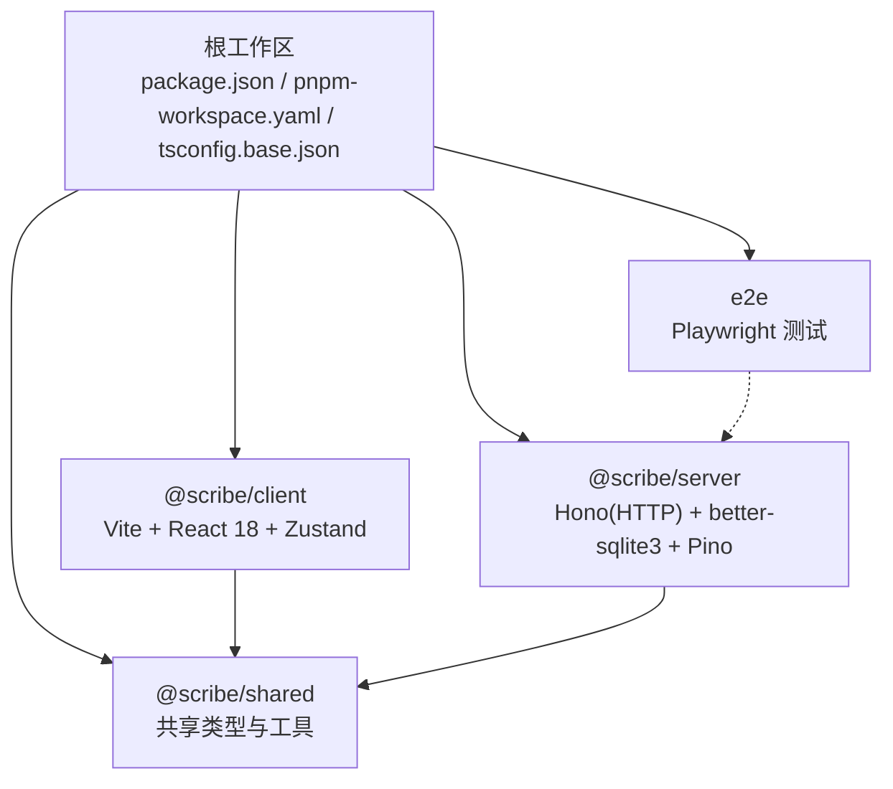
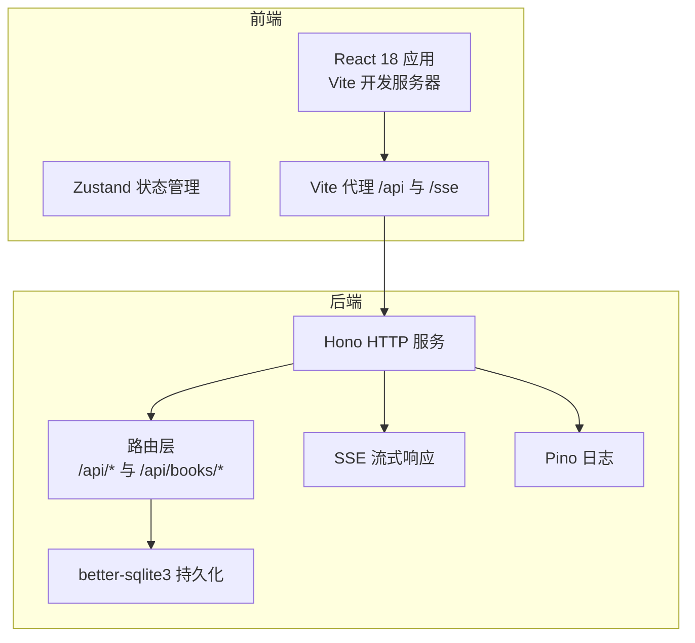
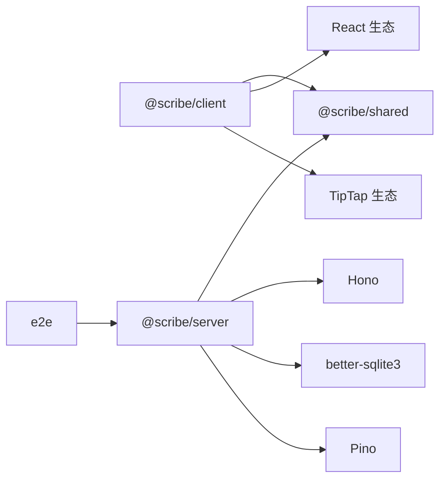

# 技术决策与权衡

<cite>
**本文引用的文件**
- [package.json](file://package.json)
- [pnpm-workspace.yaml](file://pnpm-workspace.yaml)
- [tsconfig.base.json](file://tsconfig.base.json)
- [packages/client/package.json](file://packages/client/package.json)
- [packages/server/package.json](file://packages/server/package.json)
- [packages/shared/package.json](file://packages/shared/package.json)
- [e2e/package.json](file://e2e/package.json)
- [e2e/playwright.config.ts](file://e2e/playwright.config.ts)
- [packages/client/vite.config.ts](file://packages/client/vite.config.ts)
- [packages/server/tsconfig.build.json](file://packages/server/tsconfig.build.json)
- [packages/client/tests/smoke.test.tsx](file://packages/client/tests/smoke.test.tsx)
- [packages/client/tests/components/worldbook-panel.test.tsx](file://packages/client/tests/components/worldbook-panel.test.tsx)
- [packages/server/tests/unit/http/server.test.ts](file://packages/server/tests/unit/http/server.test.ts)
- [packages/server/tests/integration/conversation-echo.test.ts](file://packages/server/tests/integration/conversation-echo.test.ts)
- [packages/server/src/http/routes/books.ts](file://packages/server/src/http/routes/books.ts)
</cite>

## 目录
1. [引言](#引言)
2. [项目结构](#项目结构)
3. [核心组件](#核心组件)
4. [架构总览](#架构总览)
5. [详细组件分析](#详细组件分析)
6. [依赖关系分析](#依赖关系分析)
7. [性能考虑](#性能考虑)
8. [故障排查指南](#故障排查指南)
9. [结论](#结论)
10. [附录](#附录)

## 引言
本文件系统化梳理 Scribe 项目的“技术决策与架构权衡”，围绕以下主题展开：前端 React 18 + Suspense + Zustand 的选型理由与优势；后端 Node.js + Hono（Fastify 风格）的技术考量；全栈 TypeScript 统一性的价值；monorepo（pnpm workspace）的动机与治理策略；分层架构的设计决策与落地效果；测试策略（Playwright + Vitest）的技术选型；性能基准与成本效益分析；替代方案对比与最终选择理由；以及技术债管理与演进策略。

## 项目结构
Scribe 采用 monorepo 架构，通过 pnpm workspace 管理多包协作。根级脚本统一触发各包的开发、构建、测试与类型检查；TypeScript 基础配置集中于根级 tsconfig，确保一致的编译选项与严格模式。

图示来源
- [pnpm-workspace.yaml:1-4](file://pnpm-workspace.yaml#L1-L4)
- [package.json:6-12](file://package.json#L6-L12)
- [tsconfig.base.json:1-16](file://tsconfig.base.json#L1-L16)

章节来源
- [pnpm-workspace.yaml:1-4](file://pnpm-workspace.yaml#L1-L4)
- [package.json:6-12](file://package.json#L6-L12)
- [tsconfig.base.json:1-16](file://tsconfig.base.json#L1-L16)

## 核心组件
- 前端客户端：基于 Vite + React 18，使用 Zustand 进行状态管理，具备代理到后端 API/SSE 的开发服务器配置，并集成 Vitest/JSDOM 进行单元测试。
- 后端服务：基于 Hono（类 Fastify 风格）构建 HTTP 路由，使用 better-sqlite3 存储，Pino 日志，支持 SSE 流式响应与健康检查。
- 共享模块：集中 Zod 类型校验与跨包复用逻辑，降低重复实现与类型漂移。
- 端到端测试：Playwright 驱动，自动拉起后端服务进行集成测试，支持 HTML 报告与重试机制。
- 工具链：根级 TypeScript 5 + 严格模式，统一模块解析与 ESNext 输出目标。

章节来源
- [packages/client/package.json:12-37](file://packages/client/package.json#L12-L37)
- [packages/server/package.json:13-31](file://packages/server/package.json#L13-L31)
- [packages/shared/package.json:11-18](file://packages/shared/package.json#L11-L18)
- [e2e/playwright.config.ts:9-26](file://e2e/playwright.config.ts#L9-L26)
- [packages/client/vite.config.ts:5-19](file://packages/client/vite.config.ts#L5-L19)
- [tsconfig.base.json:2-14](file://tsconfig.base.json#L2-L14)

## 架构总览
整体采用“前端 SPA + 后端 HTTP(SSE) + SQLite 存储”的分层架构。前端通过代理访问后端接口；后端路由负责业务编排与持久化；共享模块提供类型与校验保障；测试覆盖端到端与单元层面。

图示来源
- [packages/client/vite.config.ts:7-12](file://packages/client/vite.config.ts#L7-L12)
- [packages/server/package.json:13-24](file://packages/server/package.json#L13-L24)
- [packages/server/src/http/routes/books.ts:33-72](file://packages/server/src/http/routes/books.ts#L33-L72)

## 详细组件分析

### 前端技术栈：React 18 + Suspense + Zustand
- 选择动机
  - React 18 提供并发特性与改进的批处理，有利于复杂 UI 的性能与交互体验。
  - Suspense 在当前仓库中未直接出现，但 React 18 的并发能力与状态管理模式可与 Suspense 生态协同（例如懒加载与资源预取），便于未来引入。
  - Zustand 以极简 API 实现全局状态，避免样板代码与 Provider 层级过深，适合中小型应用的状态管理需求。
- 优势体现
  - 客户端包依赖明确：React、React DOM、React Router 7、TipTap 生态、Turndown、Diff 等，满足富文本与导入导出场景。
  - Vite 提供快速冷启动与热更新，代理配置简化前后端联调。
  - 测试环境使用 JSDOM + Vitest，保证组件行为与交互测试的稳定性。
- 可能的权衡
  - 对于超大体量状态树，Zustand 的单仓状态可能需要拆分切片或引入更细粒度的模块化策略。
  - Suspense 的缺失意味着需自行处理加载边界与错误边界，建议配合 React.lazy 与错误边界组件完善用户体验。

章节来源
- [packages/client/package.json:12-37](file://packages/client/package.json#L12-L37)
- [packages/client/vite.config.ts:5-19](file://packages/client/vite.config.ts#L5-L19)
- [packages/client/tests/smoke.test.tsx:1-28](file://packages/client/tests/smoke.test.tsx#L1-L28)

### 后端框架：Node.js + Hono（Fastify 风格）
- 选择动机
  - Hono 提供轻量、高性能且对中间件友好的路由模型，易于实现 REST 与 SSE。
  - better-sqlite3 将数据库内嵌至进程，减少运维复杂度，适合中小规模数据与开发/演示场景。
  - Pino 日志简洁高效，适配 Node 环境。
- 实施效果
  - 路由层清晰分离：健康检查、书籍列表、对话流式输出等接口职责单一。
  - 单元与集成测试覆盖良好：包括健康检查返回值、SSE 文本增量事件与完成事件、回声模式等。
- 可能的权衡
  - SQLite 不适合高写入吞吐或强一致分布式场景；若业务增长，需评估迁移到外部数据库与分片/复制策略。

章节来源
- [packages/server/package.json:13-31](file://packages/server/package.json#L13-L31)
- [packages/server/tests/unit/http/server.test.ts:1-11](file://packages/server/tests/unit/http/server.test.ts#L1-L11)
- [packages/server/tests/integration/conversation-echo.test.ts:16-41](file://packages/server/tests/integration/conversation-echo.test.ts#L16-L41)
- [packages/server/src/http/routes/books.ts:33-72](file://packages/server/src/http/routes/books.ts#L33-L72)

### TypeScript 全栈统一性
- 价值体现
  - 根级 tsconfig.base.json 统一严格模式、模块解析与输出目标，确保客户端、服务端与共享模块的一致性。
  - 共享模块集中 Zod 校验，避免前后端重复实现，降低类型漂移风险。
- 实践建议
  - 保持严格模式开启，持续进行 typecheck 脚本，防止类型降级。
  - 对外暴露的 API 数据结构优先使用 Zod schema 校验，前后端共享 schema 以获得最佳一致性。

章节来源
- [tsconfig.base.json:1-16](file://tsconfig.base.json#L1-L16)
- [packages/shared/package.json:11-18](file://packages/shared/package.json#L11-L18)

### Monorepo 架构（pnpm workspace）与治理策略
- 动机
  - 代码复用：共享类型与工具，减少重复实现。
  - 依赖收敛：统一版本与锁文件，降低依赖地狱风险。
  - 开发效率：根级脚本一键 dev/build/test/typecheck，提升迭代速度。
- 管理策略
  - 包命名空间：使用 @scribe/* 命名，避免冲突。
  - workspace:* 依赖：共享模块通过 workspace:* 引用，构建时由 pnpm 解析。
  - 独立测试：每个包独立运行测试，同时支持根级聚合测试。
- 风险控制
  - 严格遵守变更范围：涉及共享模块的改动需同步验证客户端与服务端。
  - 版本发布：采用语义化版本与变更日志，避免破坏性升级。

章节来源
- [pnpm-workspace.yaml:1-4](file://pnpm-workspace.yaml#L1-L4)
- [package.json:6-12](file://package.json#L6-L12)
- [packages/client/package.json:12-14](file://packages/client/package.json#L12-L14)
- [packages/server/package.json:13-14](file://packages/server/package.json#L13-L14)
- [packages/shared/package.json:7-10](file://packages/shared/package.json#L7-L10)

### 分层架构设计：决策依据与实施效果
- 决策依据
  - 表现层：React SPA，专注 UI 与用户交互。
  - 应用层：Hono 路由与控制器，封装业务流程。
  - 数据层：SQLite 文件存储，简单可靠。
  - 共享层：Zod 类型与通用工具，保障一致性。
- 实施效果
  - 接口清晰：如书籍创建、列表查询、对话流式输出等路由职责明确。
  - 可观测性：健康检查与日志记录，便于问题定位。
  - 可测试性：单元与集成测试覆盖关键路径，端到端测试保障端到端连通性。

章节来源
- [packages/server/src/http/routes/books.ts:33-72](file://packages/server/src/http/routes/books.ts#L33-L72)
- [packages/server/tests/integration/conversation-echo.test.ts:16-41](file://packages/server/tests/integration/conversation-echo.test.ts#L16-L41)
- [e2e/playwright.config.ts:9-26](file://e2e/playwright.config.ts#L9-L26)

### 测试策略：Playwright + Vitest
- 技术选型
  - Playwright：浏览器级端到端测试，自动安装浏览器，支持 HTML 报告与重试。
  - Vitest：快速单元/组件测试，JSDOM 环境，与 Vite 协同良好。
- 实施效果
  - 端到端：通过 webServer 自动启动后端，访问 /api/health 进行健康检查，确保服务可用。
  - 单元/集成：覆盖健康检查、SSE 文本增量与完成事件、回声模式等关键行为。
  - 组件测试：对具体组件（如世界书面板、预设面板）进行交互与状态切换测试。
- 最佳实践
  - 将 mock 与清理逻辑集中在测试文件中，避免副作用扩散。
  - 使用稳定的断言策略（如事件名称、状态码、响应体片段匹配）。

章节来源
- [e2e/package.json:6-9](file://e2e/package.json#L6-L9)
- [e2e/playwright.config.ts:9-26](file://e2e/playwright.config.ts#L9-L26)
- [packages/client/tests/smoke.test.tsx:1-28](file://packages/client/tests/smoke.test.tsx#L1-L28)
- [packages/client/tests/components/worldbook-panel.test.tsx:1-44](file://packages/client/tests/components/worldbook-panel.test.tsx#L1-L44)
- [packages/server/tests/unit/http/server.test.ts:1-11](file://packages/server/tests/unit/http/server.test.ts#L1-L11)
- [packages/server/tests/integration/conversation-echo.test.ts:16-41](file://packages/server/tests/integration/conversation-echo.test.ts#L16-L41)

### 性能基准与成本效益分析
- 当前现状
  - 前端：Vite 提供快速开发体验；代理到本地后端，减少跨域与网络延迟。
  - 后端：Hono 路由与 better-sqlite3 组合，适合中小规模数据与低延迟场景。
  - 测试：端到端与单元测试并存，有助于早期发现性能回归。
- 成本效益
  - 开发成本：较低，工具链成熟、学习曲线平缓。
  - 运维成本：极低，无需额外数据库或消息队列。
  - 扩展成本：当业务增长时，需评估数据库迁移与服务拆分的成本。
- 建议
  - 引入性能监控（如关键路径追踪、内存占用、请求耗时）以量化收益。
  - 在端到端测试中加入性能断言（如首屏时间、交互延迟阈值）。

[本节为通用指导，不直接分析具体文件]

### 替代方案对比与最终选择理由
- 前端替代：Vue 3 + Pinia、Solid + Store、SvelteKit 等。Scribe 选择 React 18 + Zustand 的理由在于生态成熟、团队熟悉度与最小心智负担。
- 后端替代：Express/Koa、Fastify、NestJS 等。Scribe 选择 Hono 的理由在于其路由简洁、SSE 支持友好、与 Node 生态契合。
- 测试替代：Cypress、RTL + Jest 等。Scribe 选择 Playwright + Vitest 的理由在于端到端真实度与测试执行速度的平衡。
- 最终选择理由
  - 快速迭代：Vite + Hono + Vitest 提供高效的开发与反馈循环。
  - 低运维：SQLite + Pino + Hono 降低部署与维护复杂度。
  - 可扩展：monorepo + 共享模块为后续功能扩展与团队协作奠定基础。

[本节为概念性总结，不直接分析具体文件]

### 技术债管理与演进策略
- 技术债识别
  - 缺失 Suspense：未来可引入懒加载与资源预取，完善加载边界。
  - 状态管理：随着功能增长，Zustand 可拆分为多个 store 或引入更细粒度的状态切片。
  - 数据层：SQLite 适合起步，需制定迁移计划（如外部数据库、分表/分区）。
- 演进策略
  - 渐进式重构：先在分支中验证新方案，再逐步合并。
  - 规范先行：完善 PR 检查清单，强制类型检查与测试覆盖率。
  - 监控与回滚：引入性能指标与金丝雀发布，确保变更可控。

[本节为通用指导，不直接分析具体文件]

## 依赖关系分析
- 包间依赖
  - @scribe/client 依赖 @scribe/shared 与 React/Tiptap/Turndown/Diff 等。
  - @scribe/server 依赖 @scribe/shared、Hono、better-sqlite3、Pino、Zod 等。
  - @scribe/shared 依赖 Zod，被前后端共同引用。
- 外部依赖
  - Vite、React 18、Zustand、Playwright、Vitest 等构成核心工具链。
- 依赖可视化

图示来源
- [packages/client/package.json:12-37](file://packages/client/package.json#L12-L37)
- [packages/server/package.json:13-31](file://packages/server/package.json#L13-L31)
- [packages/shared/package.json:11-18](file://packages/shared/package.json#L11-L18)
- [e2e/playwright.config.ts:16-25](file://e2e/playwright.config.ts#L16-L25)

章节来源
- [packages/client/package.json:12-37](file://packages/client/package.json#L12-L37)
- [packages/server/package.json:13-31](file://packages/server/package.json#L13-L31)
- [packages/shared/package.json:11-18](file://packages/shared/package.json#L11-L18)
- [e2e/playwright.config.ts:16-25](file://e2e/playwright.config.ts#L16-L25)

## 性能考虑
- 前端性能
  - 利用 Vite 的按需打包与 Tree-shaking，减少初始体积。
  - 将重型依赖（如 Turndown、Diff）按需引入，避免阻塞主线程。
- 后端性能
  - Hono 路由与 SSE 流式输出，降低内存峰值与延迟。
  - better-sqlite3 适合小中型数据，注意 SQL 查询优化与索引设计。
- 测试驱动的性能
  - 在端到端测试中加入性能断言，确保关键路径不退化。

[本节为通用指导，不直接分析具体文件]

## 故障排查指南
- 健康检查失败
  - 现象：/api/health 返回非 200。
  - 排查：确认服务已启动、端口正确、webServer 配置与环境变量（如 PORT、SCRIBE_HOME）设置。
- SSE 流异常
  - 现象：SSE 文本增量事件缺失或未触发 done。
  - 排查：检查路由实现、请求体格式、回声模式与模型注入条件。
- 端到端测试失败
  - 现象：测试超时或断言失败。
  - 排查：查看 HTML 报告、重试次数、浏览器安装状态与 baseURL 设置。

章节来源
- [packages/server/tests/unit/http/server.test.ts:1-11](file://packages/server/tests/unit/http/server.test.ts#L1-L11)
- [packages/server/tests/integration/conversation-echo.test.ts:16-41](file://packages/server/tests/integration/conversation-echo.test.ts#L16-L41)
- [e2e/playwright.config.ts:9-26](file://e2e/playwright.config.ts#L9-L26)

## 结论
Scribe 的技术栈在“快速开发、低运维、可扩展”之间取得平衡：前端以 React 18 + Zustand 为核心，辅以 Vite 提升开发效率；后端以 Hono + better-sqlite3 + Pino 组合实现简洁可靠的业务层；TypeScript 与 monorepo 确保全栈一致性与协作效率；测试体系覆盖端到端与单元层面。未来可在状态切片、数据库迁移与性能监控方面持续演进，以支撑更大规模的应用场景。

## 附录
- 关键配置要点
  - 根级 tsconfig.base.json：严格模式、ESNext 模块解析、ES2022 目标。
  - 客户端 vite.config.ts：代理 /api 与 /sse，JSDOM 环境测试。
  - 服务端 tsconfig.build.json：区分构建与源码目录，排除测试与脚本。
- 测试参考
  - 端到端：Playwright 自动启动服务并访问健康检查。
  - 单元/集成：覆盖健康检查、SSE 事件与回声模式。
  - 组件：对具体 UI 组件进行交互与状态切换测试。

章节来源
- [tsconfig.base.json:1-16](file://tsconfig.base.json#L1-L16)
- [packages/client/vite.config.ts:5-19](file://packages/client/vite.config.ts#L5-L19)
- [packages/server/tsconfig.build.json:1-10](file://packages/server/tsconfig.build.json#L1-L10)
- [e2e/playwright.config.ts:9-26](file://e2e/playwright.config.ts#L9-L26)
- [packages/server/tests/unit/http/server.test.ts:1-11](file://packages/server/tests/unit/http/server.test.ts#L1-L11)
- [packages/server/tests/integration/conversation-echo.test.ts:16-41](file://packages/server/tests/integration/conversation-echo.test.ts#L16-L41)
- [packages/client/tests/components/worldbook-panel.test.tsx:1-44](file://packages/client/tests/components/worldbook-panel.test.tsx#L1-L44)