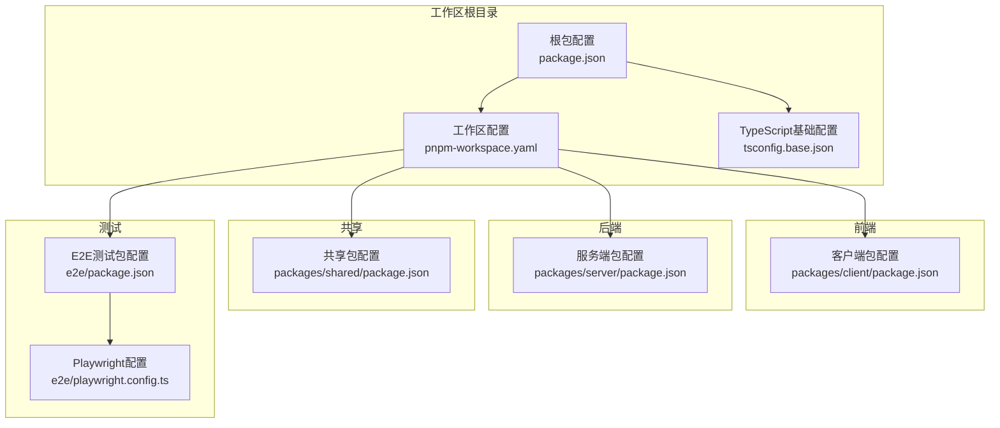
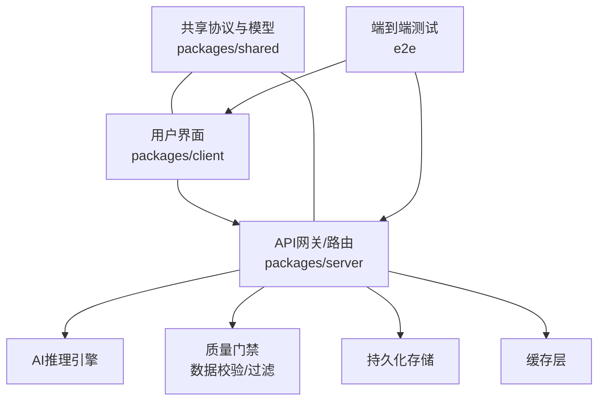
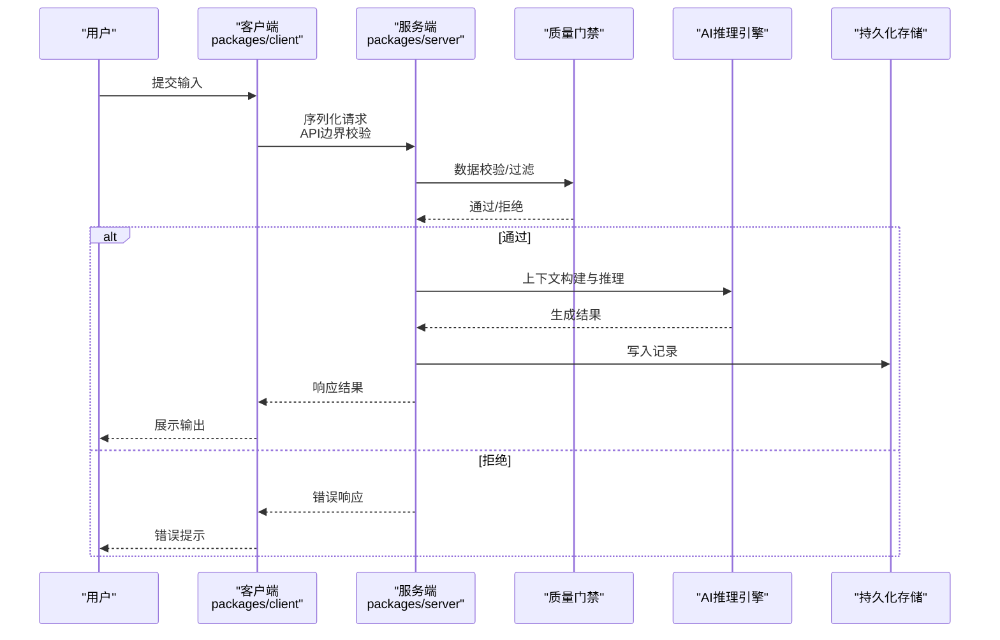
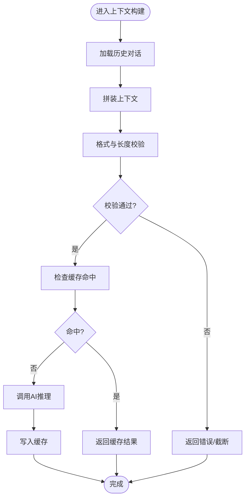
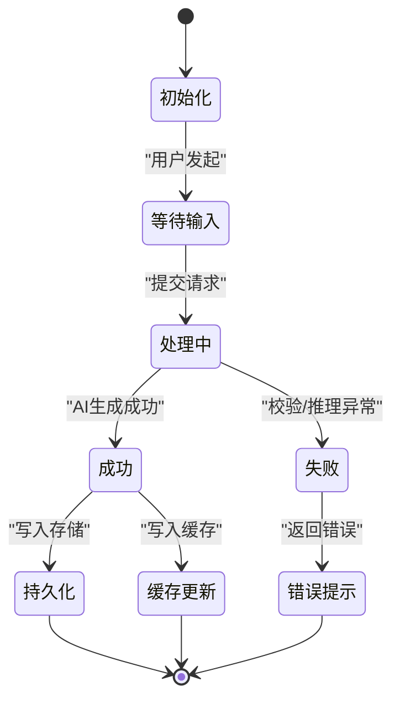
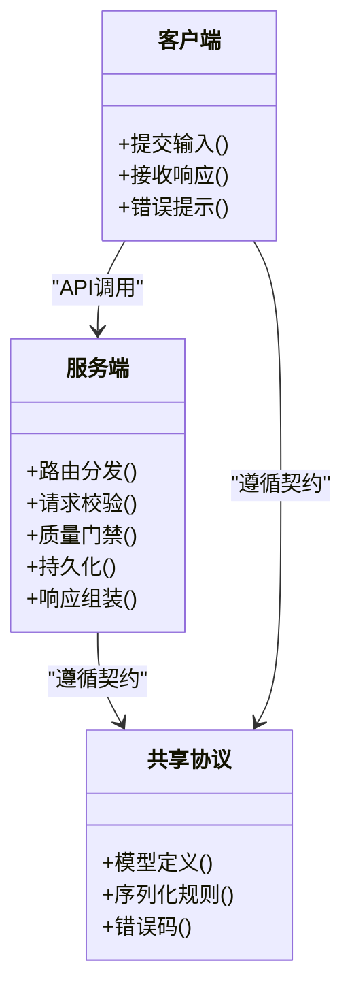
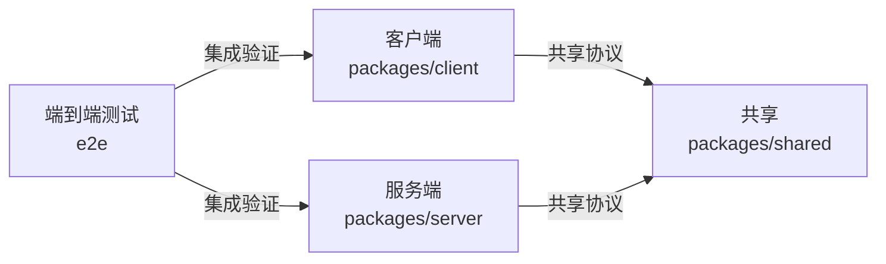

# 数据流与系统边界

<cite>
**本文引用的文件**
- [package.json](file://package.json)
- [pnpm-workspace.yaml](file://pnpm-workspace.yaml)
- [tsconfig.base.json](file://tsconfig.base.json)
- [packages/client/package.json](file://packages/client/package.json)
- [packages/server/package.json](file://packages/server/package.json)
- [packages/shared/package.json](file://packages/shared/package.json)
- [e2e/package.json](file://e2e/package.json)
- [e2e/playwright.config.ts](file://e2e/playwright.config.ts)
- [docs/superpowers/plans/2026-06-17-scribe-final-roadmap.md](file://docs/superpowers/plans/2026-06-17-scribe-final-roadmap.md)
- [docs/superpowers/specs/2026-06-16-sillytavern-import-design.md](file://docs/superpowers/specs/2026-06-16-sillytavern-import-design.md)
- [samples/sillytavern/Izumi 0503.json](file://samples/sillytavern/Izumi 0503.json)
</cite>

## 目录
1. [引言](#引言)
2. [项目结构](#项目结构)
3. [核心组件](#核心组件)
4. [架构总览](#架构总览)
5. [详细组件分析](#详细组件分析)
6. [依赖关系分析](#依赖关系分析)
7. [性能考量](#性能考量)
8. [故障排查指南](#故障排查指南)
9. [结论](#结论)
10. [附录](#附录)

## 引言
本文件围绕Scribe项目的数据流设计与系统边界展开，目标是系统性梳理从用户输入到AI生成的完整数据流程，覆盖对话处理、上下文构建、质量门禁与持久化存储；同时明确系统边界与微服务架构策略，解释运行时上下文构建的数据转换与缓存机制，分析状态管理的数据流向与一致性保障，阐述API边界与数据序列化策略，并给出数据流图与状态转换图。此外，文档还讨论了数据验证、错误传播与异常处理机制，以及数据迁移与版本兼容的设计思路，最后对实时数据同步与离线处理的架构考量进行说明。

## 项目结构
Scribe采用多包工作区（monorepo）组织，核心目录包括客户端、服务端与共享模块，配合端到端测试与规范文档，形成前后端协同与跨平台兼容的工程化布局。工作区通过包管理器统一管理依赖与脚本，TypeScript基础配置为全栈开发提供一致的类型约束与编译环境。

**图表来源**
- [package.json](file://package.json)
- [pnpm-workspace.yaml](file://pnpm-workspace.yaml)
- [tsconfig.base.json](file://tsconfig.base.json)
- [packages/client/package.json](file://packages/client/package.json)
- [packages/server/package.json](file://packages/server/package.json)
- [packages/shared/package.json](file://packages/shared/package.json)
- [e2e/package.json](file://e2e/package.json)
- [e2e/playwright.config.ts](file://e2e/playwright.config.ts)

**章节来源**
- [package.json](file://package.json)
- [pnpm-workspace.yaml](file://pnpm-workspace.yaml)
- [tsconfig.base.json](file://tsconfig.base.json)

## 核心组件
- 客户端（packages/client）
  - 职责：用户界面交互、输入采集、事件分发、与服务端通信、状态展示与本地缓存。
  - 关键点：与服务端API边界对接，负责数据序列化与错误提示，确保UI与业务逻辑解耦。
- 服务端（packages/server）
  - 职责：接收请求、路由分发、调用AI服务、执行质量门禁、持久化写入、响应组装。
  - 关键点：作为系统边界的核心，承担上下文构建、数据转换与一致性校验。
- 共享（packages/shared）
  - 职责：跨端共享模型、工具函数、常量与类型定义，确保客户端与服务端协议一致。
  - 关键点：协议契约、序列化规则、通用校验器与错误码定义。
- 端到端测试（e2e）
  - 职责：模拟真实用户旅程，验证端到端数据流与边界行为。
  - 关键点：Playwright配置驱动的自动化回归，覆盖关键数据流路径。

**章节来源**
- [packages/client/package.json](file://packages/client/package.json)
- [packages/server/package.json](file://packages/server/package.json)
- [packages/shared/package.json](file://packages/shared/package.json)
- [e2e/package.json](file://e2e/package.json)
- [e2e/playwright.config.ts](file://e2e/playwright.config.ts)

## 架构总览
Scribe采用前后端分离与微服务化策略，系统边界清晰：客户端负责用户交互与本地体验，服务端负责AI推理、质量控制与持久化；共享层提供协议与模型契约，确保跨端一致性。端到端测试贯穿全链路，保障数据流在边界处的正确性与鲁棒性。

**图表来源**
- [packages/client/package.json](file://packages/client/package.json)
- [packages/server/package.json](file://packages/server/package.json)
- [packages/shared/package.json](file://packages/shared/package.json)
- [e2e/package.json](file://e2e/package.json)

## 详细组件分析

### 用户输入到AI生成的数据流
该流程涵盖输入采集、上下文构建、质量门禁、AI推理、结果回传与持久化，系统在每个环节设置边界与校验，确保数据一致性与可追溯性。

**图表来源**
- [packages/client/package.json](file://packages/client/package.json)
- [packages/server/package.json](file://packages/server/package.json)
- [packages/shared/package.json](file://packages/shared/package.json)

**章节来源**
- [packages/client/package.json](file://packages/client/package.json)
- [packages/server/package.json](file://packages/server/package.json)
- [packages/shared/package.json](file://packages/shared/package.json)

### 运行时上下文构建与缓存机制
- 上下文构建：服务端根据历史对话、角色设定与当前输入动态拼装上下文，确保上下文长度与格式符合AI模型要求。
- 缓存策略：针对高频查询与中间结果建立缓存，结合LRU或TTL策略降低重复计算成本，同时提供缓存失效与一致性保障。
- 数据转换：在进入AI推理前完成字段清洗、类型转换与安全检查，避免污染下游。

**图表来源**
- [packages/server/package.json](file://packages/server/package.json)
- [packages/shared/package.json](file://packages/shared/package.json)

**章节来源**
- [packages/server/package.json](file://packages/server/package.json)
- [packages/shared/package.json](file://packages/shared/package.json)

### 状态管理与一致性保证
- 数据流向：客户端维护视图状态，服务端维护业务状态；两者通过API契约保持一致。
- 一致性：利用幂等接口与事务性写入，结合版本号或时间戳实现冲突检测与回滚。
- 幂等性：对重复提交进行去重处理，确保多次相同请求不产生副作用。

**图表来源**
- [packages/client/package.json](file://packages/client/package.json)
- [packages/server/package.json](file://packages/server/package.json)
- [packages/shared/package.json](file://packages/shared/package.json)

**章节来源**
- [packages/client/package.json](file://packages/client/package.json)
- [packages/server/package.json](file://packages/server/package.json)
- [packages/shared/package.json](file://packages/shared/package.json)

### API边界设计与数据序列化
- 边界定义：客户端仅暴露必要字段与操作，服务端严格校验请求参数与权限；所有跨端数据均通过共享协议进行序列化与反序列化。
- 序列化策略：统一使用强类型模型与白名单字段，避免敏感信息泄露；对大对象采用分页或流式传输。
- 版本控制：通过URL路径或头部版本标识，确保新旧客户端与服务端的兼容性。

**图表来源**
- [packages/client/package.json](file://packages/client/package.json)
- [packages/server/package.json](file://packages/server/package.json)
- [packages/shared/package.json](file://packages/shared/package.json)

**章节来源**
- [packages/client/package.json](file://packages/client/package.json)
- [packages/server/package.json](file://packages/server/package.json)
- [packages/shared/package.json](file://packages/shared/package.json)

### 数据验证、错误传播与异常处理
- 验证层次：输入参数校验、业务规则校验、输出合规校验三级防线。
- 错误传播：服务端将错误封装为标准格式，逐层上抛至客户端，最终由UI呈现给用户。
- 异常处理：区分业务异常与系统异常，前者返回用户可读提示，后者记录日志并返回通用错误码。

**章节来源**
- [packages/server/package.json](file://packages/server/package.json)
- [packages/shared/package.json](file://packages/shared/package.json)

### 数据迁移与版本兼容
- 版本演进：通过API版本号与数据模型版本号双维度管理，逐步替换旧字段与结构。
- 兼容策略：新增字段默认可选，旧字段保留过渡期，提供自动迁移脚本与回滚方案。
- 规范文档：参考导入设计与路线图文档，确保迁移过程可追踪、可审计。

**章节来源**
- [docs/superpowers/specs/2026-06-16-sillytavern-import-design.md](file://docs/superpowers/specs/2026-06-16-sillytavern-import-design.md)
- [docs/superpowers/plans/2026-06-17-scribe-final-roadmap.md](file://docs/superpowers/plans/2026-06-17-scribe-final-roadmap.md)

### 实时数据同步与离线处理
- 实时同步：基于WebSocket或Server-Sent Events推送增量更新，客户端局部刷新，减少全量渲染。
- 离线处理：客户端缓存未提交的草稿，网络恢复后自动重试并合并冲突；服务端对重复请求进行幂等处理。

**章节来源**
- [packages/client/package.json](file://packages/client/package.json)
- [packages/server/package.json](file://packages/server/package.json)

## 依赖关系分析
工作区通过包管理器统一管理依赖，TypeScript基础配置为全栈开发提供一致的类型约束。客户端、服务端与共享模块之间通过共享协议耦合，端到端测试独立于业务模块，确保边界清晰且可验证。

**图表来源**
- [packages/client/package.json](file://packages/client/package.json)
- [packages/server/package.json](file://packages/server/package.json)
- [packages/shared/package.json](file://packages/shared/package.json)
- [e2e/package.json](file://e2e/package.json)

**章节来源**
- [package.json](file://package.json)
- [pnpm-workspace.yaml](file://pnpm-workspace.yaml)
- [tsconfig.base.json](file://tsconfig.base.json)

## 性能考量
- 缓存优先：热点数据与中间结果缓存，降低重复计算与网络往返。
- 分页与流式：大体量数据采用分页或流式传输，避免一次性加载导致的内存压力。
- 并发控制：服务端对AI推理队列进行限流与优先级调度，防止资源争用。
- 监控与告警：埋点关键指标（延迟、吞吐、错误率），及时发现性能瓶颈。

## 故障排查指南
- 输入校验失败：检查客户端序列化与服务端校验规则是否一致，确认字段映射与必填项。
- 推理异常：查看服务端日志与错误码，定位具体环节（上下文构建/模型调用/持久化）。
- 缓存不一致：核对缓存键与失效策略，确认并发场景下的锁与版本控制。
- 端到端回归：使用E2E测试快速复现问题，缩小范围至API边界或UI交互。

**章节来源**
- [e2e/playwright.config.ts](file://e2e/playwright.config.ts)
- [packages/server/package.json](file://packages/server/package.json)
- [packages/shared/package.json](file://packages/shared/package.json)

## 结论
Scribe通过清晰的系统边界与微服务化策略，实现了从用户输入到AI生成的可控数据流。共享协议确保跨端一致性，质量门禁与缓存机制提升稳定性与性能，端到端测试保障边界行为正确。未来可在版本演进、实时同步与离线处理方面持续优化，以满足更复杂的业务场景。

## 附录
- 示例数据：提供样例导入文件用于测试与演示，便于验证导入流程与数据一致性。
  
**章节来源**
- [samples/sillytavern/Izumi 0503.json](file://samples/sillytavern/Izumi 0503.json)