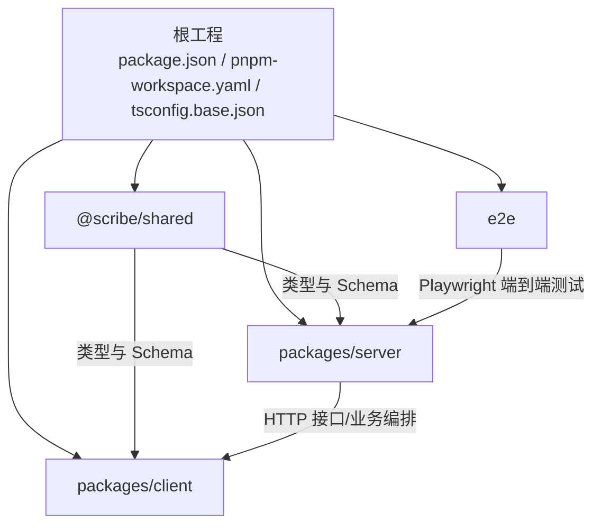
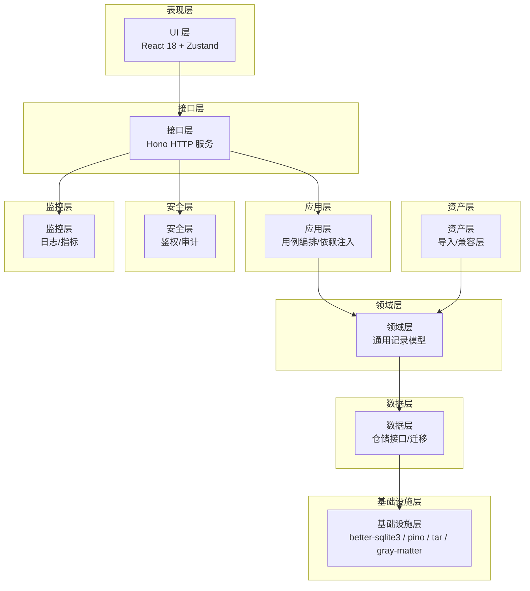
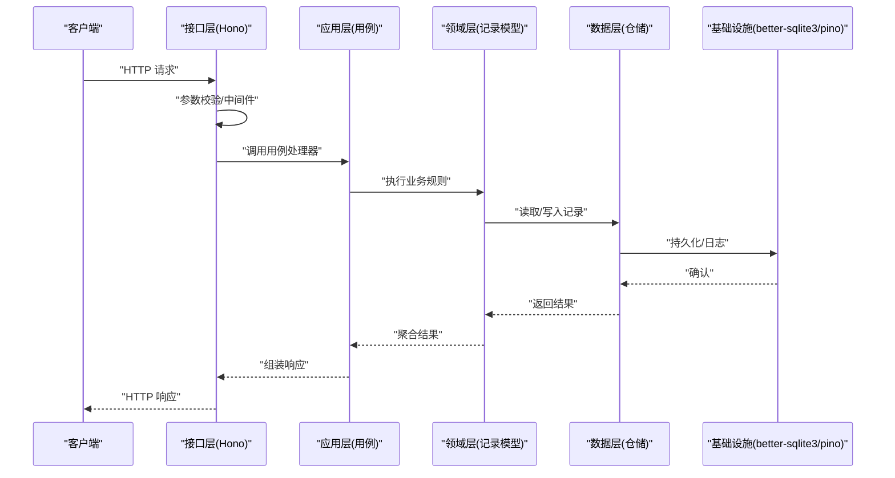
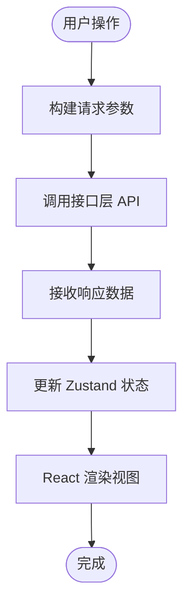
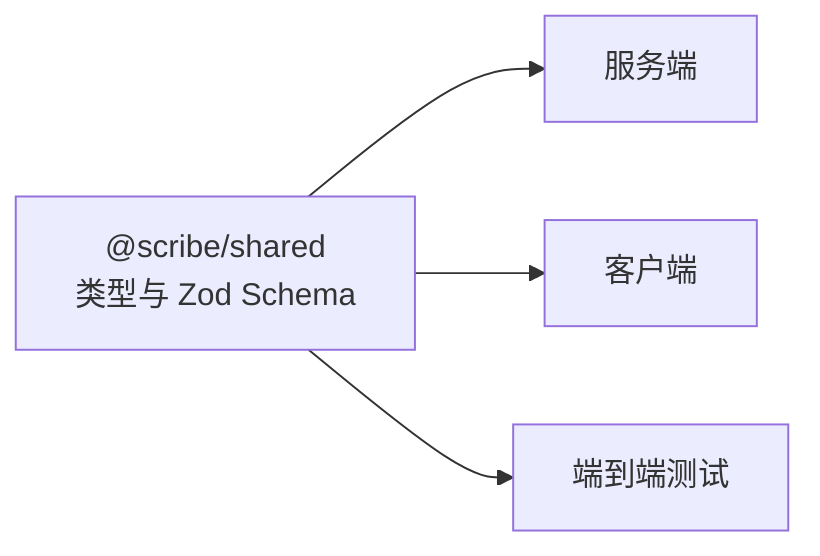
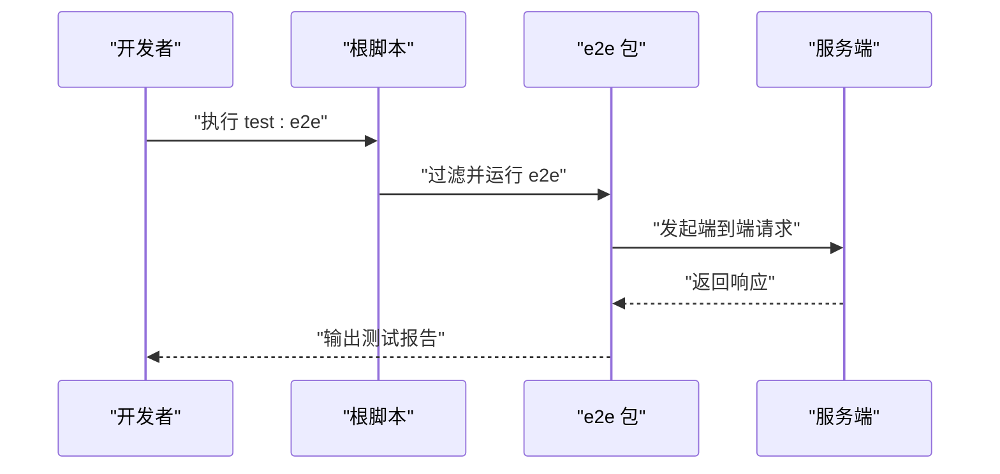
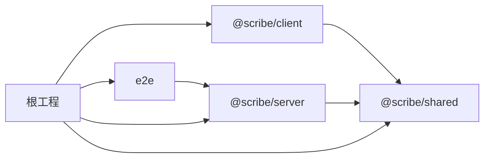

# 架构设计

<cite>
**本文引用的文件**
- [根 package.json](file://package.json)
- [pnpm 工作区配置](file://pnpm-workspace.yaml)
- [基础 TypeScript 配置](file://tsconfig.base.json)
- [根 .npmrc](file://.npmrc)
- [.gitignore](file://.gitignore)
- [实现说明](file://docs/_implementation-notes.md)
- [MVP 计划（超能力）](file://docs/superpowers/plans/2026-06-04-scribe-mvp.md)
- [通用记录架构（超能力）](file://docs/superpowers/plans/2026-06-15-generic-record-architecture.md)
- [终极产品目标（超能力）](file://docs/superpowers/specs/2026-06-17-scribe-ultimate-product-goal.md)
- [SillyTavern 导入设计（超能力）](file://docs/superpowers/specs/2026-06-16-sillytavern-import-design.md)
- [备份：MVP 设计（文档）](file://docs/_backups/20260604-162405/2026-06-04-scribe-mvp.md)
- [端到端测试配置](file://e2e/package.json)
- [端到端 Playwright 配置](file://e2e/playwright.config.ts)
- [共享包 package.json](file://packages/shared/package.json)
- [共享包 tsconfig.json](file://packages/shared/tsconfig.json)
- [服务端 package.json](file://packages/server/package.json)
- [服务端 tsconfig.json](file://packages/server/tsconfig.json)
- [客户端 package.json](file://packages/client/package.json)
- [客户端 tsconfig.json](file://packages/client/tsconfig.json)
</cite>

## 目录
1. [引言](#引言)
2. [项目结构](#项目结构)
3. [核心组件](#核心组件)
4. [架构总览](#架构总览)
5. [详细组件分析](#详细组件分析)
6. [依赖分析](#依赖分析)
7. [性能考虑](#性能考虑)
8. [故障排查指南](#故障排查指南)
9. [结论](#结论)
10. [附录](#附录)

## 引言
本文件面向 Scribe 项目的架构设计文档，聚焦于“八层架构”设计模式：资产层、领域层、应用层、接口层、基础设施层、数据层、安全层与监控层。文档基于仓库中的规划与实现线索，系统化阐述各层职责、交互关系、依赖注入模式在服务器端的应用、monorepo 结构优势与包管理策略、组件间依赖与数据流、系统边界与集成模式、跨层通信机制，并给出架构图与组件分解图。同时讨论可扩展性、性能优化与部署拓扑建议，解释技术栈选择与版本兼容性。

## 项目结构
Scribe 采用 monorepo 结构，使用 pnpm workspace 管理多包，TypeScript 基础配置统一收敛，根脚本统一协调开发、构建、测试与类型检查。工作区包含 server、client、shared 三个核心包，以及 e2e 端到端测试包。

**图表来源**
- [根 package.json:1-120](file://package.json#L1-L120)
- [pnpm 工作区配置:1-200](file://pnpm-workspace.yaml#L1-L200)
- [基础 TypeScript 配置:1-200](file://tsconfig.base.json#L1-L200)
- [共享包 package.json:1-200](file://packages/shared/package.json#L1-L200)
- [服务端 package.json:1-200](file://packages/server/package.json#L1-L200)
- [客户端 package.json:1-200](file://packages/client/package.json#L1-L200)
- [端到端测试配置:1-200](file://e2e/package.json#L1-L200)

**章节来源**
- [根 package.json:1-120](file://package.json#L1-L120)
- [pnpm 工作区配置:1-200](file://pnpm-workspace.yaml#L1-L200)
- [基础 TypeScript 配置:1-200](file://tsconfig.base.json#L1-L200)
- [实现说明:1-200](file://docs/_implementation-notes.md#L1-L200)
- [MVP 计划（超能力）:245-340](file://docs/superpowers/plans/2026-06-04-scribe-mvp.md#L245-L340)

## 核心组件
- 资产层（Asset Layer）
  - 定义：承载故事世界的基础资源，如角色、地点、物品、势力等。通过通用记录模型抽象，避免硬编码特定领域分类。
  - 关键点：导入 SillyTavern 资产时保留非支持字段元数据，确保兼容性与可编辑性；记录集合与项参与归档摘要、写作上下文与回溯。
  - 来源参考：[通用记录架构（超能力）:13-23](file://docs/superpowers/plans/2026-06-15-generic-record-architecture.md#L13-L23)、[SillyTavern 导入设计（超能力）:217-265](file://docs/superpowers/specs/2026-06-16-sillytavern-import-design.md#L217-L265)

- 领域层（Domain Layer）
  - 定义：封装业务规则与领域模型，强调“通用记录”而非特定主题分支；通过声明式身份字段与关系字段维护一致性。
  - 关键点：记录集合与关系由通用工具维护，本地代码仅校验集合名、身份键、字段角色与引用类型，不理解具体语义。
  - 来源参考：[通用记录架构（超能力）:13-23](file://docs/superpowers/plans/2026-06-15-generic-record-architecture.md#L13-L23)

- 应用层（Application Layer）
  - 定义：编排业务用例，协调领域对象与接口层，负责流程控制与跨实体协作。
  - 关键点：依赖注入风格组织（构造函数注入），便于单元测试与模拟；测试目录与源码目录一一对应。
  - 来源参考：[MVP 计划（超能力）:235-240](file://docs/superpowers/plans/2026-06-04-scribe-mvp.md#L235-L240)

- 接口层（Interface Layer）
  - 定义：对外暴露 API 与 UI 控制面，处理请求解析、参数校验与响应序列化。
  - 关键点：服务端使用 Hono 作为 HTTP 框架，客户端采用 React 18 + Suspense + Zustand；共享包提供类型与 Zod Schema。
  - 来源参考：[备份：MVP 设计（文档）:429-492](file://docs/_backups/20260604-162405/2026-06-04-scribe-mvp.md#L429-L492)、[MVP 计划（超能力）:235-240](file://docs/superpowers/plans/2026-06-04-scribe-mvp.md#L235-L240)

- 基础设施层（Infrastructure Layer）
  - 定义：提供运行时环境与平台能力，如数据库驱动、文件系统、网络与进程管理。
  - 关键点：服务端使用 better-sqlite3 与 tar、gray-matter 等库；日志使用 pino；构建产物输出至 dist。
  - 来源参考：[备份：MVP 设计（文档）:429-492](file://docs/_backups/20260604-162405/2026-06-04-scribe-mvp.md#L429-L492)

- 数据层（Data Layer）
  - 定义：持久化与检索数据，抽象存储访问接口，屏蔽底层实现差异。
  - 关键点：通过依赖注入注入仓储实例；迁移脚本与构建流程分离，便于演进。
  - 来源参考：[实现说明:120-130](file://docs/_implementation-notes.md#L120-L130)

- 安全层（Security Layer）
  - 定义：统一认证授权、密钥管理、访问控制与审计策略。
  - 关键点：未在当前仓库中出现具体实现细节，建议在接口层与应用层之间引入中间件或适配器以解耦。
  - 来源参考：[MVP 计划（超能力）:235-240](file://docs/superpowers/plans/2026-06-04-scribe-mvp.md#L235-L240)

- 监控层（Monitoring Layer）
  - 定义：指标采集、链路追踪、健康检查与告警。
  - 关键点：服务端使用 pino 日志；建议在接口层增加 OpenTelemetry 适配器与健康检查端点。
  - 来源参考：[备份：MVP 设计（文档）:429-492](file://docs/_backups/20260604-162405/2026-06-04-scribe-mvp.md#L429-L492)

**章节来源**
- [通用记录架构（超能力）:13-23](file://docs/superpowers/plans/2026-06-15-generic-record-architecture.md#L13-L23)
- [SillyTavern 导入设计（超能力）:217-265](file://docs/superpowers/specs/2026-06-16-sillytavern-import-design.md#L217-L265)
- [MVP 计划（超能力）:235-240](file://docs/superpowers/plans/2026-06-04-scribe-mvp.md#L235-L240)
- [备份：MVP 设计（文档）:429-492](file://docs/_backups/20260604-162405/2026-06-04-scribe-mvp.md#L429-L492)
- [实现说明:120-130](file://docs/_implementation-notes.md#L120-L130)

## 架构总览
下图展示八层架构在 Scribe 中的映射与交互关系，突出跨层通信与依赖方向。

**图表来源**
- [备份：MVP 设计（文档）:429-492](file://docs/_backups/20260604-162405/2026-06-04-scribe-mvp.md#L429-L492)
- [MVP 计划（超能力）:235-240](file://docs/superpowers/plans/2026-06-04-scribe-mvp.md#L235-L240)
- [通用记录架构（超能力）:13-23](file://docs/superpowers/plans/2026-06-15-generic-record-architecture.md#L13-L23)

## 详细组件分析

### 组件 A 分析：服务端 HTTP 与依赖注入
- 职责
  - 提供 HTTP 接口，使用 Hono 作为路由与中间件框架。
  - 通过构造函数注入仓储与编排器，便于测试与替换。
  - 使用 better-sqlite3 进行本地持久化，pino 输出结构化日志。
- 依赖关系
  - 依赖 shared 包提供的类型与 Zod Schema。
  - 依赖 @hono/node-server 提供 Node 服务器运行时。
- 关键流程
  - 请求进入接口层后，经参数校验与安全中间件，交由应用层用例处理，再调用领域层与数据层完成读写。

**图表来源**
- [备份：MVP 设计（文档）:429-492](file://docs/_backups/20260604-162405/2026-06-04-scribe-mvp.md#L429-L492)
- [MVP 计划（超能力）:235-240](file://docs/superpowers/plans/2026-06-04-scribe-mvp.md#L235-L240)

**章节来源**
- [服务端 package.json:1-200](file://packages/server/package.json#L1-L200)
- [服务端 tsconfig.json:1-200](file://packages/server/tsconfig.json#L1-L200)
- [实现说明:120-130](file://docs/_implementation-notes.md#L120-L130)

### 组件 B 分析：客户端 UI 与状态管理
- 职责
  - 使用 React 18 + Suspense 提升用户体验；状态管理采用 Zustand，避免 Redux 复杂度。
  - 共享包提供类型与 Schema，保证前后端一致。
- 依赖关系
  - 依赖 @scribe/shared 提供类型与校验。
  - 依赖 @vitejs/plugin-react 与 Vite 构建。
- 关键流程
  - UI 发起请求到接口层，接收数据后更新本地状态，渲染视图。

**图表来源**
- [MVP 计划（超能力）:235-240](file://docs/superpowers/plans/2026-06-04-scribe-mvp.md#L235-L240)
- [客户端 package.json:1-200](file://packages/client/package.json#L1-L200)
- [客户端 tsconfig.json:1-200](file://packages/client/tsconfig.json#L1-L200)

**章节来源**
- [客户端 package.json:1-200](file://packages/client/package.json#L1-L200)
- [客户端 tsconfig.json:1-200](file://packages/client/tsconfig.json#L1-L200)

### 组件 C 分析：共享包与类型/Schema
- 职责
  - 仅导出类型与 Zod Schema，不包含运行时逻辑，确保跨包复用与零副作用。
- 依赖关系
  - 依赖 zod 进行运行时校验。
- 关键流程
  - 服务端与客户端均从共享包导入类型与 Schema，统一校验与契约。

**图表来源**
- [共享包 package.json:1-200](file://packages/shared/package.json#L1-L200)
- [共享包 tsconfig.json:1-200](file://packages/shared/tsconfig.json#L1-L200)

**章节来源**
- [共享包 package.json:1-200](file://packages/shared/package.json#L1-L200)
- [共享包 tsconfig.json:1-200](file://packages/shared/tsconfig.json#L1-L200)

### 组件 D 分析：端到端测试与 Playwright
- 职责
  - 使用 Playwright 进行端到端测试，覆盖核心旅程与冒烟测试。
- 依赖关系
  - 通过根脚本按包过滤运行测试。
- 关键流程
  - 启动服务端，执行测试套件，断言 UI 行为与 API 响应。

**图表来源**
- [实现说明:20-30](file://docs/_implementation-notes.md#L20-L30)
- [端到端测试配置:1-200](file://e2e/package.json#L1-L200)
- [端到端 Playwright 配置:1-200](file://e2e/playwright.config.ts#L1-L200)

**章节来源**
- [实现说明:20-30](file://docs/_implementation-notes.md#L20-L30)
- [端到端测试配置:1-200](file://e2e/package.json#L1-L200)
- [端到端 Playwright 配置:1-200](file://e2e/playwright.config.ts#L1-L200)

## 依赖分析
- monorepo 与包管理
  - pnpm workspace 统一管理 packages 与 e2e；根脚本并行开发、统一构建与测试。
  - tsconfig.base.json 统一编译选项，避免重复配置。
- 依赖注入模式
  - 服务端通过构造函数注入仓储与编排器，提升可测试性与可替换性。
- 跨层依赖
  - 接口层依赖应用层；应用层依赖领域层；领域层依赖数据层；数据层依赖基础设施层。
  - 资产层通过导入兼容层与领域层交互，不直接依赖应用层。

**图表来源**
- [pnpm 工作区配置:1-200](file://pnpm-workspace.yaml#L1-L200)
- [根 package.json:1-120](file://package.json#L1-L120)
- [基础 TypeScript 配置:1-200](file://tsconfig.base.json#L1-L200)

**章节来源**
- [pnpm 工作区配置:1-200](file://pnpm-workspace.yaml#L1-L200)
- [根 package.json:1-120](file://package.json#L1-L120)
- [基础 TypeScript 配置:1-200](file://tsconfig.base.json#L1-L200)
- [MVP 计划（超能力）:235-240](file://docs/superpowers/plans/2026-06-04-scribe-mvp.md#L235-L240)

## 性能考虑
- 构建与打包
  - 使用 ESNext 模块与 Bundler 解析器，结合 Vite 与 tsc 并行优化开发体验。
- 数据访问
  - better-sqlite3 适合本地场景；建议对热点查询建立索引，限制一次性加载量。
- 日志与可观测性
  - pino 结构化日志便于下游处理；建议引入采样与异步写入，避免阻塞请求。
- 并发与缓存
  - 在应用层引入读写分离与缓存层，减少数据库压力；对频繁变更的数据采用短 TTL。
- 端到端测试
  - 使用 Playwright 并行执行，缩短反馈周期；对慢接口进行隔离与降级。

[本节为通用指导，无需列出章节来源]

## 故障排查指南
- 端到端测试过滤
  - e2e 包名称需为 scribe-e2e，以便根脚本按包名过滤执行。
- 类型检查失败
  - tsconfig.base.json 限定 ES2022，若缺少 DOM 相关类型，需在子配置中补充。
- 构建与迁移
  - 构建脚本包含迁移拷贝步骤，确保迁移文件随构建发布。
- 日志与错误
  - 服务端使用 pino 输出结构化日志，定位问题时优先查看请求 ID 与时间戳。

**章节来源**
- [实现说明:20-30](file://docs/_implementation-notes.md#L20-L30)
- [实现说明:120-130](file://docs/_implementation-notes.md#L120-L130)
- [基础 TypeScript 配置:1-200](file://tsconfig.base.json#L1-L200)

## 结论
Scribe 的八层架构以“通用记录模型”为核心，通过清晰的分层与依赖注入模式实现高内聚低耦合。monorepo 与 pnpm 工作区提供了统一的开发与构建体验，共享包确保前后端契约一致。未来可在安全层与监控层进一步增强，以满足生产级需求。整体设计兼顾可扩展性与可维护性，为后续功能演进奠定坚实基础。

[本节为总结，无需列出章节来源]

## 附录
- 技术栈与版本兼容性
  - Node.js 版本要求：>=20.0.0
  - TypeScript 版本：^5.6.0
  - 包管理器：pnpm@9.0.0
  - 模块解析：Bundler
  - 严格模式：noUncheckedIndexedAccess 开启
- 系统边界与集成
  - 服务端边界：HTTP 接口 + 本地存储；客户端边界：UI 控制面 + 状态管理；共享包边界：纯类型与 Schema。
- 部署拓扑建议
  - 单机部署：服务端 + SQLite；多机部署：服务端集群 + 共享存储或主从复制；可观测性：集中式日志与指标收集。

**章节来源**
- [根 package.json:1-120](file://package.json#L1-L120)
- [基础 TypeScript 配置:1-200](file://tsconfig.base.json#L1-L200)
- [MVP 计划（超能力）:270-272](file://docs/superpowers/plans/2026-06-04-scribe-mvp.md#L270-L272)