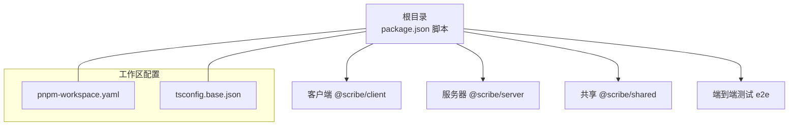
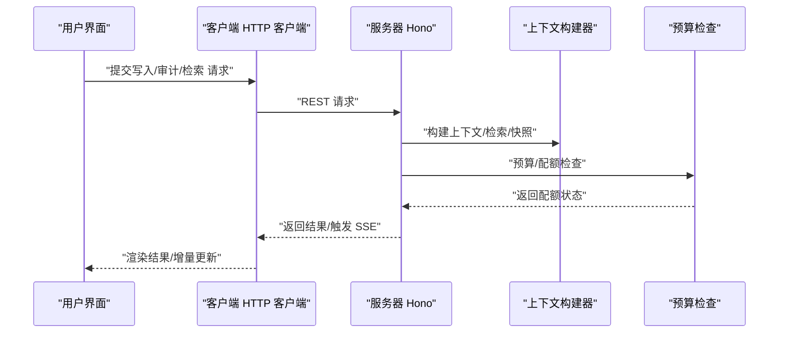
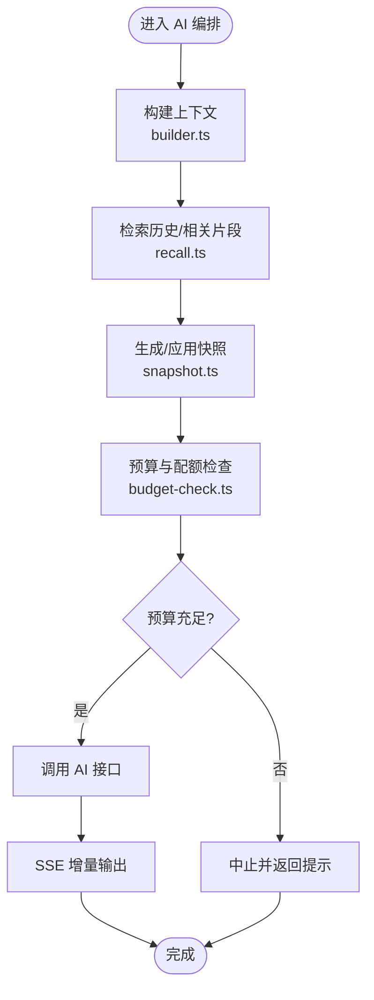
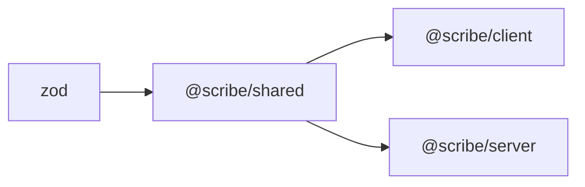

# 组件交互与依赖关系

<cite>
**本文档引用的文件**
- [package.json](file://package.json)
- [pnpm-workspace.yaml](file://pnpm-workspace.yaml)
- [tsconfig.base.json](file://tsconfig.base.json)
- [README.md](file://README.md)
- [packages/client/package.json](file://packages/client/package.json)
- [packages/server/package.json](file://packages/server/package.json)
- [packages/shared/package.json](file://packages/shared/package.json)
- [packages/client/src/api/client.ts](file://packages/client/src/api/client.ts)
- [packages/client/src/api/streaming.ts](file://packages/client/src/api/streaming.ts)
- [packages/server/src/ai/context-builder/builder.ts](file://packages/server/src/ai/context-builder/builder.ts)
- [packages/server/src/ai/context-builder/book-context.ts](file://packages/server/src/ai/context-builder/book-context.ts)
- [packages/server/src/ai/context-builder/recall.ts](file://packages/server/src/ai/context-builder/recall.ts)
- [packages/server/src/ai/context-builder/snapshot.ts](file://packages/server/src/ai/context-builder/snapshot.ts)
- [packages/server/src/ai/budget-check.ts](file://packages/server/src/ai/budget-check.ts)
- [packages/server/src/ai/demo-seeds/pet-capture-demo.ts](file://packages/server/src/ai/demo-seeds/pet-capture-demo.ts)
</cite>

## 目录
1. [引言](#引言)
2. [项目结构](#项目结构)
3. [核心组件](#核心组件)
4. [架构总览](#架构总览)
5. [详细组件分析](#详细组件分析)
6. [依赖分析](#依赖分析)
7. [性能考虑](#性能考虑)
8. [故障排除指南](#故障排除指南)
9. [结论](#结论)
10. [附录](#附录)

## 引言
本文件系统性梳理 Scribe 项目的组件交互与依赖关系，聚焦客户端（@scribe/client）、服务器端（@scribe/server）与共享包（@scribe/shared）之间的依赖链路、通信模式与接口契约。文档同时阐释 monorepo 包管理策略、版本同步机制、循环依赖规避与模块边界设计，并给出组件解耦与可替换性的设计原则与最佳实践。

## 项目结构
Scribe 采用 pnpm workspace 的 monorepo 结构，通过统一的 TypeScript 基础配置与脚本编排，实现多包并行开发与构建。顶层 package.json 提供统一的开发、构建、测试与类型检查脚本；pnpm-workspace.yaml 将 packages/* 与 e2e 标记为工作区包；tsconfig.base.json 统一编译选项，确保各包在一致的类型系统下协同。



图表来源
- [package.json:1-21](file://package.json#L1-L21)
- [pnpm-workspace.yaml:1-4](file://pnpm-workspace.yaml#L1-L4)
- [tsconfig.base.json:1-16](file://tsconfig.base.json#L1-L16)

章节来源
- [package.json:1-21](file://package.json#L1-L21)
- [pnpm-workspace.yaml:1-4](file://pnpm-workspace.yaml#L1-L4)
- [tsconfig.base.json:1-16](file://tsconfig.base.json#L1-L16)
- [README.md:44-55](file://README.md#L44-L55)

## 核心组件
- 客户端（@scribe/client）
  - 技术栈：Vite + React，使用 Zustand 状态管理、React Router 导航、Tiptap Markdown 编辑器生态。
  - 关键依赖：@scribe/shared（共享类型与协议）、@tiptap/*、marked、turndown、diff 等。
  - 作用：提供三栏写作工作台界面，封装与服务器的 API 交互与 SSE 流式响应处理。
- 服务器（@scribe/server）
  - 技术栈：Hono Web 框架 + Node 服务器，SQLite 存储，AI SDK（OpenAI 兼容），Pino 日志，tar 备份。
  - 关键依赖：@scribe/shared（共享类型与协议）、hono、better-sqlite3、ai、@ai-sdk/openai-compatible、zod、pino、tar、gray-matter。
  - 作用：承载业务逻辑（AI 编排、质量门禁、上下文构建、快照与回滚等），对外提供 REST/SSE 接口。
- 共享（@scribe/shared）
  - 技术栈：纯 TypeScript/JS，以 zod 进行运行时校验。
  - 关键依赖：zod。
  - 作用：定义跨端的数据模型、事件协议、Slash 命令表、Schema 等，作为客户端与服务器的契约基础。

章节来源
- [packages/client/package.json:1-39](file://packages/client/package.json#L1-L39)
- [packages/server/package.json:1-33](file://packages/server/package.json#L1-L33)
- [packages/shared/package.json:1-19](file://packages/shared/package.json#L1-L19)

## 架构总览
客户端与服务器通过 REST API 与 SSE 实现双向通信。共享包提供稳定的接口契约（类型与 Schema）。服务器内部以“上下文构建器”为核心模块，负责聚合书籍上下文、检索、预算控制与快照管理，形成清晰的职责边界。

```mermaid
graph TB
subgraph "客户端"
UI["@scribe/client<br/>React/Vite"]
API["HTTP 客户端<br/>packages/client/src/api/client.ts"]
SSE["SSE 流处理<br/>packages/client/src/api/streaming.ts"]
end
subgraph "共享层"
SH["@scribe/shared<br/>类型/Schema/事件"]
end
subgraph "服务器"
HONO["Hono 应用"]
CTX["上下文构建器<br/>builder.ts/recall.ts/snapshot.ts"]
BUD["预算检查<br/>budget-check.ts"]
DEMO["演示种子<br/>pet-capture-demo.ts"]
end
UI --> API
API --> HONO
HONO --> CTX
HONO --> BUD
CTX --> SH
BUD --> SH
DEMO --> SH
API <- --> SSE
```

图表来源
- [packages/client/src/api/client.ts](file://packages/client/src/api/client.ts)
- [packages/client/src/api/streaming.ts](file://packages/client/src/api/streaming.ts)
- [packages/server/src/ai/context-builder/builder.ts](file://packages/server/src/ai/context-builder/builder.ts)
- [packages/server/src/ai/context-builder/recall.ts](file://packages/server/src/ai/context-builder/recall.ts)
- [packages/server/src/ai/context-builder/snapshot.ts](file://packages/server/src/ai/context-builder/snapshot.ts)
- [packages/server/src/ai/budget-check.ts](file://packages/server/src/ai/budget-check.ts)
- [packages/server/src/ai/demo-seeds/pet-capture-demo.ts](file://packages/server/src/ai/demo-seeds/pet-capture-demo.ts)

## 详细组件分析

### 客户端 API 与流式处理
- HTTP 客户端封装
  - 负责向服务器发起请求，统一处理错误与重试策略。
  - 与共享包协作，确保请求/响应体符合共享 Schema。
- SSE 流式处理
  - 建立与服务器的长连接，接收增量输出，驱动编辑器实时更新。
  - 与 Markdown 编辑桥接模块配合，实现所见即所得的渲染与差异对比。



图表来源
- [packages/client/src/api/client.ts](file://packages/client/src/api/client.ts)
- [packages/client/src/api/streaming.ts](file://packages/client/src/api/streaming.ts)
- [packages/server/src/ai/context-builder/builder.ts](file://packages/server/src/ai/context-builder/builder.ts)
- [packages/server/src/ai/budget-check.ts](file://packages/server/src/ai/budget-check.ts)

章节来源
- [packages/client/src/api/client.ts](file://packages/client/src/api/client.ts)
- [packages/client/src/api/streaming.ts](file://packages/client/src/api/streaming.ts)

### 服务器端上下文构建与质量门禁
- 上下文构建器
  - 聚合书籍上下文、检索历史、快照信息，形成稳定的输入给 AI 编排模块。
- 预算检查
  - 控制成本与配额，防止过度调用，保障稳定性与可预测性。
- 演示种子
  - 提供可复现的示例场景，便于调试与回归测试。



图表来源
- [packages/server/src/ai/context-builder/builder.ts](file://packages/server/src/ai/context-builder/builder.ts)
- [packages/server/src/ai/context-builder/recall.ts](file://packages/server/src/ai/context-builder/recall.ts)
- [packages/server/src/ai/context-builder/snapshot.ts](file://packages/server/src/ai/context-builder/snapshot.ts)
- [packages/server/src/ai/budget-check.ts](file://packages/server/src/ai/budget-check.ts)

章节来源
- [packages/server/src/ai/context-builder/builder.ts](file://packages/server/src/ai/context-builder/builder.ts)
- [packages/server/src/ai/context-builder/recall.ts](file://packages/server/src/ai/context-builder/recall.ts)
- [packages/server/src/ai/context-builder/snapshot.ts](file://packages/server/src/ai/context-builder/snapshot.ts)
- [packages/server/src/ai/budget-check.ts](file://packages/server/src/ai/budget-check.ts)

### 共享包的契约与数据模型
- 类型与 Schema
  - 使用 zod 定义跨端一致的数据结构，确保客户端与服务器对同一数据模型达成共识。
- 事件与命令
  - 定义 SSE 事件格式与 Slash 命令表，保证前后端通信协议稳定。
- 版本与变更策略
  - 通过语义化版本管理，严格控制破坏性变更；在 monorepo 内部通过 workspace:* 锁定版本，减少漂移。

章节来源
- [packages/shared/package.json:1-19](file://packages/shared/package.json#L1-L19)

## 依赖分析
- 包级依赖关系
  - @scribe/client 依赖 @scribe/shared，用于共享类型与协议。
  - @scribe/server 依赖 @scribe/shared，用于共享类型与协议。
  - @scribe/shared 依赖 zod，用于运行时校验。
- 工作区与版本同步
  - pnpm workspace:* 使各包间版本保持一致，避免跨包版本漂移。
  - 顶层脚本统一触发多包并行开发与构建，提升效率。
- 循环依赖规避
  - 通过共享包集中定义契约，避免客户端与服务器直接互相引用。
  - 服务器内部模块按职责拆分（上下文构建、预算检查、快照等），降低耦合度。
- 模块边界设计
  - 客户端仅暴露 API 与 SSE 接口；服务器仅暴露 REST/SSE 端点；共享包不包含业务逻辑，仅承载契约。



图表来源
- [packages/client/package.json:12-24](file://packages/client/package.json#L12-L24)
- [packages/server/package.json:13-24](file://packages/server/package.json#L13-L24)
- [packages/shared/package.json:11-13](file://packages/shared/package.json#L11-L13)

章节来源
- [packages/client/package.json:1-39](file://packages/client/package.json#L1-L39)
- [packages/server/package.json:1-33](file://packages/server/package.json#L1-L33)
- [packages/shared/package.json:1-19](file://packages/shared/package.json#L1-L19)

## 性能考虑
- 并行构建与开发
  - 顶层脚本支持多包并行执行，缩短迭代周期。
- 服务器侧优化
  - SQLite 本地存储与 tar 快照结合，平衡读写性能与可靠性。
  - 预算检查前置，避免无效调用导致的资源浪费。
- 客户端体验
  - SSE 增量输出与编辑器实时渲染，降低等待时间。
  - Markdown/Turndown 差异对比，提升编辑效率。

## 故障排除指南
- 端到端测试
  - 使用 e2e 包与 Playwright 进行端到端验证，自动启动真实服务器进行集成测试。
- 单元与类型检查
  - 各包独立提供 test/typecheck 脚本，结合根目录统一类型检查，快速定位问题。
- 日志与可观测性
  - 服务器使用 Pino 输出结构化日志，便于排查请求链路与异常。

章节来源
- [README.md:36-42](file://README.md#L36-L42)

## 结论
Scribe 通过清晰的 monorepo 分层与共享契约，实现了客户端、服务器与共享包之间的高内聚、低耦合。客户端专注界面与交互，服务器专注业务与数据，共享包承载稳定协议。该设计提升了可维护性、可测试性与可扩展性，为后续功能演进奠定了坚实基础。

## 附录

### 包管理策略与版本同步
- 工作区声明
  - 在 pnpm-workspace.yaml 中声明 packages/* 与 e2e，统一由 pnpm 管理依赖与脚本。
- 依赖锁定
  - 使用 workspace:* 锁定共享包版本，避免跨包版本漂移。
- 构建与测试
  - 顶层脚本统一触发多包并行构建与测试，确保一致性。

章节来源
- [pnpm-workspace.yaml:1-4](file://pnpm-workspace.yaml#L1-L4)
- [package.json:6-12](file://package.json#L6-L12)

### 依赖注入与测试友好性（概念性说明）
- 依赖注入模式建议
  - 将外部服务（如数据库、AI SDK、文件系统）抽象为可注入的依赖，便于在测试环境中替换为内存实现或模拟对象。
- 测试友好性
  - 通过接口契约与工厂函数，隔离具体实现细节，提高单元测试与集成测试的可控性与稳定性。

### 组件解耦与可替换性设计原则
- 明确边界
  - 客户端/服务器/共享包边界清晰，职责单一。
- 契约先行
  - 所有跨端交互基于共享包的类型与 Schema，减少实现偏差。
- 可插拔扩展
  - 将算法与存储抽象为接口，允许在不改变上层调用的情况下替换实现。