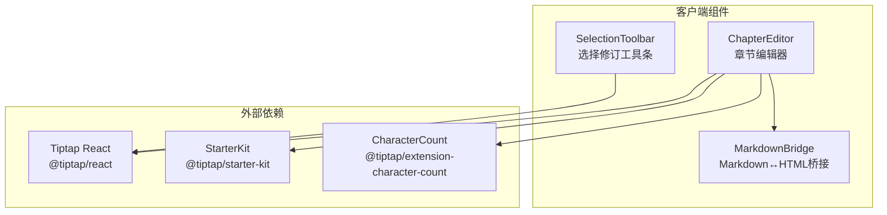
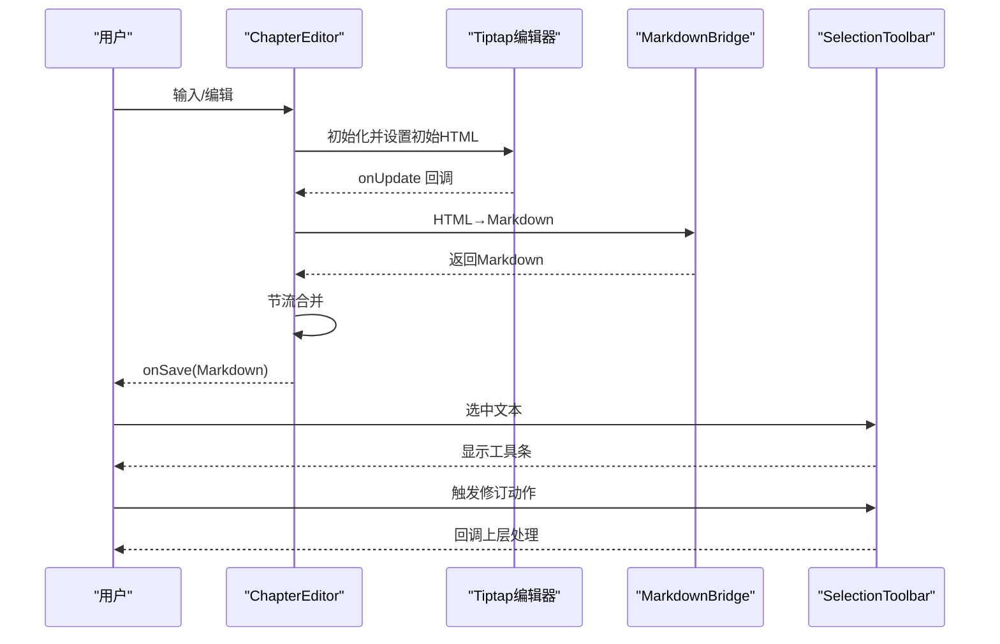
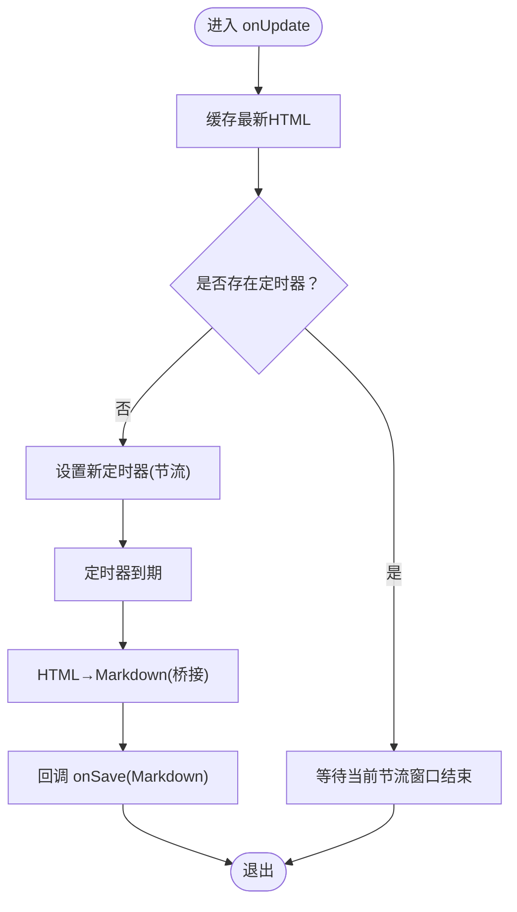
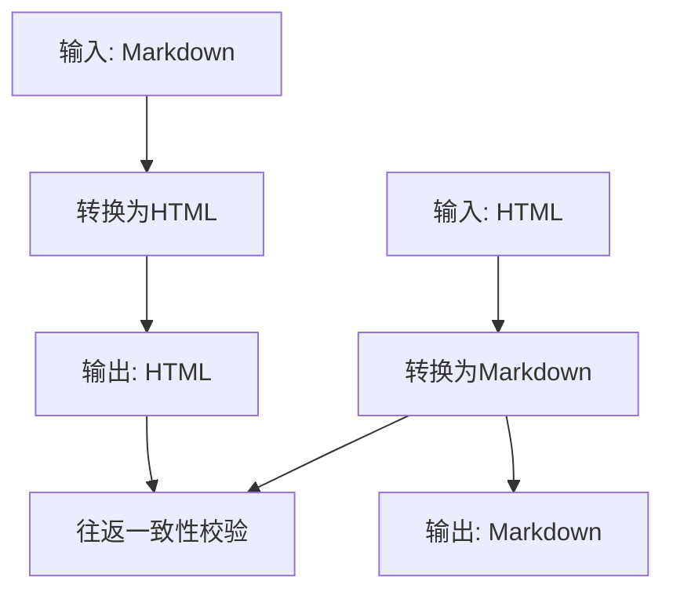
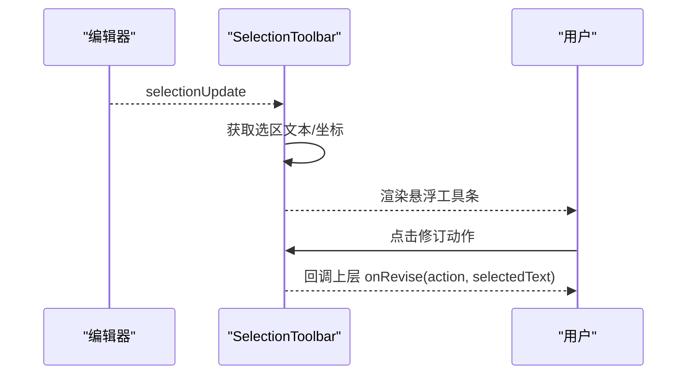
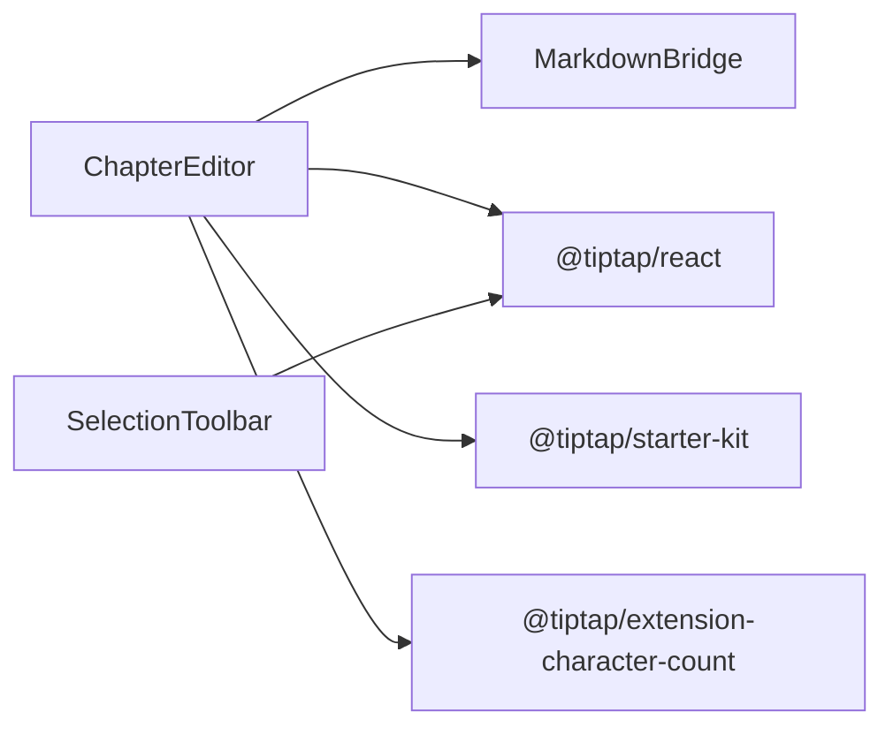

# Markdown编辑器

<cite>
**本文引用的文件**
- [packages/client/src/components/editor/chapter-editor.tsx](file://packages/client/src/components/editor/chapter-editor.tsx)
- [packages/client/src/components/editor/selection-toolbar.tsx](file://packages/client/src/components/editor/selection-toolbar.tsx)
- [packages/client/src/components/editor/markdown-bridge.ts](file://packages/client/src/components/editor/markdown-bridge.ts)
- [packages/client/tests/components/chapter-editor.test.tsx](file://packages/client/tests/components/chapter-editor.test.tsx)
- [packages/client/tests/components/markdown-bridge.test.ts](file://packages/client/tests/components/markdown-bridge.test.ts)
- [packages/client/tests/components/selection-revise.test.tsx](file://packages/client/tests/components/selection-revise.test.tsx)
</cite>

## 目录
1. [简介](#简介)
2. [项目结构](#项目结构)
3. [核心组件](#核心组件)
4. [架构总览](#架构总览)
5. [组件详解](#组件详解)
6. [依赖关系分析](#依赖关系分析)
7. [性能考量](#性能考量)
8. [故障排查指南](#故障排查指南)
9. [结论](#结论)
10. [附录](#附录)

## 简介
本文件面向Scribe的Markdown编辑器技术文档，聚焦于“Markdown桥接组件”的工作机制与实现细节，涵盖编辑器初始化、内容同步与状态管理；实时编辑能力（光标位置同步、撤销重做机制与内容验证）；以及编辑器与创作工作区的集成方式（数据绑定、事件传递与UI更新）。同时提供配置选项、插件扩展与自定义主题建议，并总结性能优化、内存管理与用户体验改进的实践。

## 项目结构
本仓库采用多包结构（packages），Markdown编辑器位于客户端包中，核心文件集中在以下路径：
- 编辑器主组件：ChapterEditor（章节级编辑器）
- 桥接层：markdown-bridge（Markdown与HTML互转）
- 选择修订工具条：SelectionToolbar（基于选区的AI修订入口）
- 对应单元测试覆盖上述组件的行为与边界条件

图表来源
- [packages/client/src/components/editor/chapter-editor.tsx:1-95](file://packages/client/src/components/editor/chapter-editor.tsx#L1-L95)
- [packages/client/src/components/editor/selection-toolbar.tsx:1-101](file://packages/client/src/components/editor/selection-toolbar.tsx#L1-L101)
- [packages/client/src/components/editor/markdown-bridge.ts](file://packages/client/src/components/editor/markdown-bridge.ts)

章节来源
- [packages/client/src/components/editor/chapter-editor.tsx:1-95](file://packages/client/src/components/editor/chapter-editor.tsx#L1-L95)
- [packages/client/src/components/editor/selection-toolbar.tsx:1-101](file://packages/client/src/components/editor/selection-toolbar.tsx#L1-L101)

## 核心组件
- 章节编辑器（ChapterEditor）
  - 基于Tiptap React初始化编辑器实例，加载Markdown内容为HTML以渲染，监听更新事件并通过节流策略将最新HTML转换回Markdown并回调上层保存。
  - 提供字符计数展示与卸载时的最终保存保障。
- Markdown桥接（markdown-bridge）
  - 提供Markdown与HTML双向转换能力，保证往返一致性与空输入安全。
- 选择修订工具条（SelectionToolbar）
  - 基于编辑器选区事件动态显示，提供预设修订动作与自定义指令入口，并计算悬浮按钮位置。

章节来源
- [packages/client/src/components/editor/chapter-editor.tsx:23-95](file://packages/client/src/components/editor/chapter-editor.tsx#L23-L95)
- [packages/client/src/components/editor/markdown-bridge.ts](file://packages/client/src/components/editor/markdown-bridge.ts)
- [packages/client/src/components/editor/selection-toolbar.tsx:18-101](file://packages/client/src/components/editor/selection-toolbar.tsx#L18-L101)

## 架构总览
编辑器整体采用“桥接层+编辑器实例+工具条”的分层设计：
- 桥接层负责内容格式转换，确保编辑器内部以HTML呈现，对外暴露Markdown。
- 编辑器实例负责渲染、事件与状态管理（含字符统计）。
- 工具条基于选区事件提供上下文操作入口。

图表来源
- [packages/client/src/components/editor/chapter-editor.tsx:32-45](file://packages/client/src/components/editor/chapter-editor.tsx#L32-L45)
- [packages/client/src/components/editor/selection-toolbar.tsx:18-88](file://packages/client/src/components/editor/selection-toolbar.tsx#L18-L88)
- [packages/client/src/components/editor/markdown-bridge.ts](file://packages/client/src/components/editor/markdown-bridge.ts)

## 组件详解

### 章节编辑器（ChapterEditor）
- 初始化流程
  - 将传入的Markdown内容通过桥接层转换为HTML，作为编辑器初始内容。
  - 注册编辑器扩展：StarterKit（基础块/行内元素支持）、CharacterCount（字符统计）。
- 内容同步与状态管理
  - 监听编辑器更新事件，缓存最新HTML到引用变量。
  - 使用定时器实现节流（默认1500ms），在节流窗口结束后统一转换为Markdown并回调上层保存。
  - 组件卸载时清理定时器并执行最后一次保存，避免丢失变更。
  - 通过编辑器存储访问字符计数，用于UI展示。
- 事件与生命周期
  - 提供onEditorReady钩子，便于测试或外部获取编辑器实例。
- 关键行为验证
  - 单元测试覆盖：节流触发时机、多次编辑合并保存、卸载时最终保存等。

图表来源
- [packages/client/src/components/editor/chapter-editor.tsx:35-44](file://packages/client/src/components/editor/chapter-editor.tsx#L35-L44)

章节来源
- [packages/client/src/components/editor/chapter-editor.tsx:23-95](file://packages/client/src/components/editor/chapter-editor.tsx#L23-L95)
- [packages/client/tests/components/chapter-editor.test.tsx:39-67](file://packages/client/tests/components/chapter-editor.test.tsx#L39-L67)

### Markdown桥接（markdown-bridge）
- 功能职责
  - 提供Markdown与HTML之间的双向转换，确保往返一致性与空输入安全。
- 行为验证
  - 单元测试覆盖：标题/段落/粗体/列表等常见Markdown元素的转换与往返校验，以及空字符串安全。

图表来源
- [packages/client/src/components/editor/markdown-bridge.ts](file://packages/client/src/components/editor/markdown-bridge.ts)
- [packages/client/tests/components/markdown-bridge.test.ts:6-31](file://packages/client/tests/components/markdown-bridge.test.ts#L6-L31)

章节来源
- [packages/client/src/components/editor/markdown-bridge.ts](file://packages/client/src/components/editor/markdown-bridge.ts)
- [packages/client/tests/components/markdown-bridge.test.ts:1-32](file://packages/client/tests/components/markdown-bridge.test.ts#L1-L32)

### 选择修订工具条（SelectionToolbar）
- 选区事件驱动
  - 订阅编辑器的选区更新事件，当存在非空且非空白的选区时，计算坐标并显示悬浮工具条。
- 动作与指令映射
  - 提供“改写”“简化”“增强情绪”三个预设动作，以及“自定义指令”入口。
  - 将动作映射为中文指令提示，便于AI服务理解。
- UI与交互
  - 使用固定定位与阴影样式，按钮尺寸与间距适配移动端与桌面端场景。

图表来源
- [packages/client/src/components/editor/selection-toolbar.tsx:18-88](file://packages/client/src/components/editor/selection-toolbar.tsx#L18-L88)

章节来源
- [packages/client/src/components/editor/selection-toolbar.tsx:18-101](file://packages/client/src/components/editor/selection-toolbar.tsx#L18-L101)
- [packages/client/tests/components/selection-revise.test.tsx:48-64](file://packages/client/tests/components/selection-revise.test.tsx#L48-L64)

## 依赖关系分析
- 组件耦合
  - ChapterEditor依赖markdown-bridge进行内容格式转换；依赖Tiptap生态完成渲染与事件；依赖CharacterCount扩展提供字符统计。
  - SelectionToolbar依赖编辑器实例的选区事件与坐标查询，独立于具体内容格式。
- 外部依赖
  - @tiptap/react：提供useEditor与EditorContent等能力。
  - @tiptap/starter-kit：提供基础块级/行内节点与命令。
  - @tiptap/extension-character-count：提供字符统计存储。
- 潜在风险
  - 选区坐标在某些测试环境可能不可用，已通过兜底逻辑避免异常。
  - 节流窗口内的多次编辑仅触发一次保存，需注意上层对“即时可见性”的期望。

图表来源
- [packages/client/src/components/editor/chapter-editor.tsx:1-6](file://packages/client/src/components/editor/chapter-editor.tsx#L1-L6)
- [packages/client/src/components/editor/selection-toolbar.tsx:1-3](file://packages/client/src/components/editor/selection-toolbar.tsx#L1-L3)

章节来源
- [packages/client/src/components/editor/chapter-editor.tsx:1-6](file://packages/client/src/components/editor/chapter-editor.tsx#L1-L6)
- [packages/client/src/components/editor/selection-toolbar.tsx:1-3](file://packages/client/src/components/editor/selection-toolbar.tsx#L1-L3)

## 性能考量
- 节流策略
  - 默认1500ms节流窗口，减少频繁保存与AI调用开销；测试场景可降低窗口以验证行为。
- 内存管理
  - 定时器引用与回调引用均使用ref，避免闭包捕获导致的内存泄漏；组件卸载时主动清理定时器并落盘最后一次变更。
- 渲染与计算
  - 初始内容转换为HTML后再渲染，避免直接渲染Markdown带来的解析成本；字符统计来自编辑器存储，避免重复计算。
- 用户体验
  - 选区工具条仅在有效选区出现，减少UI干扰；按钮尺寸与阴影提升可触达性与辨识度。

章节来源
- [packages/client/src/components/editor/chapter-editor.tsx:24-58](file://packages/client/src/components/editor/chapter-editor.tsx#L24-L58)
- [packages/client/tests/components/chapter-editor.test.tsx:52-67](file://packages/client/tests/components/chapter-editor.test.tsx#L52-L67)

## 故障排查指南
- 问题：选区工具条不显示
  - 排查点：是否为空选区、选区文本是否为空、坐标查询是否可用（测试环境可能不可用）。
  - 参考实现：选区更新事件处理与坐标计算。
- 问题：保存未触发或触发过早/过晚
  - 排查点：节流窗口大小、onUpdate回调频率、定时器清理逻辑。
  - 参考实现：节流定时器设置与卸载时落盘。
- 问题：往返转换结果不一致
  - 排查点：特殊Markdown语法、空字符串输入、HTML/Markdown解析差异。
  - 参考实现：桥接层与测试用例。

章节来源
- [packages/client/src/components/editor/selection-toolbar.tsx:24-48](file://packages/client/src/components/editor/selection-toolbar.tsx#L24-L48)
- [packages/client/src/components/editor/chapter-editor.tsx:35-58](file://packages/client/src/components/editor/chapter-editor.tsx#L35-L58)
- [packages/client/tests/components/markdown-bridge.test.ts:19-26](file://packages/client/tests/components/markdown-bridge.test.ts#L19-L26)

## 结论
Scribe的Markdown编辑器通过“桥接层+编辑器实例+工具条”的清晰分层，实现了从Markdown到HTML的高效渲染与保存、从HTML到Markdown的可靠转换，配合节流策略与字符统计，兼顾了性能与用户体验。选区工具条进一步增强了上下文操作能力。后续可在插件扩展、主题定制与撤销重做机制方面继续完善，以满足更复杂的创作需求。

## 附录

### 配置选项与扩展建议
- 编辑器配置
  - 节流间隔：通过属性控制，默认1500ms，测试可调小。
  - 编辑器扩展：可按需增减扩展（如链接、图片、表格等），注意与StarterKit的兼容性。
- 主题与样式
  - 建议通过CSS变量或主题Provider注入全局样式，确保工具条、编辑器区域与字符计数的一致性。
- 插件扩展
  - 可引入更多Tiptap扩展（如粘贴处理、自动补全、语法高亮等），并在桥接层保持Markdown↔HTML的稳定性。
- 撤销重做机制
  - 当前未内置撤销栈；建议结合Tiptap的history扩展或自建轻量栈，记录关键快照以支持撤销/重做。
- 内容验证
  - 建议在onSave前增加简单验证（如长度阈值、禁止内容清单），并在桥接层保留关键标记位以便回滚。