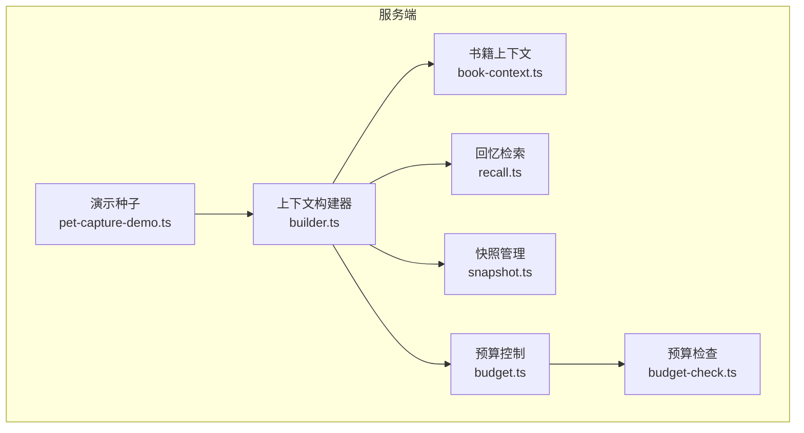
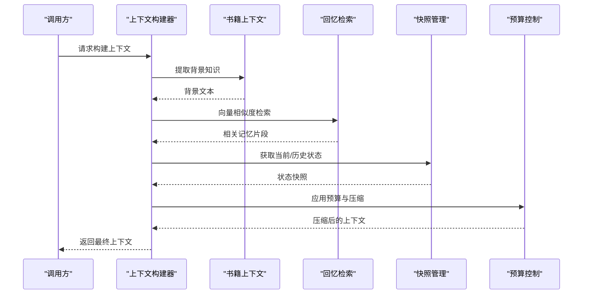
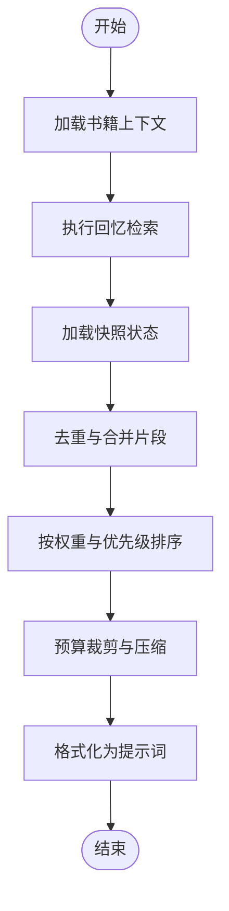
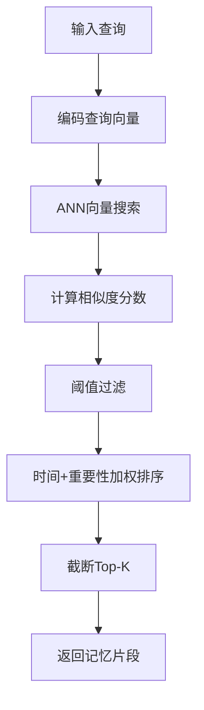
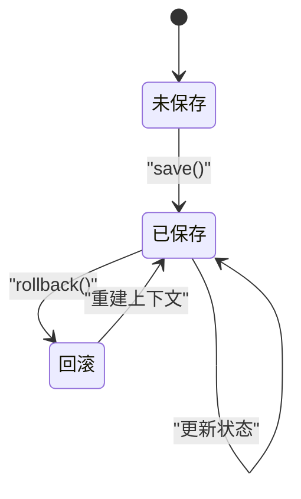
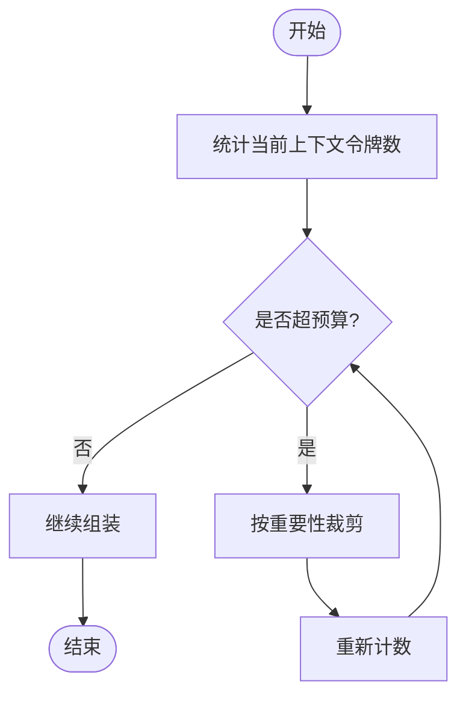
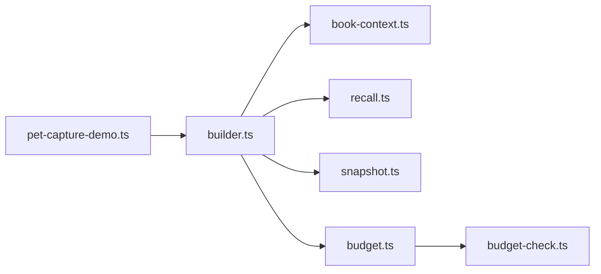

# 上下文管理

<cite>
**本文引用的文件**
- [packages/server/src/ai/context-builder/builder.ts](file://packages/server/src/ai/context-builder/builder.ts)
- [packages/server/src/ai/context-builder/book-context.ts](file://packages/server/src/ai/context-builder/book-context.ts)
- [packages/server/src/ai/context-builder/recall.ts](file://packages/server/src/ai/context-builder/recall.ts)
- [packages/server/src/ai/context-builder/snapshot.ts](file://packages/server/src/ai/context-builder/snapshot.ts)
- [packages/server/src/ai/context-builder/budget.ts](file://packages/server/src/ai/context-builder/budget.ts)
- [packages/server/src/ai/budget-check.ts](file://packages/server/src/ai/budget-check.ts)
- [packages/server/src/ai/demo-seeds/pet-capture-demo.ts](file://packages/server/src/ai/demo-seeds/pet-capture-demo.ts)
- [docs/superpowers/plans/2026-06-15-generic-record-architecture.md](file://docs/superpowers/plans/2026-06-15-generic-record-architecture.md)
</cite>

## 目录
1. [简介](#简介)
2. [项目结构](#项目结构)
3. [核心组件](#核心组件)
4. [架构总览](#架构总览)
5. [详细组件分析](#详细组件分析)
6. [依赖关系分析](#依赖关系分析)
7. [性能考量](#性能考量)
8. [故障排除指南](#故障排除指南)
9. [结论](#结论)
10. [附录](#附录)

## 简介
本文件面向Scribe的AI上下文管理系统，聚焦于“上下文构建器”的完整实现与工作机制，涵盖以下主题：
- 上下文组装算法：如何将多源信息（如书籍知识、回忆检索、快照状态）整合为可输入模型的上下文。
- 知识检索机制：回忆检索系统的工作原理，包括向量搜索、相似度计算与结果排序。
- 信息压缩技术：在满足质量的前提下对冗余信息进行裁剪与合并。
- 快照管理机制：状态保存、版本控制与回滚能力。
- 上下文预算控制：令牌限制、成本控制与性能优化策略。
- 配置参数、调优策略与故障排除。

## 项目结构
Scribe的上下文管理位于服务端包中，核心文件集中在AI上下文构建器目录下，并与预算控制、演示数据等模块协同工作。

**图表来源**
- [packages/server/src/ai/context-builder/builder.ts](file://packages/server/src/ai/context-builder/builder.ts)
- [packages/server/src/ai/context-builder/book-context.ts](file://packages/server/src/ai/context-builder/book-context.ts)
- [packages/server/src/ai/context-builder/recall.ts](file://packages/server/src/ai/context-builder/recall.ts)
- [packages/server/src/ai/context-builder/snapshot.ts](file://packages/server/src/ai/context-builder/snapshot.ts)
- [packages/server/src/ai/context-builder/budget.ts](file://packages/server/src/ai/context-builder/budget.ts)
- [packages/server/src/ai/budget-check.ts](file://packages/server/src/ai/budget-check.ts)
- [packages/server/src/ai/demo-seeds/pet-capture-demo.ts](file://packages/server/src/ai/demo-seeds/pet-capture-demo.ts)

**章节来源**
- [packages/server/src/ai/context-builder/builder.ts](file://packages/server/src/ai/context-builder/builder.ts)
- [packages/server/src/ai/context-builder/book-context.ts](file://packages/server/src/ai/context-builder/book-context.ts)
- [packages/server/src/ai/context-builder/recall.ts](file://packages/server/src/ai/context-builder/recall.ts)
- [packages/server/src/ai/context-builder/snapshot.ts](file://packages/server/src/ai/context-builder/snapshot.ts)
- [packages/server/src/ai/context-builder/budget.ts](file://packages/server/src/ai/context-builder/budget.ts)
- [packages/server/src/ai/budget-check.ts](file://packages/server/src/ai/budget-check.ts)
- [packages/server/src/ai/demo-seeds/pet-capture-demo.ts](file://packages/server/src/ai/demo-seeds/pet-capture-demo.ts)

## 核心组件
- 上下文构建器（builder.ts）：协调书籍上下文、回忆检索、快照与预算控制，输出最终上下文。
- 书籍上下文（book-context.ts）：从知识库提取与当前意图相关的信息，作为静态背景知识。
- 回忆检索（recall.ts）：基于向量相似度检索近期或相关记忆片段。
- 快照管理（snapshot.ts）：保存对话状态、版本化并支持回滚。
- 预算控制（budget.ts）：跟踪与限制上下文中的令牌/成本消耗。
- 预算检查（budget-check.ts）：在生成过程中执行预算约束。
- 演示种子（pet-capture-demo.ts）：提供示例数据以验证上下文流程。

**章节来源**
- [packages/server/src/ai/context-builder/builder.ts](file://packages/server/src/ai/context-builder/builder.ts)
- [packages/server/src/ai/context-builder/book-context.ts](file://packages/server/src/ai/context-builder/book-context.ts)
- [packages/server/src/ai/context-builder/recall.ts](file://packages/server/src/ai/context-builder/recall.ts)
- [packages/server/src/ai/context-builder/snapshot.ts](file://packages/server/src/ai/context-builder/snapshot.ts)
- [packages/server/src/ai/context-builder/budget.ts](file://packages/server/src/ai/context-builder/budget.ts)
- [packages/server/src/ai/budget-check.ts](file://packages/server/src/ai/budget-check.ts)
- [packages/server/src/ai/demo-seeds/pet-capture-demo.ts](file://packages/server/src/ai/demo-seeds/pet-capture-demo.ts)

## 架构总览
上下文构建器通过统一接口聚合三类信息：
- 静态背景：来自书籍上下文的稳定知识。
- 动态回忆：基于向量相似度的近期记忆。
- 状态快照：当前会话的状态与历史版本。

**图表来源**
- [packages/server/src/ai/context-builder/builder.ts](file://packages/server/src/ai/context-builder/builder.ts)
- [packages/server/src/ai/context-builder/book-context.ts](file://packages/server/src/ai/context-builder/book-context.ts)
- [packages/server/src/ai/context-builder/recall.ts](file://packages/server/src/ai/context-builder/recall.ts)
- [packages/server/src/ai/context-builder/snapshot.ts](file://packages/server/src/ai/context-builder/snapshot.ts)
- [packages/server/src/ai/context-builder/budget.ts](file://packages/server/src/ai/context-builder/budget.ts)

## 详细组件分析

### 上下文组装算法
- 输入来源
  - 书籍上下文：提供稳定的领域知识与角色设定。
  - 回忆检索：提供与当前话题相关的最近记忆片段。
  - 快照管理：提供当前会话状态与历史交互摘要。
- 组装策略
  - 优先级与权重：根据任务类型与上下文新鲜度分配权重。
  - 去重与合并：去除重复表述，合并相近语义的片段。
  - 分段与边界：按段落/句号断句，避免截断关键信息。
  - 预算裁剪：在超出预算时按重要性与新鲜度进行选择性丢弃。
- 输出格式
  - 结构化提示词：包含系统提示、用户/助手历史、当前问题与背景知识。

**图表来源**
- [packages/server/src/ai/context-builder/builder.ts](file://packages/server/src/ai/context-builder/builder.ts)
- [packages/server/src/ai/context-builder/book-context.ts](file://packages/server/src/ai/context-builder/book-context.ts)
- [packages/server/src/ai/context-builder/recall.ts](file://packages/server/src/ai/context-builder/recall.ts)
- [packages/server/src/ai/context-builder/snapshot.ts](file://packages/server/src/ai/context-builder/snapshot.ts)
- [packages/server/src/ai/context-builder/budget.ts](file://packages/server/src/ai/context-builder/budget.ts)

**章节来源**
- [packages/server/src/ai/context-builder/builder.ts](file://packages/server/src/ai/context-builder/builder.ts)

### 知识检索机制（回忆检索）
- 向量搜索
  - 将查询与候选记忆编码为向量，计算余弦相似度。
  - 使用近似最近邻（ANN）加速大规模检索。
- 相似度计算
  - 采用归一化的相似度阈值过滤低相关片段。
  - 对时间窗口内的记忆设置衰减因子，提升近期相关性。
- 结果排序
  - 主排序：相似度；次排序：时间与重要性权重。
  - 截断到最大返回数量，避免上下文膨胀。

**图表来源**
- [packages/server/src/ai/context-builder/recall.ts](file://packages/server/src/ai/context-builder/recall.ts)

**章节来源**
- [packages/server/src/ai/context-builder/recall.ts](file://packages/server/src/ai/context-builder/recall.ts)

### 信息压缩技术
- 去重策略
  - 基于语义哈希与编辑距离的近似去重。
  - 对长文本进行滑动窗口分块，降低重复概率。
- 合并策略
  - 将同一主题相邻片段合并，保留关键实体与关系。
  - 对冲突信息采用时间优先或权威来源优先原则。
- 压缩策略
  - 关键词抽取与摘要生成（可选）。
  - 保留高置信度与高相关度片段，丢弃低价值内容。

**章节来源**
- [packages/server/src/ai/context-builder/builder.ts](file://packages/server/src/ai/context-builder/builder.ts)

### 快照管理机制
- 状态保存
  - 记录关键对话节点（用户输入、模型输出、系统事件）。
  - 保存元数据（时间戳、角色、意图标签）以便后续检索。
- 版本控制
  - 为每个保存点生成唯一标识，支持分支与合并。
  - 保留增量快照，减少存储与传输开销。
- 回滚功能
  - 支持按时间点回滚至任意历史版本。
  - 回滚时重建上下文，确保一致性与可重现性。

**图表来源**
- [packages/server/src/ai/context-builder/snapshot.ts](file://packages/server/src/ai/context-builder/snapshot.ts)

**章节来源**
- [packages/server/src/ai/context-builder/snapshot.ts](file://packages/server/src/ai/context-builder/snapshot.ts)

### 上下文预算控制
- 令牌限制
  - 定义输入/输出/上下文的最大令牌数。
  - 在组装阶段实时统计，超过阈值时触发裁剪。
- 成本控制
  - 不同模型与尺寸的成本差异，预算中体现单价与总量。
  - 通过压缩与截断降低单位成本。
- 性能优化
  - 预算检查前置，避免无效计算。
  - 缓存热点查询与常用片段，减少重复编码。

**图表来源**
- [packages/server/src/ai/context-builder/budget.ts](file://packages/server/src/ai/context-builder/budget.ts)
- [packages/server/src/ai/budget-check.ts](file://packages/server/src/ai/budget-check.ts)

**章节来源**
- [packages/server/src/ai/context-builder/budget.ts](file://packages/server/src/ai/context-builder/budget.ts)
- [packages/server/src/ai/budget-check.ts](file://packages/server/src/ai/budget-check.ts)

### 配置参数与调优策略
- 回忆检索
  - 相似度阈值、时间窗口、Top-K数量、ANN参数。
- 压缩与去重
  - 去重阈值、合并窗口大小、摘要开关。
- 预算
  - 输入/输出/上下文上限、单价、超支处理策略。
- 快照
  - 保存间隔、版本保留策略、回滚范围。
- 调优建议
  - 先调整召回阈值与Top-K，再收紧预算，最后启用压缩。
  - 使用演示种子验证端到端效果，逐步增加复杂度。

**章节来源**
- [packages/server/src/ai/context-builder/recall.ts](file://packages/server/src/ai/context-builder/recall.ts)
- [packages/server/src/ai/context-builder/builder.ts](file://packages/server/src/ai/context-builder/builder.ts)
- [packages/server/src/ai/context-builder/budget.ts](file://packages/server/src/ai/context-builder/budget.ts)
- [packages/server/src/ai/demo-seeds/pet-capture-demo.ts](file://packages/server/src/ai/demo-seeds/pet-capture-demo.ts)

## 依赖关系分析
- builder.ts 依赖 book-context.ts、recall.ts、snapshot.ts、budget.ts。
- budget.ts 依赖 budget-check.ts 进行运行时检查。
- demo-seeds 提供测试数据，用于验证上下文流程。

**图表来源**
- [packages/server/src/ai/context-builder/builder.ts](file://packages/server/src/ai/context-builder/builder.ts)
- [packages/server/src/ai/context-builder/book-context.ts](file://packages/server/src/ai/context-builder/book-context.ts)
- [packages/server/src/ai/context-builder/recall.ts](file://packages/server/src/ai/context-builder/recall.ts)
- [packages/server/src/ai/context-builder/snapshot.ts](file://packages/server/src/ai/context-builder/snapshot.ts)
- [packages/server/src/ai/context-builder/budget.ts](file://packages/server/src/ai/context-builder/budget.ts)
- [packages/server/src/ai/budget-check.ts](file://packages/server/src/ai/budget-check.ts)
- [packages/server/src/ai/demo-seeds/pet-capture-demo.ts](file://packages/server/src/ai/demo-seeds/pet-capture-demo.ts)

**章节来源**
- [packages/server/src/ai/context-builder/builder.ts](file://packages/server/src/ai/context-builder/builder.ts)
- [packages/server/src/ai/context-builder/book-context.ts](file://packages/server/src/ai/context-builder/book-context.ts)
- [packages/server/src/ai/context-builder/recall.ts](file://packages/server/src/ai/context-builder/recall.ts)
- [packages/server/src/ai/context-builder/snapshot.ts](file://packages/server/src/ai/context-builder/snapshot.ts)
- [packages/server/src/ai/context-builder/budget.ts](file://packages/server/src/ai/context-builder/budget.ts)
- [packages/server/src/ai/budget-check.ts](file://packages/server/src/ai/budget-check.ts)
- [packages/server/src/ai/demo-seeds/pet-capture-demo.ts](file://packages/server/src/ai/demo-seeds/pet-capture-demo.ts)

## 性能考量
- 向量索引与缓存：预构建索引、热词缓存与批量编码可显著降低延迟。
- 流水线并行：编码、相似度计算与排序可并行化。
- 分页与截断：在预算与延迟之间取得平衡，避免一次性加载过多内容。
- 模型适配：针对不同模型尺寸与成本特性动态调整预算与压缩强度。

## 故障排除指南
- 回忆检索无结果
  - 检查相似度阈值是否过高；确认候选集是否为空；核对向量维度与索引配置。
- 上下文过长
  - 降低Top-K或提高阈值；启用更激进的去重与压缩；缩短历史窗口。
- 快照不一致
  - 核对保存点元数据；确认回滚目标是否存在；检查并发写入导致的覆盖。
- 预算超支
  - 优先裁剪低优先级片段；调整单价与上限；优化编码与缓存策略。
- 示例验证
  - 使用演示种子运行端到端流程，定位问题环节。

**章节来源**
- [packages/server/src/ai/context-builder/recall.ts](file://packages/server/src/ai/context-builder/recall.ts)
- [packages/server/src/ai/context-builder/builder.ts](file://packages/server/src/ai/context-builder/builder.ts)
- [packages/server/src/ai/context-builder/snapshot.ts](file://packages/server/src/ai/context-builder/snapshot.ts)
- [packages/server/src/ai/context-builder/budget.ts](file://packages/server/src/ai/context-builder/budget.ts)
- [packages/server/src/ai/budget-check.ts](file://packages/server/src/ai/budget-check.ts)
- [packages/server/src/ai/demo-seeds/pet-capture-demo.ts](file://packages/server/src/ai/demo-seeds/pet-capture-demo.ts)

## 结论
Scribe的上下文管理系统通过“上下文构建器”将书籍知识、回忆检索与快照状态有机融合，并以预算控制保障成本与性能的平衡。该体系具备良好的扩展性与可控性，适合在多样化场景中稳定运行。建议结合实际业务持续调优参数与策略，确保在质量与效率间取得最佳折中。

## 附录
- 通用记录架构参考：文档中提及了通用记录在回忆检索与书籍上下文中的参与方式，有助于理解未来扩展方向与兼容性设计。

**章节来源**
- [docs/superpowers/plans/2026-06-15-generic-record-architecture.md](file://docs/superpowers/plans/2026-06-15-generic-record-architecture.md)