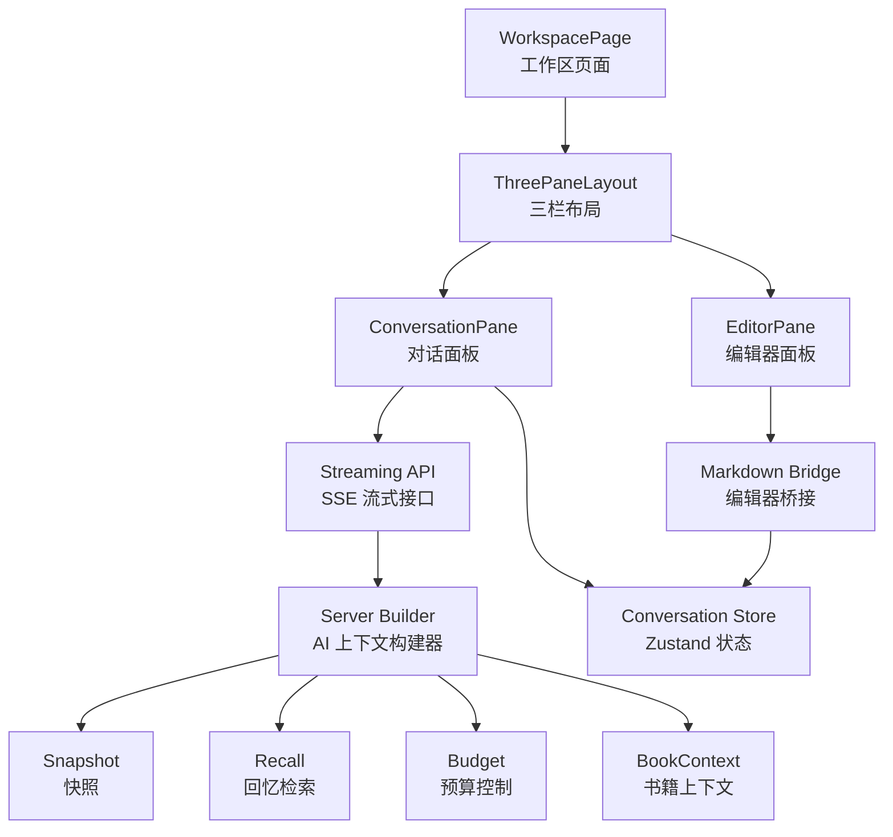
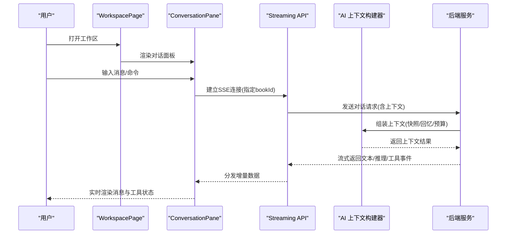
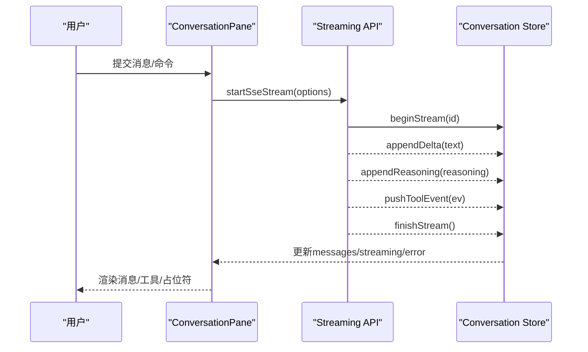
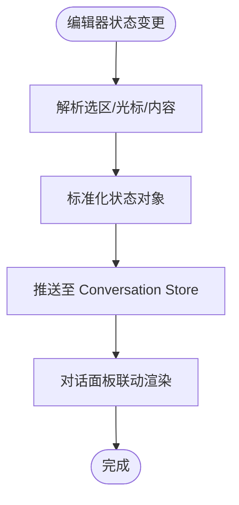
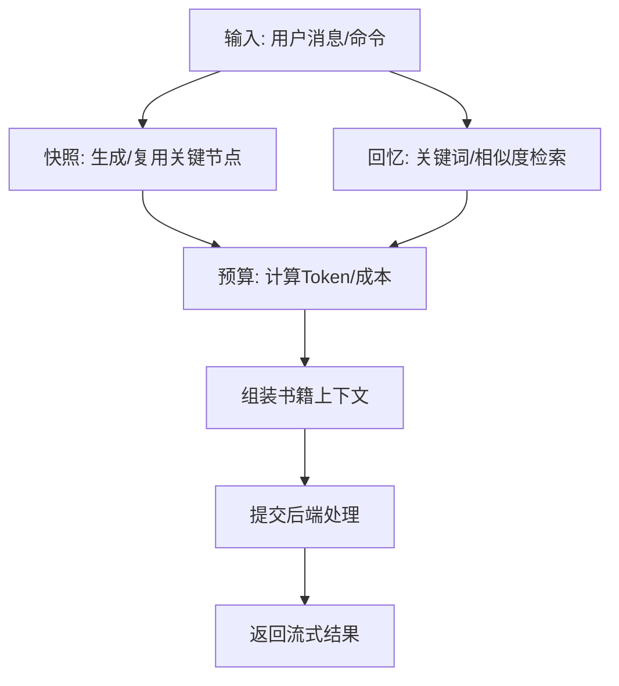
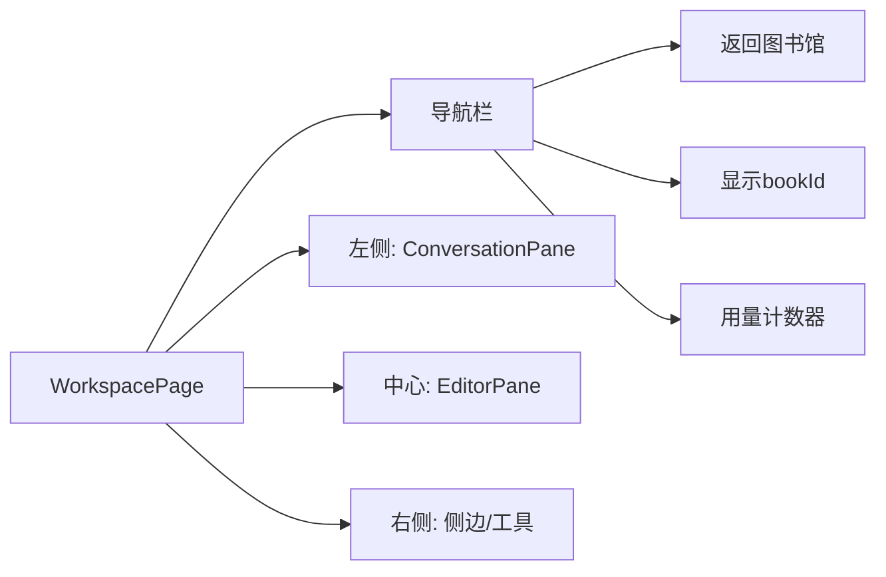
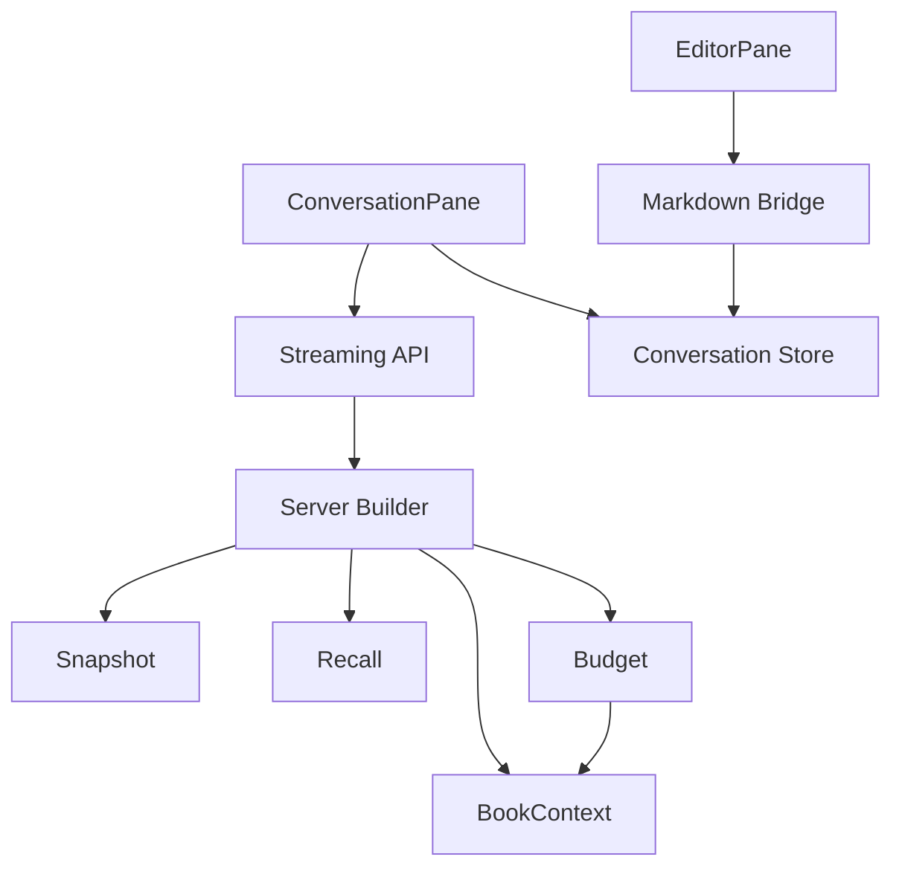

# 创作工作区

<cite>
**本文引用的文件**
- [packages/client/src/pages/workspace.tsx](file://packages/client/src/pages/workspace.tsx)
- [packages/client/src/components/workspace/three-pane-layout.tsx](file://packages/client/src/components/workspace/three-pane-layout.tsx)
- [packages/client/src/components/conversation/conversation-pane.tsx](file://packages/client/src/components/conversation/conversation-pane.tsx)
- [packages/client/src/components/conversation/message.tsx](file://packages/client/src/components/conversation/message.tsx)
- [packages/client/src/components/conversation/streaming-message.tsx](file://packages/client/src/components/conversation/streaming-message.tsx)
- [packages/client/src/api/streaming.ts](file://packages/client/src/api/streaming.ts)
- [packages/client/src/stores/conversation.ts](file://packages/client/src/stores/conversation.ts)
- [packages/client/src/components/editor/editor-pane.tsx](file://packages/client/src/components/editor/editor-pane.tsx)
- [packages/client/src/components/editor/markdown-bridge.ts](file://packages/client/src/components/editor/markdown-bridge.ts)
- [packages/server/src/ai/context-builder/builder.ts](file://packages/server/src/ai/context-builder/builder.ts)
- [packages/server/src/ai/context-builder/snapshot.ts](file://packages/server/src/ai/context-builder/snapshot.ts)
- [packages/server/src/ai/context-builder/recall.ts](file://packages/server/src/ai/context-builder/recall.ts)
- [packages/server/src/ai/context-builder/budget.ts](file://packages/server/src/ai/context-builder/budget.ts)
- [packages/server/src/ai/context-builder/book-context.ts](file://packages/server/src/ai/context-builder/book-context.ts)
- [packages/server/src/ai/budget-check.ts](file://packages/server/src/ai/budget-check.ts)
- [packages/client/tests/components/markdown-bridge.test.ts](file://packages/client/tests/components/markdown-bridge.test.ts)
- [docs/_backups/20260604-162405/2026-06-04-scribe-mvp.md](file://docs/_backups/20260604-162405/2026-06-04-scribe-mvp.md)
- [docs/superpowers/plans/2026-06-04-scribe-mvp.md](file://docs/superpowers/plans/2026-06-04-scribe-mvp.md)
</cite>

## 目录
1. [简介](#简介)
2. [项目结构](#项目结构)
3. [核心组件](#核心组件)
4. [架构总览](#架构总览)
5. [详细组件分析](#详细组件分析)
6. [依赖关系分析](#依赖关系分析)
7. [性能考虑](#性能考虑)
8. [故障排查指南](#故障排查指南)
9. [结论](#结论)
10. [附录](#附录)

## 简介
本文件面向“创作工作区”功能，系统性梳理对话驱动创作的完整流程：从消息处理机制、上下文记忆管理到流式响应实现；详解 Markdown 编辑器桥接组件的实时同步与状态管理；阐述 AI 上下文构建器（快照、回忆、预算）的实现与交互；并给出配置选项、使用示例与最佳实践，以及与后端 API 的交互模式与数据流转。

## 项目结构
创作工作区由“页面容器 + 三栏布局 + 对话面板 + 编辑器面板 + SSE 流式 API + 状态存储 + AI 上下文构建器”构成。页面层负责路由与布局装配，对话层负责消息渲染与流式接收，编辑器桥接组件负责与 Markdown 内容的双向同步，AI 上下文构建器负责快照、回忆与预算控制，并通过后端接口完成实际的对话与处理。

图表来源
- [packages/client/src/pages/workspace.tsx:1-30](file://packages/client/src/pages/workspace.tsx#L1-L30)
- [packages/client/src/components/workspace/three-pane-layout.tsx](file://packages/client/src/components/workspace/three-pane-layout.tsx)
- [packages/client/src/components/conversation/conversation-pane.tsx:1-31](file://packages/client/src/components/conversation/conversation-pane.tsx#L1-L31)
- [packages/client/src/components/editor/editor-pane.tsx](file://packages/client/src/components/editor/editor-pane.tsx)
- [packages/client/src/components/editor/markdown-bridge.ts](file://packages/client/src/components/editor/markdown-bridge.ts)
- [packages/client/src/api/streaming.ts](file://packages/client/src/api/streaming.ts)
- [packages/client/src/stores/conversation.ts](file://packages/client/src/stores/conversation.ts)
- [packages/server/src/ai/context-builder/builder.ts](file://packages/server/src/ai/context-builder/builder.ts)
- [packages/server/src/ai/context-builder/snapshot.ts](file://packages/server/src/ai/context-builder/snapshot.ts)
- [packages/server/src/ai/context-builder/recall.ts](file://packages/server/src/ai/context-builder/recall.ts)
- [packages/server/src/ai/context-builder/budget.ts](file://packages/server/src/ai/context-builder/budget.ts)
- [packages/server/src/ai/context-builder/book-context.ts](file://packages/server/src/ai/context-builder/book-context.ts)

章节来源
- [packages/client/src/pages/workspace.tsx:1-30](file://packages/client/src/pages/workspace.tsx#L1-L30)
- [packages/client/src/components/workspace/three-pane-layout.tsx](file://packages/client/src/components/workspace/three-pane-layout.tsx)

## 核心组件
- 工作区页面与布局：装配三栏（左侧对话、中间编辑器、右侧侧边），承载导航与用量计数。
- 对话面板：负责用户输入、命令解析、SSE 流式接收、消息渲染与工具事件展示。
- 编辑器面板与桥接：负责 Markdown 内容的实时同步、选择态与光标态管理，以及与对话状态的联动。
- 流式 API：封装 SSE 连接、事件分发与错误处理。
- 状态存储：基于 Zustand 的会话状态，统一管理消息、流式片段、推理片段、工具事件与错误。
- AI 上下文构建器：负责快照生成、回忆检索、预算控制与书籍上下文组装，对接后端服务。

章节来源
- [packages/client/src/pages/workspace.tsx:1-30](file://packages/client/src/pages/workspace.tsx#L1-L30)
- [packages/client/src/components/conversation/conversation-pane.tsx:1-31](file://packages/client/src/components/conversation/conversation-pane.tsx#L1-L31)
- [packages/client/src/components/conversation/streaming-message.tsx:1-45](file://packages/client/src/components/conversation/streaming-message.tsx#L1-L45)
- [packages/client/src/components/editor/editor-pane.tsx](file://packages/client/src/components/editor/editor-pane.tsx)
- [packages/client/src/components/editor/markdown-bridge.ts](file://packages/client/src/components/editor/markdown-bridge.ts)
- [packages/client/src/api/streaming.ts](file://packages/client/src/api/streaming.ts)
- [packages/client/src/stores/conversation.ts](file://packages/client/src/stores/conversation.ts)
- [packages/server/src/ai/context-builder/builder.ts](file://packages/server/src/ai/context-builder/builder.ts)
- [packages/server/src/ai/context-builder/snapshot.ts](file://packages/server/src/ai/context-builder/snapshot.ts)
- [packages/server/src/ai/context-builder/recall.ts](file://packages/server/src/ai/context-builder/recall.ts)
- [packages/server/src/ai/context-builder/budget.ts](file://packages/server/src/ai/context-builder/budget.ts)
- [packages/server/src/ai/context-builder/book-context.ts](file://packages/server/src/ai/context-builder/book-context.ts)

## 架构总览
创作工作区采用“前端页面 + SSE 流式 + 后端 AI 上下文构建器”的协作架构。前端负责用户交互与内容渲染，后端负责上下文组织与资源预算控制，二者通过 REST/SSE 接口进行数据交换。

图表来源
- [packages/client/src/pages/workspace.tsx:1-30](file://packages/client/src/pages/workspace.tsx#L1-L30)
- [packages/client/src/components/conversation/conversation-pane.tsx:1-31](file://packages/client/src/components/conversation/conversation-pane.tsx#L1-L31)
- [packages/client/src/api/streaming.ts](file://packages/client/src/api/streaming.ts)
- [packages/server/src/ai/context-builder/builder.ts](file://packages/server/src/ai/context-builder/builder.ts)

## 详细组件分析

### 对话面板与流式响应
- 用户输入与命令解析：对话面板解析斜杠命令，支持笔记、回忆、修订等指令。
- SSE 连接与流式渲染：通过统一的流式 API 建立连接，按事件增量更新消息与工具状态。
- 状态模型：会话状态包含消息列表、当前流式片段、推理片段、工具事件与错误信息。
- 工具事件展示：正在运行的工具以占位形式显示，结束即移除，保证用户感知。

图表来源
- [packages/client/src/components/conversation/conversation-pane.tsx:1-31](file://packages/client/src/components/conversation/conversation-pane.tsx#L1-L31)
- [packages/client/src/components/conversation/streaming-message.tsx:1-45](file://packages/client/src/components/conversation/streaming-message.tsx#L1-L45)
- [packages/client/src/stores/conversation.ts](file://packages/client/src/stores/conversation.ts)
- [packages/client/src/api/streaming.ts](file://packages/client/src/api/streaming.ts)

章节来源
- [packages/client/src/components/conversation/conversation-pane.tsx:1-31](file://packages/client/src/components/conversation/conversation-pane.tsx#L1-L31)
- [packages/client/src/components/conversation/message.tsx](file://packages/client/src/components/conversation/message.tsx)
- [packages/client/src/components/conversation/streaming-message.tsx:1-45](file://packages/client/src/components/conversation/streaming-message.tsx#L1-L45)
- [packages/client/src/stores/conversation.ts](file://packages/client/src/stores/conversation.ts)
- [packages/client/src/api/streaming.ts](file://packages/client/src/api/streaming.ts)

### Markdown 编辑器桥接组件
- 实时同步：桥接组件监听编辑器内容变化与选择/光标状态，将变更映射为统一的状态对象。
- 状态管理：维护“选区范围、光标位置、内容摘要”等元信息，供对话面板与后端上下文构建器使用。
- 用户交互：支持点击编辑器中的片段触发“引导去编辑器选段”等命令，提升人机协同效率。
- 单元测试：包含针对桥接行为的测试用例，确保同步逻辑稳定。

图表来源
- [packages/client/src/components/editor/markdown-bridge.ts](file://packages/client/src/components/editor/markdown-bridge.ts)
- [packages/client/src/stores/conversation.ts](file://packages/client/src/stores/conversation.ts)

章节来源
- [packages/client/src/components/editor/editor-pane.tsx](file://packages/client/src/components/editor/editor-pane.tsx)
- [packages/client/src/components/editor/markdown-bridge.ts](file://packages/client/src/components/editor/markdown-bridge.ts)
- [packages/client/tests/components/markdown-bridge.test.ts](file://packages/client/tests/components/markdown-bridge.test.ts)

### AI 上下文构建器
- 快照管理：对书籍关键节点或章节生成快照，作为上下文锚点，减少重复计算。
- 回忆检索：根据关键词或语义相似度检索历史章节，增强上下文相关性。
- 预算控制：限制上下文长度与成本，避免超出 Token 或预算阈值。
- 书籍上下文：整合快照、回忆与当前输入，形成最终请求上下文，提交后端处理。

图表来源
- [packages/server/src/ai/context-builder/builder.ts](file://packages/server/src/ai/context-builder/builder.ts)
- [packages/server/src/ai/context-builder/snapshot.ts](file://packages/server/src/ai/context-builder/snapshot.ts)
- [packages/server/src/ai/context-builder/recall.ts](file://packages/server/src/ai/context-builder/recall.ts)
- [packages/server/src/ai/context-builder/budget.ts](file://packages/server/src/ai/context-builder/budget.ts)
- [packages/server/src/ai/context-builder/book-context.ts](file://packages/server/src/ai/context-builder/book-context.ts)
- [packages/server/src/ai/budget-check.ts](file://packages/server/src/ai/budget-check.ts)

章节来源
- [packages/server/src/ai/context-builder/builder.ts](file://packages/server/src/ai/context-builder/builder.ts)
- [packages/server/src/ai/context-builder/snapshot.ts](file://packages/server/src/ai/context-builder/snapshot.ts)
- [packages/server/src/ai/context-builder/recall.ts](file://packages/server/src/ai/context-builder/recall.ts)
- [packages/server/src/ai/context-builder/budget.ts](file://packages/server/src/ai/context-builder/budget.ts)
- [packages/server/src/ai/context-builder/book-context.ts](file://packages/server/src/ai/context-builder/book-context.ts)
- [packages/server/src/ai/budget-check.ts](file://packages/server/src/ai/budget-check.ts)

### 工作区装配与路由
- 页面装配：工作区页面在三栏布局中分别挂载对话面板与编辑器面板；当无书目 ID 时显示占位提示。
- 导航与用量：顶部导航包含返回图书馆按钮与书目 ID 显示，右侧用量计数器展示当前消耗。
- 命令与建议：对话面板集成斜杠命令建议，辅助用户快速执行常见操作。

图表来源
- [packages/client/src/pages/workspace.tsx:1-30](file://packages/client/src/pages/workspace.tsx#L1-L30)
- [packages/client/src/components/workspace/three-pane-layout.tsx](file://packages/client/src/components/workspace/three-pane-layout.tsx)

章节来源
- [packages/client/src/pages/workspace.tsx:1-30](file://packages/client/src/pages/workspace.tsx#L1-L30)
- [packages/client/src/components/workspace/three-pane-layout.tsx](file://packages/client/src/components/workspace/three-pane-layout.tsx)

## 依赖关系分析
- 前端耦合：对话面板依赖流式 API 与状态存储；编辑器桥接依赖状态存储；工作区页面依赖三栏布局与面板组件。
- 后端耦合：AI 上下文构建器依赖快照、回忆、预算与书籍上下文模块；预算检查模块贯穿上下文组装阶段。
- 数据契约：前端通过 SSE 获取增量文本、推理与工具事件；后端通过上下文构建器输出最终上下文。

图表来源
- [packages/client/src/components/conversation/conversation-pane.tsx:1-31](file://packages/client/src/components/conversation/conversation-pane.tsx#L1-L31)
- [packages/client/src/components/editor/markdown-bridge.ts](file://packages/client/src/components/editor/markdown-bridge.ts)
- [packages/client/src/stores/conversation.ts](file://packages/client/src/stores/conversation.ts)
- [packages/client/src/api/streaming.ts](file://packages/client/src/api/streaming.ts)
- [packages/server/src/ai/context-builder/builder.ts](file://packages/server/src/ai/context-builder/builder.ts)
- [packages/server/src/ai/context-builder/snapshot.ts](file://packages/server/src/ai/context-builder/snapshot.ts)
- [packages/server/src/ai/context-builder/recall.ts](file://packages/server/src/ai/context-builder/recall.ts)
- [packages/server/src/ai/context-builder/budget.ts](file://packages/server/src/ai/context-builder/budget.ts)
- [packages/server/src/ai/context-builder/book-context.ts](file://packages/server/src/ai/context-builder/book-context.ts)

章节来源
- [packages/client/src/components/conversation/conversation-pane.tsx:1-31](file://packages/client/src/components/conversation/conversation-pane.tsx#L1-L31)
- [packages/client/src/components/editor/markdown-bridge.ts](file://packages/client/src/components/editor/markdown-bridge.ts)
- [packages/server/src/ai/context-builder/builder.ts](file://packages/server/src/ai/context-builder/builder.ts)

## 性能考虑
- 流式渲染优化：仅追加增量文本，避免整段重绘；工具事件采用差量更新，降低 DOM 抖动。
- 上下文压缩：预算控制与快照复用减少冗余信息，提高响应速度。
- 选择态同步：编辑器桥接仅在必要时推送状态变更，避免频繁触发重渲染。
- 并发与节流：对话面板对用户输入进行节流，合并短时间内的多次提交，减少后端压力。

## 故障排查指南
- 无法建立 SSE 连接
  - 检查网络与跨域设置；确认后端端点可用且返回正确的事件流。
  - 查看前端错误状态与日志，定位连接失败原因。
- 流式数据不显示
  - 确认状态存储中 streaming 字段是否被正确更新；检查增量事件是否到达。
  - 核对工具事件队列，确认 start/end 匹配。
- 编辑器不同步
  - 检查桥接组件的选区/光标解析逻辑；确认状态推送链路正常。
  - 在单元测试环境中验证桥接行为。
- 上下文过长或超预算
  - 检查预算控制模块是否生效；调整快照与回忆策略，减少 Token 使用。
  - 优化书籍上下文拼接逻辑，剔除无关片段。

章节来源
- [packages/client/src/stores/conversation.ts](file://packages/client/src/stores/conversation.ts)
- [packages/client/src/api/streaming.ts](file://packages/client/src/api/streaming.ts)
- [packages/client/src/components/editor/markdown-bridge.ts](file://packages/client/src/components/editor/markdown-bridge.ts)
- [packages/server/src/ai/context-builder/budget.ts](file://packages/server/src/ai/context-builder/budget.ts)
- [packages/server/src/ai/budget-check.ts](file://packages/server/src/ai/budget-check.ts)

## 结论
创作工作区通过“对话 + 编辑器 + 上下文构建器”的协同，实现了对话驱动的创作闭环。前端以流式渲染与桥接同步保障交互体验，后端以快照、回忆与预算控制保障上下文质量与成本可控。该架构既满足即时反馈需求，又兼顾长文本与多轮对话的稳定性。

## 附录

### 配置选项与使用示例
- 工作区页面
  - 支持传入 bookId 与自定义 endpoint；无书目时显示占位提示。
- 对话面板
  - 支持自定义流式函数注入；默认使用 SSE 端点。
  - 支持斜杠命令：如“/note”“/recall”“/revise”，用于笔记、回忆与编辑器联动。
- 编辑器桥接
  - 自动解析选区与光标；将状态推送到会话存储，供对话面板使用。
- 上下文构建器
  - 快照：按需生成关键节点；回忆：关键词/相似度检索；预算：Token/成本上限控制。

章节来源
- [packages/client/src/pages/workspace.tsx:1-30](file://packages/client/src/pages/workspace.tsx#L1-L30)
- [packages/client/src/components/conversation/conversation-pane.tsx:1-31](file://packages/client/src/components/conversation/conversation-pane.tsx#L1-L31)
- [packages/client/src/components/editor/editor-pane.tsx](file://packages/client/src/components/editor/editor-pane.tsx)
- [packages/server/src/ai/context-builder/builder.ts](file://packages/server/src/ai/context-builder/builder.ts)

### 最佳实践
- 对话层
  - 将用户输入与命令解析前置，减少无效请求；对高频命令使用本地缓存。
- 编辑器层
  - 保持桥接状态最小化，仅推送必要字段；对大文档采用懒加载与分片同步。
- 上下文层
  - 快照优先：对重要章节生成快照；回忆次之：按关键词与相似度筛选；预算优先：严格控制上下文长度与成本。
- 错误与可观测性
  - 前端记录流式事件与工具事件；后端记录预算与上下文统计；统一错误分类与上报。

### 历史规划参考
- 早期规划中明确了“三栏布局壳子”“对话面板+SSE+流式渲染”的任务拆分与文件清单，体现了从概念到实现的演进路径。

章节来源
- [docs/_backups/20260604-162405/2026-06-04-scribe-mvp.md:2554-2581](file://docs/_backups/20260604-162405/2026-06-04-scribe-mvp.md#L2554-L2581)
- [docs/superpowers/plans/2026-06-04-scribe-mvp.md:2554-2581](file://docs/superpowers/plans/2026-06-04-scribe-mvp.md#L2554-L2581)