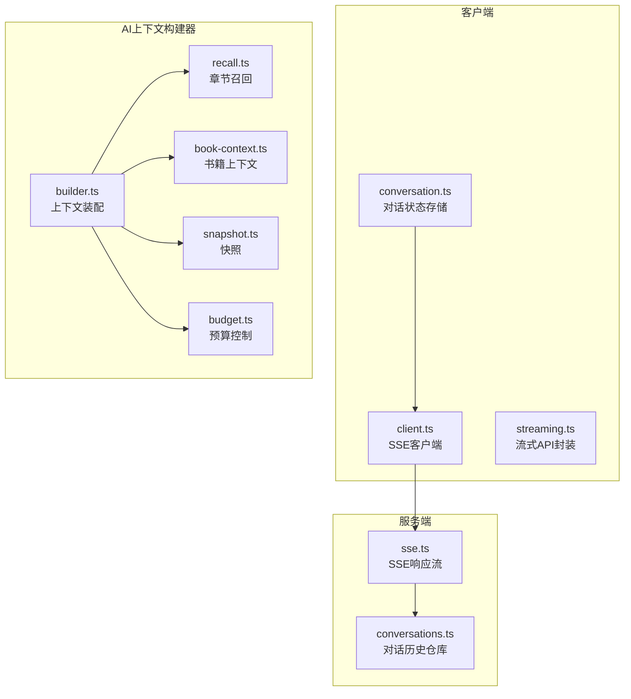
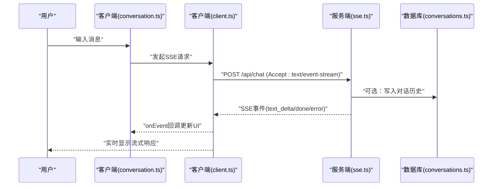
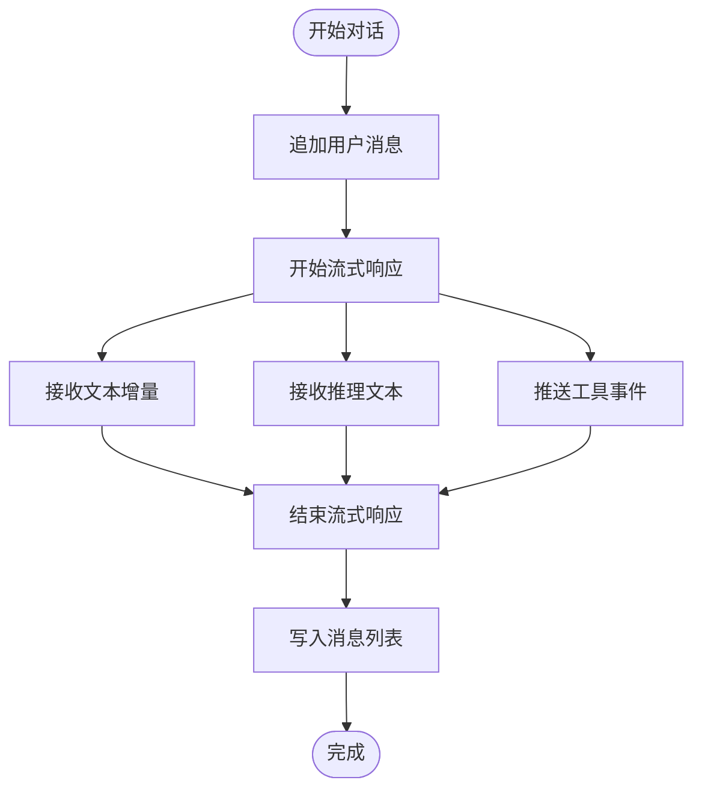
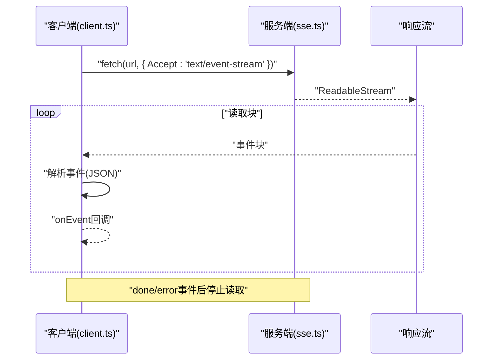
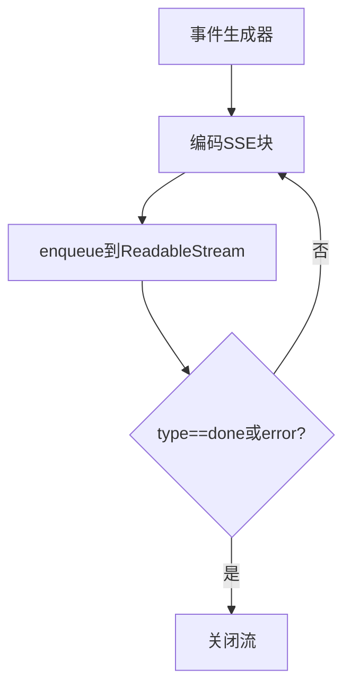
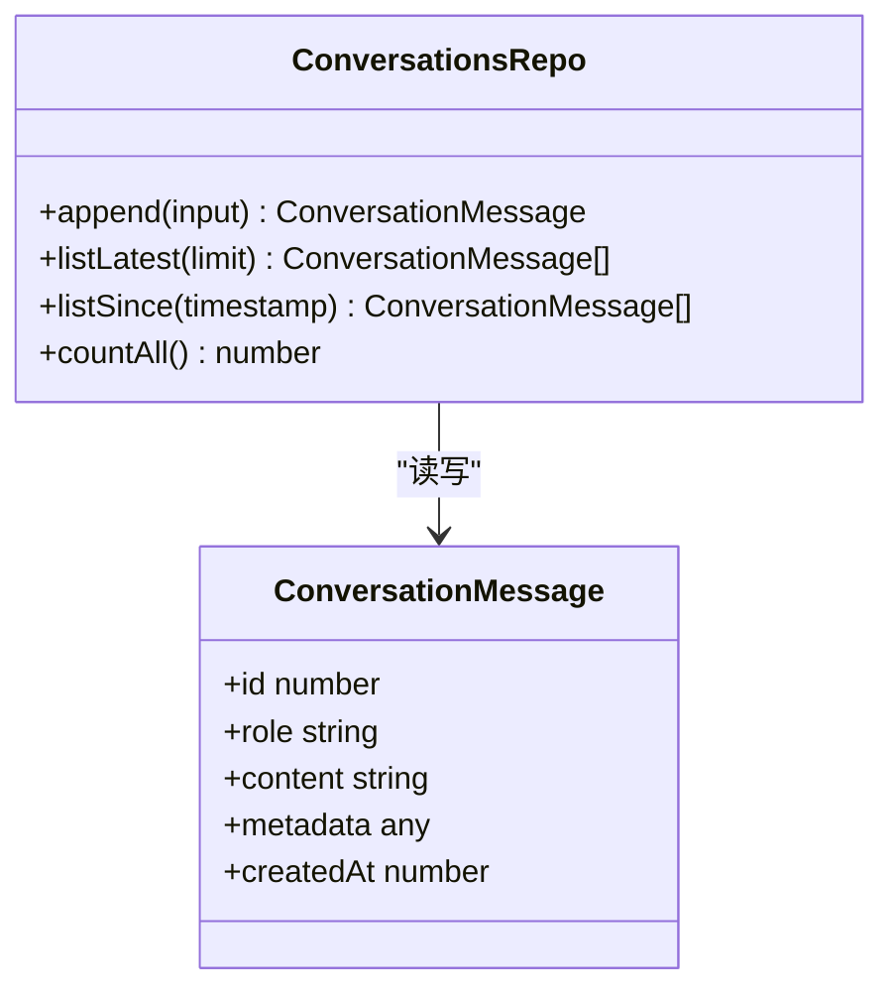
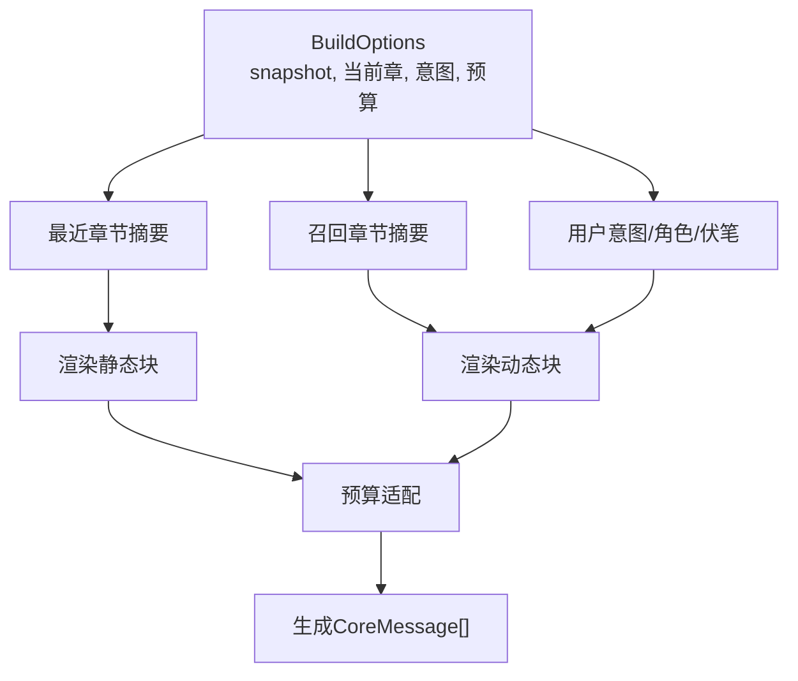
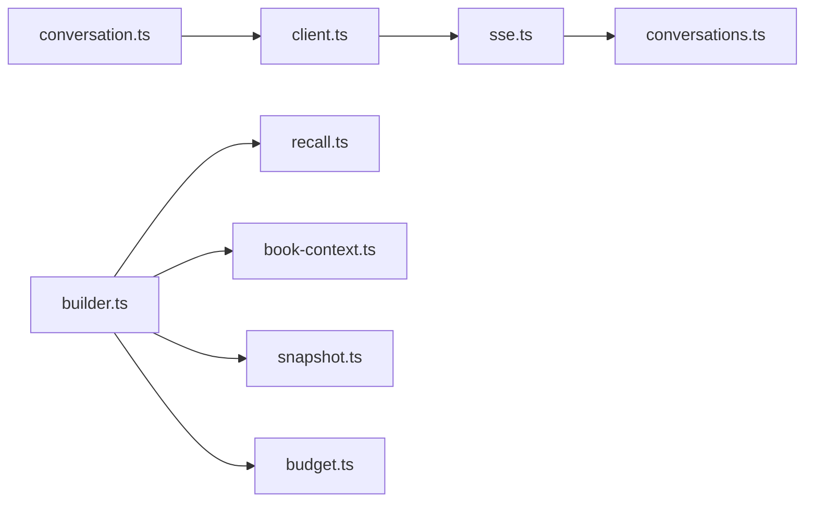

# 对话系统

<cite>
**本文引用的文件**
- [packages/client/src/stores/conversation.ts](file://packages/client/src/stores/conversation.ts)
- [packages/client/src/api/client.ts](file://packages/client/src/api/client.ts)
- [packages/client/src/api/streaming.ts](file://packages/client/src/api/streaming.ts)
- [packages/server/src/db/repositories/conversations.ts](file://packages/server/src/db/repositories/conversations.ts)
- [packages/server/src/http/sse.ts](file://packages/server/src/http/sse.ts)
- [packages/server/src/ai/context-builder/builder.ts](file://packages/server/src/ai/context-builder/builder.ts)
- [packages/server/src/ai/context-builder/recall.ts](file://packages/server/src/ai/context-builder/recall.ts)
- [packages/server/src/ai/context-builder/book-context.ts](file://packages/server/src/ai/context-builder/book-context.ts)
- [packages/server/src/ai/context-builder/snapshot.ts](file://packages/server/src/ai/context-builder/snapshot.ts)
- [packages/server/src/ai/context-builder/budget.ts](file://packages/server/src/ai/context-builder/budget.ts)
- [packages/server/tests/unit/http/sse.test.ts](file://packages/server/tests/unit/http/sse.test.ts)
- [packages/server/tests/integration/auto-mode.test.ts](file://packages/server/tests/integration/auto-mode.test.ts)
- [docs/_backups/20260604-162405/2026-06-04-scribe-mvp.md](file://docs/_backups/20260604-162405/2026-06-04-scribe-mvp.md)
- [docs/superpowers/plans/2026-06-15-generic-record-architecture.md](file://docs/superpowers/plans/2026-06-15-generic-record-architecture.md)
</cite>

## 目录
1. [简介](#简介)
2. [项目结构](#项目结构)
3. [核心组件](#核心组件)
4. [架构总览](#架构总览)
5. [详细组件分析](#详细组件分析)
6. [依赖关系分析](#依赖关系分析)
7. [性能考虑](#性能考虑)
8. [故障排查指南](#故障排查指南)
9. [结论](#结论)
10. [附录](#附录)

## 简介
本文件面向Scribe对话系统的技术文档，聚焦以下主题：
- 对话状态管理：消息存储、历史记录与会话持久化
- 流式响应：基于SSE的实时数据传输与错误处理
- AI上下文构建器：上下文组装、记忆检索与响应生成
- 配置选项、API接口与使用示例
- 对话状态同步、并发处理与性能优化最佳实践

## 项目结构
对话系统由三部分组成：
- 客户端（Zustand状态管理 + SSE客户端）
- 服务端（SQLite持久化 + SSE服务器端）
- AI上下文构建器（静态/动态上下文装配、预算控制与召回）

图表来源
- [packages/client/src/stores/conversation.ts:52-98](file://packages/client/src/stores/conversation.ts#L52-L98)
- [packages/client/src/api/client.ts:285-329](file://packages/client/src/api/client.ts#L285-L329)
- [packages/client/src/api/streaming.ts](file://packages/client/src/api/streaming.ts)
- [packages/server/src/db/repositories/conversations.ts:1-63](file://packages/server/src/db/repositories/conversations.ts#L1-L63)
- [packages/server/src/http/sse.ts:1-32](file://packages/server/src/http/sse.ts#L1-L32)
- [packages/server/src/ai/context-builder/builder.ts](file://packages/server/src/ai/context-builder/builder.ts)
- [packages/server/src/ai/context-builder/recall.ts](file://packages/server/src/ai/context-builder/recall.ts)
- [packages/server/src/ai/context-builder/book-context.ts](file://packages/server/src/ai/context-builder/book-context.ts)
- [packages/server/src/ai/context-builder/snapshot.ts](file://packages/server/src/ai/context-builder/snapshot.ts)
- [packages/server/src/ai/context-builder/budget.ts](file://packages/server/src/ai/context-builder/budget.ts)

章节来源
- [packages/client/src/stores/conversation.ts:52-98](file://packages/client/src/stores/conversation.ts#L52-L98)
- [packages/client/src/api/client.ts:285-329](file://packages/client/src/api/client.ts#L285-L329)
- [packages/server/src/db/repositories/conversations.ts:1-63](file://packages/server/src/db/repositories/conversations.ts#L1-L63)
- [packages/server/src/http/sse.ts:1-32](file://packages/server/src/http/sse.ts#L1-L32)
- [packages/server/src/ai/context-builder/builder.ts](file://packages/server/src/ai/context-builder/builder.ts)
- [packages/server/src/ai/context-builder/recall.ts](file://packages/server/src/ai/context-builder/recall.ts)
- [packages/server/src/ai/context-builder/book-context.ts](file://packages/server/src/ai/context-builder/book-context.ts)
- [packages/server/src/ai/context-builder/snapshot.ts](file://packages/server/src/ai/context-builder/snapshot.ts)
- [packages/server/src/ai/context-builder/budget.ts](file://packages/server/src/ai/context-builder/budget.ts)

## 核心组件
- 客户端对话状态存储：维护消息列表、流式输出缓冲与工具事件，支持追加用户/系统消息、开始/追加/完成流式响应。
- SSE客户端：发起SSE请求，按块解析事件，分发到回调；处理网络与HTTP错误。
- SSE服务器端：将事件流编码为SSE格式，遇到异常发出错误事件并关闭流。
- 对话历史仓库：基于better-sqlite3的增删查，支持按时间窗口查询与计数。
- 上下文构建器：将静态与动态内容装配为AI输入，控制预算与召回策略。

章节来源
- [packages/client/src/stores/conversation.ts:52-98](file://packages/client/src/stores/conversation.ts#L52-L98)
- [packages/client/src/api/client.ts:285-329](file://packages/client/src/api/client.ts#L285-L329)
- [packages/server/src/http/sse.ts:1-32](file://packages/server/src/http/sse.ts#L1-L32)
- [packages/server/src/db/repositories/conversations.ts:1-63](file://packages/server/src/db/repositories/conversations.ts#L1-L63)
- [packages/server/src/ai/context-builder/builder.ts](file://packages/server/src/ai/context-builder/builder.ts)

## 架构总览
对话从客户端发起，经由SSE服务器端流式返回，同时服务端可将对话历史持久化至SQLite。AI上下文构建器负责将书籍快照、章节召回与预算控制整合为模型输入。

图表来源
- [packages/client/src/stores/conversation.ts:52-98](file://packages/client/src/stores/conversation.ts#L52-L98)
- [packages/client/src/api/client.ts:285-329](file://packages/client/src/api/client.ts#L285-L329)
- [packages/server/src/http/sse.ts:1-32](file://packages/server/src/http/sse.ts#L1-L32)
- [packages/server/src/db/repositories/conversations.ts:1-63](file://packages/server/src/db/repositories/conversations.ts#L1-L63)

## 详细组件分析

### 客户端对话状态管理
- 状态字段：messages、streaming、error、autoStatus
- 关键操作：
  - 追加用户/系统消息
  - 开始流式响应（初始化流式缓冲）
  - 追加文本增量/推理文本/工具事件
  - 结束流式响应（将流式缓冲写入messages）

图表来源
- [packages/client/src/stores/conversation.ts:52-98](file://packages/client/src/stores/conversation.ts#L52-L98)

章节来源
- [packages/client/src/stores/conversation.ts:52-98](file://packages/client/src/stores/conversation.ts#L52-L98)

### SSE流式响应（客户端）
- 请求：POST，Accept: text/event-stream
- 解析：按“\n\n”分块，提取以"data:"开头的行，解析JSON事件
- 错误处理：网络异常、HTTP非OK、解析异常均触发“error”事件回调

图表来源
- [packages/client/src/api/client.ts:285-329](file://packages/client/src/api/client.ts#L285-L329)
- [packages/server/src/http/sse.ts:1-32](file://packages/server/src/http/sse.ts#L1-L32)

章节来源
- [packages/client/src/api/client.ts:285-329](file://packages/client/src/api/client.ts#L285-L329)
- [packages/server/src/http/sse.ts:1-32](file://packages/server/src/http/sse.ts#L1-L32)
- [packages/server/tests/unit/http/sse.test.ts:1-50](file://packages/server/tests/unit/http/sse.test.ts#L1-L50)

### SSE流式响应（服务端）
- 将事件序列编码为SSE格式，逐个发送
- 遇到异常：发送“error”事件，随后关闭流
- done/error事件后终止循环

图表来源
- [packages/server/src/http/sse.ts:1-32](file://packages/server/src/http/sse.ts#L1-L32)

章节来源
- [packages/server/src/http/sse.ts:1-32](file://packages/server/src/http/sse.ts#L1-L32)
- [packages/server/tests/unit/http/sse.test.ts:1-50](file://packages/server/tests/unit/http/sse.test.ts#L1-L50)

### 对话历史与会话持久化
- 仓库接口：append、listLatest、listSince、countAll
- 数据模型：消息实体含角色、内容、元数据与创建时间
- 使用场景：写入新消息、按时间窗口拉取增量、统计总数

图表来源
- [packages/server/src/db/repositories/conversations.ts:1-63](file://packages/server/src/db/repositories/conversations.ts#L1-L63)

章节来源
- [packages/server/src/db/repositories/conversations.ts:1-63](file://packages/server/src/db/repositories/conversations.ts#L1-L63)

### AI上下文构建器
- 组装流程：静态块（设定/角色/活跃伏笔/章节大纲等）+ 动态块（最近章节、召回章节、意图指令）
- 回忆策略：基于章节摘要与意图进行召回
- 预算控制：限制上下文长度，保证模型输入在预算内
- 书籍上下文：从快照中抽取静态信息，渲染为固定结构

图表来源
- [packages/server/src/ai/context-builder/builder.ts](file://packages/server/src/ai/context-builder/builder.ts)
- [packages/server/src/ai/context-builder/recall.ts](file://packages/server/src/ai/context-builder/recall.ts)
- [packages/server/src/ai/context-builder/book-context.ts](file://packages/server/src/ai/context-builder/book-context.ts)
- [packages/server/src/ai/context-builder/snapshot.ts](file://packages/server/src/ai/context-builder/snapshot.ts)
- [packages/server/src/ai/context-builder/budget.ts](file://packages/server/src/ai/context-builder/budget.ts)

章节来源
- [packages/server/src/ai/context-builder/builder.ts](file://packages/server/src/ai/context-builder/builder.ts)
- [packages/server/src/ai/context-builder/recall.ts](file://packages/server/src/ai/context-builder/recall.ts)
- [packages/server/src/ai/context-builder/book-context.ts](file://packages/server/src/ai/context-builder/book-context.ts)
- [packages/server/src/ai/context-builder/snapshot.ts](file://packages/server/src/ai/context-builder/snapshot.ts)
- [packages/server/src/ai/context-builder/budget.ts](file://packages/server/src/ai/context-builder/budget.ts)
- [docs/_backups/20260604-162405/2026-06-04-scribe-mvp.md:2153-2215](file://docs/_backups/20260604-162405/2026-06-04-scribe-mvp.md#L2153-L2215)
- [docs/superpowers/plans/2026-06-15-generic-record-architecture.md:34-699](file://docs/superpowers/plans/2026-06-15-generic-record-architecture.md#L34-L699)

## 依赖关系分析
- 客户端依赖：Zustand状态管理、浏览器Fetch与ReadableStream
- 服务端依赖：better-sqlite3数据库、SSE编码器
- 上下文构建器依赖：书籍快照、召回模块、预算模块

图表来源
- [packages/client/src/stores/conversation.ts:52-98](file://packages/client/src/stores/conversation.ts#L52-L98)
- [packages/client/src/api/client.ts:285-329](file://packages/client/src/api/client.ts#L285-L329)
- [packages/server/src/http/sse.ts:1-32](file://packages/server/src/http/sse.ts#L1-L32)
- [packages/server/src/db/repositories/conversations.ts:1-63](file://packages/server/src/db/repositories/conversations.ts#L1-L63)
- [packages/server/src/ai/context-builder/builder.ts](file://packages/server/src/ai/context-builder/builder.ts)
- [packages/server/src/ai/context-builder/recall.ts](file://packages/server/src/ai/context-builder/recall.ts)
- [packages/server/src/ai/context-builder/book-context.ts](file://packages/server/src/ai/context-builder/book-context.ts)
- [packages/server/src/ai/context-builder/snapshot.ts](file://packages/server/src/ai/context-builder/snapshot.ts)
- [packages/server/src/ai/context-builder/budget.ts](file://packages/server/src/ai/context-builder/budget.ts)

章节来源
- [packages/client/src/stores/conversation.ts:52-98](file://packages/client/src/stores/conversation.ts#L52-L98)
- [packages/client/src/api/client.ts:285-329](file://packages/client/src/api/client.ts#L285-L329)
- [packages/server/src/http/sse.ts:1-32](file://packages/server/src/http/sse.ts#L1-L32)
- [packages/server/src/db/repositories/conversations.ts:1-63](file://packages/server/src/db/repositories/conversations.ts#L1-L63)
- [packages/server/src/ai/context-builder/builder.ts](file://packages/server/src/ai/context-builder/builder.ts)
- [packages/server/src/ai/context-builder/recall.ts](file://packages/server/src/ai/context-builder/recall.ts)
- [packages/server/src/ai/context-builder/book-context.ts](file://packages/server/src/ai/context-builder/book-context.ts)
- [packages/server/src/ai/context-builder/snapshot.ts](file://packages/server/src/ai/context-builder/snapshot.ts)
- [packages/server/src/ai/context-builder/budget.ts](file://packages/server/src/ai/context-builder/budget.ts)

## 性能考虑
- 流式传输
  - 使用SSE避免一次性大响应，降低首字节延迟
  - 客户端按块解析，减少内存峰值
- 数据库
  - 历史查询按时间索引扫描，建议在created_at上建立索引
  - 批量写入与事务封装可减少I/O开销
- 上下文预算
  - 在上下文装配阶段进行预算裁剪，避免超限
  - 回忆召回采用topK，控制动态块规模
- 并发与重试
  - 客户端应避免重复提交，使用去抖与幂等标识
  - 服务端在异常时发送错误事件，便于前端快速失败与提示

## 故障排查指南
- SSE连接问题
  - 确认服务端SSE响应头正确设置，客户端Accept为text/event-stream
  - 检查done/error事件是否提前终止流
- 错误事件
  - 服务端异常时会发送“error”事件，客户端需在回调中处理
  - 网络中断与HTTP错误会被转换为“error”事件并携带错误类别
- 历史缺失
  - 确认append接口已写入且listSince参数timestamp合理
  - 检查数据库连接与事务提交

章节来源
- [packages/server/src/http/sse.ts:1-32](file://packages/server/src/http/sse.ts#L1-L32)
- [packages/server/tests/unit/http/sse.test.ts:1-50](file://packages/server/tests/unit/http/sse.test.ts#L1-L50)
- [packages/client/src/api/client.ts:285-329](file://packages/client/src/api/client.ts#L285-L329)
- [packages/server/src/db/repositories/conversations.ts:1-63](file://packages/server/src/db/repositories/conversations.ts#L1-L63)

## 结论
Scribe对话系统通过Zustand状态管理、SSE流式传输与SQLite持久化，实现了低延迟、可扩展的对话体验。AI上下文构建器将静态与动态信息有序组织，结合预算与召回策略，确保生成质量与成本可控。建议在生产环境中强化并发控制、错误恢复与监控告警，持续优化上下文装配与数据库查询性能。

## 附录

### 配置选项与API接口
- 设置预算上限（示例）
  - GET /api/settings：读取当前预算配置
  - PUT /api/settings：更新单次预算上限
- SSE流式接口（示例）
  - POST /api/chat：Accept: text/event-stream
  - 支持事件类型：text_delta、done、error
- 对话历史接口（示例）
  - POST /api/conversations：写入消息
  - GET /api/conversations/latest?limit=...：最近N条
  - GET /api/conversations/since?ts=...：指定时间戳之后的消息

章节来源
- [packages/server/tests/integration/auto-mode.test.ts:368-386](file://packages/server/tests/integration/auto-mode.test.ts#L368-L386)
- [packages/server/src/http/sse.ts:1-32](file://packages/server/src/http/sse.ts#L1-L32)
- [packages/server/src/db/repositories/conversations.ts:1-63](file://packages/server/src/db/repositories/conversations.ts#L1-L63)

### 使用示例（概念性说明）
- 客户端
  - 初始化对话状态存储，绑定onEvent回调
  - 发起SSE请求，接收text_delta增量并实时渲染
  - 收到done后结束流式，将最终响应写入消息列表
- 服务端
  - 接收请求后，根据意图与书籍快照构建上下文
  - 逐步产生事件（如text_delta），直至done或error
  - 可选地将消息写入数据库
- 上下文构建
  - 从快照抽取静态块，渲染为固定结构
  - 基于意图召回相关章节摘要，形成动态块
  - 预算裁剪后输出CoreMessage数组供模型消费

章节来源
- [packages/client/src/stores/conversation.ts:52-98](file://packages/client/src/stores/conversation.ts#L52-L98)
- [packages/client/src/api/client.ts:285-329](file://packages/client/src/api/client.ts#L285-L329)
- [packages/server/src/http/sse.ts:1-32](file://packages/server/src/http/sse.ts#L1-L32)
- [packages/server/src/ai/context-builder/builder.ts](file://packages/server/src/ai/context-builder/builder.ts)
- [packages/server/src/ai/context-builder/recall.ts](file://packages/server/src/ai/context-builder/recall.ts)
- [packages/server/src/ai/context-builder/book-context.ts](file://packages/server/src/ai/context-builder/book-context.ts)
- [packages/server/src/ai/context-builder/snapshot.ts](file://packages/server/src/ai/context-builder/snapshot.ts)
- [packages/server/src/ai/context-builder/budget.ts](file://packages/server/src/ai/context-builder/budget.ts)