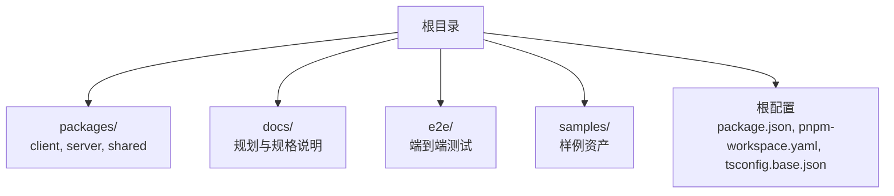
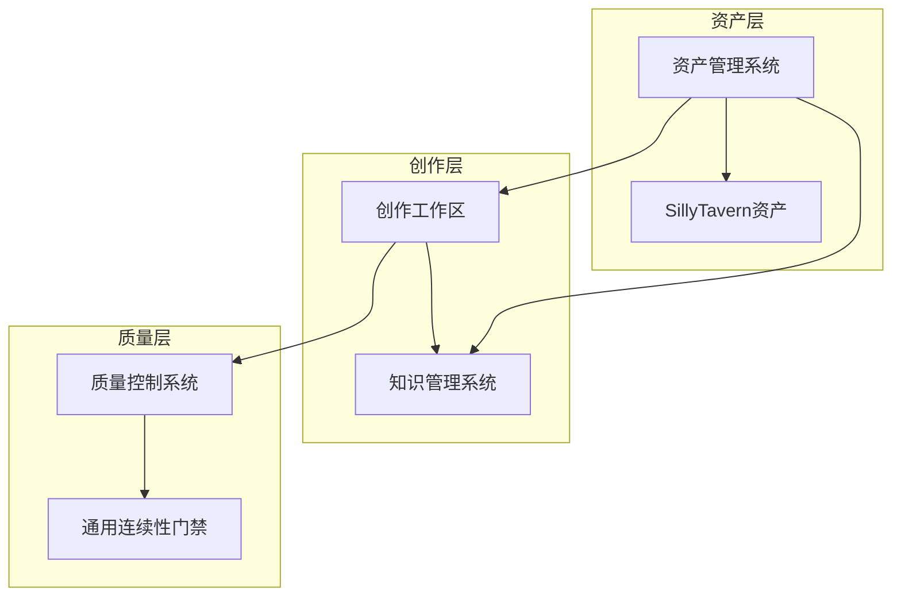
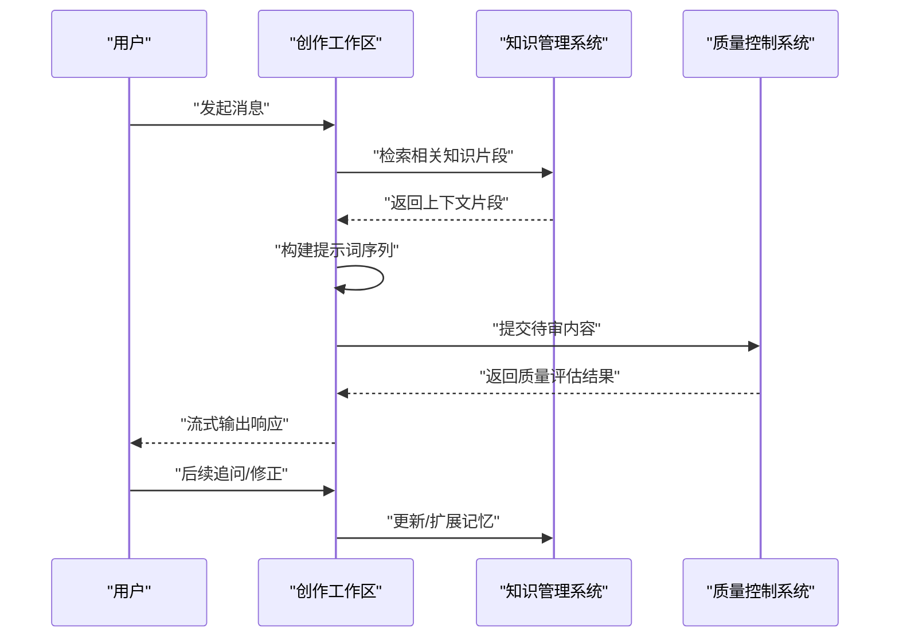
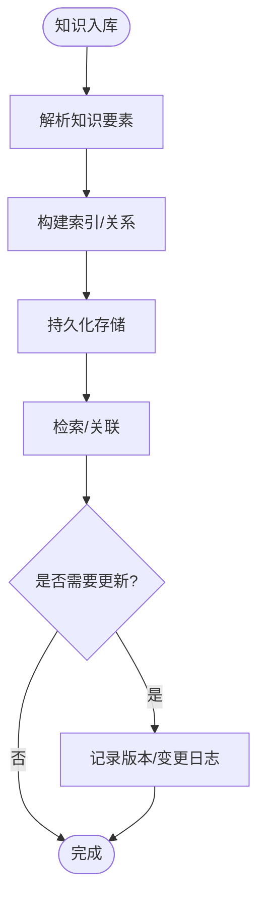
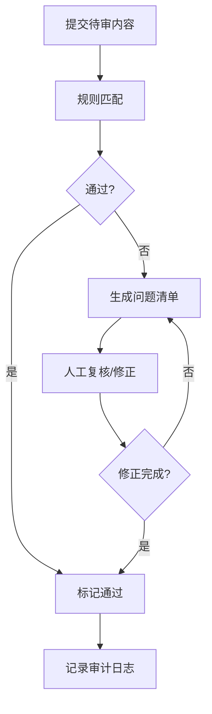
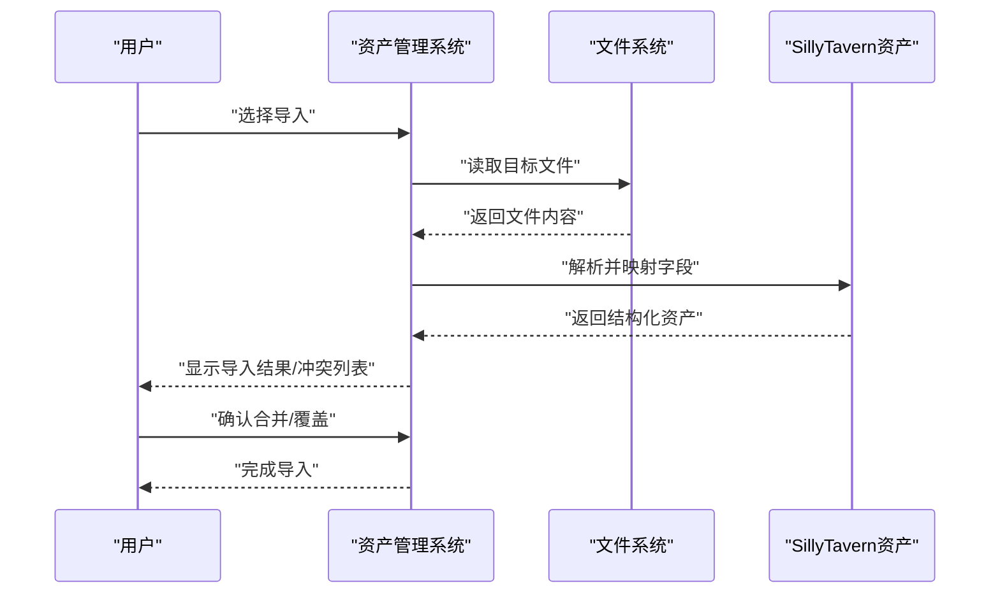
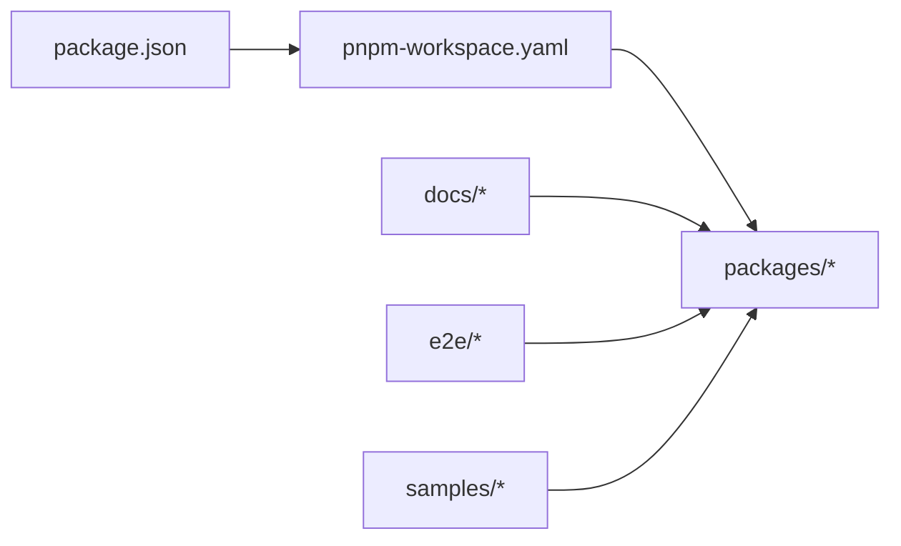

# 核心功能模块

<cite>
**本文档引用的文件**
- [package.json](file://package.json)
- [pnpm-workspace.yaml](file://pnpm-workspace.yaml)
- [tsconfig.base.json](file://tsconfig.base.json)
- [docs/_implementation-notes.md](file://docs/_implementation-notes.md)
- [docs/superpowers/plans/2026-06-04-scribe-mvp.md](file://docs/superpowers/plans/2026-06-04-scribe-mvp.md)
- [docs/superpowers/plans/2026-06-15-generic-record-architecture.md](file://docs/superpowers/plans/2026-06-15-generic-record-architecture.md)
- [docs/superpowers/plans/2026-06-15-generic-record-e2e-monitoring.md](file://docs/superpowers/plans/2026-06-15-generic-record-e2e-monitoring.md)
- [docs/superpowers/plans/2026-06-15-worldbook-driven-writing.md](file://docs/superpowers/plans/2026-06-15-worldbook-driven-writing.md)
- [docs/superpowers/plans/2026-06-16-sillytavern-full-compatibility.md](file://docs/superpowers/plans/2026-06-16-sillytavern-full-compatibility.md)
- [docs/superpowers/plans/2026-06-16-sillytavern-import.md](file://docs/superpowers/plans/2026-06-16-sillytavern-import.md)
- [docs/superpowers/plans/2026-06-16-sillytavern-quality-continuity.md](file://docs/superpowers/plans/2026-06-16-sillytavern-quality-continuity.md)
- [docs/superpowers/plans/2026-06-17-scribe-final-roadmap.md](file://docs/superpowers/plans/2026-06-17-scribe-final-roadmap.md)
- [docs/superpowers/plans/2026-06-17-scribe-phase1-generic-continuity-gates.md](file://docs/superpowers/plans/2026-06-17-scribe-phase1-generic-continuity-gates.md)
- [docs/superpowers/specs/2026-06-16-sillytavern-import-design.md](file://docs/superpowers/specs/2026-06-16-sillytavern-import-design.md)
- [docs/superpowers/specs/2026-06-17-scribe-ultimate-product-goal.md](file://docs/superpowers/specs/2026-06-17-scribe-ultimate-product-goal.md)
- [samples/sillytavern/Izumi 0503.json](file://samples/sillytavern/Izumi 0503.json)
- [e2e/tests/core-journey.spec.ts](file://e2e/tests/core-journey.spec.ts)
- [e2e/tests/smoke.spec.ts](file://e2e/tests/smoke.spec.ts)
- [e2e/package.json](file://e2e/package.json)
- [e2e/playwright.config.ts](file://e2e/playwright.config.ts)
</cite>

## 目录
1. [引言](#引言)
2. [项目结构](#项目结构)
3. [核心组件](#核心组件)
4. [架构总览](#架构总览)
5. [详细组件分析](#详细组件分析)
6. [依赖分析](#依赖分析)
7. [性能考虑](#性能考虑)
8. [故障排除指南](#故障排除指南)
9. [结论](#结论)
10. [附录](#附录)

## 引言
本文件面向Scribe的核心功能模块，系统化梳理四大能力域：创作工作区、知识管理系统、质量控制系统与资产管理，并围绕“对话驱动创作”“长期记忆管理”“通用质量门禁”“资产导入导出”等主题，给出可操作的使用说明、配置要点与最佳实践。文档同时强调模块间集成关系与数据流转路径，帮助读者快速理解并高效落地。

## 项目结构
仓库采用多包（monorepo）组织方式，通过工作区配置统一管理客户端、服务端与共享模块；配套有端到端测试与样例资源，支撑导入兼容与质量控制策略的验证。

**图表来源**
- [pnpm-workspace.yaml](file://pnpm-workspace.yaml)
- [package.json](file://package.json)
- [tsconfig.base.json](file://tsconfig.base.json)

**章节来源**
- [pnpm-workspace.yaml](file://pnpm-workspace.yaml)
- [package.json](file://package.json)
- [tsconfig.base.json](file://tsconfig.base.json)

## 核心组件
- 创作工作区：以对话为驱动，负责消息编排、上下文记忆与流式响应输出，支撑持续创作与交互体验。
- 知识管理系统：对角色、场景、设定等创作素材进行结构化存储与检索，提供跨会话的知识复用与一致性保障。
- 质量控制系统：基于通用门禁规则与连续性验证流程，确保生成内容在逻辑、风格与事实层面的一致性。
- 资产管理系统：提供资产的导入、导出与版本化管理，支持多格式兼容与迁移策略。

**章节来源**
- [docs/superpowers/plans/2026-06-04-scribe-mvp.md](file://docs/superpowers/plans/2026-06-04-scribe-mvp.md)
- [docs/superpowers/plans/2026-06-16-sillytavern-quality-continuity.md](file://docs/superpowers/plans/2026-06-16-sillytavern-quality-continuity.md)
- [docs/superpowers/plans/2026-06-16-sillytavern-import.md](file://docs/superpowers/plans/2026-06-16-sillytavern-import.md)

## 架构总览
下图展示四大核心模块在整体架构中的位置与交互关系，以及与外部生态（如SillyTavern资产）的对接点。

**图表来源**
- [docs/superpowers/plans/2026-06-15-worldbook-driven-writing.md](file://docs/superpowers/plans/2026-06-15-worldbook-driven-writing.md)
- [docs/superpowers/plans/2026-06-16-sillytavern-quality-continuity.md](file://docs/superpowers/plans/2026-06-16-sillytavern-quality-continuity.md)
- [docs/superpowers/plans/2026-06-16-sillytavern-import.md](file://docs/superpowers/plans/2026-06-16-sillytavern-import.md)

## 详细组件分析

### 创作工作区
- 功能定位：以对话为入口，聚合用户意图、历史上下文与知识库信息，生成符合设定的流式回复，支持多轮迭代与即时反馈。
- 关键机制：
  - 消息处理：接收用户输入，结合角色设定与场景约束，构建提示词序列。
  - 上下文记忆：维护短期对话窗口与长期记忆片段，按需裁剪与拼接，避免上下文溢出。
  - 流式响应：分块输出文本，提升交互感知与延迟表现。
- 使用示例：
  - 新建会话并设置角色/场景后发起首轮对话，随后进行多轮追问与修正。
  - 在长文档创作中，通过“插入关键节点”或“切换视角”来引导上下文走向。
- 配置要点：
  - 对话窗口大小、记忆保留策略、流式输出速率阈值。
  - 角色与场景的优先级与冲突处理规则。
- 最佳实践：
  - 将复杂任务拆分为阶段性目标，利用“总结当前进展”触发记忆刷新。
  - 在关键转折点明确标注“请严格遵循以下设定”，减少漂移。

**图表来源**
- [docs/superpowers/plans/2026-06-15-worldbook-driven-writing.md](file://docs/superpowers/plans/2026-06-15-worldbook-driven-writing.md)
- [docs/superpowers/plans/2026-06-16-sillytavern-quality-continuity.md](file://docs/superpowers/plans/2026-06-16-sillytavern-quality-continuity.md)

**章节来源**
- [docs/superpowers/plans/2026-06-15-worldbook-driven-writing.md](file://docs/superpowers/plans/2026-06-15-worldbook-driven-writing.md)

### 知识管理系统
- 功能定位：对角色、场景、设定、历史对话摘要等进行结构化管理，提供检索、关联与版本化能力。
- 关键机制：
  - 结构化存储：将知识要素映射为可查询的实体与关系。
  - 关联维护：基于语义相似度与标签匹配建立知识网络。
  - 版本化：记录变更轨迹，支持回滚与对比。
- 使用示例：
  - 导入角色档案后，在创作时自动注入背景信息。
  - 建立“场景-事件-角色”的三元关系，用于复杂剧情的交叉验证。
- 配置要点：
  - 索引策略、相似度阈值、命名空间隔离。
  - 变更通知与冲突解决策略。
- 最佳实践：
  - 将高频使用的知识固化为模板，减少重复输入。
  - 定期清理过期条目，保持知识库新鲜度。

**图表来源**
- [docs/superpowers/plans/2026-06-15-generic-record-architecture.md](file://docs/superpowers/plans/2026-06-15-generic-record-architecture.md)

**章节来源**
- [docs/superpowers/plans/2026-06-15-generic-record-architecture.md](file://docs/superpowers/plans/2026-06-15-generic-record-architecture.md)

### 质量控制系统
- 功能定位：在创作过程中实施通用门禁与连续性校验，确保内容在事实、逻辑与风格上的一致性。
- 关键机制：
  - 门禁规则：定义事实核查、逻辑自洽、风格一致等检查项。
  - 连续性验证：跟踪时间线、人物弧光与事件因果链，识别断裂点。
  - 自动化与人工审核结合：对高风险内容触发二次校验。
- 使用示例：
  - 在生成关键情节后，手动触发“连续性检查”，根据报告逐项修正。
  - 配置“敏感话题白名单”，对特定题材放宽限制但保留审计痕迹。
- 配置要点：
  - 规则集的启用/禁用、权重与优先级。
  - 审计日志粒度与保留周期。
- 最佳实践：
  - 将常见问题归类为规则模板，复用到不同项目。
  - 对历史内容定期重检，防止知识退化。

**图表来源**
- [docs/superpowers/plans/2026-06-17-scribe-phase1-generic-continuity-gates.md](file://docs/superpowers/plans/2026-06-17-scribe-phase1-generic-continuity-gates.md)
- [docs/superpowers/plans/2026-06-16-sillytavern-quality-continuity.md](file://docs/superpowers/plans/2026-06-16-sillytavern-quality-continuity.md)

**章节来源**
- [docs/superpowers/plans/2026-06-17-scribe-phase1-generic-continuity-gates.md](file://docs/superpowers/plans/2026-06-17-scribe-phase1-generic-continuity-gates.md)
- [docs/superpowers/plans/2026-06-16-sillytavern-quality-continuity.md](file://docs/superpowers/plans/2026-06-16-sillytavern-quality-continuity.md)

### 资产管理系统
- 功能定位：统一管理角色、场景、设定等创作资产，支持导入、导出与版本化迁移。
- 关键机制：
  - 导入：解析外部格式（如SillyTavern JSON），转换为内部结构并进行兼容性校验。
  - 导出：按目标格式生成标准化产物，保留元数据与版本信息。
  - 兼容性：提供迁移脚本与字段映射表，降低升级成本。
- 使用示例：
  - 从SillyTavern导入角色档案，自动完成字段映射与冲突消解。
  - 导出项目资产到标准格式，便于团队共享与备份。
- 配置要点：
  - 导入/导出策略、默认覆盖规则、冲突处理偏好。
  - 字段映射表与版本对照表。
- 最佳实践：
  - 在导入前先做“预检查”，识别缺失字段与异常值。
  - 对重要资产打标签与分组，便于检索与权限控制。

**图表来源**
- [docs/superpowers/plans/2026-06-16-sillytavern-import.md](file://docs/superpowers/plans/2026-06-16-sillytavern-import.md)
- [docs/superpowers/specs/2026-06-16-sillytavern-import-design.md](file://docs/superpowers/specs/2026-06-16-sillytavern-import-design.md)
- [samples/sillytavern/Izumi 0503.json](file://samples/sillytavern/Izumi 0503.json)

**章节来源**
- [docs/superpowers/plans/2026-06-16-sillytavern-import.md](file://docs/superpowers/plans/2026-06-16-sillytavern-import.md)
- [docs/superpowers/specs/2026-06-16-sillytavern-import-design.md](file://docs/superpowers/specs/2026-06-16-sillytavern-import-design.md)
- [samples/sillytavern/Izumi 0503.json](file://samples/sillytavern/Izumi 0503.json)

## 依赖分析
- 包管理与工作区：通过工作区配置统一管理多包依赖与构建脚本，确保版本一致性与增量开发效率。
- 文档与规范：规划文档指导模块边界与演进方向，规格文档细化接口与兼容性策略。
- 测试与样例：端到端测试覆盖核心旅程，样例资产用于导入兼容性验证。

**图表来源**
- [pnpm-workspace.yaml](file://pnpm-workspace.yaml)
- [package.json](file://package.json)

**章节来源**
- [pnpm-workspace.yaml](file://pnpm-workspace.yaml)
- [package.json](file://package.json)

## 性能考虑
- 上下文长度控制：通过动态裁剪与摘要注入平衡上下文容量与信息密度。
- 流式输出优化：分块传输与背压控制，避免前端渲染阻塞。
- 知识检索加速：索引与缓存策略降低检索延迟，定期重建索引保证准确性。
- 质量检查批量化：对批量内容进行并发检查，异步输出结果，提升吞吐。

## 故障排除指南
- 导入失败
  - 现象：导入后出现字段缺失或类型不匹配。
  - 排查：检查映射表与版本对照，确认目标文件格式是否受支持。
  - 处理：使用内置修复工具或回滚到上一版本。
- 质量门禁误报
  - 现象：规则过于严格导致正常内容被拦截。
  - 排查：调整规则权重或添加例外条件。
  - 处理：临时豁免并记录原因，后续优化规则。
- 记忆错乱
  - 现象：上下文跳跃或前后矛盾。
  - 排查：检查记忆窗口与裁剪策略，确认关键节点是否正确注入。
  - 处理：强制刷新记忆并重新生成摘要。

**章节来源**
- [docs/superpowers/plans/2026-06-16-sillytavern-import.md](file://docs/superpowers/plans/2026-06-16-sillytavern-import.md)
- [docs/superpowers/plans/2026-06-17-scribe-phase1-generic-continuity-gates.md](file://docs/superpowers/plans/2026-06-17-scribe-phase1-generic-continuity-gates.md)

## 结论
Scribe通过“对话驱动创作+知识管理+质量控制+资产管理”的协同体系，形成从输入到输出再到治理的闭环。建议在实际使用中以“规则可调、记忆可控、资产可管、质量可验”为核心原则，结合样例与测试用例逐步完善工作流，持续优化规则与策略。

## 附录
- 端到端测试
  - 核心旅程测试：覆盖从导入资产到生成内容的关键步骤。
  - 冒烟测试：验证基础功能可用性与回归稳定性。
- 规划与规格
  - MVP目标与最终路线图：明确阶段目标与里程碑。
  - 导入设计与兼容性策略：指导资产迁移与升级路径。

**章节来源**
- [e2e/tests/core-journey.spec.ts](file://e2e/tests/core-journey.spec.ts)
- [e2e/tests/smoke.spec.ts](file://e2e/tests/smoke.spec.ts)
- [docs/superpowers/plans/2026-06-04-scribe-mvp.md](file://docs/superpowers/plans/2026-06-04-scribe-mvp.md)
- [docs/superpowers/plans/2026-06-17-scribe-final-roadmap.md](file://docs/superpowers/plans/2026-06-17-scribe-final-roadmap.md)
- [docs/superpowers/specs/2026-06-17-scribe-ultimate-product-goal.md](file://docs/superpowers/specs/2026-06-17-scribe-ultimate-product-goal.md)