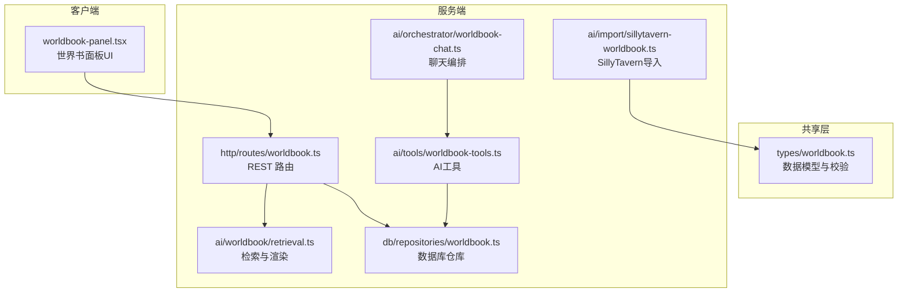
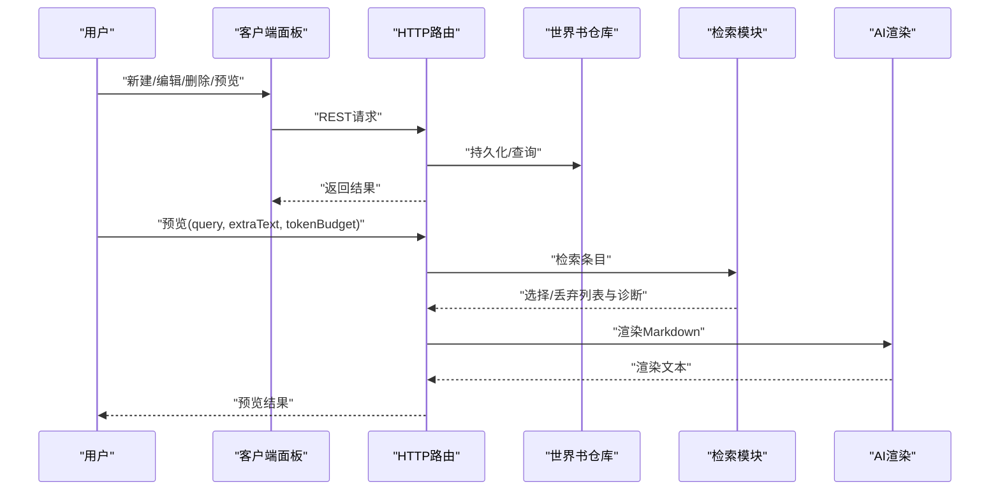
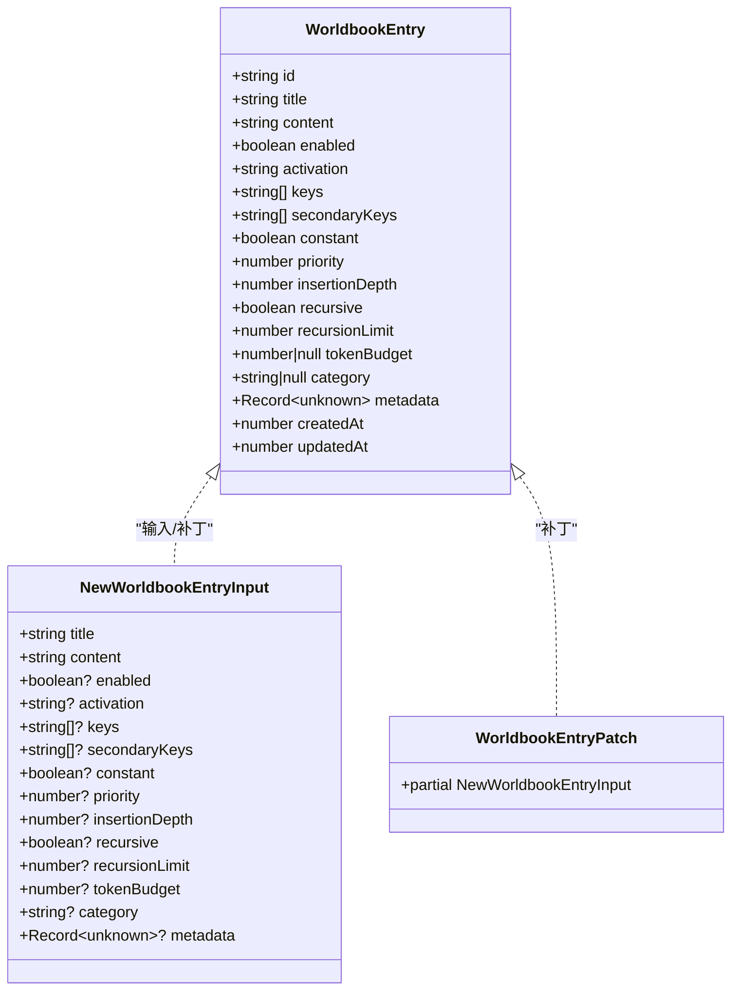
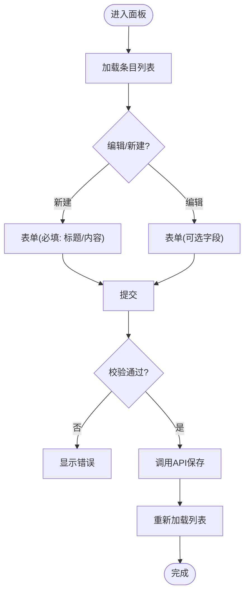
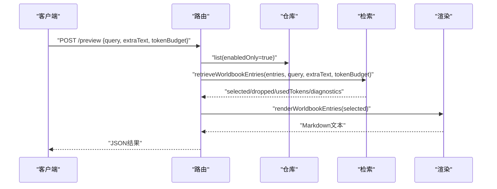
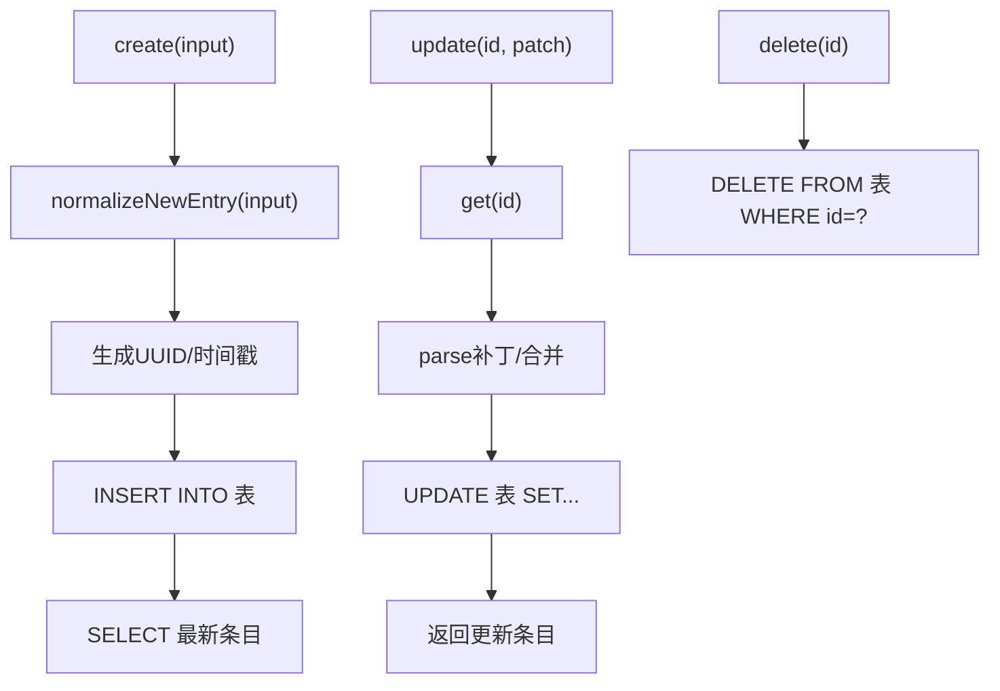
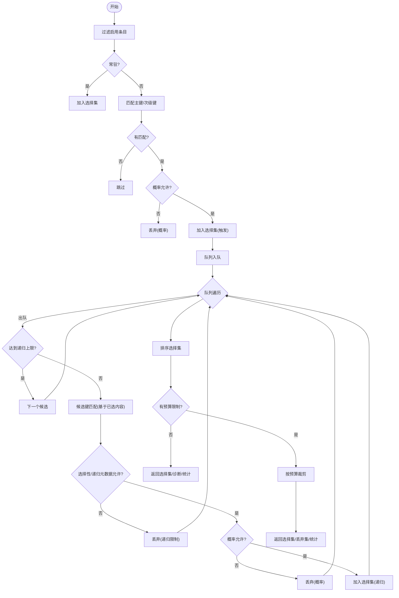
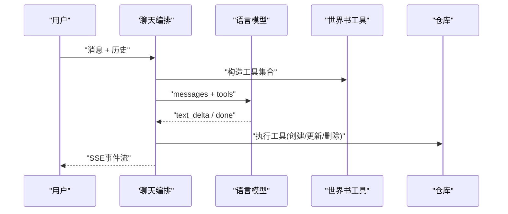
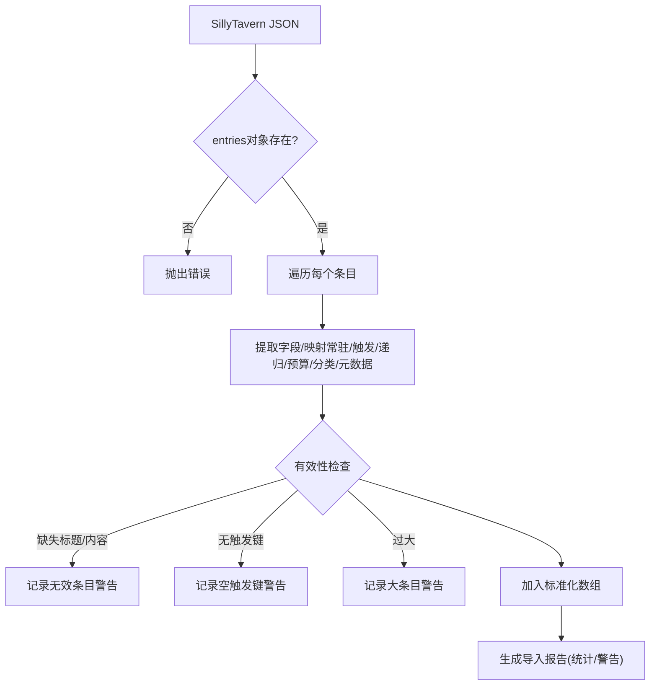
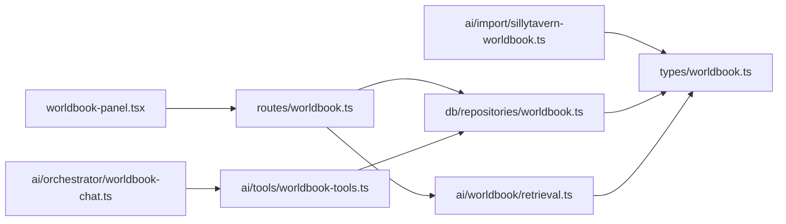

# 世界书管理

<cite>
**本文档引用的文件**
- [packages/shared/src/types/worldbook.ts](file://packages/shared/src/types/worldbook.ts)
- [packages/client/src/components/worldbook/worldbook-panel.tsx](file://packages/client/src/components/worldbook/worldbook-panel.tsx)
- [packages/server/src/db/repositories/worldbook.ts](file://packages/server/src/db/repositories/worldbook.ts)
- [packages/server/src/http/routes/worldbook.ts](file://packages/server/src/http/routes/worldbook.ts)
- [packages/server/src/ai/worldbook/retrieval.ts](file://packages/server/src/ai/worldbook/retrieval.ts)
- [packages/server/src/ai/tools/worldbook-tools.ts](file://packages/server/src/ai/tools/worldbook-tools.ts)
- [packages/server/src/ai/orchestrator/worldbook-chat.ts](file://packages/server/src/ai/orchestrator/worldbook-chat.ts)
- [packages/server/src/ai/import/sillytavern-worldbook.ts](file://packages/server/src/ai/import/sillytavern-worldbook.ts)
</cite>

## 目录
1. [简介](#简介)
2. [项目结构](#项目结构)
3. [核心组件](#核心组件)
4. [架构总览](#架构总览)
5. [详细组件分析](#详细组件分析)
6. [依赖关系分析](#依赖关系分析)
7. [性能考虑](#性能考虑)
8. [故障排除指南](#故障排除指南)
9. [结论](#结论)
10. [附录](#附录)

## 简介
本文件面向Scribe的“世界书”（Worldbook）管理功能，系统化说明其数据模型、前端界面、后端服务、检索与渲染机制、以及与故事内容的关联方式。重点覆盖以下方面：
- 世界书条目的组织结构：分类、层级插入深度、标签与元数据
- 创建、编辑、删除流程与权限控制
- 与故事内容的关联：键匹配触发、概率门控、递归扩展、令牌预算
- 搜索与过滤：全文检索、属性筛选、相关性排序
- API接口定义、数据模型与调用示例
- 导入导出：SillyTavern格式兼容与规范化处理

## 项目结构
世界书功能横跨共享类型定义、客户端界面、服务端路由与AI检索渲染等模块，采用分层设计：
- 共享层：定义世界书条目数据模型与输入/补丁模式
- 客户端：提供世界书面板UI，支持新建/编辑/删除、预览与诊断
- 服务端：HTTP路由暴露REST API；数据库仓库负责持久化；AI模块负责检索与渲染
- AI工具链：将世界书作为工具集成到聊天编排器中

图表来源
- [packages/shared/src/types/worldbook.ts:1-51](file://packages/shared/src/types/worldbook.ts#L1-L51)
- [packages/client/src/components/worldbook/worldbook-panel.tsx:1-415](file://packages/client/src/components/worldbook/worldbook-panel.tsx#L1-L415)
- [packages/server/src/http/routes/worldbook.ts:1-138](file://packages/server/src/http/routes/worldbook.ts#L1-L138)
- [packages/server/src/db/repositories/worldbook.ts:1-162](file://packages/server/src/db/repositories/worldbook.ts#L1-L162)
- [packages/server/src/ai/worldbook/retrieval.ts:1-326](file://packages/server/src/ai/worldbook/retrieval.ts#L1-L326)
- [packages/server/src/ai/tools/worldbook-tools.ts:1-63](file://packages/server/src/ai/tools/worldbook-tools.ts#L1-L63)
- [packages/server/src/ai/orchestrator/worldbook-chat.ts:1-36](file://packages/server/src/ai/orchestrator/worldbook-chat.ts#L1-L36)
- [packages/server/src/ai/import/sillytavern-worldbook.ts:1-156](file://packages/server/src/ai/import/sillytavern-worldbook.ts#L1-L156)

章节来源
- [packages/shared/src/types/worldbook.ts:1-51](file://packages/shared/src/types/worldbook.ts#L1-L51)
- [packages/client/src/components/worldbook/worldbook-panel.tsx:1-415](file://packages/client/src/components/worldbook/worldbook-panel.tsx#L1-L415)
- [packages/server/src/http/routes/worldbook.ts:1-138](file://packages/server/src/http/routes/worldbook.ts#L1-L138)
- [packages/server/src/db/repositories/worldbook.ts:1-162](file://packages/server/src/db/repositories/worldbook.ts#L1-L162)
- [packages/server/src/ai/worldbook/retrieval.ts:1-326](file://packages/server/src/ai/worldbook/retrieval.ts#L1-L326)
- [packages/server/src/ai/tools/worldbook-tools.ts:1-63](file://packages/server/src/ai/tools/worldbook-tools.ts#L1-L63)
- [packages/server/src/ai/orchestrator/worldbook-chat.ts:1-36](file://packages/server/src/ai/orchestrator/worldbook-chat.ts#L1-L36)
- [packages/server/src/ai/import/sillytavern-worldbook.ts:1-156](file://packages/server/src/ai/import/sillytavern-worldbook.ts#L1-L156)

## 核心组件
- 数据模型与校验
  - 条目激活模式：constant（常驻）与 triggered（触发）
  - 关键词：主键与次级键，支持大小写敏感与整词匹配
  - 层级与递归：插入深度、递归开关与递归限制
  - 预算与优先级：令牌预算、优先级、更新时间用于排序
  - 分类与元数据：分类字段与任意JSON元数据，含SillyTavern兼容字段
- 前端面板
  - 支持新建/编辑/删除条目
  - 预览查询与诊断输出，展示命中键与选择原因
  - SillyTavern兼容的高级选项（选择性、概率、扫描深度等）
- 服务端路由
  - 列表、创建、更新、删除、预览、聊天流式接口
- 数据库仓库
  - 提供持久化、合并更新、启用状态筛选与排序
- 检索与渲染
  - 常驻条目直选、触发键匹配、概率门控、递归扩展、令牌预算裁剪
  - 按优先级、原因、递归深度、更新时间排序
  - 渲染为带层级标题的Markdown片段
- AI工具与聊天编排
  - 将世界书增删改封装为工具，供LLM在对话中直接操作
- SillyTavern导入
  - 规范化键名、常驻/触发映射、概率与递归策略、元数据迁移

章节来源
- [packages/shared/src/types/worldbook.ts:3-50](file://packages/shared/src/types/worldbook.ts#L3-L50)
- [packages/client/src/components/worldbook/worldbook-panel.tsx:8-119](file://packages/client/src/components/worldbook/worldbook-panel.tsx#L8-L119)
- [packages/server/src/http/routes/worldbook.ts:29-134](file://packages/server/src/http/routes/worldbook.ts#L29-L134)
- [packages/server/src/db/repositories/worldbook.ts:54-159](file://packages/server/src/db/repositories/worldbook.ts#L54-L159)
- [packages/server/src/ai/worldbook/retrieval.ts:160-325](file://packages/server/src/ai/worldbook/retrieval.ts#L160-L325)
- [packages/server/src/ai/tools/worldbook-tools.ts:22-61](file://packages/server/src/ai/tools/worldbook-tools.ts#L22-L61)
- [packages/server/src/ai/import/sillytavern-worldbook.ts:75-155](file://packages/server/src/ai/import/sillytavern-worldbook.ts#L75-L155)

## 架构总览
世界书管理从UI到数据库再到AI检索形成闭环：用户通过面板提交条目，服务端路由验证并调用仓库持久化；检索时根据键匹配与概率门控选择条目，并按令牌预算裁剪；渲染结果可嵌入写作上下文；同时支持通过聊天工具直接修改世界书。

图表来源
- [packages/client/src/components/worldbook/worldbook-panel.tsx:129-179](file://packages/client/src/components/worldbook/worldbook-panel.tsx#L129-L179)
- [packages/server/src/http/routes/worldbook.ts:29-92](file://packages/server/src/http/routes/worldbook.ts#L29-L92)
- [packages/server/src/db/repositories/worldbook.ts:54-159](file://packages/server/src/db/repositories/worldbook.ts#L54-L159)
- [packages/server/src/ai/worldbook/retrieval.ts:160-325](file://packages/server/src/ai/worldbook/retrieval.ts#L160-L325)

## 详细组件分析

### 数据模型与类型系统
- 激活模式：constant/triggered
- 键匹配：主键与次级键，支持大小写敏感与整词匹配
- 递归与预算：递归开关、递归限制、令牌预算
- 排序：优先级降序、更新时间降序
- 元数据：任意JSON，包含SillyTavern兼容字段

图表来源
- [packages/shared/src/types/worldbook.ts:5-50](file://packages/shared/src/types/worldbook.ts#L5-L50)

章节来源
- [packages/shared/src/types/worldbook.ts:3-50](file://packages/shared/src/types/worldbook.ts#L3-L50)

### 前端面板与交互
- 表单字段：标题、内容、模式（常驻/触发）、分类、优先级、插入深度、键、次级键、启用、递归、递归限制、令牌预算
- SillyTavern兼容：选择性、概率、使用概率、扫描深度
- 功能：新建、编辑、删除、列表加载、预览查询与诊断展示

图表来源
- [packages/client/src/components/worldbook/worldbook-panel.tsx:129-179](file://packages/client/src/components/worldbook/worldbook-panel.tsx#L129-L179)

章节来源
- [packages/client/src/components/worldbook/worldbook-panel.tsx:1-415](file://packages/client/src/components/worldbook/worldbook-panel.tsx#L1-L415)

### 服务端路由与API
- GET /api/books/:bookId/worldbook：列出条目（启用或全部）
- POST /api/books/:bookId/worldbook：创建条目（输入校验）
- PUT /api/books/:bookId/worldbook/:entryId：更新条目（补丁校验）
- DELETE /api/books/:bookId/worldbook/:entryId：删除条目
- POST /api/books/:bookId/worldbook/preview：检索与渲染（可选额外文本与预算）
- POST /api/books/:bookId/worldbook/chat：聊天流式接口（记录对话历史）

图表来源
- [packages/server/src/http/routes/worldbook.ts:72-92](file://packages/server/src/http/routes/worldbook.ts#L72-L92)
- [packages/server/src/ai/worldbook/retrieval.ts:160-325](file://packages/server/src/ai/worldbook/retrieval.ts#L160-L325)

章节来源
- [packages/server/src/http/routes/worldbook.ts:29-134](file://packages/server/src/http/routes/worldbook.ts#L29-L134)

### 数据库仓库与持久化
- 创建：生成UUID，填充默认值，写入数据库，返回最新条目
- 查询：按优先级与更新时间排序，支持仅启用条目
- 更新：合并当前值与补丁，自动推导激活模式与常驻标志
- 删除：按ID删除

图表来源
- [packages/server/src/db/repositories/worldbook.ts:54-159](file://packages/server/src/db/repositories/worldbook.ts#L54-L159)

章节来源
- [packages/server/src/db/repositories/worldbook.ts:1-162](file://packages/server/src/db/repositories/worldbook.ts#L1-L162)

### 检索与渲染逻辑
- 常驻条目：直接加入选择集
- 触发条目：基于主键/次级键匹配，支持大小写敏感与整词匹配；SillyTavern选择性逻辑；概率门控
- 递归扩展：对已选条目的内容再次进行键匹配，受递归限制与SillyTavern递归元数据约束
- 令牌预算：按标题+内容字符长度估算令牌数，超过预算则按排序规则丢弃
- 排序：优先级、原因类别、递归深度、更新时间
- 渲染：按插入深度分组，输出带层级标题的Markdown

图表来源
- [packages/server/src/ai/worldbook/retrieval.ts:160-325](file://packages/server/src/ai/worldbook/retrieval.ts#L160-L325)

章节来源
- [packages/server/src/ai/worldbook/retrieval.ts:1-326](file://packages/server/src/ai/worldbook/retrieval.ts#L1-L326)

### AI工具与聊天编排
- 工具：创建、更新、删除世界书条目
- 编排：以系统提示引导AI使用工具，支持历史消息与最大步数限制，流式返回事件

图表来源
- [packages/server/src/ai/orchestrator/worldbook-chat.ts:19-35](file://packages/server/src/ai/orchestrator/worldbook-chat.ts#L19-L35)
- [packages/server/src/ai/tools/worldbook-tools.ts:22-61](file://packages/server/src/ai/tools/worldbook-tools.ts#L22-L61)

章节来源
- [packages/server/src/ai/orchestrator/worldbook-chat.ts:1-36](file://packages/server/src/ai/orchestrator/worldbook-chat.ts#L1-L36)
- [packages/server/src/ai/tools/worldbook-tools.ts:1-63](file://packages/server/src/ai/tools/worldbook-tools.ts#L1-L63)

### 导入与兼容性（SillyTavern）
- 字段映射：content/comment/name、key/keysecondary、constant/disable、order/depth、preventRecursion/excludeRecursion/group、概率/扫描深度等
- 元数据迁移：保留原始条目结构，便于回溯
- 规范化输出：生成标准世界书输入与导入报告（警告/统计）

图表来源
- [packages/server/src/ai/import/sillytavern-worldbook.ts:75-155](file://packages/server/src/ai/import/sillytavern-worldbook.ts#L75-L155)

章节来源
- [packages/server/src/ai/import/sillytavern-worldbook.ts:1-156](file://packages/server/src/ai/import/sillytavern-worldbook.ts#L1-L156)

## 依赖关系分析
- 组件耦合
  - 路由依赖仓库与检索模块
  - 检索模块依赖共享类型与SillyTavern元数据约定
  - 工具模块依赖仓库接口
  - 前端依赖共享类型与API客户端
- 外部依赖
  - better-sqlite3用于本地存储
  - Hono提供HTTP路由
  - ai库用于工具与流式响应

图表来源
- [packages/client/src/components/worldbook/worldbook-panel.tsx:1-6](file://packages/client/src/components/worldbook/worldbook-panel.tsx#L1-L6)
- [packages/server/src/http/routes/worldbook.ts:1-18](file://packages/server/src/http/routes/worldbook.ts#L1-L18)
- [packages/server/src/db/repositories/worldbook.ts:1-9](file://packages/server/src/db/repositories/worldbook.ts#L1-L9)
- [packages/server/src/ai/worldbook/retrieval.ts:1-1](file://packages/server/src/ai/worldbook/retrieval.ts#L1-L1)
- [packages/server/src/ai/tools/worldbook-tools.ts:1-8](file://packages/server/src/ai/tools/worldbook-tools.ts#L1-L8)
- [packages/server/src/ai/orchestrator/worldbook-chat.ts:1-5](file://packages/server/src/ai/orchestrator/worldbook-chat.ts#L1-L5)
- [packages/server/src/ai/import/sillytavern-worldbook.ts:1-6](file://packages/server/src/ai/import/sillytavern-worldbook.ts#L1-L6)
- [packages/shared/src/types/worldbook.ts:1-1](file://packages/shared/src/types/worldbook.ts#L1-L1)

章节来源
- [packages/server/src/http/routes/worldbook.ts:1-18](file://packages/server/src/http/routes/worldbook.ts#L1-L18)
- [packages/server/src/db/repositories/worldbook.ts:1-9](file://packages/server/src/db/repositories/worldbook.ts#L1-L9)
- [packages/server/src/ai/worldbook/retrieval.ts:1-1](file://packages/server/src/ai/worldbook/retrieval.ts#L1-L1)
- [packages/server/src/ai/tools/worldbook-tools.ts:1-8](file://packages/server/src/ai/tools/worldbook-tools.ts#L1-L8)
- [packages/server/src/ai/orchestrator/worldbook-chat.ts:1-5](file://packages/server/src/ai/orchestrator/worldbook-chat.ts#L1-L5)
- [packages/server/src/ai/import/sillytavern-worldbook.ts:1-6](file://packages/server/src/ai/import/sillytavern-worldbook.ts#L1-L6)
- [packages/shared/src/types/worldbook.ts:1-1](file://packages/shared/src/types/worldbook.ts#L1-L1)

## 性能考虑
- 键匹配复杂度
  - 正则转义与大小写处理：O(n)扫描，正则匹配取决于实现
  - 整词匹配使用边界断言，可能增加匹配成本
- 递归扩展
  - 递归深度受递归限制约束，避免指数爆炸
  - 建议合理设置递归上限与扫描深度
- 令牌预算
  - 使用字符长度估算令牌，实际应结合分词器
  - 预算裁剪按排序稳定，建议优先保留高优先级与触发原因
- 数据库排序
  - 列表查询按优先级与更新时间排序，建议在数据库侧建立复合索引以优化

## 故障排除指南
- 常见错误与处理
  - 书籍不存在：路由返回book_not_found
  - 条目不存在：更新/删除返回worldbook_entry_not_found
  - 输入校验失败：返回invalid_worldbook_entry或invalid_worldbook_patch及问题详情
  - 模型未配置：聊天接口返回model_not_configured
  - 预览/聊天无消息：message_required
- 前端错误展示
  - 面板捕获异常并显示错误信息
  - 预览诊断输出包含命中键与选择原因，便于定位问题
- 导入警告
  - 缺失标题/内容、空触发键、超大条目等会记录到导入报告

章节来源
- [packages/server/src/http/routes/worldbook.ts:35-70](file://packages/server/src/http/routes/worldbook.ts#L35-L70)
- [packages/server/src/http/routes/worldbook.ts:94-101](file://packages/server/src/http/routes/worldbook.ts#L94-L101)
- [packages/client/src/components/worldbook/worldbook-panel.tsx:130-134](file://packages/client/src/components/worldbook/worldbook-panel.tsx#L130-L134)
- [packages/server/src/ai/import/sillytavern-worldbook.ts:109-122](file://packages/server/src/ai/import/sillytavern-worldbook.ts#L109-L122)

## 结论
Scribe的世界书管理以清晰的数据模型为基础，配合前端面板、服务端路由与AI检索渲染，实现了从创建到应用的全链路能力。通过键匹配、概率门控、递归扩展与令牌预算，系统在灵活性与可控性之间取得平衡；SillyTavern导入兼容进一步提升了生态互通性。后续可在数据库索引、分词估算与可视化诊断方面持续优化。

## 附录

### API参考（概要）
- 获取条目列表
  - 方法：GET
  - 路径：/api/books/{bookId}/worldbook
  - 查询参数：无
  - 响应：{ entries: WorldbookEntry[] }
- 创建条目
  - 方法：POST
  - 路径：/api/books/{bookId}/worldbook
  - 请求体：NewWorldbookEntryInput
  - 响应：{ entry: WorldbookEntry }
- 更新条目
  - 方法：PUT
  - 路径：/api/books/{bookId}/worldbook/{entryId}
  - 请求体：WorldbookEntryPatch
  - 响应：{ entry: WorldbookEntry }
- 删除条目
  - 方法：DELETE
  - 路径：/api/books/{bookId}/worldbook/{entryId}
  - 响应：204 No Content
- 预览检索
  - 方法：POST
  - 路径：/api/books/{bookId}/worldbook/preview
  - 请求体：{ query: string, extraText?: string[], tokenBudget?: number }
  - 响应：{ selected, dropped, usedTokens, diagnostics, rendered: string }
- 世界书聊天
  - 方法：POST
  - 路径：/api/books/{bookId}/worldbook/chat
  - 请求体：{ message: string, history?: CoreMessage[] }
  - 响应：SSE事件流（text_delta/done等）

章节来源
- [packages/server/src/http/routes/worldbook.ts:29-134](file://packages/server/src/http/routes/worldbook.ts#L29-L134)

### 数据模型要点
- 必填字段：id、title、content、createdAt、updatedAt
- 可选字段：enabled、activation、keys、secondaryKeys、constant、priority、insertionDepth、recursive、recursionLimit、tokenBudget、category、metadata
- 激活模式与常驻标志的推导逻辑：若未显式设置，常驻条目默认激活为constant，触发条目默认激活为triggered

章节来源
- [packages/shared/src/types/worldbook.ts:5-50](file://packages/shared/src/types/worldbook.ts#L5-L50)
- [packages/server/src/db/repositories/worldbook.ts:34-51](file://packages/server/src/db/repositories/worldbook.ts#L34-L51)